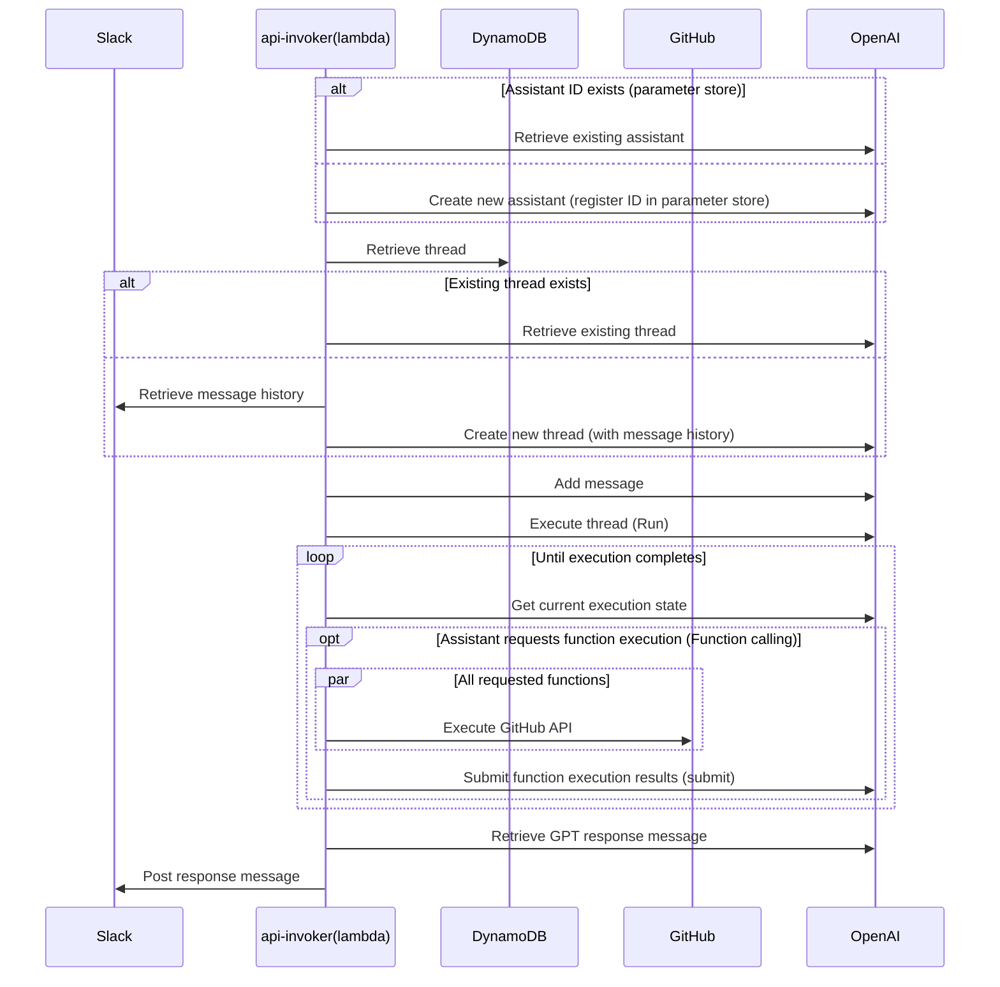

:::alert
This article has been automatically translated.
The original article is [here](https://developer.mamezou-tech.com/blogs/2023/12/06/slack-github-assistantsapi/).
:::


This is the article for the 6th day of the Mamezou Developer Site Advent Calendar 2023.

Previously, I introduced the Assistants API of OpenAI and created a simple CLI-based chat tool in the following article:

- [Trying Out OpenAI's Assistants API (Beta Version)](/blogs/2023/11/08/openai-assistants-api-intro/)

For this Advent Calendar article, I would like to develop this further into something more practical by enabling chatting with GPT using the Assistants API on Slack.

Although this type of app can also be implemented using just the Chat Completion API, managing the conversation context on our own was cumbersome. The Assistants API manages this state as threads, making it easier to implement natural conversations.

To make it more interesting, this time I would like to combine Function calling so that the chatbot can also perform GitHub operations such as review comments and merges on behalf of the reviewer. This is a very simplistic idea that reviews would proceed smoothly if AI could participate in code reviews.
Eventually, you will be able to review with an assistant through Slack as shown below.


Whether or not the reviews actually become more efficient is another matter, but they certainly become more enjoyable!

# Overall System Configuration

This system is built on AWS. The overall configuration is as follows:


It is composed of the minimum necessary services, with the main logic implemented in two Lambdas. We will look at the details of each below.

The entire source code is published in the following repository (please forgive the roughness of the code):

- <https://github.com/mamezou-tech/slack-github-review-gptbot/>

:::alert
Please be aware that using OpenAI may incur charges, so it is recommended to set a cost limit (Usage Limit) within an acceptable range from the OpenAI API UI.

Also, the Assistants API of OpenAI is in beta. I intend to update the repository when it reaches GA, but please forgive any delays.
:::

# Event Callback (callback)

First is the first Lambda. This Lambda implements the callback API for the Slack App (bot). It is triggered in response to mentions to the Slack App (`app_mentions` event). There is no significant implementation in this API itself. It executes the following Lambda (api-invoker) asynchronously and immediately returns a success response to Slack.

The reason for not calling the Assistants API directly here is that the Slack App needs to return a success response within 3 seconds [^1]. If we interact with the Assistants API here, it is highly likely that Slack will consider the callback to have failed and retries may occur.

[^1]: <https://api.slack.com/apis/connections/events-api#responding>

The source code for the event callback is [functions/callback.ts](https://github.com/mamezou-tech/slack-github-review-gptbot/blob/main/functions/callback.ts). Here is an excerpt:

```typescript
export const handler: APIGatewayProxyHandler = async (event) => {
  const request: SlackRequest = JSON.parse(event.body || '{}');
  switch (request.type) {
    case 'event_callback': {
      const event: LambdaEvent = {
        channel: request.event.channel,
        text: request.event.text.replaceAll(/<@U[0-9A-Z]+>/g, ''), // Remove mentions
        ts: request.event.ts,
        threadTs: request.event.thread_ts,
        threadBroadcast: request.event.subtype === 'thread_broadcast'
      };
      await lambdaClient.send(
        new InvokeCommand({
          InvocationType: 'Event', // Asynchronous execution
          FunctionName: process.env.API_INVOKER_NAME,
          Payload: JSON.stringify(event)
        })
      );

      return {
        statusCode: 200,
        body: '',
        headers: {
          'Content-Type': 'text/plain'
        }
      };
    }
    case 'url_verification':
      return {
        statusCode: 200,
        body: request.challenge,
        headers: {
          'Content-Type': 'text/plain'
        }
      };
  }
};
```

The part with `lambdaClient.send` is where the following Lambda is executed. Here, the necessary information is converted into JSON and passed on. At this time, `InvocationType` is set to `Event` for asynchronous execution [^2], and a 200 response is immediately returned to Slack.

[^2]: If you want to make full use of AWS's advanced error handling or batch execution features, it may be good to replace it with SQS.

For more details about the mention event on Slack, please refer to the following official document.

- [Slack API Doc - Event Type - app_mention](https://api.slack.com/events/app_mention)

As you can see from the source code, requests of type `url_verification` are also processed here. This corresponds to Slack's URL verification request. When setting a callback URL for a Slack App, Slack issues a request to verify that URL. To pass this verification, it is necessary to return the `challenge` included in the request as the response.
For more details, please refer to the following document.

- [Slack API Doc - Using the Slack Events API - Request URL configuration and verification ](https://api.slack.com/apis/connections/events-api#verification)

Although it is not the main topic and is omitted here, it is necessary to verify that the request is from Slack when operating in production. For more details, please refer to the official document.

- [Slack API Doc - Verifying requests from Slack](https://api.slack.com/authentication/verifying-requests-from-slack)

# Assistant API Execution (api-invoker)

The latter part is a bit more complex. This Lambda function interacts with GPT through the assistant and thread. The result is posted to Slack via the Slack Web API's [postMessage](https://api.slack.com/methods/chat.postMessage). If the assistant requests a function call, the specified function/arguments are executed using the GitHub API, and the result is passed on. Whether to call a function or retrieve a response from GPT is left to the assistant's judgment (Assistants API).

The overall sequence is as follows:



The source code is quite extensive, so I would like to highlight the important parts.

## Lambda Event Handler

The entry point function for Lambda is [functions/api-invoker.ts](https://github.com/mamezou-tech/slack-github-review-gptbot/blob/main/functions/api-invoker.ts).

```typescript
export const handler: Handler = async (event: LambdaEvent) => {
  const slackClient = new WebClient(await getParameter('slackBotToken'));

  try {
    // Conversing with the assistant
    const replies = await chat(event, slackClient);
    // Posting results to Slack
    const blocks: SectionBlock[] = replies.map((text) => ({
      type: 'section',
      text: {
        type: 'mrkdwn',
        text
      }
    }));
    const slackResp = await slackClient.chat.postMessage({
      channel: event.channel,
      thread_ts: event.threadTs ?? event.ts,
      text: replies.join('\n'),
      reply_broadcast: event.threadBroadcast, // If the mention message replies to the channel, the assistant's reply will also match
      blocks
    });
    console.log(slackResp);
  } catch (e) {
    console.log('failed...', { e });
    const slackResp = await slackClient.chat.postMessage({
      channel: event.channel,
      thread_ts: event.threadTs ?? event.ts,
      text: 'Sorry, there was a problem and I couldn't reply...',
      reply_broadcast: event.threadBroadcast
    });
    console.log(slackResp);
  }
};
```

This is simple. It receives the Slack post content from the aforementioned callback API and delegates to [chat.ts](https://github.com/mamezou-tech/slack-github-review-gptbot/blob/main/functions/chat.ts) to interact with the Assistants API. The necessary interactions take place here, and the results are posted to Slack as thread replies (`thread_ts` is specified).

The following is the processing inside chat.ts.

## Conversing with the Assistant

The main process for interacting with the Assistants API is the chat function.

```typescript
export async function chat(event: LambdaEvent, slackClient: WebClient): Promise<string[]> {
  const apiKey = await getParameter('openAIApiKey');
  const openai = new OpenAI({ apiKey });
  const key = event.threadTs ?? event.ts;
  // Step1. Assistant
  const assistant = await createOrGetAssistant(openai);

  // Step2. Thread
  const thread = await createOrGetThread(event, key, { slackClient, openai });

  // Step3. Message
  await createMessage(openai, thread, event);

  // Step4. Run
  const run = await openai.beta.threads.runs.create(thread.id, {
    assistant_id: assistant.id
  });

  // Step5. wait...
  // eslint-disable-next-line no-constant-condition
  while (true) {
    await new Promise((resolve) => setTimeout(resolve, 1000));
    const currentRun = await openai.beta.threads.runs.retrieve(
      thread.id,
      run.id
    );
    if (currentRun.status === 'completed') {
      break;
    } else if (currentRun.status === 'requires_action') {
      const toolCalls =
        currentRun.required_action?.submit_tool_outputs.tool_calls;
      const chain = toolCalls?.filter((call) => call.type === 'function') ?? [];
      if (!chain.length) throw new Error('no function...');
      await callFunctions(chain, thread.id, run.id, openai);
    } else if (
      currentRun.status === 'failed' ||
      currentRun.status === 'cancelled' ||
      currentRun.status === 'expired'
    ) {
      throw new Error(currentRun.status);
    }
  }

  // Step6. Response
  const messages = await openai.beta.threads.messages.list(thread.id);

  const result = [];
  for (const message of messages.data) {
    if (message.role === 'user') break;
    for (const c of message.content) {
      switch (c.type) {
        case 'text':
          result.push(c.text.value);
          break;
        case 'image_file':
          console.log('image_file', c.image_file.file_id);
          result.push('An image file was returned, but it is not yet supported');
      }
    }
  }
  return result;
}
```

This follows the proper procedure for the Assistants API. It creates or retrieves an assistant, creates or retrieves a thread, adds a message to the thread, and executes it. After executing the thread, it polls until the status becomes `completed`. During this, if the status changes to `requires_action`, the callFunctions function (described below) is executed (Function calling). After completion, the thread's messages are retrieved and returned (the results are posted to Slack).
This procedure is also mentioned in [the previous article](/blogs/2023/11/08/openai-assistants-api-intro/), so please refer there for more details.

The following describes the private functions called here.

## Creating an Assistant

The function for creating or retrieving an assistant (createOrGetAssistant) is as follows.

```typescript
async function createOrGetAssistant(openai: OpenAI) {
  try {
    // Retrieve existing assistant ID from SSM Parameter Store
    const assistantId = await getParameter('openAIAssistantId');
    return await openai.beta.assistants.retrieve(assistantId);
  } catch (e) {
    // Create a new assistant
    const githubFunctions: OpenAI.Beta.Assistant.Function[] =
      functionDefinitions.map((def) => ({
        type: 'function',
        function: def
      }));
    const assistant = await openai.beta.assistants.create({
      name: await getParameter('assistantName'),
      instructions: await getParameter('assistantInstruction'),
      tools: [{ type: 'code_interpreter' }, ...githubFunctions],
      model: await getParameter('openAIModel'),
      file_ids: []
    });
    await ssmClient.send(
      new PutParameterCommand({
        Name: parameterNames.openAIAssistantId,
        Type: 'String',
        Value: assistant.id,
        Overwrite: true
      })
    );
    return assistant;
  }
}
```

The assistant is reused rather than being created anew each time (it is persisted on the OpenAI side). If a new assistant is created, the assistant ID assigned by the Assistants API is saved in the Parameter Store, and the same assistant is used next time.

:::column:SSM Parameter Store Lambda Extension
The frequently used `getParameter` retrieves values from the SSM Parameter Store. Although it is beyond the main topic and not mentioned here, internally it uses the SSM Parameter Store Lambda Extension provided by AWS to cache the values.

```typescript
export async function getParameter(name: keyof typeof parameterNames): Promise<string> {
  const params = new URLSearchParams();
  params.set('name', parameterNames[name]);
  params.set('withDecryption', 'true');
  const resp = await fetch(
    `http://localhost:${extensionPort}/systemsmanager/parameters/get?${params.toString()}`,
    {
      headers: {
        'X-Aws-Parameters-Secrets-Token': process.env.AWS_SESSION_TOKEN ?? '' // required for Lambda extension
      }
    }
  );
  if (resp.ok) {
    const output = (await resp.json()) as GetParameterCommandOutput;
    return output.Parameter?.Value ?? '';
  } else {
    throw new ParameterError(`${name}:${resp.status}:${await resp.text()}`, resp);
  }
}
```

For more details about the Lambda extension, please refer to the official document.

- [AWS SSM Doc - Using Parameter Store parameters in AWS Lambda functions](https://docs.aws.amazon.com/systems-manager/latest/userguide/ps-integration-lambda-extensions.html)
:::

## Creating a Thread

The function for creating or retrieving a thread used by the Assistants API (createOrGetThread) is as follows.

```typescript
async function createOrGetThread(event: LambdaEvent, threadTs: string, opts: {
  openai: OpenAI,
  slackClient: WebClient
}): Promise<OpenAI.Beta.Threads.Thread> {
  const { openai, slackClient } = opts;
  const record = await documentClient.send(
    new GetCommand({
      TableName: process.env.OPENAI_THREAD_TABLE,
      Key: {
        threadTs
      }
    })
  );

  if (record.Item) {
    console.log('found dynamodb record', record.Item);
    const threadId = record.Item?.threadId;
    return openai.beta.threads.retrieve(threadId ?? '');
  }

  console.log('not found dynamodb record. creating new thread...');
  const initialMessages = await makeInitialMessages(event, slackClient);
  the thread = await openai.beta.threads.create({
    messages:
      initialMessages as OpenAI.Beta.Threads.ThreadCreateParams.Message[]
  });
  try {
    await documentClient.send(
      new PutCommand({
        TableName: process.env.OPENAI_THREAD_TABLE,
        Item: {
          threadTs: threadTs, // partition key (on Slack's side)
          threadId: thread.id, // thread identifier on OpenAI's side
          expiration: (Math.floor(Date.now() / 1000) + 3 * 24 * 60 * 60).toString() // expires in 3 days
        }
      })
    );
  } catch (e) {
    console.log('failed to put thread to DynamoDB...', { e });
  }
  return thread;
}
```

Conversation threads (message history) in the Assistants API are maintained with the thread ID as the key. There is no need for the client side (here, the Lambda function) to manage the message history, but it is necessary to maintain the linkage state between the Assistants API and Slack threads. Here, DynamoDB is used for this linkage. If there is an existing thread in the Assistants API for the Slack thread timestamp (threadTs), the thread is retrieved from OpenAI.

If there is no existing thread, a new thread is created, and the linkage information is saved in DynamoDB.

When creating a new thread, the Slack Web API is used to retrieve messages from the Slack side of the thread (or channel) to maintain the conversational context held by Slack. This part is not the main topic, so the source code is omitted. It can be referenced [here](https://github.com/mamezou-tech/slack-github-review-gptbot/blob/main/functions/chat.ts#L202).

## Function Calling

The function for executing the GitHub API (callFunctions function) is executed when the client side determines that function execution is necessary (when the status changes to `requires_action`). Here, the specified GitHub API is executed, and the result is communicated to the assistant.

In [the previous article](/blogs/2023/11/08/openai-assistants-api-intro/), the Function calling part was simulated by executing a function and returning a fixed value. This time, it is an important part of the functionality. The implementation is as follows:

```typescript
async function callFunctions(chain: OpenAI.Beta.Threads.Runs.RequiredActionFunctionToolCall[], threadId: string, runId: string, openai: OpenAI) {
  const funcResults = chain.map(async (func) => {
    try {
      // Execute the function (GitHub API) specified by the assistant
      const resp = await functions[func.function.name].call(this, JSON.parse(func.function.arguments));
      const output = JSON.stringify,(resp);
      return {
        tool_call_id: func.id,
        output
      };
    } catch (e) {
      console.log('function calling error:', { e });
      return {
        tool_call_id: func.id,
        output: (e as Error).message
      };
    }
  });
  await openai.beta.threads.runs.submitToolOutputs(threadId, runId, {
    tool_outputs: await Promise.all(funcResults) // Execute in parallel
  });
}
```

The update in November 2023 allowed Function calling to execute multiple functions simultaneously. Here, the functions requested to be executed are run in parallel, and their results are collectively communicated using `threads.runs.submitToolOutputs`. This returns the thread execution status to `in_progress`, and the polling process resumes. At this point, the assistant decides whether to execute a function again or retrieve results from GPT.

The functions to be executed in Function calling are defined according to the specifications of the GitHub API. The source code is [here](https://github.com/mamezou-tech/slack-github-review-gptbot/blob/main/functions/github.ts). This is where the function bodies (`functions`) and JSON schema are implemented (this schema is set during assistant creation). The functions are charged as system messages, so the APIs to be used from the [GitHub API](https://docs.github.com/en/rest?apiVersion=2022-11-28) are selectively chosen. Similarly, the communication of execution results (submitToolOutputs) also selectively includes only necessary items from the GitHub API responses.

:::info
Function calling is introduced in the following article, so a detailed explanation is omitted here.

- [Exploring Function calling added to OpenAI's Chat API](/blogs/2023/06/14/gpt-function-calling-intro/)
:::

# Deploying the App (AWS CDK)

The app is deployed using AWS CDK. A CDK project was created in the `cdk` directory at the root of the project.

Although it is not the main topic, the full source code is omitted, but you can check the contents from [cdk/lib/cdk-stack.ts](https://github.com/mamezou-tech/slack-github-review-gptbot/blob/main/cdk/lib/cdk-stack.ts). It defines the configuration of the Lambda itself, the applicable IAM roles, and the DynamoDB table.

The definition of the Lambda functions is as follows:

```typescript
// ① Callback API (callback)
const callback = new NodejsFunction(this, 'SlackEventCallbackFunction', {
  role: callbackRole,
  functionName: `${this.stackName}-callback`,
  description: 'Slack event callback entry point',
  entry: '../functions/callback.ts',
  handler: 'handler',
  runtime: lambda.Runtime.NODEJS_18_X,
  logRetention: RetentionDays.ONE_MONTH,
  timeout: Duration.seconds(3), // Slack's timeout threshold
  environment: {
    API_INVOKER_NAME: `${this.stackName}-api-invoker`
  }
});
const funcUrl = new lambda.FunctionUrl(this, 'SlackEventCallbackFunctionUrl', {
  function: callback,
  authType: FunctionUrlAuthType.NONE
});

// ② Assistant API Execution (api-invoker)
// https://docs.aws.amazon.com/systems-manager/latest/userguide/ps-integration-lambda-extensions.html
// AWS Lambda extension (SSM Parameter Store cache)
const parameterStoreExtension = lambda.LayerVersion.fromLayerVersionArn(this, 'ParameterStoreExtension',
  'arn:aws:lambda:ap-northeast-1:133490724326:layer:AWS-Parameters-and-Secrets-Lambda-Extension:11');
const invoker = new NodejsFunction(this, 'GptApiInvokerFunction', {
  role: invokerRole,
  functionName: `${this.stackName}-api-invoker`,
  description: 'Invoke OpenAI Assistants API',
  entry: '../functions/api-invoker.ts',
  handler: 'handler',
  logRetention: RetentionDays.ONE_MONTH,
  runtime: lambda.Runtime.NODEJS_18_X,
  timeout: Duration.seconds(120), // Extended for Assistants API
  layers: [parameterStoreExtension], // Parameter store cache
  environment: {
    OPENAI_THREAD_TABLE: `${this.stackName}-OpenAIThread`,
    PARAMETER_NAME_PREFIX: parameterNamePrefix
  }
});
```

The simplicity is prioritized, and the callback API for Slack is enabled with a Lambda Function URL[^3]. If more detailed control is desired, replacing it with API Gateway or ALB might be beneficial.

[^3]: Lambda Function URL is also introduced in [this article](/blogs/2022/04/14/lambda-function-url/).

The Lambda function for executing the Assistant API is configured considering the following:

- Timeout set to 2 minutes to withstand the conversation with the Assistant API
- AWS-provided Lambda layer for parameter store cache added as a Lambda extension

Finally, DynamoDB. The table definition that links Slack and Assistants API threads is as follows:

```typescript
new dynamodb.Table(this, 'ThreadRelationTable', {
  tableName: `${this.stackName}-OpenAIThread`,
  billingMode: BillingMode.PAY_PER_REQUEST,
  partitionKey: {
    name: 'threadTs', // Slack thread identifier
    type: AttributeType.STRING
  },
  encryption: TableEncryption.AWS_MANAGED,
  timeToLiveAttribute: 'expiration', // Deletes records after a certain period
  removalPolicy: RemovalPolicy.DESTROY
});
```

The partition key is set as the timestamp of the Slack thread. Additionally, TTL (timeToLiveAttribute) is enabled to delete records after a certain period has elapsed [^4].

[^4]: In the implementation, records are set to be deleted after 3 days, but there is currently no mention of thread expiration in the beta version of the Assistants API documentation.

The deployment is executed using the CDK CLI (specify stackName).

```shell
cdk deploy --context stackName=<your-stack-name>
> ...(omitted)
>  ✅  CdkStack (<your-stack-name>)
>
> ✨  Deployment time: 42.11s
>
> Outputs:
> CdkStack.lambdafunctionurl = https://xxxxxxxxxxxxxxxxxxxxxxxxxxxxxxxx.lambda-url.ap-northeast-1.on.aws/
```

The callback API URL is output, so make a note of it.

# Preparing the Slack App

With the AWS side prepared, let's set up the related systems. First is the Slack App. The Slack App will handle roles such as mention events and reply message posting.

The setup is basically as per the following official document, so detailed steps are omitted.

- [Slack Apps - Quickstart](https://api.slack.com/start/quickstart)

Only the necessary items are explained below.

### Event Subscriptions

For the callback URL, set the callback API's Function URL noted earlier. When you enter it, Slack automatically starts verifying the URL. If the verification fails, there may be a failure in handling the `url_verification` type event.

Select `app_mention` for the bot events to subscribe to. This will make the [event callback](#event-callbackcallback) API be called when the Slack App is mentioned.


### OAuth & Permissions

Select the following permissions:

- app_mentions:read: Read mention messages
- channels:history / groups:history: Retrieve channel message history (when creating a new thread on the Assistants API side)
- chat:write: Post conversation responses with the assistant


Also, note the bot token below, as it is necessary for accessing the Slack API.


Finally, install the created Slack App in the workspace where it will be used.


After installation, invite this Slack App to a Slack channel of your choice (`/invite @<bot-name>` etc.).

# Preparing the GitHub App

Next is the GitHub side. Create a GitHub App so that the assistant can perform pull request operations via Function calling. The creation of the GitHub App is also straightforward according to the official documentation, so detailed steps are omitted.

- [GitHub App Doc - Registering a GitHub App](https://docs.github.com/en/apps/creating-github-apps/registering-a-github-app/registering-a-github-app)

Note that we are not using Web Hooks here. The default is checked, so uncheck it. This makes it unnecessary to enter a callback URL (Webhook URL).


After creation, note the App ID and private key. Both are used for accessing the GitHub API [^5].

[^5]: Although it is beyond the main topic and not discussed in this article, authentication is performed using the private key obtained earlier. The source code is [here](https://github.com/mamezou-tech/slack-github-review-gptbot/blob/main/functions/github.ts#L6).


Finally, from the Permissions & events menu, grant the GitHub App the following repository operations:

- Contents: Read and write: Browse and update repositories
- Pull Requests: Read and write: Various pull request operations


Once this is done, install the GitHub App on the personal account or organization where it will be used.


# Testing

Now that everything is set up, it's time for a test. Before that, register the necessary configuration values. This app assumes that all settings are stored in the SSM Parameter Store. Register the following values in the Parameter Store in advance.

| Path                                  | Content                                       |
|-------------------------------------|------------------------------------------|
| /slack/app/gpt/botToken             | Bot token generated during Slack App creation                |
| /slack/app/gpt/githubApp/privateKey | Private key (PEM) generated during GitHub App creation          |
| /slack/app/gpt/githubApp/appId      | App ID generated during GitHub App creation                |
| /slack/app/gpt/openai/apiKey        | OpenAI API key (issued from OpenAI's UI)          |
| /slack/app/gpt/model                | Model name used in the Assistants API (e.g., gpt-4)          |
| /slack/app/gpt/instruction          | Custom instruction for the Assistants API (GPT's system setting) |
| /slack/app/gpt/name                 | Assistant name in the Assistants API                   |

**After Setting**


Let's simulate a pull request review. Here, the following pull request has been created.


First, ask the assistant about any unmerged pull requests.


The assistant correctly searches for unmerged pull requests. The Assistants API analyzes the given URL, retrieves the owner and repository name, creates arguments, and executes the GitHub API via Function calling.

Next, ask about the changes in the source code.


The assistant, possessing the intelligence of GPT-4, will review the source code for any issues.


A very reasonable remark. Let's have the assistant kindly comment on the pull request.


On the GitHub UI, it looked like this:


The review comment was nicely written, but it pointed out the wrong line. The Function calling for generating review comments may need some tuning.

Having corrected the review comment, approve the review.


It was confirmed on the GitHub side as well.


Finally, merge the pull request.


Of course, it was properly merged on the GitHub side as well.


# Summary

Although there is still room for adjustment, having an (arguably more competent) assistant participate in reviews and even handle pull request operations has made the review process much more enjoyable. However, if this is developed further to the point where the assistant can handle all reviews and issue corrections, human reviewers might become unnecessary... or so one might think (especially since GPT can write code, making reviews somewhat redundant).
