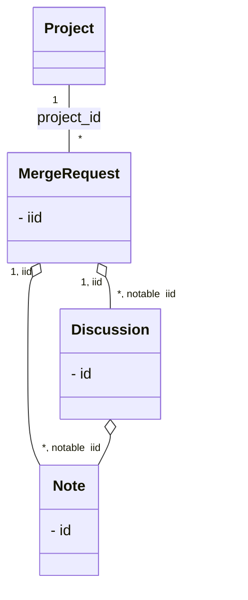

:::alert
This article has been automatically translated.
The original article is [here](https://developer.mamezou-tech.com/blogs/2024/03/05/collect-gitlab-review-comment/).
:::


## Overview

There was a request to collect review comments on GitLab, and I thought it would be easy just to call the API in sequence to implement it, but I got stuck in unexpected places, so I wrote this article as a note.

## Environment

* GitLab Enterprise Edition 15.10.3
* GitLab Enterprise Edition 16.10.0

## Steps Taken in Tool Creation

The goal was to collect review comments registered in merge requests of GitLab projects and create source data to check the trends of the points raised.

### 1. Preparing an Access Token

To access GitLab using the API, prepare an access token in advance.

* Creating an access token


* Copying the access token


  :::info
  As mentioned in secret, since the access token cannot be reconfirmed, it is recommended to take a note of it.
  :::

### 2. Confirming That the Project Can Be Retrieved

First, check if the target project can be retrieved as a trial.

* Confirming the project ID


* Checking if the project can be retrieved

  ```sh
  GET {GitLab hosting site}/api/v4/projects/{project-id}?private_token={access-token}
  ```

### 3. Confirming That Merge Requests Associated with the Project Can Be Retrieved

Next, check if merge requests associated with the project can be retrieved.

```sh
GET {GitLab hosting site}/api/v4/projects/{project-id}/merge_requests?private_token={access-token}

// Omitting attributes other than the main ones
// Omitting merge requests other than those used for explanation
HTTP/1.1 200 OK
[
  {
    "id": 286186872,
    "iid": 1,
    "project_id": {project-id},
    "title": "1st merge",
    "description": "",
    "state": "merged",
  }, 
  // ～
]
```

:::info

* The key to identify merge requests associated with the project is not "id" but "iid".
* The API retrieves 20 items per page. If it exceeds 100 items, it is necessary to switch pages and retrieve multiple times.
  * Example of specification: ~/merge_requests?per_page=100&page=1
  * Page specification: page
  * Number of items retrieved per page: per_page

:::

### 4. Confirming That a Specific Merge Request Can Be Retrieved

Confirm that a specific merge request can be retrieved.
Use the "iid" obtained in the previous step as the key.

```sh
GET {GitLab hosting site}/api/v4/projects/{project-id}/merge_requests/{merge_request_id}?private_token={access-token}

// Omitting attributes other than the main ones
HTTP/1.1 200 OK
{
  "id": 286186872,
  "iid": 1,
  "project_id": {project-id},
  "title": "1st merge",
  "description": "",
  "state": "merged",
}
```

### 5. Retrieving Comments Associated with the Merge Request

Finally, we start collecting review comments.
It seems that comments associated with merge requests can be retrieved using the Note API, so we tried using it first.


```sh
GET {GitLab hosting site}/api/v4/projects/project-id/merge_requests/1/notes?private_token={access-token}

// Omitting attributes other than the main ones
// Omitting parts other than the screenshot section shown as an example of review comment
HTTP/1.1 200 OK
[
  {
    "id": 1798829788,
    "type": "DiffNote",
    "body": "OK",
    "attachment": null,
    "system": false,
    "noteable_id": 286186872,
    "noteable_type": "MergeRequest",
    "project_id": {project-id},
    "resolvable": true,
    "resolved": true,
    "resolved_at": "2024-03-04T06:22:14.608Z",
    "noteable_iid": 1,
  },
  {
    "id": 1798821763,
    "type": "DiffNote",
    "body": "Review comment on the same line (3)",
    "system": false,
    "noteable_id": 286186872,
    "noteable_type": "MergeRequest",
    "project_id": {project-id},
    "resolvable": true,
    "resolved": true,
    "resolved_at": "2024-03-04T06:22:14.608Z",
    "noteable_iid": 1,
  },
  {
    "id": 1798821533,
    "type": "DiffNote",
    "body": "Review comment (3)",
    "system": false,
    "noteable_id": 286186872,
    "noteable_type": "MergeRequest",
    "project_id": {project-id},
    "resolvable": true,
    "resolved": true,
    "resolved_at": "2024-03-04T06:22:28.497Z",
    "noteable_iid": 1,
  },
  {
    "id": 1798821126,
    "type": "DiffNote",
    "body": "Review comment on the same line (3)",
    "system": false,
    "noteable_id": 286186872,
    "noteable_type": "MergeRequest",
    "project_id": {project-id},
    "resolvable": true,
    "resolved": true,
    "resolved_at": "2024-03-04T06:22:14.608Z",
    "noteable_iid": 1,
  },
  {
    "id": 1798821124,
    "type": "DiffNote",
    "body": "Review comment (3)",
    "system": false,
    "noteable_id": 286186872,
    "noteable_type": "MergeRequest",
    "project_id": {project-id},
    "resolvable": true,
    "resolved": true,
    "resolved_at": "2024-03-04T06:22:28.497Z",
    "noteable_iid": 1,
  },
  {
    "id": 1798819335,
    "type": null,
    "body": "assigned to ～",
    "system": true,
    "noteable_id": 286186872,
    "noteable_type": "MergeRequest",
    "project_id": {project-id},
    "resolvable": false,
    "noteable_iid": 1,
  },
  {
    "id": 1798819334,
    "type": null,
    "body": "requested review from ～",
    "system": true,
    "noteable_id": 286186872,
    "noteable_type": "MergeRequest",
    "project_id": {project-id},
    "resolvable": false,
    "noteable_iid": 1,
  },
  // ～
]
```

| Attribute Name | Summary | Remarks |
|---|---|---|
| id | Identifier of the note ||
| type | Type of note ||
| body | Note text ||
| system | Flag to determine if the system output ||
| noteable_id | ID assigned to the object associated with the note ||
| noteable_type | Type of object associated with the note | Other than merge requests, there are issues, snippets, epics |
| resolvable | Flag to determine if the note is resolvable ||
| resolved | Flag to determine if the note is resolved ||
| resolved_at | Date and time the note was resolved ||
| noteable_iid | ID assigned to the object associated with the note ||

Since we wanted to create data for analyzing review comment trends, it was necessary to exclude "notes output by the system" and "notes exchanged in response to review comments".  
Notes output by the system can be excluded by excluding those where "system is true".  
It was difficult to exclude notes exchanged in response to review comments because there is no information indicating the relationship between the notes.

### 6. Reconsidering the Problem

Since they are always displayed in order on GitLab, there must be information indicating the relationship, so we investigated the following.

* Is there a special option in the API?
  * Apparently not according to the documentation
* Is there a special meaning by combining multiple attributes?
  * Tried various patterns of notes, but this does not seem to be the case
* Does a collection object of notes exist?
  * It is easy to delete a note.
  * If the notes themselves had a before and after relationship, every time the note deletion API is executed, it would have to be aware of other resources.
* Can't it be obtained with the publicly available API?

### 7. Using the Discussion API to Check Comments Associated with Merge Requests

After reconfirming the documentation for notes and threads, there indeed was a concept equivalent to a collection of notes.  
Discussions are a concept that combines related notes and can be obtained in an array format as `notes` elements.

Let's try using the Discussion API right away.

```sh
GET {GitLab hosting site}/api/v4/projects/{project-id}/merge_requests/{merge_request_id}/discussions?private_token={access-token}

// Omitting attributes other than the main ones
// Omitting parts other than the screenshot section shown as an example of review comment
HTTP/1.1 200 OK
[
  {
    "id": "c01e1c0a1bd309ba0321ddb0d29ca75e5878dc44",
    "individual_note": true,
    "notes": [
      {
        "id": 1798819334,
        "type": null,
        "body": "requested review from ～",
      }
    ]
  },
  {
    "id": "1a351de7da788384493e2a10cfed58ccab1e1261",
    "individual_note": true,
    "notes": [
      {
        "id": 1798819335,
        "type": null,
        "body": "assigned to ～",
      }
    ]
  },
  {
    "id": "56d70c61f73e4fbd0dfad9d3b364a188ea8981b5",
    "individual_note": false,
    "notes": [
      {
        "id": 1798821124,
        "type": "DiffNote",
        "body": "Review comment (3)",
      },
      {
        "id": 1798821533,
        "type": "DiffNote",
        "body": "Reviewer's comment (3)",
      },
      {
        "id": 1798830037,
        "type": "DiffNote",
        "body": "OK",
      }
    ]
  },
  {
    "id": "414ab3d58cebafc02cf492f3cee7e6add63bd01c",
    "individual_note": false,
    "notes": [
      {
        "id": 1798821126,
        "type": "DiffNote",
        "body": "Review comment on the same line (3)",
      },
      {
        "id": 1798821763,
        "type": "DiffNote",
        "body": "Reviewer's comment on the same line (3)",
      },
      {
        "id": 1798829788,
        "type": "DiffNote",
        "body": "OK",
      }
    ]
  }
]
```

🥳Finally, we were able to retrieve the notes in an ordered manner.

:::info
The API retrieves 20 items per page. If it exceeds 100 items, it is necessary to switch pages and retrieve multiple times.

* Example of specification: ~/discussions?per_page=100&page=1
* Page specification: page
* Number of items retrieved per page: per_page

:::

### 8. Implementing and Providing a Tool Tailored to the Request Based on the API Verification Results So Far


* Main functions
  * Display a list of merge requests associated with the selected project
  * Display a list of review comments associated with the selected project
* Processing summary
  1. Retrieve all merge requests associated with the project
     * Obtain the `X-Total-Pages` header (= total number of pages of merge requests)
     * Retrieve all merge requests based on the total number of pages
  2. Filtering merge requests
     Exclude merge requests from other teams due to concurrent development
  3. Retrieve discussions associated with merge requests
     Since there were no items exceeding 100, we specified `per_page=100` for retrieval, omitting multiple retrieval processes
  4. Filtering discussions
     * Exclude notes output by the system
     * Extract the first note from `notes` associated with multiple exchanges
  5. Display "List of Merge Requests" and "List of Review Comments" based on these data

## Summary

The concepts introduced in GitLab this time have the following relationships as shown in the diagram below.  
I hope it will be helpful for those who will create similar custom tools.



* When retrieving merge requests associated with a project, a maximum of 100 items (default 20 items) can be retrieved per page. If it exceeds this limit, multiple retrievals are necessary.
* If the relationship of comments associated with merge requests is needed, retrieve and process the discussions.
* Discussions also have a set number of items that can be retrieved per page, so if it exceeds the limit, multiple retrievals are necessary.
