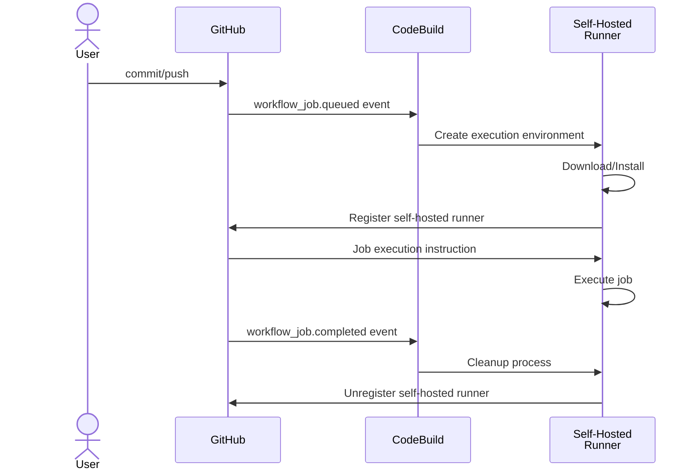

GitHub Actions has become a representative CI/CD service, and last year its workflow syntax became available for use with [AWS CodeBuild](https://aws.amazon.com/jp/codebuild/). However, the pipeline itself operates as a job in CodeBuild, which means that the `github` context is not available, and there are some restrictions on using the GitHub Actions Marketplace.

Recently, on April 24, 2024, AWS announced the following release:

- [AWS CodeBuild now supports managed GitHub Action runners](https://aws.amazon.com/jp/about-aws/whats-new/2024/04/aws-codebuild-managed-github-action-runners/)

Now, CodeBuild itself can be used as a self-hosted runner for GitHub Actions. Here, CodeBuild is used as the job execution environment (ephemeral self-hosted runners).

This allows the use of ARM architectures, GPU workloads, Lambda execution environments, etc., supported by CodeBuild in GitHub Actions workflows. Moreover, since the job itself operates on CodeBuild, it is easy to use various AWS services such as IAM and VPC resources (OIDC provider settings and access keys are not needed).

Of course, there are [limitations](https://docs.github.com/en/actions/hosting-your-own-runners/managing-self-hosted-runners/about-self-hosted-runners#usage-limits) as a self-hosted runner, but since the self-hosted runner itself is provided by GitHub Actions, you can use all the features of GitHub Actions.

I tried out this feature, so I will introduce how to use it.

- [AWS CodeBuild Doc - Set up self-hosted GitHub Actions runners](https://docs.aws.amazon.com/codebuild/latest/userguide/action-runner.html)

## Preliminary Preparation: GitHub Connection Settings

You need to set up the connection from CodeBuild to GitHub in advance. As stated in the official documentation below, connect using a Personal Access Token (PAT) or OAuth App.

- [CodeBuild Doc - Access your source provider in CodeBuild](https://docs.aws.amazon.com/codebuild/latest/userguide/access-tokens.html#access-tokens-github)

Below is an example of registering a PAT using AWS CLI.

```shell
# Set the access token to GITHUB_TOKEN
aws codebuild import-source-credentials --token ${GITHUB_TOKEN} \
  --server-type GITHUB --auth-type PERSONAL_ACCESS_TOKEN
# Check settings
aws codebuild list-source-credentials
```

CodeBuild uses this setting to create WebHooks. Do not forget to set the permissions described in the above document when creating the PAT (otherwise, the creation of the CodeBuild project will fail).

For private repositories, the following permissions allowed me to create a self-hosted runner.


## Creating a CodeBuild Project

Let's create a self-hosted runner in CodeBuild.

Here, we will create it from the management console. Create a new build project from the CodeBuild menu.

Enter an arbitrary project name, select "GitHub" as the source provider, and enter the URL of the GitHub repository (if you have already connected to GitHub, you should be able to select from the list of repositories).


In "Primary source webhook events", check "Rebuild every time code is pushed to this repository" and select `WORKFLOW_JOB_QUEUED` in "Filter Groups".
This notifies CodeBuild via WebHook when a job is queued from a GitHub Actions workflow.


Next, select an arbitrary execution environment. Here, it is left as default.


Next, for BuildSpec, select "Use a buildspec file".
Incidentally, any buildspec you prepare here will be ignored. At job execution time, it seems to be replaced with the setup process for the GitHub Actions runner.
The following is an excerpt from the [official document](https://docs.aws.amazon.com/codebuild/latest/userguide/action-runner.html).

> Note that your Buildspec will be ignored. Instead, CodeBuild will override it to use commands that will setup the self-hosted runner. This project’s primary responsibility is to set up a self-hosted runner in CodeBuild to run GitHub Actions workflow jobs.


This creates the project. If successful, the CodeBuild build project is created as shown below.


:::info
The BuildSpec of the created project was set as follows:

```yaml
version: 0.2
phases:
  build:
    commands:
      - echo "BuildSpec will be overloaded for GHA self-hosted runner builds."
```
:::

Meanwhile, let's check the WebHook settings on the GitHub side of the repository.


A new WebHook has been created. The process on the CodeBuild side is executed via this CodeBuild endpoint.

## Operating the CodeBuild Self-Hosted Runner

Let's run a job with the CodeBuild self-hosted runner.
Create the following workflow file in the GitHub repository.

```yaml
name: test-codebuild-runner
on:
  push:
jobs:
  build:
    runs-on: codebuild-GitHubActionsExampleRunner-${{ github.run_id }}-${{ github.run_attempt }}
    steps:
      - run: |
          echo "running on CodeBuild..."
          echo "OS: $(uname -a)"
          aws sts get-caller-identity
```

The point is the label specified in `runs-on`. In the case of CodeBuild's self-hosted runner, you need to use one of the following:

- `codebuild-<CodeBuild Project name>-${{ github.run_id }}-${{ github.run_attempt }}`
- `codebuild-<CodeBuild Project name>-${{ github.run_id }}-${{ github.run_attempt }}-<image>-<image-version>-<instance-size>`

Here, we are using the former specification. The latter specification is used if you want to overwrite the execution environment of CodeBuild (see the column "Using GitHub Actions Matrix").

Place this file under the `.github/workflows` directory and push it. The GitHub Actions workflow is executed.
CodeBuild checks the label name (project name) of the queued job and creates and registers a self-hosted runner on the GitHub side.

During the execution of GitHub Actions, if you look at the Runner menu from the Settings of the relevant GitHub repository, you will see that the self-hosted runner is registered as shown below.


This self-hosted runner is temporary (ephemeral self-hosted runners) and is deleted after the job ends.

The log of GitHub Actions after the job ends is as follows.


The job has completed successfully, and the results of the script execution can be confirmed.
On the other hand, let's also check the logs on the CodeBuild side.


These logs show the initialization and cleanup processes of the self-hosted runner.

Watching this behavior, the lifecycle of the CodeBuild self-hosted runner seems to follow the flow below (some imagination is included).



:::column:Using GitHub Actions Matrix
The [matrix](https://docs.github.com/ja/actions/using-jobs/using-a-matrix-for-your-jobs) of GitHub Actions can also be used with CodeBuild's self-hosted runner.
For example, if you want to run the same job in three different environments: Amazon Linux2023 x86/ARM, and Ubuntu, you would specify as follows:

```yaml
name: test-codebuild-runner
on:
  push:
jobs:
  build:
    runs-on: codebuild-GitHubActionsExampleRunner-${{ github.run_id }}-${{ github.run_attempt }}-${{ matrix.os }}
    strategy:
      matrix:
        os: ["al2-5.0-small", "arm-3.0-small", "ubuntu-7.0-small"]
    steps:
      - run: |
          echo "running on CodeBuild..."
          echo "OS: $(uname -a)"
          aws sts get-caller-identity
```
The label at the end of `runs-on` specifies `matrix.os`, and `strategy.matrix.os` specifies the variations.
This way, the same job is executed in each environment.
Note that the execution environment specified when creating the CodeBuild project is overwritten by the values in the matrix.
:::

## (Bonus) Creating with CloudFormation

Instead of the management console, I also created a self-hosted runner CodeBuild project using CloudFormation.
The template file is as follows.

```yaml
Parameters:
  GitHubRepository:
    Type: String
    Description: The GitHub repository URL

Resources:
  CodeBuildProject:
    Type: AWS::CodeBuild::Project
    Properties:
      Name: GitHubActionsExampleRunner
      ServiceRole: !GetAtt CodeBuildRole.Arn
      Artifacts:
        Type: NO_ARTIFACTS
      Environment:
        Type: LINUX_CONTAINER
        ComputeType: BUILD_GENERAL1_SMALL
        Image: aws/codebuild/amazonlinux2-x86_64-standard:5.0
      Source:
        Type: GITHUB
        Location: !Ref GitHubRepository
      # WebHook(Self-hosted runner) settings
      Triggers:
        Webhook: true
        FilterGroups:
          - - Type: EVENT
              Pattern: WORKFLOW_JOB_QUEUED

  CodeBuildRole:
    Type: AWS::IAM::Role
    Properties:
      AssumeRolePolicyDocument:
        Version: 2012-10-17
        Statement:
          - Effect: Allow
            Principal:
              Service:
                - codebuild.amazonaws.com
            Action:
              - sts:AssumeRole
      Policies:
        - PolicyName: GitHubActionsExampleRunnerPolicy
          PolicyDocument:
            Statement:
              - Effect: Allow
                Action:
                  - logs:CreateLogGroup
                  - logs:CreateLogStream
                  - logs:PutLogEvents
                Resource: "*"
```

The content is exactly the same as what is done in the management console, so I will omit it.
In actual operation, like other resources, it will be managed using some IaC tool (even though it doesn't look like a template for a self-hosted runner at first glance).

## Summary

I introduced how to use CodeBuild as a self-hosted runner for GitHub Actions.
It is an optimal method for jobs that are natively AWS or where the runners provided by GitHub Actions are insufficient in specs.

According to the [official documentation](https://docs.github.com/en/actions/hosting-your-own-runners/managing-self-hosted-runners/autoscaling-with-self-hosted-runners#using-ephemeral-runners-for-autoscaling) of GitHub Actions, self-hosted runners are recommended to be implemented as follows:

> GitHub recommends implementing autoscaling with ephemeral self-hosted runners; autoscaling with persistent self-hosted runners is not recommended. In certain cases, GitHub cannot guarantee that jobs are not assigned to persistent runners while they are shut down. With ephemeral runners, this can be guaranteed because GitHub only assigns one job to a runner.

If you implement this yourself, it can be quite a hassle, and you may need to consider operating it using the Action Runner Controller (ARC) with Kubernetes prepared.
Using CodeBuild's self-hosted runner allows you to handle runner instance autoscaling as a managed service, greatly lowering the barrier to entry.

It might become a strong option for projects combining GitHub and AWS.
