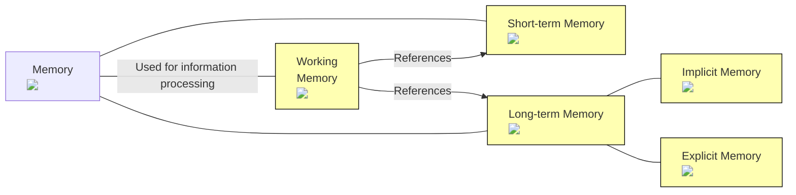
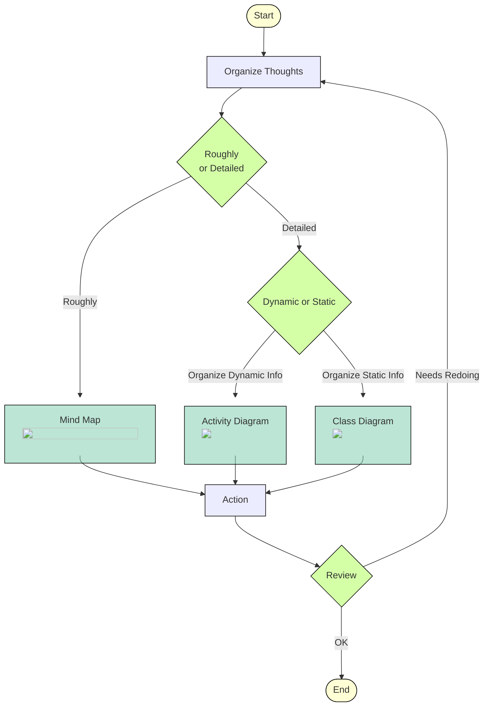

:::alert
This article has been automatically translated.
The original article is [here](https://developer.mamezou-tech.com/blogs/2024/05/08/getting-used-to-it/).
:::


## Introduction

I am Yamashita from Mamezou Corporation. Although I was inexperienced in the industry, I joined Mamezou Corporation last August due to a fortunate opportunity.

This time, I wrote this article while reflecting on my past self, suitable for the spring season.

The target audience for this article includes:
- People who are starting to learn programming languages
- People who have recently had to engage with new technologies
- People who are somewhat troubled about technical aspects

However, the following topics will not be covered in this article:
- Details of individual technologies
- Entire content of the books introduced
- Discussions on what one should be able to do to move beyond beginner level
- Behaviors within a team

Please note that the content of this article is based solely on my personal experiences.

## Overview of What I Did to Get Used to It

First, let me list the key points. The things I worked on are as follows:

```
1. Mastery of input
2. Memorization of basic expressions
3. Thinking in a design-driven way
```

Upon joining the actual workplace, I witnessed other members handling tasks at an astonishing speed. They had just recently learned or seen the technology, yet they were already implementing it with familiar ease. Indeed, if you call it "familiarity," that might be the end of the discussion. However, when you look up the word "familiarity" in dictionaries, it almost always involves keywords like "experience" and "time."

- Is it just about spending more time?
- Can't it be done faster?
- What exactly does 'getting used to' mean?
- What should one do to get used to something?

With these questions in mind, I continued to explore throughout the last year. Now, looking back, I have picked up a few things that I found useful. Before that, let me introduce three books that I referred to.
These books are worth reading even aside from the content of this article.

## Books I Referred To
### The Programmer's Brain ([Book Link](https://www.amazon.co.jp/dp/4798068535))
First, I introduce "The Programmer's Brain" by Felienne Hermans. It is a book that provided answers to what it means to "get used to," and most of the neuroscientific content in this article is based on this book. The Japanese edition of this book is published by Shuwa System Corporation.
:::info
The book explains how the brain works to enhance skills and capabilities as a programmer. It discusses not so much about innate abilities but about how to optimize brain function for better use of the mind. Although not covered deeply here, the book also thoroughly describes specific methods to optimize brain function.
:::
### World-Class Engineers' Thought Processes ([Book Link](https://www.amazon.co.jp/dp/4163917683))
As the second book, I introduce "World-Class Engineers' Thought Processes" by Takeshi Ushio. It is a very famous book and definitely worth reading. Although it is introduced second, I read it before The Programmer's Brain.

:::info
This book compiles strategies that seem applicable from the analysis and observation of leading engineers by the author, who currently works at Microsoft as of May 2024. While this article focuses on learning methods, the book covers a wide range of useful topics from what it means to work in a team to how to efficiently get work done.
:::

### Theory of Competition: Umehara's Style ([Book Link](https://www.amazon.co.jp/dp/4098251817))
Lastly, I introduce "Theory of Competition: Umehara's Style" by Daigo Umehara, a famous professional gamer. Although written by a professional gamer and not a technician, there are several aspects that resonate with engineers, hence its inclusion.

:::info
This book discusses the concept of "winning" from the perspective of a professional gamer. Before reading, I thought there was little connection between the worlds of engineers and professional gamers, but there were indeed some commonalities that I recognized after reading.
:::

## The Three Types of Memory Related to the Brain
### Classification of Memory
You might have heard of this before, but the human brain's memory can be classified into three types[^1]:
- Short-term memory: The area for remembering momentary information
- Long-term memory: The area for storing persistent information
- Working memory: The area used for processing information during thought

Furthermore, long-term memory can be divided into two types:
- Implicit memory: Part of long-term memory that retains unconscious information (like instincts)
- Explicit memory: Part of long-term memory that retains information of which one is aware (like knowledge and memories)

[^1]: Technically, there's something called "momentary memory," but it's omitted here for the sake of context.

Also, it is known that when thinking with working memory, it references both short-term and long-term memory.

Here's a diagram to illustrate:


<!--When embedding images within Mermaid elements, separate img tags for the same images are necessary for functionality-->


### A Simple Example
Let's see how short-term and long-term memory affect working memory. First, try to memorize the following string of characters (16 characters, which apparently means "technical blog" in Russian) within 3 seconds:
```
технический_блог
```

If asked to reproduce the string without looking, most people would probably find it difficult. Now, try the same with the following string:
```
いかに久しきものとかは知る
```
Despite being a similar number of characters, this one likely seems much easier for most people. In the first example, you had to remember each of the 16 characters individually.

However, in the current example, it's unlikely anyone thought about each character diligently. Most people probably divided it into several chunks[^2], although the number of chunks depends on personal experience.
##### If you divided the Japanese words:
```いかに／久しき／ものとかは／知る```
→ 4 chunks

##### If you recognized it as the latter part of a 5-7-5-7-7 pattern:
```いかに久しき／ものとかは知る```
→ 2 chunks

##### If you knew it as the latter part of poem number 53 from the Ogura Hyakunin Isshu:
```いかに久しきものとかは知る```
→ 1 chunk

Relating back to our discussion, "how many chunks you divided it into" directly correlates with the efficiency of information processing.
[^2]: The term used in the book is "chunk." Here, it's expressed as a collection of characters, but the book uses it in a broader sense.

### Familiarity = Optimization of Memory
The simple example above should convey how working memory's efficiency is influenced by other memories.

With this in mind, the situations described at the beginning, such as "not understanding" or "progressing smoothly," can be explained as follows:
- Feeling "I don't understand" => Depletion of working memory
- "Progressing smoothly" => Optimal functioning of working memory

Therefore, I aimed to enhance short-term and long-term memory to improve the efficiency of working memory. After trying various methods, the ones I felt were effective are those introduced at the beginning.

## My Actions
Before explaining in detail, let me enumerate them again:

```
1. Mastery of input
2. Memorization of basic expressions
3. Thinking in a design-driven way
```

### Sufficient Input
Firstly, I ensure not to neglect sufficient input.

The goal here is to strengthen explicit memory (specifically, knowledge) within long-term memory.

You probably know how important input is, so I won't elaborate on it (it's emphasized in all three books I introduced earlier).

Personally, I have been catching up using the following sources as my input:

- General books
- Library references
- Presentations at technical conferences
- Code from projects I'm involved in

When it comes to this topic, it could lead to discussions about how much one should do. Reflecting the opinions of others, I set the following guidelines:
```
- Must: Until all doubts are cleared
- Effort goal: Everything
```
Of course, time is limited, so I read using various methods[^3].
[^3]: I'll only share the [slides](https://speakerdeck.com/yonetty/tech-to-read-tech-books) from a lecture I found personally useful.

:::info
As an aside, there have certainly been times when I was diligently reading but it turned out to be a poor match. When it comes to references you should input, it might be best to ask someone close to you. It's somewhat boastful to say, but at our company, information comes in semi-automatically from senior colleagues, which has been incredibly helpful.
:::
### Repetition of the Basics
Next, I focus on the repetition learning of basic expressions.

The goal here is to strengthen implicit memory within long-term memory.

Some might think that with generative AI, you can write syntax without knowing it. However, the aim here is to imprint it into implicit memory to reduce the load on working memory.

It's a gritty method, but I was doing basic repetition learning. In the book by Mr. Umehara, it is discussed under the expression "decompose and repeat." Using various tools to manage the repetition of grammar learning is one method.

:::stop
Depending on the amount, I can't recommend blindly memorizing. It's healthier to proceed with repetitive practice once you can explain in your own words what "this is doing XX."
:::

:::check
Personally, I use an app called [Anki](https://apps.ankiweb.net/) as a tool.
- It has a learning management feature (reminds you after a few days).
- It has export and import functions (csv format can be selected).
- It's [open source](https://github.com/ankitects/anki).
- It works on multiple platforms.
- etc...

These are some of the attractive features that make me use it.

Here's how I use it within the limits of what can be shown.


:::


### Habit of Design-Driven Thinking
Lastly, I focus on cultivating a habit of design-driven thinking. Design might sound grandiose, but please understand it simply as creating a blueprint (design) before starting anything (not limited to coding).

The main purpose here is to support short-term memory.

Having a blueprint in advance can help you think about actions with less strain compared to just thinking in your head.

Also, having a roadmap prepared in advance provides some foresight. Even if it's wrong at that moment, you can quickly make corrections based on the preliminary design.

The book by Mr. Ushio and his conference presentations emphasize that "trial and error is bad," and many might have heard the phrase "trial and error is (abbreviated)..."

By the way, I personally try to run the following cycle. Even when I'm short on time, I at least prepare something like a note.


<!--When embedding images within Mermaid elements, separate img tags for the same images are necessary for functionality-->


:::info
Activity diagrams and class diagrams are part of something called UML (Unified Modeling Language), which is a visualization technique for system design. There are detailed grammatical rules, but it's okay to deviate a bit when writing for your own thought organization. There's a lot of information about UML beyond the [link](https://astah.change-vision.com/ja/feature/uml.html) introduced here. If you're interested, please look it up.
:::

:::info
While slightly off-topic from 'getting used to,' when you enter the field, there will inevitably be times when you need to justify your actions. If you have organized materials prepared in advance, discussions can proceed relatively smoothly. In any case, I still think it was good to develop the habit of preparing design diagrams.
:::

:::check
When I was first tasked with creating a feature, I prepared diagrams like this. As I progressed with the feature development (despite various rough edges), it was incredibly helpful.


:::
## Summary
Here is a summary of this article:
- The brain has three types of memory: long-term memory, short-term memory, and working memory
- The efficiency of working memory affects the performance of thinking and task processing
- The efficiency of working memory is influenced by long-term and short-term memory
- Sufficient input supports long-term memory
- Basic repetitive practice also supports long-term memory
- A habit of design-driven thinking supports short-term memory
