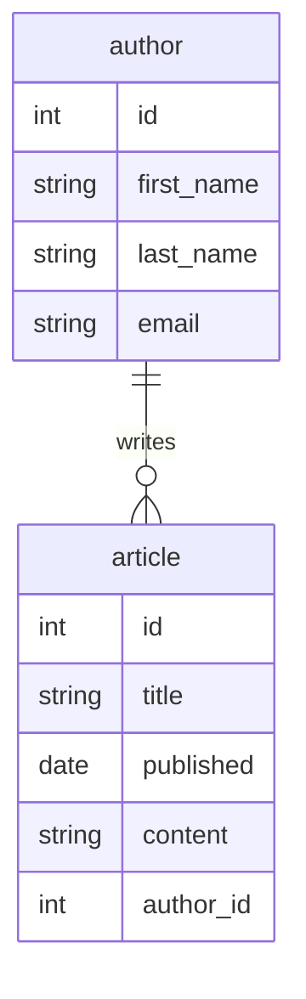

A while ago, I introduced [TypeORM](https://typeorm.io/) as an OR mapper for TypeScript.

- [Using the OR Mapper TypeORM with TypeScript](/blogs/2022/07/27/typeorm-with-typescript/)
- [Using TypeORM's Schema Migration](/blogs/2023/02/22/typeorm-migration-intro/)

This article received more attention than expected, indicating that interest in RDB and OR mappers remains high.

Recently, I tried using a new OR mapper for TypeScript called [Drizzle](https://orm.drizzle.team/). It offers a lightweight and user-friendly API, which I found quite good, so I would like to introduce it here.

## What is Drizzle?

Drizzle is a relatively new OR mapper released in 2022.

In the [official documentation](https://orm.drizzle.team/docs/overview), Drizzle is introduced as follows:

> It’s the only ORM with both relational and SQL-like query APIs, providing you best of both worlds when it comes to accessing your relational data. Drizzle is lightweight, performant, typesafe, non lactose, gluten-free, sober, flexible and serverless-ready by design. Drizzle is not just a library, it’s an experience 🤩

It sounds very promising.

As mentioned here, Drizzle accesses RDB using two features. Both are designed to leverage TypeScript's type system, allowing for smooth coding with IDE code completion.

**SQL-Like Query**
The first feature is the SQL-like API. It uses pre-defined table schemas and the API (SQL wrapper) provided by Drizzle. This is the basic API that supports all CRUD operations (including SQL dialects of various databases).

- [Drizzle Doc - Select](https://orm.drizzle.team/docs/select)
- [Drizzle Doc - Insert](https://orm.drizzle.team/docs/insert)
- [Drizzle Doc - Update](https://orm.drizzle.team/docs/update)
- [Drizzle Doc - Delete](https://orm.drizzle.team/docs/delete)

**Relational Query**
The second feature is the Relational Query. This API allows you to write queries for complex table structures concisely and is an extension of the Select API. By defining relations separately from the table schema, Drizzle handles optimal SQL generation and result set mapping, providing a high-level API. It offers two APIs: findMany and findOne.

- [Drizzle Doc - Relational Query](https://orm.drizzle.team/docs/rqb)

Currently, Drizzle supports three RDBs: PostgreSQL, MySQL, and SQLite, which is fewer compared to major OR mapper products.

- [Drizzle Doc - PostgreSQL](https://orm.drizzle.team/docs/get-started-postgresql)
- [Drizzle Doc - MySQL](https://orm.drizzle.team/docs/get-started-mysql)
- [Drizzle Doc - SQLite](https://orm.drizzle.team/docs/get-started-sqlite)

However, looking at the detailed support for each DB, it is clear that it is intended for use with various managed services and products like Deno/Bun. OR mappers tend to be heavyweight libraries, but Drizzle is designed to be lightweight, considering various serverless and edge environments, making it an easy-to-use OSS.

In terms of Drizzle's popularity, it is not as major as OR mappers like Prisma or TypeORM, but it seems to have gained popularity with the introduction of Relational Query in 2023[^1]. Currently, it has over 21,000 GitHub Stars, making it a very promising product.

[^1]: [Medium - Drizzle Stories - Best TypeScript ORM just got better](https://medium.com/drizzle-stories/best-typescript-orm-just-got-better-5a33688b8d2e)

## Installing Drizzle

Here, we will use Node.js + PostgreSQL.

- [Drizzle Doc - Get Started - PostgreSQL - node-postgres](https://orm.drizzle.team/docs/get-started-postgresql#node-postgres)

```shell
npm install drizzle-orm pg
npm install -D drizzle-kit @types/pg
```

Here, I set up the latest Drizzle version `0.31.2`. Note that Drizzle can be used not only with Node.js but also with Deno and Bun.

Next, I started a PostgreSQL container with Docker to try the RDB locally.

```shell
docker run --name drizzle-postgres -e POSTGRES_PASSWORD=drizzlepass -p 5432:5432 -d postgres

# Verify connection with psql
psql -h localhost -p 5432 -U postgres -c 'select 1'
```

## Defining the Schema

First, let's define the table schema. The schema will be used as a type when writing queries, and Drizzle Kit, which provides Drizzle's development kit, also offers schema migration features using this. This time, we will create the following table structure.



These tables represent authors (`author`) and articles (`article`), and they have a one-to-many relationship.

Here is how to represent this in Drizzle's schema definition.

```typescript:db/schema.ts
import { integer, pgSchema, serial, text, varchar, date, index } from 'drizzle-orm/pg-core';

// Create sample schema
export const sample = pgSchema('sample');

// Article table
export const article = sample.table('article', {
  id: serial('id').primaryKey(),
  title: varchar('title', { length: 100 }).notNull(),
  published: date('date').notNull(),
  content: text('content'),
  author: integer('author_id').references(() => author.id)
}, (table) => ({
  titleIdx: index('title_idx').on(table.title),
  publishedIdx: index('published_idx').on(table.published)
}));

// Author table
export const author = sample.table('author', {
  id: serial('id').primaryKey(),
  firstName: varchar('first_name', { length: 30 }).notNull(),
  lastName: varchar('last_name', { length: 30 }).notNull(),
  email: varchar('email', { length: 256 }).notNull().unique()
});
```

We created the table schema with `pgSchema` and placed each table within it. Column types and constraints use those provided by Drizzle.

- [Drizzle Doc - SQL schema declaration](https://orm.drizzle.team/docs/sql-schema-declaration)

If you have experience writing DDL, you should find this easy to write.

## Using Drizzle Kit's Schema Migration

The schema migration tool provides commands to create DDL from TypeScript table schemas, manage schema versions, and apply them to the actual DB[^2]. While its use is optional, it is highly recommended for synchronizing table schema and source code version management.

[^2]: It seems that rollback is not supported at the moment, so manual handling may be necessary.

- [Drizzle Doc - Migrations](https://orm.drizzle.team/docs/migrations)

First, create `drizzle.config.ts` in the project root.

```typescript:drizzle.config.ts
import { defineConfig } from 'drizzle-kit';

export default defineConfig({
  schema: './db/schema.ts', // Table schema file
  out: './migration', // DDL output directory
  dialect: 'postgresql',
  // Used for actual DB migration
  dbCredentials: {
    ssl: false,
    host: 'localhost',
    user: 'postgres',
    password: 'drizzlepass',
    port: 5432,
    database: 'postgres',
  },
});
```

Let's generate the DDL using Drizzle Kit's schema migration. Run the generate command of Drizzle Kit.

```shell
npx drizzle-kit generate
```

After execution, SQL files for migration will be output to the specified directory. Here, the following file was generated.

```sql
CREATE SCHEMA "sample";
--> statement-breakpoint
CREATE TABLE IF NOT EXISTS "sample"."article" (
	"id" serial PRIMARY KEY NOT NULL,
	"title" varchar(100) NOT NULL,
	"date" date NOT NULL,
	"content" text,
	"author_id" integer
);
--> statement-breakpoint
CREATE TABLE IF NOT EXISTS "sample"."author" (
	"id" serial PRIMARY KEY NOT NULL,
	"first_name" varchar(30) NOT NULL,
	"last_name" varchar(30) NOT NULL,
	"email" varchar(256) NOT NULL,
	CONSTRAINT "author_email_unique" UNIQUE("email")
);
--> statement-breakpoint
DO $$ BEGIN
 ALTER TABLE "sample"."article" ADD CONSTRAINT "article_author_id_author_id_fk" FOREIGN KEY ("author_id") REFERENCES "sample"."author"("id") ON DELETE no action ON UPDATE no action;
EXCEPTION
 WHEN duplicate_object THEN null;
END $$;
--> statement-breakpoint
CREATE INDEX IF NOT EXISTS "title_idx" ON "sample"."article" USING btree (title);--> statement-breakpoint
CREATE INDEX IF NOT EXISTS "published_idx" ON "sample"."article" USING btree (date);
```

Since this is the first run, DDL for creating the schema and each table is output. Apply this to the DB by running the migrate command of Drizzle Kit.

```shell
npx drizzle-kit migrate

> drizzle-kit: v0.22.2
> drizzle-orm: v0.31.2
> 
> No config path provided, using default path
> Reading config file '/path/to/drizzle.config.ts'
> Using 'pg' driver for database querying
> [✓] migrations applied successfully!
```

After execution, check the tables with psql.

```shell
psql -h localhost -p 5432 -U postgres

set search_path to sample;
\d article
\d author
```
```
                                     Table "sample.article"
  Column   |          Type          | Collation | Nullable |               Default               
-----------+------------------------+-----------+----------+-------------------------------------
 id        | integer                |           | not null | nextval('article_id_seq'::regclass)
 title     | character varying(100) |           | not null | 
 date      | date                   |           | not null | 
 content   | text                   |           |          | 
 author_id | integer                |           |          | 
Indexes:
    "article_pkey" PRIMARY KEY, btree (id)
    "published_idx" btree (date)
    "title_idx" btree (title)
Foreign-key constraints:
    "article_author_id_author_id_fk" FOREIGN KEY (author_id) REFERENCES author(id)
```
```
                                      Table "sample.author"
   Column   |          Type          | Collation | Nullable |              Default               
------------+------------------------+-----------+----------+------------------------------------
 id         | integer                |           | not null | nextval('author_id_seq'::regclass)
 first_name | character varying(30)  |           | not null | 
 last_name  | character varying(30)  |           | not null | 
 email      | character varying(256) |           | not null | 
Indexes:
    "author_pkey" PRIMARY KEY, btree (id)
    "author_email_unique" UNIQUE CONSTRAINT, btree (email)
Referenced by:
    TABLE "article" CONSTRAINT "article_author_id_author_id_fk" FOREIGN KEY (author_id) REFERENCES author(id)
```

You can see that the columns, indexes, and foreign keys are created as specified.

Let's see what happens when the schema is changed. Here, we will add a column (`nickName`) to the `author` table.

```diff-typescript:db/schema.ts
export const author = sample.table('author', {
  id: serial('id').primaryKey(),
  firstName: varchar('first_name', { length: 30 }).notNull(),
  lastName: varchar('last_name', { length: 30 }).notNull(),
  email: varchar('email', { length: 256 }).notNull().unique(),
+  // Added
+  nickName: varchar('nick_name', { length: 20 })
});
```

Run `npx drizzle-kit generate` again in this state, and the following SQL file will be output.

```sql
ALTER TABLE "sample"."author" ADD COLUMN "nick_name" varchar(20);
```

The schema migration tool of Drizzle Kit extracts the schema changes and creates a DDL for adding only the column. Apply the changes in the same way as the first time with `npx drizzle-kit migrate`. Drizzle Kit will extract the unapplied migration files and apply the unapplied parts sequentially to the existing schema.

:::column:Drizzle Kit's Migration History Management
Drizzle's schema migration tool manages migration history by default in a table named `__drizzle_migrations` in the `drizzle` schema. Since we executed the migration twice (creation and modification), the table will contain two records as follows.
```
 id |                               hash                               |  created_at   
----+------------------------------------------------------------------+---------------
  1 | a30e7cc63e932a7eaefa620ce714bfae3080fdf86a6e013b94ef739794c843ba | 1718168716519
  2 | a83e218dfa38520fc864473e5a97b85aaf8e740bba1a791a88c54da2f70c443a | 1718170300257
```
Drizzle Kit determines the current application status from this table and executes the unapplied migration files.
:::

## Executing SQL-Like Queries

Now that the table creation is complete, let's access it using Drizzle. First, the basic SQL-Like Query.

```typescript
import { drizzle } from 'drizzle-orm/node-postgres';
import { Client } from 'pg';
import { article, author } from './db/schema';
import { eq } from 'drizzle-orm';

const client = new Client({
  host: 'localhost',
  user: 'postgres',
  password: 'drizzlepass',
  port: 5432
});

async function main() {
  await client.connect();
  const db = drizzle(client);

  // Insert API
  const [ newAuthor ] = await db.insert(author).values({
    email: 'taro-mame@mamezou.com',
    firstName: '太郎',
    lastName: '豆蔵'
  }).returning();
  const [ newArticle ] = await db.insert(article).values({
    title: 'Mastering the Lightweight ORM Drizzle',
    content: 'Hello!\nToday, I will introduce the lightweight ORM Drizzle!',
    published: '2024-06-12',
    author: newAuthor.id
  }).returning();

  // Update API
  await db.update(article).set({
    title: 'Comfortably Access RDB with Drizzle, the ORM for the Serverless Era'
  }).where(eq(article.id, newArticle.id));

  // Select API
  const result = await db.select()
    .from(article).innerJoin(author, eq(article.author, author.id))
    .where(eq(article.id, newArticle.id));
  console.log(result[0].article);
  // {
  //   id: 1,
  //   title: 'Comfortably Access RDB with Drizzle, the ORM for the Serverless Era',
  //   published: '2024-06-12',
  //   content: 'Hello!\nToday, I will introduce the lightweight ORM Drizzle!',
  //   author: 1
  // }
  console.log(result[0].author);
  // {
  //   id: 1,
  //   firstName: '太郎',
  //   lastName: '豆蔵',
  //   email: 'taro-mame@mamezou.com',
  //   nickName: null
  // }

  // Delete API
  await db.delete(article).where(eq(article.id, newArticle.id));
  await db.delete(author).where(eq(author.id, newAuthor.id));
}

main().then(() => process.exit(0));
```
Using the APIs provided by Drizzle for INSERT/UPDATE/SELECT/DELETE statements, we are constructing SQL. Although this is TypeScript source code, it can be read as SQL, so no explanation is needed. By using the schema definition (db/schema.ts), code completion for the schema also works, making it comfortable to write.

## Using Relational Query

While simple table structures like this are not problematic, writing join conditions and mapping execution results can be quite painful for deeply nested complex table structures. Relational Query shines in such cases. By defining relations in advance, you can omit writing table joins and query execution result mappings.

First, let's add relations to the schema definition (`db/schema.ts`) created earlier.

```diff-typescript:db/schema.ts
+ import { relations } from 'drizzle-orm';
import { integer, pgSchema, serial, text, varchar, date, index } from 'drizzle-orm/pg-core';

// Create sample schema
export const sample = pgSchema('sample');

// Article table
export const article = sample.table('article', {
  id: serial('id').primaryKey(),
  title: varchar('title', { length: 100 }).notNull(),
  published: date('date').notNull(),
  content: text('content'),
  author: integer('author_id').references(() => author.id)
}, (table) => ({
  titleIdx: index('title_idx').on(table.title),
  publishedIdx: index('published_idx').on(table.published)
}));

// Author table
export const author = sample.table('author', {
  id: serial('id').primaryKey(),
  firstName: varchar('first_name', { length: 30 }).notNull(),
  lastName: varchar('last_name', { length: 30 }).notNull(),
  email: varchar('email', { length: 256 }).notNull().unique(),
  nickName: varchar('nick_name', { length: 20 })
});

+ // Relation from author to article
+ export const authorRelations = relations(author, ({ many }) => ({
+   article: many(article)
+ }));
+ // Relation from article to author
+ export const articleRelations = relations(article, ({ one }) => ({
+   author: one(author, {
+     fields: [ article.author ],
+     references: [ author.id ]
+   })
+ }));
```

Relations are defined using the `relations` API provided by Drizzle. Here, we are adding a one-to-many (One-to-Many) relation from authors (`author`) to articles (`article`).

:::info
Not only one-to-many (One-to-Many), but also one-to-one (One-to-One) and many-to-many (Many-to-Many) relationships are available.

- [Drizzle Doc - Query - One-to-Many](https://orm.drizzle.team/docs/rqb#one-to-many)
- [Drizzle Doc - Query - One-to-One](https://orm.drizzle.team/docs/rqb#one-to-one)
- [Drizzle Doc - Query - Many-to-Many](https://orm.drizzle.team/docs/rqb#many-to-many)
:::

:::column:Relational Query and Foreign Keys
In OR mappers, relations are sometimes represented using database foreign keys. However, Drizzle's relations are not related to foreign keys and are used solely in the context of Relational Query. This distinction is mentioned in the official documentation.
- [Drizzle Doc - Query - Foreign Keys](https://orm.drizzle.team/docs/rqb#foreign-keys)
:::

Below, we will issue a query using Relational Query.

```typescript
import * as schema from './db/schema';
// (omitted)

async function main() {
  await client.connect();
  // Set schema including relations
  const db = drizzle(client, { schema });

  // (omitted)

  const result = await db.query.article.findFirst({
    with: {
      author: true // Retrieve the author table as well
    },
    where: eq(article.id, newArticle.id)
  })
  console.log(result)
  // {
  //   id: 2,
  //   title: 'Comfortably Access RDB with Drizzle, the ORM for the Serverless Era',
  //   published: '2024-06-12',
  //   content: 'Hello!\nToday, I will introduce the lightweight ORM Drizzle!',
  //   author: {
  //     id: 2,
  //     firstName: '太郎',
  //     lastName: '豆蔵',
  //     email: 'taro-mame@mamezou.com',
  //     nickName: null
  //   }
  // }

  // (omitted)
}

main().then(() => process.exit(0));
```

By setting the schema including the relation definition, you can access the Relational Query API with `db.query.<table name>`. In Relational Query, specifying the relation retrieval with `with` allows Drizzle to handle SQL creation for joins and mapping results to objects. This example might be too simple to illustrate the power of this feature, but recalling systems with complex table structures can help understand why this feature is supported by many developers.

## Using Transactions

Finally, let's use transactions, as we are dealing with an RDB.

- [Drizzle Doc - Transactions](https://orm.drizzle.team/docs/transactions)

```typescript
await client.connect();
const db = drizzle(client, { schema });
await db.transaction(async (tx) => {
  // The callback is executed within the same transaction
  const [ newAuthor ] = await db.insert(author).values({
    email: 'taro-mame@mamezou.com',
    firstName: '太郎',
    lastName: '豆蔵'
  }).returning();
  // Omitted
});
```

Drizzle's `db.transaction` API provides the transaction boundary. Write various SQL Like Queries such as INSERT or UPDATE in the callback function. Drizzle starts the transaction, executes the callback function, commits if no exceptions occur, and rolls back if an exception occurs.

## Conclusion

Drizzle is still a young product, but it is lightweight, fast, and has rich query features while being type-safe. It also considers operational aspects such as schema migration, making it an exciting OR mapper for the future.
