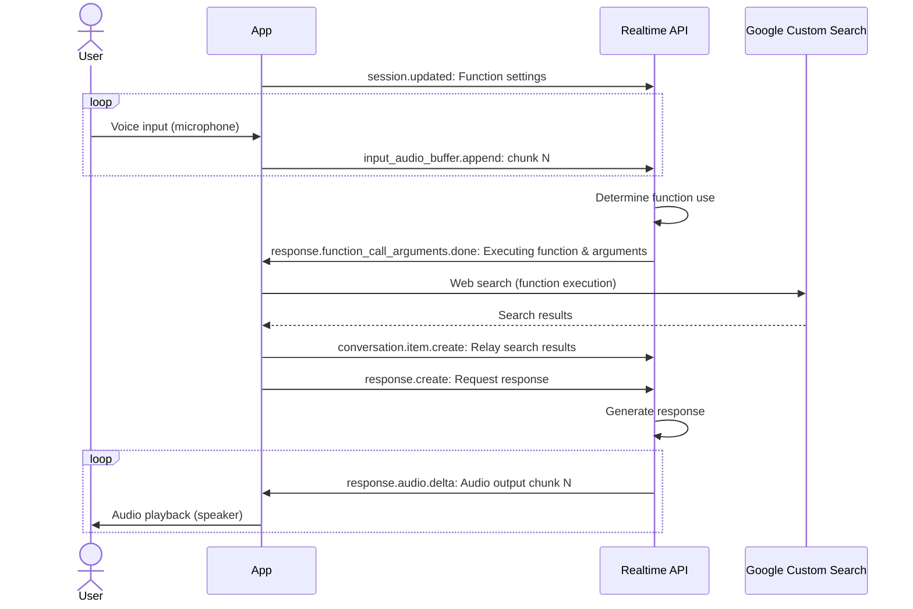

Just recently, I wrote the following article using OpenAI's Realtime API.

- [Conversing with AI Using the Newly Released OpenAI Realtime API](/blogs/2024/10/07/openai-realtime-api-intro/)

In that article, I created a super simple CLI-based conversation tool.

The Realtime API, like the Chat Completion API, also supports Function calling. By using this, you can execute any API via voice. Let's try this out.

The basic setup is the same as in the previous article, so I will omit the setup and details about voice input and output. Please refer to the previous article as needed.

The source code for this article can be found below.

- [Realtime API with Function calling (CLI) Sample Code](https://gist.github.com/kudoh/a76e83482f49ecc811e9a08be6118d9c)

:::info
We have also introduced Function calling for the Chat Completion API in the following article on this site. Please refer to it if you're interested.

- [Trying Out the Function Calling Added to OpenAI's Chat API](/blogs/2023/06/14/gpt-function-calling-intro/)
:::

## Preparing Functions to Execute with Function Calling

Prepare the function to be executed from the Realtime API. Here, we will create an API to search the web for the latest information. We will use the following custom search API provided by Google.

- [Programmable Search Engine - Custom Search JSON API](https://developers.google.com/custom-search/v1/introduction)

Since the Google Custom Search API itself is not the main topic, I will omit detailed setup instructions (you can do it by following the steps)[^1].
[^1]: Of course, you can also use the more advanced [SerpAPI](https://serpapi.com/), or if you only want to use Function calling, a dummy function will suffice.

Add the necessary API to the dependencies in your NPM project.

```shell
npm install @googleapis/customsearch
```

Here, we have prepared the following function.

```typescript
import { customsearch } from '@googleapis/customsearch';

const API_KEY = process.env.CSE_API_KEY ?? '';
const ENGINE_ID = process.env.CSE_ENGINE_ID ?? '';

export async function webSearch({ query }: { query: string }) {
  console.log('Web Search:', query);
  const api = customsearch({
    auth: API_KEY,
    version: 'v1'
  });
  // https://developers.google.com/custom-search/v1/reference/rest/v1/cse/list
  const result = await api.cse.list({
    q: query,
    cx: ENGINE_ID
  });
  return (result.data.items ?? []).map(item => ({
    title: item.title,
    link: item.link,
    snippet: item.snippet
  }));
}
```

It is a simple function that receives a search query and returns the results of a Google search.

## Setting Executable Functions in the Realtime API

Specify the created function in the Realtime API. This uses the `session.update` event of the Realtime API.

```typescript
import WebSocket from 'ws';
import { spawn } from 'child_process';
import { webSearch } from './google-search.js';

const url = 'wss://api.openai.com/v1/realtime?model=gpt-4o-realtime-preview-2024-10-01';
const ws = new WebSocket(url, {
  headers: {
    'Authorization': 'Bearer ' + process.env.OPENAI_API_KEY,
    'OpenAI-Beta': 'realtime=v1'
  }
});

const instructions = `You are a knowledgeable AI assistant.
For user questions, use the webSearch function secretly and respond with answers that include surprises and humor.
Keep the technical details a secret, and enjoy friendly and unique conversations.
While entertaining the user, don't forget to provide useful information!`;

// Create session
ws.on('open', () => {
  // Basic settings for Realtime API
  ws.send(JSON.stringify({
    type: 'session.update',
    session: {
      voice: 'shimmer',
      instructions: instructions,
      input_audio_transcription: { model: 'whisper-1' },
      turn_detection: { type: 'server_vad' }
    }
  }));

  // Specify the function to execute with Function calling
  ws.send(JSON.stringify({
    type: 'session.update',
    session: {
      tools: [{
        type: 'function',
        // Function name
        name: 'webSearch',
        // Function description (AI execution decision material)
        description: 'Performs an internet search using a search engine with the given query.',
        // Specify parameters in JSON schema
        parameters: {
          type: 'object',
          properties: {
            query: {
              type: 'string',
              description: 'The search query'
            }
          },
          required: ['query']
        }
      }],
      tool_choice: 'auto' 
    }
  }));
})
```

Here, after basic settings such as voice type and conversation detection mode, Function calling is specified. Under `session.tools`, specify the function name and parameters (JSON schema) just like in the Chat Completion API (multiple can be specified).

`session.tool_choice` is set to `auto`. This is a mode where the AI automatically determines whether to execute the function. If function execution is mandatory, specify `required`. At this stage, it seems that you cannot specify the function to execute like in the Chat Completion API.

Function calling can be specified in a single `session.update` event along with other settings, or it can be specified separately later (it seems you can also change or delete functions within the same session).

## Executing the Function and Relaying the Results

If it is determined that function execution is necessary, the Realtime API sends the function's arguments in the following event. Based on a quick investigation, it seems that the function arguments can be obtained from the following events.

- [response.function_call_arguments.delta](https://platform.openai.com/docs/api-reference/realtime-server-events/response/function_call_arguments/delta)
- [response.function_call_arguments.done](https://platform.openai.com/docs/api-reference/realtime-server-events/response/function_call_arguments/done)
- [response.output_item.done](https://platform.openai.com/docs/api-reference/realtime-server-events/response/output_item/done)
- [response.done](https://platform.openai.com/docs/api-reference/realtime-server-events/response/done)

There are various events, which can be confusing...
Checking the [reference implementation](https://github.com/openai/openai-realtime-api-beta) available, it seems that arguments streamed in the `response.function_call_arguments.delta` event are accumulated and the function is executed in the `response.output_item.done` event.

Here, since there is no reason to assemble the streamed arguments, I plan to handle both argument retrieval and function execution in the `response.output_item.done` event. The payload of the event is as follows.

```json
{
  "type": "response.output_item.done",
  "event_id": "event_AGIfARbBn3ieWo305yKxR",
  "response_id": "resp_AGIfAftaxFnAnGbovPFbW",
  "output_index": 0,
  "item": {
    "id": "item_AGIfAEWj1dZyY3EbCt4re",
    "object": "realtime.item",
    "type": "function_call",
    "status": "completed",
    "name": "webSearch",
    "call_id": "call_swWIenO6JtScDTOw",
    "arguments": "{\"query\":\"2024 Nobel Prize winners\"}"
  }
}
```

This event is used for things other than Function calling, so it seems best to look at those where `item.type` is `function_call`. I implemented it as follows.

```typescript
ws.on('message', (message) => {
  const event = JSON.parse(message.toString());
  console.log(event.type);
  switch (event.type) {
    case 'response.audio.delta':
      // Play audio output from Realtime API through speakers
      audioStream.write(Buffer.from(event.delta, 'base64'));
      break;
    case 'response.output_item.done':
      const { item } = event;
      // 1. Determine function execution request (function_call)
      if (item.type === 'function_call') {
        if (item.name === 'webSearch') {
          // 2. Execute function
          webSearch(JSON.parse(item.arguments)).then(output => {
            // 3. Relay execution result
            ws.send(JSON.stringify({
              type: 'conversation.item.create',
              item: {
                type: 'function_call_output',
                call_id: item.call_id,
                output: JSON.stringify(output)
              }
            }));
            // 4. Request response generation
            ws.send(JSON.stringify({ type: 'response.create', }));
          });
        }
      }
      break;
    case 'response.audio_transcript.done':
    case 'conversation.item.input_audio_transcription.completed':
      console.log(event.type, event.transcript);
      break;
    case 'error':
      console.error('ERROR', event.error);
      break;
  }
});
```
`item.name` is set with the function name specified in `session.update`, and `item.arguments` contains the execution arguments (JSON string), based on which the function (Google search) is executed. The function execution result is relayed to the Realtime API with the [conversation.item.create event](https://platform.openai.com/docs/api-reference/realtime-client-events/conversation/item/create).

Note that it is necessary to request response generation ([response.create event](https://platform.openai.com/docs/api-reference/realtime-client-events/response-create)) after relaying the execution result (otherwise, there will be no response). This way, a response is generated based on the function execution result and sent as audio. This event ([response.audio.delta](https://platform.openai.com/docs/api-reference/realtime-server-events/response/audio/delta)) is subscribed to as audio streaming, so it will be played directly through the speakers (see [previous article](/blogs/2024/10/07/openai-realtime-api-intro/#realtime-apiからのレスポンス音声を再生する)).

The flow of execution here is organized as follows (only the events being sent and subscribed to are shown).



## Conclusion
This time, I challenged executing external APIs using the Realtime API's Function calling. If you have experience with Function calling in the Chat Completion API, it is not that difficult.

The day may be near when AI becomes a reliable presence that can be asked to perform various external tasks based on conversation.
