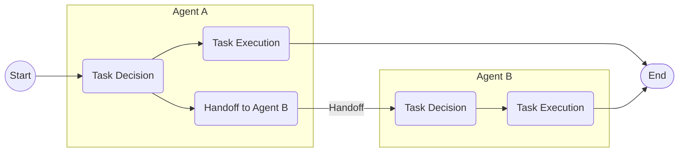
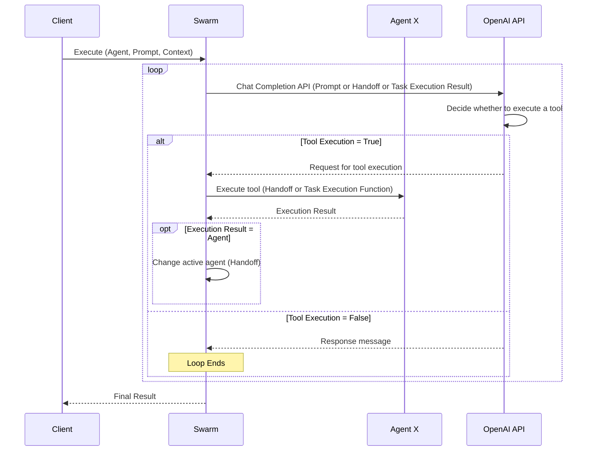
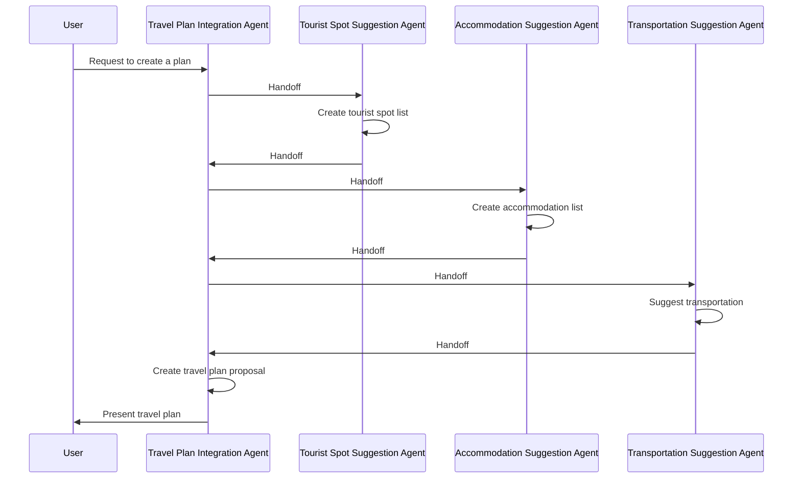

This is the Day 4 article for the [Mamezou Developer Site Advent Calendar 2024](/events/advent-calendar/2024/).

When it comes to AI technologies expected to make a significant leap in 2025, agent functionalities are a prime example[^1].

Recently, Anthropic has garnered attention by releasing an AI agent called [Computer Use](https://docs.anthropic.com/en/docs/build-with-claude/computer-use) that directly operates a PC (beta version[^2]).

Meanwhile, AI vendors like OpenAI and Google that are following suit are planning to sequentially release autonomous agent functionalities, gathering great expectations (and ethical concerns).

[^1]: The definition of agent functionalities isn't clear-cut, but here we'll consider it as something where AI recursively executes tasks on behalf of humans until achieving a goal.
[^2]: Although it's currently in beta, it can be accessed not only via the Anthropic API but also through AWS Bedrock and Google Cloud Vertex (Claude 3.5 Sonnet model).

This time, I want to learn about the mechanism where such anticipated AI agents cooperate to execute a single purpose (agent orchestration).

There are various ways to achieve this, but this time I'll delve deeper into the method mentioned in the following article from the OpenAI Cookbook.

@[og](https://cookbook.openai.com/examples/orchestrating_agents)

The "Swarm" used in the title of this article is something published on GitHub as a sample implementation of agent orchestration mentioned in that article (when I saw the name, it reminded me of Docker Swarm[^3]).

[^3]: Although it's entirely different from Docker Swarm, Docker Swarm orchestrates containers, and OpenAI's Swarm orchestrates agents. So while the targets are different, the meaning is the same.

@[og](https://github.com/openai/swarm/tree/main)

This repository isn't an official product but a sample, and it's useful for learning about the concept of agent orchestration.

## The Concept of Swarm

The idea behind Swarm is very simple, consisting of the following two concepts.

## Routines / Agent

In the Cookbook, they're referred to as "Routines," but in Swarm's README, they're called "Agents." In this article, I'll unify the terminology as "Agents."

Here's a quote from the Cookbook article:

> The notion of a "routine" is not strictly defined, and instead meant to capture the idea of a set of steps. Concretely, let's define a routine to be a list of instructions in natural language (which we'll represent with a system prompt), along with the tools necessary to complete them.

In this way, an agent consists of instructions described in natural language and the tools to execute them.

At the implementation level, an agent is a Chat Completion API that utilizes function calling.
Below is the type definition of the Agent class in Swarm.

```python
class Agent(BaseModel):
    name: str = "Agent"
    model: str = "gpt-4o"
    instructions: Union[str, Callable[[], str]] = "You are a helpful agent."
    functions: List[AgentFunction] = []
    tool_choice: str = None
    parallel_tool_calls: bool = True
```

Here, `instructions` (system message) and `functions` (Function calling) are important properties.
You assign the agent's responsibilities and instructions to achieve them in `instructions`, and set the actual functions to execute them in `functions`.

Also, since multiple agents are involved, agents can be identified using `name`.

In this way, the definition of an agent in Swarm is very simple, focusing only on what's minimally necessary.

## Handoff

The key to agent orchestration is "Handoff."
Here's a quote from the Cookbook:

> Let's define a handoff as an agent (or routine) handing off an active conversation to another agent, much like when you get transferred to someone else on a phone call. Except in this case, the agents have complete knowledge of your prior conversation!

It's like transferring a phone call to someone else.

In the context of agent orchestration, when an agent determines that a task to be executed is beyond its scope of responsibility, handing it over to an appropriate agent is considered a Handoff.

In the case of transferring a task from Agent A to Agent B, it looks something like this:



By connecting agents through Handoff one after another, you can build a larger agent orchestration network.

In Swarm, Handoff is achieved by adding functions for agent handoff to the tools.
The Handoff function looks like this:

```python
# The agent to hand over to
refund_agent = Agent(...)

# Handoff function
def transfer_to_refunds():
    """Execute when the user requests a refund"""
    return refund_agent
```

The rule of the Handoff function is to return the next agent as the return value.
Also, by naming the Handoff function as `transfer_to_XXX` (XXX: agent name), the LLM can appropriately judge whether to execute it.

You set this Handoff function as a tool (`functions`) of the agent handing over.

```python
triage_agent = Agent(
    name="Triage Agent",
    instructions=triage_instructions,
    # Set Handoff functions
    functions=[transfer_to_flight_refunds, transfer_to_xxxx],
)
```

This agent only sets Handoff functions, but of course, you can combine them with regular functions.
By specifying it this way, the agent (LLM) will select the appropriate next agent and hand over the current task.

## Execution Sequence of Swarm

I tried to outline the general execution sequence of Swarm (omitting detailed controls).



It's a simple mechanism where the Chat Completion API continues to be executed until the LLM determines that tool execution is unnecessary (i.e., generates a message).
Within that, when a Handoff function is executed, the active agent is switched.
Also, although not shown in the above diagram, when a Handoff occurs, message history and context information are also handed over, allowing subsequent agents to refer to past information and user context.

Incidentally, for cases where tasks are executed while interacting between the user and the agent rather than fully automated, this sequence can be looped to realize it. In Swarm, it's provided as the [run_demo_loop function](https://github.com/openai/swarm/blob/main/swarm/repl/repl.py#L60).

## Trying Out Swarm

Having understood the mechanism of agent orchestration, let's try running Swarm.

This time, under the theme of creating travel plans, we'll assemble the cooperative operation of the following agents.

- Travel Plan Integration Agent: Gathers information from each agent and formulates a travel plan for the customer.
- Tourist Spot Suggestion Agent: Suggests a list of tourist spots according to the destination.
- Accommodation Suggestion Agent: Suggests accommodations near the destination.
- Transportation Suggestion Agent: Selects the optimal means of transportation based on the departure point and destination.

Here, the Travel Plan Integration Agent acts as the user's point of contact, gathers information from each agent (Handoff), and compiles a final travel plan proposal.



Let's start writing the code.
First, install Swarm in advance.

```shell
pip install git+https://github.com/openai/swarm.git
```

First, the Travel Plan Integration Agent that receives the execution results of each agent and formulates the final travel plan.

```python
from swarm import Agent, Swarm


# Handoff functions
def transfer_to_tourist_spot():
    """Execute when handing over to the Tourist Spot Suggestion Agent"""
    return tourist_spot_agent


def transfer_to_accommodation():
    """Execute when handing over to the Accommodation Suggestion Agent"""
    return accommodation_agent


def transfer_to_transportation():
    """Execute when handing over to the Transportation Suggestion Agent"""
    return transportation_agent


# Travel Plan Integration Agent
def planner_instructions(context_variables):
    # Retrieve customer name from the context passed between agents
    customer_name = context_variables.get("name")
    return (
        "To create a travel plan, please gather information using the following tools:\n"
        "- Tourist Spot Suggestion: transfer_to_tourist_spot\n"
        "- Accommodation Suggestion: transfer_to_accommodation\n"
        "- Transportation Suggestion: transfer_to_transportation\n"
        "After obtaining the necessary information, integrate it to create a travel plan.\n"
        "Do not share the process of plan creation with the user.\n"
        "At the beginning of the proposed travel plan, express gratitude to the customer for requesting the plan formulation."
        f"The customer's name is `{customer_name}`.\n"
    )

travel_planner_agent = Agent(
    name="Travel Planner Agent",
    model="gpt-4o",
    instructions=planner_instructions,
    functions=[transfer_to_tourist_spot, transfer_to_accommodation, transfer_to_transportation],
    parallel_tool_calls=False, # Do not execute tools in parallel (Swarm doesn't support parallel agent Handoffs yet)
)
```

Here, we create and set Handoff functions to each agent. Since the task of travel plan formulation itself leverages the text generation capability of generative AI, we didn't specify particular functions.
Without writing specific instructions in `instructions`, the agent often generates arbitrary responses without handing over to agents, so we clearly described the execution instructions of the Handoff functions (tools).

Next, the implementation of the remaining agents.

```python
# Handoff function for recursion
def transfer_to_travel_planner():
    """Execute when handing back to the Travel Plan Integration Agent"""
    return travel_planner_agent


# Tourist Spot Suggestion Agent
def suggest_spots(destination: Literal["東京", "京都", "大阪"]):
    spots = {
        "東京": ["Tokyo Tower", "Sensoji Temple", "Harajuku", "Akihabara"],
        "京都": ["Kiyomizu Temple", "Kinkakuji", "Arashiyama"],
        "大阪": ["Dotonbori", "Universal Studios", "Osaka Castle"]
    }
    return spots.get(destination, ["No tourist spot data available."])


tourist_spot_agent = Agent(
    name="Tourist Spot Agent",
    model="gpt-4o-mini",
    instructions=(
        "Please use 'suggest_spots' to suggest recommended tourist spots at the travel destination.\n"
        "After the suggestion, please hand over to the Travel Plan Integration Agent using the function 'transfer_to_travel_planner'."
    ),
    functions=[suggest_spots, transfer_to_travel_planner]
)


# Accommodation Suggestion Agent
def suggest_accommodations(destination: str):
    accommodations = {
        "東京": ["Hotel New Otani Tokyo", "Richmond Hotel Tokyo"],
        "京都": ["Kyoto Hotel Okura", "The Westin Miyako Kyoto"],
        "大阪": ["Hilton Osaka", "The Ritz-Carlton Osaka"]
    }
    return accommodations.get(destination, ["No accommodation data available."])


accommodation_agent = Agent(
    name="Accommodation Agent",
    model="gpt-4o-mini",
    instructions=(
        "Please use the 'suggest_accommodations' tool to suggest recommended accommodations near the destination.\n"
        "After the suggestion, please hand over to the Travel Plan Integration Agent using the 'transfer_to_travel_planner' tool."
    ),
    functions=[suggest_accommodations, transfer_to_travel_planner]
)


# Transportation Suggestion Agent
def suggest_transportation(start: str, destination: str):
    if start == "東京" and destination == "京都":
        return "Shinkansen (about 2 and a half hours)"
    elif start == "京都" and destination == "大阪":
        return "Train (about 30 minutes)"
    elif start == "東京" and destination == "大阪":
        return "Airplane or Shinkansen"
    return "Transportation data not found."


transportation_agent = Agent(
    name="Transportation Agent",
    model="gpt-4o-mini",
    instructions=(
        "Please use the 'suggest_transportation' tool to suggest the optimal means of transportation based on the departure point and destination.\n"
        "After the suggestion, please hand over to the Travel Plan Integration Agent using the 'transfer_to_travel_planner' tool."
    ),
    functions=[suggest_transportation, transfer_to_travel_planner],
)
```

Here, each agent is set with dummy task execution functions corresponding to their responsibilities, as well as the Handoff function (`transfer_to_travel_planner`) to the Travel Plan Integration Agent.
This ensures that after executing their tasks, they return to the Travel Plan Integration Agent with the results.

Finally, the main function.

```python
def main():
    context_variables = {
        "name": "Mameka"
    }
    client = Swarm()
    response = client.run(
        agent=travel_planner_agent,
        messages=[{"role": "user", "content": "Departure: Tokyo, Destination: Osaka"}],
        context_variables=context_variables,
        debug=True # Log input/output to the LLM
    )
    print(response.messages[-1]["content"])

if __name__ == "__main__":
    main()
```

We specify the Travel Plan Integration Agent (`travel_planner_agent`) as the initial agent and provide the user's input (departure point and destination).

Additionally, we specify the context (`context_variables`) separately from the messages.
The context can be used in any agent's instructions or tools. Earlier, when setting `instructions` for the Travel Plan Integration Agent, we used this information to dynamically generate instructions for the agent.

That's it. When you run this on the CLI, you get the following response:

```
Dear Mameka, thank you very much for your request for a travel plan. We are pleased to propose the following plan for your trip to Osaka.

### Travel Plan

**Departure:** Tokyo  
**Destination:** Osaka  

#### Transportation
From Tokyo to Osaka, you can use either airplane or Shinkansen. Please choose according to your convenience.

#### Tourist Spots
1. **Dotonbori**: A popular tourist spot where you can enjoy Osaka's gourmet and shopping.
2. **Universal Studios**: Recommended for those who want to enjoy attractions.
3. **Osaka Castle**: A historical site where you can feel the history.

#### Accommodations
1. **Hilton Osaka**
2. **The Ritz-Carlton Osaka**

We have proposed accommodations recommended for those seeking a comfortable and luxurious stay.

This is the basic plan for your trip to Osaka. If you have any requests or need adjustments, please feel free to let us know. We hope you have a wonderful trip!
```

Looking at the content, you can see that the task execution results from each agent are well integrated and proposed as a plan.

## Conclusion
Through Swarm, we've briefly explored the mechanism of agent orchestration.
Swarm is designed with education in mind, emphasizing simplicity, but understanding these basic concepts can be applied to parallel agent execution and even to orchestrating at a super-large scale.

Furthermore, by combining with the Assistants API, it becomes possible to utilize more practical tools like File Search and Code Interpreter, potentially expanding the scope of applications.

In the future, products that support agent orchestration, similar to Kubernetes, may emerge (perhaps they already exist).

Also, in the multi-agent era, I thought that a new challenge might arise regarding how to design the granularity of agents.
Design philosophies like "micro-agents," akin to microservices, might gain attention.
To avoid creating a "God Agent" that combines everything into one, I felt that a balance of appropriate division and design is required.
