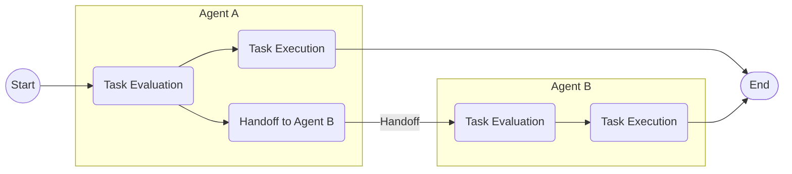
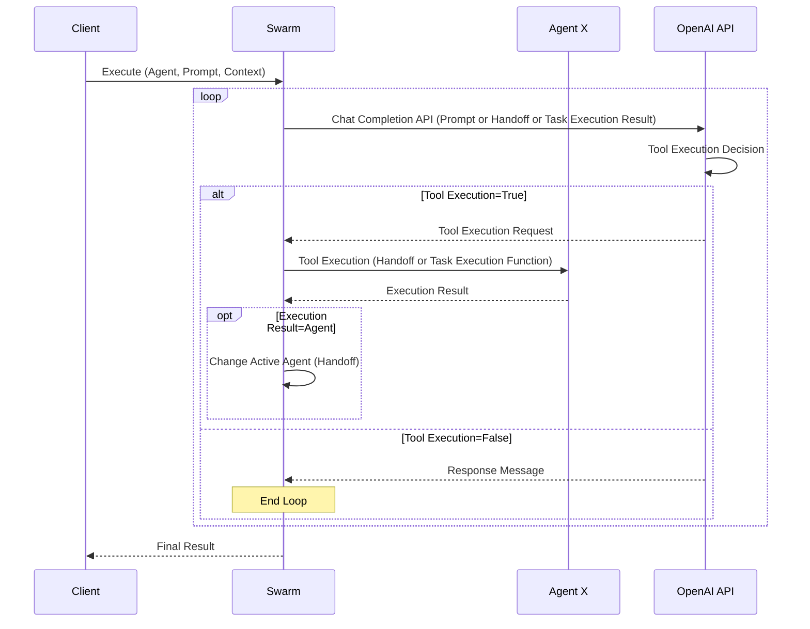

This is the article for Day 4 of the [Mamezou Developer Site Advent Calendar 2024](/events/advent-calendar/2024/).

When discussing AI technologies expected to make significant strides in 2025, agent functionality is a prime contender[^1].

Recently, Anthropic made headlines by releasing a beta version[^2] of an AI agent called [Computer Use](https://docs.anthropic.com/en/docs/build-with-claude/computer-use), which directly operates a PC. Meanwhile, other AI vendors like OpenAI and Google are also expected to sequentially release autonomous agent functionalities, garnering high expectations (and ethical concerns).

[^1]: The definition of agent functionality is not entirely clear, but here it refers to AI recursively executing tasks until a goal is achieved on behalf of humans.  
[^2]: Although currently in beta, it is accessible via the Anthropic API, AWS Bedrock, and Google Cloud Vertex (Claude 3.5 Sonnet model).

This time, I want to explore how these promising AI agents collaborate to execute a single objective (agent orchestration). There are various ways to achieve this, but I’ll delve into the method mentioned in the following article from the OpenAI Cookbook:

@[og](https://cookbook.openai.com/examples/orchestrating_agents)

The term "Swarm" in this article's title refers to a sample implementation of agent orchestration mentioned in the article, which is publicly available on GitHub (the name reminded me of Docker Swarm[^3]).

[^3]: Although completely unrelated to Docker Swarm, the concept is similar in that Docker Swarm coordinates containers, while OpenAI's Swarm coordinates agents, differing only in their targets.

@[og](https://github.com/openai/swarm/tree/main)

This repository is not an official product but serves as a useful resource for learning about the concept of agent orchestration.

## The Concept of Swarm

Swarm's concept is very simple and consists of the following two components:

## Routines / Agent

While referred to as "Routines" in the Cookbook, the Swarm README calls them "Agents." In this article, I will use the term "Agent" for consistency.

Here’s a quote from the Cookbook article:

> The notion of a "routine" is not strictly defined, and instead meant to capture the idea of a set of steps. Concretely, let's define a routine to be a list of instructions in natural language (which we'll represent with a system prompt), along with the tools necessary to complete them.

As described, an agent consists of instructions written in natural language and the tools needed to execute them.

At the implementation level, an agent is a Chat Completion API that uses function calling. Below is the type definition of Swarm's Agent class:

```python
class Agent(BaseModel):
    name: str = "Agent"
    model: str = "gpt-4o"
    instructions: Union[str, Callable[[], str]] = "You are a helpful agent."
    functions: List[AgentFunction] = []
    tool_choice: str = None
    parallel_tool_calls: bool = True
```

Here, the `instructions` (system message) and `functions` (function calling) are key properties. The agent's responsibilities and instructions to achieve them are set in `instructions`, while the actual functions to execute them are set in `functions`.

Since multiple agents are involved, each agent can be identified by its `name`.

The definition of a Swarm agent is very simple, focusing only on the essentials.

## Handoff

The core of agent orchestration is Handoff. Here’s a quote from the Cookbook:

> Let's define a handoff as an agent (or routine) handing off an active conversation to another agent, much like when you get transferred to someone else on a phone call. Except in this case, the agents have complete knowledge of your prior conversation!

It’s akin to transferring a phone call to another person.

In the context of agent orchestration, Handoff occurs when an agent determines that a task exceeds its scope of responsibility and passes it on to the appropriate agent.

For example, in the case of task handoff from Agent A to Agent B, it would look like this:



By connecting agents through successive Handoffs, a larger agent orchestration network can be constructed.

In Swarm, Handoff is achieved by adding a handoff function to the tools. A Handoff function looks like this:

```python
# Target agent for handoff
refund_agent = Agent(...)

# Handoff function
def transfer_to_refunds():
    """Execute when the user requests a refund."""
    return refund_agent
```

The rule for a Handoff function is to return the next agent as its return value. Additionally, naming the Handoff function as `transfer_to_XXX` (XXX: agent name) allows the LLM to appropriately determine whether to execute it.

This Handoff function is specified as one of the tools (`functions`) for the agent initiating the handoff.

```python
triage_agent = Agent(
    name="Triage Agent",
    instructions=triage_instructions,
    # Set Handoff functions
    functions=[transfer_to_flight_refunds, transfer_to_xxxx],
)
```

Although this agent is configured with only Handoff functions, they can, of course, be combined with regular functions. By specifying them in this way, the agent (LLM) selects the appropriate next agent and hands over the current task.

## Swarm Execution Sequence

I’ve outlined the general execution sequence of Swarm (omitting finer details):



The process is straightforward: the Chat Completion API is executed repeatedly until the LLM determines that no tool execution is needed (i.e., it generates a message). During this process, if a Handoff function is executed, the active agent is switched. Moreover, although not shown in the diagram, when a Handoff occurs, the message history and context information are also passed along, enabling the subsequent agent to reference past information and user context.

If tasks are executed interactively between the user and agents rather than fully automatically, this sequence can be looped to achieve the desired functionality. Swarm provides this as the [run_demo_loop function](https://github.com/openai/swarm/blob/main/swarm/repl/repl.py#L60).

## Running Swarm

Now that we understand the mechanism of agent orchestration, let’s run Swarm. This time, we’ll create a travel planning feature by coordinating the following agents:

- Travel Planning Integration Agent: Collects information from other agents and proposes a travel plan to the customer.
- Tourist Spot Suggestion Agent: Suggests a list of tourist spots based on the destination.
- Accommodation Suggestion Agent: Proposes accommodations near the destination.
- Transportation Suggestion Agent: Selects the optimal transportation method based on the departure and destination points.

In this setup, the Travel Planning Integration Agent serves as the user's point of contact, collecting information from other agents (via Handoff) and creating the final travel plan proposal. 

... (The rest of the article continues in the same translated style.)
