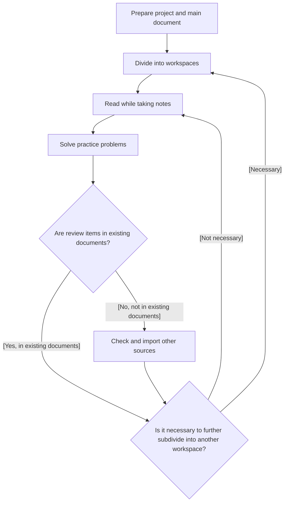

This is the article for Day 18 of the [Mamezou Developer Site Advent Calendar 2024](/events/advent-calendar/2024/).

## Introduction
I am Yamashita from the Business Solutions Division. This time, I would like to introduce LiquidText, a document management tool, in relation to studying for AWS certification exams.

The contents that will be covered in this article and those that will not are as follows.

### Things to be covered
- Introduction to LiquidText
- Compatibility between studying for AWS certification exams and LiquidText
- My personal use cases
### Things not to be covered
- Strategies for specific AWS certifications
- Detailed features of LiquidText

## What is LiquidText
@[og](https://www.liquidtext.net/)
It is a document tool that has been attracting attention in recent years. It allows efficient management of knowledge beyond just documents, such as extracting and storing text and images from within documents.
On the [official page](https://www.liquidtext.net/), the following features are introduced.
- Flexible PDF annotation capabilities: Easily add highlights and notes with drag & drop
- Intuitive document comparison: Open multiple PDFs simultaneously for cross-referencing and comparison
- Interactive workspace: Extract important parts and enable linking and grouping
- Multi-device support: Sync and use across various devices like iPad and Windows

Some parts may be difficult to understand with just text, so I will include examples below.
### An Example Project
This is a quote from a workspace provided as a sample.
I think you can get a sense by looking at the images below.

In the default settings, documents are placed on the left half, and the workspace (memo area) is on the right half.
In the workspace, you can pull text and images directly from documents, as well as add additional notes. Moreover, from the text pulled into the workspace, you can quickly refer to the original text in the document.

## Compatibility between AWS Certification and LiquidText
AWS certifications generally have the following characteristics.
- Comprehensive knowledge of the targeted services is required
- Need to understand standard (architectural) patterns
    - Setting up CloudFront with S3 as the origin
    - Serverless architectures combining Lambda, API Gateway, and DynamoDB
    - etc.
- Understanding of some YAML templates is also necessary
    - CloudFormation stacks
    - S3 bucket policies
    - etc.
- A certain level of understanding of underlying theories is required
    - Understanding of DNS servers in the case of Route53
    - Knowledge of machine learning (limited to MEA)
    - etc.

In this way, you need to acquire broad and deep knowledge. However, there is no need to be afraid.
Whether paid or free, there are always documents that correspond to these levels of detail.
Reflecting on the characteristics mentioned earlier, the following correlations can be imagined.

- Comprehensive knowledge of the targeted services is required
    → Documents from certification preparation courses
- Need to understand standard (architectural) patterns
    → Documents from courses, AWS official documentation, and sometimes online articles
- Understanding of some YAML templates is also necessary
    → AWS official documentation, etc.
- A certain level of understanding of underlying theories is required
    → Other documents

If you can save multiple necessary documents and aggregate and manage a wide range of information, you can advance your studies advantageously.
Therefore, I chose the aforementioned LiquidText as a document management tool.
Below, I will briefly introduce how I actually use it, so I hope you can get a better idea.

## Use Cases in Studying for AWS Certification Exams
### Utilization Flow
I generally use LiquidText in the following way.

Basically, I use LiquidText during the initial project creation and at review timings.
At the initial timing, I prepare and import the main document. At this timing, dividing into workspaces may make it easier to see the overall picture.
Also, since you can get an overview of the document when dividing the workspace, I personally recommend it.
Next, at the review timing, I utilize the search function to check whether it is described in the document.
If it is included in the document, I check it in detail; if not, I bring in and read external sources.
Also, if expressions in textbooks etc. are hard to understand, I import other sources such as explanatory articles.
Since this is too abstract, I will give a scenario using a specific AWS service (Route53) as an example.
- At the initial stage, you settle for an overview understanding of Route53
- For the time being, prepare a workspace called Route53
- Drag chapter titles in the document to the workspace to link the workspace and document
- Solve practice questions
- From the results of the practice questions, realize that your understanding of Route53 is insufficient
- Check the course textbook and further divide the workspace by sub-concepts (hosted zones, resolvers)
- Link the created workspace and document
- Being asked about specific scenarios
    - For example, linking a private hosted zone used in another AWS account to your own VPC
- Import another document and link it with the workspace
- Solve the problem
- etc…

It's a bit embarrassing, but here's how it actually looks.

### Example 1: AWS Budgets

- In addition to chapter titles, important expressions are stored in the workspace
- You can also jump to the PDF description from the memo on the right
### Example 2: CloudHSM

- For items that are not core teaching materials, I import separately from explanatory articles
- If there are unclear expressions or points to note, I drag them into the memo area
### Example 3: Workspace with Hierarchical Structure

- It is possible to have a hierarchical structure in the workspace

## Other Observations and Notes
- Cannot handle large PDF files  
  There is a file size limit, and importing large PDF files or a large number of documents at once may cause unstable operation or crashes. If it exceeds 50MB per file, consider splitting it.
- Efficient workspace management methods  
  It's okay to divide by AWS service, but if there are detailed topics, it seems better to further divide them. In any case, combining everything into one workspace seems to make it harder to see.
- Not suitable for index-like organization  
  Even if you make full use of the search function, there doesn't seem to be a way to instantly grasp where a specific category is described at this time. I used another tool in combination.
- Importing multiple documents requires payment  
  You need to purchase a license or sign up for a monthly plan[^1]. For details, please refer to [Pricing Link](https://www.liquidtext.net/pricing-features)
- You cannot pass the exam by just reading documents  
  No matter how much you use LiquidText, it is difficult to pass the exam with documents alone. Please limit it to document management.
    
[^1]: As of December 2024, a one-time purchase is $49.99, and monthly payments start from $7.99.

## Conclusion
This time, I introduced how to utilize LiquidText, focusing on studying for AWS certification exams.
I am currently still studying, but I find it very useful for learning AWS certifications.
It's a very user-friendly tool as an aid when reading documents, regardless of certification study, so if you're even slightly interested, it might be worth trying out.
