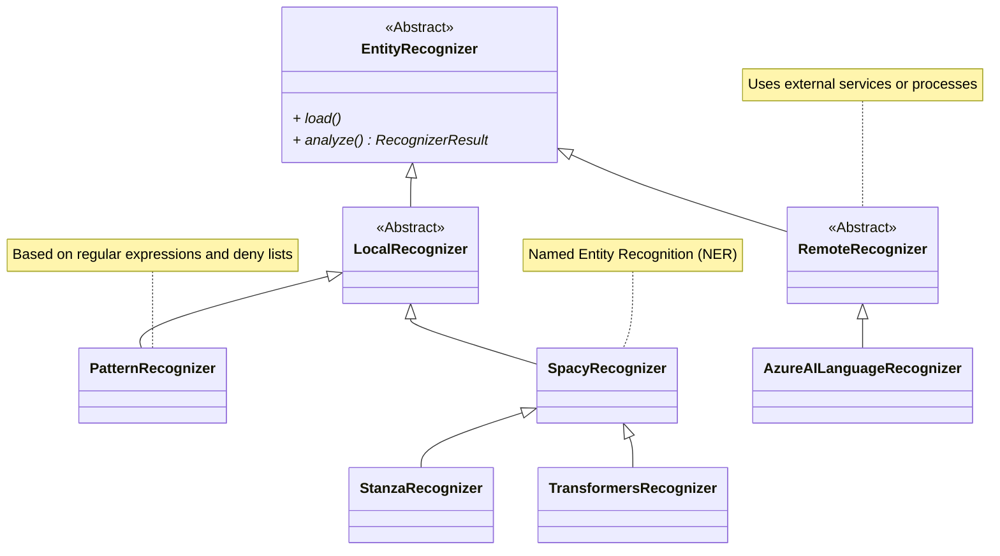

Recently, I feel that awareness toward the protection of personal information has been increasing more and more.
Behind this trend is the introduction and spread of large language models (LLMs). LLMs are being utilized in various situations, but since the data they handle may include personal information, appropriate management is required.

In such circumstances, I have focused on Microsoft's open-source tool, Presidio.

@[og](https://github.com/microsoft/presidio/)

Presidio is a Python framework designed to detect and anonymize personally identifiable information (PII).
This allows companies and developers to safely utilize data in LLMs and other systems.

As a feature of Presidio, it can be noted that it can accurately detect personal information from unstructured data.
By performing masking or replacement processing on the detected information, it achieves practical data utilization while ensuring data confidentiality.

Also, Presidio is characterized by its modular design, making it easy to add custom entities and change processing logic.
This provides flexibility to meet different requirements for each country or organization.

:::info
Presidio includes packages targeting personal information within image data and structured data (provided as beta or alpha versions at the time of writing).
This article does not cover these features, so if you are interested, please refer to the official documentation below.

- [Presidio Doc - Presidio Image Redactor](https://microsoft.github.io/presidio/image-redactor/)
- [Presidio Doc - Presidio structured](https://microsoft.github.io/presidio/structured/)
:::

## Setting Up Presidio

Setting up Presidio is very simple.
Here, we will explain the basic installation steps to use Presidio Analyzer, which detects personal information, and Presidio Anonymizer, which anonymizes it.

First, install the necessary Presidio packages.

```shell
pip install presidio-analyzer presidio-anonymizer
```

Presidio uses natural language processing frameworks (hereafter referred to as NLP engines) to perform mainly two tasks.
One is the identification of personal information (PII) based on named entity recognition (NER), and the other is rule-based feature extraction that enables advanced detection leveraging context.

This time, we will use the Japanese model of [spaCy](https://spacy.io/) ([ja_core_news_trf](https://spacy.io/models/ja#ja_core_news_trf)) as the NLP engine.
We will download this individually using spaCy's download command.

```shell
python -m spacy download ja_core_news_trf
# Confirm the downloaded model (Pipelines)
python -m spacy info
# ============================== Info about spaCy ==============================
# 
# spaCy version    3.8.3                         
# Location         /path/to/presidio-trial/.venv/lib/python3.12/site-packages/spacy
# Platform         macOS-15.1.1-arm64-arm-64bit  
# Python version   3.12.4                        
# Pipelines        en_core_web_lg (3.8.0), ja_core_news_trf (3.8.0)
```

Other NLP engines that can be used include [stanza](https://stanfordnlp.github.io/stanza/), [Huggingface Transformers](https://huggingface.co/docs/transformers/en/index).

- [Presidio Doc - Customizing the NLP engine in Presidio Analyzer](https://microsoft.github.io/presidio/analyzer/customizing_nlp_models/)

## Basic Usage

Here, we will explain the steps to detect and anonymize personal information from sample text using Presidio.
In the following example, we use Japanese text that includes personal names (PERSON) and phone numbers (PHONE_NUMBER).

### Detecting Personal Information (Presidio Analyzer)

We will use Presidio Analyzer to detect personal information within the text.

```python
from presidio_analyzer import AnalyzerEngine
from presidio_analyzer.nlp_engine import NlpEngineProvider

# Set up NLP engine. Specify the downloaded Japanese model
configuration = {
    "nlp_engine_name": "spacy",
    "models": [
        {"lang_code": "ja", "model_name": "ja_core_news_trf"}
    ],
}
provider = NlpEngineProvider(nlp_configuration=configuration)
nlp_engine = provider.create_engine()

analyzer = AnalyzerEngine(nlp_engine=nlp_engine, supported_languages=["ja"])

sample_text = "豆蔵太郎の電話番号は080-1234-5678です。"

# Detect personal information
results = analyzer.analyze(
    text=sample_text,
    entities=["PERSON", "PHONE_NUMBER"],
    language="ja"
)
for result in results:
    print(f"entity: {result.entity_type}, start: {result.start}, end: {result.end}")
```

This code's execution result is as follows.

```
(Output Result)
entity: PERSON, start: 0, end: 4, score: 0.85
entity: PHONE_NUMBER, start: 10, end: 23, score: 0.4
```

- entity: The type of entity detected (PERSON, PHONE_NUMBER).
- start/end: Detection position within the text.
- score: Confidence score of the detection (ranging from 0 to 1).

From this, we can see that personal information such as names and phone numbers have been correctly detected.

:::info
By specifying a threshold `score_threshold` when detecting personal information, you can exclude detections with scores below that threshold.

```python
results = analyzer.analyze(
    text=sample_text,
    entities=["PERSON", "PHONE_NUMBER"],
    language="ja",
    score_threshold=0.5 # Specify score threshold
)
```

In this example, if you specify as above, the phone number with a score of 0.4 will be excluded from the detection results.
:::

### Anonymizing Personal Information (Presidio Anonymizer)

Next, let's try anonymizing the personal information. Continue the following after the previous personal information detection.

```python
from presidio_anonymizer import AnonymizerEngine

anonymizer = AnonymizerEngine()
# Anonymize the sample text by passing the personal information detection results
anonymized_text = anonymizer.anonymize(text=sample_text,analyzer_results=results)

for item in anonymized_text.items:
    print(f"entity: {item.entity_type}, start: {item.start}, end: {item.end}, text: {item.text}, operator: {item.operator}")
print(f"匿名化結果: {anonymized_text.text}")
```

This code's execution result is as follows.

```
entity: PHONE_NUMBER, start: 14, end: 28, text: <PHONE_NUMBER>, operator: replace
entity: PERSON, start: 0, end: 8, text: <PERSON>, operator: replace
匿名化結果: <PERSON>の電話番号は<PHONE_NUMBER>です。
```

It can be seen that the detected personal information has been anonymized (in this case, replaced with the entity name).

## Customizing Personal Information Recognizer

It can be understood that Presidio can detect personal information with a certain accuracy even in its default state.
However, in actual operations, it is almost essential to accurately detect Japan-specific information or organization-specific formats, making customization necessary.

In customizing personal information recognition rules, Recognizer plays a central role.

Each Recognizer detects one or more entities (such as names, phone numbers, addresses) using different methods.
The following methods are utilized to achieve this:

- Regular expressions/deny lists: Efficient detection based on fixed patterns.
- Named Entity Recognition (NER): Uses machine learning models that consider context to achieve advanced detection. Utilizes NLP engines such as spaCy or stanza.
- Custom logic: Applies unique rules based on specific business or project requirements.

By flexibly combining these, highly accurate detection is achieved.

Below is a class diagram showing the main Recognizers in Presidio.



It is a hierarchical structure with EntityRecognizer at the top.
The classes to check when customizing Recognizer are as follows:

- [EntityRecognizer](https://github.com/microsoft/presidio/blob/main/presidio-analyzer/presidio_analyzer/entity_recognizer.py)
  - The base class of all Recognizers. The load method and analyze method are extension points.
- [LocalRecognizer](https://github.com/microsoft/presidio/blob/main/presidio-analyzer/presidio_analyzer/local_recognizer.py)
  - Recognizer used in local processes.
- [PatternRecognizer](https://github.com/microsoft/presidio/blob/main/presidio-analyzer/presidio_analyzer/pattern_recognizer.py)
  - Recognizer based on regular expressions and deny lists. Also supports validation and context-based score enhancement (Context Enhancement).
- [RemoteRecognizer](https://github.com/microsoft/presidio/blob/main/presidio-analyzer/presidio_analyzer/remote_recognizer.py)
  - Recognizer used in remote processes including external services.

In addition, although not mostly shown in the above diagram, Presidio provides many built-in Recognizers.

@[og](https://github.com/microsoft/presidio/tree/main/presidio-analyzer/presidio_analyzer/predefined_recognizers)

First, it might be good to check if you can customize one of the Recognizers among these, and if not, create your own. The source code of the built-in Recognizers is very helpful when creating your own.

### Built-in Recognizers

Here, we will apply by customizing a Recognizer built into Presidio.

#### Adapting Phone Numbers for Japan

In the earlier example, the mobile phone number 080-1234-5678 was detected, but this did not consider Japan's unique numbering system.
In fact, it just matched with other regions' (IN for India) formats that are set by default.

To confirm this, let's change the phone number from 080-1234-5678 to the landline number 03-1234-5678 and try again. The execution result is as follows.

```
entity: PERSON, start: 0, end: 4, score: 0.85
```

In this result, the name (PERSON) is detected, but the phone number (PHONE_NUMBER) is not detected.

Let's change this so that it can also detect Japanese phone number formats.
As below, we will add and set the built-in [PhoneRecognizer](https://github.com/microsoft/presidio/blob/main/presidio-analyzer/presidio_analyzer/predefined_recognizers/phone_recognizer.py) to support Japan.

```diff-python
# (Omitted)

+ from presidio_analyzer.predefined_recognizers import PhoneRecognizer

provider = NlpEngineProvider(nlp_configuration=configuration)

nlp_engine = provider.create_engine()
+ phone_recognizer = PhoneRecognizer(
+     supported_regions=["JP"],
+     supported_language="ja",
+     context=["電話"]
+ )
+ analyzer = AnalyzerEngine(nlp_engine=nlp_engine, supported_languages=["ja"])
+ analyzer.registry.add_recognizer(phone_recognizer)

+ # Sample text -> Identify landline phone
+ sample_text = "豆蔵太郎の電話番号は03-1234-5678です。"

# Detect personal information
results = analyzer.analyze(
    text=sample_text,
    entities=["PERSON", "PHONE_NUMBER"],
    language="ja"
)
for result in results:
    print(f"entity: {result.entity_type}, start: {result.start}, end: {result.end}, score: {result.score}")
```

In PhoneRecognizer's constructor, we specify the region (`supported_regions`) as `JP` to handle phone numbers unique to Japan[^1].

[^1]: PhoneRecognizer internally uses [phonenumbers](https://pypi.org/project/phonenumbers/) to identify phone number formats corresponding to each region.

Also, here we have specified `context` as `電話` (phone).
This uses Presidio's Context Enhancement feature, which adjusts the score based on context. Here, if the word 'phone' is included in the entity's surroundings[^2], it is judged that it is more likely to be a phone number, and the score is increased[^3].
The added score and the range of context can be adjusted freely. For details, please refer to the official documentation.

[^2]: In the default settings, it checks if the context word is included in the previous 5 tokens. The source code of the Enhancer being used is [here](https://github.com/microsoft/presidio/blob/main/presidio-analyzer/presidio_analyzer/context_aware_enhancers/lemma_context_aware_enhancer.py).
[^3]: By default, if the context matches, 0.35 is added. Also, the score is corrected so that it does not fall below 0.4 after addition.

- [Presidio Doc - Leveraging context words](https://microsoft.github.io/presidio/tutorial/06_context/)

When we run this, we get the following results.

```
entity: PERSON, start: 0, end: 4, score: 0.85
entity: PHONE_NUMBER, start: 10, end: 22, score: 0.75
```

This time, it can be seen that it is detected as a phone number. Also, the score has increased from 0.4 earlier to 0.75.
This is because the score addition according to context matching (here, `電話`) by Context Enhancement is effective.

#### Recognizing Credit Card Numbers

While trying various things, I noticed that when Japanese is specified, credit card numbers are not recognized as personal information. This is a big issue.

However, Presidio provides a built-in Recognizer ([CreditCardRecognizer](https://github.com/microsoft/presidio/blob/main/presidio-analyzer/presidio_analyzer/predefined_recognizers/credit_card_recognizer.py)) for credit card numbers.
This Recognizer performs checksum validation in addition to pattern matching with regular expressions.
However, upon carefully reading the source code, this Recognizer only supports a few languages like English and Spanish, and does not support Japanese[^4].

[^4]: It requires word boundaries (\b), and does not support full-width numbers or hyphens. This may be the reason why it is not set by default due to these issues.

Let's customize CreditCardRecognizer for Japan and add it.
We have described it as follows.
Note that the regular expressions used here are barely tested. **Please do not copy and use them as is** (no responsibility is taken).

```diff-python
# (Omitted)

+ from presidio_analyzer.predefined_recognizers import CreditCardRecognizer

provider = NlpEngineProvider(nlp_configuration=configuration)

nlp_engine = provider.create_engine()

+ pattern = Pattern(
+     name="credit_card_ja",
+     score=0.3,
+     regex=r"(?:[４4][0-9０-９]{3}|[５5][1-５0-５][0-9０-９]{2}|[３3][0-9０-９]{3}|[６6][0-9０-９]{3}|[１1][0-9０-９]{3})[ー－\- 　]?(?:[0-9０-９]{4}[ー－\- 　]?){2}[0-9０-９]{4}"
+ )
+ credit_card_recognizer = CreditCardRecognizer(
+     patterns=[pattern],
+     supported_language="ja",
+     replacement_pairs=[("-", ""), (" ", ""),("　", ""),("ー", ""), ("－", "")]
+ )
+ analyzer.registry.add_recognizer(credit_card_recognizer)

+ # Add a credit card number (full-width characters)
+ sample_text = "豆蔵太郎の電話番号は03-1234-5678です。クレジットカード番号は４５００ー１２３４ー５６７８ー９０１２です。"

# Detect personal information
results = analyzer.analyze(
    text=sample_text,
+   entities=["PERSON", "PHONE_NUMBER", "CREDIT_CARD"],
    language="ja"
)
for result in results:
    print(f"entity: {result.entity_type}, start: {result.start}, end: {result.end}, score: {result.score}")
```

Following the same steps as the phone number (PhoneRecognizer), we create an instance of CreditCardRecognizer and add it to the registry.
When creating CreditCardRecognizer, we customize the regular expression (`pattern`) and replacement conditions (`replacement_pairs`) to consider full-width formats.

The execution result is as follows.

```
entity: CREDIT_CARD, start: 36, end: 55, score: 1.0
entity: PERSON, start: 0, end: 4, score: 0.85
entity: PHONE_NUMBER, start: 10, end: 22, score: 0.75
```

It can be seen that the credit card number in full-width format has been correctly detected.
CreditCardRecognizer adjusts the score to 1.0 after passing the checksum validation following the regular expression match (if it fails, it becomes 0.0).

:::info
Here we are setting in code, but you can also specify using a YAML file. This is explained in the official documentation below.

- [Presidio Doc - Customizing recognizer registry from file](https://microsoft.github.io/presidio/analyzer/recognizer_registry_provider/)

Also, you can check the default settings from here.

- [GitHub microsoft/presidio - /presidio-analyzer/presidio_analyzer/conf/default_recognizers.yaml](https://github.com/microsoft/presidio/blob/main/presidio-analyzer/presidio_analyzer/conf/default_recognizers.yaml)

As you can see, as of now (`2.2.356`), there are no settings considering Japan.
It might be better to prepare a dedicated configuration file in advance, rather than changing it based on source code as we are doing here.
:::

### Creating a Custom Recognizer

Next, let's try creating a Recognizer ourselves.
As an example, we will create a Recognizer that identifies employee numbers unique to the organization. Assume that the format of the employee number is as follows.

- `MZ-` (fixed value) + 4-digit number (year of joining - Gregorian calendar) + `-` (fixed value) + 6-digit number (serial number)
  - Example) MZ-2000-000001
- Only years 19xx or 20xx are valid for the year of joining
- Allow full-width characters

We will create this Recognizer ourselves. Here, we will create a PatternRecognizer that identifies employee numbers using regular expressions.

```python
from presidio_analyzer import AnalyzerEngine, Pattern, PatternRecognizer
from presidio_analyzer.nlp_engine import NlpEngineProvider

configuration = {
    "nlp_engine_name": "spacy",
    "models": [
        {"lang_code": "ja", "model_name": "ja_core_news_trf"}
    ],
}
provider = NlpEngineProvider(nlp_configuration=configuration)

nlp_engine = provider.create_engine()

# Regular expression for employee number
pattern = Pattern(
    name="mz_emp_number",
    regex=r"[MＭ][ZＺ][\-－ー](?:[１1][９9][0-9０-９]{2}|[２2][０0][0-9０-９]{2})[\-－ー][0-9０-９]{6}",
    score=0.5
)
emp_number_recognizer = PatternRecognizer(
    supported_entity="MZ_EMP_NUMBER",
    name="mz_emp_number",
    supported_language="ja",
    patterns=[pattern],
    context=["社員"]
)
analyzer.registry.add_recognizer(emp_number_recognizer)

# Sample texts
sample_texts = [
    "MZ-2001-000001",
    "ＭＺー２００１ー０００００１", # Full-width characters
    "社員番号: MZ-1990-000001", # Context enhancement
    "MZ-3001-000001", # Invalid (joining year is 3001)
    "MZ-2001-000000", # Serial number is all zeros
    "MZ-2001-999999", # Serial number is all nines
    "MZ-2099-000001", # Invalid Gregorian year (future)
    "MZ-1900-000001"  # Invalid Gregorian year (distant past)
]
# Detection
for sample_text in sample_texts:
    results = analyzer.analyze(
        text=sample_text,
        entities=["MZ_EMP_NUMBER"],
        language="ja"
    )
    print(f"text: {sample_text}, score:{results[0].score if len(results) > 0 else 'None'}")
```

First, we create a Pattern with the regular expression for the employee number and the matching score, and based on that, generate an instance of PatternRecognizer.
Since it's a new entity, we specified the entity name (MZ_EMP_NUMBER) in `supported_entity` in the constructor.
Also, as with the phone number example, we set context (`社員`, which means "employee") to enhance the score based on context.
Finally, adding this Recognizer to the registry completes the setup.

:::column: Executing Personal Information Detection as Batch Processing
In the above source code, personal information detection is performed for each text, but a [BatchAnalyzerEngine](https://github.com/microsoft/presidio/blob/main/presidio-analyzer/presidio_analyzer/batch_analyzer_engine.py) is also provided for execution as batch processing.
By using this, you can execute personal information detection from text prepared as Iterable or Dict.

Below is the source code rewritten using BatchAnalyzerEngine.

```python
# (Omitted)
analyzer.registry.add_recognizer(emp_number_recognizer)
# Sample texts
sample_texts = [
  # ...(omitted)
]
batchAnalyzer = BatchAnalyzerEngine(analyzer_engine=analyzer)
batch_results = batchAnalyzer.analyze_iterator(
    texts=sample_texts, 
    language="ja", 
    entities=["MZ_EMP_NUMBER"]
)
for index, results in enumerate(batch_results):
    print(f"text: {sample_texts[index]}, score:{results[0].score if len(results) > 0 else 'None'}")
```
:::

When we execute this, it becomes as follows (comments are added).

```
text: MZ-2001-000001, score:0.5 # OK
text: ＭＺー２００１ー０００００１, score:0.5 # OK
text: 社員番号: MZ-1990-000001, score:0.85 # OK (Context enhancement)
text: MZ-3001-000001, score:None # OK (Only 19xx/20xx are valid)
text: MZ-2001-000000, score:0.5 # OK?? Serial number is all zeros
text: MZ-2001-999999, score:0.5 # OK?? Serial number is all nines
text: MZ-2099-000001, score:0.5 # OK?? (Future year)
text: MZ-1900-000001, score:0.5 # OK?? (Distant past)
```

The results are generally as expected.
Full-width support and score addition due to context (`社員`) (0.85), checking the upper two digits of the Gregorian calendar year are as expected.

However, although it matches the regular expression, there are some patterns that are actually impossible (the last four).
Here, in addition to regular expression matching, we will add the following rules.

- If the serial number is all zeros or all nines, it's invalid
- If the Gregorian year part is in the future, it's invalid
- If the Gregorian year part is within the last 50 years, it's more likely to be an employee number

To implement this, we need a custom Recognizer that goes a step further.
This time, we'll create a new class inheriting from PatternRecognizer and implement the validation logic there.
The added Recognizer class is as follows.

```python
class MyEmpNumberRecognizer(PatternRecognizer):
    REGEX = r"[MＭ][ZＺ][\-－ー](?<year>[１1][９9][0-9０-９]{2}|[２2][０0][0-9０-９]{2})[\-－ー](?<seq>[0-9０-９]{6})"
    PATTERNS = [
        Pattern(
            name="mz_emp_number",
            regex=REGEX,
            score=0.3 # Low score for just regular expression match
        )
    ]
    CONTEXT = ["社員"]

    def __init__(self):
        super().__init__(
            supported_entity='MZ_EMP_NUMBER',
            patterns=self.PATTERNS,
            context=self.CONTEXT,
            supported_language="ja",
        )

    def validate_result(self, pattern_text: str) -> Optional[bool]:
        match = self.PATTERNS[0].compiled_regex.search(pattern_text)

        seq = int(match.group("seq"))
        if seq == 0 or seq == 999999:
            return False

        year = int(match.group("year"))
        current_year = datetime.now().year
        if year > current_year:
            return False # Future date: score 0.0
        elif current_year - 50 <= year <= current_year:
            return True # Within appropriate range: score 1.0
        else:
            return None # No score change (distant past)

emp_number_recognizer = MyEmpNumberRecognizer()
analyzer.registry.add_recognizer(emp_number_recognizer)
```

We adjust the functionality compared to the previous Recognizer as follows.

- Reduce the pattern matching score from 0.5 to 0.3, to make the score low with just regular expression matching
- Override the `validate_result` method to implement additional rules.
  - In PatternRecognizer, returning True sets the score to 1.0, returning False sets the score to 0.0 (not detected as personal information), overriding the score.

By doing this, we adjust the detection accuracy through individual validations in addition to the regular expression.
When executing with the same text, the results are now as follows (comments added).

```
text: MZ-2001-000001, score:1.0 # Within last 50 years: 0.3 -> 1.0
text: ＭＺー２００１ー０００００１, score:1.0 # Same as above
text: 社員番号: MZ-1990-000001, score:1.0 # Since 1.0 is the maximum, context addition is ignored
text: MZ-3001-000001, score:None # OK (Only 19xx/20xx are valid)
text: MZ-2001-000000, score:None # OK (Serial number is all zeros) 
text: MZ-2001-999999, score:None # OK (Serial number is all nines)
text: MZ-2099-000001, score:None # OK (Not detected due to future date)
text: MZ-1900-000001, score:0.3  # OK (Low score because joining year is distant past)
```

The additional rules have been applied, resulting in more accurate detection closer to reality.

## Customizing Anonymization (Anonymizer)

So far, we have focused on customizing the detection (Analyzer) of personal information, but finally, let's briefly look at the anonymization (Anonymizer) side.
In Presidio's default settings, the detected personal information is replaced with the entity name (PERSON or PHONE_NUMBER) as follows.

```
"Mamezou Taro's phone number is 03-1234-5678. The credit card number is ４５００ー１２３４ー５６７８ー９０１２."
↓
"<PERSON>'s phone number is <PHONE_NUMBER>. The credit card number is <CREDIT_CARD>."
```

Customization of anonymization can be achieved simply by specifying the `operators` argument of the Anonymizer.
For details on built-in operators and their parameters, please refer to the official documentation below.

- [Presidio Doc - Presidio Anonymizer](https://microsoft.github.io/presidio/anonymizer/)

In this article, we did not try it, but you can also create your own operators. Please refer to the official documentation below.

- [Presidio Doc - Developing PII anonymization operators](https://microsoft.github.io/presidio/anonymizer/adding_operators/)

Here, let's try some anonymization patterns that are likely to be used in practice.

### Replacing with Fixed Values

First, let's replace the detected personal information with fixed values instead of entity names.

```python
from presidio_anonymizer.entities import OperatorConfig

anonymized_text = anonymizer.anonymize(
    text=sample_text,
    analyzer_results=results,
    operators={
        "DEFAULT": OperatorConfig(operator_name="replace", params={"new_value": "<SECRET>"})
    })
print(anonymized_text.text)
```

The keys of the `operators` argument are entity names or `DEFAULT` (default if not specified).
Here, we set the default rule to replace with `<SECRET>` using the `replace` operator.
The result is as follows.

```
"<SECRET>'s phone number is <SECRET>. The credit card number is <SECRET>."
```

All personal information has been replaced with `<SECRET>`.

### Masking

Next, let's mask the phone number and credit card number.

```python
from presidio_anonymizer.entities import OperatorConfig

anonymized_text = anonymizer.anonymize(
    text=sample_text,
    analyzer_results=results,
    operators={
        "PHONE_NUMBER": OperatorConfig(operator_name="mask", params={"masking_char": "*", "chars_to_mask": 8, "from_end": False}),
        "CREDIT_CARD": OperatorConfig(operator_name="mask", params={"masking_char": "*", "chars_to_mask": 14, "from_end": True})
    })
print(anonymized_text.text)
```

This time, instead of default rules (`DEFAULT`), we set it for each entity.
We specify the operator as `mask` and set parameters.

- masking_char: Character to use for masking (`*`).
- chars_to_mask: Number of characters to mask.
- from_end: Whether to apply the mask from the end.

The result is as follows.

```
"<PERSON>'s phone number is ********5678. The credit card number is ４５００ー**************."
```

The phone number and credit card number have been partially masked.
On the other hand, since we did not specify a rule for the name, the default entity name replacement is applied.

### Custom Functions

Let's specify any function to execute the anonymization process.

```python
def replacer(entity: str):
    katakana = "アイウエオカキクケコサシスセソタチツテトナニヌネノハヒフヘホマミムメモヤユヨラリルレロワヲン"
    return ''.join(random.choices(katakana, k=len(entity)))

anonymized_text = anonymizer.anonymize(
    text=sample_text,
    analyzer_results=results,
    operators={
        "PERSON": OperatorConfig(operator_name="custom", params={"lambda": replacer}),
    })
print(anonymized_text.text)
```

We specify an anonymization function (`replacer`) in the `custom` operator.
The function specified here returns a random katakana string of the same length as the original entity.

The result of the anonymization is as follows.

```
"タルフワ's phone number is <PHONE_NUMBER>. The credit card number is <CREDIT_CARD>."
```

`Mamezou Taro` has been replaced with a random katakana string `タルフワ`.

## Conclusion

In this article, we briefly introduced from the basic usage of Microsoft Presidio to customizing the Analyzer and Anonymizer.
Presidio is designed with an emphasis on extensibility as a framework, and there are many extension points prepared beyond what was introduced here.

There is a wide range of use cases where Presidio can be utilized. Even just thinking a little, the following come to mind.

- Anonymization of personal information from training data used for fine-tuning LLMs
- Removal of personal information in RAG (Retrieval-Augmented Generation)
- Checking whether the LLM prompt contains personal information
- Anonymization when using commercial data as test data
- Masking personal information during data analysis
- Checking whether personal information is included in log files and other records

Presidio can flexibly respond to these use cases and is provided as open-source software (OSS).

In this era where privacy protection is becoming increasingly important, Presidio will be a powerful tool.
Please try it as a valuable option to consider implementing!
