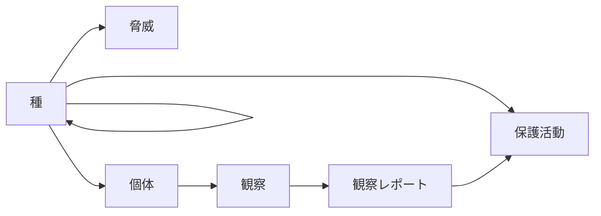

## Introduction
I am Yamashita from the Business Solutions Division. This time, I would like to introduce the CYCLE clause implemented in PostgreSQL.
The CYCLE clause is a feature for safely executing recursive queries.
Specifically, it can detect and prevent infinite loops due to circular references.

## Recursive Queries
In this article, although I will omit detailed explanations, I will briefly touch on recursive queries.
A recursive query is a special SQL query that can refer to **the query result itself** within the query.
It is implemented using the WITH RECURSIVE clause and has the following structure.

- Non-recursive term: The basic query that generates the initial result set
- Recursive term: A query that generates the next result using the previous result
- UNION ALL: Combines the results of both

The specific syntax is as follows.
```sql
WITH RECURSIVE recursive_table AS (
    -- Non-recursive term
    SELECT columns FROM table WHERE condition
    UNION ALL
    -- Recursive term
    SELECT columns FROM table 
    JOIN recursive_table ON condition
)
SELECT * FROM recursive_table;
```

In general, recursive queries are considered effective for data models that represent tree structures or network structures.
However, cycles are an inseparable fate of recursive representations.
There are various countermeasures such as setting a limit on the depth of recursion, but PostgreSQL has implemented the CYCLE clause as an avoidance measure.
By using the CYCLE clause, you can execute queries safely without being conscious of the possibility of circular references.

## Cycle Detection Using the CYCLE Clause
The CYCLE clause is a feature introduced from PostgreSQL version 14 and is used in combination with recursive queries.
By simply adding the following statement at the end of the recursive query, you can achieve cycle detection and prevention[^1].

```sql
CYCLE dst SET is_cycle USING path
```

[^1]: Depending on the version, cycles can be handled without using the CYCLE clause. For details, please see [link](https://www.postgresql.jp/document/16/html/queries-with.html#QUERIES-WITH-CYCLE).

Let's try executing the following sample.
This query is a query that detects paths by connecting `src` and `dst` defined in a temporary table.
When you connect paths, a cycle occurs.

```sql
DROP TABLE IF EXISTS tmp_connectivity;

CREATE TEMPORARY TABLE tmp_connectivity AS
SELECT * FROM (
  VALUES 
      ('a', 'b')
    , ('b', 'c')
    , ('c', 'd')
    , ('b', 'e')
    , ('e', 'f')
    , ('f', 'g')
    , ('f', 'a') -- This causes the path to loop
    , ('h', 'i')
) AS _(src, dst);

WITH RECURSIVE full_connetivity AS (
  -- Non-recursive term
  SELECT 
    *
  FROM tmp_connectivity
  WHERE src = 'a'
  UNION ALL
  -- Recursive term
  SELECT 
    fc.src
    , c.dst
  FROM full_connetivity AS fc
  JOIN tmp_connectivity AS c ON (fc.dst = c.src)
) CYCLE dst SET is_cycle USING path -- Stores the history of dst in path to detect infinite loops

SELECT * FROM full_connetivity;
```

Picking up only the CYCLE clause.
```sql
CYCLE dst SET is_cycle USING path
```

Breaking down only this part, it is as follows.
- Monitors the values of the `dst` column
- Detects when the same value appears again
- Sets `is_cycle` column to true
- The `path` column constantly records the history of the passed paths

When you execute the above query, you should get results like the following.

```sql
 src | dst | is_cycle |         path          
-----+-----+----------+-----------------------
 a   | b   | f        | {(b)}
 a   | c   | f        | {(b),(c)}
 a   | e   | f        | {(b),(e)}
 a   | d   | f        | {(b),(c),(d)}
 a   | f   | f        | {(b),(e),(f)}
 a   | g   | f        | {(b),(e),(f),(g)}
 a   | a   | f        | {(b),(e),(f),(a)}
 a   | b   | t        | {(b),(e),(f),(a),(b)}
```

From the results, you can see that there is a path "a → b → e → f → a → b" where a loop is detected within the path.

## Explanation of the Sample Model
As a sample, I designed a data model similar to an ecosystem surrounding wild animals[^2].
[^2]: I left the design of the data model to a generative AI.

Please check the following repository for the sample.
[https://github.com/shohei-yamashit/cycle-postgres-wild](https://github.com/shohei-yamashit/cycle-postgres-wild)

:::info
In this sample, you can launch the DB container from `compose.yml` directly under the repository.
Since you can launch a PostgreSQL container with predefined data, you don't need to execute additional SQL.
:::

The tables that appear this time are as follows.
```
- ConservationStatus
    Manages the conservation status of species in the table. Includes descriptions of conservation statuses.
- Species
    Manages basic information of species. Has the species name, conservation status, and relationships with other species (self-reference).
- WeatherPattern
    Manages information about weather patterns. Includes descriptions of patterns.
- Ecosystem
    Manages basic information about ecosystems. Includes the ecosystem name.
- Habitat
    Manages habitat information of organisms. Has the habitat name and the relationship with the belonging ecosystem.
- Region
    Manages geographical region information. Has the region name and the relationship with the weather pattern.
- Animal
    Manages information of individual animals. Has relationships with species, region, and habitat.
- Event
    Manages event information related to observation and conservation. Includes descriptions of events.
- Threat
    Manages threat information to species. Includes descriptions of threats and the affected species.
- PlantSpecies
    Manages information about plant species. Has the plant species name and the relationship with the habitat.
- AnimalSighting
    Records sighting information of animals. Has the animal ID, timestamp, and relationship with related events.
- Researcher  
    Manages basic information about researchers. Includes the researcher name.
- ObservationReport
    Manages detailed reports related to animal sightings. Has a relationship with the sighting information.
- ConservationAction
    Manages information about conservation actions for species. Includes descriptions of actions, target species, and responsible researchers.
```

Even with this, it's hard to grasp the whole picture, so I will also show the ER diagram.


## Applying the CYCLE Clause to the Sample
Now, we will derive a query that meets the following requirements.
```sql
From the aforementioned tables, derive tables related to species by tracing column names such as '〇〇id'
```

First, without using the CYCLE clause, we prepare a recursive query targeting `information.column` to obtain the relations.

```sql
WITH RECURSIVE species_relative AS (
    SELECT 
        * 
    FROM 
        has_species_id
    UNION ALL
        SELECT
            cl_info.table_name AS name
            , CONCAT(cl_info.table_name,'id') AS id_with_table
            , cl_info.column_name
            , cl_info.data_type
            FROM species_relative AS ir, information_schema.columns AS cl_info
        WHERE 
            cl_info.column_name = ir.id_with_table
            AND
            table_schema = 'public'            
)
,  has_species_id AS (
    SELECT 
        table_name
        , CONCAT(table_name,'id') AS id_with_table
        , column_name
        , data_type
    FROM information_schema.columns AS cl_info
    WHERE 
        table_schema = 'public'
        AND
        column_name = 'speciesid'
)
SELECT * FROM species_relative
```

:::info
Like other DBMS, PostgreSQL has tables to manage the system information of the DB.
Specifically, metadata is stored in a schema called the information schema.
Details: [https://www.postgresql.jp/document/16/html/information-schema.html](https://www.postgresql.jp/document/16/html/information-schema.html)
This time, we are focusing on the `information.column` table because we want to examine the table relations based on column names.
:::

An infinite loop occurs, so the execution may not end indefinitely, etc.
This won't get us anywhere, so let's add a CYCLE clause.
The query to be executed becomes as follows.

```sql
WITH RECURSIVE species_relative AS (
    SELECT 
        * 
    FROM 
        has_species_id
    UNION ALL
        SELECT
            cl_info.table_name AS name
            , CONCAT(cl_info.table_name,'id') AS id_with_table
            , cl_info.column_name
            , cl_info.data_type
            FROM species_relative AS ir, information_schema.columns AS cl_info
        WHERE 
            cl_info.column_name = ir.id_with_table
            AND
            table_schema = 'public'
            
) CYCLE table_name SET is_cycle USING path_cycle -- Added

,  has_species_id AS (
    SELECT 
        table_name
        , CONCAT(table_name,'id') AS id_with_table
        , column_name
        , data_type
    FROM information_schema.columns AS cl_info
    WHERE 
        table_schema = 'public'
        AND
        column_name = 'speciesid'
)
SELECT table_name, column_name, is_cycle, path_cycle FROM species_relative;
```

When you execute this query, you should get results like the following.

```sql
     table_name     |   column_name    | is_cycle |                        path_cycle                         
--------------------+------------------+----------+-----------------------------------------------------------
 species            | speciesid        | f        | {(species)}
 animal             | speciesid        | f        | {(animal)}
 threat             | speciesid        | f        | {(threat)}
 conservationaction | speciesid        | f        | {(conservationaction)}
 species            | speciesid        | t        | {(species),(species)}
 animal             | speciesid        | f        | {(species),(animal)}
 threat             | speciesid        | f        | {(species),(threat)}
 animalsighting     | animalid         | f        | {(animal),(animalsighting)}
 conservationaction | speciesid        | f        | {(species),(conservationaction)}
 animalsighting     | animalid         | f        | {(species),(animal),(animalsighting)}
 observationreport  | animalsightingid | f        | {(animal),(animalsighting),(observationreport)}
 observationreport  | animalsightingid | f        | {(species),(animal),(animalsighting),(observationreport)}
```
Species refers to itself, and without the CYCLE clause, we couldn't safely execute the recursive query.

## (Bonus) Visualization with Mermaid
Although the main topic of the article has already been covered, I would like to finish the original purpose of listing the related tables.
Let's focus on the `table_name` and `column_name` in the previous results.
There are duplicates, and the expression "id" is added, so let's clean up the results.

```sql
SELECT DISTINCT
    table_name,
    REPLACE(column_name,'id','') AS relative_table_name 
FROM species_relative ORDER BY table_name;
```

Then, if we output in Mermaid format, we can clarify the relationships between the tables.
I will omit detailed explanations of the code, but by running the sample tool, we can output a diagram like the following.

```text
graph LR
        species[種]
        conservationaction[保護活動]
        threat[脅威]
        animal[個体]
        animalsighting[観察]
        observationreport[観察レポート]
        species --> conservationaction
        species --> threat
        species --> animal
        species --> species
        animal --> animalsighting
        animalsighting --> observationreport
        observationreport --> conservationaction
```


In this way, we were able to derive the relationships using recursive queries while avoiding infinite loops.

## Conclusion
In this article, we explained how to safely execute recursive queries using the CYCLE clause in PostgreSQL.
Although there are constraints such as version, please consider using it when executing recursive queries where infinite loops may occur.
