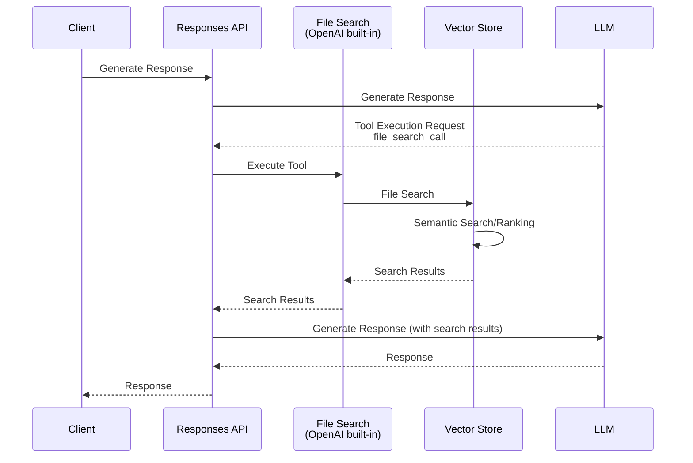

A few days ago, OpenAI released the following update regarding its API:

- [OpenAI News - New tools for building agents](https://openai.com/index/new-tools-for-building-agents/)

This announcement, which introduced the primitive Responses API for building AI agents along with various built-in tools and the Agent SDK, was very exciting for many developers.

In this article, we will first examine the File Search tool from among those announcements.
Previously, File Search was available only in beta via the Assistants API, which meant it couldn’t be used with the widely adopted Chat Completion API.
Now, with the introduction of the Responses API, File Search is available as a built-in tool (although it still cannot be used with the Chat Completion API).
Functionally, it has also been enhanced over the previous File Search by adding metadata filtering.

The flow using the File Search tool is as follows.



:::info
It has been announced that the Assistants API—which previously supported File Search—will be deprecated once compatibility with the Responses API is introduced (expected in the first half of 2026).

- [OpenAI Docs - What this means for existing APIs - Assistants](https://platform.openai.com/docs/guides/responses-vs-chat-completions#assistants)

In the end, the Assistants API never became the official version.
:::

## Using OpenAI's Vector Store

Before examining the File Search tool, let’s review the API for the Vector Store that serves as its data source.
In this announcement, the Vector Store API also moved from beta to official release.

- [OpenAI Docs - Platform - Retrieval](https://platform.openai.com/docs/guides/retrieval)
- [OpenAI API Reference - Vector Stores](https://platform.openai.com/docs/api-reference/vector-stores)

### Creating a Vector Store

First, create a Vector Store. There have been no changes to this since the beta.

```python
from openai import OpenAI

client = OpenAI()

vector_store = client.vector_stores.create(
    name='Tech Blog Articles',
    expires_after={'anchor': 'last_active_at', 'days': 1}
)
```

All parameters are optional. In the example above, only the name is specified.

If you wish to configure settings for chunking files registered in the Vector Store, specify the `chunking_strategy`.[^1]
Below is an example specifying a fixed chunk size and overlap size.

[^1]: <https://platform.openai.com/docs/guides/retrieval#chunking>

```python
vector_store = client.vector_stores.create(
    name='Tech Blog Articles',
    chunking_strategy={
        'type': 'static',
        'static': {
            'max_chunk_size_tokens': 1600, # default is 800
            'chunk_overlap_tokens': 800 # default is 400
        }
    }
)
```

:::column:Attention to Vector Store Billing
The first 1GB of the Vector Store is free, but beyond that, you will be charged daily based on the size (currently $0.1/1GB).
If you use it for testing purposes, it is recommended to either delete it after testing or specify an expiration upon creation.

```python
vector_store = client.vector_stores.create(
    name='Tech Blog Articles',
    # Expires if unused for one day
    expires_after={'anchor': 'last_active_at', 'days': 1}
)
```

The Vector Store can be deleted via the API (`vector_store.delete`) as well as from the OpenAI API dashboard.
:::

### File Upload (Chunking & Vectorization)

Next, upload files to the Vector Store that you created earlier.
File uploads are performed by combining the generic File object with the Vector Store API.

- [OpenAI API Reference - Files](https://platform.openai.com/docs/api-reference/files)
- [OpenAI API Reference - Vector store files](https://platform.openai.com/docs/api-reference/vector-stores-files)

Here, we will upload this site’s blog articles from this year (markdown files).

```python
article_dir = '/path/to/blogs'
file_names = [name for name in os.listdir(article_dir) if name.endswith('.md')]

for file_name in file_names:
    file_path = os.path.join(article_dir, file_name)
    with open(file_path, 'r', encoding='utf-8') as f:
        content = f.read()
        # Extract metadata contained in the markdown
        metadata = {line.split(': ')[0]: line.split(': ')[1] for line in content.split('\n') if ': ' in line}
        author = metadata.get('author', 'Unknown')
        title = metadata.get('title', 'Untitled')
        date = int(datetime.strptime(metadata['date'], '%Y-%m-%d').timestamp())
        attributes = {'title': title, 'author': author, 'date': date}
        # Create a File object
        file = client.files.create(
            file=(file_name, content, 'text/markdown'),
            purpose='assistants'
        )
        # Register the File to the Vector Store (with chunking)
        client.vector_stores.files.create(
            vector_store.id,
            file_id=file.id,
            attributes=attributes
        )
        # Wait until preparation in the Vector Store is complete (optional)
        client.vector_stores.files.poll(file.id, vector_store_id=vector_store.id)
```

:::column:Uploading Multiple Files at Once
The OpenAI SDK also provides a method to execute both the File and Vector Store APIs together for multiple files.
Using this can make your code cleaner if needed.

```python
for file_name in file_names:
    file_path = os.path.join(article_dir, file_name)
    with open(file_path, 'r', encoding='utf-8') as f:
        content = f.read()
        files.append((
            file_name,
            content,
            'text/markdown'
        ))
# Execute file creation and Vector Store registration together
client.vector_stores.file_batches.upload_and_poll(
    vector_store.id, files=files)
```

However, in the current SDK, it appears that metadata (attributes) cannot be registered on a per-file basis.
:::

### File Search

The official Vector Search now offers standalone vector search functionality.
This feature did not exist in the previous beta version of the Vector Search API.

First, let’s execute a simple search.

```python
import json

# Execute file search
response = client.vector_stores.search(
    vector_store.id,
    query='PostgreSQL', # Search query
    max_num_results=3   # Maximum number of search results
)
# Output vector search results
for data in response.data:
    print((
        '-' * 30 + '\n'
        f'file_id:{data.file_id}, filename:{data.filename}\n'
        f'score:{data.score}\n'
        f'attributes:{json.dumps(data.attributes, indent=2, ensure_ascii=False)}\n'
        f'content:{''.join(content.text for content in data.content)[:100]}...(omitted)'
    ))
```

The search results are as follows.

```
------------------------------
file_id:file-7EpzUrFMAKQfF1wRHTrTo1, filename:0117_cycle-postgres.md
score:0.8612917666665437
attributes:{
  "title": "Safe Recursive Query in PostgreSQL! A Thorough Guide to Using the CYCLE Clause",
  "author": "shohei-yamashita",
  "date": 1737039600.0
}
content:
---
title: Safe Recursive Query in PostgreSQL! A Thorough Guide to Using the CYCLE Clause
author: shohei-yamashita
date: 2025-01-17
tags: [Postg...(omitted)
------------------------------
file_id:file-L1RAexWnvr419K7PC9qgMe, filename:0312_langmem-aurora-pgvector.md
score:0.807569386941522
attributes:{
  "title": "Persisting LangMem's Long-Term Memory in PostgreSQL (pgvector)",
  "author": "noboru-kudo",
  "date": 1741705200.0
}
content:
---
title: Persisting LangMem's Long-Term Memory in PostgreSQL (pgvector)
author: noboru-kudo
date: 2025-03-12
tags: [Long-Term Memory,...(omitted)
------------------------------
file_id:file-7EpzUrFMAKQfF1wRHTrTo1, filename:0117_cycle-postgres.md
score:0.7830848428325007
attributes:{
  "title": "Safe Recursive Query in PostgreSQL! A Thorough Guide to Using the CYCLE Clause",
  "author": "shohei-yamashita",
  "date": 1737039600.0
}
content:
The concrete syntax is as follows:
```sql
WITH RECURSIVE recursive_table AS (
    -- Non-recursive term
    SELECT columns FROM table...(omitted)
```

It can be confirmed that the search results include attributes and confidence scores (score).
The same file appears multiple times in the search results because the search is performed on a chunk basis rather than on a file basis.

Note that the ranker applied to the search results can be adjusted using the `ranking_options` parameter.
Below is an example that excludes chunks with scores below a certain threshold.

```python
response = client.vector_stores.search(
    vector_store.id,
    query='PostgreSQL LangMem',
    max_num_results=3,
    # Set ranking options
    ranking_options={
        'ranker': 'auto', # Currently, the available options are only 'auto' or 'default-2024-11-15'
        'score_threshold': 0.8 # Exclude results with a score below 0.8
    },
)
```

By specifying this, you can adjust the accuracy of the search results.
Next, let’s try the metadata (attribute) filtering feature newly added in the official version.

Metadata filtering is specified in the `filters` parameter.

```python
from datetime import datetime, timedelta

one_month_ago = datetime.now() - timedelta(days=30)
unix_time = int(one_month_ago.timestamp())
response = client.vector_stores.search(
    vector_store.id,
    query='PostgreSQL',
    max_num_results=3,
    # Metadata filtering conditions
    filters={
        'type': 'and',
        'filters': [
            {
                'type': 'gte',
                'key': 'date',
                'value': unix_time

            },
            {
                'type': 'eq',
                'key': 'author',
                'value': 'noboru-kudo'
            }
        ]
    })
for data in response.data:
    print((
        '-' * 30 + '\n'
        f'file_id:{data.file_id}, filename:{data.filename}\n'
        f'score:{data.score}\n'
        f'attributes:{json.dumps(data.attributes, indent=2, ensure_ascii=False)}\n'
        f'content:{''.join(content.text for content in data.content)[:100]}...(omitted)'
    ))
```

Here, the search is limited to files by a specific author created within the last 30 days.
For further details on the filter conditions that can be specified, please refer to the official guide and reference below.

- [OpenAI Doc - Retrieval - Attribute filtering](https://platform.openai.com/docs/guides/retrieval#attribute-filtering)
- [OpenAI API Reference - Search Vector store](https://platform.openai.com/docs/api-reference/vector-stores/search)

The search results here were as follows.

```
------------------------------
file_id:file-L1RAexWnvr419K7PC9qgMe, filename:0312_langmem-aurora-pgvector.md
score:0.807569386941522
attributes:{
  "title": "Persisting LangMem's Long-Term Memory in PostgreSQL (pgvector)",
  "author": "noboru-kudo",
  "date": 1741705200.0
}
content:
---
title: Persisting LangMem's Long-Term Memory in PostgreSQL (pgvector)
author: noboru-kudo
date: 2025-03-12
tags: [Long-Term Memory,...(omitted)
------------------------------
file_id:file-L1RAexWnvr419K7PC9qgMe, filename:0312_langmem-aurora-pgvector.md
score:0.6644617795244542
attributes:{
  "title": "Persisting LangMem's Long-Term Memory in PostgreSQL (pgvector)",
  "author": "noboru-kudo",
  "date": 1741705200.0
}
content:
### 2. **Quantum Computing**
- A next-generation technology capable of solving problems that are challenging for current computers at high speeds.  
- Expected to revolutionize fields such as cryptography, molecular simulation, and financial optimization.  
-...(omitted)
------------------------------
file_id:file-L1RAexWnvr419K7PC9qgMe, filename:0312_langmem-aurora-pgvector.md
score:0.6606991798904742
attributes:{
  "title": "Persisting LangMem's Long-Term Memory in PostgreSQL (pgvector)",
  "author": "noboru-kudo",
  "date": 1741705200.0
}
content:
```python
    # 3. LangGraph Functional API Workflow
    @entrypoint(store=store)
    def ...(omitted)
```

Metadata filtering shows that only files with specific attributes are targeted in the search.
```

:::column:Using Vector Store with the Chat Completion API
While the traditional Chat Completion API does not support File Search as a tool, by combining it with this search functionality, you can build a RAG system using OpenAI's Vector Store.
An implementation example is also provided in the official guide, so please refer to it if you are interested.

- [OpenAI Doc - Retrieval - Synthesizing responses](https://platform.openai.com/docs/guides/retrieval#synthesizing-responses)
:::
 
## Using the File Search Tool (Responses API)

Now that we understand how to use the Vector Store API, let’s examine the File Search tool.
In the newly introduced Responses API, File Search is available as a built-in tool.

- [OpenAI Docs - Built-in Tools - File search](https://platform.openai.com/docs/guides/tools-file-search)

The basic usage is the same as with the Assistants API, but now you can also utilize the metadata filtering feature added to the Vector Store API.

:::alert
Unlike the Assistants API, the File Search tool incurs charges based on the number of calls in addition to a storage fee ($0.1/1GB/day).
Currently, $2.5 per 1000 calls is applied. Please refer to the official guide for the latest pricing.

- [OpenAI Doc - Pricing - Built-in tools](https://platform.openai.com/docs/pricing#built-in-tools)
:::

### Basic Usage of File Search

First, let’s try a simple example.
As mentioned earlier, File Search can be used as a built-in tool in the newly introduced Responses API (it is not available in the Chat Completion API).

```python
response = client.responses.create(
    model='gpt-4o-2024-11-20',
    input='Give a brief introduction to GitHub articles',
    instructions='You are an excellent tech leader.',
    tools=[{
        'type': 'file_search',
        'vector_store_ids': [vector_store.id],
        'max_num_results': 3, # Number of search results to use (optional)
    }]
)
# Response message
print(response.output_text)
print('-' * 30)
# File search results
if hasattr(response.output[1], 'content') and response.output[1].content:
    for annotation in response.output[1].content[0].annotations:
        print(annotation)
```

The key is the section specified in the tools.
By setting the 'type' to 'file_search' and providing the Vector Store’s ID in 'vector_store_ids', File Search is enabled.
Since File Search is an OpenAI built-in tool, there’s no need to prepare a special function.

The results of File Search are included in the response message’s 'annotations'.

The execution result of this code was as follows.

```
Below is a brief introduction to the provided GitHub articles.

1. **GitHub Issues: Progress Management via Sub-issues (2025-01-22)**  
   This article explains the progress management using the Sub-issues feature in GitHub Issues. With the Sub-issues functionality now in public preview, visualizing progress by leveraging parent-child relationships in issues has greatly improved. The progress of a parent issue can be seen in bar graphs, making project management even more convenient.

2. **Trying Out GitHub Copilot's Agent Mode (2025-02-16)**  
   A trial report on GitHub Copilot’s new agent mode (public preview). It describes the steps of using the VS Code Insiders version to leverage a mode where AI assists in editing files and autonomous instruction execution is possible.

3. **Code Refactoring with GitHub Copilot Edits (2025-02-15)**  
   This article focuses on the code refactoring feature “GitHub Copilot Edits” that uses an AI assistant. It explains the process of automated corrections and multi-file editing, highlighting the ease with which files can be edited and improved through a series of prompts.

These articles are useful for users interested in the latest updates on project management and AI-assisted functionalities on GitHub.
------------------------------
AnnotationFileCitation(file_id='file-SBuL8BmxQZ2PUp3MxorgJZ', index=240, type='file_citation', filename='0122_github-issues-sub-issue-progress.md')
AnnotationFileCitation(file_id='file-1BTgs1Cu5Y8NmPNc337kSZ', index=415, type='file_citation', filename='0216_try-github-copilot-agent.md')
AnnotationFileCitation(file_id='file-QFb3gSHt6mvmTUc1FVKYgR', index=587, type='file_citation', filename='0215_refactor-code-with-github-copilot-edits.md')
Below is an overview of AI-related articles extracted from the uploaded files.
```

File Search passes the search results from the Vector Store to the LLM, and messages are generated based on those results.
Additionally, by checking the 'annotations', you can see which file the LLM used to generate its message.[^2]

[^2]: The Assistants API could obtain the source of a citation by matching annotation markers (for example, marks like "【4:10†foo】") in the quoted text, but it seems that the Responses API now determines it by index.

### Using Metadata Filtering

Next, let’s introduce how to use metadata filtering.
The basic usage is the same as the file search functionality introduced earlier with the Vector Store API.
When using it with the Responses API, specify it as follows.

```python
one_month_ago = datetime.now() - timedelta(days=30)
unix_time = int(one_month_ago.timestamp())
response = client.responses.create(
    model='gpt-4o-2024-11-20',
    input='Give a brief introduction to AI-related articles',
    instructions='You are an excellent tech leader.',
    tools=[{
        'type': 'file_search',
        'vector_store_ids': [vector_store.id],
        # Metadata filtering conditions
        'filters': {
            'type': 'and',
            'filters': [
                {
                    'type': 'gte',
                    'key': 'date',
                    'value': unix_time
                },
                {
                    'type': 'eq',
                    'key': 'author',
                    'value': 'noboru-kudo'
                }
            ]
        },
        'max_num_results': 3,
    }]
)
print(response.output_text)
print('-' * 30)
if hasattr(response.output[1], 'content') and response.output[1].content:
    for annotation in response.output[1].content[0].annotations:
        print(annotation)
```

The filters parameter of File Search is used to specify metadata filtering conditions.
Here, we limit the search to files by a specific author created within the last 30 days, just as before.
Note that the specifications for the filtering conditions are the same as for metadata filtering in the Vector Store.

- [OpenAI Doc - Retrieval - Attribute filtering](https://platform.openai.com/docs/guides/retrieval#attribute-filtering)
- [OpenAI API Reference - Search Vector store](https://platform.openai.com/docs/api-reference/vector-stores/search)

The execution result is as follows.

```
Below is an overview of AI-related articles extracted from the uploaded files.

---

1. **Article: New File Search (Vector Stores) Feature in OpenAI Responses API**
   - Date: March 19, 2025
   - Content: OpenAI has introduced a new File Search feature in the Responses API. This feature was originally provided via the Assistants API, but through the Responses API, it has now been officially released with enhanced metadata filtering capabilities. In this announcement, the Vector Store API was also released as an official version. This tool is very useful for developers leveraging AI agents.

2. **Article: Overview of LLM Long-Term Memory with LangMem**
   - Date: February 26, 2025
   - Content: The LangMem SDK, released by LangChain, is a tool for efficiently managing long-term memory in AI agents. This SDK allows for retaining user information and conversation histories across threads, addressing issues inherent in traditional LLMs. Additionally, long-term memory is categorized into three types—Semantic, Episodic, and Procedural—enabling more human-like conversations.

3. **Article: Persisting LangMem's Long-Term Memory Using PostgreSQL**
   - Date: March 12, 2025
   - Content: This article explains how to persist the aforementioned LangMem long-term memory in a PostgreSQL database on AWS Aurora Serverless v2. This approach enables advanced memory management, allowing for long-term storage and utilization of user-preferred data. Configuration details and code examples are also provided.

---

These articles delve into the latest trends in AI agents and generative AI technologies. If you need more details, please let me know!
------------------------------
AnnotationFileCitation(file_id='file-BxKNswrMUzunztT8VuByjQ', index=360, type='file_citation', filename='0319_openai-responses-api-filesearch.md')
AnnotationFileCitation(file_id='file-WbfBb3njxVkGnUkcotUbgh', index=624, type='file_citation', filename='0226_langmem-intro.md')
AnnotationFileCitation(file_id='file-L1RAexWnvr419K7PC9qgMe', index=860, type='file_citation', filename='0312_langmem-aurora-pgvector.md')
```

### Detailed Analysis of the Search Results

Previously, we were able to identify the source file from the citations, but unlike the Vector Store API, detailed information such as confidence scores and chunk content could not be confirmed.

This functionality existed in the previous Assistants API, and with the File Search tool in the Responses API, you can now obtain detailed search results.

```python
response = client.responses.create(
    model='gpt-4o-2024-11-20',
    input='Give a brief introduction to GitHub articles',
    instructions='You are an excellent tech leader.',
    # Include search results
    include=['output[*].file_search_call.search_results'],
    tools=[{
        'type': 'file_search',
        'vector_store_ids': [vector_store.id],
        'max_num_results': 3,
    }]
)
if hasattr(response.output[0], 'results') and response.output[0].results:
    for result in response.output[0].results:
        print((
            '-' * 30 + '\n'
            f'file_id:{result.file_id}, filename:{result.filename}\n'
            f'score:{result.score}\n'
            f'attributes:{json.dumps(result.attributes, indent=2, ensure_ascii=False)}\n'
            f'content:\n{result.text[:100]}...(omitted)'
        ))
```

The only difference from before is that you simply specify the include parameter with output[*].file_search_call.search_results.
This adds a 'results' property to the file search results (in this case, the first element of response.output), allowing you to obtain detailed search results.

The output is as follows.

```
------------------------------
file_id:file-SBuL8BmxQZ2PUp3MxorgJZ, filename:0122_github-issues-sub-issue-progress.md
score:0.6980376676922656
attributes:{
  "title": "Track progress in GitHub Issues using Sub-issues",
  "author": "masahiro-kondo",
  "date": 1737471600.0
}
content:
---
title: Track progress in GitHub Issues using Sub-issues
author: masahiro-kondo
date: 2025-01-22
tags: [...(omitted)
------------------------------
file_id:file-1BTgs1Cu5Y8NmPNc337kSZ, filename:0216_try-github-copilot-agent.md
score:0.6593310562728306
attributes:{
  "title": "Trying out GitHub Copilot's Agent Mode (Public Preview)",
  "author": "masahiro-kondo",
  "date": 1739631600.0
}
content:
---
title: Trying out GitHub Copilot's Agent Mode (Public Preview)
author: masahiro-kondo
date: 2025-02-16
tags: [A...(omitted)
------------------------------
file_id:file-QFb3gSHt6mvmTUc1FVKYgR, filename:0215_refactor-code-with-github-copilot-edits.md
score:0.6533722189166723
attributes:{
  "title": "Efficient refactoring using VS Code's Copilot Edits",
  "author": "masahiro-kondo",
  "date": 1739545200.0
}
content:
@[og](https://github.blog/news-insights/product-news/github-copilot-the-agent-awakens/)

Copilot Edi...(omitted)
```

## Conclusion

In this article, we examined in detail the functionality of the officially released File Search API.
Compared to the previous beta version, new features such as metadata filtering have been added, evolving it into a more flexible and practical tool.

The officially released Vector Store still offers a free quota of up to 1GB, which is an attractive option for cost-conscious operation compared to managed services for conventional vector databases.

Currently, we are using the Assistants API to connect internal resources with LLMs, but moving forward, we plan to transition to the Responses API and the officially released File Search in order to operate more efficiently.
