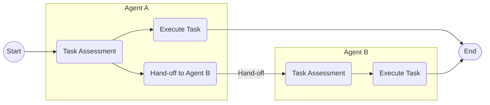
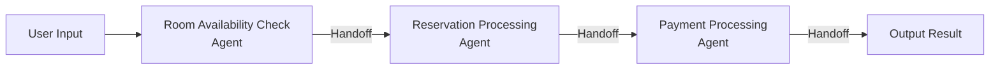

A little while ago, OpenAI made an interesting announcement regarding AI agents.

- [OpenAI News - New tools for building agents](https://openai.com/index/new-tools-for-building-agents/)

While the announcement of the Responses API and various built‐in tools also made headlines, the framework for building AI agents—the Agents SDK—was especially eye‐catching.

In this article, we will review an overview and usage instructions for the Agents SDK.

@[og](https://github.com/openai/openai-agents-python)

- [Documentation - OpenAI Agents SDK](https://openai.github.io/openai-agents-python/)

The Agents SDK is a Python-based open source software (OSS) developed based on Swarm, which OpenAI released last year. Swarm was primarily aimed at educational and experimental purposes, but the newly released Agents SDK has been greatly enhanced—not only supporting the Responses API but also enabling AI agents to be developed more easily and flexibly. In addition, features related to operations such as tracing and guardrails have been added, making it designed for production-level use.

:::info
We also published an article on this site last year introducing Swarm. Since it forms the basis of the Agents SDK mechanism, if you’re interested, please take a look.

- [Understanding the Mechanism of Agent Orchestration with OpenAI's Swarm](/en/blogs/2024/12/04/openai-swarm-multi-agent-intro/)
:::

## Setup

The Agents SDK is provided as a Python [package](https://pypi.org/project/openai-agents/). Install it using the method that suits your environment.

```shell
pip install openai-agents
```

In this article, we are using version 0.0.6, which is the latest version at the time.

## Creating an Agent

First, let’s review how to create a simple agent using the Agents SDK.

```python
from agents import Agent

agent = Agent(
    name='simple agent', # required
    instructions = 'Please return the entered text exactly as is', 
    model='gpt-4o-mini' # for now, if not specified, defaults to `gpt-4o`
)
```

The basic mechanism is almost the same as that of Swarm.

By creating an instance of the Agent class provided by the Agents SDK, you can build an agent. At this stage, you specify parameters such as the agent name (name) and the system/developer message (instructions).

There are many other parameters available, so please refer to the official reference for details.

- [OpenAI Agents SDK - API Reference - Agents](https://openai.github.io/openai-agents-python/ref/agent/)

Let’s run this agent right away.

```python
import asyncio
from agents import Runner

async def main():
    result = await Runner.run(agent, 'Good morning!!')
    print(result)

if __name__ == '__main__':
    asyncio.run(main())
```

Using the run method of the Runner class provided by the Agents SDK, you specify the initial agent to execute and the input text.

This run method executes the agent. The agent will repeatedly interact with the LLM and execute tools until a response is obtained, and if necessary, hand the task off to another agent (Handoff) (by default, it loops a maximum of 10 times). In this example, since no tool or Handoff is specified, the loop runs only once.

The execution result looks like this:

```
RunResult:
- Last agent: Agent(name="simple agent", ...)
- Final output (str):
    Good morning!! What plans do you have for today?
- 1 new item(s)
- 1 raw response(s)
- 0 input guardrail result(s)
- 0 output guardrail result(s)
(See `RunResult` for more details)
```

You can verify the last executed agent (Last agent) and the output result (Final output), among other details.

Note that although the run method is asynchronous, a synchronous version run_sync and a streaming-capable run_streamed are also available. For more details, please refer to the official reference.

- [OpenAI Agents SDK - API Reference - Runner](https://openai.github.io/openai-agents-python/ref/run/)

## Using Tools

The previous agent only chatted with the LLM and cannot be considered an agent that autonomously performs designated tasks. Here, we will use tools to refine its behavior and make it more agent-like.

### Built-in Tools

Let’s start by using the built-in tools. This time, the built-in tools released along with the Agents SDK are the following three:

- [OpenAI Doc - Built-in tools - Web Search](https://platform.openai.com/docs/guides/tools-web-search?api-mode=responses)
- [OpenAI Doc - Built-in tools - File Search](https://platform.openai.com/docs/guides/tools-file-search)
- [OpenAI Doc - Built-in tools - Computer Use](https://platform.openai.com/docs/guides/tools-computer-use)

Not long ago, I introduced the mechanism behind the File Search tool.

- [Using OpenAI's Official Vector Store / File Search Tool](/en/blogs/2025/03/19/openai-responses-api-filesearch/)

Taking advantage of that, let’s create an agent that uses the File Search tool.

```python
import asyncio
from agents import Agent, Runner, FileSearchTool
agent = Agent(
    name='file search agent',
    instructions = 'You are a tech blog administrator. Please use the file_search tool to search for blog files',
    model='gpt-4o-mini',
    tools=[FileSearchTool(
        # Vector Store object ID
        vector_store_ids=['vs_xxxxxxxxxxxxxxx'],
        max_num_results=3, # Maximum number of search results (optional)
        # Enable the following if you want to include detailed search results (score, text)
        # include_search_results=True
        # Specify metadata filtering if needed by writing it below
        # filters={...}
    )]
)

async def main():
    result = await Runner.run(
        agent,
        'Please briefly introduce the AI-related articles'
    )
    print(result)
    
if __name__ == '__main__':
    asyncio.run(main())
```

When using a tool, specify it using the tools parameter when creating the agent. Built-in tools are available as classes within the Agents SDK, so you simply need to provide an instance of the corresponding class. Here, we specify the Vector Store ID for the FileSearchTool class.

When executed, the result is as follows:

```
RunResult:
- Last agent: Agent(name="file search agent", ...)
- Final output (str):
    Here is a brief introduction to articles related to AI.
    
    1. **Online Search × AI: Overview and Basic Usage of Perplexity's New Sonar API**
       - **Date**: January 22, 2025
       - **Content**: An overview of Perplexity's newly introduced Sonar API. It provides a search function that leverages generative AI and LLMs, incorporating real-time information and citations into applications. It also introduces the new pricing structure and models.
    
    2. **New File Search (Vector Stores) Feature in OpenAI Responses API**
       - **Date**: March 19, 2025
       - **Content**: The File Search feature has been newly added to OpenAI's Responses API, with enhanced metadata filtering. This feature becomes a useful tool for developers of AI agents.
    
    3. **Overview of LLM's Long-term Memory Using LangMem**
       - **Date**: February 26, 2025
       - **Content**: The LangMem SDK developed by LangChain is introduced, describing how AI agents can retain user information and conversation history. This enables more human-like conversations.
    
    These articles provide insights into the latest AI technologies and the utilization of tools. If you're interested, please check them out for more details.
- 2 new item(s)
- 1 raw response(s)
- 0 input guardrail result(s)
- 0 output guardrail result(s)
```

You can see that articles stored in the Vector Store are being searched.

Other built-in tools are also readily available since each has a corresponding class provided by the Agents SDK.

### Custom Tools (Function calling)

Since built-in tools are hosted by OpenAI, control on the client side is limited to the range of parameters. Therefore, if you want to extend functionality more freely, you can define your own functions to be used by the agent as “custom tools (Function calling)”.

Next, let’s create a custom tool by way of an example function that fetches customer information.

```python
from dataclasses import dataclass, asdict
import json
from agents import Agent, RunContextWrapper, Runner, function_tool
import asyncio

@dataclass
class LoginUser:
    id: str

@dataclass
class Customer:
    id: str
    location: str
    name: str

@function_tool
def fetch_customer(ctx: RunContextWrapper[LoginUser], customer_id: str) -> str:
    """Fetch customer information.

    Args:
        customer_id (str): The ID of the customer to fetch.
    Returns:
        str: Customer information (JSON).
    """
    print(f'[audit]fetched by {ctx.context.id}')
    user = Customer(
        id=customer_id,
        location = '34th Floor, Shinjuku Mitsui Building, 2-1-1 Nishishinjuku, Shinjuku-ku, Tokyo',
        name = 'Mamezo Co., Ltd.'
    )
    return json.dumps(asdict(user), ensure_ascii=False)
```

This is a normal Python function, but by decorating it with @function_tool, the Agents SDK automatically generates a Function calling schema from the function signature and docstring. For this function, the following schema was generated.

```json
{
  "name": "fetch_customer",
  "parameters": {
    "properties": {
      "customer_id": {
        "description": "The ID of the customer to fetch.",
        "title": "Customer Id",
        "type": "string"
      }
    },
    "required": [
      "customer_id"
    ],
    "title": "fetch_customer_args",
    "type": "object",
    "additionalProperties": false
  },
  "strict": true,
  "type": "function",
  "description": "Fetch customer information."
}
```

The LLM uses this information to generate arguments and request the execution of the function.

In addition, the first argument of the function (ctx) can be used to access arbitrary context information. This context is shared throughout the entire agent workflow, and here it outputs the user ID who fetched the customer information as an audit log. The second and subsequent arguments correspond to the arguments generated by the LLM for Function calling. In addition to primitive types, argument types can also be TypedDicts or Pydantic models.

After that, as with built-in tools, you only need to add this function to the tools parameter when creating the agent.

```python
agent = Agent(
    name='customer agent',
    instructions = 'Please use the fetch_customer tool to obtain customer information',
    # add custom tool
    tools=[fetch_customer],
    model='gpt-4o-mini'
)
```

Finally, we execute this agent. This time, we pass the login user's information as the execution context.

```python
async def main():
    result = await Runner.run(
        agent,
        'Please provide the customer address.\nID: CUSTOMER_0001',
        # Execution context shared across the workflow
        context=LoginUser('MZ0001'))
    print(result)

if __name__ == '__main__':
    asyncio.run(main())
```

The execution result is as follows.

```
[audit]fetched by MZ0001
RunResult:
- Last agent: Agent(name="customer agent", ...)
- Final output (str):
    The customer's address is as follows:
    
    **Address**: 34th Floor, Shinjuku Mitsui Building, 2-1-1 Nishishinjuku, Shinjuku-ku, Tokyo
    **Company Name**: Mamezo Co., Ltd.
- 3 new item(s)
- 2 raw response(s)
- 0 input guardrail result(s)
- 0 output guardrail result(s)
(See `RunResult` for more details)
```

This shows that the custom tool using Function calling is executing correctly. Also, the login user's information (MZ0001) is successfully retrieved within the tool as part of the context (audit log).

:::info
In this case, we used the Python function as a tool as is, but using the FunctionTool class allows for finer control. For details, please refer to the official reference.

- [OpenAI Agents SDK - Docs - Custom function tools](https://openai.github.io/openai-agents-python/tools/#custom-function-tools)
- [OpenAI Agents SDK - API Reference - FunctionTool](https://openai.github.io/openai-agents-python/ref/tool/#agents.tool.FunctionTool)
:::

:::column:Agent as tools
We have omitted the details here, but another way to use tools is to use the agent itself as a tool.

- [OpenAI Agents SDK - Docs - Tools - Agents as tools](https://openai.github.io/openai-agents-python/tools/#agents-as-tools)

Instead of handing over workflow control to another agent (Handoff), this method involves having the agent execute tasks as a tool. It is well-suited for cases where a centralized agent oversees subordinate agents.
:::

## Checking Input and Output with Guardrails

The Agents SDK provides a mechanism called guardrails to check the input and output of an agent.

Here, we will apply guardrails using an agent that devises travel plans as an example. First, we created a travel plan devising agent as follows:

```python
import asyncio
from pydantic import BaseModel
from agents import Agent, Runner

class TripPlan(BaseModel):
    """Output schema for the agent"""
    departure_location: str
    destination: str
    days: int
    schedule: str
    budget: int

agent = Agent(
    name='trip planner',
    instructions = 'Please propose a travel plan in Japanese based on the specified departure location, destination, and duration',
    output_type=TripPlan,
)

async def main():
    result = await Runner.run(agent, 'Departure: Tokyo\nDestination: Okinawa\nDays: 3')
    # Cast the final output to the output schema using final_output_as
    print(result.final_output_as(TripPlan).model_dump_json(indent=2))

if __name__ == '__main__':
    asyncio.run(main())
```

In this agent, the output schema is specified with output_type.

When executed, you get the following result:

```
{
  "departure_location": "Tokyo",
  "destination": "Okinawa",
  "days": 3,
  "schedule": "\n\nDay 1:\n- Departure: From Haneda Airport to Naha Airport in Okinawa in the morning\n- Lunch: Enjoy Agute pork at a local restaurant near the airport\n- Sightseeing in Naha: Stroll around Shuri Castle and Kokusai Street\n- Dinner: Enjoy Okinawan cuisine at an izakaya around Kokusai Street\n- Hotel check-in: In Naha\n\nDay 2:\n- Breakfast: At the hotel\n- Churaumi Aquarium: View Okinawa’s marine life\n- Lunch: Have a meal at a restaurant near the aquarium\n- Tour of Kouri Island: Visit Kouri Ohashi Bridge and Tinu Beach (Heart Rock)\n- Dinner: Savor local seafood dishes\n- Hotel: In Nago\n\nDay 3:\n- Breakfast: At the hotel\n- Shuri Castle: Sightsee again (if desired)\n- Lunch: Light meal near the airport\n- Return: From Naha Airport to Haneda Airport",
  "budget": 80000
}
```

Next, we add an input guardrail to check that the input to the agent includes the number of days.

```python
from agents import Agent, RunContextWrapper, input_guardrail, GuardrailFunctionOutput

@input_guardrail
def validate_trip_input(context: RunContextWrapper[None], agent: Agent, user_input: str):
    '''Input guardrail'''
    days_match = re.search(r'Days[:：]\s*(\d+)', user_input)

    if not days_match:
        return GuardrailFunctionOutput(
            tripwire_triggered=True,
            output_info='Please specify the number of days correctly! (e.g., Days:3)'
        )
    return GuardrailFunctionOutput(
        tripwire_triggered=False,
        output_info='OK'
    )


agent = Agent(
    name='trip planner',
    instructions='Please propose a travel plan in Japanese based on the specified departure location, destination, and number of days',
    output_type=TripPlan,
    # Specify input guardrail
    input_guardrails=[validate_trip_input]
)
```

The input guardrail is a Python function decorated with @input_guardrail.

The guardrail function takes the execution context (context), the target agent (agent), and the user's input (user_input) as arguments, and returns a [GuardrailFunctionOutput](https://openai.github.io/openai-agents-python/ref/guardrail/#agents.guardrail.GuardrailFunctionOutput) object. At this point, if tripwire_triggered is set to True, the Agents SDK will raise an error within the workflow.

Subsequently, specify this function in the input_guardrails parameter when creating the agent.

This time, we execute it as shown below to intentionally trigger an error from the guardrail.

```python
from agents import InputGuardrailTripwireTriggered, Runner

async def main():
    try:
        result = await Runner.run(agent, 'Departure: Tokyo\nDestination: Okinawa')
        print(result.final_output_as(TripPlan).model_dump_json(indent=2))
    except InputGuardrailTripwireTriggered as e:
        # Input guardrail violation
        print(e.guardrail_result.output)
```

Intentionally, the number of days is omitted from the input to violate the guardrail. If the input guardrail is violated, an [InputGuardrailTripwireTriggered](https://openai.github.io/openai-agents-python/ref/exceptions/#agents.exceptions.InputGuardrailTripwireTriggered) exception will be raised.

The execution here will result in the following (formatted for readability):

```
GuardrailFunctionOutput(
  output_info='Please make sure to specify the number of days! (e.g., days:3)',
  tripwire_triggered=True
)
```

This shows that the input guardrail mechanism is functioning.

For output guardrails, the basic procedure is the same. Here, we set it up so that if the devised travel plan's budget exceeds 200000, it will trigger an error.

```python
from agents import Agent, InputGuardrailTripwireTriggered, OutputGuardrailTripwireTriggered, RunContextWrapper, Runner, input_guardrail, output_guardrail, GuardrailFunctionOutput

# Omitted parts (output schema, input guardrail)

@output_guardrail
def validate_trip_output(context: RunContextWrapper[None], agent: Agent, agent_output: TripPlan):
    '''Output guardrail'''
    if agent_output.budget > 200000:
        return GuardrailFunctionOutput(
            tripwire_triggered=True,
            output_info=f'Budget exceeded! Please propose a more affordable plan! Budget: {agent_output.budget}'
        )
    return GuardrailFunctionOutput(
        tripwire_triggered=False,
        output_info='OK'
    )


agent = Agent(
    name='trip planner',
    instructions='Please propose a travel plan in Japanese based on the specified departure location, destination, and number of days',
    output_type=TripPlan,
    # Specify input and output guardrails
    input_guardrails=[validate_trip_input],
    output_guardrails=[validate_trip_output]
)

async def main():
    try:
        # Specify so as to trigger an output guardrail violation (budget over)
        result = await Runner.run(agent, 'Departure: Tokyo\nDestination: New York\nDays: 14')
        print(result.final_output_as(TripPlan).model_dump_json(indent=2))
    except InputGuardrailTripwireTriggered as e:
        # Input guardrail violation
        print(e.guardrail_result.output)
    except OutputGuardrailTripwireTriggered as e:
        # Output guardrail violation
        print(e.guardrail_result.output)

if __name__ == '__main__':
    asyncio.run(main())
```

In the case of output guardrails, you prepare a function decorated with @output_guardrail. Other than that, it is almost the same as the input guardrail, but since it checks the output value, it takes the target agent’s output instead of the user’s input as an argument. Then, simply specify the function in the target agent’s output_guardrails and you’re done.

The error raised when an output guardrail is violated is [OutputGuardrailTripwireTriggered](https://openai.github.io/openai-agents-python/ref/exceptions/#agents.exceptions.OutputGuardrailTripwireTriggered). Here, in addition to the input, we catch and output this error as well.

The execution here will result in the following (formatted for readability):

```
GuardrailFunctionOutput(
  output_info='Budget is over! Please provide a more affordable plan! Budget:300000',
  tripwire_triggered=True
)
```

This confirms that the output guardrail check is functioning correctly.

Note that in workflows spanning multiple agents, not every agent’s guardrail is executed. The input guardrail is applied only to the first agent, and the output guardrail is applied only to the last agent.

## Multi-Agent Configuration Using Handoff

Here, we will review the multi-agent mechanism of the Agents SDK using Handoff.

- [OpenAI Agents SDK - Docs - Handoffs](https://openai.github.io/openai-agents-python/handoffs/)

Handoff is based on the same concept as Swarm, which is the original inspiration for the Agents SDK. Below is a restatement of the Handoff concept from the [Swarm introduction article](/en/blogs/2024/12/04/openai-swarm-multi-agent-intro/#handoff).



In this way, if an agent determines that another agent is better suited to perform a task, it hands off the task to that agent (Handoff). By chaining these Handoffs, a scalable multi-agent workflow can be constructed.

Here, as an example, we will write a workflow for hotel booking using Handoff.



### Defining the Execution Context

First, define the customer information required for hotel booking as the execution context. This context can be referenced in all agents’ instructions or custom tools, and it will not be lost even when handoffs occur between agents.

```python
from pydantic import BaseModel

class Customer(BaseModel):
    '''Virtual customer information (execution context)'''
    id: str
    name: str
```

### Implementation of Each Agent

Below are the agents that make up the hotel booking workflow. Each agent has tools (Function calling) corresponding to the task it handles, and will hand off to the next agent as required.

#### 1. Payment Processing Agent

In the agent that performs payment processing, the make_payment function is defined as a custom tool, and it completes the payment using the customer information from the execution context. Additionally, the payment_instructions function is used to dynamically generate the instructions.

```python
from agents import Agent, RunContextWrapper, Runner, function_tool
from agents.extensions.handoff_prompt import prompt_with_handoff_instructions

@function_tool
def make_payment(ctx: RunContextWrapper[Customer], payment_info: str) -> str:
    print('[Payment Processing agent]: make_payment')
    return json.dumps({
        'payment': 'ok',
        'details': payment_info,
        'name': ctx.context.name
    })

def payment_instructions(ctx: RunContextWrapper[Customer], agent: Agent) -> str:
    return prompt_with_handoff_instructions((
        'Complete the payment based on the reservation details.\n'
        'After completion, output the reservation and payment details for guiding the customer.\n'
        'For safety, please mask the card number.\n'
        f'Customer ID/Name: {ctx.context.id} / {ctx.context.name}'
    ))

payment_agent = Agent(
    name='Payment Processing',
    # Dynamically generate instructions using the execution context (a function can also be specified)
    instructions=payment_instructions,
    tools=[make_payment]
)
```

#### 2. Booking Processing Agent

The booking processing agent executes the hotel booking using the make_booking function as a tool. This agent specifies payment_agent in the handoffs parameter to hand off to the Payment Processing agent.

```python
@function_tool
def make_booking(ctx: RunContextWrapper[Customer], booking_info: str) -> str:
    print('[Booking Processing agent]: make_booking')
    return json.dumps({
        'booking': 'ok',
        'hotel': booking_info,
        'customer_id': ctx.context.id
    })

booking_agent = Agent(
    name='Booking Processing',
    instructions = prompt_with_handoff_instructions(
        'Please make a hotel reservation using the provided user information.'
    ),
    tools=[make_booking],
    # Hand off to the Payment Processing agent
    handoffs=[payment_agent]
)
```

#### 3. Availability Check Agent

The availability check agent checks the hotel’s vacancy status using the check_availability function. This agent specifies booking_agent in the handoffs parameter to hand off to the Booking Processing agent.

```python
@function_tool
def check_availability(ctx: RunContextWrapper[Customer], user_input: str) -> str:
    print('[Availability Check agent]: check_availability')
    return json.dumps({
        'availability': 'ok',
        'details': user_input
    })

availability_agent = Agent(
    name='Availability Check',
    instructions = prompt_with_handoff_instructions(
        'Please check the hotel room availability based on the user request.'
    ),
    tools=[check_availability],
    # Hand off to the Booking Processing agent
    handoffs=[booking_agent]
)
```

### Mechanism and Key Points of Handoffs

By specifying the handoffs parameter when creating each agent, the agents that can be handed off to are designated. With this specification, the Agents SDK automatically generates custom tools (Function calling) for handoff based on the agent information. For example, as a handoff to the Booking Processing agent, a tool like the following is added.

```json
  {
    "name": "transfer_to_booking_processing_agent",
    "parameters": {
      "additionalProperties": false,
      "type": "object",
      "properties": {},
      "required": []
    },
    "strict": true,
    "type": "function",
    "description": "Handoff to the Booking Processing agent to handle the request. "
  }
```

With this, the LLM determines whether a handoff is required for the task, and if so, it will request the execution of this tool to delegate the workflow to the target agent.

Also, in each agent’s instructions, the [prompt_with_handoff_instructions](https://openai.github.io/openai-agents-python/ref/extensions/handoff_prompt/#agents.extensions.handoff_prompt.prompt_with_handoff_instructions) function is used to automatically insert recommended prompts that facilitate proper handling of handoffs.

Note that here we directly specify the agent in the handoffs parameter, but by using the handoffs function provided by the Agents SDK, it is possible to configure more detailed settings such as tool names, descriptions, event hooks for when a handoff occurs, filtering of input history, input schema definitions, and more. For details, please refer to the official documentation and API reference below.

- [OpenAI Agents SDK - Doc - Handoffs - Customizing handoffs via the handoff() function](https://openai.github.io/openai-agents-python/handoffs/#customizing-handoffs-via-the-handoff-function)
- [OpenAI Agents SDK - API Reference - Handoffs](https://openai.github.io/openai-agents-python/ref/handoffs/#agents.handoffs.handoff)

### Executing the Workflow

Finally, we execute the hotel booking workflow using the above set of agents. When executing, you provide the user input and the execution context (customer information).

```python
async def main():
    user_input = (
        'I want to book a hotel in Tokyo on 2025-06-01.\n'
        'I need a single room, non-smoking please.\n'
        'Please process the payment as follows:\n'
        'Card number: 4500-0000-0000-0000\n'
        'Expiration (MM-YY): 07-28\n'
        'Security code: 123'
    )
    result = await Runner.run(
        availability_agent,
        user_input,
        context=Customer(id='MZ0001', name='豆蔵太郎') # Execution context (customer information)
    )
    print(result)

if __name__ == '__main__':
    asyncio.run(main())
```

An example of the execution result is as follows.

```
[Availability Check agent]: check_availability
[Booking Processing agent]: make_booking
[Payment Processing agent]: make_payment
RunResult:
- Last agent: Agent(name="Payment", ...)
- Final output (str):
    The booking and payment have been completed.
    
    ### Booking Information
    - Date: June 1, 2025
    - Location: Tokyo
    - Room Type: Single (Non-smoking)
    
    ### Payment Information
    - Customer Name: Mamezou Tarō
    - Card Number: 4500-****-****-****
    - Expiry Date: 07-28
    
    Please let us know if you have any other questions.
- 11 new item(s)
- 4 raw response(s)
- 0 input guardrail result(s)
- 0 output guardrail result(s)
(See `RunResult` for more details)
```

:::column:Multi-agent patterns
Multi-agent patterns are not limited to Handoff as introduced here. There are methods to coordinate agents based on code, as well as methods using the previously mentioned “Agent as Tools.”

For details, please refer to the following documentation and sample code from the GitHub repository.

- [OpenAI Agents SDK - Doc - Orchestrating multiple agents](https://openai.github.io/openai-agents-python/multi_agent/)
- [GitHub openai/openai-agents-python - Common agentic patterns](https://github.com/openai/openai-agents-python/tree/main/examples/agent_patterns)
:::

## Tracing

It is easy to imagine that debugging workflows using multiple agents becomes more challenging as the system grows in size. Especially when Handoff is used—since the LLM makes the decision regarding task handoffs—there are many cases where it becomes difficult to accurately predict what will happen. To address this, the Agents SDK comes with a tracing feature that is enabled by default[^1].

[^1]: To disable it, specify [tracing_disabled](https://openai.github.io/openai-agents-python/ref/run/#agents.run.RunConfig.tracing_disabled) or set the environment variable (OPENAI_AGENTS_DISABLE_TRACING).

By default, the tracing feature of OpenAI’s dashboard is available. For example, in the previous multi-agent example using Handoff, you can observe tracing details as shown below.


This dashboard displays detailed trace information, including requests and responses of the LLM and tool calls, as well as agent handoffs through Handoff. It is a great advantage that such information is automatically captured without any additional configuration.

It is also possible to explicitly obtain tracing information. Below is an example where multiple executions in the workflow are aggregated into a single trace record.

```python
from agents import trace, Runner

async def main():
    customers = [
        Customer(id='CUSTOMER_0001', name='Toro Mamezou'),
        Customer(id='CUSTOMER_0002', name='Hanako Mamezou')
    ]
    with trace('Mamezou Reservation Workflow'):  # Tracing scope
        results = []
        for customer in customers:
            user_input = (
                'I want to book a hotel in Tokyo on 2025-06-01.\n'
                'I need a single room, non-smoking please.\n'
                'Please process the payment as follows:\n'
                'Card number: 4500-0000-0000-0000\n'
                'Expiration (MM-YY): 07-28\n'
                'Security code: 123'
            )

            result = await Runner.run(
                availability_agent,
                user_input,
                context=customer
            )
            results.append((customer, result))
```

The trace function, when used with a with statement, automatically records the processing within that block as tracing information. When executed, multiple agent workflows are aggregated into a single trace record, which is displayed on the dashboard as follows.


:::info
In addition to tracing information, it is also possible to custom obtain internal segments (spans) using the API that begins with `span_`. For details, please refer to the API documentation.

- [OpenAI Agents SDK - API Reference - Creating traces/spans](https://openai.github.io/openai-agents-python/ref/tracing/create)
:::

The tracing functionality of the Agents SDK can also be integrated with platforms provided by third parties other than OpenAI. Looking at the official documentation below, you can see that support for the Agents SDK has already progressed on many providers.

- [OpenAI Agents SDK - Doc - Tracing - External tracing processors list](https://openai.github.io/openai-agents-python/tracing/#external-tracing-processors-list)

## Conclusion

In this article, we took a brief look at and tested out the functionalities of the Agents SDK. As a result, it has been confirmed that building an AI agent system can be achieved very simply and quickly. Additionally, features like tracing, debugging, and lifecycle hooks are well-developed, making it easy to envision actual operational scenarios.

Furthermore, even as this article was being written, an audio-enabled release was made, so the potential for future expansion is very promising. Going forward, I plan to further master the mechanisms of agent orchestration while experimenting with various patterns.
