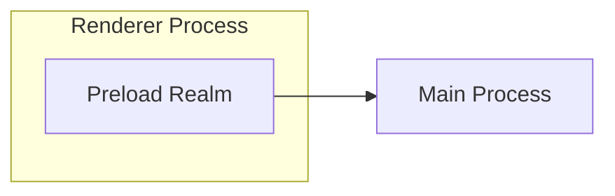
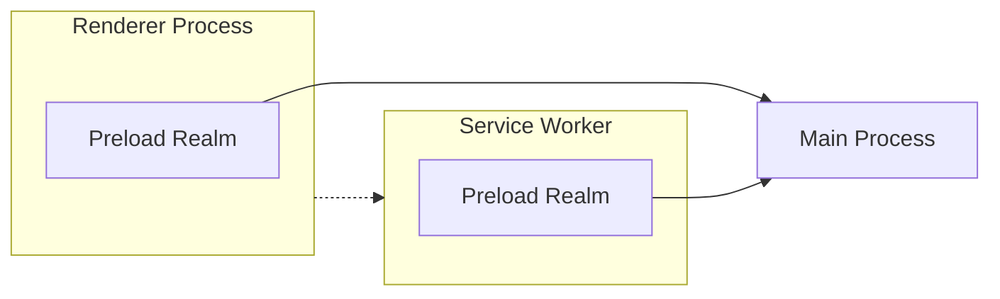
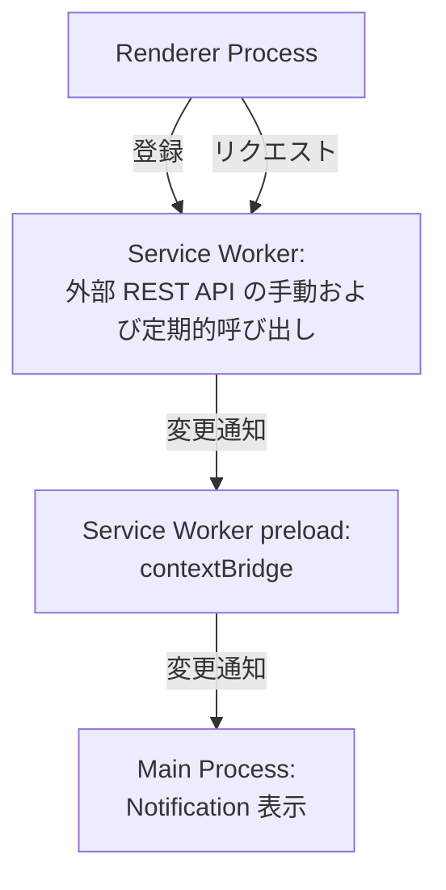

## Introduction
Earlier this month, Electron 35.0.0 was released.

- [Electron 35.0.0 | Electron](https://www.electronjs.org/blog/electron-35-0)

This release adds the ability to attach Preload Scripts to a Service Worker. Just as the Preload script in the Renderer process has traditionally served as a bridge between the web page and the Main process (Node.js), the Preload script in the Service Worker provides a bridging function between the Service Worker and the Main process.

:::info
In Manifest V3 extensions for Chrome (supported in Chrome 88 and later), code that could potentially degrade the performance of Chrome extensions is executed in a Service Worker rather than on the main thread, thereby encouraging the migration to Manifest V3.

[Manifest V3 に移行する  |  Chrome Extensions  |  Chrome for Developers](https://developer.chrome.com/docs/extensions/develop/migrate?hl=ja)

The addition of Service Worker Preload Scripts appears to be aimed at making it easier to support Chrome extensions that have migrated to Manifest V3 in Electron apps.
:::

## Significance of Service Worker Preload Scripts
Being able to attach Preload Scripts to a Service Worker is likely a significant benefit for developers who write extensions that run in both Chrome and Electron apps. Moreover, I felt that it has the potential to transform Electron’s programming paradigm.

Traditionally, Preload Scripts provide a bridge to the Renderer process that runs the web page, enabling communication with the Main process operating in a Node.js environment.


With the support of Service Worker Preload Scripts, it becomes possible to implement communication with the Main process in the Service Worker in the same way as in the Renderer process.



By introducing Service Workers, it becomes possible to divide the increasingly bloated responsibilities of the Main process or offload heavy processing— which might interfere with UI operations— to the Service Worker.

:::info
The 35.0.0 release notes mention that IPC communication between Service Workers and between Preload Scripts is now possible. This opens up the possibility of architectures akin to microservices, where different Service Workers are set up for specific purposes and collaborate with one another.

> Furthermore, IPC is now available between Service Workers and their attached preload scripts via the ServiceWorkerMain.ipc class.

The RFC for the Service Worker Preload Realm is available below. It explains the motivation behind the introduction and how application code might be written using the proposed API.

@[og](https://github.com/electron/rfcs/blob/main/text/0008-preload-realm.md)
:::

:::info
For more on Electron’s programming model, please also refer to the following articles.

@[og](/blogs/2022/02/14/history-of-electron-quick-start/)

@[og](/blogs/2024/08/28/electron-webcontentsview-app-structure/)
:::

## Hello World with Service Worker Preload Scripts

In this example, the goal was to build a message pipeline as follows[^1]:
- Register the Service Worker from the Renderer process when the Electron app starts
- Implement a call from the Renderer process to the Service Worker
- In the Service Worker, call an external REST API and retain the results
  - The REST API is invoked by two triggers: when a message is received and periodically
  - If the REST API results differ from the previous result, a change notification is sent to the Main process via the contextBridge in the Preload
- In the Main process, upon receiving the change notification, a desktop Notification is displayed

[^1]: This scenario envisions offloading the polling process for external services—which was traditionally executed in the Renderer or Main process—to the Service Worker.



The project structure is as follows:

```shell
.
├── index.html
├── main.mjs              # Main プロセス
├── package.json
├── preload-sw.js         # Service Worker preload スクリプト
├── preload.js            # Renderer preload スクリプト
├── renderer.js           # Renderer プロセス
└── service-worker.js     # Service Worker
```

:::alert
The API used in the sample code presented in the Service Worker Preload Scripts RFC is from the proposal and differs from what has been implemented in v35.0.0. Currently, with almost no official documentation or samples available, I had to inspect the API using VS Code’s JSDoc tooltips while building the project. Therefore, please note that the code snippets in this article might not accurately reflect the proper usage of the API.
:::

The complete source code created for this example is available in the following repository.

[electron-study/serviceworker-notification-example at master · kondoumh/electron-study](https://github.com/kondoumh/electron-study/tree/master/serviceworker-notification-example)

### Registering the Service Worker (Renderer Process)
In the Renderer process, the Service Worker is registered at startup.

```javascript:renderer.js
onload = () => {
  navigator.serviceWorker.register('service-worker.js')
    .then(() => console.log('Service Worker registered'))
    .catch((err) => console.error('Service Worker registration failed:', err));
}
```

### Registering the Service Worker Preload Script (Main Process)
We register the Preload Script using the Session class's registerPreloadScript method. In version 35.0.0, the `type` field now accepts `service-worker`, so that should be specified.

```javascript
app.whenReady().then( async () => {
  session.defaultSession.registerPreloadScript({
    type: 'service-worker',
    id: 'worker-preload',
    filePath: path.join(__dirname, 'preload-sw.js'),
  });
  // Create window, etc.
}
```

### Defining the API in the Service Worker Preload
Just like with the traditional Renderer process Preload script, we implement the communication API to the Main process using contextBridge and ipcRenderer. In this example, an API is implemented and exposed in the Service Worker that sends text information to the Main process under the identifier `NOTIFY_TEXT`.

```javascript:preload-sw.js
const { contextBridge, ipcRenderer } = require('electron');

if (process.type == 'service-worker') {
  exposeApi();
}

function exposeApi() {
  const api = {
    notify: (text) => {
      ipcRenderer.invoke("NOTIFY_TEXT", text);
    },
  };

  contextBridge.exposeInMainWorld("myElectronApi", api);
}
```

### Implementation of the Service Worker
The Service Worker calls an external REST API and sends the result using the myElectronApi defined in the Preload. This process is executed every 10 seconds[^2].

[^2]: Although using setInterval in a Service Worker can often lead to issues, this is a simplified implementation for demonstration purposes.

```javascript:service-worker.js
let lastStatus = null;

function checkStatus() {
  fetch('https://jsonplaceholder.typicode.com/todos/1') // Fake API for testing
    .then(res => res.json())
    .then(data => {
      if (data && data.title !== lastStatus) {
        lastStatus = data.title;
        myElectronApi.notify(data.title);
      }
    })
    .catch(err => console.error('[Service Worker] API error:', err));
}

checkStatus();
setInterval(checkStatus, 10000); // Check every 10 seconds
```

### Handling Service Worker IPC in the Main Process
Unlike IPC requests from the Renderer process, IPC requests from the Service Worker cannot be handled using ipcMain. Instead, they must be processed using the handle method of the ipc property of the ServiceWorker class (IpcMainServiceWorker class). The handling is implemented using the session object's API within the same app.whenReady() context where the Service Worker Preload Scripts were registered.

```javascript
app.whenReady().then( async () => {
  // ...
  session.defaultSession.serviceWorkers.on("running-status-changed", details => {
    if (details.runningStatus === "running") {
      const sw = session.defaultSession.serviceWorkers.getWorkerFromVersionID(details.versionId);
      if (!sw) return;
      sw.ipc.handle("NOTIFY_TEXT", (event, text) => {
        // Show a notification
        const notification = {
          title: 'Service Worker Notification',
          body: text,
        };
        new Notification(notification).show();
      });
    }
  }

  // Window creation process
}
```

Upon receiving the Service Worker lifecycle event `running-status-changed`, the runningStatus of the Service Worker is evaluated. If it is `running`, the ServiceWorker instance is retrieved using the getWorkerFromVersionID method, and the event is handled using ipc.handle. Here, the Notification API is used to display a desktop notification with the text sent via the IPC request.

:::info
Console output from console.log in the Service Worker can be captured on the Main process side by handling the `console-message` event. This is useful for debugging communication with the Service Worker.

```javascript
  session.defaultSession.serviceWorkers.on(
    "console-message",
    (event, messageDetails) => {
      // Listen for console messages from the service worker
      console.log('Service Worker: %d console message: %s', messageDetails.versionId, messageDetails.message);
    }
  )
```
:::

### Invoking the Service Worker from the Renderer Process
So far, we have achieved communication from the Service Worker to the Main process, but we haven’t yet implemented invoking the Service Worker from the UI (Renderer process).

We add a button in the UI to invoke the Service Worker.

```html:index.html
<!DOCTYPE html>
<html>
  <head>
    <meta charset="UTF-8">
    <meta http-equiv="Content-Security-Policy" content="default-src 'self'; script-src 'self'; style-src 'self' 'unsafe-inline'">
    <title>Hello World!</title>
  </head>
  <body>
    <!-- Add a button -->
    <p>
      <button id="service-worker">Call Service Worker</button>
    </p>
    <script src="./renderer.js"></script>
  </body>
</html>
```

By using the standard Web API ServiceWorkerContainer, the Renderer process can send messages to the Service Worker. An EventListener is added to the button to implement the Service Worker call.

```javascript:renderer.js
document.querySelector("#service-worker").addEventListener("click", () => {
  navigator.serviceWorker.getRegistration().then((registration) => {
    if (registration) {
      registration.active.postMessage("Hello from the renderer process!");
    } else {
      console.error("No active service worker found.");
    }
  });
});
```
Finally, in the Service Worker, a listener is registered and using the myElectronApi defined in the Preload, the process of sending a message to the Main process is added.

```javascript:service-worker.js
// Omitted

globalThis.addEventListener('message', (event) => {
  myElectronApi.notify(event.data);
});
```

### Execution Demonstration
I ran the application we built—with DevTools visible—to see it in action.


Both the periodic events and the button-click events triggered notifications, and a desktop Notification was displayed.


:::info
On macOS, to enable desktop notifications during Electron app development, you need to enable notifications for Electron in the System Preferences.


:::

## Conclusion
In conclusion, I explored the Service Worker Preload Scripts introduced in Electron 35.0.0. I look forward to further official information, and if I discover any valuable use cases, I plan to write another article.

