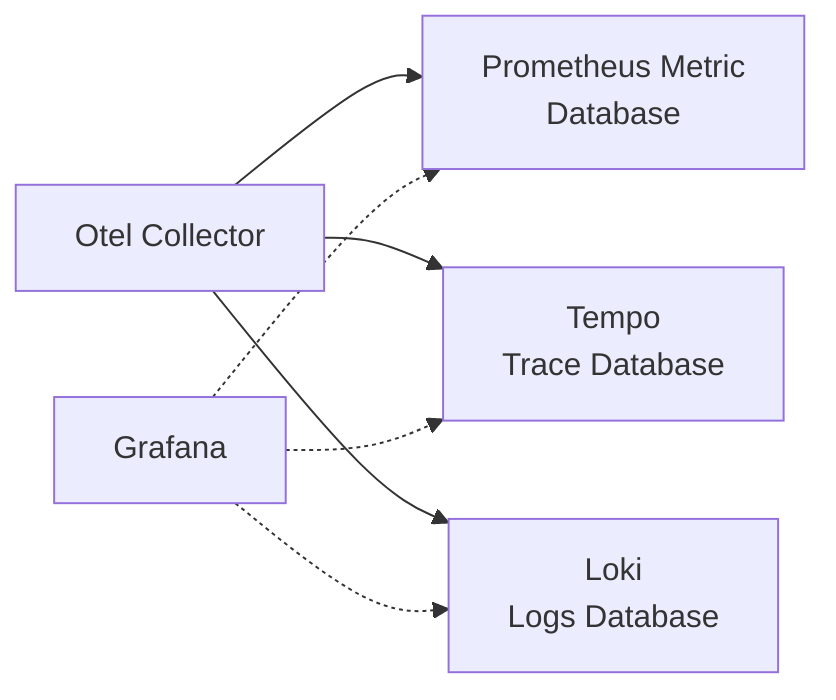
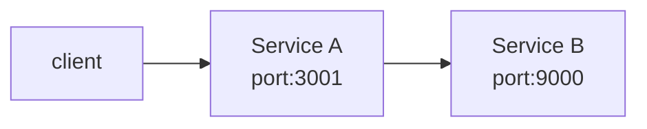

## Introduction
It has been almost two months since the release of Deno 2.2, when the integration of OpenTelemetry was announced as one of its highlights.

[Deno 2.2: OpenTelemetry, Lint Plugins, node:sqlite](https://deno.com/blog/v2.2)

Collecting telemetry data—such as metrics, traces, and logs—is indispensable for achieving application observability. With telemetry data exchange being standardized by the OpenTelemetry specification, support in various languages and runtimes has been advancing, and Deno has also incorporated it as a runtime feature.

The documentation for Deno’s OpenTelemetry can be found here.

@[og](https://docs.deno.com/runtime/fundamentals/open_telemetry/)

:::info
There are several detailed articles on metrics collection and distributed tracing with OpenTelemetry on this website, so please refer to them.

@[og](/containers/k8s/tutorial/ops/opentelemetry/)
@[og](/containers/k8s/tutorial/ops/jaeger/)
@[og](/containers/k8s/tutorial/ops/awsxray/)
@[og](/msa/mp/cntrn16-mp-tracing/)
:::

## Launching the OTLP Endpoint / Grafana
When testing locally, as mentioned in the official blog, you can use Grafana Labs’ docker-otel-lgtm to launch the OpenTelemetry (hereafter Otel) Collector endpoint and Grafana, making them observable on the dashboard.

@[og](https://github.com/grafana/docker-otel-lgtm)

The data collected by the Otel Collector is accumulated in the Prometheus Metric, Tempo Trace, and Loki Logs databases, making it possible to monitor via the Grafana dashboard.



It can be easily launched with docker run.

```shell
docker run --name lgtm -p 3000:3000 -p 4317:4317 -p 4318:4318 --rm -ti \
    -v "$PWD"/lgtm/grafana:/data/grafana \
    -v "$PWD"/lgtm/prometheus:/data/prometheus \
    -v "$PWD"/lgtm/loki:/data/loki \
    -e GF_PATHS_DATA=/data/grafana \
    docker.io/grafana/otel-lgtm:0.8.1
```

The following output shows that the gRPC and HTTP endpoints, as well as Grafana, have been launched.

```
The OpenTelemetry collector and the Grafana LGTM stack are up and running. (created /tmp/ready)
Open ports:
 - 4317: OpenTelemetry GRPC endpoint
 - 4318: OpenTelemetry HTTP endpoint
 - 3000: Grafana. User: admin, password: admin
```

## Testing Traces with Multiple Service Integration: Service Implementation
As shown below, we'll test tracing in a setup where a REST API service (A) calls another REST API service (B).



Service A code. It starts on port 3001 and returns the result of calling Service B to the client.

```typescript:service_a.ts
Deno.serve({ port: 3001 }, async (req) => {
  console.log("Service A Received request for", req.url);
  const res = await fetch("http://localhost:9000");
  const text = await res.text();
  console.log("Service A Received response from Service B", text);
  return new Response(`Service A got: ${text}`);
});
```

Service B code. It starts on port 9000 and returns a simple message to the client (in this case, Service A).

```typescript:service_b.ts
Deno.serve({ port: 9000 }, (req) => {
  console.log("Service B Received request for", req.url);
  return new Response("Hello world");
});
```

Starting Service A. By setting the environment variable `OTEL_DENO` to true, Otel is enabled. Assigning a service name using `OTEL_SERVICE_NAME` makes the trace results easier to view. Here, we set the service name as `svc-a`.

```shell
OTEL_DENO=true OTEL_SERVICE_NAME=svc-a deno run --unstable-otel --allow-net service_a.ts
```

:::info
Deno's OpenTelemetry integration API is still unstable and may change in the future, so it is necessary to specify the `--unstable-otel` flag.
:::

Similarly, start Service B, setting the service name as `svc-b`.

```shell
OTEL_DENO=true OTEL_SERVICE_NAME=svc-b deno run --unstable-otel --allow-net service_b.ts
```

## Testing Traces with Multiple Service Integration: Visualizing in Grafana
Now that the services have been connected, let's invoke Service A and observe the tracing in Grafana.

Accessing `localhost:3000` displays the Grafana interface.


Select `Explore` from the menu. Since the default data source is Prometheus, choose Tempo.


The Tempo query panel is displayed.


Invoke Service A using curl.

```shell
curl - http://localhost:3001
```

Clicking the refresh button displays the Trace ID, timestamp, service name, HTTP method, and response time of the call in the Tempo query panel.


It appears that the Trace ID is assigned by Deno's Otel Exporter. Clicking this Trace ID shows detailed trace information, displaying in the order of svc-a → svc-b.


Expanding the Node graph makes the call relationships visible.


The Service Graph in the query panel also visualizes the relationships between services.


It appears that the Trace ID is embedded in the request headers. Code to display the headers has been added in Service B.

```typescript:service_b.ts
Deno.serve({ port: 9000}, (req) => {
  // Display headers
  for (const [key, value] of req.headers.entries()) {
    console.log(key, value);
  }
  console.log("Service B Received request for", req.url);
  return new Response("Hello world");
});
```

The Trace ID is set under the key `traceparent`.

```
accept */*
accept-encoding gzip,br
accept-language *
host localhost:9000
traceparent 00-34ea2fccfa0ce81bc8855043682b2810-895a8a6b4e02df52-01
user-agent Deno/2.2.8
```

It seems that simply enabling Otel, without any modifications to the application code, is sufficient to enable distributed tracing.

## Displaying Metrics
Metrics can be viewed from the Metrics dashboard, with Prometheus as the data source.


When filtered by the otel_ prefix, it appears to reflect the status of resources used by Otel.


When filtering by the v8js_ prefix, the metrics of the V8 JavaScript engine powering the Deno runtime are displayed.


:::info:Additional Otel Features
Additional Otel-related features have been continuously added since version 2.2.0.

In v2.2.4, support for Context propagation was added.

@[og](https://github.com/denoland/deno/pull/28460)

In v2.2.5, support for Span Events was added.

@[og](https://github.com/denoland/deno/pull/28552)

In v2.2.7, support for V8 JS Engine Runtime metrics was added. This appears to enable the collection of metrics with the v8js_ prefix in Grafana.

@[og](https://github.com/denoland/deno/pull/28592)

The specification for V8 JS engine runtime metrics can be found below.

@[og](https://opentelemetry.io/docs/specs/semconv/runtime/v8js-metrics/)
:::

## Viewing Logs
Logs can be viewed from the Logs dashboard. Logs for each service are displayed in chronological order.


## Conclusion
That concludes our brief exploration of the OpenTelemetry integration implemented in Deno 2.2 using simple code. Even in Kubernetes environments, it is convenient as there is no need to launch sidecar containers—just specify the environment variables. This will likely enable distributed tracing in environments with a mix of languages and runtimes beyond Deno.

Although the focus ended up being mostly an overview of the Grafana interface, there appears to be demand for creating dashboards that leverage alerts and queries for practical operations.

:::info:2025.04.10 Update
An official Otel blog post has also been released.

[Zero-config Debugging with Deno and OpenTelemetry](https://deno.com/blog/zero-config-debugging-deno-opentelemetry)
:::
