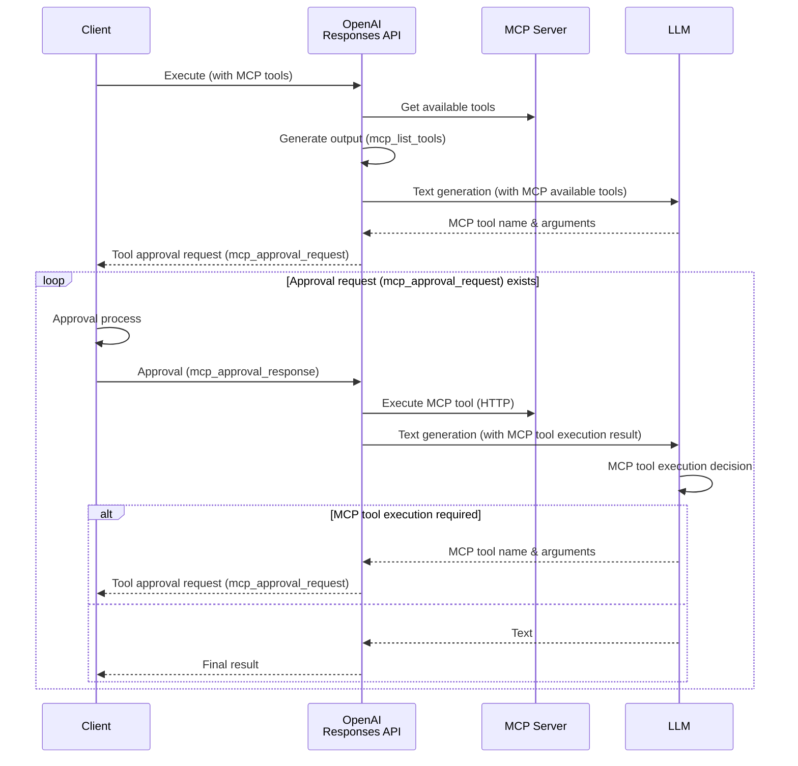

Just last month, OpenAI announced the addition of new built-in tools to the API.

<blockquote class="twitter-tweet"><p lang="en" dir="ltr">Introducing support for remote MCP servers, image generation, Code Interpreter, and more in the Responses API. <a href="https://t.co/EMZOutvV2a">pic.twitter.com/EMZOutvV2a</a></p>&mdash; OpenAI Developers (@OpenAIDevs) <a href="https://twitter.com/OpenAIDevs/status/1925214114445771050?ref_src=twsrc%5Etfw">May 21, 2025</a></blockquote> <script async src="https://platform.twitter.com/widgets.js" charset="utf-8"></script>

In this announcement, the addition of the remote MCP tool in particular has drawn attention. At the same time, OpenAI also announced joining the MCP Steering Committee, giving the impression that OpenAI—previously behind other platforms—is finally beginning full-scale support for the MCP ecosystem.

Here, I investigated how to use the newly added tools, including MCP, and will introduce them below.

- [Remote MCP](#remote-mcp)
- [Image Generation](#image-generation)
- [Code Interpreter](#code-interpreter)

## Remote MCP

[OpenAI Doc - Tools - Remote MCP](https://platform.openai.com/docs/guides/tools-remote-mcp)

The Remote MCP tool is a new feature that allows you to use tools hosted on external MCP servers via the Responses API. Since OpenAI handles everything from discovering available tools to selecting the most appropriate one and executing it, developers don't need to implement any tool execution logic.

This time, I tested using Devin's [DeepWiki](https://docs.devin.ai/work-with-devin/deepwiki-mcp) MCP server, which is introduced in the official documentation.

I will implement an example where it summarizes the prerequisites and usage of OpenAI's [Codex CLI](https://github.com/openai/codex).

```python
from openai import OpenAI

client = OpenAI()

response = client.responses.create(
    model='gpt-4.1-mini',
e   input='Summarize the system requirements and usage instructions in about 200 characters in markdown format. GitHub Repository: openai/codex',
    # Specify MCP tool
    tools=[{
        'type': 'mcp',
        'server_label': 'deepwiki',
        'server_url': 'https://mcp.deepwiki.com/mcp',
        # If executing without approval
        # 'require_approval': 'never',
    }],
)

while any(entity.type == 'mcp_approval_request' for entity in response.output):
    # Approval process
    approval_inputs = []
    for entity in response.output:
        if entity.type == 'mcp_approval_request':
            print((
                '*' * 10 + ' Executing Tool ' + '*' * 10 + '\n'
                f'Request ID: {entity.id}\n'
                f'Tool: {entity.name}\n'
                f'Arguments: {entity.arguments}\n'
                f'Label: {entity.server_label}\n'
            ))
            approval_inputs.append({
                'type': 'mcp_approval_response',
                'approval_request_id': entity.id,
                'approve': True
            })
    # Approval & MCP tool execution
    response = client.responses.create(
        model='gpt-4.1-mini',
        previous_response_id=response.id, # Maintain context
        tools=[{
            'type': 'mcp',
            'server_label': 'deepwiki',
            'server_url': 'https://mcp.deepwiki.com/mcp',
        }],
        input=approval_inputs
    )

print('*' * 10 + ' Final Execution Result ' + '*' * 10)
print(response.output_text)
```

What stands out in the above code is the approval process before executing the MCP tool.

If you set `require_approval` to `never`, you can skip this approval process, but from a security perspective, it's recommended to include the approval step unless the MCP server is fully trusted.

At runtime, the Responses API provides details of the tool to be used and its arguments as `mcp_approval_request`. On the client side, you review that information and, if everything is fine, approve it with `mcp_approval_response`.

In this test, I implemented it to output the tool details and auto-approve them.

When I ran this code, I got the following result:

```
********** Executing Tool **********
Request ID: mcpr_6836d85f88108191af93f624edf62e83032c59875e6c1154
Tool: read_wiki_structure
Arguments: {"repoName":"openai/codex"}
Label: deepwiki

********** Executing Tool **********
Request ID: mcpr_6836d86e63d0819180d4b1ca6b839828032c59875e6c1154
Tool: read_wiki_contents
Arguments: {"repoName":"openai/codex"}
Label: deepwiki

********** Final Execution Result **********
The following is an overview of the system requirements and usage instructions for OpenAI Codex CLI.

---

## System Requirements
- Supported OS: macOS 12 or later, Ubuntu 20.04 or later, Debian 10 or later, Windows 11 (via WSL2)
- Node.js 22 or later (LTS recommended)
- Git 2.23 or later (when using PR helper)
- Memory: Minimum 4GB (8GB recommended)

## Usage Instructions
1. Install Codex CLI and configure OpenAI API key
2. Run `codex` command in terminal and operate with natural language
3. Code analysis/modification and command execution operate according to approval mode
4. Modes available: "Suggest", "Auto Edit", "Full Auto"
5. Commands are executed in sandbox environment for security (macOS uses Apple Seatbelt, etc.)

---

API key configuration and detailed settings using config files are available as needed.
```

The MCP tool was executed twice (`read_wiki_structure` and `read_wiki_contents`), and the response was generated based on each result. You can clearly see how the LLM autonomously decides which tools to use and executes them.

I summarized the execution flow of Remote MCP that I understood from this test in the diagram below.



Integration between external MCP ecosystems and the OpenAI API appears set to become significantly easier.

## Image Generation

[OpenAI Doc - Tools - Image generation](https://platform.openai.com/docs/guides/tools-image-generation)

OpenAI has long had a dedicated [Image API](https://platform.openai.com/docs/api-reference/images), but now image generation has also been added as a tool in the Responses API.

Using it as a tool in the Responses API enables multi-turn image generation and streaming support, unlike the traditional one-shot generation. This should allow you to build more flexible and interactive image generation workflows.

Of course, the existing Image API will continue to be supported, so for simple image generation, you can still choose the traditional method. For guidance on when to use which API, refer to the [official guide](https://platform.openai.com/docs/guides/image-generation).

### New Generation

First, let's try basic image generation. Here is an example that creates a banner for a fictional event.

```python
from openai import OpenAI
import base64

client = OpenAI()

response = client.responses.create(
    model='gpt-4.1-mini',
    input=(
        'Please create a cheerful and fun announcement banner for the "Mamezou Tech Fest 2025" developer event!\n'
        '- Show the Bean characters gathering together, smiling and happy!\n'
        '- Include the event name and the date: "July 20, 2025"\n'
        '- Make it anime-style with colorful, vibrant colors!\n'
    ),
    # Specify image generation tool
    tools=[{
        'type': 'image_generation',
        'size': '1024x1536',
        'quality': 'medium',
        'output_format': 'webp',
        'model': 'gpt-image-1', # Responses API currently supports only this (DALL-E is not available)
    }],
    tool_choice={'type': 'image_generation'}
)

images = [
    output.result for output in response.output
    if output.type == 'image_generation_call'
]

if images:
    with open('banner.webp', 'wb') as f:
        f.write(base64.b64decode(images[0]))
```

The tool parameters allow fine-grained settings such as size, quality, and output format. For details on available parameters, see the official documentation below.

- [OpenAI Doc - Image Generation - Customize Image Output](https://platform.openai.com/docs/guides/image-generation#customize-image-output)

When I ran this, the following image was generated.


Whether good or bad, you get a plausible banner image (of course, the event is fictional).

### Editing

Next, I tested the image editing feature using our company’s mascot (?), Mameka, in a singer version.

Here is the original image.


The sample code looks like this:

```python
from openai import OpenAI
import base64

client = OpenAI()

# Original image
with open("mameka.png", "rb") as image_file:
    base64_image = base64.b64encode(image_file.read()).decode('utf-8')

response = client.responses.create(
    model='gpt-4.1-mini',
    input=[{
        'role': 'user',
        'content': [{
            'type': 'input_text',
            'text': 'Please edit it so that it looks like someone is singing with a smile.'
        },
        # Image to edit
        {
            'type': 'input_image',
            'image_url': 'data:image/png;base64,' + base64_image
        }],
    }],
    tools=[{'type': 'image_generation'}],
    tool_choice={'type': 'image_generation'}
)

images = [
    output.result for output in response.output
    if output.type == 'image_generation_call'
]

if images:
    with open('singer-mameka.webp', 'wb') as f:
        f.write(base64.b64decode(images[0]))
```

The image to edit is passed to the Responses API together with the prompt. In this example, I embedded the image data in Base64, but you can also upload the file using the [File API](https://platform.openai.com/docs/api-reference/files).

Here is the result of the image editing.


The original characteristics of the image are preserved, and the expression has been naturally changed to look like singing. It’s quite a wonderful result💖

Although I didn’t try it here, you can also pass a masked original image and overwrite only that part using inpainting[^1].

[^1]: <https://platform.openai.com/docs/guides/image-generation?image-generation-model=gpt-image-1&api=responses#edit-an-image-using-a-mask-inpainting>

## Code Interpreter

[OpenAI Doc - Tools - Code Interpreter](https://platform.openai.com/docs/guides/tools-code-interpreter)

Finally, let’s try the Code Interpreter feature. This feature was already available in the Assistants API, but it is now also accessible via the Responses API.

In the Responses API, the Code Interpreter introduces a new concept called a container. This represents a sandboxed Python execution environment and is used slightly differently than in the Assistants API.

This time, I tested an example where we analyze a sample CSV file and generate a graph. Since the code is a bit long, I will explain it in two parts.

### Creating a Container and Calling the Responses API

First, here is the part where we use the Code Interpreter to call the Responses API.

```python
from openai import OpenAI

client = OpenAI()

# CSV file to analyze
with open('sales.csv', 'rb') as data_file:
    file_response = client.files.create(
        file=data_file,
        purpose='user_data'
    )
# Upload Japanese font
# https://fonts.google.com/share?selection.family=Noto+Sans+JP:wght@100..900
with open('NotoSansJP-Regular.ttf', 'rb') as font_file:
    font_response = client.files.create(
        file=font_file,
        purpose='user_data'
    )

# Create container
container = client.containers.create(
    name='sales_data', file_ids=[file_response.id, font_response.id]
)

response = client.responses.create(
    model='gpt-4.1-mini',
    input=[{
        'role': 'user',
        'content': [{
            'type': 'input_text',
            'text': 'Create a pie chart showing the sales composition ratio by category. Please apply the Noto Sans JP font.'
        }],
    }],
    # Specify code interpreter tool
    tools=[{
        'type': 'code_interpreter',
        'container': container.id,
    }],
    tool_choice={'type': 'code_interpreter'}
)
```

First, the files needed for analysis are uploaded via the [File API](https://platform.openai.com/docs/api-reference/files). In this example, we prepare a CSV file for analysis and a font file so that Japanese can be used in the graph.

Next, we create a container object using the newly added [Containers API](https://platform.openai.com/docs/api-reference/containers). By specifying the IDs of the uploaded files here, they are mounted into the sandbox environment.

Note that creating a container currently incurs a cost of $0.03 each. For up-to-date pricing, please check the [official pricing information](https://platform.openai.com/docs/pricing).

Finally, we specify the Code Interpreter tool and call the Responses API, passing the container ID in the tool parameters (`container`).

:::column:Automatically Creating Containers
In addition to manually creating containers, you can also have them generated automatically when calling the Responses API.

In this case, the files to mount in the container are specified as tool parameters when calling the Responses API.

```python
response = client.responses.create(
    model='gpt-4.1-mini',
    input=[{
        # (omitted)
    }],
    tools=[{
        'type': 'code_interpreter',
        # If automatically creating the container
        'container': {
            'type': 'auto',
            'file_ids': [file_response.id, font_response.id],
        }
    }],
    tool_choice={'type': 'code_interpreter'}
)
```
:::

### Retrieving the Output File

Next, here is the second part of the source code. Here, we extract the Code Interpreter’s output file from the Responses API response.

```python
annotations = [
    annotation for annotation in response.output[-1].content[0].annotations
    if annotation.type == 'container_file_citation'
]

if annotations:
    output_response = client.containers.files.content.with_raw_response.retrieve(
        container_id=annotations[0].container_id,
        file_id=annotations[0].file_id,
    )
    if output_response.status_code == 200:
        with open('sales_summary.png', 'wb') as f:
            f.write(output_response.content)
    else:
        print(
            f'Error retrieving file: {output_response.status_code} - {output_response.text}')
```

The files generated by the Code Interpreter must be retrieved from the container.

From the Responses API output `annotations`, extract the file ID and container ID from the `container_file_citation`. Then use the newly introduced [Containers File API](https://platform.openai.com/docs/api-reference/container-files/retrieveContainerFileContent) to retrieve the actual file data.

### Sample File and Execution Result

Finally, let’s run the Code Interpreter.

For this test, I prepared the following sample CSV file.

**CSV file (sales.csv)**
```csv
注文ID,注文日,商品名,カテゴリ,数量,単価（円）
1001,2025-05-01,りんご,果物,10,120
1002,2025-05-01,バナナ,果物,8,90
1003,2025-05-02,メロン,果物,1,800
1004,2025-05-02,キャベツ,野菜,5,150
1005,2025-05-03,牛乳,飲料,3,180
1006,2025-05-04,トマト,野菜,6,130
1007,2025-05-04,オレンジ,果物,7,100
1008,2025-05-05,ヨーグルト,乳製品,4,200
1009,2025-05-06,にんじん,野菜,10,80
1010,2025-05-06,コーヒー,飲料,2,250
```

When executed, the following graph was generated.


The Japanese font was applied correctly, and a clear pie chart showing the composition ratio by category was created.

In this test, I only verified CSV file analysis, but like ChatGPT, it seems capable of handling various file formats and data processing tasks.

## Summary

In this article, I tested the various tool features newly added to the Responses API.

These features are valuable on their own, but combining them could enable even more powerful AI agent constructions.

Indeed, OpenAI’s [Agents SDK](https://openai.github.io/openai-agents-python/tools/) already supports these tools, and I feel the AI agent development ecosystem is rapidly evolving.

Through this test, I realized that the Responses API has entered a new stage of AI utilization. I’m very excited to see what use cases will emerge next.
