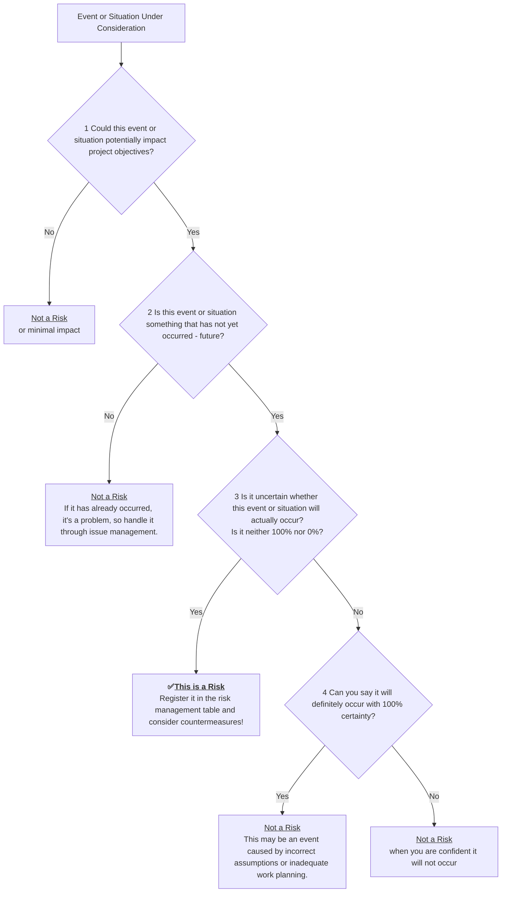

# Introduction

[In a previous article](https://developer.mamezou-tech.com/en/blogs/2025/06/06/from_problem_to_action_issue_management_for_rookies/), we discussed the difference between "problems" and "issues" and how to proceed with issue management. As a continuation, this time we will clearly explain the first step of risk management, centered on the difference between "risks" and "problems".

Are you grappling with any of these concerns?

- "Does ‘risk’ refer to everything that seems dangerous?"
- "How is it different from a problem?"
- "Where should I even start?"

By reading this article, you will:
- Clearly understand the difference between "problems" and "risks".
- Grasp why it’s important to identify and manage things as "risks".
- Learn a basic step-by-step risk management process you can use from tomorrow.
- Add the power of foresight to your project operations.

Let’s develop the skill to turn “vague anxieties” into “concrete actions.”

:::info
**This article is part of a series for new project managers**

1. [Part 1: Starting with the Difference between "Problems" and "Issues" (Introduction to Issue Management)](https://developer.mamezou-tech.com/en/blogs/2025/06/06/from_problem_to_action_issue_management_for_rookies/)
2. [Part 2: Detective-Style Management — How to Uncover the Truth? (Thinking & Observation)](https://developer.mamezou-tech.com/en/blogs/2025/06/13/fact_vs_truths_conan_inspired_pm_guide_for_rookies/)
3. Part 3: Starting with the Difference between "Problems" and "Risks" (Risk Management Guide)

👉 If you’re reading for the first time, we recommend [starting from Part 1](https://developer.mamezou-tech.com/en/blogs/2025/06/06/from_problem_to_action_issue_management_for_rookies/).
:::

# First, a Thought Experiment! Which One Is a 'Risk'?

As a warm-up, imagine this scenario: you’re cooking in the kitchen and you might accidentally drop a precious raw egg.

* **[A] Dropping the egg from the kitchen counter onto a hard floor**  
  In this case, it’s almost certain the egg will shatter on impact.

* **[B] Dropping the egg from a cutting board into the sink**  
  Here, the egg might break, but due to the smaller drop distance you might get lucky and only see a crack.

So, which one is more appropriately considered a **“risk”**?

---
**Answer and Explanation:**

The answer is **[B]**.

A risk is an event that involves **“uncertainty.”**  
Scenario [A] will almost certainly result in a bad outcome, so it’s closer to a “dangerous action to avoid” or a “problem,” and is different from a risk.  
On the other hand, [B] has uncertainty: “it might happen, or it might not.”  
That uncertainty about a future event is exactly what risk management is all about.

---

# What’s the Difference between Risks and Problems? How Even New Project Managers Can Distinguish Them

Did you sense that “uncertainty” was the key in the thought experiment? Now, let’s review the definitions of “problem” and “risk” and organize their differences.

## Definition of “Problem” (Review)

**A problem is the gap between the desired state and the current state — a troublesome condition that has already occurred.**

For example, schedule delays or revealed bugs are “problems” that require immediate action.

## Definition of “Risk”

**A risk is the effect of uncertainty on objectives.** (ISO 31000 / PMBOK® Guide)

As shown, even when things seem to be going smoothly, there’s the possibility of a downward deviation: “we might not achieve the expected outcomes.” That’s the essence of risk.  
In other words, **an event that hasn’t happened yet but could, and that can adversely affect objectives, is called a risk.**  
*In this article, we focus on negative risks — those that bring adverse effects.*

## Summary of Main Differences between Problems and Risks

| Feature                | Problem/Issue                                                     | Risk                                                                       |
| :--------------------- | :---------------------------------------------------------------- | :-------------------------------------------------------------------------- |
| **Occurrence Time**    | Already occurred                                                  | Not yet occurred (may happen in the future)                                |
| **Certainty**          | Definitely occurring                                              | Uncertain whether it will occur                                            |
| **Response Focus**     | Post-occurrence resolution (manage as an issue)                   | Prevention before occurrence / mitigation after occurrence (preventive & mitigation actions) |

Problems that have already surfaced are handled through issue management, while unoccurred risks are tackled via risk management. That’s the basic principle.

# Is This a Risk? Yes/No Flowchart for When You’re Unsure

# Three Reasons Why Risk Management Is Important: “Slack (Buffer)” Is the Key to Success

Risk management is not just the task of “listing all dangerous things and avoiding them.” Software engineer Tom DeMarco, in his book *SLACK: Getting Past Burnout, Busywork, and the Myth of Total Efficiency* [^1], states:

> *"Risk management is about planning for failure."* [^2]

In other words, risk management means planning with failure in mind. DeMarco further explains:

> *"Slack is what helps organizations cope with risk. It's the buffer that allows for the unexpected."* [^3]

[^1]: Tom DeMarco, *SLACK: Getting Past Burnout, Busywork, and the Myth of Total Efficiency*, Broadway Business, 2001.  
[^2]: Tom DeMarco, *SLACK*, (2001).  
[^3]: Tom DeMarco, *SLACK*, (2001).

“Slack”—or buffer—provides the flexibility to handle change and unforeseen events. Pursuing efficiency alone causes organizations to lose flexibility and become prone to failure when faced with minor changes or unexpected situations.

Conversely, by intentionally building in “Slack = insurance,” you enable a robust and adaptable operation. Thus, risk management is a management decision to “deliberately leave buffer” when preparing for an uncertain future.

This perspective offers an interesting way to judge whether your risk management is functioning properly. Imagine your project has absolutely no “slack” in terms of budget, schedule, or personnel.

If you’re always operating at the edge, that state itself is highly risky. At first glance, you might see “wasteful” tasks or costs that appear inefficient. However, those are precisely the “Slack” buffers planned to absorb unexpected changes. And that is evidence of effective risk management.

Whether you view that “slack” as waste or as insurance for the future is a decision that reflects the project manager’s capability.

# For New PMs: How to Create Your First Risk Register with Sample

Once you’ve identified risks, register them in a “risk register” to visualize and manage responses. Initially, a simple format in Excel or Google Sheets like the one below is sufficient.

## Start Here! How to Create a Risk Register [With Sample]

| ID    | Risk Date    | Risk Description (might happen)                                       | Probability (High/Med/Low) | Impact (High/Med/Low) | Risk Score (Probability×Impact) | Response Strategy (Preventive & Mitigation)                    | Owner       | Due Date   | Status             | Notes                      |
| :---- | :----------- | :------------------------------------------------------------------- | :------------------------- | :-------------------- | :------------------------------ | :------------------------------------------------------------ | :---------- | :--------- | :----------------- | :------------------------- |
| R-001 | 2025/06/06   | Key member A may suddenly resign, delaying the development schedule | Medium (2)                 | High (3)              | 6 (High)                        | Document member A’s tasks and share with member B. Prepare a handover plan. | PM Takahashi | 2025/06/20 | Under consideration |                           |
| R-002 | 2025/06/06   | The external API’s specifications may change significantly, causing rework | Low (1)                    | Medium (2)            | 2 (Low)                         | Regularly check the API provider’s updates and assess impact in advance.    | Suzuki      | Under review | Unaddressed        | Prepare for AWS outages   |
| R-003 | 2025/06/07   | Test environment setup may be delayed, delaying the start of testing  | Medium (2)                 | Medium (2)            | 4 (Medium)                      | Reconfirm required resources and request early from the IT department. Follow up weekly. | Sato       | 2025/06/15 | Completed          | Requested IT department   |

## Explanation of Sample Items

* `ID`: Assign a unique identifier for each risk (e.g., R-001).  
* `Risk Date`: Record when the risk was identified.  
* `Risk Description`: Describe the potential issue concretely, using a “might happen” form.  
* `Probability`: Assess how likely the risk is to occur. Initially, a three-level scale like “High (3) / Medium (2) / Low (1)” is sufficient. Base it on team knowledge and past experience.  
* `Impact`: Evaluate how much the risk would negatively affect project objectives (QCD, etc.) if it occurs, using scales like “High (3) / Medium (2) / Low (1).”  
* `Risk Score`: Calculate by multiplying the probability and impact scores. Higher scores indicate higher priority for countermeasure planning.  
* `Response Strategy (Preventive & Mitigation)`:  
  * **Preventive actions**: Specific steps to reduce the likelihood of the risk.  
  * **Mitigation actions**: Specific steps to minimize impact if the risk occurs.  
* `Owner`: Clarify the individual responsible for implementing the response strategy—specify a name.  
* `Due Date`: Set a target date for implementing the response or for monitoring the risk intensively.  
* `Status`: Record the current status (e.g., Unaddressed, Under consideration, In progress, Completed, Monitoring, Occurred [escalated to issue], etc.).  
* `Notes`: Record any special remarks or related information.

:::info:[Glossary] What QCD Means
**QCD** stands for **Quality**, **Cost**, and **Delivery**, the basic elements of project management. These three factors interact, so prioritizing one can impact the others. PMs must be mindful of QCD balance and make decisions from a holistic optimization perspective.
:::

### What Is a 'Risk Score' for Prioritizing Based on Probability and Impact?

By quantifying and multiplying a risk’s “probability” and “impact,” you can convert vague “this seems risky” into **objective numbers**. This helps the team share a common understanding and enables prioritized response planning and effective discussions.

### Prevention vs. Mitigation: Which Should Be Prioritized?

Generally, it’s best to prioritize **preventive actions**. Reducing the probability of a risk can significantly lower subsequent costs and impacts. However, if prevention is difficult or costly, preparing mitigation actions is crucial. Balancing both is where a project manager’s skill shines.

### About 'Occurred (Escalated to Issue)'

This refers to when a risk has actually occurred and begun to affect the project. In such cases, the risk is no longer subject to “risk management” but should transition into the “issue management” process as an official issue, requiring prompt handling. One objective of risk management is to minimize the chance of this “Occurred” state.

# Don’t Leave It Unattended! Operational Rules for Continuously Using the Risk Register

If you neglect the risk register, it will quickly become a mere formality. The key is to **regularly review and update** it — then it will function as a future-forecast radar.

## Basic Actions for Maintaining the Risk Register

- **Register new risks immediately**  
  Add any concern as soon as someone feels “this might be an issue.”  
- **Review the register weekly or at regular meetings**  
  Update high-priority risks’ statuses. If unaddressed, note the reasons.  
- **Organize completed risks**  
  Update the status column to “Completed” or similar to indicate closure.  
- **Archive unnecessary risks**  
  Move them to a separate sheet or the bottom as historical records.

## Why Is Maintenance Important?

Projects change daily. What was low risk yesterday may become high risk tomorrow. Regular updates themselves indicate that you’re truly prepared for risks.

# A 10-Item Risk Management Checklist for Project Teams

Risk management isn’t solely the project manager’s job; it requires cooperation from all team members. Awareness of, sharing, and cooperation on countermeasures enable effective responses. Use the checklist below to regularly assess your team’s risk management status.

| Item                           | Checkpoints                                                                                            |
| :----------------------------- | :----------------------------------------------------------------------------------------------------- |
| **At Project Start**           | Did you share a common understanding of “what risks are” and “the difference from issues” at kickoff?   |
|                                | Did you identify anticipated major risks? (Did you refer to past similar projects?)                    |
|                                | Did you create a risk register and share it with the team?                                              |
|                                | Does the project plan include planned “slack” in budget, schedule, and personnel?                      |
| **During Project Execution**   | Do you set aside time for regular (e.g., weekly) risk reviews?                                          |
|                                | When in doubt whether something is a risk, a mere concern, or an issue, do you use the flowchart?      |
|                                | Do you promptly register new risks as they arise?                                                      |
|                                | Are registered risks’ “statuses” and “due dates” kept up to date?                                       |
| **From a Team Management View**| Is there an environment where team members can easily share worries and concerns?                       |
|                                | Has a culture of “reporting risks when you notice them” been established?                              |
|                                | Are the roles and responsibilities for each risk’s response strategy clearly defined among stakeholders? |
| **After Project Completion**   | Did you review the risks that actually occurred and your response history?                              |
|                                | Did you analyze why unexpected risks were overlooked?                                                   |
|                                | Did you document “lessons learned in risk response” as knowledge for future use?                        |

# Conclusion: Risk Management Is Your Cane Before You Trip!

- **Risks are “uncertain future impacts,” distinct from “problems.”**  
- **“Guaranteed bad outcomes” are not risks but premises or problems.**  
- **Uncertainty is the essence of risk.**  
- With scoring and classification, you can calmly prioritize even extreme scenarios (e.g., an asteroid impact on a national-extinction scale). For example, a Japan-extinction-level asteroid impact receives low priority because its probability is astronomically low.  
- A simple list is fine to start. What matters is **continuously reviewing and updating**.

Issue management for “problems” after they occur is important, but risk management — taking preemptive measures to prevent problems from occurring in the first place — is equally indispensable. Both wheels are essential for driving a project to success. Risk management is the act of forecasting the future and striving to control it.

It may seem daunting at first, but the first step is simply to imagine: “What if this trouble happens? What can we do now?” The ideas and tools in this article are just the basics. Customize them to fit your project’s situation as you see fit.

Above all, don’t tackle it alone; cultivate a culture of discussing risks with the whole team. A day will surely come when you say, “I’m glad we identified those risks back then.”
