# Introduction
In a previous article, "[How to Differentiate 'Problem-solving' and 'Task Achieving'? — For Rookie Project Managers: Defensive and Offensive Thinking Styles](https://developer.mamezou-tech.com/blogs/2025/06/30/problem_solving_vs_task_achieving_pm_thinking_for_rookies/)", we introduced two thinking styles in project management (PM): the "problem-solving" style and the "task-achieving" style.

In this article, we focus on the "problem-solving" approach and explain a method to structurally understand the challenges and issues faced in the PM field, and to effectively resolve them from the root cause using causal diagrams. We place particular emphasis on the perspective of continuous process improvement.

*Note: A causal diagram is a chart that represents the relationship between "cause" and "effect" with arrows. Even beginners can give it a try easily.*

# Differentiating Problem-Solving and Task-Achieving Approaches Using Diagrams
Compare the "Ideal State (To Be)" and "Current State (As Is)" and use the approaches as follows:

- **Problem-solving**: The current state is worse than the ideal state → Identify and eliminate the cause  
- **Task-achieving**: You want to move from the current state to the desired state → Plan the means to achieve it  

This time, we will introduce how to proceed with the **"problem-solving"** approach. We will provide a practical explanation, including specific frameworks.

# Accelerate On-Site Improvement with a 6-Step Problem-Solving Process Using Causal Diagrams
Here is the overall view of the "6 steps" that organize everything from problem identification to solution derivation:

```mermaid
graph TD
  A[Ⅰ. Problem Identification] --> B[Ⅱ. Business Impact Identification]
  B --> C[Ⅲ. Deep Dive into Causes]
  C --> D[Ⅳ. Visualize Vicious Cycles]
  D --> E[Ⅴ. Root Cause Identification]
  E --> F[Ⅵ. Solution Determination]
```

## Step 1: Identify Problems (From Project Review)
First, use planning documents, weekly reports, and deliverables to list out the problems that occurred. Visualizing them by process using sticky notes can help you get an overall view.

📌 Example of Getting an Overview of Project Problems  

When listing problems, it's important to "write down even the smallest things." Beginners should not aim for perfection at the start; just record whatever comes to mind.

## Step 2: Clarify the Adverse Business Impacts Caused by the Problem
In this article, we will use "frequent defect injection into the production environment" as an example of a common issue in PM scenarios. Next, we will clarify how this problem impacts business.

The key is to visually trace back the causal chain to show what kind of "visible damage" the problem ultimately leads to.

For example, the following business damages may emerge:
- Increased costs (operational inefficiency)
- Customer churn (decline in satisfaction)

If you find it difficult to draw the "connection between problem and impact," try changing your perspective a bit.

For example, **"Defects are frequently injected into the production environment. What happens next?"**

If you ask yourself like this, you will naturally see business impacts and chain events like:
- Service downtime
- Customer complaints
- Burden of recovery work

As shown in the diagram, it’s recommended to color-code the "business damage" sticky notes so they are distinguishable from other elements.

🟡 Starting Point: The problem chosen for analysis  
🔴 Intermediate: Direct or structural factors that appear in the causal chain  
⚫ Result: Business damages that ultimately materialize (e.g., increased costs, customer churn)

For example, "service downtime" and "burden of recovery work" are treated as 🔴 intermediate factors. The resulting "customer churn" or "increased costs" correspond to ⚫ business damages.

Once you've placed the business damage sticky notes, next check if the causal relationships hold. Read them aloud from bottom to top in the format "If [cause], then [effect]."

For example,
- If "a defect is injected into the production environment," then "some service functionality stops."
- If "problem-fix and recovery work occurs," then "business operation costs increase."

By reading and confirming the causal relationships like this, you can determine whether **the logic is consistent**. If the links feel unnatural, adjust the wording or placement.

## Step 3: Identify the Causes
Once you understand the business impacts, delve into the causes of the problem. Keep asking "Why did it happen?" and trace the causal chain downstream.

The figure above starts from the direct cause of "defect injection." Then it digs into the structural background factors such as process immaturity, strained development resources, and chaotic change management.

In this step, the key is the quality and depth of your questions. Keep repeating "Why did this happen?" and get closer to the essence.

## Step 4: Visualize the 'Vicious Cycle Loops' That Cause the Problem to Repeat
In many sites, there are **'vicious cycle loops' where one result becomes the next cause, repeating the same problem.** Spotting these loops helps you get to the root of entrenched issues.

In the figure above, the loops that **form vicious cycles** have been highlighted with thick arrows within the causal diagram created in Step III.

🔁 Example of Loop A (Emergency Response and Quality Degradation Loop)  

Emergency responses become the norm, resources get strained, and ultimately the quality assurance system collapses. This loop creates a structure where "defect injection" occurs again.

🔁 Example of Loop B (Defect Loop Caused by Unrefined Processes)  

This one shows how insufficient testing and unestablished processes lead to defect injection again.

It may take some time to spot vicious cycle loops. To find a loop, look at the entire causal diagram and check if there's a flow that "goes around in a circle and comes back." It takes time, but once you spot this structure, you'll see a breakthrough for problem-solving.

## Step 5: Identify the Root Causes
Next, look for the **root causes** that serve as the 'starting point' of the vicious cycle. Root causes are the 'true causes' of recurring problems and have the following characteristics:

- No arrows pointing into it from other elements (= it is itself the source of cause)  
- Feels like there's no need to dig deeper  
- Addressing it is realistic, and resolving it is expected to have extensive impact  

In the figure above, the following two are listed as root causes:

- Lack of specialized testing knowledge and skills  
- Setting unrealistic plans and deadlines  

In this way, you identify the essential factors that are the "source" of the problems.

As with the diagram, it’s recommended to color-code "root cause" sticky notes so they are distinguishable from other elements.

🟡 Starting Point: The problem selected for analysis  
🟣 Cause: Intermediate factors (structural/direct causes)  
⚫ Root Cause: Essential factors causing recurrence (start of the vicious cycle)

For example, "chaotic change management" and "deficiencies in quality assurance system" are treated as 🟣 causes, while "unrealistic plans and deadlines" and "lack of skills" that provoke them are ⚫ root causes.

If these are addressed, the **potential to resolve multiple issues at once** is high. This step is about pinpointing those leverage points.

## Step 6: Decide How to Solve the Root Causes
Once root causes are identified, think about how to change them. Here, it is crucial to rephrase the negative causes into "desired states."

For example,  
"Setting unrealistic plans and deadlines" → "Plans and deadlines can be adjusted according to the situation"  
"Lack of specialized testing knowledge and skills" → "Team members have specialized testing knowledge and skills"  
In this way, rephrase with the perspective of **"What would be ideal?"**.

Next, consider **specific solutions** to realize that.

For example,  
"Plans and deadlines can be adjusted according to the situation" → "Conduct early and continuous risk assessment and sharing"  
Such practical and feasible measures should be prepared.

When brainstorming solutions, envision the "desired state." If it's your first time, it's recommended to start with small improvements. Don't rush—progress step by step.

Finally, reverse-engineer from the desired future vision to build the overall picture.

In this "future realization tree," you'll map out the "story toward the future" in three stages:

- Replace the cause with the desired phenomenon  
- Invert the problem into an ideal goal  
- Verify that each connects logically  

With this, the "problem-solving model" using causal diagrams is complete.

# Benefits of Causal Diagrams
There are many benefits to creating causal diagrams.
* **Deepens shared understanding across the team**: It helps not only within the team but also for explanations to external organizations.  
* **Enables explanation linking business impacts and technical issues**: You can visually show the flow of problems leading to business damages.  
* **Clarifies root causes**: Makes it easier to identify not just surface issues but the true root causes lying beneath.  
* **Visualizes strategies to break vicious cycles**: You can identify the vicious cycles that perpetuate problems and find intervention points to break them.  
* **Makes it easier to validate solutions**: Understanding root causes and vicious cycles allows you to derive and select the most effective solutions.

# Tips and Pitfalls When Drawing Causal Diagrams
Notes for creating causal diagrams:
* ❌ **Too many arrows/elements** → Remove unnecessary ones.  
* ⚠️ **Don't oversimplify** → Clearly include what the creator can explain.  
* ⚠️ **Don't broaden the problem domain too much** → Narrow your focus.  
* 🚫 **Avoid letting it turn into personal attacks.**

# Conclusion: Key Points for Approaching 'Structural Problems' with Causal Diagrams
In this article, we've outlined concrete steps for problem-solving using causal diagrams to aid on-site improvements. It's important to identify the root causes of problems and adopt a perspective of preventing recurrence and improving business processes.

Causal diagrams are a problem-solving tool that even beginners can tackle. Start with small issues, gain experience, and steadily advance on-site improvements. Give it a try.

Next time, we'll introduce a method that uses this future realization tree to connect goal setting to planning.

:::info
**This article is part of the "Capable PM Series"**  
👉 [Prevent Checklist Ritualization! Rebuilding Techniques and 7 Improvement Measures for Capable PMs](https://developer.mamezou-tech.com/blogs/2025/07/10/pm_checklist_rebuild_and_improve/)  
👉 [How to Conduct Regular Meetings That Don't Become Rituals | 7 Improvement Steps for Capable PMs](https://developer.mamezou-tech.com/blogs/2025/07/18/pm_meeting_rebuild_and_improve/)  
👉 [List Management for Issues That Actually Get Resolved | 12 Practical Tips for PMs to Escape Ritualization](https://developer.mamezou-tech.com/blogs/2025/07/24/issue_list_rebuilding_and_practical_tips_for_pms/)  
:::

