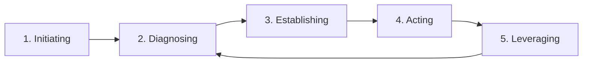

# Introduction
"Even though I know process improvement is important, I just can't get results"—  
Have you ever felt this way on the ground?

The purpose of process improvement is not simply to "make processes better."  
At its core, it's about **building the foundation to continuously produce high-quality products and services.**

However, it takes time for process improvement to yield results.  
In organizations without dedicated members, improvement activities tend to be done on the side between projects.  
As a result, it's not uncommon for years to pass with no noticeable effect.

This article explains how to carry out process improvement based on the IDEAL model that PMs and project managers can use in the field.  
We introduce five steps for embedding process improvement in project environments, including software development.

# The Five-Step Overview of Process Improvement
Following these five steps is effective for process improvement.

📌 **IDEAL Model**  

## 1. Initiating: Solidify the Foundation of Improvement through Stakeholder Alignment

### Clarify Objectives and Goals
Before starting improvement, share with all stakeholders "why improvement is needed."

- Clarify the background and objectives for starting improvement.  
- Secure commitment from the organization’s leadership (the sponsor responsible for process improvement).  
- Holding motivational sessions for stakeholders can also be effective.

:::info:Point
If the background and goals are vague, the priority of process improvement can easily drop off midway.  
Since process improvement has limited immediate effects and takes time, consensus with a long-term perspective is required.
:::

## On-site Investigation — Understanding the Actual Situation
Next, conduct interviews at project sites and support organizations to grasp current issues.

- Conduct interviews with business sponsors and project staff.  
- Formulate hypotheses about potential root causes of problems.

:::info:Point
At this stage, limit yourself to formulating "hypotheses."  
The direction of improvement will be decided in the next diagnosing phase.
:::

## 2. Diagnosing: Identify the Root Causes of Quality Degradation and Delays through Current-State Analysis
Based on information from on-site investigation, systematically diagnose the organization’s processes.

### Assessment Planning
Create assessment items tailored to your organization, based on industry standards (e.g., CMMI or ISO15504).

### Conducting the Assessment
Verify hypotheses by reviewing documents and conducting interviews with the target projects and support organizations.

### Analysis of Results
From the assessment results, identify process strengths and weaknesses, and pinpoint specific issues.  
Summarize these in a report to visualize the organization’s overall development capability.

#### Examples of Deliverables
**Example: Quantitative Evaluation**  

**Example: List of Strengths, Weaknesses, and Issues**  

## 3. Establishing: Create an Improvement Plan that Balances Short-term and Long-term Effects
Organize the issues identified in diagnosing and formulate an improvement plan.

### Selecting the Optimal Initiatives

Group issues by similarity and relevance, structure their hierarchy and relationships, and identify bottlenecks.

### Developing the Execution Plan

Based on the structured issues, create a mid-to-long-term roadmap.  
Then develop a concrete execution plan specifying who will do what by when.

It is especially important in the execution plan to clearly define "Who (responsible), What (solution), and When (timeframe)."

:::info:Point
It’s important not to try to solve everything at once.  
Combine measures that produce short-term results with those effective over the long term.
:::

Also, for prioritizing initiatives, mapping based on  
- Effectiveness of the initiative (expected improvement impact)  
- Difficulty (ease of implementation and risk)  
can be effective.

## 4. Acting: Pilot and Deploy Solutions to Embed Them on the Ground
Introduce the improvement measures to the field according to the plan.

### Piloting the Solutions
Conduct a preliminary evaluation and pilot of the proposed solutions, then refine them based on results.

### Organization-wide Deployment
Provide overviews and training to the entire organization or project to implement and roll out solutions.

:::info:Point
Do not impose solutions on the field; it is important to cycle through short loops of pilot → feedback → refinement.
:::

## 5. Leveraging: Measure Effectiveness and Connect to the Next Improvement Cycle
Measure the effects of improvement measures and prepare for the next cycle.

In reflection, recall past activities and decide on next actions.

- Recall improvement activities from the improvement plan, weekly reports, deliverables, etc.  
- Keep: List achievements and what went well based on KPIs and qualitative evaluations.  
- Problem: List difficulties and issues encountered.  
- Try: Propose measures to reinforce the Keep items and address Problems.  
- ToDo: Decide which Try measures to implement next week and beyond.

If there are no ToDos, proceed to the diagnosing phase as the next improvement cycle; if there are, advance to the planning phase.

:::info:Point
Improvement doesn’t end with one cycle; continuity is essential.  
Don’t let reflections end as mere debriefs; make them a venue to decide the “next move.”
:::

# Supplement: The Importance of a Process-Centric Approach
In organizational process improvement activities, a **process-centric approach** based on the IDEAL model is effective.  
By capturing on-site realities from multiple perspectives through assessment, you build a foundation for continuous improvement rather than mere issue resolution.

This way, you can uncover not only manifest issues but also potential problems.  
Especially in software and system development environments, this becomes the foundation for long-term quality improvement and continuous enhancement.

For comparison, here’s an outline of the differences with the “Problem-Centric Approach.”

| Approach           | Advantages                                               | Disadvantages                                                                  |
|--------------------|----------------------------------------------------------|--------------------------------------------------------------------------------|
| **Problem-Centric** | High immediate impact and easier acceptance by the team  | Limited when causes are complex; you see only the tip of the iceberg, leaving root causes unaddressed and recurrence risk remains |
| **Process-Centric** | Addresses root causes and leads to long-term improvement | Planning→analysis→design takes time; high initial cost and results may take time to appear |

Both approaches are effective, but **a process-centric perspective is indispensable for changing organizational culture**.

# Summary: For Continuous Process Improvement
- **Emphasize a process-centric approach**  
  Analyze the entire process, not just visible issues, to identify fundamental problems.
- **Conduct assessments tailored to your organization**  
  Base them on industry-standard models but customize to fit your organization’s characteristics for maximum effectiveness.
- **Clarify the priorities of initiatives**  
  Select measures based on effectiveness and difficulty, combining short-term and long-term improvements.
- **Build a culture of continuous improvement**  
  The ultimate goal is for the organization to be able to autonomously improve its processes.

Process improvement does not yield results overnight.  
It is important to drive continuous improvement from the PM and project management perspective and embed it in the organizational culture.  
By taking steady steps and engaging the entire organization, you cultivate the soil that produces high-quality products and services.

:::info
**This article is part of the "Effective PM Series"**  
👉 [Preventing Checklist Hollowing! Reconstruction Techniques and 7 Improvement Measures for Effective PMs](https://developer.mamezou-tech.com/blogs/2025/07/10/pm_checklist_rebuild_and_improve/)  
👉 [How to Run Routine Meetings That Don't Become Hollow | 7 Improvement Steps for Effective PMs](https://developer.mamezou-tech.com/blogs/2025/07/18/pm_meeting_rebuild_and_improve/)  
👉 [Issue List Management That Gets Tasks Done | 12 De-Hollowing Techniques for Effective PMs](https://developer.mamezou-tech.com/blogs/2025/07/24/issue_list_rebuilding_and_practical_tips_for_pms/)  
👉 [Problem-Solving Methods Using Cause-Effect Diagrams | Practical Steps for On-site Improvement by Effective PMs](https://developer.mamezou-tech.com/blogs/2025/08/05/problem_solving_with_cause_effect_diagram/)  
:::

