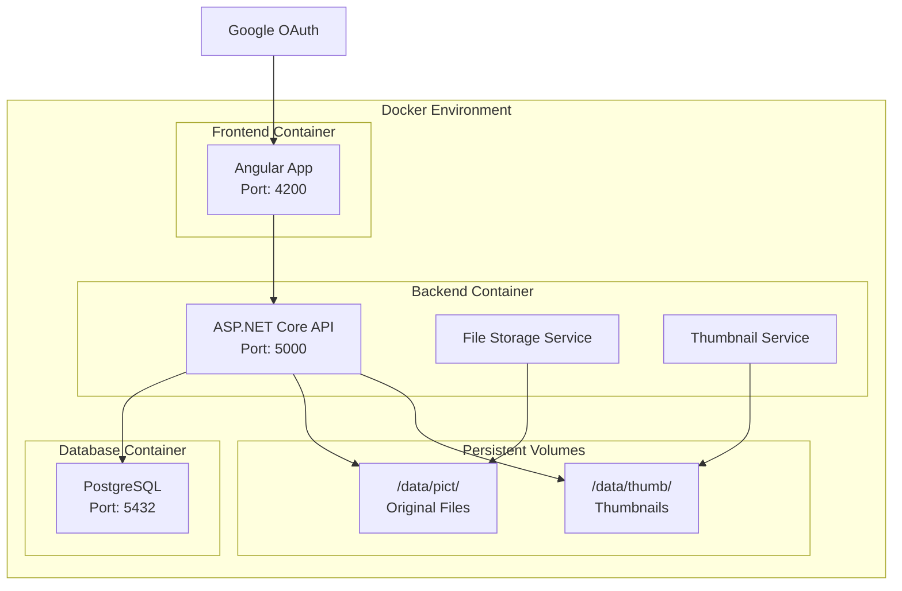
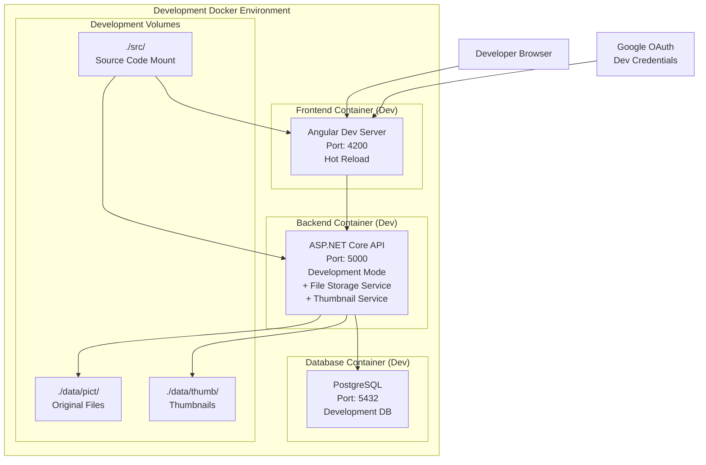
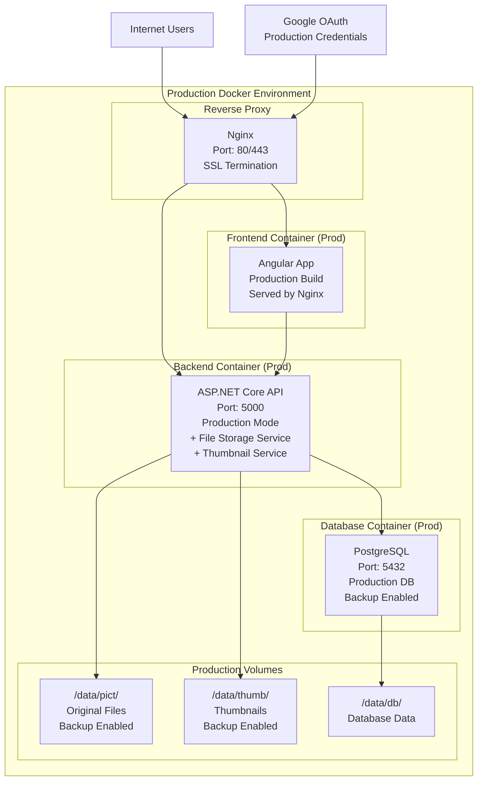

Last month, AWS announced Kiro (https://kiro.dev), an AI agent–based IDE. It’s free to use during the preview period, so I decided to give it a try.

During the preview, I used Kiro to build an album app intended to run on a home server. Over the next few installments, I’ll share my development record using Kiro.

:::info
The version of Kiro used is 0.1.25.
:::

## 1. Initial Prompt

When you launch Kiro and open an empty folder, a screen like the one below appears.

  

As my first step, I selected “Spec” mode and gave the following instructions:

```text:Author
I want to create an album app.
The frontend should be Angular and the backend should be ASP.NET Core.
The runtime and development environments should run on Docker containers.
```

I specified frameworks I’m comfortable with to make it easier to review. I’m not sure if Kiro supports them.

Kiro’s response:

```text:Kiro
Developing an album app, right? Angular frontend, ASP.NET Core backend, and a Docker-based setup—that’s a great idea.

First, let’s create a requirements document for this feature.
Created requirements.md

The requirements document has been created. In this document, the main features of the album app are organized into six requirements:
1. User authentication and account management - secure login and registration functionality
2. Photo upload and management - handling and managing image files
3. Album creation and organization - grouping and organizing photos
4. Album sharing and privacy - features for sharing with other users
5. Development and execution in Docker environment - containerized environment
6. Responsive UI and usability - support for various devices

Each requirement includes user stories and concrete acceptance criteria (EARS format).

Do these requirements look appropriate? If so, we can proceed to the design phase.
```

The [requirements document (requirements.md)](https://github.com/NoriyukiYagi/kiro-album-app/blob/v0.0.1/.kiro/specs/album-app/requirements.md) has been created.

Below is an excerpt shown in the figure:

  

It generated general user stories based on the keyword “album app” and listed the necessary features. It also included acceptance criteria, which look like they could be used directly as acceptance tests.

## 2. Adding and Modifying Requirements

Next, I gave the following instructions to add and modify requirements:

```text:Author
Use Google accounts for user authentication.
Only users with admin privileges can add or remove users who can log in.
Users with admin privileges should be configurable via the backend application's configuration file.
It should be possible to upload not only photos but also videos.
The maximum upload file size should be 100MB.
Allowed file extensions for upload are JPG, PNG, HEIC, MP4, and MOV.
Extract the date from the file metadata, create a directory following the pattern '/data/pict/<YYYYMMDD>', and store the file in it.
Generate a thumbnail image of the file, create a directory '/data/thumb/<YYYYMMDD>' following that pattern, and store the thumbnail image in it.
The photo list should display the thumbnail images.
Thumbnail images must be at most 300 pixels in width and height.
```

Kiro’s response:

```text:Kiro
I understand the album app specification. It’s a photo and video management app with an Angular frontend, ASP.NET Core backend, and Docker environment.

First, I’ll update the requirements document.
Accepted edits to requirements.md

The requirements document has been updated. It organizes the requirements for the photo and video album app with Angular frontend, ASP.NET Core backend, and Docker environment in EARS format.

The main requirements are as follows:
・Google OAuth authentication and user management
・Photo and video upload (100MB limit, specific extensions only)
・Date-based file organization in the metadata database
・Automatic thumbnail generation (under 300px)
・Thumbnail list display
・Operation in Docker containers

Is the contents of the requirements document appropriate? Let me know if any corrections are needed. If there are no issues, we will proceed to the design phase.
```

The [requirements document (requirements.md)](https://github.com/NoriyukiYagi/kiro-album-app/blob/v0.0.2/.kiro/specs/album-app/requirements.md) has been updated.

Below is an excerpt shown in the figure:

  

The content has changed drastically, but it appears to be fine. Let’s move on to the design phase.

## 3. Design

Press the “Move to design phase” button in the prompt to proceed to the design phase.

Kiro’s response:

```text:Kiro
The requirements have been approved. Next, proceeding to the design phase.

First, gathering information on the technology stack and implementation requirements.
Searched workspace
Researched integration patterns between Angular and ASP.NET Core
Read file(s) requirements.md

Based on the requirements, creating the design document. Selecting the technology stack and designing each component.
Created design.md

The design document has been created. Major design decisions:
Architecture:
・Docker container-based microservices architecture
・Angular frontend + ASP.NET Core backend + PostgreSQL
・File management via persistent volumes
Technology selection:
・Image processing: ImageSharp (.NET native)
・Video processing: FFMpegCore (FFmpeg wrapper)
・Authentication: Google OAuth 2.0
・Database: PostgreSQL (Docker-enabled)
Security:
・JWT token-based authentication
・Admin privileges managed through configuration files
・File size and extension validation
File management:
・Date-based directory structure in the metadata database
・Automatic thumbnail generation (300px limit)
・Data protection via persistent volumes

Is the content of the design document appropriate? If any adjustments are needed for the technology selection or architecture, please let me know. If there are no issues, we will proceed to create implementation tasks.
```

The [design document (design.md)](https://github.com/NoriyukiYagi/kiro-album-app/blob/v0.1.0/.kiro/specs/album-app/design.md) has been created.

There were syntax errors in the system architecture diagram written in Mermaid notation, so I corrected them. → [Corrected design document (design.md)](https://github.com/NoriyukiYagi/kiro-album-app/blob/v0.1.1/.kiro/specs/album-app/design.md)

An excerpt is shown in the figure:

  

It researches the technology first and then designs based on the requirements. I found it interesting that it follows the same steps as a human designer.

The system architecture diagram looks plausible but feels off.



‘File Storage Service’ and ‘Thumbnail Service’ are backend components, so it’s odd that they’re on the same level as ASP.NET Core.

Also, since ‘Nginx (reverse proxy, production environment)’ was mentioned and production environment architecture is considered, I wanted the system architecture diagrams to be separated for development and production environments.

Aside from the system architecture diagram, everything else looks fine.

## 4. Request to Revise the System Architecture Diagram

I wanted the system architecture diagrams for development and production environments separated, so I asked Kiro:

```text:Author
Draw separate system architecture diagrams for the development environment and the production environment.
```

Kiro’s response:

```text:Kiro
I will update the design document to separate the system architecture diagrams for the development and production environments.
Error(s) while editing design.md
Unable to replace text, trying a different approach...

Checking the relevant sections of the design document for accurate replacement.
Read file(s) design.md 10 - 51
Accepted edits to design.md

Separated and updated the system architecture diagrams for the development and production environments.
Development environment features:
- Hot reload support via Angular Dev Server
- Volume mounting of source code
- Google OAuth credentials for development
- File storage in local directories
Production environment features:
- SSL termination via Nginx reverse proxy
- Angular production build
- Database and file backup functionality
- Google OAuth credentials for production

Is the updated design document content appropriate? If any further corrections are needed regarding the diagrams for the development and production environments, please let me know. If there are no issues, we will proceed to create implementation tasks.
```

The [design document (design.md)](https://github.com/NoriyukiYagi/kiro-album-app/blob/v0.1.2/.kiro/specs/album-app/design.md) has been updated.

I fixed syntax errors in the production environment system architecture diagram. → [Corrected design document (design.md)](https://github.com/NoriyukiYagi/kiro-album-app/blob/v0.1.3/.kiro/specs/album-app/design.md)

I also asked Kiro to fix the ‘File Storage Service’ and ‘Thumbnail Service’ issue:

```text:Author
If 'File Storage Service' and 'Thumbnail Service' are included in the ASP.NET Core API, wouldn't they be unnecessary in the diagram?
```

Kiro’s response:

```text:Kiro
You're absolutely right. File Storage Service and Thumbnail Service are service classes within the ASP.NET Core API, so they don't need to be shown as separate containers. I will update the architecture diagram.
Error(s) while editing design.md
Unable to replace text, trying a different approach...

Checking the current file content for accurate replacement.
Read file(s) design.md 10 - 81
3 edits to file design.md
Read file(s) design.md 65 - 86
Accepted edits to design.md

The architecture diagram has been updated. File Storage Service and Thumbnail Service are now represented as service classes within the ASP.NET Core API, not as independent containers.

Is the updated design document content appropriate? Let me know if any further adjustments are needed. If there are no issues, we'll move on to creating implementation tasks.
```

The [design document (design.md)](https://github.com/NoriyukiYagi/kiro-album-app/blob/v0.1.4/.kiro/specs/album-app/design.md) has been updated.

The final system architecture diagrams are as follows.

#### Development Environment Configuration


#### Production Environment Configuration


Looks good. Let’s move on to the next step.

## 5. Implementation Plan

Click the “Move to implementation plan” button in the prompt to proceed to the implementation plan.

Kiro’s response:

```text:Kiro
The design has been approved. Next, we will create implementation tasks.
Read file(s) requirements.md design.md

Based on the requirements and design, we will create implementation tasks.
Created tasks.md

The implementation plan has been created. It consists of 20 tasks in a plan to implement features incrementally.
Main implementation flow:
Foundation setup (Tasks 1-2):
・Docker environment configuration
・Database and entity setup
Authentication features (Tasks 3-4):
・Implement Google OAuth
・User management features
File management (Tasks 5-9):
・Upload functionality
・Metadata extraction and organization
・Thumbnail generation
・API implementation
Frontend (Tasks 10-16):
・Angular project setup
・Implementation of various components
Quality & deployment (Tasks 17-20):
・Error handling
・Production environment configuration
・Test implementation
・Integration and documentation
Each task corresponds to the acceptance criteria in the requirements definition and allows incremental implementation with a focus on test-driven development.

Do the implementation tasks look appropriate? If revisions are needed for the task breakdown or order, please let me know. If there are no issues, the specification creation is complete.
```

The [implementation tasks (tasks.md)](https://github.com/NoriyukiYagi/kiro-album-app/blob/v0.2.0/.kiro/specs/album-app/tasks.md) has been created.

Below is an excerpt shown in the figure:

  

Since it looks fine, I clicked the “Finalize task list” button in the prompt.

Kiro’s response:

```text:Kiro
Implementation tasks have been approved!

The specification creation for the album app is complete. The following deliverables have been created:
・Requirements definition document (.kiro/specs/album-app/requirements.md): Defines 7 main requirements in EARS format
・Design document (.kiro/specs/album-app/design.md): System architecture, technology stack, data model, API design
・Implementation plan (.kiro/specs/album-app/tasks.md): 20 step-by-step implementation tasks
With this, the development preparation for a photo and video album app using Angular + ASP.NET Core + Docker is complete.

To start implementation, open the tasks.md file and click the 'Start task' button next to each task to incrementally implement the features. I recommend starting with the first task, 'Configure the Docker environment and project structure.'
```

The preparation for implementation is complete. From next time, we will enter the implementation phase.

## Impressions So Far

First, I thought it was wonderful that it properly writes the requirements definition and design documents. Being able to review the content before moving on to the next phase gives a sense of security.

Even for applications specialized for specific business tasks, it might be possible to create a requirements definition document by providing a list of requirements or user stories.

As for the automatically generated requirements definition and design documents, there were no issues except for the system architecture diagrams.

It seems like it could be of practical use in actual work as well.
