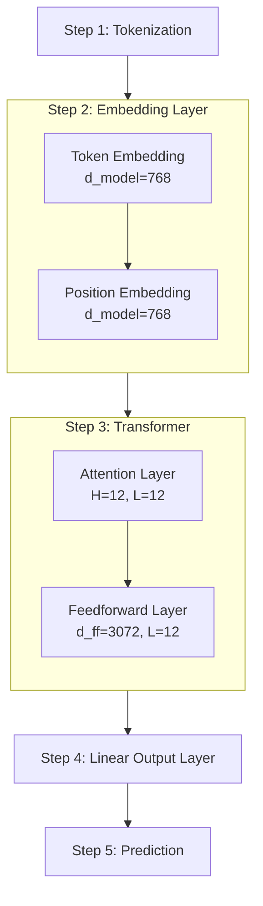
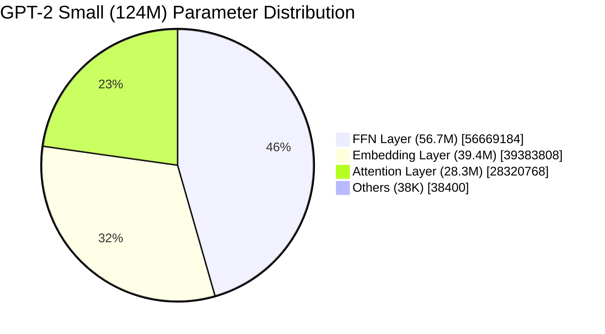

This article is the Day 3 installment of the Summer Relay Series 2025.

:::check

This article is intended for readers who:

* Want an intuitive understanding of the relationship between parameter count and LLM performance  
* Wish to get an overview of the Transformer mechanism as a starting point for deeper study

The goal here is not detailed theoretical exposition but **grasping the big picture**. For more in-depth study, please refer to the [reference book](https://book.mynavi.jp/ec/products/detail/id=146901) introduced below.

:::

# 1. Introduction

## Fundamental Questions about Parameter Count

In large language models, the number of parameters is often presented as a key metric. For example, on August 5, 2025, OpenAI announced[^1] “gpt-oss-20b” and “gpt-oss-120b,” including the parameter scale in the model names. This figure can be interpreted both as an estimate of required memory and as an implication of performance level.

But **why can we say that models with more parameters perform better**? To understand this, we need to break down and examine how each parameter actually functions.

## Methodology and References

To answer this question, we referred to the book ‘[つくりながら学ぶ！LLM自作入門（マイナビ出版）](https://book.mynavi.jp/ec/products/detail/id=146901)’ and experimentally decomposed the 124M parameters used in GPT-2 small to measure the role each parameter plays.

@[og](https://book.mynavi.jp/ec/products/detail/id=146901)

This book is notable for **explaining LLM theory step by step with source code**. The [original author’s GitHub repository](https://github.com/rasbt/LLMs-from-scratch) is also remarkably informative.

@[og](https://github.com/rasbt/LLMs-from-scratch)

In this article, using these resources, we verified the roles of the parameters in practice. Rather than viewing the parameter count as a mere list of numbers, in Chapter 2 we will take a detailed look at how each parameter collaborates to achieve “understanding” and “generation.”

# 2. Empirical Analysis – Dissecting GPT-2 small (124M)

:::alert
The explanations in this chapter are organized based on the author’s understanding of the book and experimental results. For clarity, some parts are simplified. For more rigorous theory or full mathematical derivations, please refer to the [reference book](https://book.mynavi.jp/ec/products/detail/id=146901). If you find any errors or omissions, your feedback is greatly appreciated.
:::

## 2-1. Overall Processing Steps

Based on the diagram in Chapter 4 of the book, published on GitHub[^2-1], we have summarized the flow of GPT-2 text processing into five concise steps (significant omissions of residual connections, dropout, etc.):

These steps involve four tunable parameters: d_model=768, H=12, L=12, and d_ff=3072. There are other tunable parameters, but in this article we will track the first four listed in the official PyTorch Transformer documentation[^2-2]. These four adjustable parameters will be discussed later in Section 3-2.



### Overview of Processing

For example, given the input “Hello, I am,” it is processed as follows, leading to the next token output (e.g., “student”):

**Step 1: Tokenization**  
* Convert text to token ID sequence: `"Hello, I am" → [15496, 11, 314, 716]`

**Step 2: Embedding Layer**  
* Token Embedding – Convert each token ID to a 768-dimensional vector  
* Position Embedding – Add positional information as 768-dimensional vectors

**Step 3: Transformer Block (×12 layers)**  
* Attention Module – Calculate relationships between tokens  
* Feedforward Network – Transform and compress information

**Step 4: Linear Output Layer**  
* Final normalization  
* Output projection with weight sharing

**Step 5: Prediction**  
* Compute probabilities with Softmax  
* Select from 50,257 candidates

## 2-2. Parameters Used per Step (Skip if You Like!)

This section explains the number of parameters used in each step. For accuracy, we analyzed the [source code published in the original author’s GitHub repository](https://github.com/rasbt/LLMs-from-scratch/blob/main/ch04/01_main-chapter-code/gpt.py) with generative AI and organized it by step. However, generative AI is not good at precise numeric computations, so we used the results of the verification code below for the parameter counts.

<details>
<summary>Parameter Verification Code (click to expand)</summary>

> ```python:check_param.py
> # GPT-2 124M parameter calculation based on gpt.py implementation
> 
> # GPT-2 124M configuration from gpt.py
> vocab_size = 50257
> context_length = 1024
> emb_dim = 768
> n_heads = 12
> n_layers = 12
> qkv_bias = False  # No bias in Q,K,V projections
> 
> print("=" * 60)
> print("GPT-2 124M Parameter Count (based on gpt.py)")
> print("=" * 60)
> 
> # 1. Embedding layers
> token_emb = vocab_size * emb_dim
> pos_emb = context_length * emb_dim
> emb_total = token_emb + pos_emb
> 
> print("\n1. Embedding Layers:")
> print(f"   Token embedding: {token_emb:,}")
> print(f"   Position embedding: {pos_emb:,}")
> print(f"   Subtotal: {emb_total:,}")
> 
> # 2. Transformer block (per layer)
> print("\n2. Transformer Block (per layer):")
> 
> # MultiHeadAttention
> # From gpt.py: W_query, W_key, W_value with qkv_bias=False
> qkv_weights = emb_dim * emb_dim * 3  # No bias
> # From gpt.py: out_proj has bias by default
> out_proj = emb_dim * emb_dim + emb_dim  # Weight + bias
> attention_total = qkv_weights + out_proj
> 
> print(f"   a) MultiHeadAttention:")
> print(f"      Q,K,V weights (no bias): {qkv_weights:,}")
> print(f"      Output projection (with bias): {out_proj:,}")
> print(f"      Attention total: {attention_total:,}")
> 
> # FeedForward
> # From gpt.py: nn.Linear(emb_dim, 4*emb_dim) with bias
> ffn_fc = emb_dim * (4 * emb_dim) + (4 * emb_dim)
> # From gpt.py: nn.Linear(4*emb_dim, emb_dim) with bias
> ffn_proj = (4 * emb_dim) * emb_dim + emb_dim
> ffn_total = ffn_fc + ffn_proj
> 
> print(f"   b) FeedForward:")
> print(f"      First layer (768->3072): {ffn_fc:,}")
> print(f"      Second layer (3072->768): {ffn_proj:,}")
> print(f"      FFN total: {ffn_total:,}")
> 
> # LayerNorm (2 per block: norm1 and norm2)
> # From gpt.py: scale and shift parameters
> ln_params = emb_dim * 2 * 2  # 2 params (scale, shift) × 2 LayerNorms
> 
> print(f"   c) LayerNorm x2: {ln_params:,}")
> 
> # Total per block
> block_total = attention_total + ffn_total + ln_params
> print(f"   Total per layer: {block_total:,}")
> 
> # 3. All transformer layers
> transformer_total = block_total * n_layers
> print(f"\n3. All Transformer Layers ({n_layers} layers):")
> print(f"   Total: {transformer_total:,}")
> 
> # 4. Final layers
> # From gpt.py: final_norm (LayerNorm)
> final_ln = emb_dim * 2  # scale and shift
> # From gpt.py: out_head shares weights with token embedding
> # nn.Linear(emb_dim, vocab_size, bias=False)
> # Weight is shared with token_emb, so we don't count it again
> 
> print(f"\n4. Final Layers:")
> print(f"   Final LayerNorm: {final_ln:,}")
> print(f"   Output head: Weight shared with token embedding (not counted)")
> 
> # 5. Total
> total_params = emb_total + transformer_total + final_ln
> 
> print(f"\n" + "=" * 60)
> print(f"TOTAL PARAMETERS: {total_params:,}")
> print(f"=" * 60)
> 
> # Verify the calculation
> print(f"\nExpected (GPT-2 124M): 124,412,160")
> print(f"Calculated: {total_params:,}")
> print(f"Match: {total_params == 124412160}")
> 
> # Breakdown summary
> print(f"\nParameter Distribution:")
> print(f"  Embeddings: {emb_total:,} ({emb_total/total_params*100:.1f}%)")
> print(f"  Transformer: {transformer_total:,} ({transformer_total/total_params*100:.1f}%)")
> print(f"  Output: {final_ln:,} ({final_ln/total_params*100:.1f}%)")
> ```
</details>

:::check
Since this is a source code–based explanation, readers who only want the conclusion can proceed to the next chapter.
:::

### Step 1: Tokenization

Used parameters: 0

Convert text to numbers  
* Dictionary-based conversion by BPE (Byte Pair Encoding)  
* Based on pretrained vocabulary (50,257 tokens)

### Step 2: Embedding Layer (39,383,808 parameters)

**Token Embedding: 38,597,376 parameters**  
* 50,257 vocabulary × 768 dimensions = 38,597,376 parameters (Reference: GPT-3 uses embedding size of 12,288 dimensions)  
* Retrieve the 768-dimensional vector for each token ID from the embedding table

**Position Embedding: 786,432 parameters**  
* 1,024 positions × 768 dimensions = 786,432 parameters  
* Retrieve the 768-dimensional vector for each position from the embedding table

**Embedding addition (no parameters)**  
* Token Embedding + Position Embedding (element-wise)  
* Apply Dropout(0.1)

### Step 3: Transformer Block (12 layers, total 85,026,816 parameters)

Each layer uses 7,085,568 parameters:

**MultiHeadAttention (2,360,064 parameters)**

12-head parallel processing (each head 64 dimensions):  
* Query projection: `nn.Linear(768, 768, bias=False)` → 589,824 parameters  
* Key projection: `nn.Linear(768, 768, bias=False)` → 589,824 parameters  
* Value projection: `nn.Linear(768, 768, bias=False)` → 589,824 parameters  
* Output projection: `nn.Linear(768, 768)` → 590,592 parameters (including bias)

Processing flow:  
1. Receive input vector [B(Batch size), T(Sequence length), 768]  
2. Generate Q, K, V via linear transformations and split into 12 heads [B, 12, T, 64]  
3. Compute attention scores: scores = (Q · Kᵀ) / √64  
4. Apply causal mask and normalize with softmax to get attention weights [B, 12, T, T]  
5. Compute context vector: context = weights · V [B, 12, T, 64]  
6. Concatenate 12 heads and output projection back to [B, T, 768]

**FeedForward (4,722,432 parameters)**

4× dimension expansion and compression:  
* First layer: `nn.Linear(768, 3072)` → 2,362,368 parameters (weight + bias)  
* GELU activation (no parameters)  
* Second layer: `nn.Linear(3072, 768)` → 2,360,064 parameters (weight + bias)

**LayerNorm (3,072 parameters)**

Normalize before and after residual connections:  
* norm1 (before Attention): 1,536 parameters (scale:768 + shift:768)  
* norm2 (before FFN): 1,536 parameters (scale:768 + shift:768)

**Residual (shortcut) connections and Dropout**  
* No parameters; improve gradient flow

### Step 4: Output Layer (1,536 parameters)

**Final LayerNorm: 1,536 parameters**  
* `LayerNorm(768)`: scale(768) + shift(768)

**Output projection (weight sharing)**  
* `nn.Linear(768, 50257, bias=False)`  
* Use the transpose of token embeddings (saves 38,597,376 parameters)

### Step 5: Prediction (no parameters)

**Softmax probability computation**  
* Select the next token from 50,257 vocabulary  
* Temperature sampling or Top-k/Top-p methods can be applied

## 2-3. Overview of All 124M Parameters

As a result of the analysis, the 124,412,160 parameters of GPT-2 small are distributed as follows:

```
Step 1: Tokenization               0 (0%)
Step 2: Embedding Layer     39,383,808 (31.7%)
  ├─ Token Embedding       38,597,376 (31.0%)
  └─ Position Embedding        786,432 (0.6%)
Step 3: Transformer Layers  85,026,816 (68.3%)
  ├─ Attention (12 layers, 12 heads)   28,320,768 (22.8%)
  ├─ FFN (12 layers)      56,669,184 (45.5%)
  └─ LayerNorm (12 layers)      36,864 (0.03%)
Step 4: Output Layer            1,536 (0.001%)
  └─ Final LayerNorm (projection weights shared)
Step 5: Prediction               0 (0%)
────────────────────────────────
Total:                    124,412,160
                         ≈ 124.4M (124 million)
* Weight sharing saves 38,597,376 parameters (without sharing: 163,009,536)
```

# 3. Conclusion and Discussion – Why Parameter Count Determines Performance

## 3-1. Attention Accounts for Only 22.8% of the Parameters

The breakdown of GPT-2’s parameters is shown in a pie chart:



Attention layers account for only 22.8%, while FFN layers account for 45.5%. Embedding layers exceed 30%. **Most parameters are allocated outside the Attention layers.**

This result was intriguing, because from the paper title “Attention Is All You Need”[^3], one might assume that most parameters would be used in the Attention layers.

## 3-2. Four Effects of Increasing Parameter Count: Resolution, Diversity, Feature Understanding, and Inference Depth

Next, let’s consider how adjusting each layer’s parameters can improve LLM performance. In this article, we discuss the four adjustable parameters defined in Section 2-1.

**Embedding Dimension (d_model)**  
This parameter determines how many dimensions represent each token. Larger dimensions can preserve more contextual information and capture word meanings and nuances more precisely.  

An intuitive analogy is the “Twenty Questions game”[^4], where increasing the number of questions allows more accurate identification of the target. Here, envision “more dimensions allow finer distinctions between words.”  
→ **Parameter for enhancing word resolution**.

**Number of Attention Heads (H)**  
This parameter processes the input in parallel from multiple perspectives. Increasing the head count allows capturing context from multiple angles.  

For example, the English word “bank” can mean “financial institution” or “riverbank,” and which meaning is intended depends on the context. Using multiple heads allows tracking each meaning simultaneously and selecting the most appropriate interpretation based on context.  
→ **Parameter for broadening interpretation diversity**.

**FFN Intermediate Layer (d_ff)**  
This layer nonlinearly transforms the information obtained by the Attention mechanism. Increasing this value allows reconstructing complex features that cannot be represented by simple averaging, thereby enhancing the model’s expressive power.  

Metaphorically, it’s similar to how nonlinear image filters can remove noise more accurately than linear (average) filters[^5].  
Note: Although the processing principles differ, this metaphor illustrates the point that more complex transformations become possible.  
→ **Parameter for strengthening complex feature understanding**.

**Number of Layers (L)**  
This parameter indicates how many Transformer blocks are stacked. Increasing the number of layers allows iterative inference to be repeated, making it easier to capture long-range dependencies and complex relationships.  
→ **Parameter for increasing inference depth**.

In conclusion, **increasing the number of parameters appears to improve LLM performance by enhancing word resolution, diversity, feature understanding, and inference depth**.

# Conclusion

Through this article, you may have gained the following perspectives:

* That it’s not just “Attention Is All You Need”; the overall balance of parameters is crucial  
* A new perspective beyond the simplistic understanding that “more parameters equals better performance”

The author himself also revisited the [reference book](https://book.mynavi.jp/ec/products/detail/id=146901) during an internal hackathon in August 2025, which enabled him to reorganize his understanding of the Transformer’s mechanisms. I hope this article serves as a helpful resource for your learning journey.

[^1]: [OpenAI: Pushing the Limits of Open-Weight Reasoning Models with gpt-oss-120b and gpt-oss-20b](https://openai.com/ja-JP/index/introducing-gpt-oss/)  
[^2-1]: [Chapter 4: Implementing a GPT model from Scratch To Generate Text](https://github.com/rasbt/LLMs-from-scratch/blob/main/ch04/01_main-chapter-code/ch04.ipynb)  
[^2-2]: [PyTorch Official Documentation (Transformer)](https://docs.pytorch.org/docs/stable/generated/torch.nn.Transformer.html)  
[^3]: [Attention Is All You Need (Vaswani et al., 2017)](https://arxiv.org/abs/1706.03762)  
[^4]: [Wikipedia: Twenty Questions](https://ja.wikipedia.org/wiki/%E4%BA%8C%E5%8D%81%E3%81%AE%E8%B3%AA%E5%95%8F)  
[^5]: [Image Filters: For Easier Defect Detection (Part 1)](https://www.visco-tech.com/newspaper/column/detail19/?utm_source=chatgpt.com)
