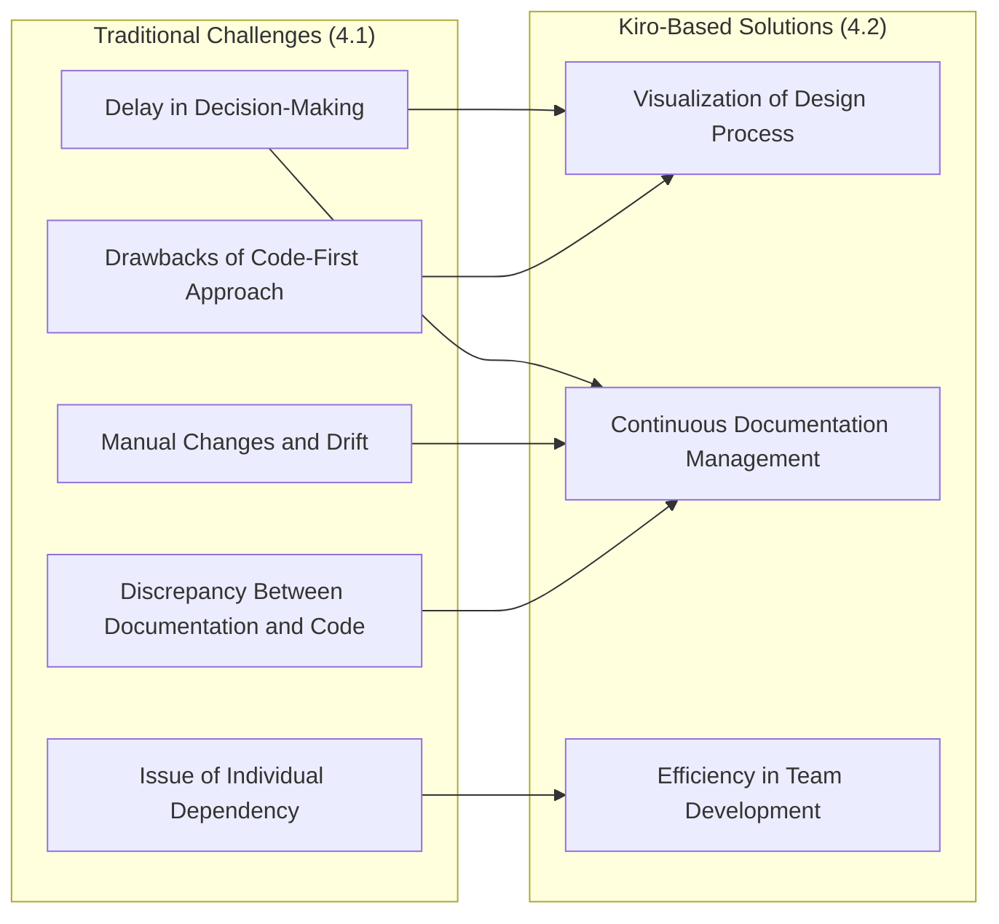
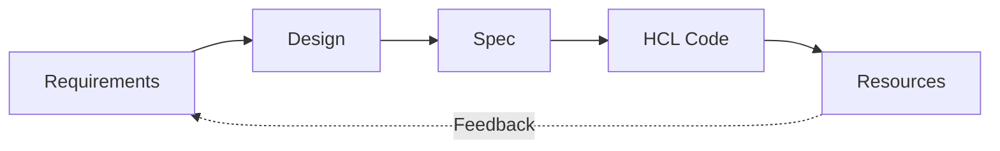

This article is Day 8 of the Summer Relay Series 2025.

## 1. Introduction
Are you able to accurately grasp the specifications of the infrastructure you use in your work?

For personal projects or small-scale systems, it is relatively easy to understand the overall picture of the infrastructure. However, as an organization’s systems grow larger, the number of platforms and products in use increases, and fewer people have a complete understanding of all specifications.

What’s important is not comprehending everything exhaustively, but accurately understanding the specifications of your area of responsibility and leveraging that knowledge for proper decision-making.

### Why it’s difficult to grasp infrastructure specifications
Why is it challenging to understand the specifications of infrastructure resources? There are various factors, but I believe the root cause is “information fragmentation and absence.”

- Documentation is scattered: design docs, operational procedures, and change logs are located in different places  
- Unrecorded specifications: resource requirements, constraints, and design rationale are not documented  
- Accumulated tacit knowledge: the intent behind configurations and their dependencies exist only in people’s memories and are lost when they leave

### Resulting challenges and their impact
These issues lead to the following challenges in DevOps:

- Inability to predict the scope of impact when making changes  
- Time-consuming root cause analysis during incident response  
- Difficulty maintaining a common understanding among stakeholders  
- Accumulation of technical debt and increased risk

As a result, decision-making is delayed, and the start of changes or improvements gets pushed back.

### Kiro as a solution
One solution gaining attention to address these challenges is **Kiro**. Although there are already many articles about Kiro in the context of software development, there are still few examples of its use from an infrastructure perspective.

In this article, we will explore using Kiro’s Spec mode to integrate specification-driven development into a Terraform workflow and consider the possibilities of document-driven IaC in DevOps.

## 2. Article Overview
### Target Audience
- Those with Terraform-based IaC experience  
- Developers and operators who want to strengthen IaC specification and documentation management  

### Prerequisites
- Kiro version: `0.2.13`  
- Basic knowledge of HCL/Terraform  
- Basic understanding of AWS resource provisioning  

### Out of Scope
- Basic syntax of Terraform and HCL  
- Internal AI model mechanisms of Kiro  
- Advanced Terraform module design  
- Detailed configuration methods for AWS services  

## 3. What is Kiro?

::: alert
The content of this article is based on the public preview version at the time of writing. Please refer to the official documentation for the latest information.
:::

[Kiro](https://kiro.dev/) is an AI agent–integrated IDE developed by AWS.  
Unlike traditional IDEs, its key feature is generating code through natural language interactions.

Immediately after its preview release, it moved to an invite-only waitlist, reflecting high interest.

For basic operations of Kiro, please refer to the [official Docs](https://kiro.dev/docs/) or the following article on our developer site:
- [KiroでAI開発革命!? アルバムアプリをゼロから作ってみた【その1:要件定義・設計・実装計画】](https://developer.mamezou-tech.com/blogs/2025/08/19/kiro-album-app-1/)

### 3.1 Basic Concepts of Kiro
Kiro structures the development process into three stages:

1. **Requirements**: Present what you want to build in natural language. Kiro automatically converts it to the EARS (Easy Approach to Requirements Syntax) format, and you define the requirements in that template.  
2. **Design**: Define the technical architecture to meet the requirements.  
3. **Spec**: Finalize the design as concrete implementation specifications.  

EARS is a template using six basic sentence structures to express requirements succinctly and consistently, reducing ambiguity. Details are outside this article’s scope, but see:
- [見える化する要求仕様 〜 EARS（Easy Approach to Requirements Syntax）を活用したシステム要求の書き方 〜](https://www.bgarage.co.jp/news/946/)

This staged approach supports a shift from “intuitive coding” influenced by personal or AI preferences to rigorous “specification-driven development.” You can also edit Requirements and Design directly to update the Spec.

### 3.2 Spec Mode’s Fit with IaC
Spec mode is especially well-suited for IaC because it organizes requirements and design as documents and directly transforms them into HCL code.

Key reasons for this compatibility:
- Infrastructure is designed based on clear requirements and constraints  
- Dependencies between resources must be explicit  
- You need to know the impact scope before making changes  
- Long-term DevOps-oriented design is required  

Moreover, you can view requirements and specifications in the prompt and document panels, iteratively refine them with the AI, and generate code in one seamless flow.

## 4. Challenges in Traditional IaC Development and Kiro’s Solutions

### 4.1 Issues in Traditional IaC Development
Many organizations use Terraform for IaC development, but often face these challenges:

Code-First Drawbacks
- Starting from code makes design intent ambiguous  
- Writing documentation later can’t capture original decision criteria  
- During code reviews, it’s unclear “why this architecture was chosen”

Discrepancy Between Documentation and Code
- Documentation (design and specs) and Terraform code are managed separately, updates lag behind code changes, causing divergence between decision history and implementation

Manual Changes and Drift
- Resources created manually outside IaC management  
- Responsibility and management of manually created resources are insufficient, leading to unnecessary resources (drift) persisting

Issue of Individual Dependency
- Configuration rationale and constraints depend on individuals’ memory  
- Knowledge is lost when people transfer or leave  
- New members take time to understand when joining

As a result, decision-making is delayed, and changes or improvements start late.

### 4.2 Benefits of Documentation with Kiro
In IaC, code alone often doesn’t reveal “why a spec or implementation is as it is.” Documenting in Kiro’s Spec mode offers these advantages:

Visualization of the Design Process (addresses Code-First)
- Records the thought process from requirements through design to implementation  
- Clarifies rationale and constraints for decisions  
- Preserves the exploration of alternative approaches

Continuous Documentation Management (addresses Discrepancy)
- Automatically retains change history and context  
- Simplifies review and maintenance  
- Enables pre–change awareness of impact scope

Team Development Efficiency (addresses Individual Dependency)
- Produces IaC specifications that are easy to share across teams  
- Builds a common understanding among stakeholders early  
- Improves the quality of code reviews  

### 4.3 Mapping Traditional Issues to Kiro Solutions
Here is how Kiro addresses traditional issues:


::: info
It is important to establish a traceability mechanism for requirements, design, and implementation. In Kiro’s case, traditional issues are resolved by consistently managing the three documents—Requirements, Design, and Spec—and maintaining alignment with the generated IaC code.
:::

## 5. Practice: Building a Scheduled Execution System with Lambda in Kiro

### 5.1 Organizing Requirements (Requirements)
First, organize requirements in natural language. For example, consider a periodic batch processing system:

```
[Context & Constraints]
- Platform: AWS
- IaC: Terraform (HCL)
- Using Terraform v1.13
- Using hashicorp/aws version 5.x

[Requirements]
- Automatically execute batch processing at a fixed time every day
- Perform data aggregation and organization in the batch processing
- If an error occurs during processing, send a notification via CloudWatch Alarm
- Implement serverlessly with cost efficiency
- Allow flexible modification of the schedule
- Make it possible to extend processing content in the future
```

↓ Kiro’s response after input


*Kiro’s response after entering simple requirements into the prompt. Confirm that the content is correct before moving on to the next phase.*

### 5.2 Detailing the Design (Design)
When you input the requirements into Kiro, you get the following design proposal. I additionally asked to include DevOps notes and write code comments in Japanese.

↓ Kiro’s response after input:
```
[Design] Simple Serverless Architecture
EventBridge Scheduler → Lambda → CloudWatch direct flow
Automatic execution at 9:00 AM daily (cron(0 9 * * ? *))
On error, CloudWatch Alarm → SNS → Email notification

[Main Components]
EventBridge Scheduler: Schedule management at 9:00 AM daily
Lambda Function: Executes the batch processing (timeout 5 minutes)
CloudWatch Logs: Log aggregation (retain for 30 days)
CloudWatch Alarms: Error monitoring and notification
SNS Topic: Email notifications
SQS Dead Letter Queue: Retry handling on failure

[Security]
Principle of Least Privilege: Lambda execution role (CloudWatch Logs write only), EventBridge Scheduler role (Lambda invocation only)
Resource Tags: Apply unified tags to all resources

[Operations & DevOps]
Terraform: Complete IaC management
Japanese Support: Write comments, descriptions, and error messages in Japanese
Monitoring: Monitor Lambda execution status and error rate
Cost Efficiency: Serverless billing only when needed
```

### 5.3 Finalizing Specs and Generating Code (Spec)
Once requirements and design are finalized, use Spec to generate code. Below is the HCL code generated by Kiro (excerpt). Some auxiliary resource definitions like IAM roles and SNS topics are omitted for brevity.

I provided additional instructions to refine minor details, but resources matching the requirements and design were created.

```hcl
terraform {
  required_version = ">= 1.13.0"
  required_providers {
    aws = {
      source  = "hashicorp/aws"
      version = "~> 5.0"
    }
  }
}

# Provider configuration with default tags
provider "aws" {
  region = "ap-northeast-1"

  default_tags {
    tags = {
      Project     = "batch-processing-system"
      Environment = "production"
      ManagedBy   = "Terraform"
    }
  }
}

# Lambda Function
resource "aws_lambda_function" "batch_processor" {
  filename         = "batch_processor.zip"
  function_name    = "daily-batch-processor"
  role             = aws_iam_role.lambda_role.arn
  handler          = "index.handler"
  runtime          = "python3.12"
  timeout          = 300
  description      = "Lambda function for daily batch processing"

  tags = {
    Name    = "daily-batch-processor"
    Purpose = "automated-batch-processing"
  }
}

# EventBridge Scheduler
resource "aws_scheduler_schedule" "batch_schedule" {
  name        = "daily-batch-schedule"
  group_name  = "default"
  description = "Schedule to run batch processing at 9:00 AM daily (JST)"

  flexible_time_window {
    mode = "OFF"
  }

  schedule_expression          = "cron(0 9 * * ? *)"
  schedule_expression_timezone = "Asia/Tokyo"

  target {
    arn      = aws_lambda_function.batch_processor.arn
    role_arn = aws_iam_role.scheduler_role.arn
  }
}

# Allow the scheduler to invoke the Lambda function
resource "aws_lambda_permission" "allow_scheduler" {
  statement_id  = "AllowExecutionFromScheduler"
  action        = "lambda:InvokeFunction"
  function_name = aws_lambda_function.batch_processor.function_name
  principal     = "scheduler.amazonaws.com"
  source_arn    = aws_scheduler_schedule.batch_schedule.arn
}

# CloudWatch Alarm to monitor Lambda function errors
resource "aws_cloudwatch_metric_alarm" "lambda_error_alarm" {
  alarm_name          = "lambda-batch-processor-errors"
  comparison_operator = "GreaterThanThreshold"
  evaluation_periods  = 1
  metric_name         = "Errors"
  namespace           = "AWS/Lambda"
  period              = 300
  statistic           = "Sum"
  threshold           = 0
  alarm_description   = "Alarm to monitor errors of the batch processing Lambda function"
  alarm_actions       = [aws_sns_topic.alerts.arn]

  dimensions = {
    FunctionName = aws_lambda_function.batch_processor.function_name
  }

  tags = {
    Name    = "lambda-error-alarm"
    Purpose = "error-monitoring"
  }
}
```

### 5.4 A Consistent Flow from Documentation to Code
This process achieves a consistent flow of Documentation → HCL → Infrastructure.

1. **Define Requirements**: Describe business requirements in natural language  
2. **Design Discussion**: Determine the architecture by aligning technical constraints with requirements  
3. **Finalize Specs**: Confirm specifications including implementation-level details  
4. **Generate Code**: Output HCL code  
5. **Provision Infrastructure**: Run Terraform plan/apply  

### 5.5 Reusing Requirements and Design to Create Similar Resources
We confirmed that by leveraging the Requirements/Design/Spec established in sections 5.1–5.3, creating similar resources becomes easy.

For example, to add a weekly batch process, we duplicated the existing Spec and gave Kiro this simple instruction:

```
Based on the existing daily batch processing specification, create a weekly batch process with the following differences:
- Schedule: 10:00 AM every Sunday
- Resource name: weekly-batch-processor
- Processing content: weekly report generation
```

Kiro understood the existing design patterns, consistently applied naming conventions, tags, IAM permissions, and generated new HCL code.

Thus, once Requirements/Design/Spec are established, creation of similar resources is greatly streamlined.

## 6. Compatibility of Documentation and HCL

### 6.1 Characteristics of HCL and Documentation
HCL is highly abstract and explicitly describes components and dependencies. This is highly compatible with specification documentation.

Declarative Syntax  
HCL declaratively describes “what to create,” which is fundamentally the same as writing requirements or design documents.

```hcl
# Design doc: "Automatically execute batch processing at a fixed time every day"
resource "aws_scheduler_schedule" "batch_schedule" {
  name                = "daily-batch-schedule"
  description         = "Schedule to run batch processing at 9:00 AM daily"
  schedule_expression = "cron(0 9 * * ? *)"
}
```

Clear Correspondence of Components  
- Components written in documentation map directly to HCL resources or modules  
- Variables and requirements defined in the spec expand into variables and outputs  
- Dependencies are explicitly represented in the code  

### 6.2 Realizing Specification-Driven Development
With Kiro, you can achieve specification-driven development as follows:

:::: info
General definition of traceability:  
- The property that allows bidirectional tracing of relationships among artifacts such as requirements, design, implementation, and testing
::::

**Visualization of Traceability**  
Kiro records the entire flow from requirements to actual resources, enabling bidirectional tracing.



**Improved Change Management**  
- When specifications change, review from the requirements level  
- Identify impact scope during the design stage  
- Validate code changes against the specifications  

Keeping specifications ensures that HCL code never becomes ambiguous. Consequently, the fact that “code is derived from specifications” is guaranteed, preventing divergence between design and implementation.

## 7. Future Outlook

**Evolution of AI-Coordinated Development**  
AI agent–integrated IDEs like Kiro are expected to evolve further.  
- Proposals of more advanced design patterns  
- Learning from past implementation examples  
- Real-time optimization suggestions  

**Transformation of IaC Development Culture**  
The spread of specification-driven development could change the culture of infrastructure development itself.  
- A design culture that emphasizes the “why”  
- Document-first development style  
- Continuous improvement–focused DevOps  

The shift from “intuitive coding” to “specification-driven development” in infrastructure offers value beyond tool adoption. By improving organizational infrastructure management capabilities and reducing technical debt, let’s drive more stable DevOps practices.

## 8. Conclusion
Using Kiro’s Spec mode brings the following new values to HCL-based IaC management:

**Technical Value**  
- Highly consistent configuration management rooted in documentation  
- Seamless development experience generating code directly from documentation  
- Prevention of design-implementation divergence through high compatibility between documentation and HCL  

**Organizational Value**  
- Promotion of knowledge sharing and accumulation within the team  
- Continuous reinforcement of common understanding among stakeholders  
- Reduction of costs associated with long-term DevOps promotion and maintenance  

**Cultural Value**  
- Establishment of a culture of organizing specifications before writing code  
- Explicit documentation of the background and rationale of design decisions  
- Development process premised on continuous improvement  

Even those familiar with Terraform can naturally adopt a “document-first” culture by integrating Kiro. This enhances both long-term DevOps practice ease and team productivity, increasing the sustainability of IaC-oriented DevOps.

Again, what I consider most important is shifting from “intuitive coding” influenced by personal or AI preferences to “specification-driven development.” This principle applies not only to infrastructure but also to software in general. With this in mind, I look forward to advancing improvement activities through DevOps in the AI era that lies ahead.
