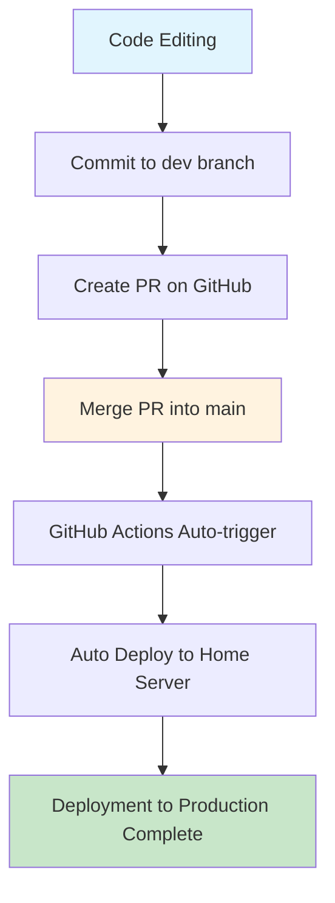
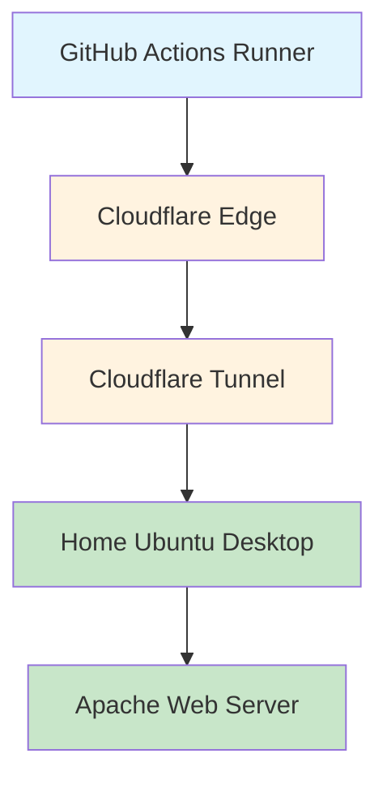
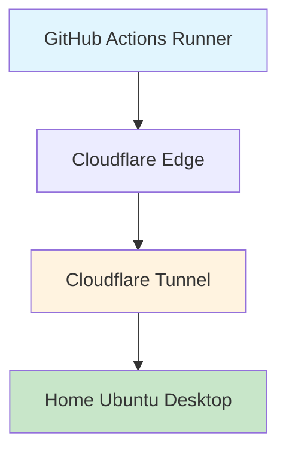
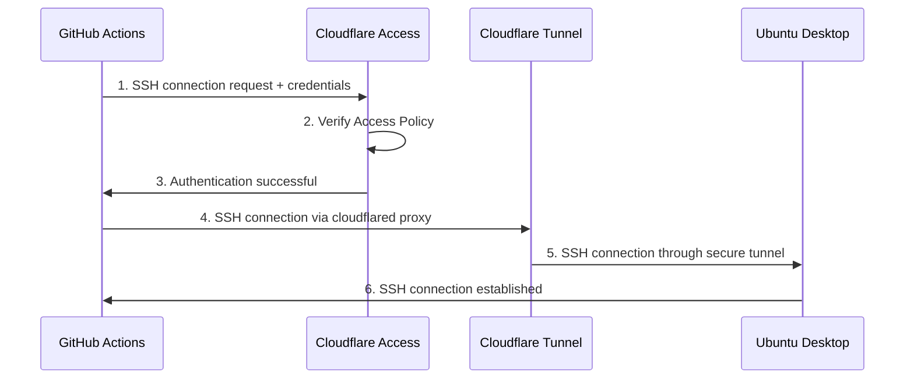
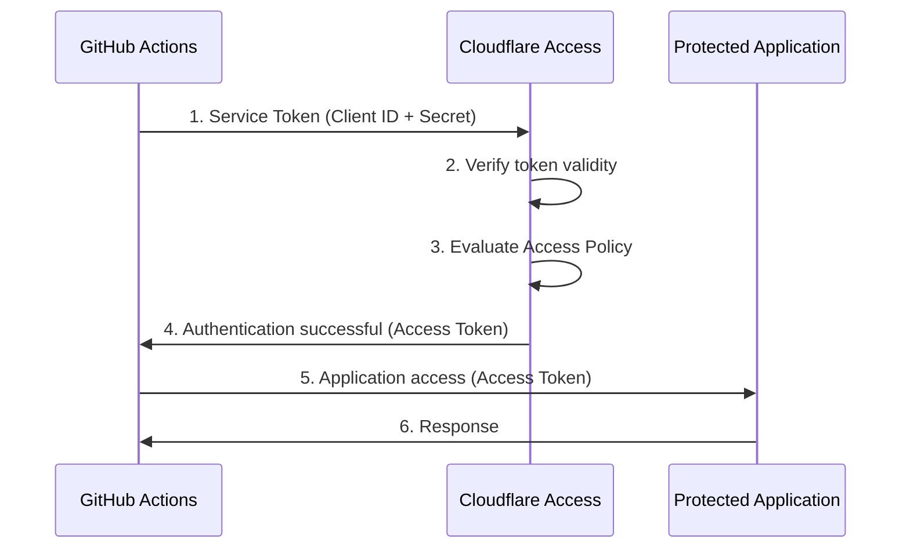
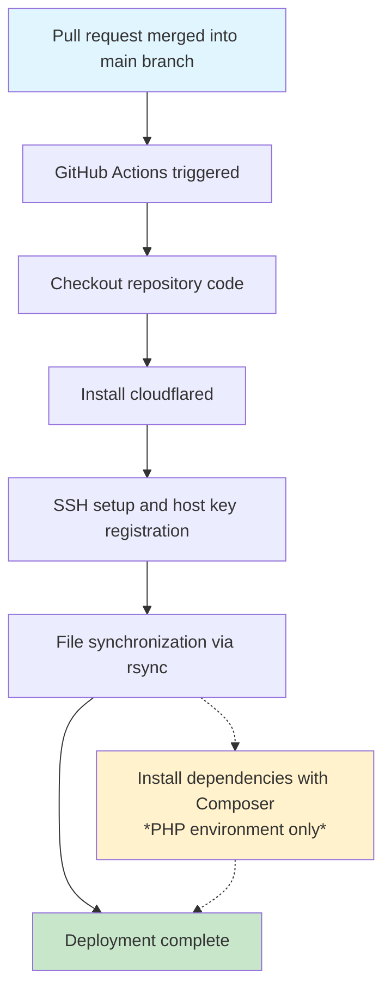
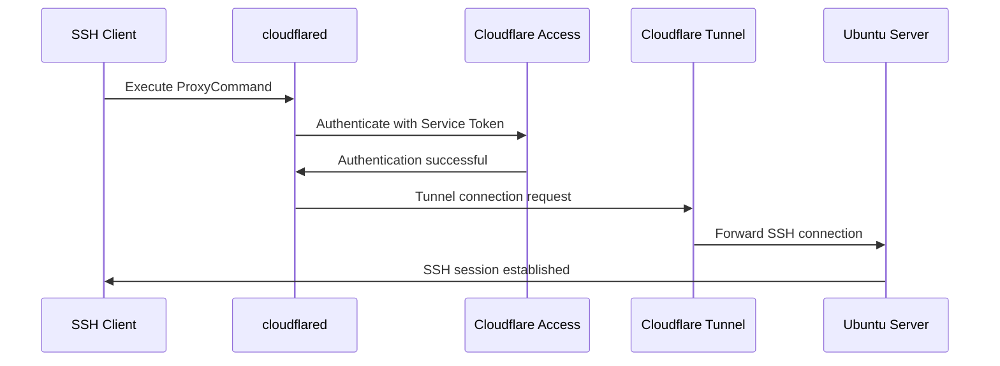

## Introduction

Recently, I purchased a notebook PC for Ubuntu Desktop because I wanted to try hosting a web application at home.

Right after buying it, I installed the Apache Web Server, edited `/var/www/html/index.html` directly, and accessed it from a browser. Seeing it display exactly as expected, I remember thinking, “This is fun!”

However, this setup has a problem. **If you publish this page externally, any edits you make will instantly be reflected in production.** In other words, unfinished code and test data might be visible to visitors.

*“I want to separate my development environment from production…!”*

So I created a separate development directory apart from Apache’s public directory and continued development there. At the same time, I introduced version control with Git/GitHub and adopted a common workflow of pull requests from `dev` to `main`, followed by merges.

However, a new issue arose. With this workflow, every time development was complete, I had to **manually copy & paste from the development directory to the public directory**. I merged the pull request on GitHub, updated my local `main` branch, and then manually copied files from the development directory to the public directory. Needless to say, this was tedious.

*“I want the updates to automatically reflect in the Apache public directory when I merge a pull request…!”*

To automate this tedious manual work, I decided to build a CD pipeline using GitHub Actions.

In this article, I will explain my experience building a continuous deployment (CD) pipeline from GitHub Actions to an Ubuntu Desktop on my home LAN, including the specific configuration steps.

## Pipeline to Build

The CD pipeline we will build in this article operates as follows.

### Realized Operation Flow



<br>

The manual “copy & paste from the development directory to the public directory” is now fully automated, triggered by the merging of a pull request.

<br>

### System Architecture



<br>

| Component            | Role                                                                      |
|----------------------|---------------------------------------------------------------------------|
| **GitHub Actions**   | Executes the deployment workflow triggered by a merge                     |
| **Cloudflare Tunnel**| Provides a secure communication channel without exposing the home IP      |
| **Cloudflare Access**| Implements automatic authentication via Service Token                     |
| **SSH + rsync**      | Efficiently synchronizes only the changed files                           |

<br>

### What You Can Do After Completion

- ✅ Automatic deployment to production just by merging a pull request  
- ✅ Operate securely without exposing your home public IP address  
- ✅ Deployment history automatically recorded in GitHub Actions logs  
- ✅ Complete freedom from manual deployment tasks  

## Prerequisites for This Article

This article is intended for those who have the following knowledge and environment.

### Required Knowledge

- **Basic GitHub Actions**: How to write workflow files and use basic actions  
- **Basic Linux operations**: Command-line operations, file permissions, SSH connection concepts  
- **Basic Apache Web Server**: The concept of DocumentRoot and basic configuration  
- **Basic Git**: Concepts of branches, pull requests, and merges  

### Required Environment

- **GitHub repository**: Can be private or public  
- **Ubuntu Desktop environment**: This article assumes Ubuntu 24.04.3 LTS  
- **Apache Web Server**: Installed and configured  
- **Cloudflare account**: Using Cloudflare Zero Trust  
- **Custom domain**: A domain whose name servers are set to Cloudflare  

## Necessary Technical Concepts and Knowledge

Before building the pipeline, let's organize the related technical concepts.

### GitHub Actions Workflows

GitHub Actions is a platform for running CI/CD pipelines within a GitHub repository.

@[og](https://docs.github.com/ja/actions/get-started/understand-github-actions)

#### Important Concepts

- **Workflow**: The process that runs one or more jobs defined in a YAML file in `.github/workflows/`  
- **Event**: A specific activity in the repository (e.g., merging a pull request) that triggers a workflow  
- **Job**: A series of steps executed on the same runner within a workflow  
- **Action**: A component that performs a specific task within a workflow (provided by GitHub Actions or custom)  
- **Runner**: The virtual environment that runs workflows. Each runner can run one job at a time. (We will use `ubuntu-latest`)

---

### SSH Connectivity and Security

#### Basics of SSH (Secure Shell)

SSH is a protocol that uses an encrypted channel to securely connect to a remote server.

#### Host Authentication

On the SSH client side, verify that the destination is a genuine SSH server.

##### Host Authentication Mechanism

An SSH server has a unique secret/public key pair called a host key configured. On the SSH client side, this public key is stored in the `~/.ssh/known_hosts` file.

On the first connection, add the SSH server's host key (public key) to the SSH client's `~/.ssh/known_hosts` file. On subsequent connections, SSH compares the host key (public key) registered in this file with the server’s host key (private key) to verify the server’s authenticity.

#### User Authentication

On the SSH server side, verify that the connecting SSH client user is genuine.

##### User Authentication Mechanism

Use public key authentication. A rough overview is as follows:

1. The SSH server keeps the public keys of authorized SSH clients in the `~/.ssh/authorized_keys` file.  
2. The SSH client uses its private key to generate a signature.  
3. The SSH server uses the SSH client's public key to verify the signature.  
4. If the signature is verified, the SSH server grants the connection as the SSH client user.

@[og](https://qiita.com/whoami_priv/items/9f165f8dfd95edb169b7)  
@[og](https://qiita.com/pyon_kiti_jp/items/f89b8fa9f5b7f8abac23)

::: info
**Components in SSH Connection This Time**

- **SSH client**: The GitHub Actions runner environment (`ubuntu-latest`)  
- **SSH server**: Your home Ubuntu Desktop  

**Why this arrangement?**

GitHub Actions workflows run in GitHub’s cloud environment. Therefore, to deploy files from the cloud environment to an external server (your home Ubuntu Desktop), the GitHub Actions runner must initiate an SSH connection to the home server. In other words, the connection direction is “cloud → home,” where the GitHub Actions runner is the initiator (client) and the home Ubuntu Desktop is the receiver (server).
:::

---

### Cloudflare Tunnel

#### What is Cloudflare Tunnel

Cloudflare Tunnel is a service that allows you to safely expose a local server to the internet without publishing a public IP address.

@[og](https://developers.cloudflare.com/cloudflare-one/networks/connectors/cloudflare-tunnel/)  
@[og](https://qiita.com/keke21/items/efaa2b2c35dfb646a43e)

<br>

#### Difference from Traditional Home Server Exposure Methods

**Traditional Method (Port Forwarding):**

```text
Internet → Router (port 22 open) → Home Ubuntu Desktop
                    ↑ Security risk
```

- ❌️ Requires opening the SSH port (22) on the router  
- ❌ Public IP address is directly exposed  
- ❌ More vulnerable to DDoS and brute-force attacks  
- ❌ Potential for your home IP address to be identified  

**Using Cloudflare Tunnel:**

```text
GitHub Actions → Cloudflare Edge → Cloudflare Tunnel → Home Ubuntu Desktop
                                       ↑
                               Encrypted tunnel
```

- ✅️ No need to open ports on the router  
- ✅️ Hides your public IP address  
- ✅️ Leverages Cloudflare’s security features  
- ✅️ Traffic is filtered through Cloudflare’s edge  

#### Role in This Architecture



- **On the Home Ubuntu Desktop side**: The `cloudflared` daemon maintains a connection to Cloudflare  
- **On the GitHub Actions side**: Connects via proxy using the `cloudflared access ssh` command  
- **Cloudflare**: Provides a secure tunnel between both ends  

#### Security Benefits

- **IP Concealment**: Your home public IP address is not exposed  
- **DDoS Protection**: Utilizes Cloudflare’s security infrastructure  
- **Access Control**: Fine-grained control via Cloudflare Access  

---

### Cloudflare Access

#### What is Cloudflare Access

Cloudflare Access is Cloudflare’s security service that enables Zero Trust Network Access (ZTNA). It provides application-level authentication and authorization as an alternative to traditional VPNs.

#### Concept of Zero Trust Network Access (ZTNA)

@[og](https://www.cloudflare.com/ja-jp/learning/access-management/what-is-ztna/)

**Traditional Perimeter Security Model:**

```text
External (untrusted) | Firewall | Internal (trusted)
```

- A perimeter is established between the corporate network and the internet, blocking external threats with a firewall  
- Assumes that the internal network is trustworthy  
- If breached, lateral movement risk exists  

**Zero Trust Approach:**

```text
Verify all access → Authenticate → Authorize → Grant access
```

- “Never trust, always verify”  
- Authenticate and authorize every connection regardless of network location  

#### Role of Cloudflare Access in This Architecture



#### Security Benefits

- **Fine-grained access control**: Detailed permissions per resource and user  
- **Audit logs**: All access attempts are recorded  
- **MFA support**: Multi-factor authentication enforcement (for human users)  
- **Real-time control**: Policy changes take effect immediately  
- **Session management**: Detailed management and monitoring of connection sessions  

#### Differences from Traditional VPN

| Category                    | Traditional VPN            | Cloudflare Access      |
|-----------------------------|----------------------------|------------------------|
| **Scope of connection**     | Entire network             | Application-level      |
| **Authentication**          | At connection time only    | Verified per access    |
| **Configuration complexity**| Complex                    | Relatively simple      |
| **Scalability**             | Limited                    | High                   |
| **Audit logs**              | Limited                    | Detailed               |

<br>

#### Automated Authentication via Service Token

##### What is a Service Token

A Service Token is an authentication mechanism for automated systems and machine-to-machine communication. Unlike interactive authentication for human users (OAuth, SAML, etc.), it enables fully programmatic access.

**Difference from traditional user authentication:**

| Item                      | User Authentication (OAuth/SAML) | Service Token                        |
|---------------------------|----------------------------------|--------------------------------------|
| **Target**                | Human users                      | Automation systems/applications      |
| **Authentication flow**   | Browser-based and interactive    | API-based and programmatic           |
| **Credentials**           | Username, password, MFA          | Client ID, Client Secret             |
| **Validity**              | Session-based (a few hours)      | Long-lived                           |

<br>

##### Role in GitHub Actions

###### 1. Enabling Automated SSH Connections

In GitHub Actions workflows, Service Tokens are indispensable because human-interactive authentication is not possible.

```text
GitHub Actions Runner → Service Token authentication → Cloudflare Access → SSH connection
```

###### 2. Why It’s Ideal for CD Pipelines

- **Unattended execution**: Can run 24/7 without human intervention  
- **Scalability**: Can be used concurrently by multiple workflows  
- **Reliability**: No concerns about session expiration or timeouts  
- **Security**: Securely managed in GitHub Secrets  

###### 3. Security Benefits in Automated Workflows

- **Principle of least privilege**: Access restricted to specific applications  
- **Auditability**: All access is logged  
- **Centralized management**: Centralized management in the Cloudflare dashboard  

##### Concept of the Authentication Flow

**Service Token authentication process:**



**Verification process by Cloudflare Access:**

1. **Token validity check**: Verify the provided Client ID and Secret  
2. **Policy evaluation**: Check the conditions of the relevant Access Policy  
3. **Access approval decision**: Grant access only if all conditions are met  
4. **Audit log recording**: Detailed logs of authentication attempts and outcomes  

This Service Token authentication mechanism enables a fully automated CD pipeline without compromising security.

---

## Overview of the Completed Pipeline

First, let's look at the overall architecture of the final CD pipeline.

### Full Content of deploy.yml File

```yaml
name: Deploy to Server

on:
  pull_request:
    types: [closed]
    branches:
      - main

jobs:
  deploy:
    runs-on: ubuntu-latest

    if: github.event.pull_request.merged == true

    env:
      REMOTE_HOST: ssh.your-domain.com
      REMOTE_USER: deploy-user
      REMOTE_DIR: /var/www/html
      SSH_PROXY_COMMAND: /tmp/cloudflared/cloudflared access ssh --id ${{ secrets.CLOUDFLARED_SSH_ID }} --secret ${{ secrets.CLOUDFLARED_SSH_SECRET }} --hostname %h

    steps:
      - name: Install cloudflared
        run: |
          latest_version=$(curl -s $GITHUB_API_URL/repos/cloudflare/cloudflared/releases/latest | jq -r '.tag_name')
          mkdir -p /tmp/cloudflared
          curl -sL -o /tmp/cloudflared/cloudflared $GITHUB_SERVER_URL/cloudflare/cloudflared/releases/download/$latest_version/cloudflared-linux-amd64
          chmod +x /tmp/cloudflared/cloudflared
          /tmp/cloudflared/cloudflared --version

      - name: Prepare .ssh/known_hosts from secrets
        run: |
          mkdir -p $HOME/.ssh
          chmod 700 $HOME/.ssh
          echo "${{ secrets.SSH_KNOWN_HOSTS }}" > $HOME/.ssh/known_hosts
          chmod 644 $HOME/.ssh/known_hosts

      - name: Set up SSH key
        run: |
          SSH_KEY_PATH=$HOME/.ssh/id_ed25519_github_actions
          echo "${{ secrets.SSH_PRIVATE_KEY }}" > "$SSH_KEY_PATH"
          chmod 600 "$SSH_KEY_PATH"

      - name: Checkout repository
        uses: actions/checkout@v4

      - name: Deploy application via rsync
        run: |
          SSH_KEY_PATH=$HOME/.ssh/id_ed25519_github_actions
          rsync -rvz --no-group --no-perms --omit-dir-times \
            -e "ssh -i \"$SSH_KEY_PATH\" -o StrictHostKeyChecking=yes -o ProxyCommand='$SSH_PROXY_COMMAND'" \
            --include='public/***' \
            --include='src/***' \
            --include='views/***' \
            --include='composer.json' \
            --include='composer.lock' \
            --exclude='*' \
            ./ \
            $REMOTE_USER@$REMOTE_HOST:$REMOTE_DIR/

      - name: Run composer install on remote
        run: |
          echo "Installing composer dependencies..."
          SSH_KEY_PATH=$HOME/.ssh/id_ed25519_github_actions
          ssh -i "$SSH_KEY_PATH" \
            -o StrictHostKeyChecking=yes \
            -o ProxyCommand="$SSH_PROXY_COMMAND" \
            $REMOTE_USER@$REMOTE_HOST "
              set -euo pipefail
              cd \"$REMOTE_DIR\"
              if command -v composer >/dev/null 2>&1; then
                COMPOSER_NO_INTERACTION=1 \
                composer install \
                  --no-dev \
                  --prefer-dist \
                  --no-interaction \
                  --no-progress \
                  --optimize-autoloader
                if sudo -n true 2>/dev/null; then
                  sudo chown -R www-data:www-data vendor
                  sudo chmod -R 755 vendor
                else
                  echo '⚠️ Skipped changing ownership/permissions of vendor due to lack of sudo privileges'
                fi
                echo '✅ Composer install completed.'
              else
                echo '❌ composer not found on remote host.'
                exit 1
              fi
            "
```

---

### Pipeline Operation Flow



---

### Details of Each Step

#### 1. Trigger Conditions

```yaml
on:
  pull_request:
    types: [closed]
    branches: [main]
```

- Executes when a pull request to the main branch is closed  
- Processes only when `github.event.pull_request.merged == true` (i.e., when merged)  

#### 2. Installing cloudflared

```bash
latest_version=$(curl -s $GITHUB_API_URL/repos/cloudflare/cloudflared/releases/latest | jq -r '.tag_name')
mkdir -p /tmp/cloudflared
curl -sL -o /tmp/cloudflared/cloudflared $GITHUB_SERVER_URL/cloudflare/cloudflared/releases/download/$latest_version/cloudflared-linux-amd64
chmod +x /tmp/cloudflared/cloudflared
/tmp/cloudflared/cloudflared --version
```

- Dynamically retrieve the latest version from the GitHub API  

#### 3. Pre-registering the Host Key for SSH Connections

```bash
mkdir -p $HOME/.ssh
chmod 700 $HOME/.ssh
echo "${{ secrets.SSH_KNOWN_HOSTS }}" > $HOME/.ssh/known_hosts
chmod 644 $HOME/.ssh/known_hosts
```

- Establish a secure SSH connection using the pre-registered host key  

::: alert
**Security-focused Design Decision**

When performing SSH connections in an automated system, you can simplify configuration by using the `StrictHostKeyChecking=no` option to skip host verification on the first connection.

```bash
# Simple but insecure approach
ssh -o StrictHostKeyChecking=no user@hostname "command"
```

**However, this approach carries the following security risks:**

- ❌️ **Risk of man-in-the-middle (MITM) attacks**: A malicious server can impersonate the legitimate server  
- ❌️ **Cannot verify the authenticity of the destination**: No guarantee you're connecting to the intended correct server  
- ❌️ **Compromised security policy**: Disables fundamental security checks for automation  

**Benefits of pre-registering the host key:**

```bash
# Secure approach
echo "${{ secrets.SSH_KNOWN_HOSTS }}" > ~/.ssh/known_hosts
ssh -o StrictHostKeyChecking=yes user@hostname "command"  # default behavior
```

- ✅️ **Verify the destination**: Ensure the destination by matching against the pre-registered legitimate host key  
- ✅️ **Prevent MITM attacks**: Automatically reject connections to unauthorized servers  
- ✅️ **Combine automation and security**: Achieve secure connections without human intervention  
- ✅️ **Audit compliance**: Build an automated system that meets security standards  

In this pipeline, we **prioritize security over the convenience of automation**, knowingly taking on the overhead of acquiring and managing host keys in advance to adopt a more secure approach.
:::

@[og](https://io.cyberdefense.jp/entry/dangerous_ssh_sftp_usage/)

<br>

#### 4. Checkout Source Code

```yaml
- name: Checkout repository
  uses: actions/checkout@v4
```

- **actions/checkout@v4**: Use GitHub Actions' official action to retrieve the repository source code  
- **Preparing files for deployment**: Place the latest merged code in the runner environment before rsync transfer  

#### 5. File Synchronization

```bash
SSH_KEY_PATH=$HOME/.ssh/id_ed25519_github_actions
rsync -rvz --no-group --no-perms --omit-dir-times \
  -e "ssh -i \"$SSH_KEY_PATH\" -o StrictHostKeyChecking=yes -o ProxyCommand='$SSH_PROXY_COMMAND'" \
  --include='public/***' \
  --include='src/***' \
  --include='views/***' \
  --include='composer.json' \
  --include='composer.lock' \
  --exclude='*' \
  ./ \
  $REMOTE_USER@$REMOTE_HOST:$REMOTE_DIR/
```

<br>

##### Detailed Explanation of the rsync Command

- **SSH_KEY_PATH variable**: Makes the path to the SSH private key a variable to improve readability and maintainability  
- **ed25519 key type**: Uses a faster and more secure elliptic-curve encryption compared to RSA  
- **Dedicated GitHub Actions key**: A clear key name dedicated to deployment  

##### Explanation of rsync Options

```bash
rsync -rvz --no-group --no-perms --omit-dir-times
```

| Option             | Description                     | Reason                                             |
|--------------------|---------------------------------|----------------------------------------------------|
| `-r`               | **Recursive copy**              | Transfers all files while preserving directory structure |
| `-v`               | **Verbose output**              | Allows checking transfer status in logs            |
| `-z`               | **Compression**                 | Efficiently uses network bandwidth                 |
| `--no-group`       | **Skip group changes**          | Avoid permission errors                            |
| `--no-perms`       | **Skip permission changes**     | Preserve existing server permissions               |
| `--omit-dir-times` | **Omit directory times**        | Prevent timestamp-related errors                   |

@[og](https://log.dot-co.co.jp/rsync/)

<br>

##### SSH Connection Settings

```bash
-e "ssh -i \"$SSH_KEY_PATH\" -o StrictHostKeyChecking=yes -o ProxyCommand='$SSH_PROXY_COMMAND'"
```

- **`-e` flag**: Explicitly specifies the SSH command that rsync uses  
- **`-i "$SSH_KEY_PATH"`**: Use the specified private key file for user authentication  
- **`StrictHostKeyChecking=yes`**: Enforce host key verification (ensures security)  
- **`ProxyCommand='$SSH_PROXY_COMMAND'`**: Establish SSH connection via Cloudflare Access  

<br>

##### Details of SSH_PROXY_COMMAND

```bash
SSH_PROXY_COMMAND: /tmp/cloudflared/cloudflared access ssh --id ${{ secrets.CLOUDFLARED_SSH_ID }} --secret ${{ secrets.CLOUDFLARED_SSH_SECRET }} --hostname %h
```

| Parameter                                  | Description                     | Role                                                      |
|--------------------------------------------|---------------------------------|-----------------------------------------------------------|
| `/tmp/cloudflared/cloudflared`             | **Path to the cloudflared binary** | Executable for cloudflared installed earlier             |
| `access ssh`                               | **SSH access mode**             | Specifies SSH connection via Cloudflare Access            |
| `--id ${{ secrets.CLOUDFLARED_SSH_ID }}`   | **Service Token ID**            | Client ID used for authentication in Cloudflare Access    |
| `--secret ${{ secrets.CLOUDFLARED_SSH_SECRET }}` | **Service Token Secret**     | Client secret for the Service Token (managed in GitHub Secrets) |
| `--hostname %h`                            | **Dynamic hostname**            | Dynamically retrieves the hostname for SSH connection (`%h` is an SSH placeholder) |

<br>

Why is this command necessary?

The GitHub Actions runner (SSH client) cannot interactively log in via a browser to enter ID/password or MFA like a human. To pass through the Cloudflare Access gateway, a programmatic authentication mechanism is required.

Role of this command:

This command functions as a ProxyCommand that automatically performs Cloudflare Access authentication before the SSH connection, providing the necessary credentials. Specifically, it uses a Service Token to pass Cloudflare Access authentication and establishes an SSH connection to the home server via Cloudflare Tunnel.

##### Workflow of the SSH ProxyCommand



This ProxyCommand enables the GitHub Actions runner (SSH client) to authenticate via Cloudflare Access and connect securely to the home server (SSH server) through the tunnel.

<br>

##### File Selection Logic

Include patterns:

```bash
--include='public/***'      # Public web files
--include='src/***'         # Application source code
--include='views/***'       # Template files
--include='composer.json'   # PHP dependency definition
--include='composer.lock'   # Dependency lock file
```

Exclude patterns:

```bash
--exclude='*'              # Exclude everything by default
```

Advantages of selective synchronization:

- **Security**: Prevent transfer of sensitive files (e.g., `.env`, `.git`, etc.)  
- **Efficiency**: Exclude unnecessary files (e.g., `node_modules`, `vendor`) for faster transfer  
- **Safety**: Control files that could affect the production environment  

<br>

###### Source and Destination Specification

```bash
./ $REMOTE_USER@$REMOTE_HOST:$REMOTE_DIR/
```

- **`./`**: Current directory (root of the checked-out repository)  
- **`$REMOTE_USER`**: Remote server username (e.g., `deploy-user`)  
- **`$REMOTE_HOST`**: Destination hostname (e.g., `ssh.your-domain.com`)  
- **`$REMOTE_DIR`**: Deployment directory (e.g., `/var/www/html`)  

This configuration achieves **secure, efficient, and controlled file synchronization** from GitHub Actions to your home server via Cloudflare Access.

With these four basic steps, you can achieve secure file synchronization from GitHub Actions to your home server via Cloudflare Access.

---

## Detailed Setup Steps

Here are the detailed steps to actually build the same environment.

### 1. Cloudflare Configuration

**References**

[Cloudflare login](https://dash.cloudflare.com/login)  
@[og](https://developers.cloudflare.com/cloudflare-one/networks/connectors/cloudflare-tunnel/get-started/create-remote-tunnel/)  
@[og](https://zenn.dev/z4ck_key/articles/github-actions-to-cloudflare-tunnnel)  
@[og](https://zenn.dev/greendrop/articles/2024-04-25-aacf4debe469e8)  
@[og](https://dev.classmethod.jp/articles/use-service-tokens-to-authenticate-cloudflare-access-from-my-application/)  
@[og](https://zenn.dev/takajun/articles/fbd783e459c722)

<br>

#### 1.1 Creating a Cloudflare Tunnel

1. Navigate to `Zero Trust` > `Network` > `Tunnels`  
2. Click `Create a tunnel`

  


3. Click `Cloudflared`  
4. Enter a tunnel name  
5. Click `Save tunnel`

  


6. Copy the displayed installation command


7. Fill in the following items and click `Complete setup`

| Field       | Description               |
|-------------|---------------------------|
| `Subdomain` | (Optional) `ssh`          |
| `Domain`    | Your registered custom domain |
| `Type`      | `SSH`                     |
| `URL`       | `localhost:22`            |


#### 1.3 Configuring Cloudflare Access

##### 1.3.1 Creating a Service Token

1. Navigate to `Zero Trust` > `Access` > `Service Authentication`  
2. Click `Create a service token`


3. Enter the following items and click `Create token`

| Field                   | Description                     |
|-------------------------|---------------------------------|
| `Service Token Name`    | Name of the service token       |
| `Token Validity Period` | Choose as desired               |


4. Copy the `Client ID` and `Client Secret` of the created service token (to be set in GitHub Secrets later)  
5. Click `Save`


<br>

##### 1.3.2 Creating a Policy

1. Navigate to `Zero Trust` > `Access` > `Policies`  
2. Click `Add a policy`


3. Enter the following items and click `Save`

| Field            | Description                                                |
|------------------|------------------------------------------------------------|
| `Policy Name`    | Any name                                                   |
| `Action`         | `Service Auth`                                             |
| `Session Duration` | Choose as desired                                       |
| `Selector`       | `Service Auth`                                             |
| `Value`          | The service token created in [1.3.1 Creating a Service Token] |


<br>

##### 1.3.3 Creating an Application

1. Navigate to `Zero Trust` > `Access` > `Applications`  
2. Click `Add an application`  
3. Click `Self-hosted`  
4. Enter the following items:

| Field             | Description                      |
|-------------------|----------------------------------|
| `Application Name`| Any name                         |
| `Session Duration`| Choose as desired                |
| `Subdomain`       | (Optional) `ssh`                 |
| `Domain`          | Your registered custom domain    |

> The `Public Hostname` input field appears after clicking `Add public hostname`.

5. Click `Select existing policy` and choose the policy created in [1.3.2 Creating a Policy]  
6. Click `Next`  
7. Leave the Experience Settings and Advanced Settings at their defaults, adjust as needed for your environment, then click `Next`/`Save`

---

### 2. Configuration on the Ubuntu Desktop

#### 2.1 Installing and Configuring the SSH Server

```bash
# Install OpenSSH Server
sudo apt update
sudo apt install openssh-server

# Edit SSH configuration
sudo nano /etc/ssh/sshd_config
```

Configuration items:

```bash
# Disable password authentication
PasswordAuthentication no

# Enable public key authentication
PubkeyAuthentication yes

# Disable root login
PermitRootLogin no

# Prohibit login for accounts with empty passwords
PermitEmptyPasswords no

# Maximum authentication attempts
MaxAuthTries 6

# Specify host keys
HostKey /etc/ssh/ssh_host_rsa_key
HostKey /etc/ssh/ssh_host_ecdsa_key
HostKey /etc/ssh/ssh_host_ed25519_key
```

Restart after configuration:

```bash
sudo systemctl restart ssh.socket
sudo systemctl enable ssh.socket
```

<br>

#### 2.2 Firewall Configuration

```bash
# Enable firewall
sudo ufw enable
# Deny incoming by default
sudo ufw default deny incoming
# Allow outgoing by default
sudo ufw default allow outgoing
# Allow SSH port
sudo ufw allow ssh
# Prevent SSH brute-force attacks
sudo ufw limit ssh
# Check firewall status
sudo ufw status
```

[Guide to Secure SSH Server Setup and Operation (Ubuntu)](https://www.kkaneko.jp/tools/server/pubkey.html)

<br>

#### 2.3 Creating a Deployment User

```bash
# Create a user dedicated for deployment
sudo adduser deploy-user

# Create directory for storing public keys for the deploy user
sudo mkdir -p /home/deploy-user/.ssh
# Create authorized_keys file (empty for now)
sudo touch /home/deploy-user/.ssh/authorized_keys
# Set directory permissions
sudo chmod 700 /home/deploy-user/.ssh
# Set public key file permissions
sudo chmod 600 /home/deploy-user/.ssh/authorized_keys
# Set the directory owner
sudo chown -R deploy-user:deploy-user /home/deploy-user/.ssh
```

<br>

#### 2.4 Configuring the Apache Web Server

```bash
# Install Apache
sudo apt install apache2

# Set permissions for DocumentRoot
find /var/www/html -type d -exec chmod 750 {} \;
find /var/www/html -type f -exec chmod 640 {} \;
sudo chown -R www-data:www-data /var/www/html

# Make deploy-user writable by www-data group
sudo usermod -aG www-data deploy-user
```

<br>

#### 2.5 Installing a Package Manager

::: info
**About this step**

Installation of a package manager is a separate topic from the main subject (building a CD pipeline), so the details are omitted.

This time, since it's a PHP environment, **Composer** is installed, but choose an appropriate package manager according to your development language.

- **PHP**: Composer  
- **Node.js**: npm / yarn / pnpm  
- **Python**: pip / poetry / pipenv  
- **Ruby**: gem / bundler  
- **Go**: go mod  
- **Rust**: cargo  
- **Java**: Maven / Gradle  
:::

<br>

#### 2.6 Installing and Configuring cloudflared

Run the installation command copied in [1.1 Creating a Cloudflare Tunnel].

```bash
# Install cloudflared
# Add cloudflare gpg key
sudo mkdir -p --mode=0755 /usr/share/keyrings
curl -fsSL https://pkg.cloudflare.com/cloudflare-public-v2.gpg | sudo tee /usr/share/keyrings/cloudflare-public-v2.gpg >/dev/null

# Add this repo to your apt repositories
echo 'deb [signed-by=/usr/share/keyrings/cloudflare-public-v2.gpg] https://pkg.cloudflare.com/cloudflared any main' | sudo tee /etc/apt/sources.list.d/cloudflared.list

# install cloudflared
sudo apt-get update && sudo apt-get install cloudflared
```

Service setup:

```bash
sudo cloudflared service install [TOKEN]
sudo systemctl start cloudflared
sudo systemctl enable cloudflared
```

---

### 3. Configuring GitHub Secrets

#### 3.1 Generating the SSH Key Pair

::: alert
##### About this step

Generating the SSH key and placing the public key is done in the home directory of the user created in [2.3 Creating a Deployment User].
:::

```bash
# Confirm username
$ whoami
deploy-user

# Check current directory
$ pwd
/home/deploy-user

# Generate SSH key for GitHub Actions
ssh-keygen -t ed25519 -f ~/.ssh/id_ed25519_github_actions -C "GitHub Actions"

# Place the public key on the server
cat ~/.ssh/id_ed25519_github_actions.pub >> ~/.ssh/authorized_keys
```

<br>

#### 3.2 Retrieving the Host Key

Connect to the SSH server on the Ubuntu Desktop and retrieve the host key. Copy the output of the following command:

```bash
ssh-keyscan localhost 2>/dev/null | sed 's/localhost/ssh.your-domain.com/'
```

> Replace `localhost` in the host key retrieved by `ssh-keyscan` with the Cloudflare Tunnel hostname; adjust `your-domain.com` in the `sed` command to match your environment.

<br>

#### 3.3 Setting in GitHub Repository Settings

In **Settings** → **Secrets and variables** → **Actions**, click `New repository secret` and set the following:

| Name                  | Value                                                                                           |
|-----------------------|-------------------------------------------------------------------------------------------------|
| `SSH_PRIVATE_KEY`     | Content of `~/.ssh/id_ed25519_github_actions`                                                  |
| `SSH_KNOWN_HOSTS`     | Host key content copied in [3.2 Retrieving the Host Key]                                        |
| `CLOUDFLARED_SSH_ID`  | The `Client ID` of the service token created in [1.3.1 Creating a Service Token] (paste it without the header) |
| `CLOUDFLARED_SSH_SECRET` | The `Client Secret` of the service token created in [1.3.1 Creating a Service Token] (paste it without the header) |

---

### 4. Placing the Workflow File

Create `.github/workflows/deploy.yml` in your repository and place the final YAML introduced above.

---

### 5. Verification

#### 5.1 Testing with a Pull Request

1. Create a feature branch  
2. Commit some changes  
3. Create a pull request against main  
4. Merge the pull request  
5. Check the execution logs in GitHub Actions  

## Conclusion

In this article, we explained how to build a continuous deployment (CD) pipeline to your home Ubuntu Desktop using GitHub Actions.

### Achievements

- **Complete automation of manual deployment tasks**: Automate file synchronization from the development directory to the public directory triggered by pull request merges  
- **Secure connection**: Achieved safe SSH connections without exposing your home public IP by leveraging Cloudflare Tunnel and Cloudflare Access  
- **Implementation of Zero Trust architecture**: Built automation that maintains security through authentication and access control via Service Token  

### Key Points

1. **Utilize Cloudflare Tunnel**: Expose your home server securely without opening router ports  
2. **Service Token authentication**: Enable secure automated access from GitHub Actions without human intervention  
3. **Pre-register host keys**: Avoid the easy but insecure use of `StrictHostKeyChecking=no` and prioritize security in your design  

### Advantages of This Approach

- **Improved development efficiency**: Deployment is automated, allowing you to focus on development  
- **Ensured security**: Operate your home server safely with multiple security layers  
- **Scalability**: Apply the same mechanism to multiple projects or servers  
- **Auditability**: All deployments are recorded in GitHub Actions and Cloudflare logs  

### Future Enhancements

- Automatic testing before deployment  
- Support for multiple environments (staging/production)  
- Automatic rollback on deployment failure  
- Slack/Discord notification integration  

I found that hosting web applications on a home server is an ideal environment for learning and experimentation. It was really fun 😊

---
