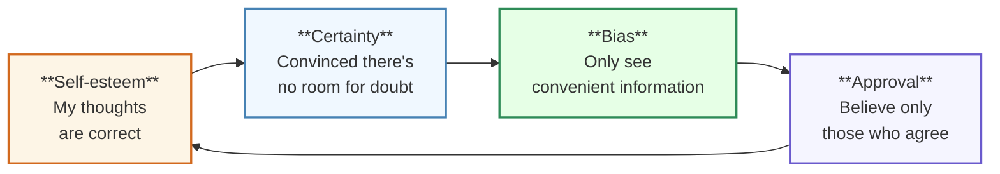
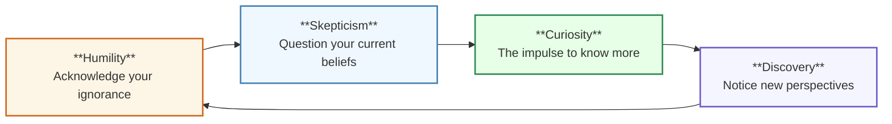

This is the article for Day 2 of the [Mamezou Developer Site Advent Calendar 2025](/events/advent-calendar/2025/)!

## Introduction

**Book [Think Again](https://amzn.asia/d/9dlmdqM)**

This is a book I really like.

This book discusses the importance of `rethinking`.

Below is the table of contents of the book.

- **Part 1:** How to rethink your own thoughts
- **Part 2:** How to encourage others to rethink
- **Part 3:** How to create a society and organizations that keep learning and rethinking
- **Part 4:** Conclusion

The importance of rethinking is explained with a focus on the self in Part 1, on others in Part 2, and on teams and organizations in Part 3.

In this article, I would like to introduce the following particularly striking points from Part 1:

- What is the rethinking cycle?
- What is the contrasting overconfidence cycle?
- What is needed to sustain the rethinking cycle?

## Are You Clinging to 'Fossilized Knowledge'?

Along with the advancement of information technology, human knowledge is also rapidly increasing. According to the book:

> Looking at 1950, medical knowledge had doubled over the 50 years since 1900.  
> By 1980, it was doubling every seven years, and by 2010, it was doubling in half that time.

Therefore, with societal changes, we need to reconsider more frequently what we once took for granted. But it's hard to actually do that...

## Preacher, Prosecutor, Politician - The Three Thought Modes Everyone Has

Why can't we rethink our own knowledge and viewpoints? The cause, the book says, is the following three thought modes that we switch into unconsciously:

- **Preacher Mode:**
  - When your beliefs are wavering, you try to sermonize others in order to uphold your ideals and make them firm.
- **Prosecutor Mode:**
  - When you find contradictions in someone else's reasoning, you look for arguments to expose their mistakes.
- **Politician Mode:**
  - When you want to get many people on your side, you run campaigns and lobby to win the approval of your supporters.

And these thought modes end up **cycling** among themselves. If we consider a concrete situation, it might look like this 👇

**Situation**  
A cryptocurrency investment recommended by an "investment advisor" he met via social media.  
He was told, "Start now for a 20% monthly return, limited slots available," and invested his initial capital.

_ A 20% monthly return is crazy... It's way out of line with the market..._

### Preacher Mode

**Self-esteem breeds certainty**

> This is the right investment method I discovered.  
> If I properly explain why my idea is correct, everyone will agree.

- You assume the truth has already been found.  
- You try to persuade others to prove how right you are.

### Prosecutor Mode

**Certainty breeds bias**

> Those around me who don't understand the mechanism are wrong.  
> Look at how much profit I'm actually making.

- You dismiss others' criticisms as "ignorance" or "contradictions".  
- You only see information that confirms your own ideas.

### Politician Mode

**Bias breeds approval**

> It must be right because everyone is doing it.  
> Those who oppose it are ignorant people who don't understand the mechanism.

- You feel safe surrounded by people who think the same way.  
- You ignore opposing opinions as coming from "ignorant people".

In the book, this cycle is called the **overconfidence cycle**.  
The overconfidence cycle is dangerous because you become so absorbed in the following that you stop reconsidering the possibility that your viewpoint might be wrong:

- Sticking to your own beliefs  
- Pointing out others' mistakes  
- Gaining widespread support

## Hypothesis, Experiment, Results, Verification - The Scientist's Thought Mode

So, how should the man who fell into the overconfidence cycle with his cryptocurrency investment have thought? For example:

- Consider what the basis for a 20% monthly return was.  
- Gather more perspectives on cryptocurrency investment.  
- Try a small-scale experiment before investing a large amount of capital.

In abstract terms, what was needed was the `scientist's thought mode`.  
The `scientist's thought mode` consists of the following four elements:

- **Hypothesis:**
  - Articulate your idea in words.  
    `Example:` A cryptocurrency investment will yield a 20% monthly profit.
- **Experiment:**
  - Test your idea.  
    `Example:` Invest a small amount.
- **Results:**
  - Observe the results obtained from the experiment.  
    `Example:` Record the investment amount and profit amount.
- **Verification:**
  - Verify the hypothesis based on the results.  
    `Example:` What is the basis for a 20% monthly return? How does it compare to other investment methods?

If you can repeat these four elements, you should be able to break out of the overconfidence cycle and rethink your own ideas.

## The Rethinking Process Cycle - The Rethinking Cycle

Apparently, the rethinking process using the scientist's thought mode also has a cycle similar to the overconfidence cycle. In the book, this cycle is called the **rethinking cycle**, and it is organized into the following four elements:

- **Humility:**
  - Be intellectually humble.  
  - Acknowledge your ignorance.
- **Skepticism:**
  - Question your own ideas.  
  - Ask yourself, "Is this really right?"
- **Curiosity:**
  - Want to know information you don't have.  
  - Get excited about perspectives and information you hadn't seen.
- **Discovery:**
  - At the end of questioning, gain new perspectives and information.  
  - Realize that the world is broader than you assumed.

Through **discovery**, by realizing, "There is still so much to learn and discover," you can maintain **humility**.

::: info
**Reasons People Don't Rethink**

1. It's different from the way they've done it so far  
2. It's impossible to do that  
3. It conflicts with their own experience  
4. It's too complicated to think about
:::

## Overconfidence Cycle vs. Rethinking Cycle

The overconfidence cycle and the rethinking cycle are contrasted as follows:

- **Overconfidence Cycle**
  - Self-esteem → Certainty → Bias → Approval

 

- **Rethinking Cycle**
  - Humility → Skepticism → Curiosity → Discovery

 

Also, even in the same situation, your thoughts and actions change depending on which cycle you are in.

|                    | Overconfidence Cycle | Rethinking Cycle          |
| ------------------ | -------------------- | ------------------------- |
| Changing your mind | A sign of weakness   | A sign of intellectual honesty |
| Being persuaded by others | Feel like you've lost | One step closer to the truth |
| Basis for changing ideas | Others' reactions     | Reason and evidence         |

## What Is Needed to Sustain the Rethinking Cycle - Confident Humility

How can we avoid falling into the overconfidence cycle and continue the rethinking cycle? The book states that a **balanced combination of confidence and humility** is important.

 

- Confidence  
  - Self-trust  
    How much you trust yourself  
    `Note!` It's not about how certain you are of your own way of doing things
- Humility  
  - Solid knowledge and abilities: the capacity to recognize your own mistakes and uncertainties  
    `Note!` It's not about holding back your confidence

 

What’s important here is that **confidence and humility can coexist**.

- Having confidence means losing humility  
- Having humility means losing confidence

That is not the case.

You can be confident that you have sufficient ability to reach your future goals while also holding the humility to ask yourself what the right means are at present.

In other words, while believing in your own abilities, you acknowledge the possibility that your solution method might be wrong or that you might be misunderstanding the problem itself. When doubts arise from that, you will reevaluate your existing knowledge, and if you have a moderate level of confidence, you will be able to pursue new knowledge.

**A state in which you strongly believe in your ability to learn, rather than in your existing knowledge**

This state is having **confident humility**.

## Conclusion - Knowledge and the Rethinking Cycle as a Software Engineer

I believe that software engineers are a profession that wield their knowledge as a weapon. In technical judgments and design choices, the knowledge and experience they have cultivated so far serve as the foundation for decision-making.

 

Recently, I read:
- [リファクタリング 既存のコードを安全に改善する(第２版)](https://amzn.asia/d/404p1AP)
- [単体テストの考え方/使い方](https://amzn.asia/d/hLdncbh)
- [現場で役立つシステム設計の原則 ~変更を楽で安全にするオブジェクト指向の実践技法](https://amzn.asia/d/c1Pv1UA)
- [良いコード/悪いコードで学ぶ設計入門-保守しやすい 成長し続けるコードの書き方](https://amzn.asia/d/8ebl8L4)

and learned what constitutes good design and what makes good code. In particular, I felt that in order to develop systems that are resilient to change, it is important to design the domain model thoroughly and program in an object-oriented way, rather than using procedural programming.

I was very convinced by the content of these books, but at the same time I had a concern: that I might eliminate knowledge that contradicts what these books say.

For example, it seems that in the way of thinking about unit testing, there are two opposing approaches: the "London school" and the "classical school". If you learn one of these as the "correct" approach and eliminate the other as "wrong", you might find yourself unable to accept any knowledge outside of the school you consider correct.

**I believe that there is no absolute correct answer, only the optimal means suited to each situation.** If you treat your own knowledge as the world's correct answer, you may end up considering everything other than your knowledge to be wrong. This is exactly the initial phase of the overconfidence cycle, the beginning of `self-esteem`.

I think that by considering your own knowledge as just one of many means and acknowledging that you don't know whether it's the optimal means in a specific situation, you can kickstart the rethinking cycle. By having humility to question your own knowledge, curiosity for different approaches and philosophies, and discovering new perspectives, you might be able to make better decisions.
