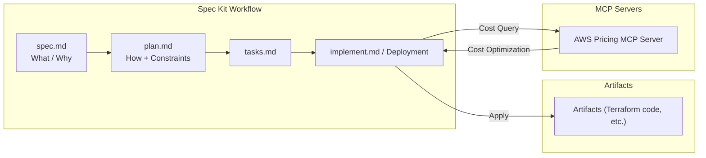

This is the Day 16 article for the Mamezou Developer Site Advent Calendar 2025 (/events/advent-calendar/2025/).

## 1. Introduction

It has been about three months since I published the [article on Spec-Driven Development using Kiro](https://developer.mamezou-tech.com/blogs/2025/09/08/kiro-spec-terraform-iac/) in September.

In that time, the ecosystem and tools around generative AI have continued to evolve at an astonishing pace. Recently, I feel that Gemini, which has been getting a lot of attention, has rapidly matured since its initial release to a level where it can be seriously considered for business use.

This time, I will try out a development approach that combines GitHub’s Spec-Driven Development (SDD) tool [Spec Kit](https://github.com/github/spec-kit) with the Gemini CLI, an AI client that supports the Model Context Protocol (MCP), to generate infrastructure.

In the previous article, I covered SDD + Terraform using “Kiro × Claude.” In this article, we will replace that with “Spec Kit × Gemini” and, importantly for business settings, perform cost optimization and cost estimation using the AWS Pricing MCP Server.

By combining these, we will verify how far we can realize an end-to-end infrastructure construction flow with Spec Kit, from design philosophy (Why) to concrete implementation (What), and all the way through code and architecture quality assurance.

## 2. Article Goals

The goals of this article are as follows:

- Master Spec Kit  
  Experience the flow of defining infrastructure specifications and translating them into concrete IaC code along the four-phase process (Specify, Plan, Tasks, Implement) of GitHub Spec Kit.

- Understand an SDD-based infrastructure construction workflow  
  Learn a new way of building infrastructure with AI that runs end to end from design philosophy (Why) to implementation (What) and quality assurance.

- Learn how to achieve quality assurance including cost  
  Understand how to incorporate cost constraints at the specification level by combining the AWS Pricing MCP Server to estimate the running costs of the infrastructure built from Terraform code.

- Build practical infrastructure  
  Aim to build practical resources using S3 and CloudFront for a static website, along with CloudWatch metrics to visualize access patterns.

## 3. Prerequisites

This article assumes the following audience:

Target readers  
- Those interested in infrastructure construction or operation, and cloud environment design  
- Those interested in SDD (Spec-Driven Development) or IaC (especially Terraform)  
- Those who want to try development flows using generative AI in the infrastructure domain

What this article does not cover  
- Installation and detailed configuration of GitHub Spec Kit itself  
- Detailed prompt instructions in SDD  
- Setup details of MCP Servers (e.g., AWS Pricing MCP Server)  
- Steps for creating accounts or settings for generative AI (e.g., Gemini)  
- Explanations or publication of Terraform or AWS code

Environment  
- Mac (M1) / macOS Sequoia 15.5[^1]  
- VSCode: `1.107.0`  
- Gemini CLI: `0.20.2`  
- Gemini 2.5 series models (Flash / Pro, etc.)  
- Spec Kit `v0.0.90`

Assuming these prerequisites and environment are already in place, this article focuses on how to combine and leverage these tools.

## 4. The Limits of “Vibe-Coding” and Overlooked Costs

While AI coding agents continue to improve, many usage patterns still rely on vague developer instructions (vibes), known as “vibe-coding.”

This approach tends to focus on immediate generation errors, such as code not compiling or not accurately reflecting the developer’s intent.

More seriously, code that appears to work can be produced in large quantities by vibe-coding. This code hides the following “overlooked costs”:

- Person-dependency and black-boxing  
  - Prompts and assumptions used at generation time often aren’t preserved, so you can’t tell from the code why a design was chosen (the Why).  
  - As a result, the code becomes a hard-to-touch black box for other developers, incurring high cognitive costs whenever a fix or improvement is needed.
- Degrading architectural consistency  
  - Continuously adding features via ad-hoc vibe-coding gradually drifts the system architecture away from its original design intent.  
  - In IaC, slight definition differences across environments accumulate, skyrocketing the cost of later cleanup and refactoring to determine “what is correct.”
- Increased review and audit costs  
  - Reviewers must reverse-engineer “what was the purpose of this change?” from conversation history or commit messages each time they read code.  
  - From a security or compliance perspective, it’s hard to trace which code was generated under which assumptions or policies, making checks time-consuming.

Thus, while vibe-coding may temporarily boost short-term productivity, it can increase long-term maintenance, quality, and security costs.

## 5. The Philosophy of Spec-Driven Development (SDD)

In response to the long-term challenges posed by vibe-coding, GitHub introduced Spec Kit in its official blog as a new development paradigm called Spec-Driven Development (SDD).

GitHub states the philosophy as follows:

> "That’s why we’re rethinking specifications — not as static documents, but as living, executable artifacts that evolve with the project. Specs become the shared source of truth. When something doesn’t make sense, you go back to the spec; when a project grows complex, you refine it; when tasks feel too large, you break them down."

The essence of this quote is captured in two key concepts:

1. Specifications are "living, executable artifacts"  
   Rather than static documents that become outdated, specs are files that evolve with the project and can be directly used by tools and AI for code generation, testing, and validation.

2. Specifications are the "single source of truth"  
   They function as a contract defining how the code should behave. Developers use specs as a reference point when in doubt, and AI agents use them as the absolute basis for determining behavior.

Maintaining strong consistency between specs and implementation brings order to the chaos of vibe-coding and is key to maximizing the power of AI, according to GitHub.

## 6. The Role of GitHub Spec Kit

Spec Kit is an open-source toolkit for integrating SDD into AI coding agent workflows (GitHub Copilot, Gemini CLI, Claude Code, etc.).  
- `/speckit.specify`: Create specifications (Specs)  
- `/speckit.plan`: Organize tech stacks and architectural policies  
- `/speckit.tasks`: Break down work into a task list  
- `/speckit.implement`: Implement based on tasks  

These commands structure the flow from “spec → plan → tasks → implement”, providing consistent context to AI.

## 7. Spec Kit’s Structured Development Workflow

A major benefit of Spec Kit is that it doesn’t overly depend on which generative AI you use; it enables development with a common workflow.

In reality, cost considerations may limit the number of generative AIs you can use simultaneously, and organizational constraints may restrict available AIs. Spec Kit’s workflow is designed to be reusable under such limitations.

To facilitate smooth collaboration with AI, Spec Kit defines four clear processes, each executed via specific commands:

**1. Specify – Define the What and Why**  
Use `/speckit.specify` to focus on the user journey, expected outcomes, and success criteria rather than the tech stack. Specs are treated as living artifacts that drive infrastructure design.

**2. Plan – Incorporate constraints**  
Use `/speckit.plan` to determine technical direction. Provide AI with enterprise constraints like tech stack, architecture, compliance requirements, and performance goals to generate a comprehensive technical implementation plan (`plan.md`). Constraints from MCP servers can be integrated here.

**3. Tasks – Break into reviewable units**  
Use `/speckit.tasks` to decompose the Plan into small, independently implementable and testable units (reviewable diffs). Mark dependencies and parallelizable tasks (`[P]`) to clarify what to tackle first.

**4. Implement – Focused changes**  
Use `/speckit.implement` to have agents implement tasks. Developers review focused changes that solve specific problems rather than large code dumps, keeping AI-generated changes understandable and verifiable.

### 7.1. Mapping Spec Kit to Kiro Processes

Both Spec Kit and AWS Kiro support SDD, but their phase names and deliverable structures differ slightly. This article maps them roughly as follows:

| Aspect                           | Spec Kit Phase/Command           | Main Deliverable (Spec Kit)                                                            | Ref: Kiro Process/File Examples            |
|----------------------------------|----------------------------------|-----------------------------------------------------------------------------------------|---------------------------------------------|
| Clarifying requirements/intents  | Specify / `/speckit.specify`     | Spec file organizing product purpose, assumptions, scope (e.g., `spec.md`)             | Requirements phase / `requirements.md`      |
| Examining implementation approach| Plan / `/speckit.plan`           | Plan file summarizing architecture policy, tech selection, infra composition (`plan.md`)| Design phase / `design.md`                  |
| Breaking into work units         | Tasks / `/speckit.tasks`         | Task list broken into implementable units (`tasks.md`)                                  | Tasks list under Tasks/Implementation       |
| Execution & validation           | Implement / `/speckit.implement` | Code, tests, and config file changes based on the task list                            | Entire Implementation phase (hooks and tasks) |

Note: Kiro has a 3-phase structure (Requirements → Design → Implementation), with task execution and code generation within the Implementation phase. Spec Kit distinguishes Tasks and Implement to explicitly separate task decomposition from implementation.

## 8. Realizing Cost Constraints with AWS Pricing MCP Server

In this chapter, we explain the role of the [AWS Pricing MCP Server](https://awslabs.github.io/mcp/servers/aws-pricing-mcp-server) and how integrating it into Spec Kit’s workflow—especially after the Implement phase—allows us to impose cost constraints.

### 8.1. The Role of the Model Context Protocol (MCP)

Using MCP and the MCP Registry, MCP-enabled clients like the Gemini CLI can connect to external services such as the AWS Pricing MCP Server. Adding MCP after Spec Kit’s Spec/Plan/Tasks/Implement workflow naturally integrates constraints and recommendations (in this article, mainly cost information) from external tools.

### 8.2. Cost Estimation with the AWS Pricing MCP Server

The AWS Pricing MCP Server is an MCP Server that provides access to AWS pricing data. From the Gemini CLI, you can input service type, region, usage assumptions, etc., and query approximate pricing.

In the context of Spec Kit, by querying costs for Terraform code and architecture proposals generated during the Implement phase, you can have the AI agent evaluate:
- Which configuration seems to minimize monthly costs
- How costs scale with traffic increases
- Which resources are likely cost bottlenecks

### 8.3. Integration of Cost Evaluation After the Implement Phase

After running `/speckit.implement` or once Terraform code has been generated/deployed in the Implement phase, call the AWS Pricing MCP Server to retrieve cost information and constraints/recommendations based on the actual resource configuration.

This enables a feedback loop where, in addition to nonfunctional requirements like performance and availability, you can refine architecture and code based on estimated running costs under expected traffic.

After Implement execution, proceed as follows:
1. Estimate costs from the resource configuration  
2. Evaluate the performance-to-cost balance  
3. Revise Plan/Specs as needed  

Layered structure:



## 9. Hands-on: Building a Static Site and Access Visualization with CloudFront and S3

In this chapter, we will build a static website on S3 and CloudFront using Spec Kit and Gemini CLI, and visualize its access patterns in CloudWatch.

First, we construct the static website with SDD, then add a specification to create a dashboard in CloudWatch to visualize access patterns.

The goal here is not only to build infrastructure but to verify in the CloudWatch console that the request count graph is updating. This helps realize the flow from intent (Spec) to actual operation (Monitoring).

```mermaid
flowchart LR
    subgraph Client["Client"]
        U[User/Browser]
    end

    subgraph AWS["AWS Infrastructure (built with Terraform)"]
        CF[CloudFront Distribution]
        S3[S3 Bucket (Static Site)]
        CW[CloudWatch Metrics]
    end

    U -->|HTTPS Request| CF
    CF -->|Origin Request| S3
    CF -->|Send Access Metrics| CW
```

### 9.1. Setting Up Gemini.md and specify init – Creating the Project

Run `specify init <PROJECT_NAME>` to create a project. At creation, files are generated in a hierarchy like this:

Since all generated files are in English by default, we recommend setting the following prompt and Gemini.md:

```md
# Gemini.md

## Language
Please use Japanese.
If in English, translate into Japanese.
```

```bash
# Prompt
Please translate all template files under .specify/templates into Japanese.
```

```txt
+---.gemini
|   \---commands
|           speckit.analyze.toml
|           speckit.checklist.toml
|           speckit.clarify.toml
|           speckit.constitution.toml
|           speckit.implement.toml
|           speckit.plan.toml
|           speckit.specify.toml
|           speckit.tasks.toml
|           speckit.taskstoissues.toml
|
+---.specify
|   +---scripts
|   |   \---bash
|   |           check-prerequisites.sh
|   |           common.sh
|   |           create-new-feature.sh
|   |           setup-plan.sh
|   |           update-agent-context.sh
|   |
|   \---templates
|           agent-file-template.md
|           checklist-template.md
|           plan-template.md
|           spec-template.md
|           tasks-template.md
(plus many others)
```

### 9.2. Constitution – Defining the Rules

First, run `/speckit.constitution`. Gemini translates this as “constitution,” but personally I prefer calling it “Rules,” so I configured the constitution accordingly. A simple instruction creates `<workspace-name>/.specify/memory/constitution.md`.

The constitution is meant to solidify what is required (or allowed) in this project, forming the foundation for consistent quality in subsequent Spec/Plan/Tasks.

Below is an excerpt of the actual `constitution.md` I created, showing only key principles for readability (summarized):

```md
# spec-kit-entry-s3-static-site Rules

## Core Principles
1. Security: Least privilege (no access logging required for the development environment)
2. State Management: Use a remote backend like S3 (locking not mandatory)
3. IaC Modularity: Independent modules per function
4. Naming Conventions: Enforce consistent naming
5. Static Analysis and Testing: Require `tfsec` / `tflint` + MCP checks
6. Documentation Language: Written in Japanese
7. In-code Language: Descriptions and variable `description` fields also in Japanese
```

### 9.3. Specify – Defining What to Build

First, create `spec.md` and define the objective of a “secure, high-speed static website.” Success criteria might include:
- Accessing the CloudFront endpoint delivers static content over HTTPS

`spec.md` can be quite lengthy when including nonfunctional requirements, so below is an excerpt from the actual `spec.md` showing the essence for hosting a static site on S3 + CloudFront (summarized for readability):

```md
# Functional Specification: S3 Static Site Hosting

## User Scenarios and Tests *(Required)*

### User Story 1 – Provisioning the S3 Bucket (Priority: P1)
- Acceptance: An S3 bucket with static site hosting enabled is created

### User Story 2 – Content Delivery via CloudFront (Priority: P2)
- Acceptance: Accessing the CloudFront URL over HTTPS displays `index.html`

## Functional Requirements (FR)
- FR-003: Direct public access to the S3 bucket is blocked
- FR-005: CloudFront uses Origin Access Control (OAC) to access S3

## Success Criteria *(Required)*
- SC-001: `index.html` is served over HTTPS from the CloudFront URL within 5 seconds
```

### 9.4. Plan – Planning How to Build

When running `/speckit.plan`, provide the tech stack (S3, CloudFront, OAC) and nonfunctional requirements such as security and operational constraints.

At this stage, no concrete Terraform code exists, so you don’t call the AWS Pricing MCP Server for precise cost estimation. Instead, note expected traffic and rough budget in the Spec/Plan, preparing to evaluate costs in the Implement phase.

The generated `plan.md` might include policies such as:
- Make the S3 bucket private, disallow direct public access
- Use OAC so only CloudFront can access the bucket

The Plan aims to formalize “how to build” in a reviewable form, with a checklist and configuration policies defined at a certain level of detail. Below is an excerpt from `plan.md` (it will also include directory layout policies under `specs/<feature>/`):

```md
# Implementation Plan: S3 Static Site Hosting

## Rules Check
- [x] 1. Security: Does the plan follow least privilege? (Block S3 public access, use OAC)
- [x] 2. State Management: Is remote state management with locking configured? (Assume Terraform Cloud or S3 backend)
- [x] 3. IaC Modularity: Does the design promote reusable modules? (Plan modules for s3 and cloudfront)

## Project Structure
specs/001-s3-cloudfront-site/
├── plan.md
├── spec.md
└── checklists/requirements.md

As an IaC project, adopt the Terraform standard layout. Treat environments (`environments`) and reusable components (`modules`) separately. This adheres to the constitution’s principle of modularity and allows easy addition of environments (e.g., production) in the future.

```text
.
├── environments/
│   └── dev/
│       ├── main.tf
│       ├── variables.tf
│       ├── outputs.tf
│       └── backend.tf
└── modules/
    ├── s3-static-site/
    │   ├── main.tf
    │   ├── variables.tf
    │   └── outputs.tf
    └── cloudfront-cdn/
        ├── main.tf
        ├── variables.tf
        └── outputs.tf
```

### 9.5. Tasks – Breaking into Implementation Tasks

Based on the Plan, Gemini generates a detailed task list like:
- Create the S3 bucket and configure its base policy
- Create the CloudFront distribution (origin S3)
- Create an Origin Access Identity (OAI) and integrate it into the S3 bucket policy

With dependencies and parallelizable tags, the Terraform implementation order becomes clear.

Below is an excerpt from the generated `tasks.md` (summarized):

```md
# Tasks: S3 Static Site Hosting

> Tasks marked `[P]` can be executed in parallel.

## Phase 1: Setup
- [x] T001 [P] Create the `environments/dev` directory
- [x] T002 [P] Create the `modules/s3-static-site` directory
- [x] T003 [P] Create the `modules/cloudfront-cdn` directory

## Phase 3: User Story 1 (P1)
- [x] T010 [US1] Define the S3 bucket with website configuration and public access block

## Phase 4: User Story 2 (P2)
- [x] T015 [US2] Define OAC and the CloudFront distribution

## Phase 5: User Story 3 – Terraform IaC (Priority: P3)

Goal: Establish processes to ensure infrastructure definition quality and reproducibility.  
Independent tests: Verify `terraform plan` completes with no changes and static analysis tools produce no warnings.
```

### 9.6. Implement – Implementation and Verification

Gemini implements each task as Terraform code and deploys it. After deployment, access the CloudFront endpoint a few times and verify that static content is served over HTTPS.

This verification confirms that the initial success criteria have been met.

Next, input the generated Terraform code and deployed resource configuration into the AWS Pricing MCP Server to obtain approximate running costs.

This allows you to:
- Check if it fits within the expected budget
- Identify potential cost bottlenecks

With this feedback, you can loop back to revise Plan / Tasks / Implement.

### 9.7. Adding Requirements and Resources

With the static site created and published, add a requirement to visualize site access in CloudWatch.

An example success criterion:
- After accessing the site, request counts appear in the CloudFront metrics in CloudWatch

Add tasks to Plan / Tasks such as:
- Enable metrics and logging for verification in CloudWatch

In the Implement phase, extend Terraform code based on these tasks and redeploy. After deployment, access the CloudFront endpoint and confirm that the "Requests" graph in the CloudWatch CloudFront metrics screen reflects data. This verification confirms the added specification has been met.

## 10. Three Scenarios Where SDD Is Particularly Effective

GitHub’s official blog presents three patterns where Spec-Driven Development shines:

1. Greenfield (brand-new development)  
   - For new systems, it’s important to think from intent and constraints, not code. Writing specs and progressing through Plan / Tasks / Implement helps avoid architectural drift.

2. Feature work (adding features to existing systems)  
   - When adding features to existing infrastructure, documenting impact scope, existing policies, and naming conventions in Spec / Plan phases makes reviews and rollbacks easier. GitHub notes this is where SDD is most powerful.

3. Legacy modernization  
   - When migrating legacy systems run by scripts or manual processes to modern architectures or IaC, SDD helps by formalizing implicit specifications and constraints in Specs / Plans and replacing them incrementally.

## 11. Impressions from Using It

Having used Spec Kit alongside Kiro, I felt the following differences:

Strictness of Reviews  
- Spec Kit requests human reviews at each phase (Specs, Plan, Tasks, Implementation). This step-by-step style reduces rework but slows the pace.

Kiro’s Approach  
- Kiro pushes AI to advance to a summarized state before asking for human review, making it faster with fewer interactions.

Concerns noticed in this trial:  
- The constitution rules aren’t always fully enforced, with occasional out-of-spec proposals  
- Phase boundaries (Requirements / Design / Implementation) can blur more than with Kiro

These depend heavily on the AI agent’s implementation and prompt design combined with Spec Kit.

Overall:  
- Spec Kit fits greenfield projects where you want to design a new system carefully and review specs and tasks as a team.  
- Kiro has a lower barrier to entry if you want a lighter SDD experience or to follow AWS-centric templates and guides.

## 12. Example of Executable Specifications

In the S3 static site example from this article, the "executable specifications" take the following form:
- spec.md  
  - Document summarizing use cases, constraints, and nonfunctional requirements
- plan.md  
  - Policies organizing Spec-defined requirements, nonfunctional needs, and architecture constraints, along with chosen AWS services and Terraform module structure
- tasks.md  
  - To-do list broken into implementation, testing, and audit tasks
- Terraform code  
  - Concrete IaC implementation derived from these artifacts  
  - Evaluated for cost using AWS Pricing MCP Server after Implement

The key is:  
**Not just code alone, but end-to-end consistency from spec to plan to tasks to code.**

Spec Kit semi-automates this flow via AI while breaking changes into reviewable units.

## 13. Future Developments and Challenges

Finally, a brief look at future prospects and challenges.

### 13.1. Anticipated Developments
- Stronger integration with IDEs/editors  
  - Rather than running AI commands in the AI console, being able to run `/speckit.*` commands directly in VS Code would create a more natural workflow.
- Comparing multiple implementation proposals  
  - Generate multiple patterns (e.g., S3 only / S3 + CloudFront / S3 + CloudFront + WAF) from the same Spec/Plan and compare cost, operability, and security.
- Applying to large-scale projects  
  - Extending Spec-Driven Development to microservices or complex network architectures.

### 13.2. Current Challenges and Considerations
- MCP ecosystem maturity  
  - MCP and MCP Servers are still evolving, subject to spec changes and upgrades.
- Security and permission management  
  - Depending on how MCP Servers are implemented and deployed, careful handling of credentials and access control is necessary.
- Incorporating human reviews  
  - Ultimately, human judgement is responsible. Designing what reviews to conduct at each stage (Spec / Plan / Tasks / Code) as a team is critical.

## 14. Conclusion

If I were to express the core takeaway of this article in one phrase:  
**“Shifting the pivot from starting with code to starting with specifications and intent.”**

Code is merely the realization of specs and intent, and AI and MCP Servers serve as bridges. Framing them this way clarifies the Spec-Driven Development concept.

Using Spec Kit, I also realized that the combined strengths and workflows vary depending on the AI agents and MCP Servers paired with it. I intend to explore more use cases in infrastructure construction and operation to find optimal tool combinations.

The Spec-Driven Development philosophy itself is a key approach that supports long-term maintainability and quality, particularly in infrastructure. I hope this article encourages readers to try SDD, Spec Kit, and AI/MCP in your own projects.

[^1]: At the time of writing, you can install Gemini CLI via npm on Git Bash for Windows, but you may encounter garbled text and other issues. This arises because Gemini CLI uses PowerShell internally on Windows. Using PowerShell as the default terminal on Windows resolves these issues.
