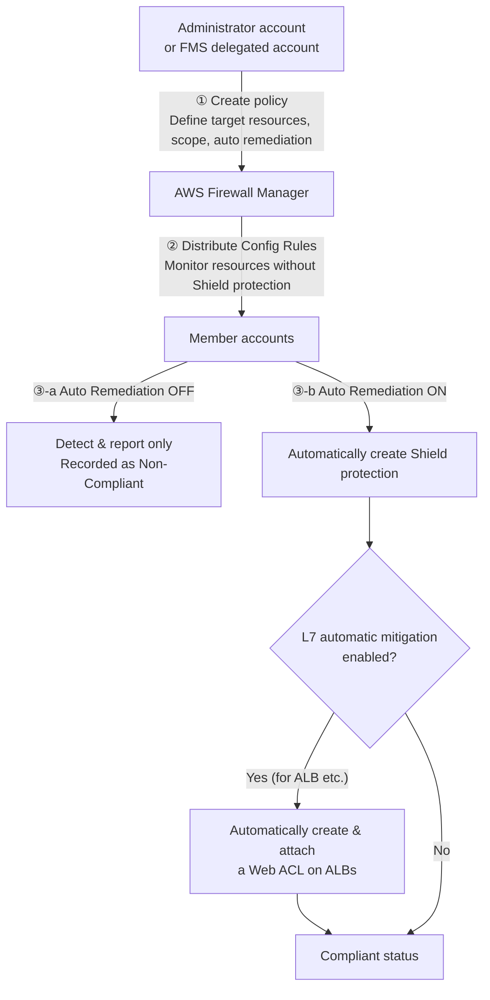
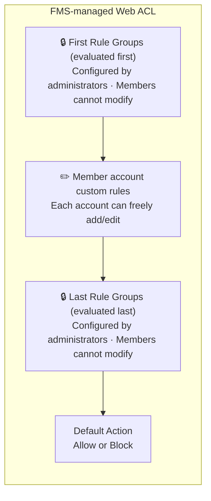
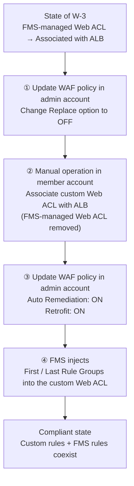

## 0. Introduction

Hello. I’m Niwa from Mamezou’s R&D Group. This time, I’d like to introduce the policy settings of AWS Firewall Manager (hereinafter, FMS), one of AWS’s security services.

Recently, in a project I’ve been involved with, we needed to implement AWS Shield Advanced. When managing accounts via AWS Organizations, it is recommended to use Firewall Manager policy settings to bulk-apply Shield Advanced protection to any OU or any accounts. Since the behavior of these policy settings was somewhat confusing, I conducted actual tests and would like to share the results here.

If you’re using Organizations and you want unified DDoS protection and Web ACL application across your organization, are considering introducing AWS Shield Advanced, or want to understand FMS policy behavior in advance—especially if you’re about to start full-scale AWS security operations—this article should be helpful.

## 1. What You Will Learn in This Article

In this article, we’ll explain the behavior of the two main security policies provided by FMS, based on actual test results:

- **FMS Shield Advanced policy**: A policy to centrally apply DDoS protection across the entire organization  
- **FMS WAF policy**: A policy to centrally distribute and apply Web ACL rules across the entire organization  

For each policy, we’ll organize the content around three perspectives: “Purpose,” “Mechanism,” and “Key Findings from Testing.” We’ll focus especially on real-world behavior that is hard to grasp from official documentation alone, such as the **Auto Remediation** feature’s behavior and co-existence patterns with existing Web ACLs (custom-defined Web ACLs).

## 2. Prerequisites and Target Audience

### Prerequisites

This article focuses on “testing the behavior of FMS policy settings,” so let’s briefly organize the basics of FMS and the related services that appear during testing, such as WAF, Shield, and others. Further explanations of services appearing later will be provided as needed.

:::column: What is AWS Firewall Manager

AWS Firewall Manager (FMS) is a service that uses AWS Organizations to centrally manage and apply various security rules across multiple AWS accounts. With FMS, you can prevent security policy application gaps and maintain a uniform security level across your organization.

The policies introduced in this article are the two mentioned earlier:

- **FMS Shield Advanced policy**: A policy to centrally apply DDoS protection across the entire organization  
- **FMS WAF policy**: A policy to centrally distribute and apply Web ACL rules across the entire organization  

Although there are other policies besides these two, we will omit them here as they are outside the scope of this article.

> **Note: What is AWS Organizations**  
> AWS Organizations is a service for centrally managing multiple AWS accounts as an organization. Accounts are grouped in a hierarchical structure called **Organizational Units (OU)**, allowing bulk policy application. FMS policies are distributed by specifying the scope at the OU or account level.

:::

:::column: What is AWS WAF

AWS WAF is a service that filters malicious requests to web applications. You define rules within a Web ACL (Access Control List) and associate it with resources such as CloudFront or ALB.

For example, it allows you to set fine-grained defensive rules at the resource level, such as “block SQL injection attacks” or “restrict access from specific countries.”

> **Note: Related AWS Resources**  
> - **ALB (Application Load Balancer)**: A load balancer that routes traffic at the HTTPS level. One of the main resources protected by WAF and Shield Advanced.  
> - **CloudFront**: AWS’s CDN (Content Delivery Network) service. Allows you to apply WAF rules at global edge locations.

:::

:::column: What is AWS Shield

AWS Shield is a service that protects AWS resources from DDoS attacks. There are two plans:

| Plan                   | Overview                                                                                                                       |
| ---------------------- | ------------------------------------------------------------------------------------------------------------------------------ |
| **Shield Standard**    | Free for all AWS users. Automatically defends against common DDoS attacks at layers 3 and 4 (network and transport layers).   |
| **Shield Advanced**    | Paid. Provides advanced DDoS protection, free WAF usage fees, access to the DRT (DDoS Response Team), cost protection, etc.    |

When using Shield Advanced, you must create and enable a “Protection” for each target resource (ALB, CloudFront, EIP, etc.). By using FMS, you can automatically protect new resources with Shield Advanced upon creation, preventing configuration omissions, and centrally manage Shield Advanced protection across all accounts in an Organization from FMS.

:::

### Target Audience

- Those who centrally manage accounts using AWS Organizations  
- Those considering the adoption of Shield Advanced  
- Those interested in AWS security services and organizational governance  
- Those who want to apply common security rules to all accounts using FMS  

## 3. FMS Shield Advanced Policy

### 3-1. Purpose

As mentioned earlier, using Shield Advanced requires creating a Protection for each resource you want to protect. However, manually configuring protection for every resource across multiple accounts managed in AWS Organizations is not realistic.

The **FMS Shield Advanced policy** solves this problem. From the administrator account (or the delegated administrator account), you simply define a policy saying, “Apply Shield Advanced protection to all ALBs and EIPs in these accounts,” and FMS will detect the target resources and centrally apply protection.

### 3-2. Mechanism

The basic operation flow of an FMS Shield Advanced policy is as follows. Here, the “administrator account” refers to the account that has subscribed to Shield Advanced (usually the same as the Organizations management account).

“Compliant” means that FMS has detected the target resources and applied protection centrally. If Auto Remediation is OFF, FMS only detects and does not add protection, resulting in Non-Compliant.

AWS Config is involved here, so let’s add a brief note:

:::column: What is AWS Config (Relation with FMS)

AWS Config is a service that continuously records and evaluates the configuration state of AWS resources. By defining **AWS Config Rules**, you can automatically assess whether a resource meets a specified standard. FMS leverages this mechanism to automatically define Config Rules in member accounts when distributing policies. Config continuously monitors whether “there are resources without Shield protection” and “FMS-managed Web ACLs are applied,” reporting them as Compliant/Non-Compliant.

:::

The most important setting is **L7 automatic mitigation (Automatic application layer DDoS mitigation)**. When enabled, FMS automatically creates a Web ACL rule named `ShieldMitigationRuleGroup...` in the Web ACL attached to target resources such as ALBs.

:::info
This auto-creation of a Web ACL rule is solely required for the “Shield Advanced L7 automatic mitigation feature.” It is separate from the Web ACL created by a WAF policy and does not affect existing Web ACLs. In fact, FMS adds a rule it created (named `ShieldMitigationRuleGroup...`) at the end of the existing Web ACL’s rule list. Since it is added last, it is evaluated last and does not interfere with the checks in existing rules.
:::

### 3-3. Test Results

The test was conducted by preparing an ALB and an EIP (attached to an EC2 instance) in a member account and applying an FMS Shield Advanced policy from the administrator account.

:::alert
As a precaution, please note that the following tests are strictly for “testing” purposes, and it is not recommended to run them directly on production accounts or OUs. Even if you must do so, we recommend preparing a rollback plan, such as downloading a backup of the Web ACL (JSON configuration file).
:::

#### Test Pattern S-1: Auto Remediation OFF

| Item        | Details                                     |
| ----------- | ------------------------------------------- |
| FMS Setting | Auto Remediation: **Disabled**              |
| Before Test | No Shield protection on ALB or EIP          |
| Expectation | Detected as Non-Compliant, but no protection created |

Result: Expected behavior.

FMS automatically distributed an AWS Config rule to the member account, and this rule detected the absence of Shield protection on the ALB and EIP. In the FMS console, the account status shows Non-Compliant, and each resource also shows Non-Compliant.

Administrator account FMS console:
- Account status is Non-Compliant  
  

- Reason for Non-Compliant status on target resources (ALB, EIP)  
  

Member account AWS Config console:
- Config rule created by FMS  
  

- Detection of non-compliant resources by the Config rule  
  

- Viewing the ALB resource’s Config details “Resource Timeline” confirms that the Config rule was applied by FMS  
  

:::info
To check “what the resource configuration was” and “how it changed” by the Config rule, open sections like “Rule compliance” or “Configuration changes.” You can see how the settings were modified to become a protection target (or removed from it) and whether the FMS rule became Non-Compliant or Compliant. (Since detailed resource-specific data may reveal sensitive information, the images are omitted.)
:::

#### Test Pattern S-2: Auto Remediation ON

| Item        | Details                                      |
| ----------- | -------------------------------------------- |
| FMS Setting | Auto Remediation: **Enabled**                |
| Before Test | No Shield protection on ALB or EIP           |
| Expectation | Shield protection is automatically created and status changes to Compliant |

Result: Expected behavior. (There is a time lag for changes to reflect.)

A few minutes after enabling Auto Remediation, the EIP status became Compliant first. The ALB took a bit longer, requiring a few more minutes to become Compliant.

For the ALB, we also confirmed that the **L7 automatic mitigation Web ACL rule (`ShieldMitigationRuleGroup...`)** was automatically created. This behavior is expected as part of the Shield Advanced feature.

Administrator account FMS console:
- Auto Remediation enabled  
  

:::info
If you check “Replace~” in the image and enable it, FMS will automatically replace any legacy WAF Classic Web ACLs associated with target resources (ALB, EIP, etc.) with WAFv2 Web ACLs.
:::

Member account console:
- WAF & Shield console  
  FMS-created Web ACLs appear.  
  

  The FMS-created Web ACL is not directly associated with the ALB or other resources,  
  

  Instead, rules are added to the existing Web ACL. A rule named “ShieldMitigationRuleGroup_...” is appended at the end of the existing Web ACL’s rule list. This is the DDoS mitigation rule.  
  

  Because Web ACL rules are evaluated in order, adding it last ensures it does not affect the evaluation of existing rules.

- Config console  
  After enabling Auto Remediation, resources became protected and status changed to Compliant.  
    
  

The resource timeline also shows that the target resources became part of the Shield Advanced policy protection. (Image omitted.)

#### Behavior When Deleting the Policy

After testing, deleting the policy resulted in FMS-created Config rules and Web ACLs being **properly removed** from the member account. Resources that remained immediately after deletion were cleaned up automatically after a short wait.

Administrator account FMS console:
- Deleting the policy  
    
  

Member account console:
- WAF & Shield console  
    
  

- Config console  
  Config rules become “Unavailable” once deleted.  
  

---

## 4. FMS WAF Policy

### 4-1. Purpose

AWS WAF is a very powerful service, but ensuring that every account in an organization adheres to common “minimum baseline rules” can be surprisingly difficult. Asking each account administrator to “please apply this configuration” is burdensome for both parties.

The **FMS WAF policy** allows administrators to define Web ACL settings (rule groups to apply, default action, etc.) as a policy and distribute and apply them organization-wide.

### 4-2. Mechanism

FMS WAF policies have more configuration options than Shield Advanced policies, especially regarding how to handle existing Web ACLs.

#### Replace vs. Combine

When creating and applying an FMS WAF policy, you can choose between:

- Replacing existing Web ACLs with FMS-managed Web ACLs  
- Integrating by sandwiching member account custom rules between FMS-managed rule groups

“Sandwiching” looks like this:

:::info
First / Last Rule Groups are placement slots for rule groups in an FMS WAF policy.  
- **First Rule Groups**: Evaluated before member account custom rules. Used when administrators want to enforce certain communications to be blocked.  
- **Last Rule Groups**: Evaluated after custom rules. Used for organization-wide post-processing rules as a “last line of defense.”  
- **Default Action**: The final action (Allow or Block) for requests that match no rules, set in the FMS policy.  

This structure lets administrators enforce a security baseline while allowing each account to add application-specific custom rules flexibly.
:::

#### Testing Four Web ACL Management Patterns

In FMS WAF policies, there are several patterns for how to apply Web ACLs to resources. We tested the following four:

| Pattern                          | Auto Remediation | Replace Option | Retrofit | Behavior                                                                                          |
| -------------------------------- | ---------------- | -------------- | -------- | ------------------------------------------------------------------------------------------------- |
| W-1: Detection Only              | OFF              | —              | —        | Only detects and reports policy violations. Does not change resources.                          |
| W-2: Auto Remediation (Replace OFF) | ON           | OFF            | OFF      | Applies the FMS-created Web ACL only to resources with no Web ACL. **Leaves resources with custom Web ACLs unchanged**. |
| W-3: Auto Remediation (Replace ON)  | ON           | ON             | OFF      | **Forces replacement** of all target resources with the FMS-created Web ACL.                    |
| W-4: Auto Remediation (Replace OFF, Retrofit ON) | ON | OFF  | ON       | **Injects FMS rules** into all target resources' existing Web ACLs.                              |

### 4-3. Test Results

We prepared an ALB and a custom Web ACL (`test-fms-waf-log`) in a member account, then applied settings according to the four patterns to observe behavior.

#### Test Pattern W-1: Auto Remediation OFF

| Item        | Details                              |
| ----------- | ------------------------------------ |
| FMS Setting | Auto Remediation: **Disabled**       |
| Before Test | No Web ACL associated with the ALB   |
| Expectation | Non-Compliant. No Web ACL applied to the ALB. |

Result: As expected. The FMS console detected Non-Compliant status, and no changes were made to the ALB.

Administrator account console:
- Relevant settings:  
  

Member account console:
- WAF & Config consoles after policy application. A custom Web ACL exists (created beforehand) but is not associated with the ALB.  
  

- In the Config console, the FMS-created rule marks the ALB as Non-Compliant because Auto Remediation is OFF and no Web ACL is associated.  
  

Administrator account console:
- FMS console after policy application:  
  

#### Test Pattern W-2: Auto Remediation ON, Replace OFF

| Item        | Details                                        |
| ----------- | ---------------------------------------------- |
| FMS Setting | Auto Remediation: **Enabled**, Replace: **OFF** |
| Before Test | No Web ACL associated with the ALB             |
| Expectation | FMS-created Web ACL is automatically associated with the ALB and status becomes Compliant. |

Result: As expected. The FMS-created Web ACL was automatically associated with the ALB and status changed to Compliant.

Administrator account console:
- Updated settings:  
  

Member account console:
- The FMS-created Web ACL is associated with the ALB.  
  

- Config rule status changes to Compliant.  
  

Administrator account console:
- After a short wait, FMS console shows Compliant for pattern W-2.  
  

#### Test Pattern W-3: Replace ON with Existing Custom Web ACL

This is where it gets interesting. Starting from W-2, where the FMS-managed Web ACL is applied, we **manually replaced it in the member account with the custom Web ACL (`test-fms-waf-log`)**.

| Item        | Details                                                                  |
| ----------- | ------------------------------------------------------------------------ |
| FMS Setting | Auto Remediation: **Enabled**, Replace: **ON**                           |
| Before Test | ALB had the FMS-created Web ACL → **Manually replaced with custom Web ACL** |
| Expectation | FMS-managed Web ACL is forcibly associated with the ALB again, returning status to Compliant. |

Result: As expected.

Member account console:
- Immediately after assigning the custom Web ACL:  
   →  
   →  
  

Administrator account console:
- Change Replace option to ON:  
  

Member account console:
- FMS-managed Web ACL is forcibly re-associated with the ALB.  
  

- The custom Web ACL is removed from the ALB.  
  

With Replace ON and Auto Remediation enabled, if a custom Web ACL is manually associated, FMS will first remove its managed Web ACL but then forcibly re-associate it, returning to Compliant. This ensures that if operations staff accidentally remove the FMS-managed Web ACL, FMS will restore it. However, it can be disruptive if done intentionally.

#### Test Pattern W-4: Retrofit (Existing Web ACL Modification) Mode

This is what the “Retrofit existing web ACLs” mode is for.

Starting from W-3 (FMS-managed Web ACL associated), we first changed the FMS WAF policy’s “Replace existing associated web ACLs” option to OFF in the admin account, then manually associated a custom Web ACL. Finally, we updated the policy to Auto Remediation: ON and Retrofit: ON in one update:

| Item        | Details                                                                                                             |
| ----------- | ------------------------------------------------------------------------------------------------------------------- |
| FMS Setting | Auto Remediation: **Enabled**, Replace: **OFF**, Retrofit: **ON**                                                   |
| Before Test | ALB had FMS-created Web ACL → **Manually replaced with custom Web ACL**                                            |
| Expectation | FMS-managed Web ACL rules are merged into the existing custom Web ACL, maintaining custom rules, and status becomes Compliant. |

Result: As expected.

In Retrofit mode, FMS does not create a new Web ACL but **injects the FMS WAF policy rule groups (First/Last Rule Groups) into the existing custom Web ACL**.

Specifically, the rules defined in the custom Web ACL remain intact, and FMS rule groups defined in the policy (in this case, only First Rule Groups) are inserted in a sandwich formation.

AWS Config status also changes to Compliant, confirming the coexistence of custom rules and FMS rules.

Member account console:
- Pre-test view of custom Web ACL associated with ALB:  
    
  

Administrator account console:
- Enable Retrofit with Replace OFF:  
    
  

Member account console:
- FMS-managed Web ACL has no resource association:  
  

- Custom Web ACL now has FMS rule groups injected:  
    
  

:::info Note
The Replace ON setting and Retrofit mode are **mutually exclusive**. If you want to switch from Replace ON to Retrofit during operation, you must first disable Replace before enabling Retrofit.
:::

## 5. Conclusion

Through these tests, we verified the behavior of FMS’s two security policies. The key takeaways are summarized below.

### Shield Advanced Policy Key Points

| Checkpoint                          | Result                                                                      |
| ----------------------------------- | --------------------------------------------------------------------------- |
| Detection with Auto Remediation OFF | ✅ Correctly detected as Non-Compliant                                      |
| Protection creation with Auto Remediation ON | ✅ Shield protection is automatically created                            |
| Web ACL for L7 mitigation           | ✅ A DDoS mitigation Web ACL is automatically created on ALBs               |
| Cleanup on policy deletion          | ✅ FMS-created resources (Config Rules, Web ACLs) are automatically deleted |

### WAF Policy Key Points

| Checkpoint                                          | Result                                                                                           |
| --------------------------------------------------- | ------------------------------------------------------------------------------------------------ |
| Detection with Auto Remediation OFF                 | ✅ Correctly detected as Non-Compliant                                                          |
| Web ACL application with Auto Remediation ON & Replace OFF | ✅ FMS Web ACL is applied only to unconfigured resources                                 |
| Preserving existing Web ACLs with Replace OFF       | ✅ Existing Web ACLs are not overwritten (safe operation)                                       |
| Forced replacement with Replace ON                 | ✅ Associations switch from custom Web ACL to FMS Web ACL (custom Web ACL resource is not deleted) |
| Retrofit mode                                      | ✅ FMS rule groups are injected into existing Web ACLs, preserving custom rules                  |

### Operational Recommendations

Based on the test results, here are some points to consider when operating FMS security policies:

1. Start with Auto Remediation OFF: Begin in “Detection Only” mode to understand targets before enabling automatic changes.  
2. Use the Replace option cautiously: If you already have WAF in operation, Replace ON can remove existing protections. Consider Retrofit mode.  
3. Consider the time lag: Policy changes can take several minutes to propagate. Don’t panic if changes don’t appear immediately.  
4. Trust cleanup on policy deletion: FMS-created resources are removed upon policy deletion, though it may take a while.

FMS is a convenient service that “protects your entire organization once configured,” but it automatically creates and manages many resources behind the scenes. Focusing on the behavior and automatic settings behind both policy types helps you implement security measures with confidence.

:::column: Post-Policy Application Steps

Although we didn’t cover these due to space, after applying FMS policies, you may want to set up:

- Attack notification setup: Use SNS or CloudWatch alarms to notify administrators of Shield Advanced detected attacks  
- Request log collection and analysis: Store request logs from protected resources in an S3 bucket and use Athena for analysis  

> **Note: Overview of Related Services**  
> - **SNS (Simple Notification Service)**: AWS’s message notification service. Used for alert notifications in combination with Shield Advanced attack detection events.  
> - **CloudWatch**: AWS’s monitoring service. Configure metrics and alarms to trigger automatic notifications and responses when a DDoS attack is detected.  
> - **S3 (Simple Storage Service)**: Storage destination for WAF logs. Aggregates access logs and WAF logs from CloudFront and ALB.  
> - **Athena**: A service that allows you to query data in S3 using SQL. Since you can analyze collected WAF logs on S3 directly with SQL, it’s effective for analyzing attack patterns.

I plan to implement these in upcoming projects and will share any further insights in the future.

:::

I hope the tests introduced here help you understand Shield Advanced and FMS and assist with your security measures.

## Footnotes

[^1]: **AWS Firewall Manager (FMS)**: A service that integrates with AWS Organizations to centrally manage security policies such as WAF, Shield, and security groups across the entire organization. Reference: [AWS Firewall Manager Developer Guide](https://docs.aws.amazon.com/waf/latest/developerguide/fms-chapter.html)

[^2]: **Web ACL (Web Access Control List)**: The core resource of AWS WAF. A “container” that groups rules used to determine whether to allow or block requests. It is associated with resources such as ALB and CloudFront. Reference: [AWS WAF Web ACLs](https://docs.aws.amazon.com/waf/latest/developerguide/web-acl.html)

[^3]: **Rule**: An individual inspection condition defined within a Web ACL. It consists of traffic evaluation criteria such as “IP address match” or “request body inspection” and the action (Allow/Block/Count) to take when a match occurs.

[^4]: **Auto Remediation**: One of the FMS policy features. When a non-compliant resource is detected, it automatically corrects the resource configuration (mainly Web ACL rules) and automatically adds target resources (such as ELB and EIP) to protection. Reference: [FMS Policy actions](https://docs.aws.amazon.com/waf/latest/developerguide/creating-firewall-manager-policy.html)

[^5]: **DDoS attack (Distributed Denial of Service attack)**: An attack method in which a large number of computers simultaneously send requests to make a service unavailable.

[^6]: **DRT (DDoS Response Team)**: AWS’s specialized team for DDoS mitigation. Available to Shield Advanced subscribers, it provides support during large-scale attacks. Reference: [DRT support](https://docs.aws.amazon.com/waf/latest/developerguide/ddos-srt-support.html)

[^7]: **Delegated administrator account**: A member account that has been granted administrative privileges for a specific service (such as FMS) by the AWS Organizations management account. As a best practice, you separate roles by delegating service-specific administration to dedicated accounts instead of using the management account’s privileges indiscriminately. In the case of FMS, **the account subscribed to Shield Advanced is considered the management account**, and you can add multiple member accounts with limited permissions to manage FMS from this management account.

[^8]: **L7 automatic mitigation (Automatic application layer DDoS mitigation)**: A feature of Shield Advanced that automatically detects application-layer (layer 7) DDoS attack patterns and mitigates them by automatically adding rules to the WAF Web ACL. Reference: [Shield Advanced application layer DDoS mitigation](https://docs.aws.amazon.com/waf/latest/developerguide/ddos-automatic-app-layer-response.html)

[^9]: **Retrofit existing web ACLs**: One of the Web ACL management modes for FMS WAF policies. Instead of creating a new Web ACL, it places the existing Web ACL already associated with a resource under FMS management and injects the FMS policy rules (First/Last Rule Groups). Reference: [FMS WAF policy](https://docs.aws.amazon.com/waf/latest/developerguide/waf-policies.html)
