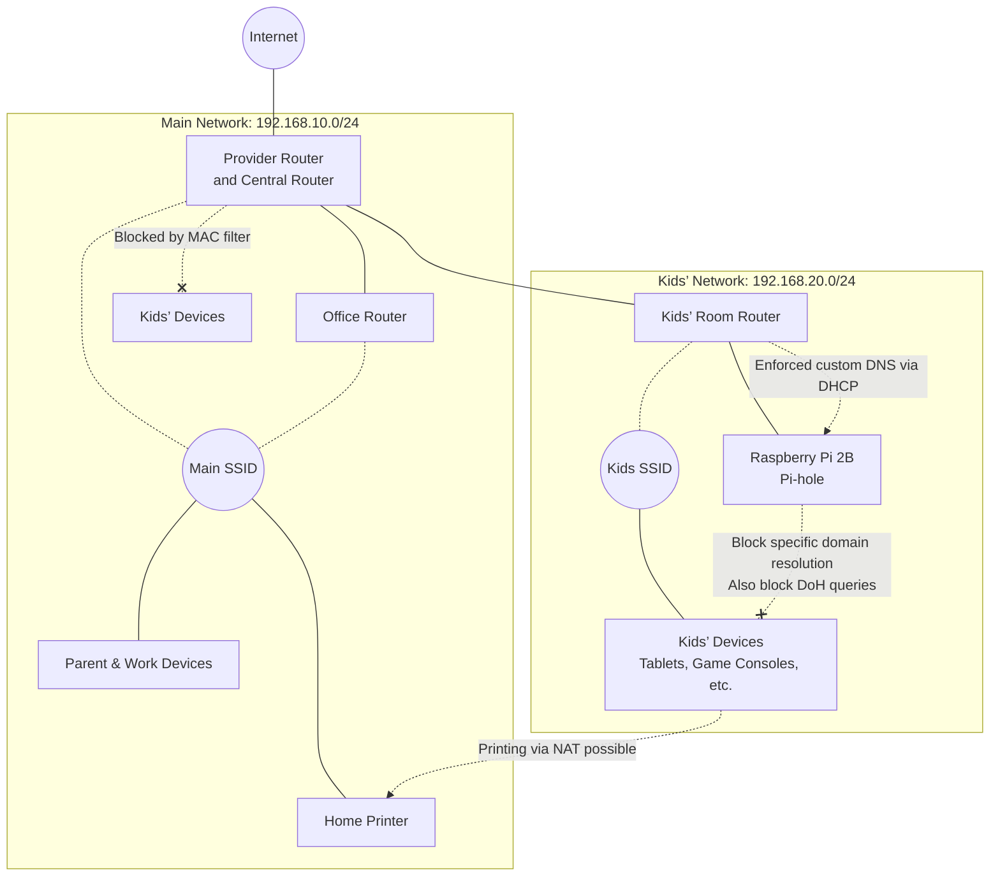

## Introduction
Hello. In the project I participate in, we use a “Nico Nico Calendar” in our daily morning stand-up meetings to share each person’s condition (fully cheerful, somewhat cheerful, normal, a bit tired, quite tired, like hell, etc.).  
The other day, because I entered “a bit tired” as my mood and “lack of sleep” as the reason, my teammates worriedly asked, “Has your sinusitis flared up again?” So I casually replied, “Actually, my sinusitis is under control these days, but I’ve been up all night tinkering with our home network to restrict the kids’ internet…,” and unexpectedly received the request, “That’s interesting—please write an article about it!”

Since I’ve been writing mostly articles related to cloud certifications (such as Zenkanki), I thought, “Maybe I’ll write a non-certification lighthearted article this time,” and decided to pick up the pen.  
Unlike my other articles on this site, this one uses a somewhat old-fashioned combination of technologies, but I hope you’ll enjoy reading it as a change of pace.  
Nevertheless, getting hands-on experience with the gritty fundamentals of networking (subnets, DHCP, DNS mechanisms, etc.) is extremely useful as a foundation when designing and building cloud environments or taking cloud certification exams—**I, who am “almost” a full-suite cloud-certified professional, guarantee it!**

For all you IT engineers out there, many of you might be struggling with how your children interact with the internet and games. Here, I’ll introduce the problem that occurred in my household and the “serious network measures” I, as an engineer parent, implemented.  
(*Note: The IP addresses, subnets, and other network information presented in this article have been altered and obfuscated from their actual values for security reasons.*)

## Our Home Network Situation and the Origin of This Issue
First, here’s the background of our home situation (living environment, family composition, working styles):

* Family composition and working styles  
  * Children: Two—one in middle school and one in elementary school  
  * Wife: Occasionally teleworks from home  
  * Me (author): Always fully teleworking from my home office  
* Living environment: 4DK (four rooms plus dining/kitchen)  
  * There’s intense interference from surrounding houses, making the 2.4 GHz band (802.11g, etc.) unusable  
  * Therefore, we need to primarily use the 5 GHz band (802.11a/ac/ax, etc.), which is faster but weaker against obstacles  
  * Also, because both my wife and I need stable Wi-Fi anywhere in the house for telework (web conferences, etc.), “stable Wi-Fi coverage throughout the house” is a must  
  * As a result, we needed a total of three Wi-Fi routers to cover the physical distances and walls to each room  

The children each have tablets provided by their school. The elementary school child brings theirs home once a week for homework, but the middle school child always leaves theirs at home.  
By the way, the smartphone I gave them is an Android device, for which I’ve strictly limited usage times using Google’s “Family Link” feature.

However, one day I discovered that one of the kids was bringing the “school tablet”—which I had overlooked—into their bedroom and playing games there late at night. This led to a vicious cycle of sleep deprivation, being unable to wake up in the morning, and frequently skipping club activities.  
(Note: The school tablet is managed via Google Workspace, but as a parent, I’d really like Google Workspace to allow us to restrict which apps can be installed and which sites can be visited…)

Realizing this was no good, I initially implemented the following measures to restrict devices other than smartphones:
* Used the Wi-Fi router’s kid control feature to limit allowable usage times  
* Separated access points by running three routers: the provider-supplied router and two Buffalo home routers  
  * Set the central router (provider-supplied) and the router in my office to the same main SSID  
  * Set the kids’ room router to a separate “Kids SSID”  
* Had all children’s devices—game consoles, school tablets, and the Challenge Touch (Shinken Zemi)—connect to the “Kids SSID”

At this point, the network wasn’t segmented; everything operated on the same main network (e.g., `192.168.10.0/24`).

## A Never-Ending Game of Whack-a-Mole
Just when I thought I could relax after the initial measures, I found that during the times allowed by the kid controls on weekdays, the kids spent their time watching YouTube or playing games instead of studying.

To make matters worse, I discovered that they had somehow connected to the “main SSID” again and were taking their devices back to bed. Even though smartphones were restricted by Family Link, other devices served as loopholes, defeating the purpose. Sleep deprivation kept them from going to club activities and they weren’t studying either… I decided I couldn’t rely on their self-control and opted for a fundamental network overhaul.

You might think, “Why not just assign the Pi-hole’s DNS only to the kids’ devices via DHCP?” However, most consumer routers don’t have such advanced DHCP features, and if devices are on the same subnet, they can simply override the DNS settings manually. By physically and logically segmenting the network (subnets), we focused on “edge control” to eliminate escape routes completely.

## The Fundamental Measures We Implemented (Serious Setup)
As an engineer parent, I reconfigured our network to physically and logically seal off loopholes.

Originally, I considered the drastic measure of ejecting the kids’ devices entirely onto the cable TV line’s separate network (which comes free with our rental unit) to achieve physical line separation. However, since it’s a free line with terribly slow download speeds, it would interfere with remote classes and research work, defeating the main purpose. Thus, I chose to design a logically secure network that still leverages our main high-speed line.

In our home, we use **the provider-supplied router plus standard Buffalo home routers**. Countless times during the design process, I looked up at the ceiling and thought, “If only I could use VLANs, how easy this would be…” If we had an enterprise-grade multifunction router, we could have used VLANs for elegant logical segmentation. But the sub-theme was “assemble everything with what we have at home in one night,” so with just our consumer-grade gear, we **pulled an all-nighter of gritty setup**.

:::info
**💡 Note: What is a VLAN (Virtual LAN)?**  
A VLAN lets you logically separate networks safely inside network devices (switches and routers) without changing physical cabling or router connections. With VLANs, you don’t have to manually segment subnets using multiple physical routers in a clunky way.
:::

While working, I suddenly snapped back to reality late at night thinking, “This reminds me of building in-house infrastructure at the company I was at before joining Mamezou...,” but the measures I implemented were as follows:

1. MAC address filtering  
   Set up a blacklist of MAC addresses on the central router to block the kids’ devices from directly connecting to the main SSID.
2. Subnet isolation  
   Built the kids’ SSID router on a separate subnet under the main network (e.g., `192.168.20.0/24`) to logically isolate the networks. Since the kids’ subnet is NAT’ed under the main subnet, they can still communicate with devices placed on the main subnet (e.g., home printers).
3. Custom DNS with Raspberry Pi (Pi-hole)  
   While consumer routers can block specific domains, they lack the flexibility to continuously import and use vast community-maintained blocklists. So, I deployed a Raspberry Pi on the kids’ subnet running Pi-hole to build a dedicated DNS server with powerful domain filtering. (Don’t ask why I had a Raspberry Pi at home—I grabbed whatever unused parts I could and ended up using an older Raspberry Pi 2B.)
4. Enforced custom DNS via DHCP  
   Changed the DHCP settings on the kids’ router to distribute the Pi’s IP address as the DNS server.
5. Block specific domains and forward allowed queries (Upstream DNS)  
   Configured Pi-hole to blackhole all DNS queries related to game and video sites. Allowed legitimate queries (e.g., educational sites) are forwarded from Pi-hole to upstream public DNS servers like Google DNS (`8.8.8.8`) or Cloudflare DNS (`1.1.1.1`), ensuring only safe traffic passes.
6. Countermeasures against encrypted DNS (DoH/DoT)  
   The school tablet uses DNS over HTTPS (DoH), so filtering only standard port 53 traffic leaves a loophole. Therefore, I added rules to block traffic to major public DNS services like Cloudflare’s encrypted DNS endpoints.  
   :::info
   **💡 Note: DoH (DNS over HTTPS) – The Administrator’s Nightmare**  
   Traditional DNS traffic (port 53) is unencrypted, so devices like Pi-hole placed along the path can easily monitor and block unwanted queries. However, in recent years, many operating systems and browsers default to using DNS over HTTPS (port 443) for privacy protection. This makes DNS look like ordinary HTTPS traffic, unintentionally bypassing local DNS servers. While great for privacy and security, it’s a formidable challenge for anyone managing a home network.
   :::

Here’s our final home network configuration diagram:

## Future Prospects and a Parent’s Dilemma
As of now, this setup completely prevents the kids from late-night net surfing.

As a parent, ideally I’d like to rely on the kids’ self-restraint rather than locking everything down with a system like this. But in the current situation, I had no choice but to make the system restrictions stricter.

Of course, this setup isn’t perfect. Since we still allow standard external DNS traffic (UDP port 53) from the kids’ subnet, if the kids learn enough to manually set Google DNS (`8.8.8.8`, `8.8.4.4`) on their devices in the future, they could bypass these restrictions. We’ll need to consider additional measures if that happens.

…That said, if they acquire the knowledge and skills to understand this level of network architecture and bypass the restrictions on their own, as an engineer parent, I might even feel, “Well, that’s a good thing in the end?” It’s a mix of complicated emotions. Someday, I hope they’ll be able to manage and control all of this by themselves without any restrictions.

## Conclusion
This experience made me keenly aware that home network architecture needs to be reviewed according to requirements (family members’ working styles, children’s usage and literacy, available equipment). I hope this article serves as a reference for anyone facing similar concerns.
