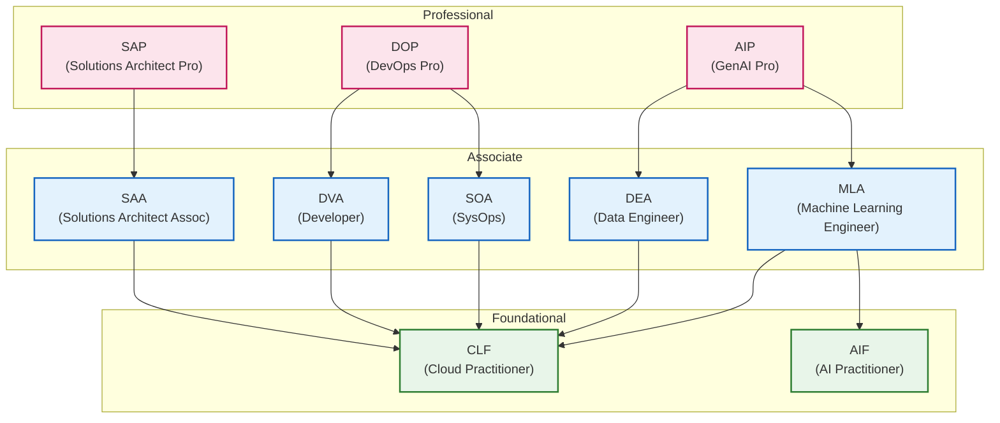

## Introduction

In [the previous article](/blogs/2026/04/13/google_cloud_all_certified_revenge/), I reported that I had overcome the Professional Security Operations Engineer (PSOE) exam—a major hurdle in Google Cloud certifications—and achieved my long-cherished goal of completing the full set of Google Cloud certifications.

This time, the only AWS certification I hadn’t yet obtained—the latest “AWS Certified Generative AI Developer – Professional (AIP-C01)”—was officially released on April 14, 2026, so I took the exam right away. The result: I **passed**! With this, I was finally able to achieve the goal I had set: **achieving dual full crowns across AWS & Google Cloud**.

In this article, I’ll reflect on my failure in the beta exam, share the strategies I used for my rematch, and summarize my impressions of the official release exam.

:::info
Please note that due to a nondisclosure agreement (NDA), I cannot discuss detailed exam content. Also, the information presented here is as of April 2026.
:::

## Exam Overview: AWS Certified Generative AI Developer - Professional

The AWS Certified Generative AI Developer – Professional (AIP-C01) is a professional-level certification aimed at those in the GenAI developer role. It tests the practical knowledge required to effectively integrate foundation models (FMs) into applications and business workflows, and to implement GenAI solutions in production using AWS technologies.

The main content domains and their weights are as follows:

- Content Domain 1: Foundation model integration, data management, compliance (31%)
- Content Domain 2: Implementation and integration (26%)
- Content Domain 3: AI safety, security, governance (20%)
- Content Domain 4: Operational efficiency and optimization of GenAI applications (12%)
- Content Domain 5: Testing, validation, troubleshooting (11%)

The exam consists of 75 questions (10 of which are unscored), and the passing score is 750 or above on a scaled score ranging from 100 to 1,000.

## Causes of Failure and Issues in the Beta Exam

I actually took the beta exam for this certification in December 2025, but unfortunately, I experienced the frustration of **failing**. As I mentioned in my retrospective at the time, the main reasons for my failure were the following:

- **Time shortage caused by long-form questions**: I was overwhelmed by the extremely lengthy question stems and options characteristic of the professional level. It took too much time to quickly piece together the requirements and the architecture diagram from complex scenarios combining multiple services, and I used up my time until the last minute.
- **Lack of practical knowledge for production environment operation**: In a configuration centered around Amazon Bedrock, decisions based on best practices regarding scalability, security, cost optimization, etc., were required, but I couldn't narrow down the optimal choice from multiple seemingly correct options.

## Strategies for the Rematch

Building on my previous reflections, I concentrated on the following measures to prepare for the official exam rematch:

- **Reviewing the exam guide and deepening domain knowledge**: I re-examined the core technical elements covered in the exam guide, such as vector store and RAG design, prompt engineering application, and implementation of agentic AI solutions.
- **Studying best practices for related services**: I visualized real application architectures using Amazon Bedrock and deepened my understanding of the service suite that integrates with it, including AWS Lambda, Amazon API Gateway, and Amazon CloudFront. I also focused on learning AI safety and governance through Amazon Bedrock guardrails and data protection using services such as Amazon Comprehend.
- **Dealing with long-form scenarios**: I consciously practiced quickly identifying, from long passages, what the requirements are and what the constraints are (e.g., cost-priority vs. latency-priority), and visualizing the architecture diagram.

## Trends in Technical Topics Covered on the Actual Exam

Through this exam, I felt that not only knowledge of Generative AI features but also practical insights directly tied to enterprise production operations were deeply tested. Within the confines of the NDA, I will share several themes that I found particularly important:

- **Use cases with strict compliance requirements**  
  Scenarios involving highly sensitive data in industries such as finance, healthcare, and research institutions appeared frequently. It wasn't enough to simply use AI; you also needed to address regulatory compliance aspects such as how to ensure data residency (the principle of not transferring data out of a specified region).

- **Data protection and ensuring safety**  
  Implementation methods for guard mechanisms to safely deliver AI services—such as anonymization of PII (personally identifiable information) using Amazon Comprehend and filtering inappropriate expressions (violence, hate speech, etc.) via Amazon Bedrock guardrail features—were required knowledge.

- **Efficient operations and governance**  
  It was asked how to incorporate into the architecture strategies for per-department permissions and cost allocation (via IAM or tagging) when sharing a platform across multiple departments. Another important theme was configurations that allow switching foundation models (FMs) on the backend flexibly—without modifying application code—depending on the situation.

- **Prompt management and automated live evaluation/alerting**  
  Beyond using Amazon Bedrock prompt management for prompt version control and approval workflows for production deployment, deep knowledge was required for quality monitoring operations post-release, such as continuously and automatically evaluating live AI response results against business metrics and detecting quality degradation to trigger alerts (anomaly detection via CloudWatch).

- **Permission management and private network connectivity in a multi-account environment**  
  In an enterprise scenario with multiple accounts—such as separate application and data lake accounts—the exam frequently asked how to configure secure cross-account permissions. It also covered network architectures for invoking AI APIs within a private network (avoiding the public internet) via VPC endpoints (AWS PrivateLink), and so on.

- **MLOps specific to generative AI (LLMOps)**  
  Some questions required MLOps knowledge—automating the pipeline of “data augmentation → model retraining/assessment → testing → deployment” in the context of foundation model fine-tuning and RAG operation.

- **Enhancing generative AI UX and front-end integration**  
  Practical architectures to improve application user experience (UX), such as integration using Amplify AI Kit or use cases where AI-generated results are stream-processed via Amazon API Gateway and returned to the front end, were also tested.

- **Designing human-in-the-loop (HITL) workflows**  
  Not only full automation by AI but also workflow design methods for ensuring operational safety—such as using AWS Step Functions to have a human review and approve foundation model responses in a human-in-the-loop process—were tested.

- **Selecting the optimal vector database based on purpose**  
  In building RAG (retrieval-augmented generation), the design ability to determine the most appropriate vector database—rather than uniformly choosing Amazon OpenSearch Serverless, assessing Amazon Aurora PostgreSQL (pgvector), Amazon DocumentDB, etc., based on existing data characteristics and use cases—was evaluated.

- **Architecture selection according to processing time**  
  Accurately differentiating resources based on estimated processing time was also an important theme: if a process would complete quickly, use AWS Lambda; for longer asynchronous flows, use AWS Step Functions or Amazon EKS; and for self-driving architectures, leverage AI agents (e.g., Agents for Amazon Bedrock).

- **Caching strategies for cost and latency optimization**  
  Under requirements for improving response speed and reducing API costs, configurations that straightforwardly leverage the foundation model’s built-in prompt caching feature—rather than custom solutions like saving inference results in Amazon ElastiCache or DynamoDB—tended to be the optimal choice.

- **Choosing monitoring methods according to purpose (audit vs. metrics)**  
  Under monitoring requirements, it was important operational knowledge to precisely use the appropriate AWS service and architecture depending on whether you need to track operational history—who used which API and when (audit with AWS CloudTrail)—or monitor performance trends such as increased LLM response latency or token usage (metrics monitoring and alerts with Amazon CloudWatch).

- **Resilience and monitoring for quota exceeded**  
  As a countermeasure when reaching per-hour usage limits (throttling) of AI services, exam questions covered implementing retries using exponential backoff and constructing systems to properly monitor quota limits with Amazon CloudWatch and send alerts—architectures that enhance system availability.

- **Cross-region inference for load balancing**  
  Related to the above quota-exceeded countermeasures, the exam tested the very practical optimization approach of using Amazon Bedrock’s “cross-region inference” profile to automatically route and load balance requests across multiple regions to avoid temporary throughput degradation caused by a surge in traffic in a specific region.

In the professional-level exam, three to four of these considerations are intertwined in a single long-form scenario. Therefore, to choose the optimal design among confusing options, you need comprehensive skills to quickly identify the highest-priority requirements for the given problem and accurately judge in a short time whether each option meets those requirements.

## Exam Impressions (Finally Achieved Dual Full Crowns!)

In this rematch exam, my time management for long-form questions improved, and I was able to calmly parse the scenarios more than in the beta exam. Through extensive study, I had become confident in narrowing down options based on considerations such as cost-performance trade-offs, responsible AI implementation, and operational efficiency optimization, which made a big difference.

And the result was a **pass**. I was finally able to fill the gap in my AWS certifications! Since I had just completed the full set of Google Cloud certifications on April 11th, I was overwhelmed with emotion by the back-to-back good news.

## [Aside] Automatic Renewal of Lower-Level Certifications with AIP Pass

For AWS certifications, as noted in the [official recertification program](https://aws.amazon.com/jp/certification/recertification/), there is a nice feature where passing a higher-level certification automatically renews related lower-level certifications.

This time, I wasn't sure which Associate and Foundational certifications would be renewed upon passing AIP, as this detail hadn't been specified on the official page (as of the time of writing). But now that I've actually passed, I finally discovered the details!

As a result, passing the AIP automatically renewed four certifications at once: **DEA (Data Engineer), MLA (Machine Learning Engineer), AIF (AI Practitioner), and CLF (Cloud Practitioner)**.

The correlation of renewal relationships across each tier (Professional, Associate, Foundational) can be organized and diagrammed as follows. When you pass the certification at the base of an arrow, the certification at the arrowhead is renewed.

Since AIP deeply covers both generative AI and data processing, it automatically renews multiple recently added Associate certifications like DEA and MLA. Especially, the three certifications—DEA, MLA, and AIF—were newly introduced in 2024 and I had earned them one after another; they were due for renewal next year, so having them all renewed at once by passing this exam was a big help. For someone maintaining multiple certifications, this renewal feature is truly appreciated.

## Conclusion

**All 13 AWS certifications and all 14 Google Cloud certifications**—this marks a significant milestone in my long journey of tackling cloud certifications.

I believe that systematically studying both major cloud platforms—AWS and Google Cloud—will undoubtedly provide a strong foundation for future work designing and proposing solutions in multi-cloud environments. First, to consolidate this experience and knowledge, I plan to actively write articles such as **"Contrasting the architectural philosophies and approaches of AWS and Google Cloud"** and share these insights with everyone.

Moreover, beyond merely holding certifications, through continuous contributions and information sharing on developer sites like this, I aim to further contribute to the spread of cloud technology and community development, with an eye toward being recognized as **"Top Engineer"** in the future.

(Having obtained so many certifications in a short period, I'm deliberately averting my eyes from the "terrifying renewal rush that's bound to hit all at once a few years from now"...)

I hope this is helpful to those who will be taking on cloud certifications in the future!
