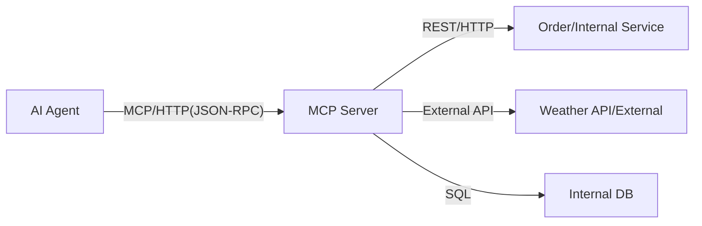
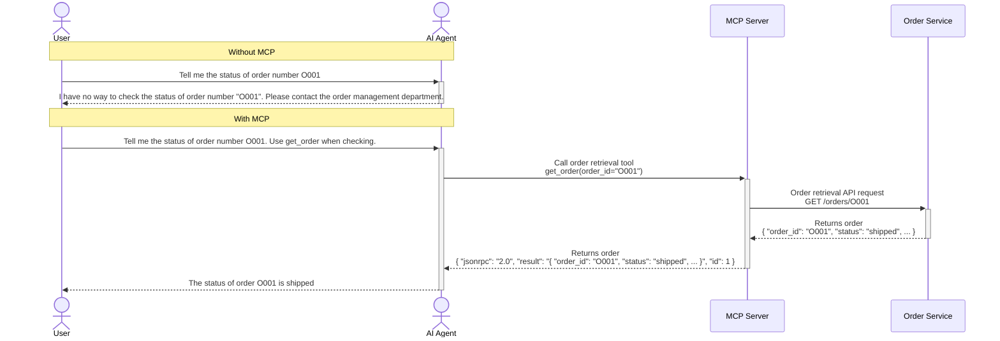

## Introduction

In this series, we explain MCP (Model Context Protocol) from basics to implementation in stages.  
This content is intended for those who want to equip AI agents with knowledge of internal corporate systems and external APIs.

This time, we will explain MCP itself.  
We plan to cover implementations for each transport (stdio, Streamable HTTP), automatic generation of MCP, and more in the future.

## Why is MCP necessary?

AI agents (Claude, GPT-4, Gemini, etc.) possess vast knowledge, but they cannot directly access "real-time data" or "internal system information."  
For example, even if you ask an AI about the "most recent order status" or "inventory count," it cannot answer if this information is not included in its training data.

MCP is the mechanism to overcome this "knowledge barrier."  
By using MCP, AI agents can safely integrate with internal and external systems and databases.  
At the same time, it is an important challenge to consider integrating authentication and authorization (access control) into your own schemes.

## What is MCP?

MCP is a specification for AI agents to communicate with external services, first released by Anthropic in November 2024. ([Official site](https://modelcontextprotocol.io))  
By using MCP, AI agents can effectively use functionalities of external services.  
An MCP server refers to a server that implements the MCP protocol so that an AI agent can communicate with external tools and data sources.  
An MCP client refers to a user of the MCP server, such as an AI agent.  

*MCP acts like a "hub connecting AI agents and internal/external services."*

| Item            | MCP                                                                        |
|-----------------|----------------------------------------------------------------------------|
| **Protocol**    | JSON-RPC 2.0 over stdio or HTTP/SSE (Streamable HTTP)                      |
| **Data Format** | JSON (JSON-RPC 2.0)                                                        |
| **Endpoint**    | Single endpoint (`/mcp` only)                                              |
| **Operations**  | JSON-RPC methods (`tools/list`, `tools/call`)                              |
| **Errors**      | JSON-RPC errors (code, message)                                            |

:::info: SSE (Server-Sent Events)
A mechanism that maintains an HTTP connection and sequentially sends events from the server. (`text/event-stream`)  
In MCP, it is used for incrementally returning tool call results and stream responses.
:::

## Main Roles of an MCP Server

The main roles of an MCP server are as follows.  
It can be said to be like a BFF (Backend for Frontend) version for MCP clients.

* Protocol translation (MCP ⇔ REST)  
* Authentication and authorization  
* Rate limiting  
* Audit logging  
* Routing  
* Error handling  
* Response transformation and composition  

## Benefits of an MCP Server

AI agents cannot utilize the latest data or external data that is not included in their training data.  
By exposing tools in an MCP server that allow access to external tools and data sources, agents can respond based on real-time data.

**Examples of MCP usage**
* When an AI chatbot is asked "What is the shipping status of order number O001?", it queries the internal order management system via MCP and returns the latest information.  
* An internal FAQ bot retrieves necessary information from the HR system and attendance database through MCP to answer employee questions.  
* Integrating with external APIs (weather, exchange rates, etc.) so that AI can provide advice based on real-time data.

## Types of Transports (Communication Methods)

MCP transports include `stdio` and `Streamable HTTP`.

### stdio (Standard Input/Output)

A method where the MCP client (such as an AI agent) starts the MCP server as a subprocess and communicates in a local environment.

* Communication  
  * Data format: Newline‐delimited JSON‐RPC messages. Because newlines are used as delimiters, messages cannot contain newlines.  
  * Transmission: Uses standard input/output (stdin/stdout).  
  * Session termination: The client closes the input stream or the process exits.  
* Use cases  
  * Allow AI agents running on a personal PC to manipulate local resources (files and tools).  

### Streamable HTTP

A method where the MCP server runs as an independent process and accepts connections from multiple MCP clients through a single HTTP endpoint.

* Communication  
  * Combination of POST and SSE: Requests from clients are sent via POST, and responses or notifications from the server are streamed using SSE.  
  * Asynchronous, quasi‐bidirectional communication: By using GET to open an independent receive stream, the server can send notifications spontaneously at any time.  
  * Recovery and state management: Features for reconnecting from where you left off using `Last-Event-ID` if the network disconnects, and session management using the `MCP-Session-Id` header.  
* Use cases  
  * Remote server usage: Suitable when using server functionalities (cloud databases, external APIs, etc.) over a network.  
  * Multi-client usage: Effective in a web service-like architecture when multiple MCP clients want to use one MCP server.  

:::info: `MCP-Session-Id`
An ID that manages the exchange (session) between the client and the server.

In Streamable HTTP, the server issues a session ID (UUID, JWT, etc.) upon initialization.  
From then on, the client must include this value as the `MCP-Session-Id` header in all HTTP requests (POST and GET).
:::

:::info: Last-Event-ID
An ID that ensures continuity of SSE stream communications opened within a session.

Each event on the SSE stream that sends messages from the server to the client has an ID.  
When the stream is disconnected, the client can reconnect from where it left off by using the `Last-Event-ID` header to inform the server of the "last received event ID."
:::

## Future Developments

In this series, we will explain MCP fundamentals and practical implementation methods.  
We plan to cover differences by transport, utilization of auto-generation tools, and more in stages.  
Our goal is to make "integration between AI agents and systems more accessible."  
Stay tuned for the next installment.
