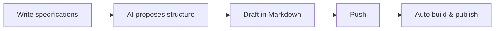

## Introduction

This is Ishida from the Agile Group.

Recently, on March 24, I spoke at [Mameyose "Considering AI Utilization for Scrum Masters – A Practical Approach to Strengthening the Three Pillars: Transparency, Inspection, Adaptation"](https://mamezou.connpass.com/event/386346/). Thank you very much to everyone who attended this milestone 50th event. Once again, I felt how much attention is focused on the combination of Scrum Masters and AI.

In my talk, I mainly discussed how Scrum Masters can utilize AI, but I also touched on AI-assisted presentation creation. This article will introduce that content in more detail.

I have published a template repository for presentation creation on [GitHub](https://github.com/mamezou-ishida/mamezou-presentation). For detailed usage, please refer to the repository’s README. In this article, I will focus on the “benefits of creating presentations with AI” and the “features of the template.”

## What Does It Mean to Create Presentations with AI?

### Traditional Presentation Creation Challenges

Creating presentation materials takes surprisingly long. If you outline the general flow, you often follow steps like these:

1. Organize what you want to convey and plan the structure  
2. Draft the content for each slide  
3. Adjust layout and design in PowerPoint or Keynote  
4. Review and revise repeatedly  

Among these, you tend to spend a lot of time especially on **1. Planning the structure** and **3. Polishing the design**. Planning from scratch can easily stall you, and once you start refining the design, there’s no end to it.

### How AI Changes This

By leveraging generative AI, you can address the above challenges as follows:

- **Generating structure proposals**: Simply provide a requirement like “I want to present about XX” and receive suggestions for chapter divisions and an outline.  
- **Draft generation of slide text**: Once the structure is decided, you can leave the bulk of the slide text to AI.  
- **Conversion from specifications/requirements**: You can input existing documents like specs or meeting minutes and have them summarized and restructured for a presentation.  

Another important point is that AI, which excels at text generation, pairs well with Markdown. Writing slides in Markdown allows you to request content generation and revisions as a natural extension of conversation. There is no need to manipulate binary files like in PowerPoint, and diff management becomes easier.

## Introduction to the Template Repository

[mamezou-presentation](https://github.com/mamezou-ishida/mamezou-presentation) is a presentation template for Mamezou that combines **Marp + GitHub Actions + GitHub Pages**. It is released under the MIT License, so external parties can freely use and modify it.

### Main Structure of the Repository

```
mamezou-presentation/
├── presentation/
│   ├── 01_intro.md        # Slides (concatenated in numerical order)
│   ├── 02_main.md
│   └── ...
├── images/
│   └── title.svg          # Image for title slide
├── mamezou-theme.css       # Mamezou brand theme (purple)
└── .github/workflows/      # Auto build/deploy settings
```

Slides are managed by splitting them into files in the format `presentation/NN_name.md`, which are then concatenated in numerical order. There is no need to cram all slides into a single file, making it easier to manage by dividing files by section.

## Features of the Template

### Publish with Just a Push

The standout feature of this template is that **just pushing to the main branch automatically generates HTML/PDF and publishes them to GitHub Pages**.

You don’t have to remember commands like “How do I run the build?” or “How do I export to PDF?” Just write Markdown and push, and the presentation deliverables are automatically prepared.

```
git add presentation/01_intro.md
git commit -m "Add slide"
git push origin main
# → GitHub Actions triggers and automatically generates and publishes HTML/PDF
```

### Real-Time Preview with VS Code + Marp Extension

For local development, using the [Marp for VS Code](https://marketplace.visualstudio.com/items?itemName=marp-team.marp-vscode) extension in VS Code lets you preview slides in real time as you edit Markdown. You can quickly iterate through the “write → check → revise” cycle.

### Integration with AI Workflow (GitHub Spec Kit)

This template supports AI workflows via **GitHub Spec Kit**. It integrates with Gemini CLI and Claude Code, allowing you to proceed with AI-driven slide creation using the following commands:

| Command             | Description                                                                          |
|---------------------|--------------------------------------------------------------------------------------|
| `/speckit.specify`  | Organize the presentation requirements (what to convey) together with AI            |
| `/speckit.plan`     | Generate slide structure proposals based on the specifications                      |
| `/speckit.tasks`    | Break down into individual slide creation tasks                                     |

By writing “what to talk about” as specifications, AI proposes the skeleton of the slides. Humans can then focus on review and fleshing out the details, leading to higher-quality presentations in less time.

Additionally, by leveraging the Spec Kit’s **[Constitution](https://github.com/mamezou-ishida/mamezou-presentation/blob/main/.specify/memory/constitution.md)** (rules and constraints), you can unify the tone and style of the AI-generated text. Defining rules as a Constitution ensures a consistent style across multiple slides. For example, this template defines the following rules:

- Use a plain tone (da/dearu style) for slide body text (introductory sections may also use the desu/masu style)  
- Avoid Japanese quotation marks (「」) for emphasis; use the HTML `<strong>` tag  

### Automatic Diagram Conversion (Mermaid → PNG)

If you place Mermaid format (`.mmd`) files in the repository, GitHub Actions automatically converts them to PNG, making them ready for embedding in slides.



Managing diagrams as text makes them ideal for version control.

### Presenter Mode & Timer Features

It also includes features to support the live presentation:

- **Presenter Mode**: Press the `p` key in the browser to switch to presenter mode with speaker notes.  
- **Countdown Timer**: A timer app, created using AI, to manage presentation time; customizable alongside the agenda.  
- **JavaScript Extensions**: Since the slides are HTML-based, you can embed JavaScript for high levels of customization, such as creating shortcuts to each section.  

## Summary of AI Presentation Creation Benefits

To summarize the above content, creating presentations with AI offers the following benefits:

| Benefit             | Description                                                                 |
|---------------------|-----------------------------------------------------------------------------|
| **Speed**           | Since AI generates structure proposals and drafts, ramp-up is fast           |
| **Quality**         | AI proposes a comprehensive structure with few omissions                    |
| **Consistency**     | The template ensures the same quality of design every time                  |
| **Reproducibility** | Markdown makes version control and diff checking easy                       |
| **Focus**           | You can concentrate on “what to convey” rather than design                   |

The ability to “focus” is particularly significant. With AI and the template, design uncertainty disappears, allowing you to concentrate on content quality.

## Conclusion

This time, prompted by the talk at Mameyose, I introduced efforts to create presentations using AI.

The template repository is released under the MIT License, so external parties can freely use and modify it.

- Repository: [mamezou-ishida/mamezou-presentation](https://github.com/mamezou-ishida/mamezou-presentation)

If you’d like to try it or have feedback or requests like “I want to try this” or “It would be great if this feature existed,” feel free to open an issue on GitHub. Give AI- and Markdown-based presentation creation a try.
