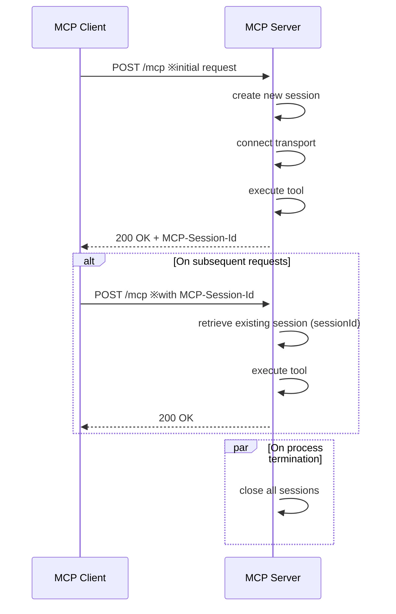

## Introduction

This page is a continuation of "Introduction to MCP Connecting AI Agents and Systems".  
In this article, we explain the stateful implementation of an MCP server communicating over StreamableHTTP.

A stateful configuration is useful when you want to treat consecutive operations by the same user as a single session.  
For example, it's used for "passing the results of a tool invocation to the next invocation", "holding temporary state per session", or "maintaining contextual information during a connection".

In this article, we focus on the differences from the stateless implementation and outline the key points for a stateful setup.  
The code examples are available [here](https://github.com/ubata-mamezou/developer-site-article-examples/tree/main/mcp-server_http).

:::info: Series Table of Contents
**Series: Introduction to MCP Connecting AI Agents and Systems**
* [Introduction](/blogs/2026/04/24/mcp-impl_introduction/)
* [stdio Implementation](/blogs/2026/05/08/mcp-impl_stdio/)
* [StreamableHTTP Stateless Implementation](/blogs/2026/05/22/mcp-impl_http_stateless/)
* **StreamableHTTP Stateful Implementation (this page)**
:::

## Libraries Used in This Article

* npm@11.11.1
* node@22.22.0
* typescript@6.0.3
* @modelcontextprotocol/sdk@1.29.0
* zod@4.3.6

## Differences from Stateless

First, let's outline the differences in implementation strategies.

|Aspect|Stateless|Stateful|
|---|---|---|
|Server and transport lifecycle|Created and destroyed per request|Created as a connection context per session and reused|
|Session ID|Not used by default|Determined and managed per transport via `sessionIdGenerator`|
|Connection handling|Per request|Once at the first request of a session|
|Termination handling|After response|All sessions together on SIGINT, etc.|

:::info: Relationship between server, transport, and session
If you imagine a single server using one transport to manage multiple sessions, you might be confused when implementing session management.

In the version used here, `McpServer` can only connect to a single `transport` at a time, and `StreamableHTTPServerTransport` can only hold a single `sessionId`. Therefore, this sample manages the server and transport per session.
:::

:::column: What is SIGINT
`SIGINT` is an interrupt signal.  
It is sent to a process when you press `Ctrl + C` in the terminal, and in Node.js you can implement pre-exit handling with `process.on("SIGINT", ...)`.  
Here, it is used to discard connections and state held by the server.
:::

## Server Implementation

We will briefly implement the MCP server and explain the differences from the stateless version.  
For the full code, see [here](https://github.com/ubata-mamezou/developer-site-article-examples/blob/main/mcp-server_http/src/index.stateful.ts).



### Difference 1: Maintaining Session Context

In the stateless version, a new context was created for each request. In the stateful version, the connection context is retained using the session ID as the key. Here, `SessionContext` does not refer to the MCP server process itself, but rather to the session-level implementation context aligned with the SDK's connection model.

```ts
type SessionContext = {
  server: McpServer;
  transport: StreamableHTTPServerTransport;
};

const sessions = new Map<string, SessionContext>();
```

:::info: Managing state in a production environment
For simplicity, this example manages state in memory. In a real-world scenario, it is safer to consider using an external store such as NoSQL to prevent memory leaks and to support operations in a distributed environment.
:::

### Difference 2: Routing Requests by Session

If there is an existing session ID, the corresponding context is used; otherwise, a new session context is created.

* `sessionIdGenerator`  
  Despite what the name might suggest, this is not a generic numbering strategy. It is a callback to determine the session ID tied to the transport at initialization.

* `MCP-Session-Id`  
  Issued on the first request and received by the client. For subsequent requests, it is included in the `MCP-Session-Id` header and reused.

```ts
async function createSessionContext() {
  const transport = new StreamableHTTPServerTransport({
    sessionIdGenerator: () => randomUUID(),
  });
  const server = createServer(() => transport.sessionId);
  await server.connect(refineTransport(server, transport));
  return { server, transport };
}

app.post("/mcp", async (req, res) => {
  const sessionId = req.headers["mcp-session-id"] as string | undefined;
  let context: SessionContext | undefined;

  if (sessionId) {
    context = sessions.get(sessionId);
  } else {
    context = await createSessionContext();
  }

  await context.transport.handleRequest(req, res, req.body);

  // After initialization, store the context keyed by the sessionId set on the transport.
  const issuedSessionId = context.transport.sessionId;
  if (issuedSessionId) {
    sessions.set(issuedSessionId, context);
  }
});
```

### Difference 3: Closing All Sessions on Process Termination

Since the server and transport are held per session, all sessions must be explicitly closed on termination.

```ts
process.on("SIGINT", async () => {
  for (const context of sessions.values()) {
    await context.transport.close();
    await context.server.close();
  }
  process.exit(0);
});
```

:::info: Session termination in production
In this sample, all sessions are closed together when the process terminates. In a production environment, it is also important to automatically discard sessions that have been idle for a certain period or provide a mechanism for clients to explicitly end sessions.
:::

## Verifying Session Management

We add a `counter` tool that retains a value per session to verify that the values are kept per session. Since this verification requires multiple sessions, we use both the MCP Inspector and Postman.  
* MCP Inspector results  
    
* Postman results  
    
These are the results of running the tool 3 times from MCP Inspector and 2 times from Postman.  
As you can see in the figures, different session IDs are issued, and the incremented values for the counter are managed per session.

:::info: Where to add MCP in Postman  
Since I was using Postman after a while and was unsure where to add the MCP collection, I'll show the location here.  

:::

## Verifying Session Switching

Restart the MCP server and verify that the session switches.

  
You can see that a different session ID has been assigned and the count has reset to 1.

## Conclusion

* Stateful allows you to maintain state across requests within the same session.  
* On the other hand, making it stateful increases operational responsibilities such as closing on exit and session management. While you would want to use stateful when the order of tool invocations matters, if you prioritize simplicity, choosing stateless is a more realistic decision.
