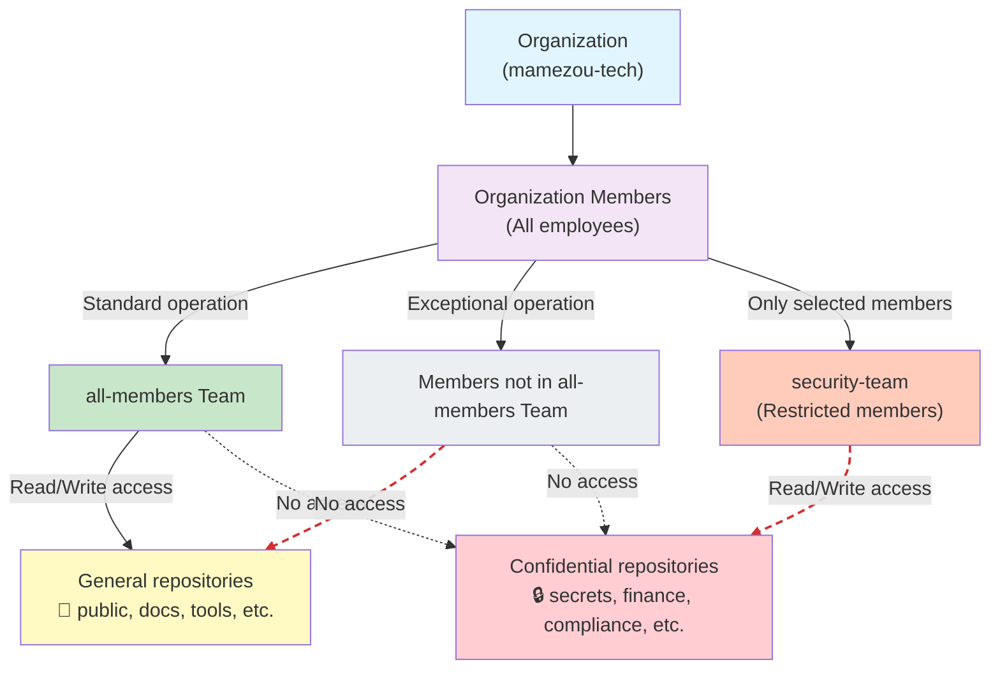

## Introduction

When operating a GitHub Organization, you need to strike a balance between security and usability. The other day, I received a request: “I want to create a repository that holds highly sensitive data, so please change the Organization’s Basic Permission from `write` to `no permission`.”

This request is reasonable, but if implemented as-is, the administrator would have to configure each member’s access permissions individually every time a new repository is created, greatly increasing the administrative burden.

In this article, I will introduce an access management strategy that can be implemented under the restrictions of the Team plan, not the Enterprise plan.

## Defining the Problem

### Environmental Constraints

- Team plan, not GitHub Enterprise  
- Team-based access control is possible, but there are limits to fine-grained settings

### Original Challenges

- The Basic Permission is set to write  
- By default, access permissions are granted for highly sensitive repositories  
- To prevent this, we want to set the Basic Permission to no permission

### Subsequent Challenges

- If you change the Basic Permission to no permission, you need to configure member access for every new repository  
- When adding a new member, repository-by-repository access configuration is also required  
- Administrative work increases exponentially

## Proposed Solution

We decided to ask GitHub Copilot about GitHub, consulted the web version of Copilot, and built a security boundary based on teams within the Organization.

### Overview of Access Management

Below is an overview of the access management structure we built.



In this structure, membership in `all-members` becomes the security boundary that determines access, and Organization members who are not part of it cannot access either general repositories or confidential repositories.

### Basic Strategy: Shifting to a "Whitelist" Approach

We will organize access permissions according to the following policy.

**1. Create a unified team for all members**

Create a team called `all-members` that includes all members. Grant this team access permissions to the general repositories that almost everyone should have access to.

Advantages:
- When adding a new member, they can access the majority of repositories simply by being added to this team  
- No need for default access settings after repository creation

**2. Isolate confidential repositories**

Ensure that high-sensitivity repositories (e.g., configuration data, personal information, trade secrets, etc.) are not visible to the `all-members` team.

Instead, create separate teams composed only of the necessary members (e.g., `security-team`, `finance-team`) and grant access permissions only to those teams.

**3. Set permissions on a per-repository basis**

```
Repository A (General)
  └─ all-members team: read

Repository B (General)
  └─ all-members team: write

Repository C (Confidential: Security)
  └─ security-team team: write
  └─ Specific users: admin

Repository D (Confidential: Finance)
  └─ finance-team team: write
  └─ Specific users: admin
```

## Implementation Steps

### Step 1: Create the all-members team
1. Organization Settings → Teams  
2. Create the `all-members` team via "Create a team"  
3. When adding a new member, select and add this team from the screen  

### Step 2: Configure repository access permissions
1. Go to the repository’s Settings → Collaborators and teams  
2. Add the `all-members` team and set the appropriate permissions (Read/Write)  

### Step 3: Change the Organization’s Basic Permission
1. Organization Settings → Member privileges  
2. Set Base permissions to `No permission`  

### Step 4: Configure confidential repositories individually
1. Do not add the `all-members` team to confidential repositories  
2. Create and add a dedicated team (e.g., `security-team`)  
3. Or add specific users directly  

## Streamline team additions to repositories with automation

When implementing the above strategy, the challenge is ensuring that the `all-members` team is added to both existing and new repositories without omission. You can automate this process using GitHub Actions.

### Implementation Challenges

- After creating a new repository, the addition of the `all-members` team may be forgotten  
- If there are many existing repositories, manually adding them in bulk is laborious  
- There is a possibility of omissions due to repository administrators  

### Automation Mechanism

Using the GitHub API and GitHub CLI, the following processes are executed automatically.

**Example Script**

```bash
#!/bin/bash
set -e

ORG="mamezou-tech"
TEAM="all-members"
DRY_RUN=${DRY_RUN:-false}

if [ "$DRY_RUN" = "true" ]; then
  echo "🔍 DRY RUN MODE - No actual changes will be made"
fi

# Configure repositories to exclude (e.g., confidential repositories)
EXCLUDE_REPOS=(
  "secret-repo-1"
  "confidential-data"
)

# Retrieve list of the Organization's repositories
repos=$(gh api --paginate /orgs/$ORG/repos --jq '.[].name')

success_count=0
skip_count=0
fail_count=0

for repo in $repos; do
  # Skip excluded repositories
  if [[ " ${EXCLUDE_REPOS[@]} " =~ " ${repo} " ]]; then
    echo "⊘ Skipping: $repo (excluded)"
    ((skip_count++)) || true
    continue
  fi

  echo "Adding $TEAM to $ORG/$repo..."

  if [ "$DRY_RUN" = "true" ]; then
    echo "✓ (dry-run)"
    ((success_count++)) || true
  else
    if gh api --method PUT \
      /orgs/$ORG/teams/$TEAM/repos/$ORG/$repo \
      -f permission=push \
      --silent; then
      echo "✓"
      ((success_count++)) || true
    else
      echo "✗ Failed"
      ((fail_count++))
    fi
  fi
done

echo ""
echo "================================"
echo "Repository Sync Summary:"
echo "  Success: $success_count"
echo "  Skipped: $skip_count"
echo "  Failed:  $fail_count"
echo "================================"
```

**Script Highlights**

- `EXCLUDE_REPOS`: Explicitly manage excluded repositories (confidential repositories are listed here)  
- `permission=push`: Grants write permissions (`permission=pull` would grant read-only permissions)  
- `DRY_RUN`: When true, run in simulation mode  
- Perform batch processing via API calls and reduce manual work  

:::info
Initially, Copilot changed the `permission=push` parameter to `write`, which caused the script to fail at runtime. The GitHub API has areas so counterintuitive that even Copilot can get them wrong, so exercise caution.
:::

### GitHub Actions Workflow

```yaml
name: Sync all-members Team

on:
  workflow_dispatch:
  schedule:
    - cron: '0 2 1 * *'  # Run at 2:00 UTC on the 1st of every month
  pull_request:
    paths:
      - '.github/workflows/sync-all-members-team.yml'
      - 'scripts/sync-all-members-repos.sh'

jobs:
  sync-team: 
    runs-on: ubuntu-latest
    
    steps:
      - name: Checkout
        uses: actions/checkout@v6
      
      - name: Add all-members team to repositories
        run: bash scripts/sync-all-members-repos.sh
        env:
          GH_TOKEN: ${{ secrets.ORG_MEMBER_PAT }}
          DRY_RUN: ${{ github.event_name == 'pull_request' }}
```

**Workflow Configuration Highlights**

- `workflow_dispatch`: Allows on-demand manual execution to immediately check for sync omissions  
- `schedule`: Scheduled execution (e.g., on the 1st of every month) to automatically detect sync omissions  
- `pull_request`: Automatically run tests when the script is updated  
- `DRY_RUN`: Simulate changes in pull requests by setting this to true  

**Required Secret Settings**

- `ORG_MEMBER_PAT`: Personal Access Token with Organization repository management permissions  
- Scopes: `admin:org`, `repo`, etc.  

### Best Practices

✅ When updating the script, confirm via automatic execution in the PR before merging  
✅ Manage excluded repositories explicitly with comments  
✅ Use scheduled runs to regularly detect and correct sync omissions  
✅ On-demand sync is possible via manual execution (`workflow_dispatch`)  
✅ Manually execute immediately after creating a new repository to add the team right away  

## Access Verification

It should be set up correctly, but to confirm that the access control is functioning as intended, we asked an Organization member (non-restricted member) to actually open the link to a confidential repository and verified the behavior.

:::column:Slack conversation
👦 kondoh 16:16
I have a small favor to ask; can you tell me what happens when you open this repository?  
https://github.com/mamezou-tech/[private-repo-for-restricted-team]
👧 nakamura 16:27  
It returns a 404.  
👦 kondoh 16:28  
Thanks! Since it’s a highly confidential repository, 404 is perfect. 💯
:::

## Key Points and Cautions

This setup has the following advantages and considerations.

### Advantages

✅ Improve security without changing Basic Permission  
✅ Minimize work when adding new members  
✅ Automatic access to most repositories  
✅ Lower cost compared to GitHub Enterprise  

### Disadvantages and Considerations

⚠️ Confidential repository management is manual work  
⚠️ Requires updates when team composition changes  
⚠️ Requires periodic audits of access permissions  

## Conclusion

Balancing security and operational efficiency is crucial when managing access permissions in a GitHub Organization. Even without the Enterprise plan, you can achieve a certain level of control by leveraging the team features.

The key is to clearly categorize repositories into those that everyone should access and those that should have restricted access. If this categorization is lax, security risks may arise, or the operation may become overly complex, so exercise caution.
