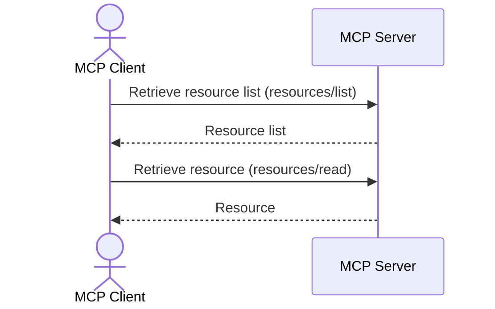

## Introduction

This page is the continuation of "Introduction to MCP Connecting AI Agents and Systems".  
This time, we explain resources.

MCP resources are a feature that provides contextual information (files, guides, specifications, etc.) for the AI model to reference when generating responses.  
While tools are executed by "AI model decision" and prompts are selected by "user intent", resources decide their inclusion in an "application-driven" manner.

The code shown in this article is available [here](https://github.com/ubata-mamezou/developer-site-article-examples/tree/main/mcp-server_http).

:::info: Series Table of Contents
**Series: Introduction to MCP Connecting AI Agents and Systems**
* [Introduction](/blogs/2026/04/24/mcp-impl_introduction/)
* [stdio Implementation](/blogs/2026/05/08/mcp-impl_stdio/)
* [StreamableHTTP Stateless Implementation](/blogs/2026/05/22/mcp-impl_http_stateless/)
* [StreamableHTTP Stateful Implementation](/blogs/2026/06/05/mcp-impl_http_stateful/)
* [Prompt Section](/blogs/2026/06/19/mcp-impl_prompt/)
* **Resources Section (This Article)**
:::

## Libraries and Tools Used

* npm@11.11.1
* node@22.22.0
* typescript@6.0.3
* @modelcontextprotocol/sdk@1.29.0
* zod@4.3.6

## Use Cases

* Sharing development guides: resource-ize coding guidelines and design policies to provide them as premise information during AI generation
* Referencing specification fragments: publish excerpts of API specifications, error code definitions, input constraints, etc. as resources to improve code generation accuracy
* Providing information that switches based on dynamic parameters: using URI templates, provide resources whose content changes based on variable parameters

## Differences Between Tools, Prompts, and Resources

Having covered the main elements of tools, prompts, and resources in previous features, let's recap their roles:

| Element  | Main Role                                  | Controlling Entity       | Identification Method  |
|---       |---                                         |---                       |---                     |
| Resource | Providing data/context (static knowledge)  | Application-driven       | Resource URI           |
| Prompt   | Message/workflow template                  | User-driven              | Prompt name            |
| Tool     | Execution of concrete functions (active actions) | Executed by AI model | Tool name              |

## Types of Resources

MCP resources are divided into two types based on how the URI is provided:

| Type              | Description                                                        | Use Case                                  |
|---                |---                                                                 |---                                        |
| Static Resource   | A resource uniquely identified by a fixed URI                     | Guides, fixed specifications, configuration info, etc. |
| Resource Template | A resource parameterized with a URI template (RFC 6570)            | Information that changes based on variable elements like ID or name |

## Protocol Messages

There are six messages related to MCP resources:

| Message                               | Direction         | Description                                                                 |
|---                                    |---                |---                                                                         |
| `resources/list`                      | Client → Server   | Retrieve the list of available resources (supports pagination)             |
| `resources/templates/list`            | Client → Server   | Retrieve the list of resource templates                                    |
| `resources/read`                      | Client → Server   | Retrieve resource content by specifying the URI                             |
| `resources/subscribe`                 | Client → Server   | Subscribe to change notifications for a specified resource URI (requires capability `subscribe: true`) |
| `notifications/resources/updated`     | Server → Client   | Notify that a subscribed resource has been updated                         |
| `notifications/resources/list_changed`| Server → Client   | Notify that the resource list has changed (requires capability `listChanged: true`) |

※ Note: To verify notifications, you need to set up a separate source for the resources and detect changes on the source side; therefore, it is not included in this sample.



## Data Structures (Data Types)

* Resource Content
  * `uri`: A URI that uniquely identifies the resource
  * `name`: Resource name
  * `title`: Display title
  * `description` (optional): Description of the resource
  * `icons` (optional): List of icons
  * `mimeType` (optional): MIME type of the content. Can specify text or binary (requires Base64 encoding).
  * `size` (optional): Size in bytes
* Annotations: Hints to the client
  * `audience`: Indicates the intended recipient of the resource. Can specify `user`, `assistant`, or both.
  * `priority`: Importance level indicated by a number between 0.0 and 1.0 (1.0 is highest)
  * `lastModified`: Last modification date (ISO 8601 timestamp)

## URI Schemes

Choose the URI scheme for resources according to the purpose:

| Scheme        | Use Case                                         | Notes                                                                                                 |
|---            |---                                               |---                                                                                                   |
| `https://`    | Refer to resources on the web                    | Use when the client can access it directly. When retrieving via the server, consider using a custom scheme. |
| `file://`     | Resources representing a filesystem-like structure | Mapping to an actual filesystem is not required; the source of the value can be anything (DB, external API, etc.) |
| `git://`      | Git resources                                    | Represent Git-specific structures such as commits, branches, paths, etc.                              |
| Custom        | Any resource using a custom scheme               | Must comply with RFC 3986. The sample's `memory://` and `orders://` fall into this category.           |

:::info
**The server must validate all resource URIs**  
This is omitted in the sample, but you must prevent unintended access such as path traversal.

**When representing directories with file**  
It is recommended to specify `inode/directory` (XDG standard) for the `mimeType`.
:::

## Implementation Sample

See the full code [here](https://github.com/ubata-mamezou/developer-site-article-examples/blob/main/mcp-server_http/src/index.prompt-and-resource.ts).

### Registering Static Resources

Example of publishing a resource with a fixed URI.  
Passing a URI string as the second argument to `registerResource` makes it a static resource.

```ts
  // Resource: Static resource with annotations (text content)
  const testGuideUri = "memory://guides/testcase-prompt-playbook";
  server.registerResource(
    "testcase-prompt-playbook",
    testGuideUri,
    {
      mimeType: "text/markdown",
      description: "Guide for generating test considerations",
      annotations: {
        audience: ["assistant"],       // Positioned as reference information for AI
        priority: 0.8,                 // Importance (relatively high)
        lastModified: "2026-06-28T00:00:00Z",
      },
    },
    async () => ({
      contents: [{
        uri: testGuideUri, mimeType: "text/markdown",
        text: [
          // In practice, more detailed instructions would be necessary, but these are kept minimal to reduce line count
          "# API Test Case Creation Guide",
          "- Specification perspectives: happy path, alternative paths, error cases, boundary values, authorization, idempotency",
          "- Focus on the happy path of the main flow, then add alternative paths, error cases, and other perspectives.",
          "- Emphasize use case validation; exclude input validation (covered by unit tests).",
          "- Summarize concisely using bullet points, categorizing as needed.",
        ].join("\n")
      }]
    }),
  );
```

* Verification: Confirm using Postman where `resources/read` can be tested  
  

#### Example of Specifying Binary Content

For binary content (such as images), set the Base64-encoded string in `blob`.

```ts
// Resource: Example of binary content (image)
server.registerResource(
  "company-logo",
  "file://assets/logo.png",
  { mimeType: "image/png", description: "Company logo image" },
  async () => ({
    contents: [{ uri: "file://assets/logo.png", mimeType: "image/png", blob: "<Base64-encoded data>" }],
  }),
);
```

### Registering Resource Templates

Using the `ResourceTemplate` class, you can publish resources parameterized with URI templates (RFC 6570).  
Placeholders like `{orderId}` are expanded at request time.  
The `list` callback defines the list of candidates returned by `resources/list` (required; pass `undefined` if not needed).

When making a `resources/read` request, the client specifies the expanded URI, such as `orders://O00001/detail`.  
On the server side, the `{orderId}` part is parsed as a variable and passed to the handler.

```ts
  // Resource template: dynamic resource whose content changes based on URI parameters
  server.registerResource(
    "order-detail",
    new ResourceTemplate("orders://{orderId}/detail", {
      list: async () => ({
        resources: [
          { uri: "orders://O00001/detail", name: "O00001", mimeType: "application/json" },
          { uri: "orders://O00002/detail", name: "O00002", mimeType: "application/json" },
        ],
      }),
    }),
    { mimeType: "application/json", description: "Order details" },
    async (uri, { orderId }) => ({
      contents: [{ uri: uri.href, mimeType: "application/json", text: JSON.stringify({ orderId, status: "pending" }) }],
    }),
  );
```

* Verification  
  * Template verification: Check `resources/templates/list` using MCP Inspector  
      
  * Execution verification: Check `resources/read` using Postman  
    

## Summary

* Resources are useful when you want to explicitly manage reference information for AI.
* Static resources are suited for fixed information (guides, specifications, etc.), while resource templates are suitable for variable information (ID-based details, etc.).
* By setting annotations, the client can select and prioritize resources appropriately.
* When combined with prompts, you can standardize both generation instructions and reference information.
