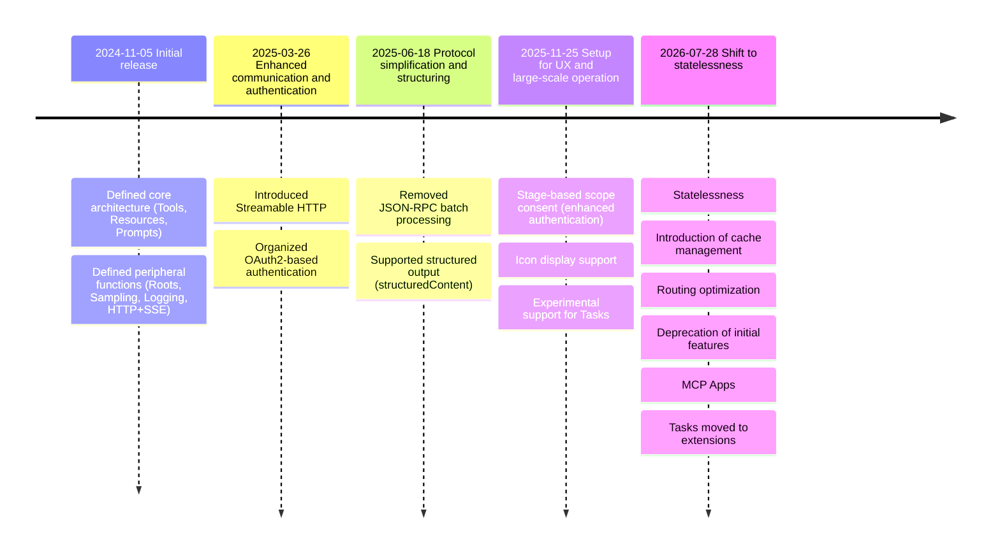
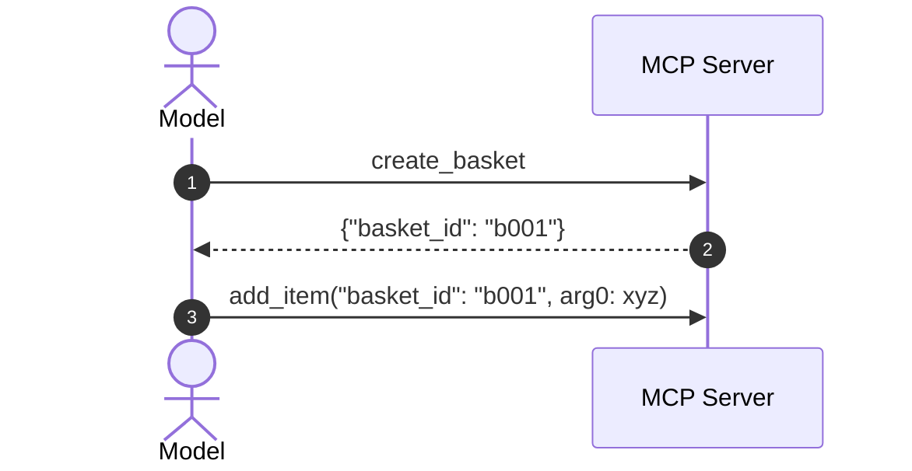
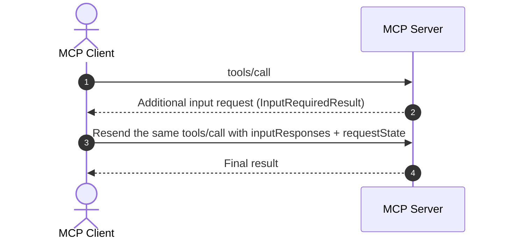

## Introduction

Model Context Protocol (MCP) has rapidly evolved since its initial release in November 2024 as the standard protocol for connecting AI models with external data and functions.  
This 2026-07-28 Release Candidate (hereafter, RC) is not merely a feature addition but a revision that significantly changes the assumptions for real-world protocol operation.

Particularly noteworthy is the statelessness introduced at the protocol layer.  
By removing session management and aligning load balancing, retries, observability, and cache operations more closely with HTTP standards, MCP is shifting to a configuration that is easier to manage even in enterprise environments.

On this page, we explain these revisions from both specification diffs and implementation perspectives, covering the RC’s key points, the specification’s evolution, and the specific changes.

Official blog: [The 2026-07-28 MCP Specification Release Candidate](https://blog.modelcontextprotocol.io/posts/2026-07-28-release-candidate/)

## Key Points of the RC

This RC focuses more on a “redesign for real-world operation” than on “feature additions.”  
In particular, by removing protocol-layer sessions and shifting to statelessness, load balancing, retries, observability, and cache operations now align more closely with HTTP best practices.  
Additionally, Extensions (MCP Apps/Tasks), enhanced authorization, and a deprecation lifecycle have been introduced simultaneously, formalizing the specification’s evolution process.

* The biggest Breaking Change is the removal of protocol-layer sessions in favor of a **stateless-first** approach.
* Streamable HTTP moves to **self-contained requests + required headers**.
* Server-initiated input requests shift from SSE-based connections to a multi-round-trip model with **InputRequiredResult + retransmission**.
* Dynamic Client Registration is now recommended to migrate to Client ID Metadata Documents.
* MCP Apps and Tasks are formalized as extensions.
* I/O schemas now conform to JSON Schema (2020-12).

## Evolution of the MCP Specification


* 2026-05-21: RC finalized  
* 2026-07-28: Final specification release scheduled  
* Deprecation confirmed — removal forbidden for at least 12 months  

## Detailed Specification Changes

The planned specification changes are as follows.  
🚨 indicates a Breaking Change.

1. Protocol statelessness: Remove `initialize`/session dependency and shift to self-contained requests  
   * 🚨 Change to request model: Send required headers and `_meta` with every request  
   * 🚨 Change to response model: `resultType` is now required  
   * 🚨 Remove handshake and session: Deprecate `initialize`, `initialized`, and `Mcp-Session-Id`  
   * Stateful applications on a stateless protocol: Carry state explicitly via handles  
   * 🚨 Rework server-to-client requests: Shift to a retransmission model using `input_required` and `requestState`  
   * 🚨 Routing (traffic control via required HTTP headers): Enable routing without body inspection and enforce strict validation  
   * Introduce caching mechanism: Explicitly specify freshness and shareability with `ttlMs` and `cacheScope`  
   * Observability (standardize W3C Trace Context propagation): Standardize distributed trace correlation with `traceparent`, etc.  
   * 🚨 Reorganize change notification: Center around `subscriptions/listen` and clean up the old subscription API  
2. MCP Apps: Treat server-rendered UIs as official extensions  
3. 🚨 Migrate the Tasks API to an extension: Redesign from core experimental functionality to extension  
4. Strengthen authorization: Enhance requirements aligned with OAuth2.0/OIDC operations  
5. 🚨 Deprecate features: Mark Roots, Sampling, and Logging as deprecated  
6. I/O schemas now conform to JSON Schema (2020-12): Expand expressiveness and clarify validation requirements  
7. Governance changes: Formalize lifecycle, Extensions Track, and Conformance linkage  

### 1. Protocol Statelessness

Previously, in Streamable HTTP communication, you had to first establish a session with an `initialize` request and then include the `Mcp-Session-Id` header in subsequent requests.  
In the 2026-07-28 release, **the entire connection-establishment flow is removed from the protocol layer**.

#### Changes to the Request Model

The request model will be updated as follows:  
* Include protocol version and capability declarations (`capabilities`) in `_meta` on every request.  
* Ensure that the protocol version specified in the headers and `_meta` matches; mismatches are rejected with a `HeaderMismatchError` (`-32020`).  
* If the requested version itself is not supported by the server, return an `UnsupportedProtocolVersionError` (`-32022`).  

* **2025-11-25 Spec**
    ```json: initial request
    {
    "jsonrpc":"2.0","id":1,"method":"initialize",
    "params":{
        "protocolVersion":"2025-11-25",
        "capabilities":{},
        "clientInfo":{"name":"sample-client","version":"1.0.0"}
    }
    }
    ```
    ```json: subsequent requests
    Mcp-Session-Id: 1a2b3c4d-5e6f-7g8h
    {
    "jsonrpc": "2.0","id": 2,"method": "tools/call",
    "params": {
        "name": "get_user",
        "arguments":{"user_id":"u123"}
    }
    }
    ```

* **2026-07-28 Spec**
    ```json
    MCP-Protocol-Version: 2026-07-28
    Mcp-Method: tools/call
    Mcp-Name: get_user

    {
    "jsonrpc": "2.0","id": 1,"method": "tools/call",
    "params": {
        "name": "get_user",
        "arguments": { "user_id": "u123" },
        "_meta": {
        "io.modelcontextprotocol/protocolVersion":"2026-07-28",
        "io.modelcontextprotocol/clientInfo":{"name":"sample-client","version":"1.0.0"},
        "io.modelcontextprotocol/clientCapabilities":{}
        }
    }
    }
    ```

#### Changes to the Response Model

The response model will be updated as follows:  
* `resultType` is now required (possible values: `complete`, `input_required`)

    ```json
    {
    "resultType": "input_required",
    "inputRequests": {
        "confirm": {
        "type": "elicitation",
        "message": "Do you want to delete 3 files?",
        "schema": { "type": "boolean" }
        }
    },
    "requestState": "1a2b3c4d5e6f7g8h9i0j..."
    }
    ```

#### Removal of Handshake and Sessions

Session management used to start and maintain communication has been changed.  
This removes the need for sticky routing and session management, making horizontal scaling easier.

| Item | 2025-11-25 | 2026-07-28 |
|---|---|---|
| `initialize`, `initialized` handshake | Required | Removed ([SEP-2575](https://github.com/modelcontextprotocol/modelcontextprotocol/pull/2575)) |
| `Mcp-Session-Id` header | Required for subsequent requests | Removed ([SEP-2567](https://github.com/modelcontextprotocol/modelcontextprotocol/pull/2567)) |
| Protocol version and client info | Exchanged once at initialization | Included in `_meta` for each request |
| Server capabilities retrieval | Received in initialization response | Retrieved on demand via new `server/discover` method |

* **2025-11-25 Spec**
    ```mermaid
    sequenceDiagram
    actor c as MCP Client
    participant s as MCP Server

    c->>+s: initialize (establish session)
    s-->>-c:
    c->>+s: tools/call(<br>Mcp-Session-Id, <br>name: get_user)
    s-->>-c:
    ```

* **2026-07-28 Spec**
    ```mermaid
    sequenceDiagram
    actor c as MCP Client
    participant s as MCP Server

    c->>+s: tools/call(<br>MCP-Protocol-Version: 2026-07-28, <br>Mcp-Method: tools/call, <br>Mcp-Name: get_user)
    s-->>-c:
    ```

#### Stateful Applications in a Stateless Protocol

Even though the protocol becomes stateless, applications can still maintain state.

With statelessness, the responsibility for state management moves from the transport layer to the application layer (interaction with the model).  
Instead of relying on sessions, it is recommended that the server issue explicit handles as return values from tools and pass them along on subsequent tool calls.  
This allows state to be integrated into the model's inference context, enabling more flexible inference control.


* In the response for step 2: tools must issue explicit handles (e.g., `basket_id` or `context_token`) as return values.

#### Reconstructing Server-to-Client Requests

Server-side elicitation, where the server requests additional input from the client during processing, will be redesigned.  
Instead of maintaining a connection, the server returns an `InputRequiredResult`, which the client then resubmits in a new request.


* Server-initiated input requests are limited to “during the processing of an active client request.” “Unexpected prompts” are prohibited; all elicitations must be tied to an action initiated by the user.  
* Response for step 2:
    ```json
    {
    "resultType": "input_required",
    "inputRequests": {
        "confirm": {
        "type": "elicitation",
        "message": "Do you want to delete 3 files?",
        "schema": { "type": "boolean" }
        }
    },
    "requestState": "1a2b3c4d5e6f7g8h9i0j..."
    }
    ```
    * `InputRequiredResult` must include `requestState`.

Related SEPs  
* Multi Round-Trip Requests: [SEP-2322](https://github.com/modelcontextprotocol/modelcontextprotocol/pull/2322)  
* Server-initiated requests constraints: [SEP-2260](https://github.com/modelcontextprotocol/modelcontextprotocol/pull/2260)  

#### Routing (Traffic Control via Required HTTP Headers)

Three headers will become mandatory in Streamable HTTP.  
This enables load balancers, gateways, and rate limiters to route requests without inspecting (DPI on) the request body.  
If the headers and body contents do not match, the server rejects the request.

| Header | Description | Purpose |
|---|---|---|
| `MCP-Protocol-Version` | Protocol version (e.g., 2026-07-28) | Version consistency validation |
| `Mcp-Method` | JSON method name (e.g., `tools/call`) | Method-level routing and rate limiting |
| `Mcp-Name` | Tool or resource name (e.g., `search`) | Tool- and resource-level routing |

Related SEP  
* Routing headers: [SEP-2243](https://github.com/modelcontextprotocol/modelcontextprotocol/pull/2243)  

#### Introduction of Caching Mechanisms

Caching mechanisms will be introduced for list responses (e.g., `tools/list`).  
This allows MCP clients to recognize the response’s time-to-live (`ttlMs`) and scope (`cacheScope`).  
Previously, the only way to detect changes in lists was to maintain an SSE stream; this provides an alternative.  
* `ttlMs`: Time-to-live in milliseconds.  
* `cacheScope`: `public` (shareable) or `private` (per-user only).  

Related SEP  
* Caching mechanism: [SEP-2549](https://github.com/modelcontextprotocol/modelcontextprotocol/pull/2549)  

#### Observability (Standardizing W3C Trace Context Propagation)

To support distributed tracing, W3C Trace Context (`traceparent`, `tracestate`, `baggage`) propagation has been standardized in the `_meta` field.  
This enables consistent span-tree visualization from host to server and beyond in OpenTelemetry-compatible backends.

Related SEP  
* Observability: [SEP-414](https://github.com/modelcontextprotocol/modelcontextprotocol/pull/414)  

#### Reorganization of Change Notifications

Change notifications have also been reorganized to align with statelessness.  
Notifications are now tied to explicit requests rather than “notifications over a connection or session.”

Main changes:  
* Notifications are unified to be received via the response stream of `subscriptions/listen`.  
* The legacy subscription APIs (`resources/subscribe`, `resources/unsubscribe`) are cleaned up.  
* Legacy GET-based SSE reception and resume mechanisms (`Last-Event-ID`) are not included.  
* `notifications/progress` and `notifications/message` flow in the response stream of the request itself, not `subscriptions/listen`.  
* Client implementations need to handle “change notification streams” and “individual request progress notifications” separately.  
* On connection recovery, requests should be resent rather than resuming a past stream.  

### 2. MCP Apps

MCP Apps allow the server to provide HTML UI templates that the client renders in a sandboxed iframe.  
This enables data visualization and complex form input.  
Since all UI actions are communicated via the JSON-RPC protocol, they can be integrated into audit logs and consent flows.

Features:  
* Embed a server-driven UI experience rather than just text responses.  
* Tool definitions must declare UI templates.  
* Security review scope expands to include “tool implementation + UI template.”  

Related SEP  
* MCP Apps: [SEP-1865](https://github.com/modelcontextprotocol/modelcontextprotocol/pull/1865)  

### 3. Migrating the Tasks API to an Extension

Tasks, which were introduced experimentally as a core feature on 2025-11-25, are being redesigned as an extension.  
Implementations of the 2025-11-25 Tasks API will need to migrate.

| Item | 2025-11-25 | 2026-07-28 |
|---|---|---|
| Positioning | Core feature (experimental) | Extension (official) |
| Task creation | Client-driven | Server-driven (returned as a response to `tools/call`) |
| Task retrieval | `tasks/result` (blocking) | `tasks/get` (polling) |
| Task input | Handled by re-sending `tools/call` | Send input response with `tasks/update` |
| Task cancellation | `tasks/cancel` | `tasks/cancel` |
| `tasks/list` | Present | Removed (cannot set a safe scope without sessions) |

Related SEP  
* Tasks API: [SEP-2663](https://github.com/modelcontextprotocol/modelcontextprotocol/pull/2663)  

### 4. Strengthening Authorization

The authorization specification is enhanced to align with real-world OAuth2.0+OIDC (OpenID Connect) operations.  
In particular, `iss` validation in the Authorization Response (RFC9207) is important as a mitigation against mix-up risks inherent in MCP’s multi-server connection setups.

* Validation of `iss` in the Authorization Response  
  * Clients must validate the `iss` parameter in the Authorization Response.  
  * This provides a low-cost mitigation against mix-up attacks (malicious servers tricking a client into handing over authorization codes) in multi-server configurations unique to MCP.  
* Declaration of `application_type` in Dynamic Client Registration  
  * Clients must declare the appropriate `application_type` during dynamic registration.  
  * This prevents authorization servers from misclassifying desktop or CLI clients as web apps and rejecting `localhost` redirect URIs for security reasons.  
* Strengthen binding of client credentials to the issuer  
  * Client credentials must be strictly bound to the issuing authorization server; reuse across other servers is prohibited, and re-registration is required if the resource server’s authorization server changes.  
* Clarify how to request refresh tokens  
* Define scope accumulation behavior in step-up authentication  
  * Behavior for gradually granting permissions by accumulating scopes (e.g., first grant read, then add write, building up permissions cumulatively)  
* Definition of the `.well-known` discovery suffix  

Related SEPs  
* `iss` validation in Authorization Response: [SEP-2468](https://github.com/modelcontextprotocol/modelcontextprotocol/pull/2468)  
* `application_type` declaration in Dynamic Client Registration: [SEP-837](https://github.com/modelcontextprotocol/modelcontextprotocol/pull/837)  
* Binding client credentials to issuer: [SEP-2352](https://github.com/modelcontextprotocol/modelcontextprotocol/pull/2352)  
* Refresh token request: [SEP-2207](https://github.com/modelcontextprotocol/modelcontextprotocol/pull/2207)  
* Scope accumulation in step-up: [SEP-2350](https://github.com/modelcontextprotocol/modelcontextprotocol/pull/2350)  
* `.well-known` discovery suffix: [SEP-2351](https://github.com/modelcontextprotocol/modelcontextprotocol/pull/2351)  

### 5. Deprecating Features

Three features are being marked as deprecated.  
There is a 12-month grace period from deprecation to removal, during which migration must occur.

| Deprecated Feature | Reason | Recommended Migration Target |
|---|---|---|
| Roots | Incompatibilities with stateful design | Tool input parameters (`inputSchema`), resource URI |
| Sampling | Clarify boundaries of responsibility | Client-side control, direct provider API integration |
| Logging | Recommend industry-standard observability tools | stdio: stderr; structured logs: OpenTelemetry (W3C Trace Context) |

Related SEP  
* Feature deprecation: [SEP-2577](https://github.com/modelcontextprotocol/modelcontextprotocol/pull/2577)  

### 6. I/O Schemas Conform to JSON Schema (2020-12)

Tool I/O schemas (`inputSchema`, `outputSchema`) now support JSON Schema (2020-12).  
This enables advanced schema definitions using `oneOf`, `anyOf`, `allOf`, and `$ref`, improving tool type safety.

Output schemas can now be any JSON value, not just objects.

Also, the error code for resource not found changes from the MCP custom code (`-32002`) to the JSON-RPC standard code (`-32602: Invalid params`).

Related SEPs  
* JSON Schema 2020-12: [SEP-2106](https://github.com/modelcontextprotocol/modelcontextprotocol/pull/2106)  
* Resource not found error code change: [SEP-2164](https://github.com/modelcontextprotocol/modelcontextprotocol/pull/2164)  

### 7. Governance Changes

Mechanisms to avoid frequent disruptive changes in the future have also been introduced.

* Feature Lifecycle (Active/Deprecated/Removed)  
  * Define Active, Deprecated, and Removed states for all features, mandating at least a 12-month window from Deprecated to Removed.  
  * This makes future disruptive changes predictable.  
* Formalizing the Extensions Track  
  * New features are proposed and validated first as extensions; only mature ones are incorporated into the core.  
  * Official extensions are managed in independent repositories (`ext-*`) and can evolve separately from the core specification.  
* Strengthening SEP and Conformance Suite linkage  
  * SEPs on the standardization track cannot reach Final until corresponding scenarios are included in the Conformance Suite.  
  * This reduces the gap between specification drafting and implementation verification, improving SDK interoperability.  

Related SEPs  
* Feature Lifecycle: [SEP-2596](https://github.com/modelcontextprotocol/modelcontextprotocol/pull/2596)  
* Extensions Track: [SEP-2133](https://github.com/modelcontextprotocol/modelcontextprotocol/pull/2133)  
* Conformance Suite linkage: [SEP-2484](https://github.com/modelcontextprotocol/modelcontextprotocol/pull/2484)  
* SDK tier system: [SEP-1777](https://github.com/modelcontextprotocol/modelcontextprotocol/pull/1777)  

## Actions for Implementers

Here is a quick list of items implementers should verify:

* Protocol statelessness: Migrate the transport layer  
   * Inventory code that assumes `initialize` and `initialized`  
   * Identify code dependent on `Mcp-Session-Id`  
   * Set `Mcp-Method`, `Mcp-Name`, and `MCP-Protocol-Version` in request headers  
   * Include required keys (`protocolVersion`, `clientInfo`, `clientCapabilities`) in `_meta` on each request  
   * Handle header/_meta mismatch errors (`-32020`) and unsupported-version errors (`-32022`)  
   * Implement `server/discover` to pre-check supported versions and capabilities  
   * Set `resultType` in responses  
   * Redesign change notification reception assuming `subscriptions/listen`  
* Strengthening authorization: Review auth operations  
   * Ensure `iss` validation in Authorization  
   * Plan migration strategy for Dynamic Client Registration  
   * Verify trace context propagation and review logging design  
* Extensions and deprecated features:  
   * Decide on adopting MCP Apps  
   * Identify usage of the old Tasks API  
   * Plan migration for Roots, Sampling, and Logging  
   * Update error code from `-32002` to `-32602`  
* SDK updates:  
   * Upgrade Tier 1 SDKs in each language to the latest and migrate to stateless implementations  

## Conclusion

This revision is not just a specification update but a redesign of MCP as a “protocol operating on a stateless HTTP foundation.”  
Statelessness for scalability, W3C Trace Context, and governance enhancements are expected to lower technical barriers for enterprise adoption.
