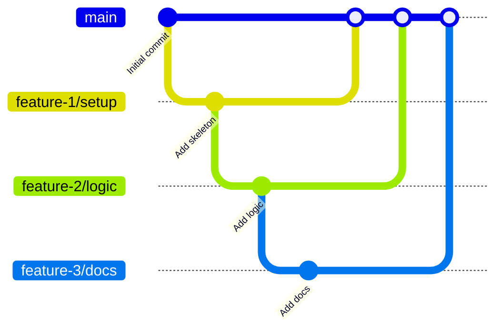

## Introduction
Last month, GitHub's Stacked pull requests (Stacked PRs) entered public preview.

@[og](https://github.blog/changelog/2026-07-30-stacked-pull-requests-are-now-in-public-preview/)

Previously, it was possible to branch off from a PR branch and stack PRs manually. By stacking small PRs, each PR becomes smaller and easier to review, but maintaining the stack comes with overhead.  
Let’s see how much efficiency can be gained with Stacked PRs.

## Concept
When creating PRs, it's common to want to include change B based on change A, so you create a B branch from the unmerged A branch and work that way.

- The first PR has its base set to main  
- For the second and subsequent PRs, set the base to the immediately preceding PR branch



Stacking small PRs has the advantage of making each PR smaller and easier to review. However, when stacking PRs, you frequently have to write the base branch in the PR description and rebase changes that occur in intermediate stacks onto the branches of upstream stacks.  
Stacked PRs significantly reduce the cumbersome tasks involved in "a series of PR stacks originating from a specific branch."

## Testing Environment and Documentation
In this article, we're using the following versions:

- GitHub CLI (gh): 2.98.0  
- gh-stack plugin: 0.1.0

Make sure you have installed the GitHub CLI and completed `gh auth login`. Install the Stacked PRs plugin with:

```shell
gh extension install github/gh-stack
```

The official documentation overview and quickstart are available at:

@[og](https://docs.github.com/en/pull-requests/get-started/about-stacked-prs)  
@[og](https://docs.github.com/en/pull-requests/get-started/stacked-prs-quickstart)

The command reference for Stacked PRs is at:

@[og](https://docs.github.com/en/pull-requests/reference/stacked-prs-cli-commands)

## Sample Repository Structure
Let's create a simple repository and test.

On the main branch, we only have README.md. At this point, it's fine to push to the remote.

```shell
.
└── README.md
```

feature/01-setup branch. Added source code and documentation.

```shell
.
├── README.md
├── docs
│   └── notes.md
└── src
    └── hello.py
```

feature/02-add-logic branch. Added documentation and source code.

```shell
├── README.md
├── docs
│   ├── notes.md
│   └── stacked-pr.md
└── src
    ├── calculator.py
    └── hello.py
```

feature/03-add-docs branch. Added documentation.

```shell
.
├── README.md
├── docs
│   ├── notes.md
│   ├── stacked-pr.md
│   └── usage.md
└── src
    ├── calculator.py
    └── hello.py
```

## Initializing the Stack
Run the following to initialize the three branches as a single stack:

```shell
$ gh stack init --base main feature/01-setup feature/02-add-logic feature/03-add-docs
```
The stack has been created.
```
? Enable git rerere to remember conflict resolutions? (Y/n) 
✓ Adopted 3 branches: main ← feature/01-setup ← feature/02-add-logic ← feature/03-add-docs
  You're on feature/03-add-docs (top of stack).

What's next:
  • see the full stack:                          gh stack view
  • move between branches:                       gh stack switch
  • link these PRs into a Stack on GitHub:       gh stack submit
```

Locally, the branch relationships are recognized as a three-level stack originating from main.

Check the stack:

```shell
gh stack view
```
You can see a list of each branch in the stack along with its changes.
```
▶ feature/03-add-docs (current)  +61 -12
│  ▾ 2 files changed
│    README.md  +58 -12
│    docs/usage.md  +3 -0
│  ▸ 2 commits
│
├ feature/02-add-logic  +6 -0
│  ▸ 2 files changed
│  ▸ 1 commit
│
├ feature/01-setup  +4 -0
│  ▸ 2 files changed
│  ▸ 1 commit
│
└ main
```

:::info
In this example, we added all three branches at once with init, but to add a single branch, you can use `gh stack add` to add a branch to the stack. However, this command creates a branch and adds it to the stack at the same time. There doesn’t seem to be a way to add an existing branch at this time.

```shell
gh stack add <branch>
```
:::

:::info
Since we hadn't created the GitHub repository yet, after creating it we set the origin with the following command. The key is to push the `main` branch, which serves as the foundation of the stack, first. This step is unnecessary if you’re cloning from an existing repository.

```shell
git remote add origin https://github.com/kondoumh/stacked-pr-demo.git
```
:::

Use `gh stack submit` to reflect the stack information remotely. A TUI interface will open where you can edit each PR’s title and description. You can also choose between creating them as ready-for-review or as drafts.


When you select the top of the stack, a `SUBMIT 3 PRs` button appears in the bottom right of the screen.


This button can be clicked with the mouse. Clicking it starts reflecting the changes on the remote repository.

```shell
gh stack submit
Checking stack state...
Pushing to origin...
✓ Created PR #5 for feature/01-setup
✓ Created PR #6 for feature/02-add-logic
✓ Created PR #7 for feature/03-add-docs
✓ Stack created on GitHub with 3 PRs (stack #8)
✓ Pushed and synced 3 branches
```

Checking on the web UI, you can see that three branches and their corresponding PRs have been created.


:::info
The PRs start at #5 because the stack became inconsistent once and was redone.  
You can clean up the stack using unstack as follows:
```shell
# Local
gh stack unstack --local
# On origin
gh stack unstack
```
:::

Here is the screen for the second PR in the stack. The merge UI differs from a normal PR, displaying the stack structure.


## Rebasing Branches
A common task when working with stacked PRs is to introduce changes in a middle branch and then rebase the upstream branches. Let's work on a branch in the stack and try rebasing.

We added logic to calculator.py on feature/02-add-logic (adding multiply to the existing add).

```diff
@@ -1,2 +1,5 @@
 def add(a: int, b: int) -> int:
     return a + b
+
+def multiply(a: int, b: int) -> int:
+    return a * b
```

```shell
git status
On branch feature/02-add-logic
Changes to be committed:
  (use "git restore --staged <file>..." to unstage)
        modified:   src/calculator.py
```

Commit it.

```shell
git commit -m 'add logic to calculator.py'
```

The upper stack, feature/03-add-docs, hasn't had these changes applied yet. Traditionally, you would checkout feature/03-add-docs and rebase it via git commands. With Stacked PRs, to propagate the changes to the upstream stack branches, you simply run:

```shell
gh stack rebase --upstack
```

The changes from feature/02-add-logic ripple upward through the rebase chain.

```shell
✓ Fetched latest main from origin
✓ Trunk main is already up to date
Stack detected: (main) <- feature/01-setup <- feature/02-add-logic <- feature/03-add-docs
Rebasing branches in order, starting from feature/02-add-logic to feature/03-add-docs
✓ Rebased feature/02-add-logic onto feature/01-setup
✓ Rebased feature/03-add-docs onto feature/02-add-logic
All upstack branches from feature/02-add-logic rebased locally with main (c137e85)
To push up your changes, run `gh stack push`
```

If you checkout feature/03-add-docs and view the git log, you can see that the commit with the calculator.py changes has been rebased on top.

```shell
commit 8279783de1fb932c4754b59cb01ad69cf7f7c3da (HEAD -> feature/03-add-docs)
Author: Copilot <copilot@example.com>
Date:   Sun Aug 23 12:51:14 2026 +0900

    Add workflow

commit 3b0f02f3523811819e0eaffda2c28f6443f8ff28
Author: Copilot <copilot@example.com>
Date:   Wed Aug 5 23:00:29 2026 +0900

    Document stacked PR workflow

commit 177241ca3fdd9c99462dc90b40f1072600e8fd3f (feature/02-add-logic)
Author: Copilot <copilot@example.com>
Date:   Sun Aug 23 15:45:01 2026 +0900

    add logic to calculator.py # commit adding calculation logic
```

:::info:
If you omit the --upstack option, it will rebase all branches from main that need it.

```shell
gh stack rebase
```

Also, if a conflict occurs during the propagation, the process will pause. After resolving the conflicted files and running git add, you can resume with `gh stack rebase --continue`. You can abort the entire stack rebase and roll back to the original state with `gh stack rebase --abort`.
:::

To push the changes, including the rebase, to the remote, run `gh stack push`.

```shell
$ gh stack push
Pushing 3 branches to origin...
✓ Pushed 3 branches
Run `gh stack view` to see your stack of PRs
```

The PRs are properly updated as well.


## Merging Stacked PRs
You can merge the stack at any level. Let's try merging from the second PR in the stack.


They were merged in stack order.


Here's the PR screen for the top of the stack. The base branch was automatically switched to main.


:::info
The switch to main seems to have a slight lag. The merge button remained clickable on the already-merged branch. I haven’t tried it, but if you accidentally merge, you can revert and manually set the base branch to main.  
To avoid mishaps, it's recommended to enable "Automatically delete head branches" after merging.
:::

## Combining with Merge Queue
I haven’t tested it this time, but combining with a merge queue frees you from the merge process itself. The scariest accidents with stacked PRs (main ← PR1 ← PR2 ← PR3) are order reversals and broken dependencies.

- Without a merge queue: You have to manually watch the order—like “first confirm that PR1 was approved and merged, then wait for PR2’s CI to pass before clicking the merge button…”
- With a merge queue: Once you put approved PRs in the queue, the system enforces dependency order and automatically handles validation and merges in sequence.

This completely eliminates the risk of breaking main due to an intermediate PR.  
From a development experience standpoint, “review complete” equals “hands-off immediately.” Once a reviewer approves, you can “for now add it to the queue and move on to the next task.”

:::info
Although it's quite old, here's an introductory article on merge queues.

@[og](/blogs/2023/02/15/github-pr-merge-queue/)
:::

## Conclusion
With AI writing code for us, PR creation has become extremely fast, and the number of files included in a single PR has increased. I think many teams are experiencing a backlog of human reviews.

Another reason PRs become huge is the developer’s psychology. When working on a task, it’s easy to include unrelated changes. You could stack them, but since the work involved in stacking is cumbersome, you end up batching them together.

In an environment where Stacked PRs are available, if you think, “Ah, this change exceeds the scope of the current PR,” you can just run `gh stack add` to add a new branch to the stack.

By having the system handle stack management, you can naturally maintain the best practice of “making small PRs and having them reviewed in small chunks.”

Let’s summarize the differences between manually-stacked PRs and the official Stacked PRs feature.

| Comparison Item | Traditional Manual Stack (main ← PR1 ← PR2) | Official Stacked PR Support |
|:---|:---|:---|
| Stack visibility | You had to manually write in the description, like “Depends on #100” | The PR UI displays the entire stack and their relationships |
| Behavior when parent PR merges | After the parent was merged, you had to manually rebase the child’s base branch to main | When the parent PR merges, the child PR’s base branch is automatically updated |
| Follow-up when parent PR is modified | When commits or a rebase were added to the parent PR due to review comments, doing `rebase --onto` on the child PR was a nightmare | Change propagation and diff management within the stack is supportively handled via GitHub’s UI |
| Reviewer burden | It was easy to lose track of “which diff belongs to this PR” | You can focus on each PR’s pure diff while preserving the stack context |

I can’t wait for it to reach GA and spread to various teams.
