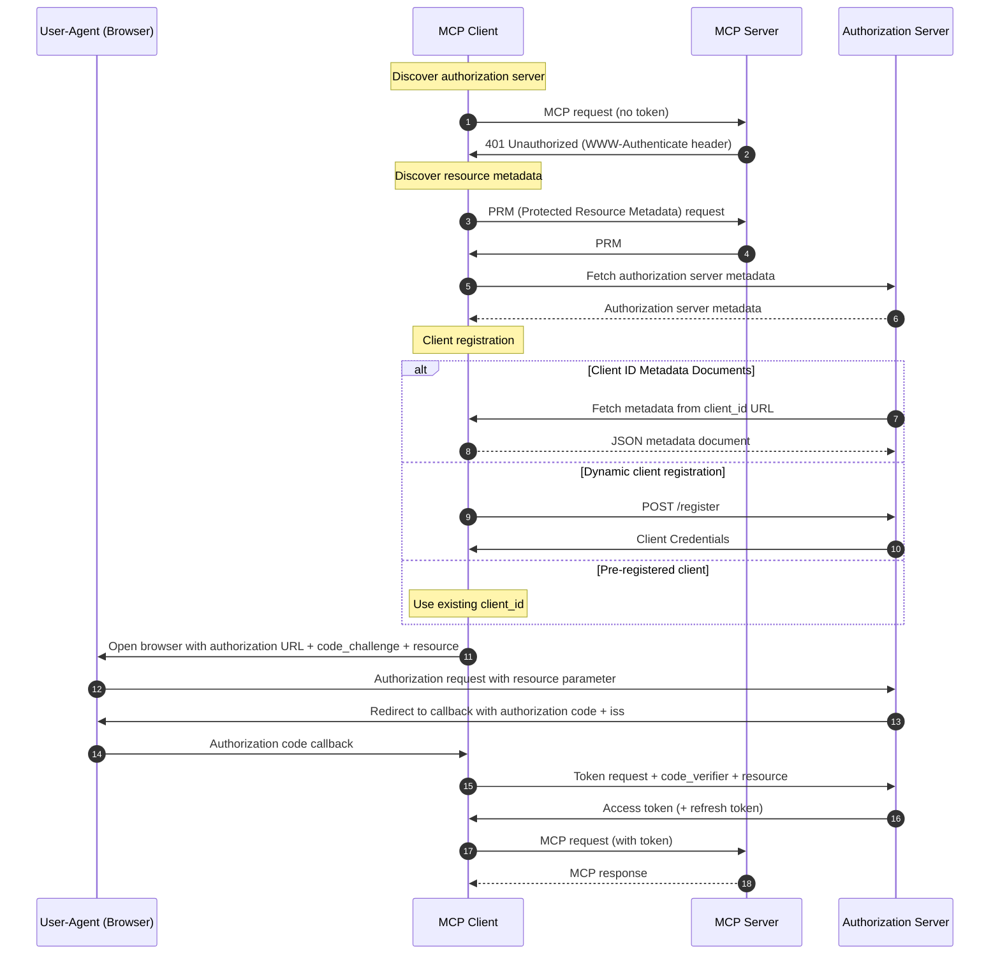

## Introduction

This page is a follow-up to "MCP Primer: Connecting AI Agents and Systems". This time, we explain authentication/authorization.

In the MCP specification, authorization is treated as OPTIONAL, but when running MCP in production, it can be considered a required feature. In this article, we cover:
* The flow of authentication and authorization in MCP over Streamable HTTP
* Discovery of PRM and the authorization server
* Server-side validation on the MCP server using Keycloak and token introspection

The code examples in this article are published here: [https://github.com/ubata-mamezou/developer-site-article-examples/tree/main/mcp-auth].

:::info: Series Table of Contents
**Series: MCP Primer Connecting AI Agents and Systems**
* [Introduction](/blogs/2026/04/24/mcp-impl_introduction/)
* [stdio Implementation](/blogs/2026/05/08/mcp-impl_stdio/)
* [Streamable HTTP Stateless Implementation](/blogs/2026/05/22/mcp-impl_http_stateless/)
* [Streamable HTTP Stateful Implementation](/blogs/2026/06/05/mcp-impl_http_stateful/)
* [Prompt Edition](/blogs/2026/06/19/mcp-impl_prompt/)
* [Resource Edition](/blogs/2026/07/03/mcp-impl_resource/)
* **Authentication/Authorization Edition (this page)**
:::

## Libraries and Tools Used This Time

* npm@12.0.2
* node@26.6.0
* @modelcontextprotocol/express@2.0.0
* @modelcontextprotocol/node@2.0.0
* @modelcontextprotocol/server@2.0.0
* typescript@7.0.2
* zod@4.4.3
* Keycloak 26.3.4
* Docker compose

:::check: About the Libraries Used This Time
Since v2 of @modelcontextprotocol has been released, this article uses v2. We also use the latest versions of Node and TypeScript.

**About the MCP modules**  
In v1, we used `@modelcontextprotocol/sdk`. In v2, the modules have been split, so we use `@modelcontextprotocol/server`, `express`, and `node`.
:::

## MCP Specification: Authentication/Authorization

### Authentication Approaches by Transport

The implementation guidelines for authentication differ depending on the transport (communication method).

**Streamable HTTP**

Authorization is OPTIONAL, but if implemented, it must comply with the MCP authorization specification.

**stdio (standard input/output)**

This transport is outside the authentication scope defined by the MCP specification. Authentication information (e.g., API keys) must be obtained directly from the execution environment at subprocess startup.

**Others**

Follow the established best practices for that protocol.

### Standards Compliance

To ensure security and interoperability while simplifying, the following subset of standards is adopted:

* OAuth 2.1 (IETF Draft)
* OAuth 2.0 Bearer Token Usage (RFC 6750)
* OAuth 2.0 Authorization Server Metadata (RFC 8414)
* OAuth 2.0 Dynamic Client Registration Protocol (RFC 7591)
* Resource Indicators for OAuth 2.0 (RFC 8707)
* OAuth 2.0 Protected Resource Metadata (RFC 9728)
* OAuth Client ID Metadata Documents (CIMD)

### Roles

The following roles are defined:

* MCP Server (OAuth 2.1 Resource Server): Accepts access tokens and responds to requests for protected resources.
* MCP Client (OAuth 2.1 Client): Requests protected resources on behalf of the resource owner.
* Authorization Server: Interacts with the user and issues access tokens. It can be the same as the MCP Server or configured separately.

### Authentication Flow

A partial translation of the "Authorization Flow Steps" from the official MCP documentation:

:::check
In the MCP specification, the client retrieves PRM and authorization server metadata, then obtains tokens via the Authorization Code Flow using PKCE.

In the sample code for this article, we focus on testing the resource server side and omit the client-side browser authentication flow.  
1. The MCP Server receives a Bearer token using a pre-acquired access token from Keycloak.  
2. The MCP Server validates the token's validity, Audience, and Scope at Keycloak's `Introspection endpoint`.
:::



### Discovering the Authorization Server

The MCP Client discovers the location and capabilities of the authorization server with these steps:

1. Discover resource metadata (RFC 9728)

   When the client receives a `401 Unauthorized` response, it must retrieve the `resource_metadata`.

   Priority:
   1. The URL indicated by the `resource_metadata` parameter in the `WWW-Authenticate` header
   2. Well-known URI under the MCP Server endpoint (e.g., `/.well-known/oauth-protected-resource/path/to/mcp`)
   3. Well-known URI at the domain root (e.g., `/.well-known/oauth-protected-resource`)

2. Fetch authorization server metadata (RFC 8414)

   The client determines the authorization server endpoint based on the Issuer URL from the resource metadata.

   Priority:
   * If there is a path component (e.g., `/tenant1`):
     1. OAuth 2.0 style (e.g., `/.well-known/oauth-authorization-server/tenant1`)
     2. OIDC style with path insertion (e.g., `/.well-known/openid-configuration/tenant1`)
     3. OIDC style with path addition (e.g., `tenant1/.well-known/openid-configuration`)
   * If there is no path component:
     1. OAuth 2.0 style (e.g., `/.well-known/oauth-authorization-server`)
     2. OIDC style (e.g., `/.well-known/openid-configuration`)

   Strict validation rules:
   * The `issuer` value in the metadata document must exactly match the issuer identifier used to construct the Well-Known URL.
   * If they do not match, the client must reject the metadata.

:::check:
In the sample code, we use the OAuth 2.0 style with a path component.
:::

### Client Registration

Before starting the authentication flow, the client needs to obtain a client ID.

Registration mechanisms and priority:

1. Pre-registration: Use static credentials when there is an existing relationship between the client and server.
2. Client ID Metadata Documents (CIMD): Use an HTTPS URL as the client ID when there is no prior relationship.
3. Dynamic Client Registration: Maintained for backward compatibility but deprecated, so generally not chosen.
4. User input: Ask the user to input information if no other means are available.

:::check
In the sample code, we use static credentials pre-registered in Keycloak (Pre-registration).
:::

## Explanation of the Sample Code

### Sample Code Specifications

We use the following sample code to explain. Keycloak-dependent processes are centralized in `keycloak.ts`.

| Item | Description | Notes |
|---|---|---|
| Transport | Streamable HTTP (Stateless) |
| Authorization Server | Keycloak | Exposed on port 8081 |
| MCP endpoint | `POST /mcp` | Bearer authentication required |
| Token validation | Token introspection (Keycloak's `Introspection endpoint`) |
| Authentication errors | `401 Unauthorized` + `WWW-Authenticate` | Thrown when the token is invalid or the audience does not match |
| Authorization errors | `403 Forbidden` + `WWW-Authenticate` | Thrown when the token is valid but lacks required scopes |
| PRM | `GET /.well-known/oauth-protected-resource/mcp` |

* Not covered in this sample:
  * Browser consent screens
  * PKCE parameter generation
  * Callback to receive the authorization code
  * Exchange of authorization code for tokens
  * CIMD
  * Dynamic Client Registration

### Keycloak Setup

When starting with Docker Compose, we automatically generate the Realm settings included in this project. This ensures that Keycloak starts with all the Realms necessary for the subsequent functional tests.

* realm: `mcp-demo`
* Client Scopes:
  * `mcp:tools`: aud=`http://localhost:3000/mcp`
  * `mcp:no-scope`: aud=`http://localhost:3000/mcp`
  * `mcp:diff-audience`: aud=`http://localhost:3000/mcp-diff`
* Clients:
  * For introspection: `mcp-server`
  * For obtaining valid tokens: `mcp-demo-client` (with `mcp:tools` scope)
  * For testing insufficient scope: `mcp-demo-no-scope-client` (with `mcp:no-scope` scope)
  * For testing missing audience: `mcp-demo-no-audience-client`
  * For testing mismatched audience: `mcp-demo-diff-audience-client` (with `mcp:diff-audience` scope)

:::info
* Audience: Which resource server the token is intended for
* Scope: What actions can be performed on the resource server
:::

### Publishing PRM

PRM is published so that the MCP Client can discover the authorization server. The `mcpAuthMetadataRouter` handles this publication. When a client accesses the MCP endpoint without authentication, the `WWW-Authenticate` header also includes the PRM URL. The client retrieves the PRM from that URL to learn the authorization server location.

```ts
app.use(
  mcpAuthMetadataRouter({
    oauthMetadata,
    resourceServerUrl: mcpServerUrl,
    scopesSupported: [REQUIRED_SCOPE],
    resourceName: "MCP Auth Streamable HTTP",
  }),
);
```

**PRM example**
```json
{
  "resource": "http://localhost:3000/mcp",
  "authorization_servers": ["http://localhost:8081/realms/mcp-demo"],
  "scopes_supported": ["mcp:tools"],
  "resource_name": "MCP Auth Streamable HTTP"
}
```
* `resource`: Identifier for the protected MCP server
* `authorization_servers`: Issuer URL(s) of the authorization server
* `scopes_supported`: Candidate scopes used by the MCP server
* `resource_name`: Display name of the resource

### Bearer Authentication Middleware

Bearer authentication is performed before the MCP endpoint. `requireBearerAuth` is middleware that runs before the MCP endpoint. If `authMiddleware` detects an error, it terminates processing, and subsequent logic is not executed.

```ts: index.ts
const authMiddleware = requireBearerAuth({
  // ※1
  verifier: tokenVerifier,
  // ※2
  requiredScopes: [REQUIRED_SCOPE],
  resourceMetadataUrl: getOAuthProtectedResourceMetadataUrl(mcpServerUrl),
});

//omit

app.post(MCP_PATH, authMiddleware, async (req, res) => {
  const server = createServer(); // This line is not reached if authMiddleware throws an error
  // omit
```
* ※1: Token validation (details below)
* ※2: Scope validation
  * Verifies that the token has the specified scopes.
  * `requireBearerAuth` compares the token's scopes against `requiredScopes`.

### Token Validation with Keycloak Introspection

The MCP Server validates received access tokens using Keycloak's `Introspection endpoint`. It is important to note that an HTTP 200 response alone does not indicate that the token is valid.

```ts: keycloak.ts
export function createTokenVerifier(mcpServerUrl: URL): OAuthTokenVerifier {
  return {
    verifyAccessToken: async (token) => {
      // Validate token via Keycloak introspection ※1
      const params = new URLSearchParams({token, client_id: OAUTH_CLIENT_ID});
      if (OAUTH_CLIENT_SECRET) params.set("client_secret", OAUTH_CLIENT_SECRET);
      const response = await fetch(KEYCLOAK_INTROSPECTION_ENDPOINT, {
        method: "POST",
        headers: { "Content-Type": "application/x-www-form-urlencoded" },
        body: params.toString(),
      });

      // If response status is not 200 ※2
      if (!response.ok) {
        const text = await response.text().catch(() => "");
        throw new OAuthError(OAuthErrorCode.InvalidToken, `Invalid or expired token: ${text}`);
      }

      // omit

      // If the token is inactive or expired ※3
      if (!data.active) throw new OAuthError(OAuthErrorCode.InvalidToken, "Inactive token");
```
* ※1
  * `token`: The token to validate
  * `OAUTH_CLIENT_ID`, `OAUTH_CLIENT_SECRET`: Credentials that the MCP Server uses to request introspection, not the MCP Client's credentials
* ※2, 3
  * If a non-200 status is returned, it is treated as invalid or expired, returning `InvalidToken`.
  * Even if status is 200, if `active` is `false`, the token is invalid, also returning `InvalidToken`.

## Audience Validation

The `aud` claim in the token indicates which resource server the token is issued for. Even if a token is otherwise valid, we must reject tokens issued for other resources by validating the audience.

```ts: keycloak.ts
      // Validate Audience (aud) claim
      if (OAUTH_STRICT) { // Perform validation if OAUTH_STRICT is enabled
        // ※1
        if (!data.aud) throw new OAuthError(OAuthErrorCode.InvalidToken, "Resource indicator (aud) missing");
        const audiences = Array.isArray(data.aud) ? data.aud : [data.aud];
        const allowed = audiences.some((audience) =>
          checkResourceAllowed({ requestedResource: audience, configuredResource: mcpServerUrl }),
        );
        // ※2
        if (!allowed) throw new OAuthError(OAuthErrorCode.InvalidToken, `Expected audience compatible with ${mcpServerUrl}, got: ${audiences.join(",")}`);
      }
```
* ※1
  * Throws an error if `aud` is missing, indicating the resource indicator is missing.
* ※2
  * Throws an error if none of the `aud` values match an allowed audience, indicating a mismatch.

## Functional Testing with the Sample Code

1. Basic flow (verifying the authorization flow)
   1. Request without Authorization header (MCP Inspector)
   2. Request without Authorization header (curl)
   3. PRM (Protected Resource Metadata) request
   4. Successful access with a valid token
2. Exception flow
   1. Request with incorrectly formatted Authorization header
   2. Request with an invalid token
   3. Request using a client with insufficient scope
   4. Request using a client with missing audience
   5. Request using a client with a different audience

### 1. Request without Authorization header (MCP Inspector)

Connect to the MCP Server from MCP Inspector without setting an Authorization header.

**UI popup message**
```txt
OAuth Authorization Failed
Policy 'Allowed Client Scopes' rejected request to client-registration service. Details: Not Permitted to use specified clientScope
```

**Console log output**
```sh
Error from MCP server: StreamableHTTPError: Streamable HTTP error: Error POSTing to endpoint: {"error":"invalid_token","error_description":"Missing Authorization header"}
    at StreamableHTTPClientTransport.send (file:///xxx/node_modules/@modelcontextprotocol/sdk/dist/esm/client/streamableHttp.js:364:23)
    at process.processTicksAndRejections (node:internal/process/task_queues:104:5) {
  code: 401
}
```

Since response headers could not be confirmed, we re-test with curl.

### 2. Request without Authorization header (re-test with curl)

As before, call `tools/list` without setting an Authorization header using curl.

```sh
curl -i -X POST http://localhost:3000/mcp \
  -H "Accept: application/json, text/event-stream" \
  -H "Content-Type: application/json" \
  -d '{"jsonrpc":"2.0","id":1,"method":"tools/list","params":{}}'

HTTP/1.1 401 Unauthorized
WWW-Authenticate: Bearer error="invalid_token", error_description="Missing Authorization header", scope="mcp:tools", resource_metadata="http://localhost:3000/.well-known/oauth-protected-resource/mcp"
```

**Result**

* `401 Unauthorized` is returned.
* `error` indicates "invalid_token".
* `error_description` indicates "Missing Authorization header".
* `resource_metadata` provides the PRM endpoint URL.

### 3. Checking PRM (Protected Resource Metadata)

Access the URL provided in `resource_metadata` to inspect the metadata needed for authentication.

```sh
curl -s http://localhost:3000/.well-known/oauth-protected-resource/mcp

{
  "resource":"http://localhost:3000/mcp",
  "authorization_servers":["http://localhost:8081/realms/mcp-demo"],
  "scopes_supported":["mcp:tools"],
  "resource_name":"MCP Auth Streamable HTTP"
}
```

**In MCP Inspector**


**Result**

PRM is returned.
* `resource`: URL identifying the protected resource
* `authorization_servers`: Issuer URL(s) of the authorization server
* `scopes_supported`: Available authorization scopes

### 4. Successful Access with a Valid Token

Obtain a valid token via authentication, then call `tools/list`.

1. Obtain token

Acquire an access token from Keycloak:

```sh
curl -s -X POST http://localhost:8081/realms/mcp-demo/protocol/openid-connect/token \
-H "Content-Type: application/x-www-form-urlencoded" \
-d "grant_type=client_credentials" \
-d "client_id=mcp-demo-client" \
-d "client_secret=mcp-demo-client-secret"

{
  "access_token":"<valid_token>",
  "expires_in":300,
  "refresh_expires_in":0,
  "token_type":"Bearer",
  "not-before-policy":0,
  "scope":"mcp:tools"
}
```

2. Access the MCP Server

Use the `access_token` from Keycloak to access the MCP endpoint:

```sh
curl -s -X POST http://localhost:3000/mcp \
  -H "Accept: application/json, text/event-stream" \
  -H "Authorization: Bearer <valid_token>" \
  -H "Content-Type: application/json" \
  -d '{"jsonrpc":"2.0","id":1,"method":"tools/list","params":{}}'

event: message
data: {"result":{"tools":[{"name":"sum_numbers","title":"sum_numbers","description":"Sum two numbers","inputSchema":{"type":"object","$schema":"https://json-schema.org/draft/2020-12/schema","properties":{"a":{"type":"number","description":"first number"},"b":{"type":"number","description":"second number"}},"required":["a","b"]},"outputSchema":{"$schema":"https://json-schema.org/draft/2020-12/schema","type":"object","properties":{"result":{"type":"number","description":"sum result"}},"required":["result"],"additionalProperties":false}},{"name":"get_server_policy","title":"get_server_policy","description":"Return simple authorization policy for demo","inputSchema":{"type":"object","properties":{}},"outputSchema":{"$schema":"https://json-schema.org/draft/2020-12/schema","type":"object","properties":{"resource":{"type":"string","description":"resource server url"},"requiredScope":{"type":"string","description":"required scope"}},"required":["resource","requiredScope"],"additionalProperties":false}}]},"jsonrpc":"2.0","id":1}
```

**Result**

Access is successful, and the `tools/list` result is returned.

:::info
This response includes the JSON schema `$schema` (2020-12) introduced in the 2026-07-28 RC.  
Details on the RC changes are explained in [Explaining MCP 2026-07-28 RC](/blogs/2026/07/10/mcp-spec-2026-07-28-rc/).
:::

**When connecting with MCP Inspector**


### 5.1. Request with Incorrect Authorization Header Format

Simulate a request where the Authorization header has an invalid format (value not starting with "Bearer ").

```sh
curl -i -X POST http://localhost:3000/mcp \
  -H "Accept: application/json, text/event-stream" \
  -H "Content-Type: application/json" \
  -H "Authorization: bad_format_token" \
  -d '{"jsonrpc":"2.0","id":1,"method":"tools/list","params":{}}'

HTTP/1.1 401 Unauthorized
WWW-Authenticate: Bearer error="invalid_token", error_description="Invalid Authorization header format, expected 'Bearer TOKEN'", scope="mcp:tools", resource_metadata="http://localhost:3000/.well-known/oauth-protected-resource/mcp"

{
  "error":"invalid_token",
  "error_description":"Invalid Authorization header format, expected 'Bearer TOKEN'"
}
```

**Result**

* `401 Unauthorized` is returned.
* `error_description` indicates the header has an invalid format.

### 5.2. Request with an Invalid Token

Simulate a request where the format is correct but the token does not exist.

```sh
curl -i -X POST http://localhost:3000/mcp \
  -H "Accept: application/json, text/event-stream" \
  -H "Content-Type: application/json" \
  -H "Authorization: Bearer unknown_token" \
  -d '{"jsonrpc":"2.0","id":1,"method":"tools/list","params":{}}'

HTTP/1.1 401 Unauthorized
WWW-Authenticate: Bearer error="invalid_token", error_description="Inactive token", scope="mcp:tools", resource_metadata="http://localhost:3000/.well-known/oauth-protected-resource/mcp"

{
  "error":"invalid_token",
  "error_description":"Inactive token"
}
```

**Result**

* `401 Unauthorized` is returned.
* `error_description` indicates the token is invalid.

### 5.3. Request Using a Client with Insufficient Scope

Simulate a request using a token from a client lacking the required scope.

1. Obtain token
```sh
curl -s -X POST http://localhost:8081/realms/mcp-demo/protocol/openid-connect/token \
  -H "Content-Type: application/x-www-form-urlencoded" \
  -d "grant_type=client_credentials" \
  -d "client_id=mcp-demo-no-scope-client" \
  -d "client_secret=mcp-demo-no-scope-client-secret"

{"access_token":"<valid_token>","expires_in":300,"refresh_expires_in":0,"token_type":"Bearer","not-before-policy":0,"scope":"mcp:no-scope"}
```

2. Access the MCP Server
```sh
curl -i -X POST http://localhost:3000/mcp \
  -H "Accept: application/json, text/event-stream" \
  -H "Authorization: Bearer <valid_token>" \
  -H "Content-Type: application/json" \
  -d '{"jsonrpc":"2.0","id":1,"method":"tools/list","params":{}}'

HTTP/1.1 403 Forbidden
WWW-Authenticate: Bearer error="insufficient_scope", error_description="Insufficient scope", scope="mcp:tools", resource_metadata="http://localhost:3000/.well-known/oauth-protected-resource/mcp"

{"error":"insufficient_scope","error_description":"Insufficient scope"}
```

**Result**

* `403 Forbidden` is returned.
* `error` and `error_description` both indicate insufficient scope.

### 5.4. Request Using a Client with Missing Audience

Simulate a request using a token with no audience set.

1. Obtain token
```sh
curl -s -X POST http://localhost:8081/realms/mcp-demo/protocol/openid-connect/token \
  -H "Content-Type: application/x-www-form-urlencoded" \
  -d "grant_type=client_credentials" \
  -d "client_id=mcp-demo-no-audience-client" \
  -d "client_secret=mcp-demo-no-audience-client-secret"
{"access_token":"<valid_token>","expires_in":300,"refresh_expires_in":0,"token_type":"Bearer","not-before-policy":0,"scope":""}
```

2. Access the MCP Server
```sh
curl -i -X POST http://localhost:3000/mcp \
  -H "Accept: application/json, text/event-stream" \
  -H "Authorization: Bearer <valid_token>" \
  -H "Content-Type: application/json" \
  -d '{"jsonrpc":"2.0","id":1,"method":"tools/list","params":{}}'

HTTP/1.1 401 Unauthorized
WWW-Authenticate: Bearer error="invalid_token", error_description="Resource indicator (aud) missing", scope="mcp:tools", resource_metadata="http://localhost:3000/.well-known/oauth-protected-resource/mcp"

{"error":"invalid_token","error_description":"Resource indicator (aud) missing"}
```

**Result**

* `401 Unauthorized` is returned.
* `error_description` indicates the resource indicator is missing.

### 5.5. Request Using a Client with a Different Audience

Simulate a request using a token issued for a different resource.

1. Obtain token
```sh
curl -s -X POST http://localhost:8081/realms/mcp-demo/protocol/openid-connect/token \
  -H "Content-Type: application/x-www-form-urlencoded" \
  -d "grant_type=client_credentials" \
  -d "client_id=mcp-demo-diff-audience-client" \
  -d "client_secret=mcp-demo-diff-audience-client-secret"
{"access_token":"<valid_token>","expires_in":300,"refresh_expires_in":0,"token_type":"Bearer","not-before-policy":0,"scope":"mcp:diff-audience"}
```

2. Access the MCP Server
```sh
curl -i -X POST http://localhost:3000/mcp \
  -H "Accept: application/json, text/event-stream" \
  -H "Authorization: Bearer <valid_token>" \
  -H "Content-Type: application/json" \
  -d '{"jsonrpc":"2.0","id":1,"method":"tools/list","params":{}}'

HTTP/1.1 401 Unauthorized
WWW-Authenticate: Bearer error="invalid_token", error_description="Expected audience compatible with http://localhost:3000/mcp, got: http://localhost:3000/mcp-diff", scope="mcp:tools", resource_metadata="http://localhost:3000/.well-known/oauth-protected-resource/mcp"

{"error":"invalid_token","error_description":"Expected audience compatible with http://localhost:3000/mcp, got: http://localhost:3000/mcp-diff"}
```

**Result**

* `401 Unauthorized` is returned.
* `error_description` indicates the expected audience differs.

## Conclusion

With Streamable HTTP, you can use the authentication and authorization mechanisms defined by the MCP specification.

The MCP Client discovers the authorization server from the `WWW-Authenticate` header or PRM in `401` responses and obtains an access token. The MCP Server validates the received Bearer token and grants or denies access to protected resources.

In this sample code, we used Keycloak and token introspection to verify the MCP Server's authentication and authorization logic. We confirmed that missing or malformed Authorization headers, invalid tokens, and audience issues result in 401 responses, and insufficient scope results in 403 responses.

When deploying an MCP Server in production, it is important to define the necessary scopes for each user or client and validate the audience according to the protected resources.
