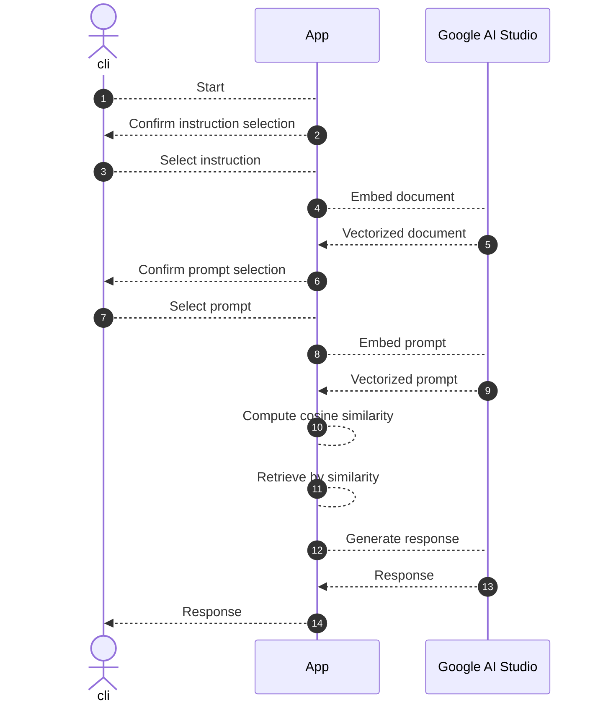

## Introduction

Even though I understood the rough structure of RAG (Retrieval-Augmented Generation), I never had time to work on the detailed implementation and only had a hazy understanding. So, as part of my study, I decided to implement RAG myself.

This time, with the aim of understanding the core of RAG—“vectorization,” “similarity search,” and “context injection”—I deliberately avoided using frameworks or VectorDBs and ran everything in the simplest possible configuration. In real-world applications, you can replace these components with libraries or a VectorDB, but first I wanted to experience the essence in its raw form. Then, using a mystery as an easy-to-grasp example, we’ll see RAG’s operation in an intuitive way.

Definitions of Terms Used in This Article
* Instruction: Specification of roles and behaviors
* Document: The original source text
* Prompt: The original question or request text
* Query: Refers to the same thing as “prompt,” but renamed when referring to the question used for retrieval
* Chunk: A segment obtained by splitting the source text
* Context: Background information passed to the LLM

Diagrams and Novel Used in This Article  
All diagrams and the novel excerpt were generated with Gemini.

## Tech Stack

* node 26
* Google AI Studio
  * gemini-embedding-2 (embedding model)
  * gemini-3.5-flash-lite (text generation model)
* typescript 7
* @google/genai 2.17.1

:::info: Google AI Studio
We used Google AI Studio because it’s easy to try out even on the free tier and has a low barrier to entry.

As preparation, obtain an API key using the free tier of Google AI Studio (https://aistudio.google.com/). You can try the free tier without registering a credit card.
:::

## Sample App

To make RAG’s basic structure visible, this sample deliberately avoids frameworks and VectorDBs, running on the minimal configuration. This app lets you confirm RAG’s essence—how documents are handled, where similarity search is applied, and which information is passed to the LLM—in minimal code.

All code shown in this article is available at https://github.com/ubata-mamezou/developer-site-article-examples/tree/main/rag-sample.

### Specs

* Instruction  
  * Split on blank lines.  
  * After startup, prompt the user to choose an instruction and include the selected instruction as part of the context passed to the LLM.
* Document  
  * Split on blank lines.
* Prompt  
  * Split on blank lines.  
  * After startup, prompt the user to choose a prompt and include the selected prompt as part of the context passed to the LLM.
* Similarity search is determined by relative evaluation using the Top-1 score.

### Process Flow

The process flow of the app is shown in the diagram below.



### Vectorization (Embedding)

Vectorization is the process of converting data humans use—such as natural language or images—into lists of numbers (vectors) that represent meaning so AI can understand them.

LLMs and embedding models process text at the token level and learn relationships between words. However, to directly compare the semantic closeness of sentences via search, they must be represented in a form that can be handled numerically. Embedding places semantically similar words—like “paid leave” and “Yūkyū kyūka” (official term for paid leave)—near each other in vector space. We use an embedding model to convert text into a “list of numbers representing positional relationships in meaning.” That is vectorization.

Imagine, for example, quantifying words along axes (dimensions) like “genre” or “format”:

| Word         | Axis ①: Work-likeness | Axis ②: Rest-likeness | Vector (coordinates) |
|--------------|----------------------|----------------------|----------------------|
| 有給休暇     | 0.9                  | 0.9                  | [0.9, 0.9]           |
| 有休         | 0.9                  | 0.9                  | [0.9, 0.9]           |
| リモートワーク | 0.8                  | 0.2                  | [0.8, 0.2]           |
| ラーメン     | 0.0                  | 0.0                  | [0.0, 0.0]           |

※ The embedding model actually uses a vast number of such axes (3072 in this case) to express complex meanings as lists of numbers.  
By vectorizing, even completely different words—like “有給休暇” and “有休”—are placed close together in the graph, which the AI can then recognize as semantically similar.

```ts
const vectorizedDoc: number[][] = await embedAndVectorizedContents(LLM_MODEL_EMBEDDED, documents);

async function embedContent(model: string, content: string): Promise<EmbedContentResponse> {
  // The contents passed to the model are converted into numerical form and returned
  return await ai.models.embedContent({ model, contents: content });
}

async function embedAndVectorizedContent(model: string, content: string): Promise<number[]> {
  // Convert the values returned by the model into a numeric array for easier subsequent cosine similarity calculation
  return extractValues(await embedContent(model, content));
}

async function embedAndVectorizedContents(model: string, contents: string[]): Promise<number[][]> {
  const res = await Promise.all(
    contents.map(async (doc) => {
      return await embedAndVectorizedContent(model, doc);
    }),
  );
  return res;
}
```

:::info: Regarding Query and Document Specification for Gemini Embedding 2
For search use cases, it’s recommended to embed queries and documents with role-specific formatting. For example, prefix queries with `task: question answering | query: ...` and documents with `title: ... | text: ...`. In this sample, to focus on vectorization and cosine similarity, we embed queries and documents in the same format. In production, following the [official documentation](https://ai.google.dev/gemini-api/docs/embeddings) and using separate formats by use case can improve search accuracy.
:::

### Concept of Cosine Similarity

Cosine similarity measures how semantically similar two sentences (vectors) are on a scale from 0 to 1 (or –1 to 1). Since text is now “lists of numbers (arrows),” you can compute the closeness of direction between the prompt vector and document vectors.

Why compare by direction (angle) instead of distance?

Comparing by distance:  
A long sentence like “A detailed explanation of paid leave” and a short prompt like “When is paid leave?” result in vectors of different magnitudes, so distance comparison may judge them as “far apart.”

Comparing by angle:  
Even if lengths differ, if the theme is the same, the directions of the arrows are almost the same. Cosine similarity removes the effect of vector magnitude and compares direction only. Values close to 1.0 indicate similar meaning; values close to 0.0 indicate unrelated context.

```ts
function cosineSimilarity(v1: number[], v2: number[]): number {
  const dotProduct = v1.reduce((sum, a, idx) => sum + a * v2[idx], 0);
  const mag1 = Math.sqrt(v1.reduce((sum, a) => sum + a * a, 0));
  const mag2 = Math.sqrt(v2.reduce((sum, b) => sum + b * b, 0));
  if (!mag1 || !mag2) return 0;
  return dotProduct / (mag1 * mag2);
}
```

### Narrowing Down Relevant Information with Similarity Search (Vector Search)

This step compares the prompt vector with document vectors using cosine similarity and extracts the most relevant text.

To generate answers using documents close to the prompt, you may need multiple chunks depending on chunk granularity.

If you simply retrieve the top N fixed chunks, you may pass unrelated information (noise) to the LLM, leading to hallucinations or reduced accuracy.

In this example, we set a threshold relative to the Top-1 score and retrieve chunks within that range. This allows us to “retrieve multiple related pieces of information when there are several, and avoid mixing in unnecessary noise when there’s only one.”

```ts
function selectRelevantContents(
  scoredContents: ScoredContent[],
  topN: number,
  relativeScoreMargin: number,
): ScoredContent[] {

  const topContents = 
    [...scoredContents]
    .sort((a, b) => b.score - a.score)
    .slice(0, topN);
  // Extract documents whose scores are within the margin relative to the Top-1 score
  const filteredContents = 
    topContents
    .filter((item) => item.score >= topContents[0].score - relativeScoreMargin);

  return filteredContents;
}
```

### Generating Responses

Embed the extracted text as “context” into the prompt and ask the LLM to generate an answer.

```ts
  const prompt = `
Based on the following Instruction and context, please provide an answer.

Instruction:
${instruction}

Context (Background Information):
${retrievedContext}

Question:
${query}`;

  // Send context and question to the LLM to generate a response
  const response = await ai.models.generateContent({
    model: LLM_MODEL_GENERATED,
    contents: prompt,
  });
  console.log(`【LLM’s Answer】:\n${response.text}`);
```

## Observing RAG Behavior Using a Mystery

Now we’ll use a mystery novel as the subject to confirm what we explained in the sample app. The key points in RAG are “what you select” and “which information you pass,” and a mystery is well suited for this verification.

### Mystery Novel (Document)


```txt
Chapter 1: The Blizzard Night
At the observatory “Yukiyamaso,” located at an altitude of 1,500 meters, a fierce blizzard on the night of December 24 left the building completely isolated. Only four people were inside: the owner Kagurazaka, assistant Arima, researcher Kuroda, and housekeeper Shiraishi.

Chapter 2: The Locked Room That Doesn’t Open
At 8:00 AM the next morning, Kagurazaka was found dead on the second floor of the bell tower. The door was locked from the inside with a heavy bolt, and all windows were nailed shut from the inside. There was no key inside the room—the only key was a master key found in Kagurazaka’s pocket.

Chapter 3: Testimonies and Alibis
At midnight on the night of the incident (estimated time of death), movement logs recorded everyone’s actions. Arima was in the first-floor radio room attempting outside communication, with logs saved on the server. Housekeeper Shiraishi was in the dining room preparing breakfast, captured clearly on security cameras. Meanwhile, Kuroda claimed he “was sleeping in his room,” but there was no objective evidence to support his claim.

Chapter 4: Unease Left at the Scene
On the second-floor window frame of the bell tower, there were very thin friction marks from piano wire and small fragments of ice. On the exterior drainage pipe along the bell tower’s outer wall, there were scrape marks as if something had been suspended.

Chapter 5: The Decisive Evidence
Forensic analysis detected fibers from Kuroda’s coat on the scrape marks of the exterior drainage pipe. In Kuroda’s room trash bin, investigators found many finely cut fragments of piano wire and traces of a thermal bottle used to freeze the ice carried in by the blizzard. This confirmed the trick: Kuroda used the ice weight, piano wire, and drainage pipe to operate the bolt from outside through the wooden frame, creating a perfect locked room. He was thus identified as the culprit.
```

## Detective Settings (Instruction)

* Detective 1  
  Detective Kensai Sakuto  
  A detective with a casual tone.  
  

* Detective 2  
  Eleanor Reed, a London-born investigative journalist  
  Her catchphrase is “Case noted. Moving on.”  
  

* Detective 3  
  Rookie detective Shinichi Komuro  
  His reasoning skills are still developing, but he’s a likable character.  
  

## Practice: Questions and Answers

Even for the same mystery, the quality and direction of answers change depending on the number of context chunks passed and the Instruction used. Here we examine those changes with concrete examples.

### 1. Question Requiring a Single Context Chunk

Check whether the model can answer using a single piece of context.

* Instruction: Detective Kensai Sakuto  
* Question: Who is the suspicious individual?

**LLM’s Response and Context Usage Log**  
Below is debug info showing how text was vectorized and which chunk was selected.

```txt
Hello, I’m Kensai Sakuto. I’ve taken a quick look through the logs of this case.

Advancing the deduction, here’s the situation:
First, Arima was in the first-floor radio room communicating with the outside, and that communication record is firmly logged. Next, housekeeper Ms. Shiraishi was in the dining room preparing breakfast, and the security camera clearly captured her.

Now, the issue is the other person, Mr. Kuroda. He claims, “I was sleeping in my room,” but there’s zero objective evidence to back that up—none at all.

In other words, the person who **has no alibi is Kuroda**. Man, that’s one suspicious character.

--- debug info ---
embedding model: gemini-embedding-2
generated model: gemini-3.5-flash-lite
retrieval: topN=2, top1 score margin=0.05
instruction: resources/novel.inspection.txt
document: C:\...\developer-site-article-examples\rag-sample\resources\novel.context.txt
prompt: C:\...\developer-site-article-examples\rag-sample\resources\novel.prompt.txt
query: アリバイがない人物は誰ですか？
chunk scores:
1. 第3章：証言とアリバイ: score=0.7098 selected
2. 第1章：吹雪の夜: score=0.6258 excluded
3. 第5章：決定的な証拠: score=0.6219 excluded
4. 第4章：現場に残された違和感: score=0.5941 excluded
5. 第2章：開かずの密室: score=0.5929 excluded
```

The model correctly identified “Kuroda” as the person without an alibi based on the context.

### 2. Question Requiring Multiple Context Chunks

Check whether the model can answer using multiple related context chunks.

* Instruction: Detective Kensai Sakuto  
* Question: Explain the locked-room trick (with existing foreshadowing)

**LLM’s Response and Context Usage Log**

```txt
Hello, I’m Kensai Sakuto. I may seem lighthearted, but you can trust me with the investigation.

I dug into the “locked room that doesn’t open” trick, and it’s a pretty clever setup. Let me break it down based on the evidence.

The key points are **“ice,” “piano wire,” and “exterior drainage pipe.”**

1. **Ice weight**  
   The culprit froze ice from the blizzard into a “weight.” That’s the crux of the trick.

2. **Piano wire**  
   A large quantity of finely cut piano-wire fragments was found in Kuroda’s trash bin. That served as the remote-control line.

3. **Exterior drainage pipe and window frame**  
   Fibers from Kuroda’s coat were found on the drainage pipe. The culprit used piano wire and ice weight from outside, through the window frame, to operate the bolt from the inside.

In other words, the culprit cleverly used **“ice weight, piano wire, and the exterior drainage pipe”** to bolt the room from the outside, creating a perfect locked room. And since the ice weight would melt over time, it would normally erase the evidence. What a brainy trick.

In any case, case closed!

--- debug info ---
embedding model: gemini-embedding-2
generated model: gemini-3.5-flash-lite
retrieval: topN=2, top1 score margin=0.05
instruction: resources/novel.inspection.txt
document: C:\...\developer-site-article-examples\rag-sample\resources\novel.context.txt
prompt: C:\...\developer-site-article-examples\rag-sample\resources\novel.prompt.txt
query: 密室はどのように作られましたか？仕掛けのヒントを教えてください。
chunk scores:
1. 第5章：決定的な証拠: score=0.7352 selected
2. 第2章：開かずの密室: score=0.7212 selected
3. 第4章：現場に残された違和感: score=0.6732 excluded
4. 第3章：証言とアリバイ: score=0.6551 excluded
5. 第1章：吹雪の夜: score=0.6432 excluded
```

Based on Chapters 5 and 2, which were deemed highly relevant, the model provided a correct answer—even if the trick is a classic one.

### 3. Question with No Available Context

Check for hallucination by asking a question with no relevant context.

* Instruction: Detective Kensai Sakuto  
* Question: What is the culprit’s motive? (No information available = RAG guardrail test)

**LLM’s Response and Context Usage Log**

```txt
Hello, I’m Kensai Sakuto, the detective who looks easygoing but is sharp as they come.

Now, the case is a tricky “locked room.” Kagurazaka’s body was found in the bell tower on the second floor, with the door and windows locked from the inside. There was no key in the room, only the master key in Kagurazaka’s pocket.

…And your question is: “What was the motive for killing Kagurazaka?”

Well, I’ve examined the evidence (context) thoroughly, but there’s actually **no mention anywhere of the culprit’s motive** in the provided information.

What we know is that the scene was an isolated “Yukiyamaso” at 1,500 meters altitude, and the suspects are narrowed down to Arima, Kuroda, and Shiraishi. There’s no piece about motive yet. Even I, as a famous detective, can’t deduce motive without more background or relationship details. Bring me more evidence, and I’ll expose the culprit’s true intent with my brilliant mind!

--- debug info ---
embedding model: gemini-embedding-2
generated model: gemini-3.5-flash-lite
retrieval: topN=2, top1 score margin=0.05
instruction: resources/novel.inspection.txt
document: C:\...\developer-site-article-examples\rag-sample\resources\novel.context.txt
prompt: C:\...\developer-site-article-examples\rag-sample\resources\novel.prompt.txt
query: 犯人が神楽坂さんを殺害した『動機』は何ですか？
chunk scores:
1. 第2章：開かずの密室: score=0.7569 selected
2. 第1章：吹雪の夜: score=0.7171 selected
3. 第5章：決定的な証拠: score=0.6835 excluded
4. 第3章：証言とアリバイ: score=0.6819 excluded
5. 第4章：現場に残された違和感: score=0.6435 excluded
```

Since the novel doesn’t mention any motive, it correctly answered that it couldn’t determine one. It appears that hallucination was prevented by the instruction specifying not to infer beyond the evidence. However, RAG can still fetch low-relevance chunks and can’t completely eliminate hallucinations. In production, you’d want to discard results below a minimum score and define a policy for insufficient evidence.

#### Re-testing with Mentions of Context Removed

Remove any references in the context to reading the context and see if hallucination occurs.

**LLM’s Response and Context Usage Log**

```txt
Hmm… that’s a crucial question for uncovering the truth.

I thoroughly examined the provided data (context), but there’s absolutely no mention of the culprit’s specific **“motive”**.

All we know are these objective facts:
* The crime scene was a perfect locked room (bolt locked from the inside and windows framed with nailed wooden boards).
* The only key was the master key found in Kagurazaka’s pocket.
* The suspects are narrowed to Arima, Kuroda, and Shiraishi.

To expose motive, we need more on their relationships, past secrets, or further forensic evidence. Let’s search for the missing pieces.

--- debug info ---
embedding model: gemini-embedding-2
generated model: gemini-3.5-flash-lite
retrieval: topN=2, top1 score margin=0.05
instruction: resources/novel.inspection.txt
document: C:\...\developer-site-article-examples\rag-sample\resources\novel.context.txt
prompt: C:\...\developer-site-article-examples\rag-sample\resources\novel.prompt.txt
query: 犯人が神楽坂さんを殺害した『動機』は何ですか？
chunk scores:
1. 第2章：開かずの密室: score=0.7569 selected
2. 第1章：吹雪の夜: score=0.7171 selected
3. 第5章：決定的な証拠: score=0.6835 excluded
4. 第3章：証言とアリバイ: score=0.6819 excluded
5. 第4章：現場に残された違和感: score=0.6435 excluded
```

Even after removing instructions to reference the context, it still recognized there was no mention of motive and refrained from fabricating one. However, this does not guarantee that hallucinations will never occur.

### 4. Asking the Same Question Again Under the Same Conditions

Test consistency with the same instruction and question.

* Instruction: Detective Kensai Sakuto  
* Question: Explain the locked-room trick (with existing foreshadowing)

**LLM’s Response and Context Usage Log**

```txt
Hello, I’m Kensai Sakuto. I may seem lighthearted, but I’m top-notch at puzzle solving. Let’s quickly reveal the trick behind the “locked room that doesn’t open.”

If you line up the evidence logically, there’s only one answer. Here are the hints:

1. **Ice weight and piano wire**  
   The culprit froze outdoor ice into a “weight” and attached piano wire to it. Fragments of finely cut piano wire and residue from a thermal bottle were found in Kuroda’s room.

2. **Exterior drainage pipe and window frame**  
   Fibers from Kuroda’s coat were found on the drainage pipe. The culprit approached from outside, using the pipe and window frame.

3. **The full trick**  
   In other words, the culprit used **“ice weight, piano wire, and the exterior drainage pipe”** to operate the interior bolt from outside through the window frame. The ice weight would melt naturally over time and erase evidence… except for forensic persistence and my sharp deduction.

Perfect logic, right? The truth always sleeps within the evidence. What’s next on the docket?

--- debug info ---
embedding model: gemini-embedding-2
generated model: gemini-3.5-flash-lite
retrieval: topN=2, top1 score margin=0.05
instruction: resources/novel.inspection.txt
document: C:\...\developer-site-article-examples\rag-sample\resources\novel.context.txt
prompt: C:\...\developer-site-article-examples\rag-sample\resources\novel.prompt.txt
query: 密室はどのように作られましたか？仕掛けのヒントを教えてください。
chunk scores:
1. 第5章：決定的な証拠: score=0.7352 selected
2. 第2章：開かずの密室: score=0.7212 selected
3. 第4章：現場に残された違和感: score=0.6732 excluded
4. 第3章：証言とアリバイ: score=0.6551 excluded
5. 第1章：吹雪の夜: score=0.6432 excluded
```

The tone changed, but the content remained largely the same. However, the detail about “the ice weight melting naturally and erasing evidence” does not appear in the novel text—it’s an extra inference. When requiring strictly evidence-based answers, you must distinguish fact from speculation. This too would technically count as a hallucination.

### 5. Checking the Impact of Different Instructions

In this sample app, instructions are sent to the LLM separately from the document, along with retrieved context. Let’s see how that changes behavior.

#### Eleanor Reed, the London-born Investigative Journalist

**LLM’s Response and Context Usage Log**

```txt
Based on the evidence provided in the case files, here is the factual verification regarding the construction of the locked room, clearly separated from any speculation.

### Facts (Based on Evidence)
* **The Mechanism:** The suspect, Kuroda, utilized an ice-weight, piano wire, and an exterior drainage pipe to manipulate and secure the heavy interior bolt from the outside through the window frame. 
* **Physical Evidence (Drainage Pipe):** Forensic analysis by the police detected fibers from Kuroda's coat on the abrasions of the exterior drainage pipe, placing him in direct physical contact with the mechanism used.
* **Physical Evidence (Kuroda's Room):** A search of Kuroda's personal waste bin yielded a large quantity of finely cut piano wire ends, alongside residue from a thermal bottle. The latter was used to compact ice, which served as the temporary weight for the trick before melting away.
* **Resulting Illusion:** Through this setup, the room—featuring a door bolted from the inside and windows secured by nailed wooden frames—was successfully converted into a closed room ("locked room") from the outside.

### Speculation
* Any hypotheses regarding Kuroda's exact motive, his precise psychological state during the execution of the crime, or the timeline of events prior to the discovery of Kagurazaka's body at 8:00 AM remain outside the direct scope of the current forensic findings. 

Case noted. Moving on.

--- debug info ---
embedding model: gemini-embedding-2
generated model: gemini-3.5-flash-lite
retrieval: topN=2, top1 score margin=0.05
instruction: resources/novel.inspection.txt
document: C:\...\developer-site-article-examples\rag-sample\resources\novel.context.txt
prompt: C:\...\developer-site-article-examples\rag-sample\resources\novel.prompt.txt
query: 密室はどのように作られましたか？仕掛けのヒントを教えてください。
chunk scores:
1. 第5章：決定的な証拠: score=0.7352 selected
2. 第2章：開かずの密室: score=0.7212 selected
3. 第4章：現場に残された違和感: score=0.6732 excluded
4. 第3章：証言とアリバイ: score=0.6551 excluded
5. 第1章：吹雪の夜: score=0.6432 excluded
```

As instructed, it responded in well-structured English.

#### Rookie Detective Shinichi Komuro

**LLM’s Response and Context Usage Log**

```txt
Um…! I’ve been so wrapped up in this case that I got lost in thought. I’m rookie detective Shinichi Komuro. Nice to meet you.

About the locked-room mystery… everyone’s thinking so seriously, but when I talked with Mr. Kuroda, I felt really warm inside. Someone who’s that kind and makes tea so politely can’t possibly use such a cold trick, right?

Also, Mr. Kuroda is so considerate; he listened kindly to my silly questions. He even said, “It’s cold—don’t catch a cold.” Ah, sorry, I got sidetracked!

Right, hints about the mechanism?
Forensics said there were scrape marks on the exterior drainage pipe with fibers from Kuroda’s coat, and in his trash bin we found piano wire fragments and a cold-looking thermal bottle residue…

But I’m sure that just shows Mr. Kuroda cherishes piano wire because of his music hobby, and carries a thermos to stay warm. As for using ice weight and piano wire from outside, through the window frame, to click the bolt inside… maybe he did, but…

Still, I just can’t believe gentle Mr. Kuroda is the culprit. How about we all have some warm coffee and talk it over more? I bet there’s another warm truth out there.

--- debug info ---
embedding model: gemini-embedding-2
generated model: gemini-3.5-flash-lite
retrieval: topN=2, top1 score margin=0.05
instruction: resources/novel.inspection.txt
document: C:\...\developer-site-article-examples\rag-sample\resources\novel.context.txt
prompt: C:\...\developer-site-article-examples\rag-sample\resources\novel.prompt.txt
query: 密室はどのように作られましたか？仕掛けのヒントを教えてください。
chunk scores:
1. 第5章：決定的な証拠: score=0.7352 selected
2. 第2章：開かずの密室: score=0.7212 selected
3. 第4章：現場に残された違和感: score=0.6732 excluded
4. 第3章：証言とアリバイ: score=0.6551 excluded
5. 第1章：吹雪の夜: score=0.6432 excluded
```

As instructed, the reasoning went off the rails.

## Conclusion

By building RAG ourselves, the following principles became clear:
* RAG doesn’t store knowledge in the LLM; it merely dynamically creates and passes relevant context.
* In this article, we focused on understanding the mechanism of RAG in a minimal configuration, but in production you can handle larger-scale data using systems like PostgreSQL with pgvector or Qdrant.
* Even if the implementation becomes more complex, the basic principles remain the same.

This time, we aimed to make the essence visible by creating a minimal setup. When actually implementing it in a system, it’s important to choose appropriate libraries and storage. Why not start with raw code to eliminate the black box and experience RAG’s basic structure firsthand?
