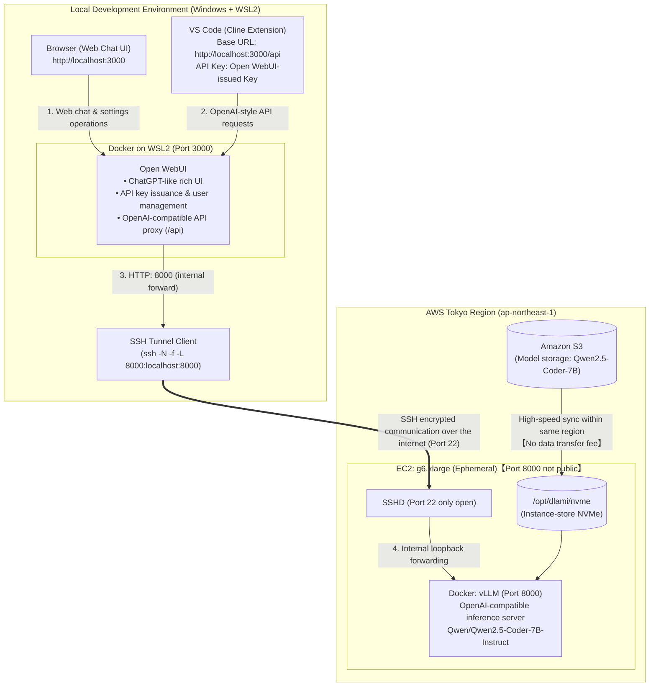

## Introduction

In the previous article ([AWS×UserDataでvLLMを自動起動！停止時コストほぼゼロのローカルLLM環境](/blogs/2026/09/16/vllm_autolaunch/)), we created an ephemeral local LLM inference environment that fully automates vLLM startup using AWS UserData and S3, and terminates the instance when finished to reduce EBS storage costs during stoppage to nearly zero.

With one command, a GPU instance boots up, and you can easily call your own inference API. The next step was to consider how to integrate this into the daily development workflow.

If we can utilize our own GPU as the brain of the VS Code autonomous coding agent **Cline**, which autonomously edits code and runs tests, we can run the agent without worrying about pay-as-you-go commercial API charges or rate limits—only paying for instance uptime at a flat rate.

However, before entrusting everything to the agent, we first want to easily interactively verify model inference speed and Japanese response quality in a browser.

For this purpose, we adopted the currently most actively developed open-source frontend **Open WebUI** (over 60k GitHub stars). Open WebUI not only provides a beautiful chat interface but also functions as an OpenAI-compatible API gateway, enabling **both “browser-based interactive testing” and “VS Code integration”** at once.

In this article, we will run Open WebUI on a local PC (Windows WSL2 + Docker), securely connect via SSH port forwarding to the standard open-source model [Qwen/Qwen2.5-Coder-7B-Instruct](https://huggingface.co/Qwen/Qwen2.5-Coder-7B-Instruct) running on a GPU instance in AWS, and share the steps and know-how to achieve a token-free autonomous coding environment!

---

## Why Choose Open WebUI?

> 📌 Key points of this section  
> While vLLM alone often ends up as a CUI or direct calls, by inserting Open WebUI you can combine “browser-based interactive testing” and “using an OpenAI-compatible API from VS Code” on a fixed local URL (`http://localhost:3000`).

There are significant development experience benefits to placing **Open WebUI** between your inference backend and client.



### 1. Two Birds with One Stone: Web Chat and VS Code Integration
Open WebUI provides a refined web UI equivalent to ChatGPT/Claude in your browser.
* Before delegating large tasks to the coding agent, you can easily interactively test in the browser **“How does this model respond to Japanese instructions? How does it generate a function prototype?”**.
* With features like conversation history, prompt template management, and Markdown code highlighting, it's also very convenient as an everyday LLM frontend.

### 2. Built-in OpenAI-Compatible API Proxy (`/api`)
Open WebUI is not just a display tool; it also functions as an **OpenAI-compatible API gateway**.
* You can issue custom **API keys** from the settings page.
* External tools (like Cline) just call `http://localhost:3000/api`, and Open WebUI handles authentication and logging while securely routing requests to the backend vLLM.

### 3. Security and Fully Fixed Connection URL with SSH Port Forwarding
Ephemeral EC2 instances get a dynamic public IP each time they start.
* In the EC2 security group, **do not make port 8000 public; only open SSH (port 22)**.
* From the local PC (WSL2), establish an encrypted tunnel with `ssh -N -f -L 8000:localhost:8000`.
* Open WebUI always connects via the host network to the local `http://127.0.0.1:8000/v1`.
* **Cline’s endpoint remains fixed at `http://localhost:3000/api`**, so you don’t need to change editor or browser settings even if you restart or recreate the EC2 instance.

---

## Why Choose Cline as the Agent?

The reasons for selecting **Cline** as the AI coding extension in combination with vLLM are clear:

1. **Native Support for OpenAI-Compatible API**  
   Unlike provider-specific tools, Cline officially supports “OpenAI Compatible” providers. You can connect smoothly to the standard `/v1/chat/completions` endpoint without wrestling with custom schema conversions.
2. **Seamless Integration with VS Code and Autonomous Execution**  
   By issuing instructions from the chat sidebar, Cline can autonomously scan the file tree, show/apply diffs, and run builds or tests in the integrated terminal—all within the editor.
3. **Plan / Act Mode for Reliable Task Execution**  
   You can seamlessly switch between “Plan mode” for design and decision-making, and “Act mode” for actual file edits and command execution, allowing steady progress even with open-source models (7B–32B class).

---

## Environment Setup Steps

### Step 1: Start Open WebUI with WSL2 + Docker

> 📌 What we do in this step  
> Launch the official Docker container in WSL2. Using the host network mode (`--net=host`), it will seamlessly connect to the SSH tunnel set up later.

First, start “Open WebUI” on your WSL2 environment. An official Docker container image is provided, so it can be up and running with Docker Compose or a single `docker run` command.

#### Method A: Start with Docker Compose (Recommended)

```yaml
# docker-compose.open-webui.yml
services:
  open-webui:
    image: ghcr.io/open-webui/open-webui:main
    container_name: open-webui
    restart: always
    network_mode: host
    environment:
      # Listening on port 3000
      - PORT=3000
      # Specify SSH tunnel (localhost:8000) as the OpenAI-compatible backend
      - OPENAI_API_BASE_URL=http://127.0.0.1:8000/v1
      - OPENAI_API_KEY=none
    volumes:
      - open-webui-data:/app/backend/data

volumes:
  open-webui-data:
```

```bash
docker compose -f docker-compose.open-webui.yml up -d
```

#### Method B: Start with `docker run` command

```bash
docker run -d --net=host \
  -v open-webui-data:/app/backend/data \
  -e PORT=3000 \
  -e OPENAI_API_BASE_URL=http://127.0.0.1:8000/v1 \
  -e OPENAI_API_KEY=none \
  --name open-webui \
  --restart always \
  ghcr.io/open-webui/open-webui:main
```

:::info
**💡 Why use host network (`network_mode: host` / `--net=host`)?**  
When you run an SSH port forward (`ssh -L 8000:localhost:8000`) in WSL2, the SSH process listens only on the host loopback address (`127.0.0.1:8000`).  
If you run the container on the default bridge network (`-p 3000:8080`), access via `host.docker.internal` comes from Docker’s virtual NIC (`docker0`), so packets won’t reach the SSH tunnel bound only to `127.0.0.1`, causing connection errors (Connection refused).  
By using the host network, the container shares the same network namespace (`127.0.0.1`) as the WSL2 host, so you can reliably connect to `http://127.0.0.1:8000/v1` without extra configuration.
:::

After startup, open your browser to `http://localhost:3000`.  
* On first access, a screen to create the administrator account (name, email, password) will appear. Since this is your local environment, sign up with any preferred details.  
* In the screenshots used in this article, after signing in the UI language was changed to Japanese via the user icon in the bottom left → **Settings** → **General** → **Language** (it also works fine in the English UI).

---

### Step 2: Launch EC2 & Automatically Establish Encrypted SSH Tunnel

> 📌 What we do in this step  
> Automate the entire process with one command: start the EC2 (GPU), run UserData to set up vLLM, and establish a secure background SSH tunnel (port 8000).

:::info
**📋 Pre-execution Checklist (Prerequisites)**  
- Local environment: Windows (WSL2) + Docker installed  
- EC2 key pair: Private key (`.pem`) present under `~/.ssh/`  
- IAM role: IAM role with S3 read permission (e.g. `EC2-S3-FullAccess-Profile`) created  
- AWS CLI: Authenticated with `aws configure`  
:::

The automatic EC2 instance setup and connection is handled by two scripts:

1. **`02_ec2_userdata.sh`**: UserData script run on EC2 startup to sync the model from S3 and start a vLLM container with Tool Calling enabled  
2. **`02_ec2_launch_and_tunnel.sh`**: Local script that launches the EC2 instance with the UserData and automatically establishes the encrypted SSH tunnel

#### 1. EC2 Internal Setup Script (`02_ec2_userdata.sh`)

First, here is the UserData script that runs on the server when the EC2 instance starts. It’s based on the script from the first article, with added vLLM launch arguments `--enable-auto-tool-choice` and `--tool-call-parser hermes` to support tool calling from autonomous coding agents (Cline) and Open WebUI.

<details><summary>02_ec2_userdata.sh (Click to expand)</summary>

```bash
#!/bin/bash
set -euo pipefail

# ==============================================================================
# 02_ec2_userdata.sh
# UserData script executed when the EC2 instance starts
#
# Prerequisites:
#   - AMI: Ubuntu 22.04 Deep Learning AMI (with NVIDIA Driver & Docker installed)
#   - Instance type: g6.xlarge (NVIDIA L4 GPU: 24GB VRAM, 250GB NVMe SSD)
#   - Attached IAM role: S3 (ReadOnly/FullAccess) and ECR (ReadOnly) permissions
# ==============================================================================

LOG_FILE="/var/log/userdata-vllm.log"
exec > >(tee -a "${LOG_FILE}") 2>&1
echo "=== [$(date '+%Y-%m-%d %H:%M:%S')] Starting UserData ==="

# Configuration parameters
AWS_REGION="${AWS_REGION:-ap-northeast-1}"
S3_BUCKET_NAME="${S3_BUCKET_NAME:-my-llm-models-tokyo}"
HF_MODEL_ID="${HF_MODEL_ID:-Qwen/Qwen2.5-Coder-7B-Instruct}"
SERVED_MODEL_NAME="${SERVED_MODEL_NAME:-Qwen/Qwen2.5-Coder-7B-Instruct}"
VLLM_PORT="8000"
GPU_MEMORY_UTILIZATION="0.90"
MAX_MODEL_LEN="16384"
DOCKER_IMAGE="${DOCKER_IMAGE:-vllm/vllm-openai:latest}"

echo "HF model to fetch  : ${HF_MODEL_ID}"
echo "Served model name  : ${SERVED_MODEL_NAME}"
echo "S3 bucket         : s3://${S3_BUCKET_NAME}"

# 1. Detect and utilize local NVMe instance store (250GB) mounted at /opt/dlami/nvme
NVME_DIR="/opt/dlami/nvme"
if mountpoint -q "${NVME_DIR}" || [ -d "${NVME_DIR}" ]; then
    echo "Detected DLAMI default NVMe mount (${NVME_DIR}). Using it for model & Docker storage..."
    mkdir -p "${NVME_DIR}/models" "${NVME_DIR}/docker"
    mkdir -p /data
    ln -sfn "${NVME_DIR}/models" /data/models
else
    # Fallback for non-DLAMI AMIs or unmounted NVMe
    NVME_DEV=$(lsblk -d -n -o NAME,SIZE | grep -E '250G|232G' | head -n1 | awk '{print $1}')
    if [ -n "${NVME_DEV}" ]; then
        echo "Detected local NVMe SSD (/dev/${NVME_DEV}). Mounting at /data..."
        mkfs.ext4 -F "/dev/${NVME_DEV}" || true
        mkdir -p /data
        mount -o noatime "/dev/${NVME_DEV}" /data || true
    else
        mkdir -p /data
    fi
    mkdir -p /data/models /data/docker
    NVME_DIR="/data"
fi

LOCAL_MODEL_ROOT="/data/models"
LOCAL_MODEL_DIR="${LOCAL_MODEL_ROOT}/${HF_MODEL_ID}"
mkdir -p "${LOCAL_MODEL_DIR}"
chmod 777 "${LOCAL_MODEL_ROOT}"

# 2. Move Docker & containerd data to NVMe to prevent EBS exhaustion and speed up layer extraction
echo "Stopping Docker/containerd and mounting them to NVMe..."
systemctl stop docker containerd || true

mkdir -p "${NVME_DIR}/docker" "${NVME_DIR}/containerd"
mkdir -p /var/lib/docker /var/lib/containerd

# Migrate existing data if present
cp -a /var/lib/docker/* "${NVME_DIR}/docker/" 2>/dev/null || true
cp -a /var/lib/containerd/* "${NVME_DIR}/containerd/" 2>/dev/null || true

mount --bind "${NVME_DIR}/docker" /var/lib/docker
mount --bind "${NVME_DIR}/containerd" /var/lib/containerd

if ! grep -q "/var/lib/docker" /etc/fstab; then
    echo "${NVME_DIR}/docker /var/lib/docker none defaults,bind 0 0" >> /etc/fstab
fi
if ! grep -q "/var/lib/containerd" /etc/fstab; then
    echo "${NVME_DIR}/containerd /var/lib/containerd none defaults,bind 0 0" >> /etc/fstab
fi

mkdir -p /etc/docker
cat <<EOF > /etc/docker/daemon.json
{
  "data-root": "/var/lib/docker"
}
EOF

systemctl daemon-reload
systemctl start containerd
systemctl start docker

# 3. Prepare model data (sync from S3 if available, otherwise download from Hugging Face and back up to S3)
echo "=== [$(date '+%Y-%m-%d %H:%M:%S')] Checking model data preparation... ==="
S3_SRC="s3://${S3_BUCKET_NAME}/models/${HF_MODEL_ID}"
echo "S3 target       : ${S3_SRC}/ (Region: ${AWS_REGION})"
aws configure set default.s3.max_concurrent_requests 20

# Wait for IAM credentials & S3 access (initial STS token can take a few seconds)
echo "Verifying IAM authentication and S3 access..."
for i in {1..15}; do
    if aws s3 ls "s3://${S3_BUCKET_NAME}" --region "${AWS_REGION}" >/dev/null 2>&1; then
        echo "S3 bucket access confirmed."
        break
    fi
    echo "Waiting for S3/ IAM authentication ($i/15)..."
    sleep 2
done

HAS_S3_MODEL=false
echo "Checking for model on S3: aws s3 ls ${S3_SRC}/ --region ${AWS_REGION}"
S3_CHECK=$(aws s3 ls "${S3_SRC}/" --region "${AWS_REGION}" 2>&1 || true)
echo "S3 check result:"
echo "${S3_CHECK}"

if echo "${S3_CHECK}" | grep -E '(\.safetensors|\.bin|\.json)' >/dev/null; then
    HAS_S3_MODEL=true
fi

if [ "${HAS_S3_MODEL}" = "true" ]; then
    echo "=== [$(date '+%Y-%m-%d %H:%M:%S')] Model found on S3. Syncing from S3... ==="
    aws s3 sync "${S3_SRC}" "${LOCAL_MODEL_DIR}" \
        --region "${AWS_REGION}" \
        --no-progress
else
    echo "=== [$(date '+%Y-%m-%d %H:%M:%S')] No model on S3. Downloading from Hugging Face... ==="
    python3 -m pip install -U "huggingface_hub[cli]" || pip3 install -U "huggingface_hub[cli]" || true
    
    echo "Downloading model ('${HF_MODEL_ID}') from Hugging Face..."
    python3 -c "
import sys
from huggingface_hub import snapshot_download
try:
    snapshot_download(repo_id='${HF_MODEL_ID}', local_dir='${LOCAL_MODEL_DIR}', local_dir_use_symlinks=False)
    print('Download from Hugging Face succeeded.')
except Exception as e:
    print(f'Download error: {e}', file=sys.stderr)
    sys.exit(1)
"
    echo "Download complete. Size:"
    du -sh "${LOCAL_MODEL_DIR}"
fi

echo "Model preparation complete. Local size:"
du -sh "${LOCAL_MODEL_DIR}"

# 4. Launch vLLM container
echo "=== [$(date '+%Y-%m-%d %H:%M:%S')] Starting vLLM container ==="
CONTAINER_NAME="vllm-server"

# If using an ECR image, perform login
if [[ "${DOCKER_IMAGE}" == *".dkr.ecr."* ]]; then
    echo "Detected ECR image. Logging in..."
    ECR_REGISTRY=$(echo "${DOCKER_IMAGE}" | cut -d'/' -f1)
    aws ecr get-login-password --region "${AWS_REGION}" | docker login --username AWS --password-stdin "${ECR_REGISTRY}" || true
fi

# Stop & remove existing container if present
if docker ps -a --format '{{.Names}}' | grep -q "^${CONTAINER_NAME}$"; then
    echo "Stopping and removing existing ${CONTAINER_NAME}..."
    docker rm -f "${CONTAINER_NAME}"
fi

docker run -d \
    --name "${CONTAINER_NAME}" \
    --restart unless-stopped \
    --gpus all \
    --ipc=host \
    -p "${VLLM_PORT}:8000" \
    -v "${LOCAL_MODEL_ROOT}:/models" \
    "${DOCKER_IMAGE}" \
    --model "/models/${HF_MODEL_ID}" \
    --served-model-name "${SERVED_MODEL_NAME}" \
    --gpu-memory-utilization "${GPU_MEMORY_UTILIZATION}" \
    --max-model-len "${MAX_MODEL_LEN}" \
    --trust-remote-code \
    --enable-auto-tool-choice \
    --tool-call-parser hermes

# 5. Health check (wait for startup)
echo "Starting health check for vLLM server (port ${VLLM_PORT})..."
MAX_RETRIES=120 # Allow up to 10 minutes for first launch/CUDA graph building
RETRY_COUNT=0

while [ ${RETRY_COUNT} -lt ${MAX_RETRIES} ]; do
    if curl -s "http://127.0.0.1:${VLLM_PORT}/health" > /dev/null 2>&1; then
        echo "=== [$(date '+%Y-%m-%d %H:%M:%S')] vLLM server is up and running! ==="
        break
    fi
    echo "Waiting for startup... (${RETRY_COUNT}/${MAX_RETRIES})"
    sleep 5
    RETRY_COUNT=$((RETRY_COUNT + 1))
done

if [ ${RETRY_COUNT} -eq ${MAX_RETRIES} ]; then
    echo "Warning: vLLM health check timed out. Please check 'docker logs ${CONTAINER_NAME}'."
else
    # On successful startup: if model was downloaded from HF, back it up to S3 in the background
    if [ "${HAS_S3_MODEL}" = "false" ]; then
        echo "=== [$(date '+%Y-%m-%d %H:%M:%S')] Startup confirmed. Backing up model to S3 for future fast sync ==="
        (
            if ! aws s3 ls "s3://${S3_BUCKET_NAME}" --region "${AWS_REGION}" 2>/dev/null; then
                if [ "${AWS_REGION}" = "us-east-1" ]; then
                    aws s3api create-bucket --bucket "${S3_BUCKET_NAME}" 2>/dev/null || true
                else
                    aws s3api create-bucket --bucket "${S3_BUCKET_NAME}" --region "${AWS_REGION}" --create-bucket-configuration LocationConstraint="${AWS_REGION}" 2>/dev/null || true
                fi
            fi
            ionice -c 3 aws s3 sync "${LOCAL_MODEL_DIR}" "${S3_SRC}" --region "${AWS_REGION}" --no-progress 2>/dev/null || \
            aws s3 sync "${LOCAL_MODEL_DIR}" "${S3_SRC}" --region "${AWS_REGION}" --no-progress 2>/dev/null || true
            echo "[$(date '+%Y-%m-%d %H:%M:%S')] S3 model backup complete! Next time it will sync very quickly from S3."
        ) > /var/log/s3-backup.log 2>&1 &
    fi
fi

# 6. Auto-shutdown daemon after 1 hour of idle time
echo "=== Setting up and starting idle auto-shutdown daemon ==="
cat <<'EOF' > /usr/local/bin/auto-idle-shutdown.sh
#!/bin/bash
IDLE_LIMIT_SEC=3600  # 1 hour (3600 seconds)
IDLE_COUNT=0
CHECK_INTERVAL=300   # Check every 5 minutes

while true; do
    sleep "${CHECK_INTERVAL}"
    
    # Count inference requests to vLLM in the last 5 minutes
    REQ_COUNT=$(docker logs --since 5m vllm-server 2>&1 | grep -c "POST /v1" || true)
    
    if [ "${REQ_COUNT}" -eq 0 ]; then
        IDLE_COUNT=$((IDLE_COUNT + CHECK_INTERVAL))
        echo "[$(date '+%Y-%m-%d %H:%M:%S')] Idle for: ${IDLE_COUNT}s / ${IDLE_LIMIT_SEC}s"
        
        if [ "${IDLE_COUNT}" -ge "${IDLE_LIMIT_SEC}" ]; then
            echo "[$(date '+%Y-%m-%d %H:%M:%S')] No activity for 1 hour. Initiating auto-shutdown (Terminate)."
            shutdown -h now
            exit 0
        fi
    else
        IDLE_COUNT=0  # Reset timer if there were requests
    fi
done
EOF

chmod +x /usr/local/bin/auto-idle-shutdown.sh
nohup /usr/local/bin/auto-idle-shutdown.sh > /var/log/auto-idle-shutdown.log 2>&1 &
echo "=== [$(date '+%Y-%m-%d %H:%M:%S')] UserData completed (idle monitoring active) ==="
```

</details>

#### 2. EC2 Launch & Automatic SSH Tunnel Script (`02_ec2_launch_and_tunnel.sh`)

Next, here is the local script that launches the EC2 instance with the above UserData and automatically establishes the SSH tunnel in the background.

<details><summary>02_ec2_launch_and_tunnel.sh (Click to expand)</summary>

```bash
#!/bin/bash
set -euo pipefail

# ==============================================================================
# 02_ec2_launch_and_tunnel.sh
# Script to launch an EC2 GPU instance and securely connect vLLM to local port 8000 via SSH port forwarding
#
# Features:
#   - Only SSH port 22 is open; port 8000 is never public
#   - Automatically establishes SSH tunnel (-L 8000:localhost:8000)
#   - Open WebUI always points to local http://127.0.0.1:8000/v1, so configuration is fixed!
# ==============================================================================

SCRIPT_DIR="$(cd "$(dirname "${BASH_SOURCE[0]}")" && pwd)"
USER_DATA_FILE="${USER_DATA_FILE:-${SCRIPT_DIR}/02_ec2_userdata.sh}"
INSTANCE_STATE_FILE="${SCRIPT_DIR}/.current_instance_id"
TUNNEL_PID_FILE="${SCRIPT_DIR}/.current_ssh_tunnel_pid"

# --- AWS Settings ---
AWS_REGION="${AWS_REGION:-ap-northeast-1}"
INSTANCE_TYPE="${INSTANCE_TYPE:-g6.xlarge}" # NVIDIA L4 GPU (24GB VRAM)
AMI_ID="${AMI_ID:-}"
IAM_ROLE_NAME="${IAM_ROLE_NAME:-EC2-S3-ReadOnly-Profile}"
SECURITY_GROUP_IDS="${SECURITY_GROUP_IDS:-}"
SUBNET_ID="${SUBNET_ID:-}"
KEY_NAME="${KEY_NAME:-my-vllm-models-hackathon-2026}"
KEY_PATH="${KEY_PATH:-${HOME}/.ssh/${KEY_NAME}.pem}"
EBS_SIZE_GB="${EBS_SIZE_GB:-40}"

# --- Model & UserData Settings ---
S3_BUCKET_NAME="${S3_BUCKET_NAME:-my-vllm-models-hackathon-2026-$(aws sts get-caller-identity --query Account --output text)-ap-northeast-1-an}"
HF_MODEL_ID="${HF_MODEL_ID:-Qwen/Qwen2.5-Coder-7B-Instruct}"
SERVED_MODEL_NAME="${SERVED_MODEL_NAME:-Qwen/Qwen2.5-Coder-7B-Instruct}"
MAX_MODEL_LEN="${MAX_MODEL_LEN:-16384}"
GPU_MEMORY_UTILIZATION="${GPU_MEMORY_UTILIZATION:-0.90}"
DOCKER_IMAGE="${DOCKER_IMAGE:-vllm/vllm-openai:latest}"

echo "=== 1. Verifying settings ==="
if [ ! -f "${USER_DATA_FILE}" ]; then
    echo "Error: UserData script not found: ${USER_DATA_FILE}"
    echo "Place the first article’s 02_ec2_userdata.sh here or set USER_DATA_FILE."
    exit 1
fi

echo "Using SSH private key: ${KEY_PATH}"

# Create a temp UserData with injected environment variables
TEMP_USERDATA=$(mktemp)
trap 'rm -f "${TEMP_USERDATA}"' EXIT

sed -e "s|^AWS_REGION=.*|AWS_REGION=\"${AWS_REGION}\"|" \
    -e "s|^S3_BUCKET_NAME=.*|S3_BUCKET_NAME=\"${S3_BUCKET_NAME}\"|" \
    -e "s|^HF_MODEL_ID=.*|HF_MODEL_ID=\"${HF_MODEL_ID}\"|" \
    -e "s|^SERVED_MODEL_NAME=.*|SERVED_MODEL_NAME=\"${SERVED_MODEL_NAME}\"|" \
    -e "s|^MAX_MODEL_LEN=.*|MAX_MODEL_LEN=\"${MAX_MODEL_LEN}\"|" \
    -e "s|^GPU_MEMORY_UTILIZATION=.*|GPU_MEMORY_UTILIZATION=\"${GPU_MEMORY_UTILIZATION}\"|" \
    -e "s|^DOCKER_IMAGE=.*|DOCKER_IMAGE=\"${DOCKER_IMAGE}\"|" \
    "${USER_DATA_FILE}" > "${TEMP_USERDATA}"

if [ -z "${AMI_ID}" ]; then
    echo "Auto-detecting Ubuntu 22.04 Deep Learning AMI..."
    AMI_ID=$(aws ec2 describe-images \
        --region "${AWS_REGION}" \
        --owners amazon \
        --filters "Name=name,Values=Deep Learning OSS Nvidia Driver AMI GPU PyTorch * (Ubuntu 22.04)*" "Name=state,Values=available" \
        --query 'sort_by(Images, &CreationDate)[-1].ImageId' \
        --output text)
    echo "Using AMI ID: ${AMI_ID}"
fi

# Auto-create or retrieve SSH-only security group
if [ -z "${SECURITY_GROUP_IDS}" ]; then
    SG_NAME="vllm-ssh-tunnel-sg"
    SG_ID=$(aws ec2 describe-security-groups \
        --region "${AWS_REGION}" \
        --filters "Name=group-name,Values=${SG_NAME}" \
        --query 'SecurityGroups[0].GroupId' --output text 2>/dev/null || true)
    
    if [ -z "${SG_ID}" ] || [ "${SG_ID}" = "None" ]; then
        echo "Creating SSH-only security group (${SG_NAME})..."
        DEFAULT_VPC=$(aws ec2 describe-vpcs --region "${AWS_REGION}" --filters "Name=isDefault,Values=true" --query 'Vpcs[0].VpcId' --output text)
        SG_ID=$(aws ec2 create-security-group \
            --region "${AWS_REGION}" \
            --group-name "${SG_NAME}" \
            --description "Allow SSH port 22 only for vLLM tunnel" \
            --vpc-id "${DEFAULT_VPC}" \
            --query 'GroupId' --output text)
        aws ec2 authorize-security-group-ingress \
            --region "${AWS_REGION}" --group-id "${SG_ID}" \
            --protocol tcp --port 22 --cidr "0.0.0.0/0"
    fi
    SECURITY_GROUP_IDS="${SG_ID}"
fi

# --- 2. Launch EC2 Instance ---
echo "=== 2. Launching EC2 instance (Ephemeral design) ==="
INSTANCE_ID=$(aws ec2 run-instances \
    --region "${AWS_REGION}" \
    --image-id "${AMI_ID}" \
    --instance-type "${INSTANCE_TYPE}" \
    --key-name "${KEY_NAME}" \
    --iam-instance-profile "Name=${IAM_ROLE_NAME}" \
    --security-group-ids ${SECURITY_GROUP_IDS} \
    --instance-initiated-shutdown-behavior terminate \
    --block-device-mappings "[{\"DeviceName\":\"/dev/sda1\",\"Ebs\":{\"VolumeSize\":${EBS_SIZE_GB},\"VolumeType\":\"gp3\",\"DeleteOnTermination\":true}}]" \
    --user-data "file://${TEMP_USERDATA}" \
    --tag-specifications "ResourceType=instance,Tags=[{Key=Name,Value=vllm-openwebui-server}]" \
    --query 'Instances[0].InstanceId' \
    --output text)

echo "Instance launch request submitted: ${INSTANCE_ID}"
echo "${INSTANCE_ID}" > "${INSTANCE_STATE_FILE}"

echo "Waiting for instance to be running..."
aws ec2 wait instance-running --region "${AWS_REGION}" --instance-ids "${INSTANCE_ID}"

PUBLIC_IP=$(aws ec2 describe-instances \
    --region "${AWS_REGION}" \
    --instance-ids "${INSTANCE_ID}" \
    --query 'Reservations[0].Instances[0].PublicIpAddress' \
    --output text)
echo "Public IP     : ${PUBLIC_IP}"

# --- 3. Establish SSH Port Forward (Encrypted Tunnel) ---
echo "=== 3. Establishing SSH port forward (encrypted tunnel) ==="
while ! nc -z -w 3 "${PUBLIC_IP}" 22 2>/dev/null; do
    sleep 3
done
echo "EC2 SSHD is reachable!"

if [ -f "${TUNNEL_PID_FILE}" ]; then
    OLD_PID=$(cat "${TUNNEL_PID_FILE}" | tr -d '[:space:]')
    kill -9 "${OLD_PID}" 2>/dev/null || true
    rm -f "${TUNNEL_PID_FILE}"
fi

ssh -i "${KEY_PATH}" \
    -o StrictHostKeyChecking=no \
    -o UserKnownHostsFile=/dev/null \
    -o ServerAliveInterval=15 \
    -o ServerAliveCountMax=3 \
    -N -f -L 8000:localhost:8000 \
    "ubuntu@${PUBLIC_IP}"

TUNNEL_PID=$(pgrep -f "ssh.*-L 8000:localhost:8000.*ubuntu@${PUBLIC_IP}" | head -n1 || true)
if [ -n "${TUNNEL_PID}" ]; then
    echo "${TUNNEL_PID}" > "${TUNNEL_PID_FILE}"
fi
echo "SSH tunnel established! (PID: ${TUNNEL_PID})"

# --- 4. Wait for vLLM server initialization & health check ---
echo "=== 4. Waiting for vLLM server startup (http://localhost:8000/health) ==="
while ! curl -s -m 3 "http://localhost:8000/health" > /dev/null 2>&1; do
    sleep 10
done

echo "=========================================================="
echo " All steps are complete!"
echo " EC2 Instance ID: ${INSTANCE_ID}"
echo " SSH Tunnel     : localhost:8000 -> EC2:8000 (encrypted)"
echo " Web UI URL     : http://localhost:3000"
echo "=========================================================="
```

</details>

```bash
# Run commands
export KEY_NAME="my-vllm-models-hackathon-2026"
export IAM_ROLE_NAME="EC2-S3-FullAccess-Profile"

./02_ec2_launch_and_tunnel.sh
```

This script performs the following automatically:
1. Launches a GPU instance with `aws ec2 run-instances` (with `DeleteOnTermination: true` and `--instance-initiated-shutdown-behavior terminate`).  
   * **Only SSH port 22 is allowed in the security group** (no need to open port 8000).  
2. After the instance is running, retrieves its public IP.  
3. Verifies SSHD responsiveness, then **automatically establishes an SSH port forward** in the background (`ssh -N -f -L 8000:localhost:8000 ubuntu@<PUBLIC_IP>`).  
4. Waits for vLLM to respond at `http://localhost:8000/health`.

:::check
**⚠️ Evolution since the first article: Tuned launch parameters for agent integration**  

Compared to the first article’s UserData (for simple chat testing), this article’s UserData (`02_ec2_userdata.sh`) and launch script include the following changes/additions for Cline integration and tool usage in Open WebUI:

1. **`MAX_MODEL_LEN=16384` (context length increased from 4,096 to 16,384)**  
   Unlike a typical chat AI, autonomous coding agents like Cline send a large initial request containing the system prompt, tool definitions, and project environment information—consuming nearly 4,000 tokens in the first request. The default vLLM context length (4096) leads to `400 BadRequest: maximum context length exceeded` errors after a few code revisions, so we extended it to 16k (16,384).  
2. **`GPU_MEMORY_UTILIZATION=0.90` (VRAM utilization raised from 0.85 to 0.90)**  
   Extending to 16k increases the KV cache memory footprint. To maximize usage of the 24GB VRAM on g6.xlarge (NVIDIA L4) and prevent cache exhaustion, we increased it to 0.90.  
3. **`--enable-auto-tool-choice` & `--tool-call-parser hermes` (enable Tool Calling / function calls)**  
   Open WebUI and Cline issue tool-calling (Function Calling / `tool_choice: "auto"`) for file operations, shell commands, web searches, etc. Without these flags, you get an error: `"auto" tool choice requires --enable-auto-tool-choice and --tool-call-parser to be set`. The Qwen2.5 model supports Hermes-style tool calls, so we specify `--tool-call-parser hermes`.  
:::

:::info
**💡 Column: Can you extend the context length further? (32k setting and FP8 KV cache)**  

You might wonder if you can extend beyond 16k to 32k or 64k for larger code bases. The answer is yes!

* **For personal use, `MAX_MODEL_LEN=32768` (32k) works now**:  
  Qwen2.5-Coder-7B uses GQA (Grouped Query Attention), so its KV cache footprint is small—about 1.9 GB for 32k tokens. With ~6.6 GB free VRAM after model load on an L4 GPU (24 GB VRAM), you can comfortably run 32k. We chose 16k for this article to leave a safety margin to avoid preemption when 3–5 users share the GPU.  
* **Trick for more: FP8 KV cache**:  
  The NVIDIA L4 GPU on g6.xlarge natively supports FP8. By adding the vLLM launch argument `--kv-cache-dtype fp8`, you can halve the KV cache memory usage (~28 KB/token). This lets you handle 32k or 64k with multiple concurrent users.  
* **Trade-offs**:  
  Extending too far increases Time To First Token (TTFT) and may cause “Lost in the Middle” issues in 7B models. Practically, 16k–32k is the most balanced for speed and accuracy.
:::

```bash
# Sample script execution log
=== 1. Verifying settings ===
Using SSH private key: /home/user/.ssh/my-key.pem
=== 2. Launching EC2 instance (Ephemeral design) ===
Instance launch request submitted: i-0123456789abcdef0
Instance is running!
Public IP     : 54.xxx.xxx.xxx
=== 3. Establishing SSH port forward (encrypted tunnel) ===
EC2 SSHD is reachable!
SSH tunnel established! (PID: 12345)
Local http://localhost:8000 is now securely forwarded to EC2’s vLLM.
=== 4. Waiting for vLLM server startup (http://localhost:8000/health) ===
...............................
vLLM server responded successfully!
==========================================================
 All steps are complete!
 SSH Tunnel     : localhost:8000 -> EC2:8000 (encrypted)
 Web UI URL     : http://localhost:3000
==========================================================
```

When you see the completion message, your local environment is securely tunnelled to the vLLM on AWS!

---

### Step 3: Verify Chat in Browser & Issue API Key

#### 1. Verify Chat in Browser
Open `http://localhost:3000` in your browser.  
If the model dropdown at the top shows **Qwen/Qwen2.5-Coder-7B-Instruct**, you’re ready!

Type:

```
Hello! Please introduce yourself and tell me your favorite programming language.
```

You should see a smooth streaming Japanese response from the GPU-powered model. This verifies that the inference backend is functioning correctly.


:::info
**💡 Tip for browser chat (disabling built-in tools)**  
If the model outputs JSON like `{"name": "ask_user", ...}` instead of a normal response, it means a built-in tool is attached.  
Open Settings via the user icon in the bottom left → **Models** (or workspace model management), edit **Qwen/Qwen2.5-Coder-7B-Instruct**, uncheck the **Ask User** built-in tool, and save.  
This disables extra tool calls for smooth text responses (Cline’s own tool definitions will handle things when you connect in Step 4).

:::

#### 2. Issue an API Key for Cline Connection
To let Cline access via Open WebUI, issue an API key:

1. **Enable API keys in Admin Panel**:  
   Open the user icon in the bottom left → **Admin Panel** → **Settings** → **System** → **Authentication**, ensure **API Key** is ON (if OFF, turn it on and save).  
   

2. **Generate your personal API key**:  
   Open the user icon → **Settings / Profile** → **Account**.  
3. Click **+ Create New Secret Key** in the **API Key** section.  
4. Copy the generated token (an alphanumeric string, not `sk-...`) and save it.


---

### Step 4: Configure and Run VS Code Cline

> 📌 What we do in this step  
> In VS Code’s **Cline** extension, configure the Open WebUI endpoint and your API key, and start token-unlimited autonomous coding.

Now connect VS Code to your self-hosted vLLM environment!

#### 1. Install Cline
Search for **Cline** in the VS Code Extensions Marketplace and install it.

#### 2. Provider Settings
Click the Cline icon (robot) in the sidebar, then the gear icon (Settings). Configure:

| Setting                      | Value                                | Notes                                                                                      |
| :--------------------------- | :----------------------------------- | :------------------------------------------------------------------------------------------ |
| **API Provider**             | **OpenAI Compatible**                | Select from the dropdown                                                                   |
| **Base URL**                 | **http://localhost:3000/api**        | Open WebUI endpoint (note trailing `/api`)<br>If you get 404, try `/api/v1` instead         |
| **OpenAI Compatible API Key**| The API key you issued above        |                                                                                             |
| **Model ID**                 | **Qwen/Qwen2.5-Coder-7B-Instruct**  | The model name provided by vLLM                                                            |
| **Context Window Size**      | **16384**                            | Match vLLM’s `max_model_len` (16k)                                                         |
| **Max Output Tokens**        | **8192** (or **4096**)               | Maximum output tokens per request                                                           |


:::check
**⚠️ Important token settings**  
By default, Cline’s max output tokens may be set to 32000. If this exceeds vLLM’s max context length (16384), you’ll get:  
`max_tokens=32000 cannot be greater than max_model_len=16384. Please request fewer output tokens.`  
Be sure to set **Context Window Size** to **16384** and **Max Output Tokens** to **8192** (or **4096**). If you extended to 32k in Step 2, set them to **32768** and **8192** respectively.
:::

Click **Done** or **Save** at the bottom of the settings page.

#### 3. Verification: Run Autonomous Coding!

Open an empty folder in VS Code and enter this prompt in Cline’s chat input:

```
Create a simple TODO management CLI tool in Python from scratch.
- Support adding tasks, listing tasks, and marking tasks as complete
- Include unit tests using Python’s standard unittest
- Run tests in the terminal and ensure they all pass
```

When you send it, Cline will autonomously plan the project structure, create files (e.g., `todo.py`, `test_todo.py`), and write code by streaming tokens from the AWS-powered `Qwen/Qwen2.5-Coder-7B-Instruct` via the encrypted SSH tunnel. In Act mode, it can even run tests in the integrated terminal automatically.


You can also see the requests logged in Open WebUI’s Admin logs.

:::check
**🔧 Troubleshooting Q&A**

* Q1. **401 Unauthorized / Invalid API key**  
  → Open WebUI API keys are long alphanumeric strings (not `sk-...`). Also verify **API Key** is ON in Admin Panel’s Authentication settings.
* Q2. **404 Not Found**  
  → Some Open WebUI versions use `/api/v1`. Try adjusting the Base URL.
* Q3. **400 BadRequest: max_tokens cannot be greater than max_model_len**  
  → Lower Cline’s **Max Output Tokens** (default 32000) to **8192** or **4096** to match vLLM’s context length.
* Q4. **Connection refused**  
  → The SSH tunnel might be down or Open WebUI may be on a bridge network. Ensure `ssh -L 8000:localhost:8000` is running and Open WebUI uses `--net=host`.
:::

---

## Impressions from Real Usage

Here are the benefits I noticed using Cline with my own `Qwen/Qwen2.5-Coder-7B-Instruct` backend:

1. **Psychological safety of no pay-as-you-go concerns**  
   With official APIs, you subconsciously hesitate to send large logs or code (it costs thousands of tokens). With your own GPU, you only pay for instance uptime—so you can freely feed huge codebases or test outputs.
2. **Fast response times**  
   Thanks to vLLM’s optimized inference engine, latency is low even from Tokyo region.
3. **Complete privacy & secure communication**  
   Your code and prompts don’t go to a third-party API; the SSH tunnel encrypts traffic to EC2, so it’s safe for confidential internal code.

### 💡 Can a team share it? How many users at once?

> 📌 Key points of this section  
> On a 24 GB VRAM (L4) GPU, **3–5 users per instance** is the most cost-effective and practical, considering engineers’ “thinking time.”

While it’s great for personal use, engineers often wonder if a small team can share one inference server.

Considering the specs of a `g6.xlarge` (NVIDIA L4 / 24 GB VRAM) and Cline’s usage patterns:

| Usage Pattern                             | Recommended Users | Experience                                     |
| :---------------------------------------- | :---------------: | :--------------------------------------------- |
| **Comfortable (Dedicated)**               | **1–2**           | Almost no wait. Up to 60–80 tokens/sec streaming. |
| **Practical Team Use (★ Recommended)**    | **3–5**           | **Best balance**. Even if requests overlap, maintains 20–30 tokens/sec. |
| **Crowded (Upper Limit)**                 | **6–8**           | Initial wait (TTFT) of a few seconds may occur.  |
| **Too Many (Not Recommended)**            | **10+**           | Frequent queueing and slowdowns; risk of VRAM cache overflow. |

#### Why 3–5 is the sweet spot?
1. **KV cache capacity**  
   Of the 24 GB VRAM, the model itself takes ~15 GB, leaving ~6.5–7 GB for context cache. Autonomous agents read a lot of code, consuming ~300–500 MB per request, so you can maintain about 12–14 active sessions in memory.
2. **Engineers’ thinking time**  
   Engineers don’t constantly send prompts. The cycle is: send prompt → **infer (15–30 s)** → review code/build/test → **think (3–5 min of no inference)**. Utilization is ~10–15% per person, so with 3–5 engineers, requests naturally stagger and share one GPU comfortably.  
   * Cost-wise, g6.xlarge on-demand is ~$1.38/h (~¥228/h at ¥165/USD). Split among 3–5 people, it’s ~¥45–75 per person per hour. Even with S3 storage (~¥62/month), it’s extremely cost-effective for team development.

---

## One-Command Teardown at End of Testing

When you’re done, terminate the instance to avoid leftover charges:

<details><summary>04_ec2_terminate.sh (Click to expand)</summary>

```bash
#!/bin/bash
set -euo pipefail

# ==============================================================================
# 04_ec2_terminate.sh
# Script to immediately and completely terminate the EC2 instance after testing
#
# Key point:
#   - EBS volumes are deleted on termination, so you pay nothing for stopped storage.
# ==============================================================================

SCRIPT_DIR="$(cd "$(dirname "${BASH_SOURCE[0]}")" && pwd)"
INSTANCE_STATE_FILE="${SCRIPT_DIR}/.current_instance_id"
TUNNEL_PID_FILE="${SCRIPT_DIR}/.current_ssh_tunnel_pid"
AWS_REGION="${AWS_REGION:-ap-northeast-1}"

INSTANCE_ID="${1:-}"
if [ -z "${INSTANCE_ID}" ] && [ -f "${INSTANCE_STATE_FILE}" ]; then
    INSTANCE_ID=$(cat "${INSTANCE_STATE_FILE}" | tr -d '[:space:]')
fi

if [ -z "${INSTANCE_ID}" ]; then
    echo "Error: No instance ID specified for termination."
    echo "Usage: ./04_ec2_terminate.sh <i-xxxxxxxxxxxxxxxxx>"
    exit 1
fi

echo "=== Terminating EC2 instance ==="
echo "Instance ID: ${INSTANCE_ID}"
echo "Region     : ${AWS_REGION}"
echo ""
echo "EBS volumes (DeleteOnTermination=true) will also be deleted."

aws ec2 terminate-instances \
    --region "${AWS_REGION}" \
    --instance-ids "${INSTANCE_ID}" \
    --output table

echo "Waiting for termination to complete..."
aws ec2 wait instance-terminated \
    --region "${AWS_REGION}" \
    --instance-ids "${INSTANCE_ID}"

rm -f "${INSTANCE_STATE_FILE}"

# Stop background SSH tunnel process
if [ -f "${TUNNEL_PID_FILE}" ]; then
    TUNNEL_PID=$(cat "${TUNNEL_PID_FILE}" || true)
    if [ -n "${TUNNEL_PID}" ] && kill -0 "${TUNNEL_PID}" 2>/dev/null; then
        echo "Stopping SSH tunnel process (PID: ${TUNNEL_PID})..."
        kill "${TUNNEL_PID}" 2>/dev/null || true
    fi
    rm -f "${TUNNEL_PID_FILE}"
fi

echo "=========================================================="
echo " EC2 instance and EBS volumes have been completely terminated!"
echo " No further compute or storage charges will occur."
echo "=========================================================="
```

</details>

```bash
# Run command
./04_ec2_terminate.sh
```

This script reads the instance ID and SSH tunnel PID recorded earlier, and **cleanly terminates the EC2 instance and EBS volumes and stops the SSH tunnel** in one command, leaving zero storage charges.

:::check
**😴 True story from the author: The automatic shutdown saved me when I dozed off**  

During testing one night, I nodded off with my PC open while trying prompts. In the morning, I panicked thinking I left the GPU instance running… but the **auto-idle shutdown daemon** triggered by UserData terminated the instance exactly one hour after the last inference request.  
I only incurred minimal extra charges (a few yen). This was a firsthand lesson in the value of ephemeral design and idle monitoring.
:::

---

## Conclusion

In this article, we took the vLLM auto-start environment from the previous post one step further by combining **Open WebUI’s rich web chat & API gateway features** with **secure communication via SSH port forward**, fully self-hosting the backend for the VS Code autonomous coding agent **Cline**.

* **Dual usage of web chat and coding agent**: Interactively test in the browser, then use the same API key to drive autonomous coding from VS Code.  
* **Reliable maintenance with Open WebUI**: Backed by a vibrant open-source community for security updates and new features.  
* **Secure, fixed local URL via SSH port forwarding**: Port 8000 stays hidden from the internet, and local URLs remain fixed regardless of IP changes.  
* **Token-free autonomous development**: Enjoy flat-rate instance costs without worrying about token usage.

Because the operation is ephemeral—start the GPU easily, tear it down when done—you can experiment with modern frontends and open-source models at low risk. If you’re interested, give it a try!
