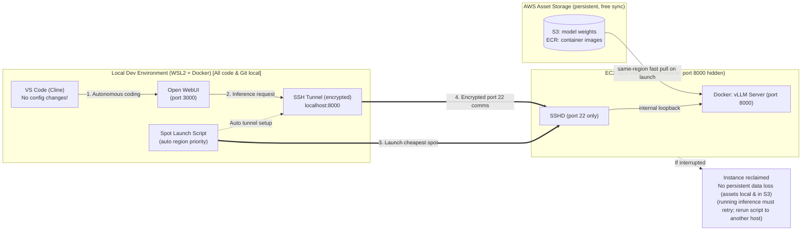

## Introduction

In the previous article ([Connecting a self-hosted vLLM running on AWS to VS Code (Cline) via Open WebUI – develop token-free](/blogs/2026/09/29/vllm_openwebui_cline/)), we adopted the open-source Web UI/API gateway “Open WebUI” and directly connected our self-hosted vLLM server on AWS as the backend for the VS Code extension “Cline.”

In that evaluation, we considered a model where “one GPU server (`g6.xlarge`) is shared by a team of 3–5 people” and confirmed it provided practical cost performance. However, as team development ramped up, the following challenges and requests emerged:

• Initial slowdown under concentrated requests: When multiple users simultaneously request code generation or tests, queuing and slower streaming occur.  
• Need for dedicated environments: Users want to leverage full GPU power without worrying about others’ usage, enabling rapid trial and error.

However, assigning each member an on-demand instance (about $1.38/h ≒ ¥228/h at $1=¥165) quickly blows up infrastructure costs.

This led us to focus on **EC2 Spot Instances**, which utilize surplus cloud capacity.

Beyond solving practical cost issues, I personally had a strong motivation: **“I want to seriously use Spot Instances in practice, since they’re frequently featured in AWS certification exams!”** When studying for AWS certifications (SAA, SAP, etc.), you inevitably encounter design patterns recommending using Spot Instances for stateless or fault-tolerant batch workloads to achieve significant cost savings. Although I understood this concept intellectually and saw it on exams, I had never integrated interruption handling and deployed it in a real environment. My engineer’s curiosity drove me to try it out in earnest.

At the time of writing (September 2026), Spot Instances offered about **60% off the on-demand rate** (around $0.55/h ≒ ¥80–90/h). At this price level, instead of maintaining one on-demand instance all day, you can adopt a short-term usage style: each user launches a dedicated GPU only for the time needed and terminates it immediately, yielding costs equal to or below that of running one on-demand instance all day.

Of course, Spot Instances carry the risk of sudden interruption by AWS when demand surges. However, with our architecture—**models stored in S3, containers in ECR, and servers/EBS fully ephemeral**—source code and Git history remain local, minimizing the risk of losing development assets due to interruptions. In-flight inference requests or server-side temporary data might be lost, so frequent Git commits and retry-based operational design are required.

In other words, **ephemeral design and Spot Instances are an excellent combination**, minimizing the downsides of interruption while enjoying cost savings.

In this article, I’ll explain an approach to keep this ephemeral vLLM environment running stably on Spot Instances by automatically selecting regions based on price, capacity, and interruption resistance.

:::info
**📚 Links to previous series articles**  
If you’re interested in background knowledge or the earlier steps, please see:  
• **For the basic setup (ephemeral auto-build with UserData × S3)**:  
  Part 1: [Auto-launch vLLM with AWS & UserData! Near-zero idle cost local LLM environment](/blogs/2026/09/16/vllm_autolaunch/)  
• **For Open WebUI and VS Code (Cline) integration**:  
  Part 2: [Connecting a self-hosted vLLM running on AWS to VS Code (Cline) via Open WebUI – develop token-free](/blogs/2026/09/29/vllm_openwebui_cline/)
:::

---

## Cost Savings and Caveats of Spot Instances

> **📌 Key Points**  
> Using a `g6.xlarge` (NVIDIA L4 24GB) Spot Instance can reduce costs by about 60% compared to on-demand (around $0.55/h ≒ ¥80–90/h). However, spot prices fluctuate with supply, demand, and time of day, so this discount isn’t guaranteed, and the model assumes short, concentrated usage.

First, let’s look at pricing in the Tokyo region (`ap-northeast-1`) at the time of testing:

| Instance Type                   | GPU Spec                | Generation / Tier          | On-Demand (USD/h) | Spot Discount (Test) | Spot (USD/h) | Approx. JPY/h (1$=¥165) |
| :------------------------------ | :---------------------- | :------------------------- | :---------------- | :------------------- | :----------- | :----------------------- |
| **g6.xlarge (★Recommended)**    | NVIDIA L4 (24GB VRAM)    | **Current Generation**     | ~$1.38            | **~60% OFF**         | **~$0.55**   | **~¥91**                 |
| **g5.xlarge (Reference)**       | NVIDIA A10G (24GB VRAM)  | Previous Generation        | ~$1.41            | ~65% OFF             | ~$0.49       | ~¥81                    |
| **g4dn.xlarge (Reference)**     | NVIDIA T4 (16GB VRAM)    | Two Generations Prior      | ~$0.71            | ~65% OFF             | ~$0.25       | ~¥41                    |

*Prices measured in September 2026. Spot prices and discounts vary in real time by AWS-wide supply/demand, time of day, and region. Exchange rate assumed at 1 USD = ¥165 (¥160 + fees).*

:::info
**💡 Why Choose g6.xlarge?**  
• g4dn (16GB): The model itself (~15GB) nearly fills memory, causing OOM when storing long contexts (KV cache) typical of AI coding agents.  
• g5 (24GB) vs g6 (24GB): For our use, the Ada Lovelace g6.xlarge offers high inference efficiency and a lower list price, making it the best balance. However, depending on regional inventory and spot pricing, older g5 instances might sometimes be more available or cost-effective.
:::

### 💡 Idle Holding Cost (S3 & ECR Storage ≈ A Few Hundred Yen/Month)

The maintenance cost for “S3 model storage” and “ECR container storage,” key to ephemeral operation, is practically negligible:  
• **S3 Standard Storage (model weights)**: 15GB × $0.025 = **~$0.38/month (≈¥62/month)** (*≈¥176/month for 3-region distribution*)  
• **ECR Storage (container images)**: ~10–15GB × $0.10/GB = **~$1.0–$1.5/month (≈¥165–¥248/month)**  
• **Data Transfer (S3/ECR → EC2)**: Free within the same region  
• **Versus EBS**: Continuously retaining an equivalent EBS gp3 volume costs ~¥1,600/month. By evacuating to S3/ECR and fully discarding EC2/EBS, you reduce idle monthly costs to a few hundred yen.

### ⚠️ “One-per-user Dedicated” Is Cheaper Only with Disciplined Usage

Key premise: **“A dedicated instance per user is cheaper than a shared server only if each user strictly limits usage to short bursts (1–2h) and immediately terminates when done.”**

| Model                          | Usage Pattern                             | Monthly Cost (5-Person Team)         | Appropriate For                       |
| :----------------------------- | :---------------------------------------- | :----------------------------------- | :------------------------------------ |
| **A. Shared On-Demand**        | Always on during business hours (8h×20d) | ~$1.38 × 160h ≈ **$220/mo (≈¥36k)**  | Teams needing zero launch wait       |
| **B. Spot, One-per-User (Burst)** | Each uses 2h/day (2h×5×20d=200h)       | ~$0.55 × 200h ≈ **$110/mo (≈¥18k)**  | Ideal for personal dev or focused tests |
| **C. Spot, One-per-User (All-Day)** | All 5 run 8h/day (8h×5×20d=800h)      | ~$0.55 × 800h ≈ **$440/mo (≈¥73k)**  | ❌ Much more expensive than shared   |

Leaving spot instances running idle or having everyone run them all day can make **shared on-demand** (or Reserved Instances/Savings Plans) the cheaper, lower-overhead choice. Thus, the “one-per-user spot” model works best for individuals or teams who can **“launch with one command when needed, then immediately terminate.”**

---

## Challenges of Spot Operations and Practical Responses

> **📌 Key Points**  
> To address the two main Spot challenges—“sudden interruption” and “stockouts/price volatility”—we use ephemeral design (minimize persistent data loss) and multi-region auto-discovery for practical stability.

When deploying Spot Instances, two unavoidable challenges arise. Here’s how our architecture smartly resolves them:



### Challenge 1: Sudden Interruption Risk  
Spot Instances can be abruptly reclaimed by AWS. In stateful servers or databases, this can corrupt data or require hours to rebuild, demanding careful design.

Our architecture minimizes fatal loss:  
1. **Negligible development asset loss**: Source code and Git history remain local. Only running inference requests or ephemeral server data may be lost—mitigated by frequent commits and retries.  
2. **Instant recovery by rerunning scripts**: If a spot is reclaimed mid-session, rerun the launch script. Within minutes, a new spot instance spins up, the Open WebUI endpoint updates automatically, and you can resume work.

### Challenge 2: Stockouts & Regional Price Differences  
Spot Instances rely on surplus capacity. Availability and pricing vary by time, AZ, and region.

👉 **Solution: Multi-region Spot Auto-Discovery**  
Rather than fix to Tokyo (`ap-northeast-1`), our script fetches recent spot prices from candidate regions (Oregon `us-west-2`, Virginia `us-east-1`, etc.) via `aws ec2 describe-spot-price-history`, compares them, and **automatically selects the cheapest region with capacity**.

#### Considering Time Zones in Region Selection  
Spot prices and availability depend on local business hours and AWS’s surplus capacity. Generally, local nighttime has more availability, but GPU demand for generative AI and large-scale training can skew this. We reference time zones but select based on real-time spot price and available AZs.

| JST / Scenario               | Candidate Regions (Local Time)                          | Characteristics                                                            |
| :--------------------------- | :------------------------------------------------------- | :------------------------------------------------------------------------- |
| **Daytime (10:00–18:00)**    | US East (`us-east-1` / 21:00–05:00) <br> US West (`us-west-2` / 18:00–02:00) | US data centers in night hours often have surplus capacity; spot prices stabilize. |
| **Evening (19:00–24:00)**    | Tokyo (`ap-northeast-1`) <br> Osaka (`ap-northeast-3`) <br> Sydney (`ap-southeast-2`) | Domestic demand drops post-office hours; Australia enters night.           |
| **Late Night/Early (01:00–08:00)** | Tokyo (`ap-northeast-1`) <br> Ireland (`eu-west-1`) <br> Frankfurt (`eu-central-1`) | Tokyo idle hours; Europe enters evening/night, adding options.            |

#### AWS Official Spot Best Practices vs. Ephemeral Single Instance  
AWS recommends using EC2 Auto Scaling or Spot Fleet for parallel workloads (batch, distributed ML, CI/CD workers) with allocation strategy `price-capacity-optimized`. That approach pools multiple instance types and AZs to minimize interruption risk and cost. Our use case is a single ephemeral instance launched on demand by a developer who can tolerate interruption, so we implement a lightweight custom region-priority script.

#### Custom Scoring: Price 40 + AZ 40 + Interruption 20  
:::alert
**⚠️ Note: This custom scoring (40 price + 40 AZ + 20 stability) is our own metric for personal vLLM spot use, not an AWS official metric. In production, prefer AWS’s Auto Scaling or Spot Fleet with `price-capacity-optimized`.**
:::

We combine AWS’s Spot Advisor (past 30-day interruption rates) and available AZ count to score out of 100: price competitiveness (40), AZ surplus (40), interruption resilience (20).

##### Why 40:40:20?  
This distribution is optimized for “a developer launching one instance now to start work”:  
1. **AZ count (40)**: GPU spot availability can be tight; low AZ count risks `InsufficientInstanceCapacity`. We value capacity thickness as highly as price.  
2. **Interruption resilience (20)**: In short 1–2h sessions with immediate termination, interruption risk is low and recovery is quick—so we weight this lower. For multi-day batch jobs, increase this weight.

Here’s a real-time report as of 2026-09-30 09:03 JST:

```text
================================================================================
 AWS EC2 Spot Priority Report (g6.xlarge)
 Time Checked: 2026-09-30 09:03 (JST) / Exchange Rate: 1 USD = 165 JPY
================================================================================
RegionID        Name           Min Spot Price    AZs   Interrupt Rate  Score  Rank
--------------------------------------------------------------------------------
eu-central-1    Frankfurt      $0.454/h (¥75)   3     <5%             82     🥇 [Rank S]
us-west-2       Oregon         $0.426/h (¥70)   4     >20%            72     🥈 [Rank A]
us-east-1       Virginia       $0.555/h (¥92)   5     >20%            71     🥉 [Rank A]
ap-northeast-1  Tokyo          $0.568/h (¥94)   2     >20%            46     ⚠️ [Rank C]
--------------------------------------------------------------------------------
```

##### Interpreting the Report  
• At that moment, Frankfurt (82) ranked highest overall. <br>  
• Oregon (72) and Virginia (71) ranked well for AZ thickness and price. <br>  
• Tokyo scored lower (46) due to only 2 available AZs at that snapshot.

:::alert
**🚨 Compliance & Data Residency Warning**  
Multi-region can conflict with corporate policies requiring that sensitive code or data remain in Japan (Tokyo/Osaka). Using overseas regions (Virginia, Oregon) sends your prompts and code abroad, potentially violating data residency requirements. In business environments, restrict candidate regions to domestic:

```bash
CANDIDATE_REGIONS=("ap-northeast-1" "ap-northeast-3")
```
:::

:::check
**💡 Avoiding Cross-Region Data Transfer Fees**  
Putting S3/ECR only in Tokyo and pulling from overseas EC2 incurs cross-region transfer ($0.09/GB). A 25–30GB cold start costs ~¥370–¥450 each, wiping out Spot savings.

| Pattern                          | Storage Cost      | Transfer per Startup (25–30GB) | Startup Time | Overall           |
| :------------------------------- | :--------------- | :----------------------------- | :----------- | :---------------- |
| A: Tokyo-only S3/ECR            | Lowest           | Tokyo EC2: ¥0 <br> Overseas EC2: **¥370–¥450** | 5–10m      | ❌ Costly at each startup |
| B: Region-distributed S3 & ECR  | ¥100s/month      | **Free**                       | 1–2m         | ◎ Recommended       |

Avoid transfer fees by distributing S3 buckets per region or using ECR cross-region replication.
:::

---

(Translation continues in the next message)
