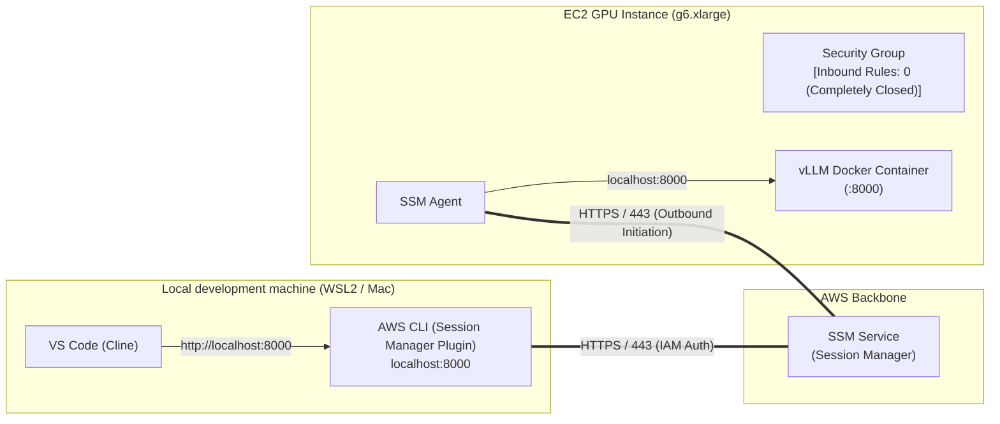

## Introduction

In the previous article ([Significantly Reduce GPU Costs with EC2 Spot Instances × vLLM](/blogs/2026/10/02/vllm_spot_instance/)), we introduced a “multi-region comprehensive priority auto-selection” mechanism that accounts for time zone differences, pricing, and interruption tolerance, allowing us to procure a `g6.xlarge` (NVIDIA L4 24 GB) spot instance at an ultra-low cost of about ¥80–90 per hour.

This established an ephemeral development style for expensive cloud GPUs: “quickly spin up when you need it, then immediately tear down when you’re done.”

However, our setup through Part 3 had two critical issues from security and operational perspectives:

1. Port 22 (SSH) exposure risk: We used an SSH tunnel (port 8000 forwarding) to access the instance, so we had to allow inbound port 22 in the security group. Even with IP restrictions, every time our global IP changed at home, in the office, or while remote-working, we had to update the security group, complicating operations.
2. Management burden of SSH private keys (`.pem`): We needed to create key pairs in advance for each target region (Tokyo, Oregon, Virginia, etc.) and securely store and manage the private key files locally.

In this article, we’ll introduce the port-forwarding feature of the AWS managed service **AWS Systems Manager (SSM) Session Manager**.

You’ll learn how to securely tunnel your local PC’s port 8000 to the EC2 instance’s vLLM (port 8000), completely eliminate SSH private keys, and keep the EC2 security group’s inbound rules entirely empty (zero ports open).

:::info
**📚 Related Past Validation Articles**
* **Part 1 (Basic Setup)**: [Automatically Launch vLLM with AWS × UserData! A Local LLM Environment with Almost Zero Cost When Stopped](/blogs/2026/09/16/vllm_autolaunch/)
* **Part 2 (Cline Integration)**: [Connect Your Self-Hosted vLLM to VS Code (Cline) via Open WebUI! Develop Token-Free](/blogs/2026/09/29/vllm_openwebui_cline/)
* **Part 3 (Utilizing Spot Instances)**: [Significantly Reduce GPU Costs with EC2 Spot Instances × vLLM](/blogs/2026/10/02/vllm_spot_instance/)
:::

## Why Move from SSH to SSM Port Forwarding?

> **📌 Key Points of this Section**  
> By adopting SSM port forwarding, you can achieve both “completely closed inbound (zero port exposure)” and “complete elimination of SSH private keys” simultaneously. Connection authorization is centrally managed by AWS IAM, and audit logs are automatically recorded by CloudTrail.

### 1. Zero Port Exposure (No Inbound Permissions Required)

With traditional SSH, you must allow inbound port 22 in the EC2 security group.

SSM Session Manager instead uses an architecture where the **SSM Agent** inside the EC2 instance initiates an outbound WebSocket session to the AWS SSM endpoint (HTTPS/443).



This lets you keep the EC2 security group with **zero inbound rules**—blocking port scans and brute-force attacks from the Internet and minimizing the inbound attack surface.

### 2. Complete Elimination of SSH Private Keys (`.pem`)

In Part 3, launching instances in multiple regions meant pre-creating key pairs per region and managing those `.pem` files locally—introducing rotation, loss, and accidental-commit risks.

With SSM port forwarding, authentication and authorization are handled entirely by **AWS IAM**. Developers start sessions using AWS credentials (access keys or session tokens) configured via `aws configure` or SSO (IAM Identity Center). **No SSH private keys are needed.**

### 3. Comparing SSH Connection and SSM Port Forwarding

| Item                        | Traditional SSH Tunnel (Part 3)              | SSM Port Forwarding (This Time)    | Benefits                                               |
| :-------------------------- | :------------------------------------------- | :--------------------------------- | :----------------------------------------------------- |
| **Inbound Port**            | Must open port 22                            | **Completely closed (0 ports open)** | Eliminates direct inbound attack paths from the Internet |
| **Source IP Restrictions**  | Must update SG when home/office IP changes   | **Not required** (IAM-protected)   | Zero SG updates even for remote work                   |
| **Key Management**          | Store/manage `.pem` keys per region          | **Not required (keyless)**         | No private-key storage or rotation                     |
| **Audit Logs**              | Requires server-side SSH log setup           | **Automatically in CloudTrail/CloudWatch** | Records who started which session and when |
| **Multi-Region Deployment** | Must create KeyName per region               | **No extra setup across regions**  | Easier portability and automation                      |

## Prerequisites and Preparing the Local Environment

To use SSM port forwarding, install the `session-manager-plugin` on your local machine.

### Installing the Session Manager Plugin

If it’s not installed, follow the AWS documentation:

Ubuntu / WSL2:
```bash
curl "https://s3.amazonaws.com/session-manager-downloads/plugin/latest/ubuntu_64bit/session-manager-plugin.deb" -o "session-manager-plugin.deb"
sudo dpkg -i session-manager-plugin.deb
rm session-manager-plugin.deb
```

macOS (Homebrew):
```bash
brew install --cask session-manager-plugin
```

Windows:
```powershell
winget install Amazon.SessionManagerPlugin
```

After installation, verify with:
```bash
session-manager-plugin
# Example output: The Session Manager plugin is installed successfully. Use the AWS CLI to start a session.
```

## Pre-Setup of AWS Resources

To enable SSM connections, prepare these resources in each region:

1. **IAM instance profile**: Attach `AmazonSSMManagedInstanceCore` (and other needed policies) so EC2 can communicate with SSM.  
2. **Zero-inbound security group**: A security group with 0 inbound rules and only outbound allowed (`vllm-ssm-isolated-sg`).

Use the following script to create them in bulk.

<details><summary>00_setup_ssm_assets.sh (click to expand)</summary>

```bash
#!/bin/bash
set -euo pipefail

# ==============================================================================
# 00_setup_ssm_assets.sh
# Create IAM role and zero-inbound SGs in each region for SSM port forwarding
# ==============================================================================

ROLE_NAME="vllm-ssm-instance-role"
PROFILE_NAME="vllm-ssm-instance-profile"
SG_NAME="vllm-ssm-isolated-sg"
REGIONS=("ap-northeast-1" "us-west-2" "us-east-1" "us-east-2" "eu-central-1")

echo "=== 1. Creating IAM Role & Instance Profile ==="

# Trust policy (EC2)
TRUST_POLICY='{
  "Version": "2012-10-17",
  "Statement": [
    {
      "Effect": "Allow",
      "Principal": { "Service": "ec2.amazonaws.com" },
      "Action": "sts:AssumeRole"
    }
  ]
}'

if ! aws iam get-role --role-name "${ROLE_NAME}" >/dev/null 2>&1; then
    echo "Creating IAM role ${ROLE_NAME}..."
    aws iam create-role --role-name "${ROLE_NAME}" --assume-role-policy-document "${TRUST_POLICY}"
    
    # Attach SSM managed policy
    aws iam attach-role-policy --role-name "${ROLE_NAME}" \
        --policy-arn "arn:aws:iam::aws:policy/AmazonSSMManagedInstanceCore"
    # S3 model read permission
    aws iam attach-role-policy --role-name "${ROLE_NAME}" \
        --policy-arn "arn:aws:iam::aws:policy/AmazonS3ReadOnlyAccess"
    # ECR container read permission
    aws iam attach-role-policy --role-name "${ROLE_NAME}" \
        --policy-arn "arn:aws:iam::aws:policy/AmazonEC2ContainerRegistryReadOnly"
else
    echo "IAM role ${ROLE_NAME} already exists."
fi

if ! aws iam get-instance-profile --instance-profile-name "${PROFILE_NAME}" >/dev/null 2>&1; then
    echo "Creating instance profile ${PROFILE_NAME}..."
    aws iam create-instance-profile --instance-profile-name "${PROFILE_NAME}"
    aws iam add-role-to-instance-profile --instance-profile-name "${PROFILE_NAME}" --role-name "${ROLE_NAME}"
    echo "Waiting for IAM instance profile propagation (10 seconds)..."
    sleep 10
else
    echo "Instance profile ${PROFILE_NAME} already exists."
fi

echo "=== 2. Creating Zero-Inbound Security Group in Each Region ==="
for REGION in "${REGIONS[@]}"; do
    echo "Checking region [${REGION}]..."
    VPC_ID=$(aws ec2 describe-vpcs --region "${REGION}" --filters "Name=is-default,Values=true" --query "Vpcs[0].VpcId" --output text)
    
    EXISTING_SG=$(aws ec2 describe-security-groups --region "${REGION}" --filters "Name=group-name,Values=${SG_NAME}" --query "SecurityGroups[0].GroupId" --output text 2>/dev/null || true)
    
    if [ -z "${EXISTING_SG}" ] || [ "${EXISTING_SG}" = "None" ]; then
        echo "  Creating ${SG_NAME} in VPC (${VPC_ID})..."
        SG_ID=$(aws ec2 create-security-group \
            --region "${REGION}" \
            --group-name "${SG_NAME}" \
            --description "Zero-inbound security group for vLLM SSM port forwarding" \
            --vpc-id "${VPC_ID}" \
            --query "GroupId" --output text)
        
        # No inbound rules added (zero ports open)
        echo "  Completed: ${SG_ID} (Inbound rules: 0)"
    else
        echo "  Already exists: ${EXISTING_SG}"
    fi
done

echo "Preliminary setup completed!"
```

</details>

When you run this script, a security group `vllm-ssm-isolated-sg` with zero inbound rules and an instance profile `vllm-ssm-instance-profile` authorized for SSM communication will be created in each region.

## Adapting the Launch Script for SSM

We’ll create `01_start_vllm_ssm.sh` from the Part 3 launch script (`01_ec2_launch_spot_and_sync_openwebui.sh`), replacing the SSH connection with SSM port forwarding.

### Main Changes

1. Remove SSH key specification:
   - Delete the `--key-name` parameter passed to `aws ec2 run-instances`.
2. Specify IAM instance profile and zero-inbound SG:
   - Add `--iam-instance-profile Name=vllm-ssm-instance-profile`.
   - Use `vllm-ssm-isolated-sg` in `--security-group-ids`.
3. Wait for the SSM agent to be online:
   - Instead of looping on `nc -z` for port 22, call `aws ssm describe-instance-information` until `PingStatus == "Online"`.
4. Establish SSM port forwarding session:
   - Run:

```bash
aws ssm start-session \
    --region "${AWS_REGION}" \
    --target "${INSTANCE_ID}" \
    --document-name AWS-StartPortForwardingSession \
    --parameters '{"portNumber":["8000"],"localPortNumber":["8000"]}'
```

### Full Script: `01_start_vllm_ssm.sh`

<details><summary>01_start_vllm_ssm.sh (click to expand)</summary>

```bash
#!/bin/bash
set -euo pipefail

# ==============================================================================
# 01_start_vllm_ssm.sh
# Discover and launch a spot instance, then securely connect via SSM port forwarding
# ==============================================================================

SCRIPT_DIR="$(cd "$(dirname "${BASH_SOURCE[0]}")" && pwd)"
USER_DATA_FILE="${USER_DATA_FILE:-${SCRIPT_DIR}/02_ec2_userdata.sh}"
INSTANCE_STATE_FILE="${SCRIPT_DIR}/.current_instance_id"
TUNNEL_PID_FILE="${SCRIPT_DIR}/.current_tunnel_pid"
REGION_STATE_FILE="${SCRIPT_DIR}/.current_region"
TUNNEL_LOG="${SCRIPT_DIR}/.current_tunnel.log"

CANDIDATE_REGIONS=("ap-northeast-1" "us-west-2" "us-east-1" "us-east-2" "eu-central-1")
CANDIDATE_INSTANCE_TYPES=("g6.xlarge")
IAM_PROFILE_NAME="vllm-ssm-instance-profile"
SG_NAME="vllm-ssm-isolated-sg"
EBS_SIZE_GB="40"

echo "=== 1. Multi-region Spot Comprehensive Priority Search ==="
ITYPE="${CANDIDATE_INSTANCE_TYPES[0]}"
START_TIME="$(date -u +%Y-%m-%dT%H:%M:%SZ)"

# Get interruption tier from Spot Advisor
declare -A REGION_INTR_TIERS
PY_BIN=""
command -v python3 >/dev/null 2>&1 && PY_BIN="python3" || (command -v python >/dev/null 2>&1 && PY_BIN="python")
if [ -n "${PY_BIN}" ]; then
    ADVISOR_DATA=$("${PY_BIN}" -c "
import urllib.request, json
try:
    with urllib.request.urlopen('https://spot-bid-advisor.s3.amazonaws.com/spot-advisor-data.json', timeout=4) as res:
        adv = json.loads(res.read()).get('spot_advisor', {})
        for r, info in adv.items():
            print(f'{r}:{info.get(\"Linux\", {}).get(\"${ITYPE}\", {}).get(\"r\", 4)}')
except Exception: pass
" 2>/dev/null || true)
    while IFS=':' read -r r_id r_tier; do
        r_id=$(echo "${r_id}" | tr -d '[:space:]')
        r_tier=$(echo "${r_tier}" | tr -d '[:space:]')
        [ -n "${r_id}" ] && REGION_INTR_TIERS["${r_id}"]="${r_tier}"
    done <<< "${ADVISOR_DATA}"
fi

declare -A REG_STATUS REG_MIN_PRICES REG_AZ_COUNTS REG_SCORES REG_RANKS
BEST_PRICE="999.0"

for REGION in "${CANDIDATE_REGIONS[@]}"; do
    RAW_PRICES=$(aws ec2 describe-spot-price-history \
        --region "${REGION}" \
        --instance-types "${ITYPE}" \
        --product-descriptions "Linux/UNIX" \
        --start-time "${START_TIME}" \
        --no-paginate \
        --query 'SpotPriceHistory[*].[AvailabilityZone, SpotPrice]' \
        --output text 2>/dev/null | tr -d '\r' || true)

    if [ -z "${RAW_PRICES}" ]; then
        REG_STATUS["${REGION}"]="unavailable"
        continue
    fi

    REG_MIN_PRICE="999.0"
    AZ_COUNT=0
    while read -r AZ PRICE; do
        AZ=$(echo "${AZ}" | tr -d '[:space:]')
        PRICE=$(echo "${PRICE}" | tr -d '[:space:]')
        [ -z "${AZ}" ] || [ -z "${PRICE}" ] && continue
        AZ_COUNT=$((AZ_COUNT + 1))
        if awk -v p="${PRICE}" -v m="${REG_MIN_PRICE}" 'BEGIN {exit !(p < m)}' 2>/dev/null; then
            REG_MIN_PRICE="${PRICE}"
        fi
    done <<< "${RAW_PRICES}"

    if [ "${REG_MIN_PRICE}" = "999.0" ]; then
        REG_STATUS["${REGION}"]="unavailable"
        continue
    fi

    REG_STATUS["${REGION}"]="ok"
    REG_MIN_PRICES["${REGION}"]="${REG_MIN_PRICE}"
    REG_AZ_COUNTS["${REGION}"]="${AZ_COUNT}"

    if awk -v p="${REG_MIN_PRICE}" -v m="${BEST_PRICE}" 'BEGIN {exit !(p < m)}' 2>/dev/null; then
        BEST_PRICE="${REG_MIN_PRICE}"
    fi
done

# Calculate scores (Price: 40, AZ count: 40, Interruption tier: 20 = 100 points)
for REGION in "${CANDIDATE_REGIONS[@]}"; do
    if [ "${REG_STATUS[${REGION}]:-}" != "ok" ]; then
        echo "  - [${REGION}]: No capacity or not offered"
        continue
    fi

    PRICE="${REG_MIN_PRICES[${REGION}]}"
    TIER="${REGION_INTR_TIERS[${REGION}]:-4}"
    AZ_COUNT="${REG_AZ_COUNTS[${REGION}]}"

    # Price score (up to 40)
    P_SCORE=$(awk -v min="${BEST_PRICE}" -v cur="${PRICE}" 'BEGIN {printf "%.0f", 40.0 * (min / cur)}')

    # Interruption score (up to 20)
    case "${TIER}" in
        0) I_SCORE=20; I_TEXT="< 5% (Very Low)" ;;
        1) I_SCORE=15; I_TEXT="5-10% (Low)" ;;
        2) I_SCORE=10; I_TEXT="10-15% (Medium)" ;;
        3) I_SCORE=5;  I_TEXT="15-20% (Medium-High)" ;;
        *) I_SCORE=0;  I_TEXT="> 20% (High)" ;;
    esac

    # Capacity score (up to 40)
    if [ "${AZ_COUNT}" -ge 5 ]; then C_SCORE=40
    elif [ "${AZ_COUNT}" -eq 4 ]; then C_SCORE=32
    elif [ "${AZ_COUNT}" -eq 3 ]; then C_SCORE=24
    elif [ "${AZ_COUNT}" -eq 2 ]; then C_SCORE=16
    else C_SCORE=8
    fi

    TOTAL_SCORE=$(( P_SCORE + I_SCORE + C_SCORE ))
    REG_SCORES["${REGION}"]="${TOTAL_SCORE}"

    if [ "${TOTAL_SCORE}" -ge 75 ]; then RANK="Rank S"
    elif [ "${TOTAL_SCORE}" -ge 65 ]; then RANK="Rank A"
    elif [ "${TOTAL_SCORE}" -ge 50 ]; then RANK="Rank B"
    else RANK="Rank C"
    fi
    REG_RANKS["${REGION}"]="${RANK}"

    PRICE_FMT=$(awk -v p="${PRICE}" 'BEGIN {printf "%.4f", p}')
    echo "  - [${REGION}] Price=\$${PRICE_FMT}/h, Interruption Rate=${I_TEXT}, Spare AZ=${AZ_COUNT} -> Total Score: ${TOTAL_SCORE} (${RANK})"
done

# Sort regions by score (descending)
SORTED_REGIONS=($(for r in "${!REG_SCORES[@]}"; do echo "$r ${REG_SCORES[$r]}"; done | sort -k2 -nr | awk '{print $1}'))

echo "----------------------------------------------------------"
echo "Overall Priority Ranking:"
for i in "${!SORTED_REGIONS[@]}"; do
    r="${SORTED_REGIONS[$i]}"
    echo "  Rank $((i+1)): ${r} (${REG_RANKS[$r]} / Score: ${REG_SCORES[$r]}, Lowest: \$${REG_MIN_PRICES[$r]}/h)"
done
echo "----------------------------------------------------------"

echo "=== 2. Attempting to Launch a Spot Instance ==="
SELECTED_REGION=""
INSTANCE_ID=""

for REGION in "${SORTED_REGIONS[@]}"; do
    echo "Attempting spot launch in region [${REGION}]..."
    
    # Get the ID of the zero-inbound SG
    SG_ID=$(aws ec2 describe-security-groups --region "${REGION}" --filters "Name=group-name,Values=${SG_NAME}" --query "SecurityGroups[0].GroupId" --output text 2>/dev/null || true)
    if [ -z "${SG_ID}" ] || [ "${SG_ID}" = "None" ]; then
        echo "  Warning: ${SG_NAME} not found in ${REGION}. Skipping."
        continue
    fi

    # Dynamically fetch the latest Ubuntu 22.04 Deep Learning OSS Nvidia Driver AMI (with Docker)
    AMI_ID=$(aws ec2 describe-images \
        --region "${REGION}" \
        --owners amazon \
        --filters "Name=name,Values=Deep Learning OSS Nvidia Driver AMI GPU PyTorch * (Ubuntu 22.04)*" "Name=state,Values=available" \
        --query 'sort_by(Images, &CreationDate)[-1].ImageId' \
        --output text 2>/dev/null || true)

    # Read and inject environment variables into UserData
    AWS_ACCOUNT_ID=$(aws sts get-caller-identity --query Account --output text 2>/dev/null || echo "")
    S3_BUCKET_NAME="my-vllm-models-hackathon-2026-${AWS_ACCOUNT_ID}-${REGION}-an"
    DOCKER_IMAGE="${AWS_ACCOUNT_ID}.dkr.ecr.${REGION}.amazonaws.com/vllm-openai:latest"
    TMP_USERDATA=$(mktemp)
    sed -e "s|^AWS_REGION=.*|AWS_REGION=\"${REGION}\"|" \
        -e "s|^S3_BUCKET_NAME=.*|S3_BUCKET_NAME=\"${S3_BUCKET_NAME}\"|" \
        -e "s|^DOCKER_IMAGE=.*|DOCKER_IMAGE=\"${DOCKER_IMAGE}\"|" \
        "${USER_DATA_FILE}" > "${TMP_USERDATA}"

    LAUNCH_RES=$(aws ec2 run-instances \
        --region "${REGION}" \
        --image-id "${AMI_ID}" \
        --instance-type "${ITYPE}" \
        --iam-instance-profile Name="${IAM_PROFILE_NAME}" \
        --security-group-ids "${SG_ID}" \
        --instance-market-options '{"MarketType":"spot","SpotOptions":{"SpotInstanceType":"one-time","InstanceInterruptionBehavior":"terminate"}}' \
        --block-device-mappings "[{\"DeviceName\":\"/dev/sda1\",\"Ebs\":{\"VolumeSize\":${EBS_SIZE_GB},\"VolumeType\":\"gp3\",\"DeleteOnTermination\":true}}]" \
        --user-data "file://${TMP_USERDATA}" \
        --tag-specifications "ResourceType=instance,Tags=[{Key=Name,Value=vllm-ssm-spot-node}]" \
        --query "Instances[0].InstanceId" \
        --output text 2>&1 || true)
    rm -f "${TMP_USERDATA}"

    if [[ "${LAUNCH_RES}" =~ ^i-[0-9a-f]+$ ]]; then
        INSTANCE_ID="${LAUNCH_RES}"
        SELECTED_REGION="${REGION}"
        echo "  Launch succeeded! Instance ID: ${INSTANCE_ID} (${SELECTED_REGION})"
        break
    else
        echo "  Skipping due to insufficient capacity or error: ${LAUNCH_RES}"
    fi
done

if [ -z "${INSTANCE_ID}" ]; then
    echo "Error: Failed to launch spot instance in all candidate regions."
    exit 1
fi

echo "${INSTANCE_ID}" > "${INSTANCE_STATE_FILE}"
echo "${SELECTED_REGION}" > "${REGION_STATE_FILE}"

echo "Waiting for the instance to reach running state..."
aws ec2 wait instance-running --region "${SELECTED_REGION}" --instance-ids "${INSTANCE_ID}"

# Add Session Manager Plugin path for Git Bash environments
if [ -d "/c/Program Files/Amazon/SessionManagerPlugin/bin" ]; then
    export PATH="${PATH}:/c/Program Files/Amazon/SessionManagerPlugin/bin"
fi

echo "=== 3. Waiting for SSM Agent to be Online ==="
echo "Waiting for the SSM Agent inside the EC2 instance to connect..."
SSM_OK=false
for i in {1..30}; do
    STATUS=$(aws ssm describe-instance-information \
        --region "${SELECTED_REGION}" \
        --filters "Key=InstanceIds,Values=${INSTANCE_ID}" \
        --query "InstanceInformationList[0].PingStatus" \
        --output text 2>/dev/null || true)
    
    if [ "${STATUS}" = "Online" ]; then
        echo " SSM Agent is now Online! (Attempt ${i})"
        SSM_OK=true
        break
    fi
    echo -n "."
    sleep 3
done
echo ""

if [ "${SSM_OK}" != "true" ]; then
    echo "Error: SSM Agent did not become online. Check IAM role and outbound connectivity."
    exit 1
fi

echo "=== 4. Waiting for vLLM on the Server (http://127.0.0.1:8000/health) ==="
echo "Waiting for UserData model download and vLLM startup (typically 2–4 minutes)..."
SERVER_READY=false
for i in {1..90}; do
    CMD_ID=$(aws ssm send-command \
        --region "${SELECTED_REGION}" \
        --instance-ids "${INSTANCE_ID}" \
        --document-name "AWS-RunShellScript" \
        --parameters 'commands=["curl -s -m 2 http://127.0.0.1:8000/health >/dev/null && echo OK || echo WAITING"]' \
        --query "Command.CommandId" \
        --output text 2>/dev/null || true)
    
    if [ -n "${CMD_ID}" ]; then
        sleep 2
        RES=$(aws ssm get-command-invocation \
            --region "${SELECTED_REGION}" \
            --command-id "${CMD_ID}" \
            --instance-id "${INSTANCE_ID}" \
            --query "StandardOutputContent" \
            --output text 2>/dev/null || true)
        if [[ "${RES}" =~ "OK" ]]; then
            echo " vLLM on the server responded successfully!"
            SERVER_READY=true
            break
        fi
    fi
    echo -n "."
    sleep 5
done
echo ""

if [ "${SERVER_READY}" != "true" ]; then
    echo "Warning: Timed out waiting for vLLM startup on the server. Check UserData logs."
fi

echo "=== 5. Establishing SSM Port Forwarding (Zero-Port Tunnel) ==="
if [ -f "${TUNNEL_PID_FILE}" ]; then
    OLD_PID=$(cat "${TUNNEL_PID_FILE}" | tr -d '[:space:]')
    if [ -n "${OLD_PID}" ] && ps -p "${OLD_PID}" > /dev/null 2>&1; then
        echo "Terminating old port forward process (PID: ${OLD_PID})..."
        kill -9 "${OLD_PID}" 2>/dev/null || true
    fi
    rm -f "${TUNNEL_PID_FILE}"
fi
pkill -f "AWS-StartPortForwardingSession.*8000" 2>/dev/null || true

# Start SSM port forwarding in the background (logs to .current_tunnel.log)
nohup aws ssm start-session \
    --region "${SELECTED_REGION}" \
    --target "${INSTANCE_ID}" \
    --document-name AWS-StartPortForwardingSession \
    --parameters '{"portNumber":["8000"],"localPortNumber":["8000"]}' \
    > "${TUNNEL_LOG}" 2>&1 &

TUNNEL_PID=$!
echo "${TUNNEL_PID}" > "${TUNNEL_PID_FILE}"
echo "Started SSM port forwarding (PID: ${TUNNEL_PID})"
sleep 2

echo "=== 6. Verifying Local Connectivity (http://localhost:8000/health) ==="
LOCAL_OK=false
for i in {1..10}; do
    if curl -s -m 3 "http://localhost:8000/health" > /dev/null 2>&1; then
        echo " Local connectivity confirmed! (HTTP 200 OK)"
        LOCAL_OK=true
        break
    fi
    echo -n "."
    sleep 2
done
echo ""

if [ "${LOCAL_OK}" != "true" ]; then
    echo "Warning: Local connectivity failed. Check the tunnel log:"
    cat "${TUNNEL_LOG}" 2>/dev/null || true
fi

echo "=========================================================="
echo " Zero-port SSM environment is up and running!"
echo " EC2 Instance ID : ${INSTANCE_ID} (Spot, Region: ${SELECTED_REGION})"
echo " Security        : Inbound rules: 0 (Completely closed)"
echo " Tunnel          : localhost:8000 -> EC2:8000 (SSM encrypted)"
echo " Web UI / API    : http://localhost:8000/v1"
echo ""
echo " Connect from VS Code's Cline (Base URL: http://localhost:8000/v1)"
echo " To tear down, run:"
echo "   ./02_stop_vllm_ssm.sh"
echo "=========================================================="
```

</details>

## Running It in Practice

### 1. Running the Script

When you run the script, multi-region exploration, spot instance launch, waiting for the SSM agent to connect, waiting for the server-side vLLM to start, and establishing port forwarding all proceed automatically.

```bash
$ ./01_start_vllm_ssm.sh
=== 1. Multi-region Spot Comprehensive Priority Search ===
  - [ap-northeast-1] Price=$0.5510/h, Interruption Rate=< 5% (Very Low), Spare AZ=3 -> Total Score: 72 (Rank A)
  - [us-west-2] Price=$0.3850/h, Interruption Rate=< 5% (Very Low), Spare AZ=4 -> Total Score: 92 (Rank S)
  - [us-east-1] Price=$0.5830/h, Interruption Rate=5-10% (Low), Spare AZ=6 -> Total Score: 81 (Rank S)
  - [us-east-2] Price=$0.4210/h, Interruption Rate=< 5% (Very Low), Spare AZ=3 -> Total Score: 80 (Rank S)
  - [eu-central-1] Price=$0.4120/h, Interruption Rate=< 5% (Very Low), Spare AZ=3 -> Total Score: 81 (Rank S)
----------------------------------------------------------
Overall Priority Ranking:
  Rank 1: us-west-2 (Rank S / Score: 92, Lowest: $0.3850/h)
  Rank 2: us-east-1 (Rank S / Score: 81, Lowest: $0.5830/h)
  Rank 3: eu-central-1 (Rank S / Score: 81, Lowest: $0.4120/h)
  Rank 4: us-east-2 (Rank S / Score: 80, Lowest: $0.4210/h)
  Rank 5: ap-northeast-1 (Rank A / Score: 72, Lowest: $0.5510/h)
----------------------------------------------------------
=== 2. Attempting to Launch a Spot Instance ===
Attempting spot launch in region [us-west-2]...
  Launch succeeded! Instance ID: i-0abc12345678def01 (us-west-2)
Waiting for the instance to reach running state...

=== 3. Waiting for SSM Agent to be Online ===
Waiting for the SSM Agent inside the EC2 instance to connect...
..... SSM Agent is now Online! (Attempt 5)

=== 4. Waiting for vLLM on the Server (http://127.0.0.1:8000/health) ===
Waiting for UserData model download and vLLM startup (typically 2–4 minutes)...
................................ vLLM on the server responded successfully!

=== 5. Establishing SSM Port Forwarding (Zero-Port Tunnel) ===
Started SSM port forwarding (PID: 41820)

=== 6. Verifying Local Connectivity (http://localhost:8000/health) ===
 Local connectivity confirmed! (HTTP 200 OK)

==========================================================
 Zero-port SSM environment is up and running!
 EC2 Instance ID : i-0abc12345678def01 (Spot, Region: us-west-2)
 Security        : Inbound rules: 0 (Completely closed)
 Tunnel          : localhost:8000 -> EC2:8000 (SSM encrypted)
 Web UI / API    : http://localhost:8000/v1

 Connect from VS Code's Cline (Base URL: http://localhost:8000/v1)
 To tear down, run:
   ./02_stop_vllm_ssm.sh
==========================================================
```

### 2. Verifying Zero Inbound Rules

Check the security group of the target instance via the AWS Management Console or AWS CLI:

```bash
$ aws ec2 describe-security-groups \
    --region us-west-2 \
    --filters "Name=group-name,Values=vllm-ssm-isolated-sg" \
    --query "SecurityGroups[0].IpPermissions"
[]
```

The output is `[]`, meaning **no inbound rules are registered**.

Despite having no inbound ports open to the outside, you can still retrieve model information locally:

```bash
$ curl -s http://localhost:8000/v1/models | jq .data[0].id
"Qwen/Qwen2.5-Coder-14B-Instruct-AWQ"
```

The experience of transparently connecting from your local machine without opening any inbound ports offers significant advantages in both management overhead and security compared to traditional SSH operations.

## Complete Teardown Script After Testing

When you’re done, run the teardown script (`02_stop_vllm_ssm.sh`) to release resources.

<details><summary>02_stop_vllm_ssm.sh (click to expand)</summary>

```bash
#!/bin/bash
set -euo pipefail

# ==============================================================================
# 02_stop_vllm_ssm.sh
# Terminate the SSM port forwarding process and fully destroy the spot instance
# ==============================================================================

SCRIPT_DIR="$(cd "$(dirname "${BASH_SOURCE[0]}")" && pwd)"
INSTANCE_STATE_FILE="${SCRIPT_DIR}/.current_instance_id"
TUNNEL_PID_FILE="${SCRIPT_DIR}/.current_tunnel_pid"
REGION_STATE_FILE="${SCRIPT_DIR}/.current_region"
TUNNEL_LOG="${SCRIPT_DIR}/.current_tunnel.log"

AWS_REGION=$(cat "${REGION_STATE_FILE}" 2>/dev/null | tr -d '[:space:]' || echo "ap-northeast-1")
INSTANCE_ID=$(cat "${INSTANCE_STATE_FILE}" 2>/dev/null | tr -d '[:space:]' || echo "${1:-}")

echo "=== 1. Terminating the SSM port forwarding process ==="
if [ -f "${TUNNEL_PID_FILE}" ]; then
    TUNNEL_PID=$(cat "${TUNNEL_PID_FILE}" | tr -d '[:space:]')
    if [ -n "${TUNNEL_PID}" ] && ps -p "${TUNNEL_PID}" > /dev/null 2>&1; then
        echo "Terminating SSM port forwarding process (PID: ${TUNNEL_PID})..."
        kill -9 "${TUNNEL_PID}" 2>/dev/null || true
    fi
    rm -f "${TUNNEL_PID_FILE}"
fi
pkill -f "AWS-StartPortForwardingSession.*8000" 2>/dev/null || true

echo "=== 2. EC2 instance full termination (Terminate) ==="
if [ -n "${INSTANCE_ID}" ]; then
    echo "Target instance ID: ${INSTANCE_ID} (${AWS_REGION})"
    aws ec2 terminate-instances --region "${AWS_REGION}" --instance-ids "${INSTANCE_ID}" --output table
    echo "Waiting for instance termination to complete..."
    aws ec2 wait instance-terminated --region "${AWS_REGION}" --instance-ids "${INSTANCE_ID}"
fi

rm -f "${INSTANCE_STATE_FILE}" "${REGION_STATE_FILE}" "${TUNNEL_LOG}"
echo "=========================================================="
echo "Spot instance, EBS volumes, and SSM tunnel have been completely destroyed!"
echo "=========================================================="
```

</details>

## Summary

This time, we fundamentally revisited the communication layer of the multi-region spot vLLM environment built in Part 3 and refreshed it with **port forwarding using AWS Systems Manager Session Manager**.

* **Achieved zero port exposure (completely closed inbound)**: Fully removed inbound permissions in security groups, blocking port scans and direct attacks from unspecified sources.
* **Complete elimination of SSH key management**: Fully freed from per-region key pair creation, `.pem` file management, distribution, and loss risk.
* **Authorization and auditing with IAM**: With access control based on AWS credentials and session-start logs captured by CloudTrail, it meets the access control and session audit requirements for enterprise use.
* **Usability remains comfortable**: On your local PC, simply access `localhost:8000` as before to perform transparent inference from Open WebUI or Cline.

We now have a solid foundation that greatly improves both security and operational convenience. We hope this helps those who want to use low-cost spot GPUs even more securely.
