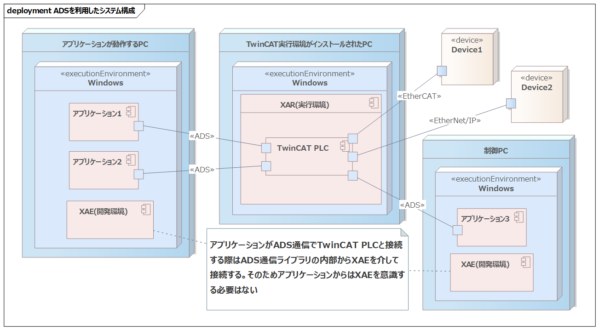

In this article, we will introduce how to integrate with PLC data on TwinCAT using ADS communication with C#.

# Is C# Popular for Robot Control?
In system development, a variety of programming languages are used. Python, JavaScript (Node.js, Deno), C#, Java, C++, C, etc., are major players. Recently, Rust and Go have also become popular.

In robot control and factory automation, many languages are also used. Vendors that provide services and devices supply APIs and libraries when offering their products to systems. Therefore, it is desirable to provide them in programming languages with a large user base or as open standards. AI-related or open-source solutions are often provided as Python modules, but in licensing businesses, I feel that libraries are frequently provided in C#.

Reasons include:
- Large user base
- Easy to use (low barrier to entry)
- Abundant convenient libraries (reducing development costs by combining them)
- Good compatibility with vendor-provided Windows GUI applications and simulators (developed in C#)
- Vendors find it easy to develop libraries themselves
- Closed source (for licensing business, etc.)
- Runs on Linux (.NET Core) as well

There are also offerings as Python modules, but in those cases, the core library is implemented in C++ or similar (for closed source or performance reasons), and Python is provided as a wrapper to use that library.

# What is ADS Communication?
ADS (Automation Device Specification) is a proprietary communication protocol developed by Beckhoff Automation. It operates over TCP/IP or UDP/IP and is used for data exchange between software modules inside and outside the TwinCAT system.

A C# (.NET) library is provided, and you can start using it immediately if you have a TwinCAT environment set up.

TwinCAT acts as a hub, enabling monitoring and manipulation of TwinCAT PLC variables via the ADS protocol.

:::info: Regarding TwinCAT and ADS Communication
Please refer to the series article "Starting Software PLC Development with TwinCAT" "[Part 1: Environment Setup](https://developer.mamezou-tech.com/robotics/twincat/introduction/twincat-introduction/)".
:::

# Example System Configuration Using TwinCAT ADS



The system is structured around the TwinCAT PLC. Therefore, XAR (runtime environment) is required. Also, to integrate Applications 1–3 with TwinCAT via ADS communication, XAE (development environment) is necessary.

**Integration Method**  
TwinCAT acts as a hub, connecting devices and applications via industrial networks and ADS, enabling data integration through TwinCAT.
- TwinCAT PLC and Applications 1–3 are connected via `ADS`
- TwinCAT PLC and Device1 are connected via `EtherCAT`
- TwinCAT PLC and Device2 are connected via `EtherNet/IP`

:::info: Other Data Integration Methods
By adding dedicated hardware modules to the TwinCAT PLC, it is possible to receive measured temperatures from thermometers as analog voltage values. Additionally, by purchasing a software license for network communication, you can receive data via socket communications.
:::

**Use Cases**  
When global variables are defined on the TwinCAT PLC, they can be used for the following:
- Sensor control
- Receiving sensor data
- Monitoring and manipulation of TwinCAT PLC variables
- Integration with devices and robots, etc.
- RPC to programs (Function Blocks) on the TwinCAT PLC
- Inter-process communication via TwinCAT

Setting values for global variables on the TwinCAT PLC is done by programs running on TwinCAT.

:::info: Regarding Global Variable Definition and Value Setting
For details, please see the series article "Starting Software PLC Development with TwinCAT" "[Part 2: Programming in ST Language (1/2)](https://developer.mamezou-tech.com/robotics/twincat/introduction-chapter2/twincat-introduction-chapter2/)".
:::

# Installing the Library
Install `Beckhoff.TwinCAT.Ads` via the NuGet package manager and add it to your project's references. The update cycle (mainly bug fixes) is relatively fast, with minor versions released every few months. I have updated it several times, and because it maintains backward compatibility, existing code continues to work without issues.

# Correspondence Between TwinCAT Data Types and C# Data Types
The correspondence table between TwinCAT data types and C# data types is as follows. Note that INT corresponds to short, REAL corresponds to float, and there are several items that require special attention.

| TwinCAT Data Type | Bit Width | C# Data Type | Description                                                                                 |
|:-----------------:|:---------:|:------------:|:--------------------------------------------------------------------------------------------|
| BOOL              | 8 bit     | byte         | Boolean value / although described as 1-bit bool, it is internally treated as 1 byte (**Important**) |
| BYTE              | 8 bit     | byte         | Unsigned 8-bit integer                                                                       |
| SINT              | 8 bit     | sbyte        | Signed 8-bit integer                                                                         |
| USINT             | 8 bit     | byte         | Unsigned 8-bit integer                                                                       |
| INT               | 16 bit    | short        | Signed 16-bit integer (**Important**)                                                        |
| UINT              | 16 bit    | ushort       | Unsigned 16-bit integer                                                                      |
| DINT              | 32 bit    | int          | Signed 32-bit integer                                                                        |
| UDINT             | 32 bit    | uint         | Unsigned 32-bit integer                                                                      |
| LINT              | 64 bit    | long         | Signed 64-bit integer                                                                        |
| ULINT             | 64 bit    | ulong        | Unsigned 64-bit integer                                                                      |
| REAL              | 32 bit    | float        | Single-precision floating-point (**Important**)                                               |
| LREAL             | 64 bit    | double       | Double-precision floating-point                                                               |
| ENUM              | 16 bit    | short        | Signed 16-bit integer (**Important**)                                                        |
| STRING            | 1 byte/char | string     | 1 byte per character byte array + terminating NULL (0) character (**Important**)             |
| TIME              | 32 bit    | TimeSpan     | Unsigned integer in milliseconds                                                             |

# TwinCAT-side Configuration
Register variables with the following settings:
- Under the `PlcProject` project → `GVLs`, define a global variable list named `GVL_Test` (name is arbitrary).
- Set the variable name to `TestData` with the data type `DINT`.

```cs: TwinCAT-side Configuration
{attribute 'qualified_only'}
VAR_GLOBAL
    TestData : DINT;
END_VAR
```

Now, let's try accessing the TestData variable from C#.

# Accessing Variables with AdsClient
AdsClient serves as the gateway when accessing TwinCAT. Numeric data can be read and written in the same way.

```cs: AdsClient Creation Example
using System;
using TwinCAT.Ads;

namespace AdsComponent
{
    class Program
    {
        static void Main(string[] args)
        {
            // Create an instance of AdsClient
            AdsClient client = new AdsClient();

            // Connect to TwinCAT
            // 1st argument: AmsNetId string
            // 2nd argument: Port number (for TwinCAT3 PLC, it is 851)
            client.Connect("192.168.1.101.1.1", 851);

            // Create a handle to refer to a TwinCAT global variable
            // Specify using "GlobalVariableListName.VariableName" defined on the TwinCAT side
            uint handle = client.CreateVariableHandle("GVL_Test.TestData");

            // Write operation
            int writeValue = 123;
            client.WriteAny(handle, writeValue);

            // Read operation
            int readValue = (int)client.ReadAny(handle, typeof(int));
            Console.WriteLine($"read:{readValue}");

            // Release the handle
            client.DeleteVariableHandle(handle);

            // Close the connection and release resources
            client.Close();
            client.Dispose();
        }
    }
}
```

:::alert: For readability, exception handling and constant definitions have been omitted
:::

:::info: Specifying AmsNetId
Please specify the AmsNetId displayed in the "ADS Communication Route Settings" section of the series article "Starting Software PLC Development with TwinCAT" "[Part 1: Environment Setup](https://developer.mamezou-tech.com/robotics/twincat/introduction/twincat-introduction/)".
:::

:::info: Connections can remain open, but be sure to release resources when done
:::

:::info: AdsClient implements the System.IDisposable interface, so you can use a using statement
:::

# Data Change Callback Notification
To monitor whether the TwinCAT-side `GVL_Test.TestData` variable has changed, periodic polling using ReadAny() is inefficient and requires manual thread management. To address this, there is a mechanism that automatically sends a callback notification to the client when the value changes.

```cs: Example of Data Change Callback Notification
private AdsClient _adsClient;  // Instance is created and connection is assumed established
private uint _handleNotification = 0;

// Start data change notification
public void StartValueChangeNotification()
{
    // Register the event handler
    _adsClient.AdsNotificationEx += OnAdsNotified;

    // Register the data change notification handle (start notification)
    _handleNotification = _adsClient.AddDeviceNotificationEx(
            "GVL_Test.TestData",
            // Notify when a change occurs every 50 ms
            // Set the maximum delay time to 0 ms
            new NotificationSettings(AdsTransMode.OnChange, 50, 0),
            null,
            typeof(int));
}

// Event reception
private void OnAdsNotified(object sender, AdsNotificationExEventArgs evn)
{
    if (evn.Handle != _handleNotification)
    {
        return;
    }

    var data = (int)evn.Value;
    Console.WriteLine($"notified:{data}");
}

// Stop data change notification
public void StopValueChangeNotification()
{
    // Delete the data change notification handle (stop notification)
    _adsClient.DeleteDeviceNotification(_handleNotification);
    _handleNotification = 0;

    // Unregister the event handler
    _adsClient.AdsNotificationEx -= OnAdsNotified;
}
```

After calling `StartValueChangeNotification()`, if the value of `GVL_Test.TestData` is updated on the TwinCAT side, `OnAdsNotified()` will be called back on the C# side. When you finish handling callback notifications, be sure to call `StopValueChangeNotification()` to release the handle.

:::info: To update the value of `GVL_Test.TestData`
To manually update the definition and value of a global variable, log in to the PLC using the "3.3 Verifying Operation by Logging In" section of the series article "Starting Software PLC Development with TwinCAT" "[Part 2: Programming in ST Language (1/2)](https://developer.mamezou-tech.com/robotics/twincat/introduction-chapter2/twincat-introduction-chapter2/)", and directly overwrite the variable's value.
:::

# Cyclic Callback Notification
By changing the parameters of data change callback notifications, periodic notifications are also possible.

```cs: Example of Cyclic Callback Notification
// Start periodic notification
public void StartCyclicNotification()
{
    // Register the event handler
    _adsClient.AdsNotificationEx += OnAdsNotified;

    // Register the cyclic notification handle (start notification)
    _handleNotification = _adsClient.AddDeviceNotificationEx(
            "GVL_Test.TestData",
            // Notify every 10 ms
            // Set maximum delay time to 1 ms
            new NotificationSettings(AdsTransMode.Cyclic, 10, 1),
            null,
            typeof(int));
}
```

Specifying `AdsTransMode.Cyclic` results in cyclic notifications. When setting the notification interval to 10 ms and the maximum delay to 1 ms, delays of 1 ms occasionally occurred, but notifications were received almost exactly every 10 ms. It seems that TwinCAT, running in kernel mode, can notify values at precise intervals. On the C# side, which is just a regular Windows application, one might expect delays due to Windows OS scheduling accuracy or network driver receiving processes, but these did not seem to cause issues. It's a curious phenomenon that I'd like to investigate sometime.

# Defining Structures
Not only primitive types but also structures can be used for Read/Write data and callback notification data types. Structures can also be nested. First, as an example, define a structure `DUT_Sample` on the TwinCAT side.

```cs: TwinCAT-side Structure Definition
// DUT_Sample structure definition
TYPE DUT_Sample :
STRUCT
    IsValid : BOOL;      // BOOL type
    Height : DINT;       // DINT type
    CurrentMode : EMode; // ENUM type
    Status : DUT_Status; // structure
END_STRUCT
END_TYPE

// EMode ENUM type definition
{attribute 'strict'}
{attribute 'to_string'}
TYPE EMode :
(
    Vertical := 0,
    Horizontal := 1
);
END_TYPE

// DUT_Status structure definition
TYPE DUT_Status :
STRUCT
    Status1 : DINT;
    Status2 : DINT;
END_STRUCT
END_TYPE
```

Add `Sample` to the global variable list `GVL_Test`.

```cs: TwinCAT-side Global Variable Definition
{attribute 'qualified_only'}
VAR_GLOBAL
    TestData : DINT;
    Sample : DUT_Sample;
END_VAR
```

Define the same structure on the C# side so that the global variable `GVL_Test.Sample` can be handled on the C# side. However, be aware of alignment issues (rules for data alignment in memory). TwinCAT 3 uses an 8-byte alignment by default, so you need to define the C# side structure accordingly.

- Apply the attribute `[StructLayout(LayoutKind.Sequential, Pack = 8)]` to the structure  
- Match non-structure data types to the "Correspondence Between TwinCAT Data Types and C# Data Types"  
- Ensure the order of variable definitions matches the TwinCAT side  

Note that while it is not mandatory to match variable and structure names with the TwinCAT side, doing so clarifies the correspondence and is recommended.

```cs: Example of C# Structure Definition
// Sample structure
[StructLayout(LayoutKind.Sequential, Pack = 8)]
public struct Sample
{
    public byte   IsValid;     // BOOL type => byte
    public int    Height;      // DINT type => int
    public EMode  CurrentMode; // ENUM type => EMode
    public Status Status;      // structure => Status
}

// EMode definition
public enum EMode : short     // ENUM type => short
{
    Vertical,
    Horizontal,
}

// Status structure
[StructLayout(LayoutKind.Sequential, Pack = 8)]
public struct Sample
{
    public int Status1; // DINT => int
    public int Status2; // DINT => int
}
```

Using a cast and `typeof()`, for example `int readValue = (Sample)client.ReadAny(handle, typeof(Sample));`, you can use the same API as for primitive types.

# Reading/Writing Strings (string)
On the TwinCAT side, you can handle strings with the STRING type. However, it is treated as ASCII (Latin-1) with 1 byte per character, so writing Japanese directly will cause garbled text. Also, you need to specify the number of bytes when defining it. Therefore, specify encoding as UTF-8 in the definition.

```cs: TwinCAT-side Configuration
{attribute 'qualified_only'}
VAR_GLOBAL
    TestData : DINT;
    Sample : DUT_Sample;

    // Application layer transmission data
    {attribute 'TcEncoding':='UTF-8'}
    Message : STRING(1024);
END_VAR
```

- By adding the `{attribute 'TcEncoding':='UTF-8'}` to the variable definition, you make it interpret the character encoding as UTF-8  
- Specify the character size in bytes  
- The character size should include the terminating NULL (0) character  

For UTF-8, the number of bytes per character is variable (1 to 4 bytes). Typical Japanese characters use 3 bytes, so specify a generous byte size.

```cs: String (string) Read/Write Example
using System.Text;

private const int STRING_SIZE = 1024;
private AdsClient _adsClient; // Assume instance is created and connection is established
private uint _handle;         // Assume it refers to 'GVL_Test.Message'

// Writing a string
public void WriteMessage(string message)
{
    // Convert the UTF-8 string to a byte array
    byte[] utf8Bytes = Encoding.UTF8.GetBytes(message);

    // Check the byte size
    if (utf8Bytes.Length > STRING_SIZE)
    {
         throw new Exception("Byte count exceeded");
    }

    // The buffer is initially filled with NULL (0) characters
    byte[] targetBuffer = new byte[STRING_SIZE];
    // Copy the converted byte array to the start of the fixed-length array
    Buffer.BlockCopy(utf8Bytes, 0, targetBuffer, 0, utf8Bytes.Length);

    _adsClient.WriteAny(_handle, targetBuffer);
}

// Reading a string
public string ReadMessage()
{
    // Retrieve the fixed-length byte array (including the terminating NULL character)
    var byteArray = (byte[])_adsClient.ReadAny(
            _handle, typeof(byte[]), new int[] {STRING_SIZE});

    // Find the first NULL character (0) in the byte array
    int nullCharIndex = Array.IndexOf(byteArray, (byte)0);

    // If a NULL character is found, treat everything up to it as the string
    if (nullCharIndex >= 0)
    {
        // GetString(byteArray, start index, length)
        return Encoding.UTF8.GetString(byteArray, 0, nullCharIndex);
    }

    // If no NULL character is found (the buffer is filled with the string),
    // convert the entire array
    return Encoding.UTF8.GetString(byteArray);
}
```

Handling UTF-8 strings requires slightly more verbose code compared to other data types. Because strings are sent and received as byte arrays of the defined size, even if you only want to send one character, the remainder is filled with NULL characters and the full buffer size is transferred.

# Conclusion
I hope you now understand how to handle various data types with ADS communication and how to use callback notifications. By applying this, you can perform RPC and inter-process communication. When integrating "Process A on PC1" and "Process B on PC2", if you define the data type as a JSON string (e.g., `STRING(1024)`), you can build a distributed processing system using generic data. Also, by cleverly using callback notifications, you might be able to implement a Publish/Subscribe-type system that treats variables on TwinCAT as topics.

Beckhoff has published the ADS communication protocol specifications on their website, and there are open-source ADS communication libraries available. Therefore, it seems possible to perform ADS communication from Python, Node.js, Go, and so on. However, keep in mind that you cannot receive support from Beckhoff for these open-source libraries.
