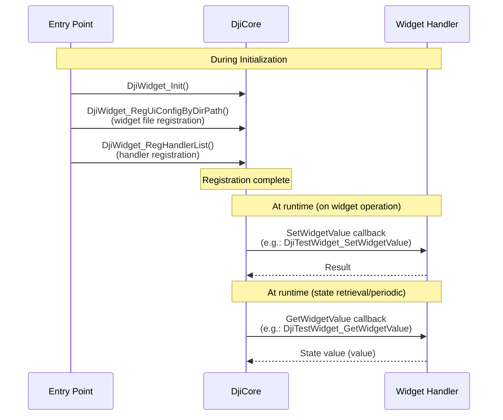

## Introduction

At Mamezou, we are working on the development of a solar panel cleaning robot system.

This system consists of a robot that cleans solar panels and a drone that transports it. In this article, we will introduce how to display custom widgets on the remote controller using the Payload SDK (https://developer.dji.com/doc/payload-sdk-tutorial/en/tutorial-map.html) used for drone-side development.

An overview of the Payload SDK is also introduced in the following article, so please refer to it as well.

@[og](https://developer.mamezou-tech.com/robotics/solar-panel-clean-robot/dji-drone-psdk-introduction/)

## What Is a Custom Widget?

When using a payload device mounted on the aircraft, there are many situations in which the user wants to issue operation commands to the payload or check its status.

In the DJI drone system, the UI is provided by DJI-made remote controllers (running DJI Pilot 2) or applications developed with the Mobile SDK (https://developer.dji.com/mobile-sdk/).

Custom widgets are a mechanism for embedding your own widgets into these UIs.

The system configuration when using a remote controller is illustrated below.


An application inside the SBC of a third-party payload device provides widget definitions to the aircraft via the Payload SDK. DJI Pilot 2 running on the remote controller automatically retrieves those widget definitions from the aircraft and displays them in the UI.

In this article, based on the DJI tutorial (https://developer.dji.com/doc/payload-sdk-tutorial/en/function-set/basic-function/custom-widget.html), we will introduce what you can do with custom widgets.

## Demo with Sample Code for Custom Widgets

The Payload SDK repository (https://github.com/dji-sdk/Payload-SDK) includes sample code for each SDK feature.

The sample code for custom widgets is located at:

- https://github.com/dji-sdk/Payload-SDK/blob/master/samples/sample_c/module_sample/widget/

Below is a demo video showing the sample code in action.

“PSDK” has been added to the main menu on the left side of the DJI Pilot 2 camera view.

<a href="https://youtu.be/uJdoqYUyc-0"></a>

When you press the settings button at the top right, “PSDK” also appears in the settings menu on the right.

<a href="https://youtu.be/P9zsJkX1biQ"></a>

In this sample, the callbacks for widget operations are mock implementations, so there is no actual action when you press the buttons. However, it should give you a clear idea of how the UI can be extended.

## File Structure of Custom Widgets

The sample directory (https://github.com/dji-sdk/Payload-SDK/blob/master/samples/sample_c/module_sample/widget/) has the following structure:

```bash
├── test_widget.c
├── test_widget.h
└── widget_file
    ├── cn_big_screen
    │   ├── icon_button1.png
    │   ├── icon_button2.png
    │   ├── icon_list_item1.png
    │   ├── icon_list_item2.png
    │   ├── icon_scale.png
    │   ├── icon_switch_select.png
    │   ├── icon_switch_unselect.png
    │   └── widget_config.json
    └── en_big_screen
        ├── icon_button1.png
        ├── icon_button2.png
        ├── icon_list_item1.png
        ├── icon_list_item2.png
        ├── icon_scale.png
        ├── icon_switch_select.png
        ├── icon_switch_unselect.png
        └── widget_config.json
```

The `widget_config.json` file defines the custom widgets, and the PNG files are used as icons.

Directories are separated by UI language: `cn_big_screen` for Chinese, `en_big_screen` for English. The directory referenced switches according to the remote controller’s language setting.

You don’t need to define configurations for every language—you can specify a default directory. In this sample, `en_big_screen` is set as the default. In the demo above, because the remote controller was set to Japanese, it fell back to `en_big_screen`.

In `test_widget.c`, handlers for the SDK callbacks are implemented. In those handlers, you write the code for processing button presses and for returning values to display in the UI.

## Initialization Flow of Custom Widgets

When the sample application starts, a console menu for each feature appears. Custom widgets are automatically uploaded to the aircraft after startup and displayed in DJI Pilot 2.

```bash
0.016	            core	[Info]	               dji_core.c:113  Payload SDK Version : V3.15.0-beta.0-build.2318 Dec 10 2025 17:27:05
1.075	         adapter	[Info]	     dji_access_adapter.c:351  Identify mount position type is Extension Port Type
1.075	         adapter	[Info]	     dji_access_adapter.c:371  Identify aircraft series is Matrice 4 Series
1.578	         adapter	[Info]	     dji_access_adapter.c:493  Identity uart0 baudrate is 921600 bps
1.582	            core	[Info]	    dji_identity_verify.c:627  Updating dji sdk policy file...
...(omit)
12.455	            core	[Info]	               dji_core.c:328  Start dji sdk application
12.455	            user	[Info]	          application.cpp:372  Application start.

| Available commands:                                                                              |
| [0] Fc subscribe sample - subscribe quaternion and gps data                                      |
| [1] Flight controller sample - you can control flying by PSDK                                    |
| [2] Hms info manager sample - get health manger system info by language                          |
| [a] Gimbal manager sample - you can control gimbal by PSDK                                       |
| [c] Camera stream view sample - display the camera video stream                                  |
| [d] Stereo vision view sample - display the stereo image                                         |
| [e] Run camera manager sample - you can test camera's functions interactively                    |
| [f] Start rtk positioning sample - you can receive rtk rtcm data when rtk signal is ok           |
| [g] Request Lidar data sample - Request Lidar data and store the point cloud data as pcd files   |
| [h] Request Radar data sample - Request radar data                                               |
| [l] Run widget states manager sample, control widget states on other payload                     |
```

Below is an excerpt of the SDK initialization (from application.cpp).

https://github.com/dji-sdk/Payload-SDK/blob/326b8698dd98d5451fc14cfc952976795d37bd66/samples/sample_c%2B%2B/platform/linux/raspberry_pi/application/application.cpp#L330

```c
void Application::DjiUser_ApplicationStart()
{
    ...(omit)

    returnCode = DjiCore_SetAlias("PSDK_APPALIAS");  // Payload name (for UI display)
    if (returnCode != DJI_ERROR_SYSTEM_MODULE_CODE_SUCCESS) {
        throw std::runtime_error("Set alias error.");
    }

    ...(omit)

    returnCode = DjiTest_WidgetStartService();  // Start widget service
    if (returnCode != DJI_ERROR_SYSTEM_MODULE_CODE_SUCCESS) {
        USER_LOG_ERROR("widget sample init error");
    }
```

The alias `PSDK_APPALIAS` set by `DjiCore_SetAlias` is displayed in the UI as the payload device name. `DjiTest_WidgetStartService` is the function defined in `test_widget.c`.

Below is an excerpt of `DjiTest_WidgetStartService`. It configures the SDK with the `widget_file` directory path, and registers handlers for widget operation callbacks and for returning display values. Entries 0–8 in `s_widgetHandlerList` correspond to `widget_index` values defined in `widget_config.json`.

https://github.com/dji-sdk/Payload-SDK/blob/e8041ad6ea468db3346379f771f78c0636994aa8/samples/sample_c/module_sample/widget/test_widget.c#L112

```c
static const T_DjiWidgetHandlerListItem s_widgetHandlerList[] = {
    {0, DJI_WIDGET_TYPE_BUTTON,        DjiTestWidget_SetWidgetValue, DjiTestWidget_GetWidgetValue, NULL},
    {1, DJI_WIDGET_TYPE_LIST,          DjiTestWidget_SetWidgetValue, DjiTestWidget_GetWidgetValue, NULL},
    {2, DJI_WIDGET_TYPE_SWITCH,        DjiTestWidget_SetWidgetValue, DjiTestWidget_GetWidgetValue, NULL},
    {3, DJI_WIDGET_TYPE_SCALE,         DjiTestWidget_SetWidgetValue, DjiTestWidget_GetWidgetValue, NULL},
    {4, DJI_WIDGET_TYPE_BUTTON,        DjiTestWidget_SetWidgetValue, DjiTestWidget_GetWidgetValue, NULL},
    {5, DJI_WIDGET_TYPE_SCALE,         DjiTestWidget_SetWidgetValue, DjiTestWidget_GetWidgetValue, NULL},
    {6, DJI_WIDGET_TYPE_INT_INPUT_BOX, DjiTestWidget_SetWidgetValue, DjiTestWidget_GetWidgetValue, NULL},
    {7, DJI_WIDGET_TYPE_SWITCH,        DjiTestWidget_SetWidgetValue, DjiTestWidget_GetWidgetValue, NULL},
    {8, DJI_WIDGET_TYPE_LIST,          DjiTestWidget_SetWidgetValue, DjiTestWidget_GetWidgetValue, NULL},
};

...(omit)

T_DjiReturnCode DjiTest_WidgetStartService(void)
{
    T_DjiReturnCode djiStat;
    T_DjiOsalHandler *osalHandler = DjiPlatform_GetOsalHandler();

    // Step 1: Init DJI Widget
    djiStat = DjiWidget_Init();
    if (djiStat != DJI_ERROR_SYSTEM_MODULE_CODE_SUCCESS) {
        USER_LOG_ERROR("Dji test widget init error, stat = 0x%08llX", djiStat);
        return djiStat;
    }

    ...(omit)

    // Set default UI config path
    djiStat = DjiWidget_RegDefaultUiConfigByDirPath(tempPath);
    if (djiStat != DJI_ERROR_SYSTEM_MODULE_CODE_SUCCESS) {
        USER_LOG_ERROR("Add default widget UI config error, stat = 0x%08llX", djiStat);
        return djiStat;
    }

    // Set UI config for English language
    djiStat = DjiWidget_RegUiConfigByDirPath(DJI_MOBILE_APP_LANGUAGE_ENGLISH,
                                             DJI_MOBILE_APP_SCREEN_TYPE_BIG_SCREEN,
                                             tempPath);
    if (djiStat != DJI_ERROR_SYSTEM_MODULE_CODE_SUCCESS) {
        USER_LOG_ERROR("Add widget UI config error, stat = 0x%08llX", djiStat);
        return djiStat;
    }

    // Set UI config for Chinese language
    djiStat = DjiWidget_RegUiConfigByDirPath(DJI_MOBILE_APP_LANGUAGE_CHINESE,
                                                DJI_MOBILE_APP_SCREEN_TYPE_BIG_SCREEN,
                                                tempPath);
    if (djiStat != DJI_ERROR_SYSTEM_MODULE_CODE_SUCCESS) {
        USER_LOG_ERROR("Add widget UI config error, stat = 0x%08llX", djiStat);
        return djiStat;
    }

    // Step 3: Set widget handler list
    djiStat = DjiWidget_RegHandlerList(s_widgetHandlerList, s_widgetHandlerListCount);
    if (djiStat != DJI_ERROR_SYSTEM_MODULE_CODE_SUCCESS) {
        USER_LOG_ERROR("Set widget handler list error, stat = 0x%08llX", djiStat);
        return djiStat;
    }
```

Language identifiers (e.g., `DJI_MOBILE_APP_LANGUAGE_ENGLISH`) are defined in [dji_typedef.h](https://github.com/dji-sdk/Payload-SDK/blob/e8041ad6ea468db3346379f771f78c0636994aa8/psdk_lib/include/dji_typedef.h#L237):

```c
/**
 * @brief Mobile APP system language.
 */
typedef enum {
    DJI_MOBILE_APP_LANGUAGE_UNKNOWN             = 255, /*!< The system language of the mobile app is unknown */
    DJI_MOBILE_APP_LANGUAGE_ENGLISH             = 0, /*!< The system language of the mobile app is English */
    DJI_MOBILE_APP_LANGUAGE_CHINESE             = 1, /*!< The system language of the mobile app is Chinese */
    DJI_MOBILE_APP_LANGUAGE_JAPANESE            = 2, /*!< The system language of the mobile app is Japanese */
    DJI_MOBILE_APP_LANGUAGE_FRENCH              = 3, /*!< The system language of the mobile app is French */
} E_DjiMobileAppLanguage;
```

In this sample, a UI configuration for Japanese (`DJI_MOBILE_APP_LANGUAGE_JAPANESE`) is not registered. Therefore, when the remote controller is set to Japanese, the default configuration (`en_big_screen`) registered with `DjiWidget_RegDefaultUiConfigByDirPath` is used. This is the behavior of the “default directory” mentioned above.

Next, let’s look at the handler implementations.

```c
static T_DjiReturnCode DjiTestWidget_SetWidgetValue(E_DjiWidgetType widgetType, uint32_t index, int32_t value,
                                                    void *userData)
{
    s_widgetValueList[index] = value;
    return DJI_ERROR_SYSTEM_MODULE_CODE_SUCCESS;
}

static T_DjiReturnCode DjiTestWidget_GetWidgetValue(E_DjiWidgetType widgetType, uint32_t index, int32_t *value,
                                                    void *userData)
{
    *value = s_widgetValueList[index];
    return DJI_ERROR_SYSTEM_MODULE_CODE_SUCCESS;
}
```

`s_widgetValueList` is an array indexed by widget index. When you interact with a widget in the UI, `DjiTestWidget_SetWidgetValue` is called and the operation value is passed in. `DjiTestWidget_GetWidgetValue` is called periodically to return the widget’s state via `value`.

In the sample, the value received by `SetWidgetValue` is stored and simply returned by `GetWidgetValue`. Therefore, when you toggle a switch, the display updates immediately.

For example, if you want to control external equipment with a switch ON operation but want the display to remain OFF until the equipment’s state actually changes, return the actual equipment state in `GetWidgetValue`.

The registration of widget files and handlers with DjiCore, and the flow of callbacks on widget operation and state retrieval (periodic calls), is as follows. On the application side, your development targets are the entry point and the widget handlers.



## Explanation of widget_config.json

In this section, using the sample app’s `widget_config.json` as an example, we explain the structure of the definition file. For details, see the Payload SDK Tutorial (Custom Widget) (https://developer.dji.com/doc/payload-sdk-tutorial/en/function-set/basic-function/custom-widget.html).

Top-level structure:
- version … Version of the configuration format (major/minor).
- ar_config … Not covered in the tutorial or API spec, so omitted here.
- main_interface … Definitions of widgets displayed in the main menu.
- config_interface … Definitions of widgets displayed in the settings menu.

main_interface:
This is the configuration for the main menu. In addition to `floating_window` (whether to display a floating window) and `speaker` (TTS/audio), widgets are listed in `widget_list`. In the sample, four widgets with `widget_index` 0–3 (Button, List, Switch, Scale) are defined.

The payload device name displayed at the top of the menu is the string set by `DjiCore_SetAlias`.


config_interface:
This is the configuration for the settings menu. It specifies a `text_input_box` (text input and placeholder) and widgets in `widget_list`. In the sample, five widgets with `widget_index` 4–8 (Button/Scale/Integer Input Box/Switch/List) are defined.


Elements of widget_list:
Each widget has at least the following properties:

| Property       | Description                                                                                                                                  |
| -------------- | -------------------------------------------------------------------------------------------------------------------------------------------- |
| widget_index   | Index of the widget. Corresponds to the index in `s_widgetHandlerList` and is used in callbacks to identify which widget is being referenced. |
| widget_type    | Type of widget. One of `button`, `list`, `switch`, `scale`, `int_input_box`.                                                                  |
| widget_name    | Name displayed in the UI.                                                                                                                     |

Depending on the type, you can also specify:

| Widget Type    | Additional Properties                   | Description                                                                                                                                                            |
| -------------- | ---------------------------------------- | ---------------------------------------------------------------------------------------------------------------------------------------------------------------------- |
| button         | `icon_file_set`                         | Specify PNG filenames via `icon_file_name_selected` and `icon_file_name_unselected`. Displays the selected icon when value = 1 and unselected when value = 0.           |
| list           | `list_item`                             | Array specifying `item_name` for each entry. You can also specify `icon_file_set` for each list item.                                                                  |
| switch         | `icon_file_set`                         | Same as button.                                                                                                                                                         |
| scale          | `icon_file_set`, `customize_rc_buttons_config` | Icon spec same as button. Use `button_value_step_length` to set the step size for remote controller button operations.                                                   |
| int_input_box  | `int_input_box_hint`                    | Hint string for units, etc. (e.g., `"unit:s"`).                                                                                                                         |

## Icon Specifications

For custom widgets in DJI Pilot, the following icon design specifications are recommended.

Size and frame:

| Item                                    | Recommended Value                                                                                 |
| --------------------------------------- | ------------------------------------------------------------------------------------------------- |
| Standard icon size                      | 96px                                                                                              |
| Bottom frame (size)                     | 80px                                                                                              |
| Bottom frame (background color)         | <span style="display:inline-block;width:1.2em;height:1.2em;background:#000000;vertical-align:middle;border:1px solid #666;"></span> #000000 (black) |
| Bottom frame (opacity)                  | 0.6 (alpha; 0 = fully transparent, 1 = fully opaque; semi-transparent at about 60% opacity)       |
| Bottom frame (blur)                     | 4 (blur strength; softens the frame’s edges)                                                      |
| Stroke width for circular elements      | Approximately 4px                                                                                 |

The bottom frame is the display frame for icons as specified by DJI.

Display states and colors:
Icons should use the following colors to represent different states. They correspond to `icon_file_name_selected`/`icon_file_name_unselected` and the value returned by the GetWidgetValue callback.

| State   | Color (HEX)                                                                                                                       | Description                                   |
| ------- | --------------------------------------------------------------------------------------------------------------------------------- | --------------------------------------------- |
| Normal  | <span style="display:inline-block;width:1.2em;height:1.2em;background:#4E4E4E;vertical-align:middle;border:1px solid #ccc;"></span> #4E4E4E | When unselected (value = 0)                   |
| Active  | <span style="display:inline-block;width:1.2em;height:1.2em;background:#1FA3F6;vertical-align:middle;border:1px solid #ccc;"></span> #1FA3F6 | When selected (value = 1)                     |
| Disable | <span style="display:inline-block;width:1.2em;height:1.2em;background:#BCBCBC;vertical-align:middle;border:1px solid #999;"></span> #BCBCBC | When disabled                                 |

:::info:Note
The above table is a general description of UI icon specifications. In custom widgets, only two icon files can be specified in `widget_config.json`: `icon_file_name_selected` and `icon_file_name_unselected`. There is no mechanism to pass a disable icon to the SDK. Preparing two icons—Normal and Active—is sufficient.
:::

Format and layout:

- Use PNG format for icons.
- Example display area sizes: 48×48, 56×56, 40×56, 56×40, etc. Center the actual content and provide appropriate margins.

DJI provides a Sketch template (psdk_widget.sketch: https://terra-1-g.djicdn.com/71a7d383e71a4fb8887a310eb746b47f/psdk/psdk_widget.sketch). It is recommended to base your icon creation on this template.


## Conclusion

In this article, we introduced the custom widget mechanism for extending the remote controller UI for payload devices, and outlined the implementation flow using definition files (`widget_config.json`) and handler registration.

There are still few examples of custom payload development using the Payload SDK, and tutorials alone provide limited information, making it hard to understand “what kind of UI you can create.” We hope this article will serve as a reference for those planning to develop payload devices.
