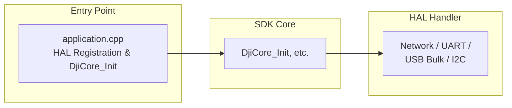
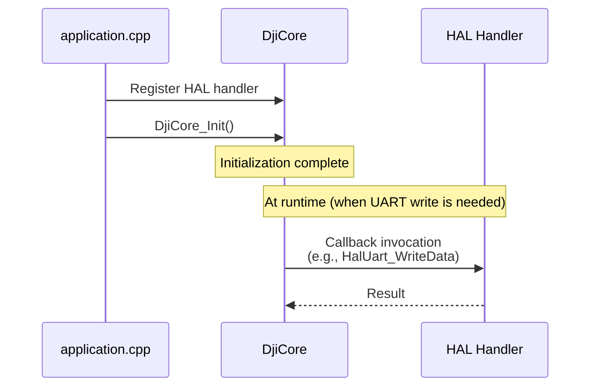

## Introduction

At Mamezou, we are working on the development of a solar panel cleaning robot system.

This system consists of a robot that cleans solar panels and a drone that transports the robot. In this article, we introduce the Payload SDK (https://developer.dji.com/doc/payload-sdk-tutorial/en/tutorial-map.html), which is the development technology on the drone side.

## Project Overview

To keep the power generation efficiency of solar panels at its maximum, it is essential to regularly remove the dust and dirt that accumulate on their surfaces.  
Cleaning by hand may be possible for small panels for household use, but for large-scale power generation facilities such as mega-solar plants, manual cleaning operations are not realistic in terms of efficiency and cost.


At our company, we are developing an autonomous cleaning robot for such power generation facilities.

## Cleaning Robot System Configuration

In power plants, linked solar panels are installed at positions that are separated from each other. The solar panels are installed at a height of more than 2 m above the ground, and it is difficult to manually transport the robot between panels.

Therefore, this system adopts a method of using a drone to transport the robot.


The main components are as follows.

### Cleaning Robot

An in-house developed AMR that autonomously navigates while cleaning solar panel surfaces with brushes. It is the payload for the drone and is designed so that its total weight is within the drone's payload capacity. It was also exhibited at the [2025 International Robot Exhibition](https://mamezo.tech/n/10850/).


### Drone

We use the [DJI FlyCart 30](https://www.dji.com/jp/flycart-30). Its payload capacity is 30 kg in dual-battery mode (maximum flight time 18 minutes) and 40 kg in single-battery mode (maximum flight time 9 minutes).

The remote controller runs an application called DJI Pilot 2 on a DJI RC Plus.


### Payload Device

The standard cargo case included with the FlyCart 30 has internal dimensions of 573×416×305 mm, which cannot accommodate the robot. Therefore, we are developing a device to secure the robot to the drone.


## Configuration of the Payload Device

The main role of the payload device in this system is to secure the robot to the drone.

The lock mechanism is controlled via the drone's remote controller operations to secure the robot. A single-board computer (SBC) inside the payload device handles the lock mechanism control and provides widgets to the remote controller.

DJI provides an SDK for payload device development called the Payload SDK (https://developer.dji.com/doc/payload-sdk-tutorial/en/tutorial-map.html), and the payload device runs an application developed with this SDK on the SBC.

For the FlyCart 30, the following interfaces are provided for payload devices.

- [E-Port Lite](https://developer.dji.com/doc/payload-sdk-tutorial/en/quick-start/drone-port.html#e-port-lite)  
  - USB Type-C maintenance port  
  - Can be connected directly via USB Type-C cable to a PC with [DJI Assistant 2](https://www.dji.com/downloads/softwares/dji-assistant-2-for-delivery-series) installed for firmware updates and log collection  
  - For platforms like the FlyCart 30 that do not provide an E-Port, E-Port Lite can be connected to an SBC via a USB to TTL serial module and used as an expansion port
- [Payload Port](https://developer.dji.com/doc/payload-sdk-tutorial/en/quick-start/drone-port.html#flycart-30-payload-port-power-supply-port)  
  - Power supply port for payload devices  
  - Rated voltage is 51.2 V

Since the lock mechanism of this system is still under development, details are omitted. The following is a conceptual diagram of the configuration when using a CAN-compatible servo. In this case, power to the servo is supplied from the Payload Port, and the SBC communicates with the aircraft via E-Port Lite to control the servo.


## Various Expansion Ports Provided by the Aircraft

The above configuration is an example for the FlyCart 30. Some aircraft models provide expansion ports other than E-Port Lite.

### [E-Port](https://developer.dji.com/doc/payload-sdk-tutorial/en/quick-start/drone-port.html#e-port)

A widely supported expansion port that provides power, UART, and USB. By connecting a custom payload via the [E-Port Development Kit](https://store.dji.com/jp/product/dji-e-port-development-kit), UART and USB communications become possible.

E-Port Lite has limitations in obtaining camera images, but with E-Port and the Development Kit, USB is extended, allowing the use of many functions.


### [E-Port V2](https://developer.dji.com/doc/payload-sdk-tutorial/en/quick-start/drone-port.html#e-port-v2-port)

An expansion port provided on the Matrice 400 (announced June 2025). While aircraft typically have one E-Port, E-Port V2 has four ports on the underside of the M400, each capable of supplying 120 W of power. The power output can be adjusted in three levels: 13.6 V, 17 V, and 24 V. It supports USB 3.0, allowing simultaneous acquisition of 4K streams and radar point cloud data. Custom payloads can connect via the [E-Port V2 Development Kit](https://store.dji.com/jp/product/dji-e-port-v2-development-kit).

### [Gimbal Port](https://developer.dji.com/doc/payload-sdk-tutorial/en/quick-start/drone-port.html#gimbal-port)

A standard interface equipped on the gimbals of M300 RTK (announced May 2020) and M350 RTK (announced May 2023), also called PSDK Port. It is an interface for connecting DJI gimbal payloads (cameras, sensors, etc.) represented by the Zenmuse series.


For third parties, a [Payload SDK Development Board Kit 2.0](https://store.dji.com/product/psdk-development-kit-v2) is provided, which can be used as an intermediary to connect custom payloads.

### [OSDK Port](https://developer.dji.com/doc/payload-sdk-tutorial/en/quick-start/drone-port.html#osdk-port)

An older interface currently provided only by the M300 RTK. It predates the E-Port and uses the [Onboard SDK (OSDK)](https://developer.dji.com/document/30ac6801-db84-46c2-baf2-8ad8d62bf3ba), but its final release was 2021-02-02 (OSDK 4.1.0), and no new features have been added since.

The OSDK Port supports not only the [OSDK Expansion Module](https://dl.djicdn.com/downloads/matrice-300/20200617/OSDK_Expansion_Module_Product_Information.pdf) but also connection with the E-Port Development Kit, allowing the use of the Payload SDK (PSDK). According to [OSDK Version Support Information](https://developer.dji.com/document/30ac6801-db84-46c2-baf2-8ad8d62bf3ba) (dated May 9, 2023), all OSDK 4.x features have been migrated to [PSDK V3](https://developer.dji.com/doc/payload-sdk-tutorial/en/). For new development, migration to PSDK V3 is recommended.

## Expansion Ports by Aircraft Model

Below is a list of expansion ports provided by current aircraft models, excerpted from Standard Hardware Port Introduction.

| Aircraft             | Port Name           | Supports App Binding |
| -------------------- | ------------------- | -------------------- |
| FlyCart 100          | E-Port Lite         | –                    |
| FlyCart 30           | E-Port Lite         | –                    |
| Matrice 4D/4TD       | E-Port, E-Port Lite | ✓                    |
| Matrice 4E/4T        | E-Port, E-Port Lite | ✓                    |
| Matrice 3D/3TD       | E-Port, E-Port Lite | –                    |
| Matrice 30/30T       | E-Port              | –                    |
| Mavic 3E/3T          | E-Port              | –                    |
| M400                 | E-Port V2           | ✓                    |
| M350 RTK             | E-Port              | –                    |
| M350 RTK             | Gimbal Port         | ✓                    |
| M300 RTK             | OSDK Port           | –                    |
| M300 RTK             | Gimbal Port         | ✓                    |

Aircraft with a check in the `Supports App Binding` column require the Application Binding procedure. We plan to introduce this procedure in a separate article.

## Supported Functions per Port Type

The table below is a selection of supported functions by port type for some aircraft, extracted from the Aircraft Type Function Difference list.

Because supported functions vary by aircraft even within the same port type, you cannot determine functionality solely by port type (for example, “If it has an E-Port, you can use this feature”). For instance, Hoisting Control is only supported on the E-Port Lite of the FlyCart 100.

| Function Name               | Function Level | FlyCart 30 E-Port Lite | Matrice 4E/4T E-Port | Matrice 400 E-Port V2 | Matrice 350 RTK Gimbal Port |
| --------------------------- | -------------- | :--------------------: | :------------------: | :-------------------: | :-------------------------: |
| Log Management              | basic          | ✓                      | ✓                    | ✓                     | ✓                           |
| Data Subscription           | basic          | ✓                      | ✓                    | ✓                     | ✓                           |
| Basic Camera Function       | basic          | –                      | ✓                    | ✓                     | ✓                           |
| Basic Camera Management     | advanced       | –                      | –                    | ✓                     | –                           |
| Gimbal Function             | basic          | –                      | ✓                    | ✓                     | ✓                           |
| Gimbal Management           | advanced       | –                      | –                    | ✓                     | –                           |
| Power Management            | basic          | ✓                      | –                    | ✓                     | ✓                           |
| Flight Control              | advanced       | ✓                      | –                    | ✓                     | ✓                           |
| Custom Widget               | basic          | ✓                      | ✓                    | ✓                     | ✓                           |
| Custom HMS                  | basic          | ✓                      | ✓                    | ✓                     | ✓                           |
| HMS Manager                 | advanced       | ✓                      | –                    | ✓                     | ✓                           |
| Time Synchronization        | basic          | –                      | ✓                    | ✓                     | ✓                           |
| Low-speed Data Transmission | basic          | ✓                      | ✓                    | ✓                     | ✓                           |
| Camera Video Stream         | basic          | –                      | ✓                    | ✓                     | ✓                           |
| Playback Download           | basic          | –                      | –                    | ✓                     | ✓                           |
| X-Port Function             | basic          | –                      | –                    | ✓                     | ✓                           |
| Camera Stream Liveview      | advanced       | –                      | –                    | ✓                     | –                           |
| Local Upgrade               | basic          | –                      | ✓                    | –                     | ✓                           |
| High-speed Data Transmission| basic          | –                      | –                    | ✓                     | –                           |
| Positioning                 | basic          | –                      | –                    | ✓                     | ✓                           |
| SDK Interconnection         | basic          | –                      | –                    | ✓                     | ✓                           |
| Waypoint Mission            | advanced       | ✓                      | –                    | ✓                     | –                           |
| Speaker                     | basic          | ✓                      | ✓                    | ✓                     | ✓                           |
| Hoisting Control            | basic          | –                      | –                    | –                     | –                           |
| Access Internet             | advanced       | –                      | –                    | ✓                     | –                           |
| Network RTK                 | advanced       | –                      | –                    | ✓                     | –                           |

## Serial Communication Specifications

The Payload SDK uses UART and USB serial communication.

In USB communication, USB Gadget (a mechanism for making a Linux device behave as a USB device) is used, and two types of communication modes are utilized:

- Bulk (USB Bulk Transfer)  
  - Bidirectional raw data communication between the device and the host
- RNDIS (Remote Network Driver Interface Spec)  
  - A specification that emulates Ethernet over USB  
  - IP communication between the device and the host

The support status of each port is shown in the table below.

| Port          | Only UART | UART+Bulk | UART+RNDIS | Only Bulk | Only RNDIS |
| ------------- | --------- | --------- | ---------- | --------- | ---------- |
| E-Port Lite   | ✓         | –         | –          | –         | –          |
| E-Port        | ✓         | ✓         | ✓          | –         | –          |
| E-Port V2     | ✓         | –         | –          | ✓         | ✓          |
| Gimbal Port   | ✓         | –         | ✓          | –         | –          |

| Mode         | Description                                                   |
| ------------ | ------------------------------------------------------------- |
| Only UART    | Communicate with the aircraft using UART only                 |
| UART+Bulk    | Communicate with the aircraft using both UART and Bulk        |
| UART+RNDIS   | Communicate with the aircraft using both UART and RNDIS       |
| Only Bulk    | Communicate with the aircraft using Bulk only                 |
| Only RNDIS   | Communicate with the aircraft using RNDIS only                |

Only E-Port V2 can communicate using only Bulk or only RNDIS; UART is required for all other ports.

For more details, refer to the following DJI Developer Support pages (in Chinese). A DJI Developer Center account registration is required to view any of them.

- [PSDK 各机型硬件连接介绍](https://sdk-forum.dji.net/hc/zh-cn/articles/50341690206105-PSDK-%E5%90%84%E6%9C%BA%E5%9E%8B%E7%A1%AC%E4%BB%B6%E8%BF%9E%E6%8E%A5%E4%BB%8B%E7%BB%8D)
- [树莓派4B配置USB device RNDIS 和 BULK](https://sdk-forum.dji.net/hc/zh-cn/articles/10232604141465-%E6%A0%91%E8%8E%43%E6%B4%BE4B%E9%85%8D%E7%BD%AEUSB-device-RNDIS-%E5%92%8C-BULK)

Since any port can communicate via UART only, it is recommended to initially connect only via UART and start by verifying the operation of the application developed with the Payload SDK.

## Payload SDK API Specifications

The [Payload SDK API Reference](https://developer.dji.com/doc/payload-sdk-api-reference/en/) appears to list API specifications automatically generated from the SDK’s source code headers. However, there is very little descriptive text, and it mainly focuses on lists of functions and types. Therefore, understanding the API specifications requires referring to sample code and verifying actual operation on hardware.

## Payload SDK Sample Applications

The DJI [Payload-SDK](https://github.com/dji-sdk/Payload-SDK) repository publishes the Payload SDK libraries and sample applications that use them.

### Directory Structure

The repository directory structure is as follows:

```
├── psdk_lib
│   ├── include
│   └── lib
│       ├── aarch64-linux-gnu-gcc
│       ├── arm-linux-gnueabi-gcc
│       ├── arm-linux-gnueabihf-gcc
│       ├── armcc_cortex-m4
│       └── x86_64-linux-gnu-gcc
├── samples
│   ├── sample_c
│   │   ├── module_sample
│   │   │   ├── camera_emu
│   │   │   ├── camera_manager
│   │   │   ├── cloud_api
│   │   │   ├── data_transmission
│   │   │   ├── fc_subscription
│   │   │   ├── flight_control
│   │   │   ├── gimbal_emu
│   │   │   ├── gimbal_manager
│   │   │   ├── hms
│   │   │   ├── interest_point
│   │   │   ├── liveview
│   │   │   ├── mop_channel
│   │   │   ├── payload_collaboration
│   │   │   ├── perception
│   │   │   ├── positioning
│   │   │   ├── power_management
│   │   │   ├── tethered_battery
│   │   │   ├── time_sync
│   │   │   ├── upgrade
│   │   │   ├── utils
│   │   │   ├── waypoint_v2
│   │   │   ├── waypoint_v3
│   │   │   ├── widget
│   │   │   ├── widget_interaction_test
│   │   │   └── xport
│   │   └── platform
│   │       ├── linux
│   │       │   ├── common
│   │       │   │   ├── 3rdparty
│   │       │   │   ├── monitor
│   │       │   │   ├── osal
│   │       │   │   └── upgrade_platform_opt
│   │       │   ├── manifold2
│   │       │   │   ├── application
│   │       │   │   └── hal
│   │       │   ├── manifold3
│   │       │   │   ├── app_json
│   │       │   │   ├── application
│   │       │   │   └── hal
│   │       │   ├── nvidia_jetson
│   │       │   │   ├── application
│   │       │   │   └── hal
│   │       │   └── raspberry_pi
│   │       │       ├── application
│   │       │       └── hal
│   │       └── rtos_freertos
│   │           ├── common
│   │           │   └── osal
│   │           ├── gd32f527_development_board
│   │           │   ├── application
│   │           │   ├── bootloader
│   │           │   ├── drivers
│   │           │   ├── hal
│   │           │   ├── middlewares
│   │           │   └── project
│   │           └── stm32f4_discovery
│   │               ├── application
│   │               ├── bootloader
│   │               ├── drivers
│   │               ├── hal
│   │               ├── middlewares
│   │               └── project
│   └── sample_c++
│       ├── module_sample
│       │   ├── camera_manager
│       │   ├── flight_controller
│       │   ├── gimbal
│       │   ├── hms_manager
│       │   ├── liveview
│       │   ├── perception
│       │   ├── positioning
│       │   └── widget_manager
│       └── platform
│           └── linux
│               ├── common
│               │   ├── 3rdparty
│               │   └── osal
│               ├── manifold2
│               │   ├── application
│               │   └── hal
│               ├── manifold3
│               │   ├── application
│               │   └── hal
│               ├── nvidia_jetson
│               │   ├── application
│               │   └── hal
│               └── raspberry_pi
│                   ├── application
│                   └── hal
```

### psdk_lib

Platform-specific static libraries are placed here. For each toolchain, refer to [Using third-party development platforms](https://developer.dji.com/doc/payload-sdk-tutorial/en/model-instruction/choose-develop-platform.html#using-third-party-development-platforms). In the case of Raspberry Pi or Jetson, use the `aarch64-linux-gnu-gcc/libpayloadsdk.a` in this directory. If you need a toolchain not available here, you can request it from SDK Technical Support (dev@dji.com), and they will provide a static library for that toolchain. See also [PSDK platform static library link](https://sdk-forum.dji.net/hc/en-us/community/posts/35228015714073-PSDK-platform-static-library-link-problem-feedback-application).

### samples

#### module_sample

Sample code for each feature provided by the SDK is located here. Samples are prepared for each feature, such as camera management, flight control, gimbal, live view, HMS, positioning, and widgets.

#### platform

Platform-dependent code is organized here. The source code placed in `hal/` is the implementation of the hardware abstraction layer (HAL) (e.g., network, UART, USB Bulk, I2C).

The entry point of the sample applications is `application/main.cpp`. From there, `application/application.cpp` is called, and the registration of HAL handlers and the setup of the SDK via `DjiCore_Init` are performed. Which of UART, Bulk, or RNDIS is used is determined by the combination of HAL handlers registered.

Below is an excerpt of the HAL handler registration section (branching based on `CONFIG_HARDWARE_CONNECTION`).

[Payload-SDK/samples/sample_c++/platform/linux/raspberry_pi/application/application.cpp](https://github.com/dji-sdk/Payload-SDK/blob/326b8698dd98d5451fc14cfc952976795d37bd66/samples/sample_c%2B%2B/platform/linux/raspberry_pi/application/application.cpp#L179)

```cpp
    returnCode = DjiPlatform_RegHalI2cHandler(&i2CHandler);
    if (returnCode != DJI_ERROR_SYSTEM_MODULE_CODE_SUCCESS) {
        throw std::runtime_error("register hal i2c handler error");
    }

#if (CONFIG_HARDWARE_CONNECTION == DJI_USE_UART_AND_USB_BULK_DEVICE)
    returnCode = DjiPlatform_RegHalUartHandler(&uartHandler);
    if (returnCode != DJI_ERROR_SYSTEM_MODULE_CODE_SUCCESS) {
        throw std::runtime_error("Register hal uart handler error.");
    }

    returnCode = DjiPlatform_RegHalUsbBulkHandler(&usbBulkHandler);
    if (returnCode != DJI_ERROR_SYSTEM_MODULE_CODE_SUCCESS) {
        throw std::runtime_error("Register hal usb bulk handler error.");
    }
#elif (CONFIG_HARDWARE_CONNECTION == DJI_USE_UART_AND_NETWORK_DEVICE)
    returnCode = DjiPlatform_RegHalUartHandler(&uartHandler);
    if (returnCode != DJI_ERROR_SYSTEM_MODULE_CODE_SUCCESS) {
        throw std::runtime_error("Register hal uart handler error.");
    }

    returnCode = DjiPlatform_RegHalNetworkHandler(&networkHandler);
    if (returnCode != DJI_ERROR_SYSTEM_MODULE_CODE_SUCCESS) {
        throw std::runtime_error("Register hal network handler error");
    }
#elif (CONFIG_HARDWARE_CONNECTION == DJI_USE_ONLY_USB_BULK_DEVICE)
    returnCode = DjiPlatform_RegHalUsbBulkHandler(&usbBulkHandler);
    if (returnCode != DJI_ERROR_SYSTEM_MODULE_CODE_SUCCESS) {
        throw std::runtime_error("Register hal usb bulk handler error.");
    }

#elif (CONFIG_HARDWARE_CONNECTION == DJI_USE_ONLY_NETWORK_DEVICE)
    returnCode = DjiPlatform_RegHalNetworkHandler(&networkHandler);
    if (returnCode != DJI_ERROR_SYSTEM_MODULE_CODE_SUCCESS) {
        throw std::runtime_error("Register hal network handler error");
    }

    //Attention: if you want to use camera stream view function, please uncomment it.
    returnCode = DjiPlatform_RegSocketHandler(&socketHandler);
    if (returnCode != DJI_ERROR_SYSTEM_MODULE_CODE_SUCCESS) {
        throw std::runtime_error("register osal socket handler error");
    }
#elif (CONFIG_HARDWARE_CONNECTION == DJI_USE_ONLY_UART)
    /*!< Attention: Only use uart hardware connection.
     */
    returnCode = DjiPlatform_RegHalUartHandler(&uartHandler);
    if (returnCode != DJI_ERROR_SYSTEM_MODULE_CODE_SUCCESS) {
        throw std::runtime_error("Register hal uart handler error.");
    }
#endif
```

The following is an illustrative diagram of the application's layer structure.



At runtime, when DjiCore needs to perform operations such as writing to UART, the pre-registered HAL handlers are called back. The flow is as follows:



In the diagram, application.cpp and the HAL handlers are included in the sample code, and DjiCore is provided as a static library in psdk_lib.

At first glance, you may feel that the amount of code in the sample seems large, but the platform-dependent code can basically be used as is. However, even on the same platform, there may be cases where it does not work with the latest OS or accompanying libraries, so maintenance by the developer is necessary.

## Verification Environment for the Payload SDK

Unfortunately, verifying the operation of a Payload SDK application requires an actual aircraft.

DJI Assistant 2 has a feature to simulate flights, but it can only be used when connected to a vehicle paired with the transmitter. Additionally, Payload SDK communications also assume an actual aircraft.

You need to acquire or rent a model equipped with the same ports (E-Port Lite or E-Port) as the aircraft used in production operations.

At our company, we use the FlyCart 30 in production operations, but because it is expensive, we develop the application on a different model (e.g., Matrice 4E) equipped with E-Port Lite for development and debugging.

## Conclusion

In this article, we introduced the Payload SDK used for drone-side development in a system that transports solar panel cleaning robots by drone.

Even when searching on the Internet, materials related to the Payload SDK are limited to those provided by DJI, and practical procedures are mainly centered on DJI Developer Support’s Chinese pages. It took us considerable effort to get our application up and running. We hope that this article will serve as a starting point for those who are also working on developing custom payloads.

Practical topics of the Payload SDK such as obtaining flight status, widget integration, and the Application Binding procedure will be covered in detail in upcoming articles. We appreciate your continued interest.
