# 0. Introduction
In [the previous article](https://developer.mamezou-tech.com/robotics/twincat/introduction/twincat-introduction/), we explained how to set up TwinCAT's development environment (XAE) and runtime environment (XAR).  
This time, we will introduce the basic implementation method for PLC programs.

# 1. What is the ST Language?
It is one of the five programming languages defined in the IEC 61131-3 standard.  
It is a language that can be implemented in text form and is written in a Pascal-like syntax.  
In this article, we will use this language.

```cs: Example of a program written in ST language
FOR i:=0 TO 10 DO
    // Execute method and perform data input/output via arguments
    fbHogeHoge.FugaFuga(i, outData => tmpData)
END_FOR
```

# 2. Creating and Implementing a PLC Program
Launch the development environment and implement the PLC program in ST language.

## 2.1 Creating a Solution
Open Visual Studio or XAE Shell.  
(In this example, we selected Visual Studio.)

Select "Create a new project".  


For the project template, select "TwinCAT XAE Project (XML format)".  
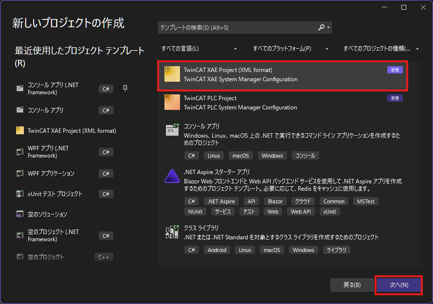

Specify the project name and solution name.  
Check "Place solution and project in the same directory".  
Set both the project name and solution name to "TwinCAT-Tutorial".  


## 2.2 Creating the PLC Project
In the Solution Explorer, right-click "PLC" and click "Add New Item".  
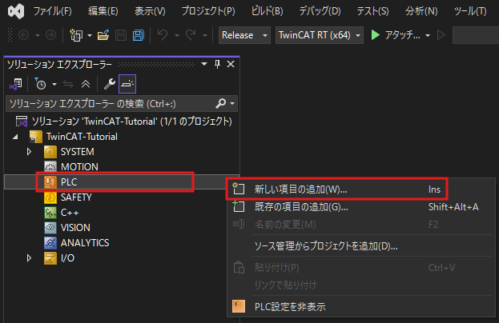

:::info: How to open the Solution Explorer
If the Solution Explorer is not displayed on the left side of the XAE Shell or Visual Studio window, click:  
- "View" > "Solution Explorer"  

:::

Select "Standard PLC Project" and specify the project name.  
This time, click the Add button with the name "PlcTutorialProject".  
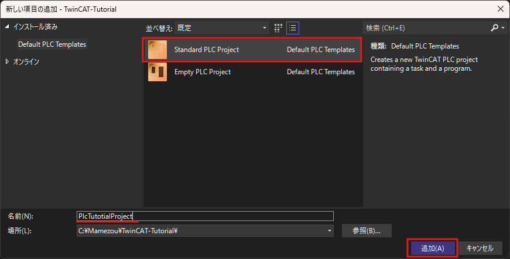

## 2.3 Editing the MAIN Program
When you create a new PLC program, an item is added under "PLC" in the Solution Explorer.  
Click "MAIN (PRG)" in the "POUs" folder to open the editor.

The upper half of the editor is the space to define variables, and the lower half is the space to write the program logic.  
(Analogous to C++, the upper half is like a header file and the lower half is like a source file.)  


In the definition space (upper half), write as follows. We will define a variable of type DINT (signed 32-bit integer).  
When defining a variable, use the format "variableName : TYPE".

```cs: MAIN Program Definition Space
PROGRAM MAIN
VAR
    /// Program call count
    CycleCount : DINT;
END_VAR
```

In the implementation space (lower half), write as follows.  
This time, we are incrementing the variable "CycleCount" once per cycle.

```cs: MAIN Program Implementation Space
// Increment the variable
CycleCount := CycleCount + 1;
```

:::alert: Assignment Symbol
Note that assignment uses ":=". The "=" symbol is used for **equality comparison** (to check if values are equal).
:::

:::info: Primitive Types Available in TwinCAT
For a list of available primitive types, refer to [this link](https://infosys.beckhoff.com/english.php?content=../content/1033/tcplccontrol/925424907.html&id=).
:::

:::check: Auto-Completion Feature
Press "Ctrl+Space" to display the completion suggestions window. This is recommended for speeding up coding.  

:::

Once you finish editing the program, build it and verify that there are no errors.  
In the IDE, click the "Build" tab > "Build Solution".  


In the "Output" tab displayed at the bottom of the IDE, verify that the number of failures is 0.  


# 3. Running the Project and Verifying Operation
## 3.1 Pre-Deployment Checklist
To write the program, first check whether you can access the XAR environment (i.e., the runtime environment).

Right-click the gear icon in the system tray and select  
"Router" > "Edit Routes".  
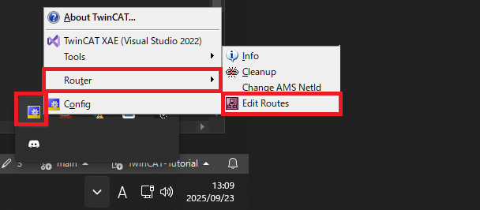

:::info: If the icon is not displayed in the system tray
If the gear icon is not displayed in the system tray, start the following executable file:  
`C:\Program Files (x86)\Beckhoff\TwinCAT\3.1\System\TcAmsRemoteMgr.exe`  
(Note: If you installed TwinCAT in a different location, the path may differ.)  
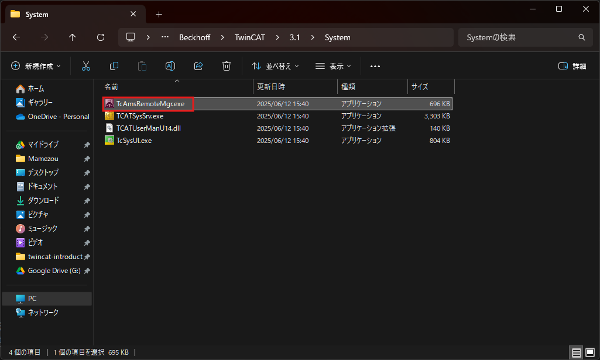
:::

The "TwinCAT Static Routes" window will appear, and if it is green as shown below, the connection is successful.  
If there are no green entries, review the settings from [Chapter 3 and 4 of the previous article](https://developer.mamezou-tech.com/robotics/twincat/introduction/twincat-introduction/#3-%E3%83%95%E3%82%A1%E3%82%A4%E3%82%A2%E3%82%A6%E3%82%A9%E3%83%BC%E3%83%AB%E8%A8%AD%E5%AE%9A).  
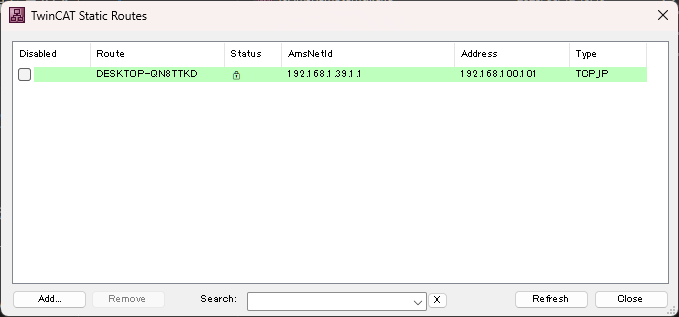

## 3.2 Deploying the Project
Once you confirm that communication with the XAR is established, specify the target from the IDE.

In the IDE, open the "View" tab > "Toolbars" > check "TwinCAT XAE Base".  
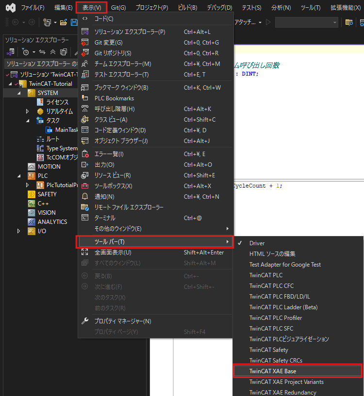

This will add TwinCAT-related options to the top of the IDE.

Before  
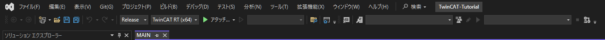

After  


Among the added items, click the combo box labeled "Local" and select the XAR environment as the target.  


After specifying the target, click the blue stairs icon.  
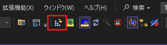

The "Activate Configuration" window will appear; click OK.  
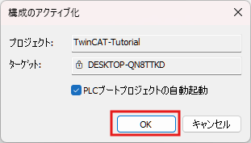

On the first write, you will be prompted to generate an evaluation license, so select "Yes".  


Enter the same string as shown into the text box and click OK.  
This will generate the evaluation license and make the program ready to run.  


:::info: About the TwinCAT Runtime License
A license is required to use each TwinCAT package in the XAR environment.  
If you do not have a license, you can generate and use an evaluation license for free.  
However, this evaluation license is valid for 7 days, after which it must be regenerated.  
While the evaluation license has more limited functionality compared to a full license, it is sufficient for verifying basic operation.
:::

You will be prompted to restart TwinCAT; click "OK" to restart.  


If the gear icon in the bottom right of the IDE is green and spinning as shown below, the program is running correctly.  


## 3.3 Verifying Operation by Logging In
In TwinCAT, you can verify variable values in real time by logging into the XAR.  
Using this login feature, let's check if the program you just wrote is working correctly.

Select "Extensions" tab > "PLC" > "Login" to log in.  
If this button is disabled, check that the correct target is specified in the target combo box.  


When you open the MAIN program while logged in, you can view the value of the CycleCount variable in real time.  
You can see that it increments by about 100 per second.  
This is because the execution cycle of the task generated when the TwinCAT project was created is 10ms.  


# 4. Changing the Task Execution Cycle
By default, the cycle for the generated task is 10ms, but let's change this.  
Let's delete the task that was automatically added during project creation.  
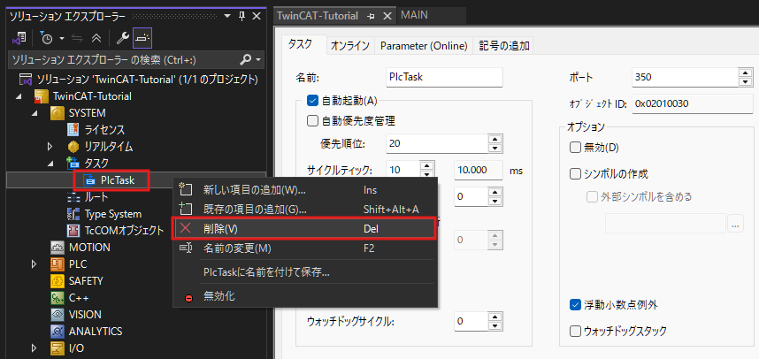

Create a new task. Right-click "SYSTEM" > "Tasks" and click "Add New Item".  


Select "TwinCAT Task" as the type, name it "MainTask", and click "OK".  
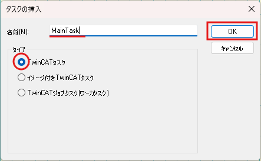

The detailed settings for the created task will open, so change "Cyclical" from 10 to 100.  
This will set the task execution cycle to 100ms.  
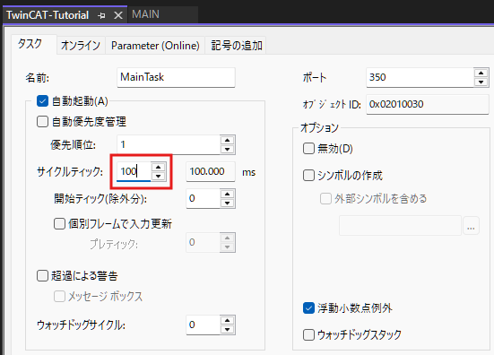

:::info
The duration of each cycle is 1ms by default, but it can be changed in the CPU core settings.  
For more details, see:  
https://infosys.beckhoff.com/english.php?content=../content/1033/tc3_system/5210414219.html&id=
:::

After creating the task, set which program to call.  
Right-click "PLC Project" > "Add" > "Referenced Task".  


The available tasks will be displayed, so select the "MainTask" you just created and click "Open".  
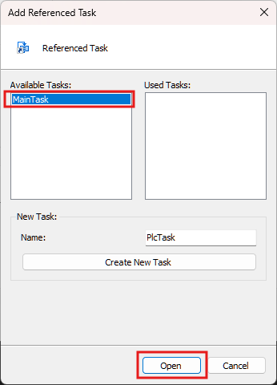

Right-click the created "Task Reference" and select "Add" > "Existing Item".  
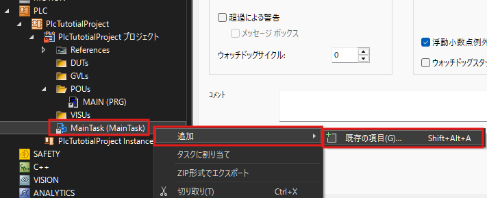

Select the program that the task will call. Choose the "MAIN" program you modified earlier and click "OK".  


As before, log in and observe the variables.  
You should see that the value increases by 10 per second.  
This is because the task you just created calls the MAIN program every 100ms.

# 5. Registering Multiple Programs to the Same Task
You can register multiple programs to a single task.  
For example, if you register Program A and Program B to a task with a 10ms cycle, both Program A and Program B will execute every 10ms.  
However, note that Program A and B do not run in parallel; **one program runs after the other program has completed**.

The conceptual structure is shown in the diagram below.  


:::stop
If the total execution time of both programs exceeds the task's cycle period (task overrun), the system may hang.  
Be careful about the program execution time and the task cycle period.
:::

Let's actually assign multiple programs to the same task.  
Right-click the "POUs" folder and select "Add" > "POU".  


Name the program "MAIN2", select type "Program", choose implementation language "Structured Text (ST)", and click "Open".  


In the MAIN2 program, write a process that counts up a variable similarly to the MAIN program.  
(To distinguish it from the MAIN program, we will double the increment amount.)

```cs: MAIN2 Program Definition Space
PROGRAM MAIN2
VAR
    /// Twice the program call count
    CycleDoubleCount : DINT;
END_VAR
```

```cs: MAIN2 Program Implementation Space
CycleDoubleCount := CycleDoubleCount + 2;
```

As with the MAIN program, assign the MAIN2 program to MainTask.  
  
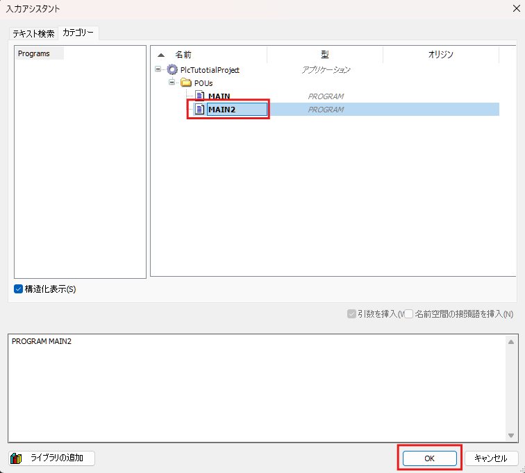

Ensure that both "MAIN" and "MAIN2" are listed as child items under the MainTask reference.  


Write this configuration and verify its operation.  
The MAIN2 program runs at the same cycle (100ms) as the MAIN program, and you can confirm that the CycleDoubleCount variable increases by 20 per second.

# 6. Sharing Data Between Programs
It is often necessary to use a value calculated in one program in another program.  
In such cases, define common data (global variables) between programs or tasks.  
Global variables are defined as shared resources that all tasks can reference, allowing data sharing across tasks.

Let's actually reference a value from the MAIN program in the MAIN2 program.

Right-click the "GVLs" folder and click "Add" > "Global Variable List".  


Name the variable list "GVL_Var" and click "Open".  
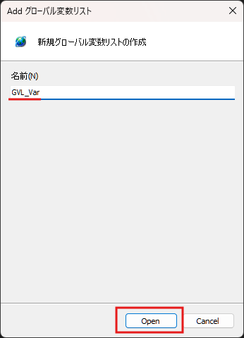

Click "GVL_Var" in the Solution Explorer to open the editor, and define the global variable as shown below.

```cs: GVL_Var
{attribute 'qualified_only'}
VAR_GLOBAL
    /// Data shared between programs
    SharedData : DINT;
END_VAR
```

:::info
The curly braces on the first line represent an attribute for the global variable.  
For more details on attributes, see the link below:  
https://infosys.beckhoff.com/english.php?content=../content/1033/tc3_plc_intro/2529567115.html&id=
:::

In the MAIN program, assign the value of the CycleCount variable to this global variable (SharedData).

```cs: MAIN Program Implementation Space
CycleCount := CycleCount + 1;

// Write value to shared data (added part)
GVL_Var.SharedData := CycleCount;
```

Let's receive this value in the MAIN2 program as another variable.

```cs: MAIN2 Program Definition Space
PROGRAM MAIN2
VAR
    CycleDoubleCount : DINT;
    
    /// Data from the MAIN program
    MainProgramData : DINT;
END_VAR
```

```cs: MAIN2 Program Implementation Space
CycleDoubleCount := CycleDoubleCount + 1;

// Store the value of the shared data in a local variable
MainProgramData := GVL_Var.SharedData;
```

Write this TwinCAT project and verify its operation.  
You can confirm that the MainProgramData variable in the MAIN2 program contains the value of the CycleCount variable from the MAIN program.

# 7. Conclusion
This time, we created a basic PLC program using the ST language.  
You should now have an understanding of how to use tasks and programs.  
The project so far is shared [here](https://github.com/hayat0-ota/TwinCAT-Tutorial/tree/Chapter2). Please use it as supplementary material.

Next time, we will explain PLC programming using function blocks.
