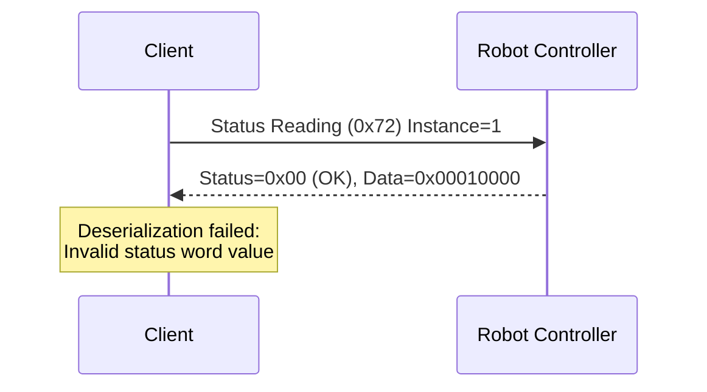

## Introduction

At our company, we build systems using robots from various manufacturers. Communication with the robot controller is a “given” feature. We faced the challenge of reducing integration costs in this area so that we could focus on developing system-specific features such as vision and end-effectors.

On the other hand, industrial robot controller protocol specifications are often distributed as PDFs, which must be converted to Markdown for input to an LLM. Even after Markdown conversion, understanding them requires domain knowledge, and there are few real-world examples on the web, leaving LLM training data insufficient. As a result, additional contextual input is often needed.

Therefore, in this effort we organized the controller communication protocol and client usage into **Agent Skills**, and had an LLM write the controller communication code.

We created skills for Yaskawa Robot’s HSES (High-Speed Ethernet Server) protocol and verified them in combination with the Rust client [moto-hses](https://github.com/masayuki-kono/moto-hses).

By providing the communication specification and client usage in Agent Skills format, the LLM can generate appropriate code even without online examples. While the content is still maturing, by leveraging and improving these skills, LLMs are increasingly able to automatically implement communication code with controllers. It also becomes possible to debug by correlating packet data with the protocol when a communication failure occurs, enabling LLMs to handle everything from code generation to maintenance.

## Standard SDKs Provided by Yaskawa Electric

Yaskawa Electric offers three SDKs for communicating with its robot controllers:

| Item                   | **MotoCom32 / MotoComES**                                                                                                                                               | **MotoPlus**                                                | **YMConnect**                                                                                 |
| :--------------------- | :---------------------------------------------------------------------------------------------------------------------------------------------------------------------- | :----------------------------------------------------------- | :-------------------------------------------------------------------------------------------- |
| **Overview**           | A traditional communication SDK for accessing robot controllers from a PC over Ethernet. Runs on an external PC.                                                       | An embedded SDK for developing user applications in C that run inside the controller.     | The successor to MotoCom. A next-generation cross-platform communication SDK. Runs on an external PC. |
| **Supported OS**       | Windows (32bit/64bit)                                                                                                                                                   | Dedicated RTOS (runs inside the robot controller)            | **Windows 10+ / Ubuntu 22.04+**                                                                |
| **Supported Languages**| C / C++ / VB6 / .NET                                                                                                                                                   | C                                                            | **C++17 / C# (.NET 10)**                                                                       |
| **Execution Location** | External PC (host side)                                                                                                                                                | Inside controller (embedded side)                            | External PC (host side)                                                                       |
| **Communication Method**| Ethernet (TCP/IP)                                                                                                                                                     | Internal API (direct integration with the controller OS)     | Ethernet (TCP/IP)                                                                             |
| **Primary Use Cases**  | Monitoring, I/O control, job start, etc., for external control                                                                                                         | High-speed control, custom operations, external communication tasks | Monitoring, I/O control, job start, etc., for external control                                          |
| **Paid / Free**        | **Paid (hardware license via USB dongle; required per execution environment)**                                                                                         | **Paid (development license only; execution environment license not required)** | **Free (Apache License 2.0)**                                                                   |
| **Features**           | Windows-only, long history with stability, but new features are no longer being updated                                                                                | Highest flexibility; supports real-time processing and external communication | Multi-platform, modern API design                                                               |
| **Distributor**        | Yaskawa Electric (sales contract required)                                                                                                                             | Yaskawa Electric (contracted developers only)                | [GitHub](https://github.com/Yaskawa-Global/YMConnect)                                           |

With MotoPlus, you must develop both the in-controller application and the PC-side communication client yourself. Therefore, the provided communication clients are effectively limited to MotoCom and YMConnect.

YMConnect is a relatively recent SDK (released in 2024). It seems well suited for modern projects that can use C++17 or later and .NET 10 or later, but many legacy systems probably continue to use MotoCom. There are still very few real-world examples of YMConnect usage online. However, recent bug reports in the [YMConnect Discussions](https://github.com/Yaskawa-Global/YMConnect/discussions) suggest adoption is gradually increasing.

Meanwhile, Yaskawa robot controllers provide a server feature called the High-Speed Ethernet Server (HSES), and the communication protocol is publicly documented ([FS100 HSES Manual (PDF)](https://www.motoman.com/getmedia/16B5CD92-BD0B-4DE0-9DC9-B71D0B6FE264/160766-1CD.pdf.aspx?ext=.pdf)).

MotoCom (and likely YMConnect as well) is the HSES client SDK provided by Yaskawa, but equivalent clients can be implemented in-house. In this case, because our upper-level application was written in Rust, we wanted compatibility with legacy systems and a mock server feature for LLM-driven development, so we used a custom Rust client.

## moto-hses: Rust-based HSES Client

[moto-hses](https://github.com/masayuki-kono/moto-hses) is an asynchronous Rust client library for Yaskawa Robot Controller’s HSES (High-Speed Ethernet Server) protocol.

:::info: moto-hses Developed Using LLM
In fact, this client itself was also developed using an LLM. We provided the protocol specification PDF converted to Markdown and a reference client implementation in another language as context. We structured guardrails and automatic feedback mechanisms during development. A similar approach could create clients for C# and other languages. If there’s interest, I’ll write a separate article about this development process.
:::

### Features

- **Type safety**: Safe API design leveraging Rust’s type system  
- **Asynchronous**: Asynchronous UDP communication using the Tokio runtime  
- **Thread-safe**: Concurrent access from multiple tasks via `SharedHsesClient`  
- **Testability**: Integration testing with a mock server (`moto-hses-mock`)

:::info: Importance of the Mock Server
Yaskawa’s robot simulator (MotoSim EG-VRC) does not include HSES server functionality. Until now, communication testing required a real robot controller. With the moto-hses mock server, you can test communication code locally or in CI. Having local, self-contained communication tests is crucial for building automatic feedback loops for LLMs.
:::

### Crate Structure

| Crate               | Description                                        |
|---------------------|----------------------------------------------------|
| `moto-hses-proto`   | Protocol definitions and serialization             |
| `moto-hses-client`  | Tokio-based asynchronous UDP client                |
| `moto-hses-mock`    | Local mock HSES server for testing                 |

### Supported Commands

Currently, moto-hses supports the following robot control commands, with more being added continuously:

| Command No | Command Name                                          |
|------------|------------------------------------------------------|
| 0x70       | Read alarm data                                      |
| 0x71       | Read alarm history                                   |
| 0x72       | Read status information                              |
| 0x73       | Read running job information                         |
| 0x75       | Read robot position data                             |
| 0x78       | Read/write I/O data                                  |
| 0x79       | Read/write register data                             |
| 0x7A–0x7E  | Read/write various variables (B/I/D/R/S types)       |
| 0x82       | Alarm reset / error cancel                           |
| 0x83       | Hold / servo ON-OFF                                   |
| 0x84       | Switch step / cycle / continuous                     |
| 0x86       | Startup (job launch)                                 |
| 0x87       | Job selection                                        |

Additionally, it supports file operation commands (delete, save, list) and bulk read/write commands for multiple data items.

### Basic Usage

```rust
use moto_hses_client::HsesClient;
use moto_hses_proto::AlarmAttribute;

#[tokio::main]
async fn main() -> Result<(), Box<dyn std::error::Error>> {
    // Create client
    let client = HsesClient::new("192.168.0.3:10040").await?;

    // Read alarm data
    let alarm = client.read_alarm_data(1, AlarmAttribute::All).await?;
    println!("Alarm Code: {}", alarm.code);
    println!("Alarm Name: {}", alarm.name);

    // Reset alarm
    client.reset_alarm().await?;
    println!("Alarm reset completed");

    Ok(())
}
```

## LLM Assistance with Agent Skills

[Agent Skills](https://agentskills.io/) is a format for teaching AI coding agents specific domain knowledge and usage patterns. A skill consists of a `SKILL.md` (instructions for the agent), `references/` (reference documents), and `scripts/` (automation scripts).

To leverage moto-hses, we created three skills:

| Skill                    | Description                                                |
|--------------------------|------------------------------------------------------------|
| **hses-protocol**        | HSES protocol specification, including message structure, command format, error codes, etc. |
| **moto-hses-usage**      | Usage guide for the moto-hses crate: client operations, command reference, and more. |
| **hses-packet-analysis** | HSES packet analysis guide for debugging communication failures. |

### Installing the Skills

The skills are published in the [GitHub repository](https://github.com/masayuki-kono/agent-skills). You can add them to your project using Vercel’s `add-skill` installer:

```bash
# For Cursor
npx add-skill masayuki-kono/agent-skills -s hses-protocol moto-hses-usage hses-packet-analysis -a cursor -y

# For Claude Code
npx add-skill masayuki-kono/agent-skills -s hses-protocol moto-hses-usage hses-packet-analysis -a claude-code -y
```

After installation, the skills are arranged in your project as follows:

```
.agents/
└── skills
    ├── hses-packet-analysis
    │   └── SKILL.md
    ├── hses-protocol
    │   ├── references
    │   │   ├── data-types.md
    │   │   ├── error-codes.md
    │   │   ├── protocol-overview.md
    │   │   └── ...
    │   └── SKILL.md
    └── moto-hses-usage
        ├── references
        │   ├── examples
        │   │   ├── alarm_operations.rs
        │   │   ├── job_start.rs
        │   │   ├── read_status.rs
        │   │   └── ...
        │   └── protocol-commands.md
        └── SKILL.md
```

For Cursor, symbolic links are created under `.cursor/skills/` so the AI agent can reference the skills. For more details on `add-skill`, see the [official repository](https://github.com/vercel-labs/add-skill).

Once installed, AI agents will understand the HSES protocol and generate appropriate code using moto-hses.

## Code Generation Demo Using Agent Skills

To verify the effectiveness of the skills, we had Cursor Agent generate code. The generated examples are published in the [moto-hses-examples](https://github.com/masayuki-kono/moto-hses-examples) repository.

### Generation Prompt

We input the following simple prompt:

> Please develop a Rust sample application using moto-hses. When the app starts, turn the servo ON and launch a specified job. Allow the robot controller’s IP address to be specified via command-line arguments.

### Generated Application

From this prompt, Cursor Agent automatically generated an application with the following features:

1. Specify the robot controller’s IP address and job name via command-line arguments  
2. Connect to the robot controller  
3. Set servo ON  
4. Select and start the specified job  
5. Verify the start status and display the result  

### Execution Example

```bash
# Connect to the robot controller (192.168.0.18) and start the job "TEST"
cargo run -- 192.168.0.18 TEST
```

When executed, you get output like this:

```
[2026-01-26T21:50:24Z INFO  moto_hses_examples] Connecting to robot controller: 192.168.0.18:10040
[2026-01-26T21:50:24Z INFO  moto_hses_examples] ✓ Successfully connected to controller
[2026-01-26T21:50:24Z INFO  moto_hses_examples] Reading initial status...
[2026-01-26T21:50:24Z INFO  moto_hses_examples] ✓ Status read successfully
[2026-01-26T21:50:24Z INFO  moto_hses_examples]   - Running: false
[2026-01-26T21:50:24Z INFO  moto_hses_examples]   - Servo ON: true
[2026-01-26T21:50:24Z INFO  moto_hses_examples]   - Alarm: false
[2026-01-26T21:50:24Z INFO  moto_hses_examples]   - Error: false
[2026-01-26T21:50:24Z INFO  moto_hses_examples] Turning servo ON...
[2026-01-26T21:50:24Z INFO  moto_hses_examples] ✓ Servo ON command sent successfully
[2026-01-26T21:50:25Z INFO  moto_hses_examples] ✓ Servo is now ON
[2026-01-26T21:50:25Z INFO  moto_hses_examples] Selecting job 'TEST'...
[2026-01-26T21:50:25Z INFO  moto_hses_examples] ✓ Job 'TEST' selected successfully
[2026-01-26T21:50:25Z INFO  moto_hses_examples] Starting job 'TEST'...
[2026-01-26T21:50:25Z INFO  moto_hses_examples] ✓ Job start command sent successfully
[2026-01-26T21:50:25Z INFO  moto_hses_examples] ✓ Job 'TEST' started successfully
```

We confirmed that even with a custom client library and almost no web examples, the LLM can generate appropriate code by supplementing domain knowledge through Agent Skills.

## Packet Analysis Demo Using Agent Skills

Next, we demonstrate using skills for debugging communication failures. The **hses-packet-analysis** skill captures packets with `tshark` and cross-references the protocol specification from the **hses-protocol** skill to produce a report. By linking skills in this manner, you can handle complex analysis tasks.

### Creating an Error Scenario

For testing, we intentionally modify the response packet for the Status Reading (0x72) command on the mock server to contain invalid data before sending it back.

The Data 1 field of the Status Reading response is 4 bytes (32 bits), but only the lower 8 bits are used for valid status flags.

| Bit     | Meaning                           |
|---------|-----------------------------------|
| Bit 0   | Step mode                         |
| Bit 1   | One-cycle mode                    |
| Bit 2   | Continuous mode                   |
| Bit 3   | Running                           |
| Bit 4   | Speed limited                     |
| Bit 5   | Teach mode                        |
| Bit 6   | Play mode                         |
| Bit 7   | Remote mode                       |
| Bit 8-15| Reserved (should always be 0)     |

#### Description of the Specification Violation

We set the value `0x01` in the upper byte of Data 1 (bits 16–23), exceeding the defined range:

```
Expected: [0x00][0x00][0x00][0x00]  (upper 3 bytes are always 0)
Actual:   [0x00][0x00][0x01][0x00]  (0x01 in the 3rd byte)
         ↓    ↓    ↓    ↓
        Bit  Bit  Bit  Bit
        0-7  8-15 16-23 24-31
                   ↑
             Invalid value
```

Running the previously generated application in this state produces the following error log:

```
[2026-01-27T21:18:54Z INFO  moto_hses_examples] Connecting to robot controller: 192.168.0.18:10040
[2026-01-27T21:18:54Z INFO  moto_hses_examples] ✓ Successfully connected to controller
[2026-01-27T21:18:54Z INFO  moto_hses_examples] Reading initial status...
[2026-01-27T21:18:54Z ERROR moto_hses_examples] ✗ Failed to read status: Protocol error: deserialization error: Invalid status word value
Error: ProtocolError(Deserialization("Invalid status word value"))
```

An `Invalid status word value` error occurred. Let’s use the **hses-packet-analysis** skill to have the LLM analyze the packets.

### Analysis Prompt

We input the following prompt:

> `cargo run -- 192.168.0.18 TEST` fails. Perform packet analysis and output the results in Markdown.

### Analysis Results

The following analysis report was produced. The skill captures packets, matches them against the protocol specification, and pinpoints the issue.

:::info: Report Structure
The output report includes protocol validation results, a sequence diagram, packet details (binary analysis), and recommended actions. In this case, it identified a specification violation where bit 16 in Status Data 1 was set to an invalid value.
:::

---

# HSES Protocol Analysis Report

**Generated:** 2026-01-28 06:19:36  
**Capture File:** hses_capture_20260128_061936.pcap  
**Export File:** hses_export_20260128_061936.txt

## 1. Summary

| Metric           | Value                                                      |
|------------------|------------------------------------------------------------|
| Total Packets    | 2                                                          |
| Requests         | 1                                                          |
| Responses        | 1                                                          |
| Errors           | 0 (protocol level)                                         |
| Duration         | 0.000136 sec                                               |

**Issue Detected:** Application error "Invalid status word value" – the robot controller returned a status value with an unexpected bit set (bit 16) not defined in the protocol specification.

## 2. Protocol Validation

| Check                      | Result | Details                                                                 |
|----------------------------|--------|-------------------------------------------------------------------------|
| Magic bytes                | ✅ Pass | Both packets start with "YERC" (0x59455243)                            |
| Header size                | ✅ Pass | All headers are 32 bytes (0x0020)                                       |
| Reserved (byte 8)          | ✅ Pass | Value is 0x03                                                          |
| Reserved (bytes 16-23)     | ✅ Pass | Value is "99999999"                                                    |
| Division                   | ✅ Pass | 0x01 (Robot)                                                           |
| ACK field                  | ✅ Pass | Request=0x00, Response=0x01                                            |
| Block number               | ✅ Pass | Request=0, Response=0x80000000 (single)                                |
| Request/Response pairs     | ✅ Pass | 1 request matched with 1 response                                      |
| Service code match         | ✅ Pass | Response service (0x81) = Request service (0x01) + 0x80                |
| Command ID                 | ✅ Pass | 0x72 (Status reading) is valid                                         |
| Response status            | ✅ Pass | 0x00 (Normal reply)                                                    |
| **Payload validity**       | ⚠️ Warning | Status word contains undefined bit 16                                 |

### Payload Analysis Issue

The response payload contains status data with an unexpected value:

- **Expected:** Status Data 1 should only use bits 0–7 (bits 8–15 are reserved)  
- **Received:** `0x00010000` (bit 16 is set)  
- **Consequence:** The `moto-hses` library rejects this value as "Invalid status word value"

## 3. Sequence Diagram



## 4. Communication Sequence

| # | Time (sec) | Direction | Command               | Instance | Status      | Description         |
|---|------------|-----------|-----------------------|----------|-------------|---------------------|
| 1 | 0.000000   | Request   | Status Reading (0x72)| 1        | –           | Read Status Data 1  |
| 2 | 0.000136   | Response  | Status Reading        | –        | 0x00 (OK)   | Returned 0x00010000 |

## 5. Protocol Errors

No protocol-level errors detected. However, an application-level deserialization error occurred.

| # | Time     | Command         | Issue                          | Meaning                                                       |
|---|----------|-----------------|--------------------------------|---------------------------------------------------------------|
| 2 | 0.000136 | Status Reading  | Status word bit 16 set         | Controller returned undefined status bit, causing failure     |

### Root Cause Analysis

The robot controller returned Status Data 1 with value `0x00010000`, which has bit 16 set. According to the HSES protocol specification:

**Status Data 1 (Command 0x72, Instance 1) bit definitions:**

| Bit     | Meaning         |
|---------|-----------------|
| 0       | Step mode       |
| 1       | One-cycle mode  |
| 2       | Continuous mode |
| 3       | Running         |
| 4       | Speed limited   |
| 5       | Teach mode      |
| 6       | Play mode       |
| 7       | Remote mode     |
| 8–15    | Reserved        |

Bit 16 is not defined. The `moto-hses` library strictly validates status values and rejects undefined bits.

**Possible causes:**
1. Newer firmware version with extended status bits not yet documented  
2. Controller-specific extension to the protocol  
3. Memory/data corruption on the controller  

## 6. Packet Details

### Packet 1 – Request

| Field           | Value                 | Description                     |
|-----------------|-----------------------|---------------------------------|
| Time            | 0.000000              | Start of capture                |
| Type            | Request               | ACK=0x00                        |
| Magic           | YERC                  | 0x59455243                      |
| Header Size     | 32                    | 0x0020                          |
| Payload Size    | 0                     | No payload                      |
| Division        | Robot                 | 0x01                            |
| Request ID      | 1                     | Session ID                      |
| Block Number    | 0                     | Request block                   |
| Command ID      | 0x0072                | Status reading                  |
| Instance        | 1                     | Status Data 1                   |
| Attribute       | 0                     | Default                         |
| Service         | 0x01                  | Get_Attribute_All               |

**Raw Hex:**
```
59455243 2000 0000 03 01 00 01 00000000 3939393939393939 7200 0100 00 01 0000
│        │    │    │  │  │  │  │        │                │    │    │  │  │
│        │    │    │  │  │  │  │        │                │    │    │  │  └─ Padding
│        │    │    │  │  │  │  │        │                │    │    │  └─ Service (Get_Attribute_All)
│        │    │    │  │  │  │  │        │                │    │    └─ Attribute
│        │    │    │  │  │  │  │        │                │    └─ Instance (1)
│        │    │    │  │  │  │  │        │                └─ Command ID (Status reading)
│        │    │    │  │  │  │  │        └─ Reserved "99999999"
│        │    │    │  │  │  │  └─ Block Number (0)
│        │    │    │  │  │  └─ Request ID (1)
│        │    │    │  │  └─ ACK (Request)
│        │    │    │  └─ Division (Robot)
│        │    │    └─ Reserved (0x03)
│        │    └─ Payload Size (0)
│        └─ Header Size (32)
└─ Magic "YERC"
```

### Packet 2 – Response

| Field             | Value                   | Description                         |
|-------------------|-------------------------|-------------------------------------|
| Time              | 0.000136                | 136 µs after request                |
| Type              | Response                | ACK=0x01                            |
| Magic             | YERC                    | 0x59455243                          |
| Header Size       | 32                      | 0x0020                              |
| Payload Size      | 8                       | Status data                         |
| Division          | Robot                   | 0x01                                |
| Request ID        | 1                       | Matches request                     |
| Block Number      | 0x80000000              | Single response                     |
| Service           | 0x81                    | Get_Attribute_All + 0x80            |
| Status            | 0x00                    | Normal reply                        |
| Added Status Size | 2                       |                                     |
| Added Status      | 0x0000                  | No error                            |

**Payload Data:**
```
00000100 00000000
│        └─ Status Data 1 part 2: 0x00000000
└─ Status Data 1 part 1: 0x00010000 (bit 16 set – UNEXPECTED)
```

**Raw Hex:**
```
59455243 2000 0800 03 01 01 01 00000080 3939393939393939 81 00 02 00 0000 0000 | 00000100 00000000
│        │    │    │  │  │  │  │        │                │  │  │  │  │    │      │
│        │    │    │  │  │  │  │        │                │  │  │  │  │    │      └─ Payload (8 bytes)
│        │    │    │  │  │  │  │        │                │  │  │  │  │    └─ Padding
│        │    │    │  │  │  │  │        │                │  │  │  │  └─ Added Status (0x0000)
│        │    │    │  │  │  │  │        │                │  │  │  └─ Padding
│        │    │    │  │  │  │  │        │                │  │  └─ Added Status Size (2)
│        │    │    │  │  │  │  │        │                │  └─ Status (0x00 = OK)
│        │    │    │  │  │  │  │        │                └─ Service (0x81 = 0x01 + 0x80)
│        │    │    │  │  │  │  │        └─ Reserved "99999999"
│        │    │    │  │  │  │  └─ Block Number (0x80000000 = single)
│        │    │    │  │  │  └─ Request ID (1)
│        │    │    │  │  └─ ACK (Response)
│        │    │    │  └─ Division (Robot)
│        │    │    └─ Reserved (0x03)
│        │    └─ Payload Size (8)
│        └─ Header Size (32)
└─ Magic "YERC"
```

## 7. Recommendations

1. **Investigate controller firmware** – Check if the controller firmware version uses extended status bits not yet documented.  
2. **Update the moto-hses library** – Consider relaxing status validation to ignore unknown bits (e.g., mask Status Data 1 with `0x00FF`).  
3. **Contact Yaskawa** – If the issue persists, consult Yaskawa support about the meaning of bit 16 in Status Data 1.

---

With a simple prompt, it matched the packet’s binary data against the protocol specification and identified the root cause. By leveraging Agent Skills in this way, you can delegate communication failure debugging tasks to an LLM.

## Conclusion

In this article, we introduced an approach that combines the HSES communication client for Yaskawa robot controllers (moto-hses) with Agent Skills.

- **Code Generation**: The moto-hses-usage skill enables an LLM to automatically generate appropriate communication code using moto-hses.  
- **Packet Analysis**: The hses-packet-analysis skill delegates debugging during communication failures to an LLM.

Industrial robot protocol specifications are often distributed as PDFs and require domain knowledge, making them challenging for LLMs. By organizing them into the Agent Skills format, this issue can be resolved. An environment is emerging where you can consistently delegate everything from code generation through maintenance and debugging to an LLM.

## Future Prospects

A future in which various robot controllers support frameworks like ROS2 and can be used with a common interface is conceivable, but it requires concessions on the controller side and is difficult in practice. Furthermore, each manufacturer’s robots have various proprietary features (such as welding-specific functions) that a common interface cannot fully cover.

Even if controller interfaces differ, if skills are provided, an LLM can develop the necessary applications. We plan to create various skills for different robot controllers and expand the areas of robot system development that LLMs can handle.
