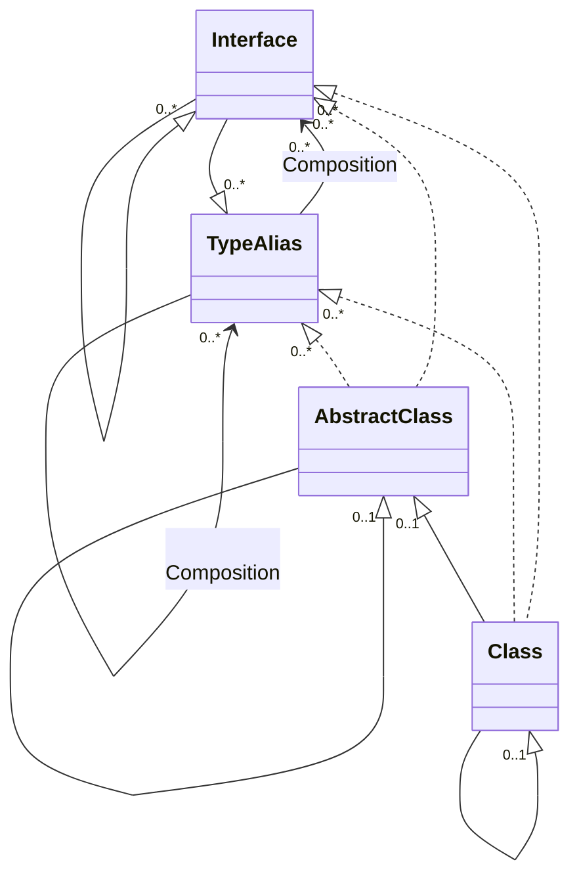
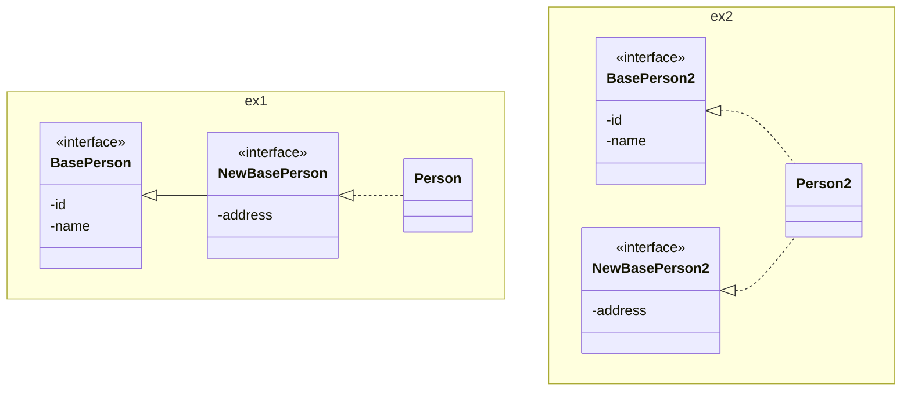
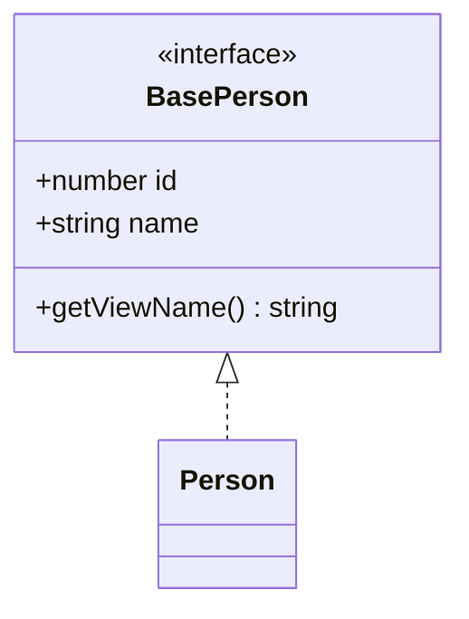
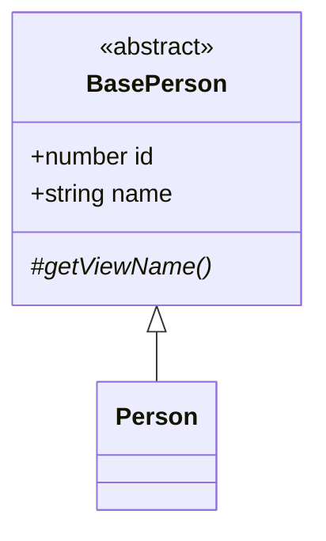

## Introduction

This time, we will explain interfaces and classes, which are familiar in object-oriented programming.

|Name|JavaScript|TypeScript|Java|Usage|
|---|---|---|---|---|
|Interface|-|interface|interface|Used to define the structure of an object|
|Type Alias|-|type|≒interface|Used to give an alias to an existing type|
|Class|class|class|class|Used to define the entity of an object|



## interface

Used when you want to define the shape of an object or the specification of a class.
* Interfaces can inherit from each other. Type aliases can also be inherited.
* Redeclaration possible: You can declare interfaces with the same name.
* When converted to JavaScript, interfaces have no entity, so they cannot be compared with `instanceof`.

### Declaring an Interface

The syntax and definition example of an interface are as follows.

```ts: Syntax
/**
 * _Interface Name_ : The name of the interface
 * _readonly_       :(Optional) Specify if you want to make it read-only.
 * _Attribute Name_ : Attribute name
 * _Attribute Type_ : Type of the attribute
 * _Method Name_    : Behavior
 * _Arguments_      :(Optional) Set if it has arguments. If specifying multiple, separate with `,`.
 * _Return Type_    : Type of the return value
 */
interface _Interface Name_ {
  _readonly_ _Attribute Name_: _Attribute Type_;
  _Method Name_(_Arguments_): _Return Type_;
}
```
* The semicolon at the end of the sentence can also be defined with a comma.
* Behavior can also be defined with an arrow function.

```ts: Definition Example
interface BasePerson {
  id: number;
  _name: string;
  readonly secret: string; //*1
  comment?: string; //string or undefined *2
  getViewName(): string;
  updateName(name: string): void;
  updateComment: (comment: string) => void; //*3

  //*4
  get name(): string;
  set name(name: string);
}

//*5
interface BasePerson_comma {
  id: number,
  name: string,
}
```
* 1: Read-only
* 2: Arguments specified with `?` (optional arguments) allow undefined.
* 3: Behavior specification defined with an arrow function
* 4: Accessor specification defined with shorthand
* 5: Example written with a comma at the end

:::info
**Differences between TypeScript and Java**
* TypeScript: 
  * Attribute specifications can be defined.
  * When transpiled to JavaScript, the interface has no entity, so it cannot be type-checked with `instanceof`. Use type guards if type checking is necessary.
* Java: 
  * Attribute specifications cannot be defined. Define accessor specifications as a substitute.
  * `instanceof` can be used for type checking of interfaces.
:::

### Defining Constructor Signatures

You can define constructor signatures in an interface.  
There may be scenes where it can be utilized by combining with generics or [index signatures](/typescript-intro/introduction-to-typescript-for-java-engineer_special-type#index-signature).

```ts: TypeScript
interface BasePerson {
  id: number;
  name: string;
}

class Person implements BasePerson {
  id: number;
  name: string;
  constructor(id: number, name: string) { this.id = id; this.name = name; }
}

interface PersonConstructor {
  new(id: number, name: string): BasePerson;
}

const person1: PersonConstructor = Person;
const person2 = new person1(1, "suzuki");
```

```java: How it would be in Java
// There is no corresponding feature.
```
You can achieve similar functionality by using the Factory Method pattern.

### Redeclaring an Interface

This is a mechanism to redefine an interface with the same name and merge the interfaces.  
* Consistency between interfaces must be maintained.
* The interface to be redefined must be within the same scope (if the scope is different, it is treated as a different entity).

```ts: TypeScript
interface BasePerson {
  id: number;
  name: string;
  getViewName(): string;
}

interface BasePerson {
  address: string,
}

interface BasePerson {
  // address: number, //*1
}

class Person1 implements BasePerson {
  id: number;
  name: string;
  address: string;  //*2
  getViewName = () => "hoge";

  constructor(id: number, name: string, address: string) {
    this.id = id;
    this.name = name;
    this.address = address;
  }
}
```
* 1: Such a declaration is not possible because consistency between interfaces is not maintained.
* 2: Attributes defined in the redeclaration are added.

```java: How it would be in Java
// There is no corresponding feature.
```
You can express similar functionality by allowing inheritance relationships in interfaces or implementing additional specifications in separate interfaces.



:::info
**Differences between TypeScript and Java**
* TypeScript: You can declare interfaces with the same name within the same scope.
* Java: You cannot declare interfaces with the same name within the same scope. It is possible if you separate the scope by dividing packages.
:::

:::check
**When to use interface redeclaration**
* It is a convenient feature depending on how you use it, but it is a feature prone to bugs, so its use should be limited.
  * It can be effectively utilized when you want to make changes to interfaces that cannot be directly changed (or are difficult to change), such as external systems, legacy systems, or libraries.
  * If it can be directly changed in your domain, it is recommended not to use it easily.
:::

### Inheriting Interfaces

An example of inheriting an interface is as follows.  
The way to implement it is the same as in Java.

```ts: TypeScript
interface BasePerson0 {
  id: number;
  name: string;
  getViewName(): string;
}
interface BasePerson extends BasePerson0 {
  address: string;
}
```

```java: How it would be in Java
interface BasePerson0 {
  int getId();
  void setId(int id);
  String getName();
  void setName(String name);
  String getViewName();
}
interface BasePerson extends BasePerson0 {
  String getAddress();
  void setAddress(String address);
}
```
* Attributes cannot be defined in interfaces, so accessor specifications are defined as a substitute.

## type (Type Alias)

Refers to a mechanism used when you want to give an alias to an existing type.  
* Type aliases cannot inherit from each other, but you can achieve similar functionality with [intersection types](/typescript-intro/introduction-to-typescript-for-java-engineer_special-type#intersection). Interfaces can also be composed with intersections.

### Declaring a Type Alias

The syntax and definition example of a type alias are as follows.

```ts: Syntax
/**
 * _Type Alias Name_ : The name of the type alias
 * _readonly_        :(Optional) Specify if you want to make it read-only.
 * _Attribute Name_  : Attribute name
 * _Attribute Type_  : Type of the attribute
 * _Method Name_     : Behavior
 * _Arguments_       :(Optional) Set if it has arguments. If specifying multiple, separate with `,`.
 * _Return Type_     : Type of the return value
 */

type _Type Alias Name_ = _Attribute Type_; // When giving an alias to a type
type _Type Alias Name_ = _(_Arguments_) => _Return Type_; // When giving an alias to a function
type _Type Alias Name_ = { // When giving an alias to a type with a structure
  _readonly_ _Attribute Name_: _Attribute Type_,
  _Method Name_(_Arguments_): _Return Type_,
};
```
* If the type or method specified is singular, braces are not needed.
* If specifying multiple, the delimiter can also be defined with a semicolon.
* Methods can also be defined with arrow functions.

```ts: Definition Example
type NumberType = number | null; //number or null *1
let num: NumberType = 1;

type TrafficLight = "red" | "yellow" | "blue"; //"red" or "yellow" or "blue" *1
const trafficLight: TrafficLight = "red";

type CallbackFn = (arg1: number, arg2: number) => boolean; //*2
const callbackFn: CallbackFn = (x: number, y: number) => x > y;

//*3
type Name = {
  lastNameKana: string, firstNameKana: string,
  lastName: string | null, firstName: string | null,
  readonly secret: string,
  getViewNameKana(suffix: string): string,
  compareXy1: (x: number, y: number) => boolean, //*4
  compareXy2: (x: number, y: number) => boolean, //*4
};
let name: Name = {
  lastNameKana: "suzuki", firstNameKana: "taro",
  lastName: "鈴木", firstName: "太郎",
  secret: "pass",
  getViewNameKana(suffix: string) {
    return `${this.lastNameKana} ${this.firstNameKana}${suffix}`;
  },
  //*5
  compareXy1: (x, y) => {
    // this.firstName;
    return x > y;
  },
  //*6
  compareXy2(x, y) {
    this.firstName; //this can be referenced
    return x > y;
  },
};

//*7
type Name_comma = {
  lastName: string;
  firstName: string;
};
```
* 1: Example of giving an alias to a type
* 2: Example of giving an alias to a function
* 3: Example of giving an alias to a type with a structure
* 4: This is not a method but an attribute. Handling changes depending on how the instance is created.
* 5: Defined as an arrow function, `this` is fixed to the outer scope. Therefore, `this` cannot reference `name`.
* 6: Defined directly as a function, recognized as an attribute but behaves as an instance method. Therefore, `this` can reference `name`.
* 7: Example written with a semicolon as a delimiter

### Defining Constructor Signatures

Similar to interfaces, you can define constructor signatures with type aliases.  

```ts: TypeScript
type BasePerson = {id: number, name: string};

type PersonConstructor = {new(id: number, name: string): BasePerson};

class Person implements BasePerson {
  id: number;
  name: string;
  constructor(id: number, name: string) { this.id = id; this.name = name; }
}

const person1: PersonConstructor = Person;
const person2 = new person1(1, "suzuki");
```

```java: How it would be in Java
// There is no corresponding feature.
```
You can achieve similar functionality by using the Factory Method pattern.

### Composing Type Aliases

Type aliases cannot have inheritance relationships.  
You can compose them with intersection types, so let's check the implementation example.

```ts: TypeScript
type Person1 = { id: number, name: string };
type Person2 = { address: string, birthDate: string };

type Person = Person1 & Person2; // { id: number; name: string; address: string; birthDate: string; }
let person: Person = { id: 1, name: "suzuki", address: "tokyo", birthDate: "2000-01-01" };
```

```java: How it would be in Java
// There is no corresponding feature.
```
You can express similar functionality by allowing inheritance relationships in interfaces or implementing additional specifications in separate interfaces.  
The implementation image is the same as "Redeclaring an Interface" so it is omitted.

### Appendix: Defining Type Aliases with Utility Types

By using utility types, you can define type aliases without mass-producing similar definitions.  
There seem to be many scenes where it can be utilized, such as when you want to create a request object for an API.  
Although convenient, it is a good strategy to avoid overuse as it can become difficult to understand when combined too much.  
```ts: TypeScript
type Person = { id: number, name: string, address: string, birthDate: string };

type PersonRequest = Omit<Person, "id">; // { name: string; address: string; birthDate: string; } *1
type PartialPerson = Pick<Person, "id" | "name">; // { id:string; name: string; } *2
type OptionalPerson = Partial<Person>; // { id?:string; name?: string; address?: string; birthDate?: string; } *3
type ReadonlyPerson = Readonly<Person>; // { readonly id: number; readonly name: string; readonly address: string; readonly birthDate: string; } *4
type RequiredPerson = Required<OptionalPerson>; // { id:string; name: string; address: string; birthDate: string; } *5
```
* 1: Exclude some attributes
* 2: Pick some attributes
* 3: Make all attributes optional
* 4: Make all attributes read-only
* 5: Make all attributes required

:::check
**How should interfaces and type aliases be used differently?**
Since both can do similar things, you need to establish a design policy to use them differently.  
Below is one suggestion for differentiation.
* Basic Policy
  * Choose the method that can adopt a structure that matches the model (do not easily substitute composition for things with inheritance relationships, etc.)
  * If component definitions based on design methodologies such as DDD are established, decide which to choose for each component
  * If in doubt, decide in advance which to lean towards
* Interface
  * Define the structure of an object
  * Define types with inheritance relationships
  * Define types to be published as extension points
* Type Alias
  * Give an alias to an existing type
  * Use union types or intersection types to define types
  * Define function types
:::

## class

Used when you want to define the entity of an object.
* Interfaces and type aliases can be implemented
* Abstract classes can define abstract methods
* Classes can inherit from each other

### Declaring a Class

The syntax and definition example of a class are as follows.

```ts: Syntax
/**
 * _abstract_     :(Optional) Specify if it is an abstract class or abstract method.
 * _Class Name_   : The name of the class
 * _Access Modifier_:(Optional) Set if you want to set the scope. (public, protected, private. If unspecified, it is treated as public)
 * _static_       :(Optional) Specify if it is a class method or class variable.
 * _readonly_     :(Optional) Specify if you want to make it read-only.
 * _Attribute Name_: Attribute name
 * _Attribute Type_:(Optional) Type of the attribute
 * _Assigned Value_:(Optional) Set if initial value setting is necessary. Referred to as "right-hand side" in the text.
 * _Method Name_  : Behavior
 * _Arguments_    :(Optional) Set if it has arguments. If specifying multiple, separate with `,`.
 * _Return Type_  :(Optional) Set if you want to explicitly specify the return type.
 */
_abstract_ class _Class Name_ {
  _Access Modifier_ _static_ _readonly_ _Attribute Name_: _Attribute Type_ = _Assigned Value_; //Attribute

  constructor(_Arguments_) {/** Optional processing. */}

  _Access Modifier_ _abstract_ _Method Name_(_Arguments_): _Return Type_; //Abstract method
  _Access Modifier_ _static_ _Method Name_(_Arguments_): _Return Type_ {/** Optional processing. */}; //Method
}
```
* Methods can also be defined with arrow functions.

```ts: Definition Example
abstract class BasePerson {
  /**
   * Change address.
   * @param address Address
   */
  abstract editAddress(address: string): void;

  /**
   * Get a formatted name for display.
   * @returns Name for display
   */
  abstract getViewName: () => string;
}

class Person extends BasePerson {
  /** ID. */
  id: number | null = null;
  /** Name. */
  name: string;
  /** Address. */
  address: string;
  /** Read-only attribute. */
  readonly secret: string;

  /**
   * Constructor.
   * @param name Name
   * @param address Address
   * @param secret Read-only attribute
   */
  constructor(name: string, address: string, secret: string) {
    super();
    this.name = name;
    this.address = address;
    this.secret = secret;
  }

  editAddress(address: string): void { this.address = address; }

  getViewName = () => { return `${this.name}様`; };
}
```
:::info
**Differences between TypeScript and Java**
* TypeScript:
  * Access modifiers cannot be set on classes
  * Type aliases can be implemented
* Java:
 ,* Java:
  * Access modifiers can be set on classes

**In JavaScript**
* Interfaces and type aliases cannot be used
* Abstract classes and abstract methods cannot be defined
:::

### Declaring a Class with Shorthand

Attributes can be automatically defined by adding access modifiers to the constructor parameters.  
Accessors can be defined using the `get`/`set` keywords.

```ts: TypeScript
class Person {
  constructor(private _id: number, private _name: string, _address: string) {
    this._id = _id;
    this._name = _name;
    // this._address = _address; //*1
  }
  get id(): number {
    return this._id;
  }
  set id(id: number) {
    this._id = id;
  }
}
let person = new Person(1, "suzuki", "tokyo"); //{1, suzuki, tokyo}
// person._id; //*2
// person._name; //*2
person.id;
person.id = 2; //{2, suzuki, tokyo}
```
* 1: No access modifier, so not recognized as an attribute, resulting in an error
* 2: Out of scope, so cannot be referenced

### Implementing Interfaces

Interfaces are implemented by abstract classes or classes.  
The way to implement them is the same as in Java.  
Implementation by abstract classes is omitted as the content does not change.



```ts: TypeScript
// Interface
interface BasePerson {
  id: number;
  name: string;
  getViewName(): string;
}

// Implemented by class
class Person implements BasePerson {
  id: number;
  name: string;
  getViewName(): string { return `${this.name}様`; }

  constructor(id: number, name: string) {
    this.id = id;
    this.name = name;
  }
}
```

```java: How it would be in Java
// Interface
interface BasePerson {
  void setId(Long id);
  Long getId();
  void setName(String name);
  String getViewName();
}

// Implemented by class
@AllArgsConstructor
@Getter
@Setter
class Person implements BasePerson {
  private Long id;
  private String name;

  public String getViewName() {
    return "%s様".formatted(this.name);
  }
}
```

### Class Inheritance

Inheritance can be performed in combinations of `Abstract Class <- Abstract Class`, `Abstract Class <- Class`, and `Class <- Class`.  
The way to implement it is the same as in Java.
The code example shows `Abstract Class <- Class`. Other cases are omitted as the implementation does not change.



```ts: TypeScript
// Abstract class
abstract class BasePerson {
  id: number;
  name: string;
  constructor(id: number, name: string) {
    this.id = id;
    this.name = name;
  }
  // Abstract method
  protected abstract getViewName(): string;
}

// Inherit abstract class
class Person extends BasePerson {
  constructor(id: number, name: string) {
    super(id, name);
  }
  protected getViewName(): string {
    return `${this.name}様`;
  }
}
```

```java: How it would be in Java
// Abstract class
@AllArgsConstructor
@Getter
@Setter
abstract class BasePerson {
  private Long id;
  private String name;

  // Abstract method
  protected abstract String getViewName();
}

// Inherit abstract class
class Person extends BasePerson {
  public Person(Long id, String name) {
    super(id, name);
  }

  protected String getViewName() {
    return "%s様".formatted(getName());
  }
}
```

### Checking Scope

Let's check the scope of attributes and behaviors. 

|Access Modifier|Accessible Range (TypeScript)|Accessible Range (Java)| 
|---|---|---|
|public|Accessible from anywhere|Same as left|
|protected|Only within the same class and subclasses|Only within the same package and subclasses|
|Unspecified|Treated as public, so the scope is the same as public|Package private: Only within the same package|
|private|Only within the same class|Same as left|

The code example includes the following verification content.
```mermaid
classDiagram
  class Person {
    +doStaticPub()$
    #doStaticPro()$
    +doStaticNoDef()$
    -doStaticPri()$
    +doStaticMethod()$

    +doPub()
    #doPro()
    +doNoDef()
    -doPri()
    +doInstanceMethod()
  }
  Person <-- Caller: Access from outside the class
  Person <-- Person's instance: Access from the instance
  Person <|-- Employee
  Person <-- Employee: Access from the subclass
```

```ts: TypeScript
class Person {
  // Class variables
  public static attrStaticPub = 1;
  protected static attrStaticPro = 1;
  static attrStaticNoDef = 1;
  private static attrStaticPri = 1;

  // Member variables
  public attrPub = 1;
  protected attrPro = 1;
  attrNoDef = 1;
  private attrPri = 1;

  // Class methods
  public static doStaticPub() {}
  protected static doStaticPro() {}
  static doStaticNoDef() {}
  private static doStaticPri() {}

  // Member methods
  public doPub() {}
  protected doPro() {}
  doNoDef() {}
  private doPri() {}

  constructor(attrPub: number, attrPro: number, attrNoDef: number, attrPri: number) {
    this.attrPub = attrPub; this.attrPro = attrPro; this.attrNoDef = attrNoDef; this.attrPri = attrPri;
  }
}

/** Subclass. **/
class Employee extends Person {
  //*****Access from within the subclass
  doMethod() {
    Person.attrStaticPub;
    Person.attrStaticPro;
    Person.attrStaticNoDef;
    // Person.attrStaticPri; //*1

    this.attrPub;
    this.attrPro;
    this.attrNoDef;
    // this.attrPri; //*1

    Person.doStaticPub();
    Person.doStaticPro();
    Person.doStaticNoDef();
    // Person.doStaticPri(); //*1

    this.doPub();
    this.doPro();
    this.doNoDef();
    // this.doPri(); //*1
  }
}

const caller = () => {
  //****Access from outside the class
  Person.attrStaticPub;
  // Person.attrStaticPro; //*1
  Person.attrStaticNoDef;
  // Person.attrStaticPri; //*1

  Person.doStaticPub();
  // Person.doStaticPro(); //*1
  Person.doStaticNoDef();
  // Person.doStaticPri(); //*1

  //****Access from the instance
  let person = new Person(1, 2, 3, 4);

  person.attrPub;
  // person.attrPro; //*2
  person.attrNoDef;
  // person.attrPri; //*1

  person.doPub();
  // person.doPro(); //*2
  person.doNoDef();
  // person.doPri(); //*1
}
```
* 1: Cannot be accessed because it is out of scope
* 2: Protected cannot be called from the instance

```java: How it would be in Java
// The range of protected is different, so the package is divided.

//package example.person;
@AllArgsConstructor
public class Person {
  // Class variables
  public static int attrStaticPub = 1;
  protected static int attrStaticPro = 1;
  public static int attrStaticNoDef = 1;
  private static int attrStaticPri = 1;

  // Member variables
  public int attrPub = 1;
  protected int attrPro = 1;
  public int attrNoDef = 1;
  private int attrPri = 1;

  // Class methods
  public static void doStaticPub() {}
  protected static void doStaticPro() {}
  public static void doStaticNoDef() {}
  private static void doStaticPri() {}

  // Member methods
  public void doPub() {}
  protected void doPro() {}
  public void doNoDef() {}
  private void doPri() {}
}

//package example.employee;
/** Subclass. */
public class Employee extends Person {

  public Employee(int attrPub, int attrPro, int attrNoDef, int attrPri) {
    super(attrPub, attrPro, attrNoDef, attrPri);
  }

  //*****Access from within the subclass
  void doMethod() {
    System.out.println(Person.attrStaticPub);
    System.out.println(Person.attrStaticPro);
    System.out.println(Person.attrStaticNoDef);
    // System.out.println(Person.attrStaticPri); // *1

    System.out.println(this.attrPub);
    System.out.println(this.attrPro);
    System.out.println(this.attrNoDef);
    // System.out.println(this.attrPri); // *1

    Person.doStaticPub();
    Person.doStaticPro();
    Person.doStaticNoDef();
    // Person.doStaticPri(); // *1

    this.doPub();
    this.doPro();
    this.doNoDef();
    // this.doPri(); //*1
  }
}

//package example.caller;
public class Caller {
  public void callPerson() {
    //****Access from outside the class
    System.out.println(Person.attrStaticPub);
    // System.out.println(Person.attrStaticPro); // *1
    System.out.println(Person.attrStaticNoDef);
    // System.out.println(Person.attrStaticPri); // *1

    Person.doStaticPub();
    // Person.doStaticPro(); // *1
    Person.doStaticNoDef();
    // Person.doStaticPri(); //*1

    //****Access from the instance
    var person = new Person(1, 2, 3, 4);

    System.out.println(person.attrPub);
    // System.out.println(person.attrPro); // *2
    System.out.println(person.attrNoDef);
    // System.out.println(person.attrPri); // *1

    person.doPub();
    // person.doPro(); // *2
    person.doNoDef();
    // person.doPri(); //*1
  }
}
```
* 1: Cannot be accessed because it is out of scope
* 2: Protected cannot be called from the instance

:::info
**Differences between TypeScript and Java**
* TypeScript
  * If the scope is unspecified, it is treated as public
  * Range of protected: Accessible only within the same class and subclasses
* Java
  * If the scope is unspecified, it becomes package private
  * Range of protected: Accessible only within the same package and subclasses
:::


