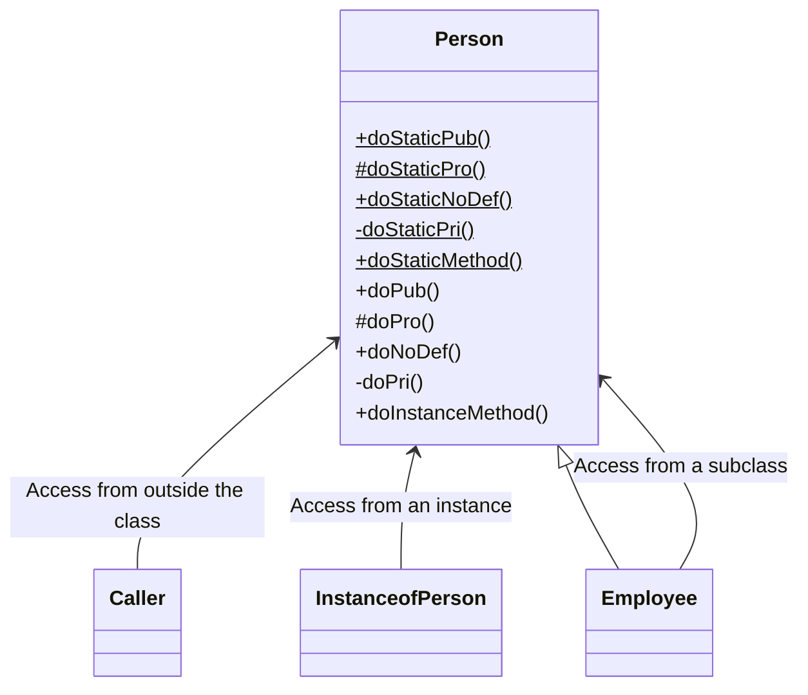

## Introduction

This time, we will explain interfaces and classes, which are familiar in object-oriented programming.

|Name|JavaScript|TypeScript|Java|Usage|
|---|---|---|---|---|
|Interface|-|interface|interface|Used to define the structure of an object|
|Type Alias|-|type|≒interface|Used to give an existing type a different name|
|Class|class|class|class|Used to define the entity of an object|


## interface

Used when you want to define the shape of an object or the specifications of a class.
* Interfaces can inherit from each other. Type aliases can also be inherited.
* Redeclarable: You can declare an interface with the same name.
* When converted to JavaScript, interfaces have no entity, so they cannot be compared with `instanceof`, etc.

### Declaring an Interface

Below are the syntax and definition examples for interfaces.

```ts: Syntax
/**
 * _InterfaceName_: The name of the interface
 * _readonly_     : (Optional) Specify if you want to make it read-only.
 * _AttributeName_: Attribute name
 * _AttributeType_: Attribute type
 * _MethodName_   : Behavior
 * _Arguments_    : (Optional) Set if it has arguments. If specifying multiple, separate them with `,`.
 * _ReturnType_   : Return type
 */
interface _InterfaceName_ {
  _readonly_ _AttributeName_: _AttributeType_;
  _MethodName_(_Arguments_): _ReturnType_;
}
```
* Semicolons at the end of statements can also be defined with commas.
* Behaviors can also be defined with arrow functions.

```ts: Definition Example
interface BasePerson {
  id: number;
  _name: string;
  readonly secret: string; //*1
  comment?: string; //string or undefined *2
  getViewName(): string;
  updateName(name: string): void;
  updateComment: (comment: string) => void; //*3

  //*4
  get name(): string;
  set name(name: string);
}

//*5
interface BasePerson_comma {
  id: number,
  name: string,
}
```
* 1: Read-only
* 2: Arguments specified with `?` (optional arguments) allow undefined.
* 3: Behavior specification defined with an arrow function
* 4: Accessor specification defined with shorthand
* 5: Example written with commas at the end of statements

:::info
**Differences between TypeScript and Java**
* TypeScript: 
  * Attribute specifications can be defined.
  * When transpiled to JavaScript, interfaces have no entity, so type checking cannot be done with `instanceof`. Use type guards if type checking is necessary.
* Java: 
  * Attribute specifications cannot be defined. Define accessor specifications as a substitute.
  * `instanceof` can be used for type checking of interfaces.
:::

### Defining Constructor Signatures

You can define constructor signatures in interfaces.  
There may be scenes where it can be utilized in combination with generics or [index signatures](/en/typescript-intro/introduction-to-typescript-for-java-engineer_special-type#index-signature).

```ts: TypeScript
interface BasePerson {
  id: number;
  name: string;
}

class Person implements BasePerson {
  id: number;
  name: string;
  constructor(id: number, name: string) { this.id = id; this.name = name; }
}

interface PersonConstructor {
  new(id: number, name: string): BasePerson;
}

const person1: PersonConstructor = Person;
const person2 = new person1(1, "suzuki");
```

```java: What happens in Java
// There is no corresponding feature.
```
You can achieve similar functionality by using patterns like the Factory method.

### Redeclaring Interfaces

This is the mechanism to redefine an interface with the same name and merge interfaces.  
* Consistency between interfaces must be maintained.
* The interface being redefined must be in the same scope (if in a different scope, it will be treated as a different entity).

```ts: TypeScript
interface BasePerson {
  id: number;
  name: string;
  getViewName(): string;
}

interface BasePerson {
  address: string,
}

interface BasePerson {
  // address: number, //*1
}

class Person1 implements BasePerson {
  id: number;
  name: string;
  address: string;  //*2
  getViewName = () => "hoge";

  constructor(id: number, name: string, address: string) {
    this.id = id;
    this.name = name;
    this.address = address;
  }
}
```
* 1: Such a declaration cannot be made because consistency between interfaces is not maintained.
* 2: Attributes defined by redeclaration are added.

```java: What happens in Java
// There is no corresponding feature.
```
You can express similar functionality by adding specifications to interfaces with inheritance relationships or implementing additional specifications as separate interfaces.


:::info
**Differences between TypeScript and Java**
* TypeScript: You can declare interfaces with the same name within the same scope.
* Java: You cannot declare interfaces with the same name within the same scope. It is possible if you separate the scope by dividing packages, etc.
:::

:::check
**When to use interface redeclaration**
* While it can be a convenient feature depending on how you use it, it's a feature prone to bugs, so its use should be limited.
  * It can be effectively utilized when you want to make changes to interfaces that cannot be directly changed (or are difficult to change), such as external systems, legacy systems, or libraries.
  * If direct changes are possible, such as in your own domain, it is recommended not to use it easily.
:::

### Inheritance of Interfaces

Below is an example of interface inheritance.  
The way to implement it is the same as in Java.

```ts: TypeScript
interface BasePerson0 {
  id: number;
  name: string;
  getViewName(): string;
}
interface BasePerson extends BasePerson0 {
  address: string;
}
```

```java: What happens in Java
interface BasePerson0 {
  int getId();
  void setId(int id);
  String getName();
  void setName(String name);
  String getViewName();
}
interface BasePerson extends BasePerson0 {
  String getAddress();
  void setAddress(String address);
}
```
* Since attributes cannot be defined in interfaces, accessor specifications are defined as a substitute.

## type (Type Alias)

This refers to the mechanism used when you want to give an existing type a different name.  
* Type aliases cannot inherit from each other, but you can achieve similar functionality with [intersection types](/en/typescript-intro/introduction-to-typescript-for-java-engineer_special-type#intersection). Interfaces can also be composed with intersections.

### Declaring a Type Alias

Below are the syntax and definition examples for type aliases.

```ts: Syntax
/**
 * _TypeAliasName_: The name of the type alias
 * _readonly_     : (Optional) Specify if you want to make it read-only.
 * _AttributeName_: Attribute name
 * _AttributeType_: Attribute type
 * _MethodName_   : Behavior
 * _Arguments_    : (Optional) Set if it has arguments. If specifying multiple, separate them with `,`.
 * _ReturnType_   : Return type
 */

type _TypeAliasName_ = _AttributeType_; // When giving a type a different name
type _TypeAliasName_ = _(_Arguments_) => _ReturnType_; // When giving a function a different name
type _TypeAliasName_ = { // When giving a structured type a different name
  _readonly_ _AttributeName_: _AttributeType_,
  _MethodName_(_Arguments_): _ReturnType_,
};
```
* If the specified type or method is singular, curly braces are not needed.
* If specifying multiple, the delimiter can also be defined with semicolons.
* Methods can also be defined with arrow functions.

```ts: Definition Example
type NumberType = number | null; //number or null *1
let num: NumberType = 1;

type TrafficLight = "red" | "yellow" | "blue"; //"red" or "yellow" or "blue" *1
const trafficLight: TrafficLight = "red";

type CallbackFn = (arg1: number, arg2: number) => boolean; //*2
const callbackFn: CallbackFn = (x: number, y: number) => x > y;

//*3
type Name = {
  lastNameKana: string, firstNameKana: string,
  lastName: string | null, firstName: string | null,
  readonly secret: string,
  getViewNameKana(suffix: string): string,
  compareXy1: (x: number, y: number) => boolean, //*4
  compareXy2: (x: number, y: number) => boolean, //*4
};
let name: Name = {
  lastNameKana: "suzuki", firstNameKana: "taro",
  lastName: "鈴木", firstName: "太郎",
  secret: "pass",
  getViewNameKana(suffix: string) {
    return `${this.lastNameKana} ${this.firstNameKana}${suffix}`;
  },
  //*5
  compareXy1: (x, y) => {
    // this.firstName;
    return x > y;
  },
  //*6
  compareXy2(x, y) {
    this.firstName; //this can be referenced
    return x > y;
  },
};

//*7
type Name_comma = {
  lastName: string;
  firstName: string;
};
```
* 1: Example of giving a type a different name
* 2: Example of giving a function a different name
* 3: Example of giving a structured type a different name
* 4: This is not a method but an attribute. It behaves differently depending on how the instance is created.
* 5: Defined as an arrow function, `this` is fixed to the outer scope. Therefore, `this` cannot reference `name`.
* 6: Defined as a direct function, it is recognized as an attribute but behaves as an instance method. Therefore, `this` can reference `name`.
* 7: Example written with semicolons as delimiters

### Defining Constructor Signatures

Like interfaces, constructor signatures can also be defined with type aliases.

```ts: TypeScript
type BasePerson = {id: number, name: string};

type PersonConstructor = {new(id: number, name: string): BasePerson};

class Person implements BasePerson {
  id: number;
  name: string;
  constructor(id: number, name: string) { this.id = id; this.name = name; }
}

const person1: PersonConstructor = Person;
const person2 = new person1(1, "suzuki");
```

```java: What happens in Java
// There is no corresponding feature.
```
You can achieve similar functionality by using patterns like the Factory method.

### Composing Type Aliases

Type aliases cannot have inheritance relationships.  
They can be composed with intersection types, so let's check the implementation example.

```ts: TypeScript
type Person1 = { id: number, name: string };
type Person2 = { address: string, birthDate: string };

type Person = Person1 & Person2; // { id: number; name: string; address: string; birthDate: string; }
let person: Person = { id: 1, name: "suzuki", address: "tokyo", birthDate: "2000-01-01" };
```

```java: What happens in Java
// There is no corresponding feature.
```
You can express similar functionality by adding specifications to interfaces with inheritance relationships or implementing additional specifications as separate interfaces.  
The implementation image is the same as "Redeclaring Interfaces", so it is omitted.

### Appendix: Example of Defining Type Aliases Using Utility Types

By using utility types, you can define type aliases without mass-producing similar definitions.  
There seem to be many scenes where this can be utilized, such as when creating request objects for APIs.  
Although convenient, it is a good strategy to avoid overuse as it can become difficult to understand if combined too much.  
```ts: TypeScript
type Person = { id: number, name: string, address: string, birthDate: string };

type PersonRequest = Omit<Person, "id">; // { name: string; address: string; birthDate: string; } *1
type PartialPerson = Pick<Person, "id" | "name">; // { id:string; name: string; } *2
type OptionalPerson = Partial<Person>; // { id?:string; name?: string; address?: string; birthDate?: string; } *3
type ReadonlyPerson = Readonly<Person>; // { readonly id: number; readonly name: string; readonly address: string; readonly birthDate: string; } *4
type RequiredPerson = Required<OptionalPerson>; // { id:string; name: string; address: string; birthDate: string; } *5
```
* 1: Exclude some attributes
* 2: Pick up some attributes
* 3: Make all attributes optional
* 4: Make all attributes read-only
* 5: Make all attributes required

:::check
**How should interfaces and type aliases be used differently?**
Since both can do similar things, it is necessary to set design policies and use them differently.  
Below is one suggestion for differentiation.
* Basic policy
  * Choose the method that can take the structure according to the model (e.g., do not easily substitute compositions for things with inheritance relationships)
  * If component definitions based on design methodologies like DDD are established, decide which to choose for each component
  * If unsure, decide in advance which to lean towards
* Interface
  * Define the structure of an object
  * Define types with inheritance relationships
  * Define types to be published as extension points
* Type Alias
  * Give an existing type a different name
  * Use union types, intersection types, etc., to define types
  * Define function types
:::

## class

Used when you want to define the entity of an object.
* Interfaces and type aliases can be implemented
* Abstract methods can be defined in abstract classes
* Classes can inherit from each other

### Declaring a Class

Below are the syntax and definition examples for classes.

```ts: Syntax
/**
 * _abstract_     : (Optional) Specify if it's an abstract class or abstract method.
 * _ClassName_    : The name of the class
 * _AccessModifier_: (Optional) Set if you want to specify the scope. (public, protected, private. If unspecified, it is treated as public)
 * _static_       : (Optional) Specify if it's a class method or class variable.
 * _readonly_     : (Optional) Specify if you want to make it read-only.
 * _AttributeName_: Attribute name
 * _AttributeType_: (Optional) Attribute type
 * _AssignedValue_: (Optional) Set if you need to set an initial value. Referred to as "right-hand side" in the text.
 * _MethodName_   : Behavior
 * _Arguments_    : (Optional) Set if it has arguments. If specifying multiple, separate them with `,`.
 * _ReturnType_   : (Optional) Set if you want to explicitly specify the return type.
 */
_abstract_ class _ClassName_ {
  _AccessModifier_ _static_ _readonly_ _AttributeName_: _AttributeType_ = _AssignedValue_; //Attribute

  constructor(_Arguments_) {/** Optional processing. */}

  _AccessModifier_ _abstract_ _MethodName_(_Arguments_): _ReturnType_; //Abstract method
  _AccessModifier_ _static_ _MethodName_(_Arguments_): _ReturnType_ {/** Optional processing. */}; //Method
}
```
* Methods can also be defined with arrow functions.

```ts: Definition Example
abstract class BasePerson {
  /**
   * Change address.
   * @param address Address
   */
  abstract editAddress(address: string): void;

  /**
   * Get the name formatted for display.
   * @returns Name for display
   */
  abstract getViewName: () => string;
}

class Person extends BasePerson {
  /** ID. */
  id: number | null = null;
  /** Name. */
  name: string;
  /** Address. */
  address: string;
  /** Read-only attribute. */
  readonly secret: string;

  /**
   * Constructor.
   * @param name Name
   * @param address Address
   * @param secret Read-only attribute
   */
  constructor(name: string, address: string, secret: string) {
    super();
    this.name = name;
    this.address = address;
    this.secret = secret;
  }

  editAddress(address: string): void { this.address = address; }

  getViewName = () => { return `${this.name}様`; };
}
```
:::info
**Differences between TypeScript and Java**
* TypeScript:
  * Access modifiers cannot be set for classes
  * Type aliases can be implemented
* Java:
  * Access modifiers can be set for classes

**In JavaScript**
* Interfaces and type aliases cannot,be used
* Abstract classes and abstract methods cannot be defined
:::

### Declaring a Class with Shorthand

Attributes can be automatically defined by adding access modifiers to the parameters of the constructor.  
Accessors can be defined with the `get`/`set` keywords.

```ts: TypeScript
class Person {
  constructor(private _id: number, private _name: string, _address: string) {
    this._id = _id;
    this._name = _name;
    // this._address = _address; //*1
  }
  get id(): number {
    return this._id;
  }
  set id(id: number) {
    this._id = id;
  }
}
let person = new Person(1, "suzuki", "tokyo"); //{1, suzuki, tokyo}
// person._id; //*2
// person._name; //*2
person.id;
person.id = 2; //{2, suzuki, tokyo}
```
* 1: Since it has no access modifier and is not recognized as an attribute, it results in an error.
* 2: It cannot be referenced as it is out of scope.

### Implementing Interfaces

Interfaces are implemented by abstract classes or classes.  
The implementation method is the same as in Java.  
The implementation with abstract classes is omitted as the content does not change.


```ts: TypeScript
// Interface
interface BasePerson {
  id: number;
  name: string;
  getViewName(): string;
}

// Implement with class
class Person implements BasePerson {
  id: number;
  name: string;
  getViewName(): string { return `${this.name}様`; }

  constructor(id: number, name: string) {
    this.id = id;
    this.name = name;
  }
}
```

```java: What happens in Java
// Interface
interface BasePerson {
  void setId(Long id);
  Long getId();
  void setName(String name);
  String getViewName();
}

// Implement with class
@AllArgsConstructor
@Getter
@Setter
class Person implements BasePerson {
  private Long id;
  private String name;

  public String getViewName() {
    return "%s様".formatted(this.name);
  }
}
```

### Class Inheritance

Inheritance can be performed with combinations of `abstract class<-abstract class`, `abstract class<-class`, and `class<-class`.  
The implementation method is the same as in Java.
The code example shows `abstract class<-class`. Other cases are omitted as the implementation does not change.


```ts: TypeScript
// Abstract class
abstract class BasePerson {
  id: number;
  name: string;
  constructor(id: number, name: string) {
    this.id = id;
    this.name = name;
  }
  // Abstract method
  protected abstract getViewName(): string;
}

// Inherit abstract class
class Person extends BasePerson {
  constructor(id: number, name: string) {
    super(id, name);
  }
  protected getViewName(): string {
    return `${this.name}様`;
  }
}
```

```java: What happens in Java
// Abstract class
@AllArgsConstructor
@Getter
@Setter
abstract class BasePerson {
  private Long id;
  private String name;

  // Abstract method
  protected abstract String getViewName();
}

// Inherit abstract class
class Person extends BasePerson {
  public Person(Long id, String name) {
    super(id, name);
  }

  protected String getViewName() {
    return "%s様".formatted(getName());
  }
}
```

### Checking Scope

Let's check the scope of attributes and behaviors.

|Access Modifier|Accessible Range (TypeScript)|Accessible Range (Java)| 
|---|---|---|
|public|Can be accessed from anywhere|Same as left|
|protected|Only within the same class and subclasses|Only within the same package and subclasses|
|Unspecified|Treated as public, so the scope is the same as public|package private: Only within the same package|
|private|Only within the same class|Same as left|

The code example includes the following verification content.


```ts: TypeScript
class Person {
  // Class variables
  public static attrStaticPub = 1;
  protected static attrStaticPro = 1;
  static attrStaticNoDef = 1;
  private static attrStaticPri = 1;

  // Member variables
  public attrPub = 1;
  protected attrPro = 1;
  attrNoDef = 1;
  private attrPri = 1;

  // Class methods
  public static doStaticPub() {}
  protected static doStaticPro() {}
  static doStaticNoDef() {}
  private static doStaticPri() {}

  // Member methods
  public doPub() {}
  protected doPro() {}
  doNoDef() {}
  private doPri() {}

  constructor(attrPub: number, attrPro: number, attrNoDef: number, attrPri: number) {
    this.attrPub = attrPub; this.attrPro = attrPro; this.attrNoDef = attrNoDef; this.attrPri = attrPri;
  }
}

/** Subclass. **/
class Employee extends Person {
  //***** Access from within the subclass
  doMethod() {
    Person.attrStaticPub;
    Person.attrStaticPro;
    Person.attrStaticNoDef;
    // Person.attrStaticPri; //*1

    this.attrPub;
    this.attrPro;
    this.attrNoDef;
    // this.attrPri; //*1

    Person.doStaticPub();
    Person.doStaticPro();
    Person.doStaticNoDef();
    // Person.doStaticPri(); //*1

    this.doPub();
    this.doPro();
    this.doNoDef();
    // this.doPri(); //*1
  }
}

const caller = () => {
  //**** Access from outside the class
  Person.attrStaticPub;
  // Person.attrStaticPro; //*1
  Person.attrStaticNoDef;
  // Person.attrStaticPri; //*1

  Person.doStaticPub();
  // Person.doStaticPro(); //*1
  Person.doStaticNoDef();
  // Person.doStaticPri(); //*1

  //**** Access from an instance
  let person = new Person(1, 2, 3, 4);

  person.attrPub;
  // person.attrPro; //*2
  person.attrNoDef;
  // person.attrPri; //*1

  person.doPub();
  // person.doPro(); //*2
  person.doNoDef();
  // person.doPri(); //*1
}
```
* 1: Cannot be accessed as it is out of scope
* 2: protected cannot be called from an instance

```java: What happens in Java
// The range of protected is different, so the package is divided.

//package example.person;
@AllArgsConstructor
public class Person {
  // Class variables
  public static int attrStaticPub = 1;
  protected static int attrStaticPro = 1;
  public static int attrStaticNoDef = 1;
  private static int attrStaticPri = 1;

  // Member variables
  public int attrPub = 1;
  protected int attrPro = 1;
  public int attrNoDef = 1;
  private int attrPri = 1;

  // Class methods
  public static void doStaticPub() {}
  protected static void doStaticPro() {}
  public static void doStaticNoDef() {}
  private static void doStaticPri() {}

  // Member methods
  public void doPub() {}
  protected void doPro() {}
  public void doNoDef() {}
  private void doPri() {}
}

//package example.employee;
/** Subclass. */
public class Employee extends Person {

  public Employee(int attrPub, int attrPro, int attrNoDef, int attrPri) {
    super(attrPub, attrPro, attrNoDef, attrPri);
  }

  //***** Access from within the subclass
  void doMethod() {
    System.out.println(Person.attrStaticPub);
    System.out.println(Person.attrStaticPro);
    System.out.println(Person.attrStaticNoDef);
    // System.out.println(Person.attrStaticPri); // *1

    System.out.println(this.attrPub);
    System.out.println(this.attrPro);
    System.out.println(this.attrNoDef);
    // System.out.println(this.attrPri); // *1

    Person.doStaticPub();
    Person.doStaticPro();
    Person.doStaticNoDef();
    // Person.doStaticPri(); // *1

    this.doPub();
    this.doPro();
    this.doNoDef();
    // this.doPri(); //*1
  }
}

//package example.caller;
public class Caller {
  public void callPerson() {
    //**** Access from outside the class
    System.out.println(Person.attrStaticPub);
    // System.out.println(Person.attrStaticPro); // *1
    System.out.println(Person.attrStaticNoDef);
    // System.out.println(Person.attrStaticPri); // *1

    Person.doStaticPub();
    // Person.doStaticPro(); // *1
    Person.doStaticNoDef();
    // Person.doStaticPri(); //*1

    //**** Access from an instance
    var person = new Person(1, 2, 3, 4);

    System.out.println(person.attrPub);
    // System.out.println(person.attrPro); // *2
    System.out.println(person.attrNoDef);
    // System.out.println(person.attrPri); // *1

    person.doPub();
    // person.doPro(); // *2
    person.doNoDef();
    // person.doPri(); //*1
  }
}
```
* 1: Cannot be accessed as it is out of scope
* 2: protected cannot be called from an instance

:::info
**Differences between TypeScript and Java**
* TypeScript
  * If the scope is unspecified, it is treated as public
  * Range of protected: Can only be accessed within the same class and subclasses
* Java
  * If the scope is unspecified, it becomes package private
  * Range of protected: Can only be accessed within the same package and subclasses
:::


