<https://mermaid.js.org/>

## フローチャート

```text
flowchart LR
   a --> b & c--> d
```
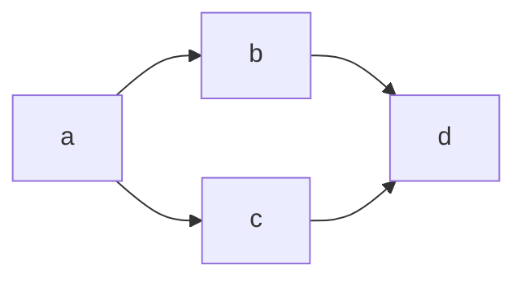

```text
flowchart TD
    A[Start] --> B{Is it?};
    B -->|Yes| C[OK];
    C --> D[Rethink];
    D --> B;
    B ---->|No| E[End];
```
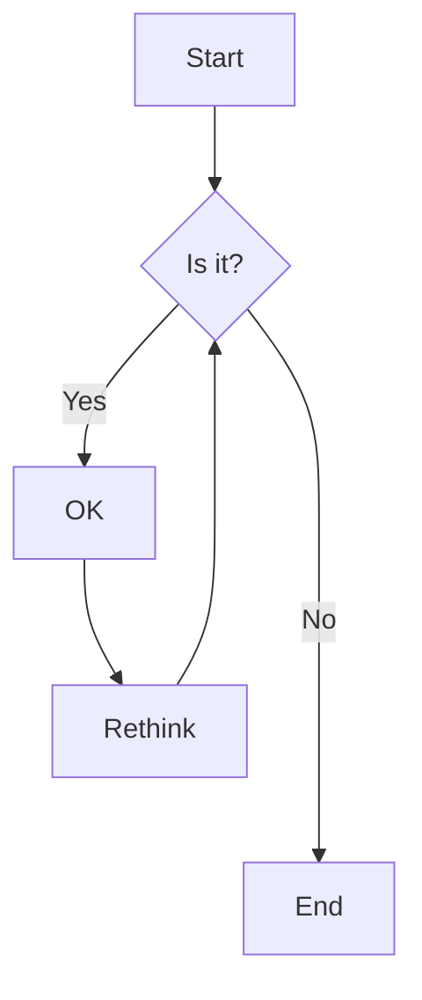

```text
flowchart TB
    c1-->a2
    subgraph one
    a1-->a2
    end
    subgraph two
    b1-->b2
    end
    subgraph three
    c1-->c2
    end
```
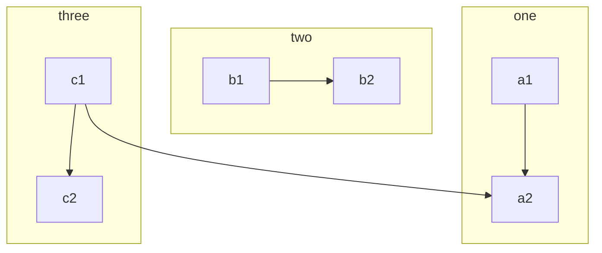

## シーケンス図

```text
sequenceDiagram
    Alice->>Bob: Hello Bob, how are you?
    alt is sick
        Bob->>Alice: Not so good :(
    else is well
        Bob->>Alice: Feeling fresh like a daisy
    end
    opt Extra response
        Bob->>Alice: Thanks for asking
    end
```
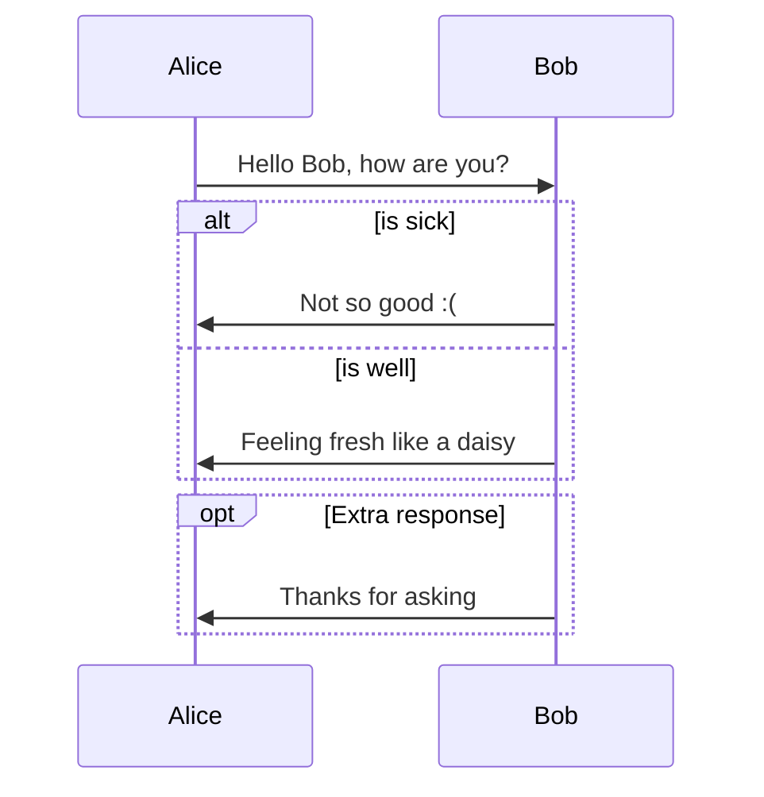

```text
sequenceDiagram
    autonumber
    Alice->>John: Hello John, how are you?
    loop Healthcheck
        John->>John: Fight against hypochondria
    end
    Note right of John: Rational thoughts!
    John-->>Alice: Great!
    John->>Bob: How about you?
    Bob-->>John: Jolly good!
```
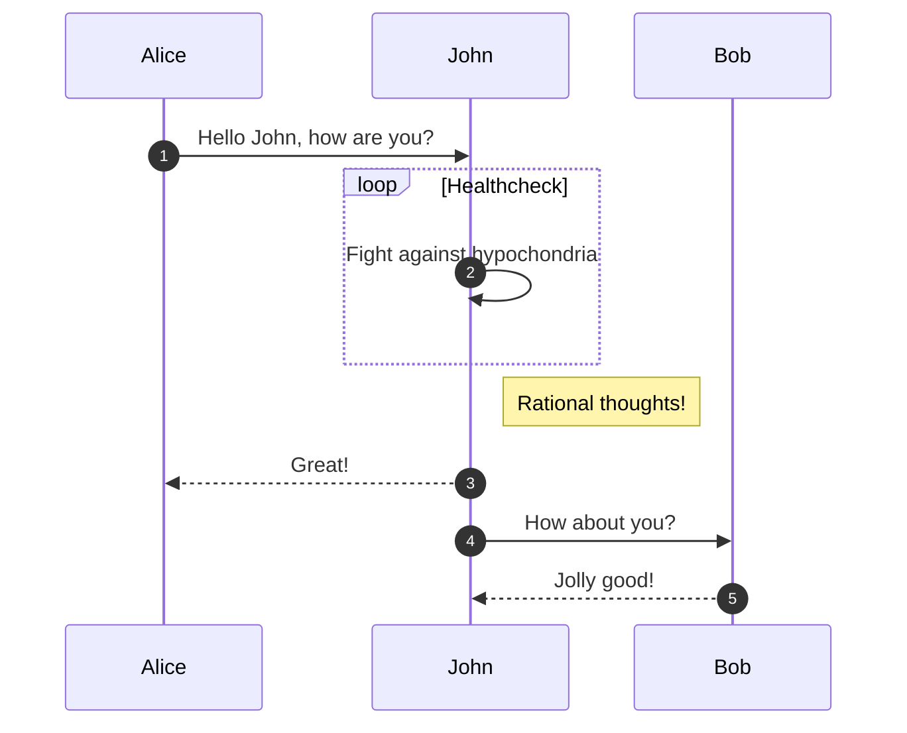

## クラス図
```text
classDiagram
    class BankAccount
    BankAccount : +String owner
    BankAccount : +Bigdecimal balance
    BankAccount : +deposit(amount)
    BankAccount : +withdrawl(amount)
```
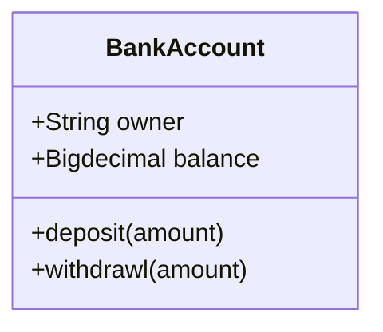

```text
 classDiagram
      Animal <|-- Duck
      Animal <|-- Fish
      Animal <|-- Zebra
      Animal : +int age
      Animal : +String gender
      Animal: +isMammal()
      Animal: +mate()
      class Duck{
          +String beakColor
          +swim()
          +quack()
      }
      class Fish{
          -int sizeInFeet
          -canEat()
      }
      class Zebra{
          +bool is_wild
          +run()
      }
```
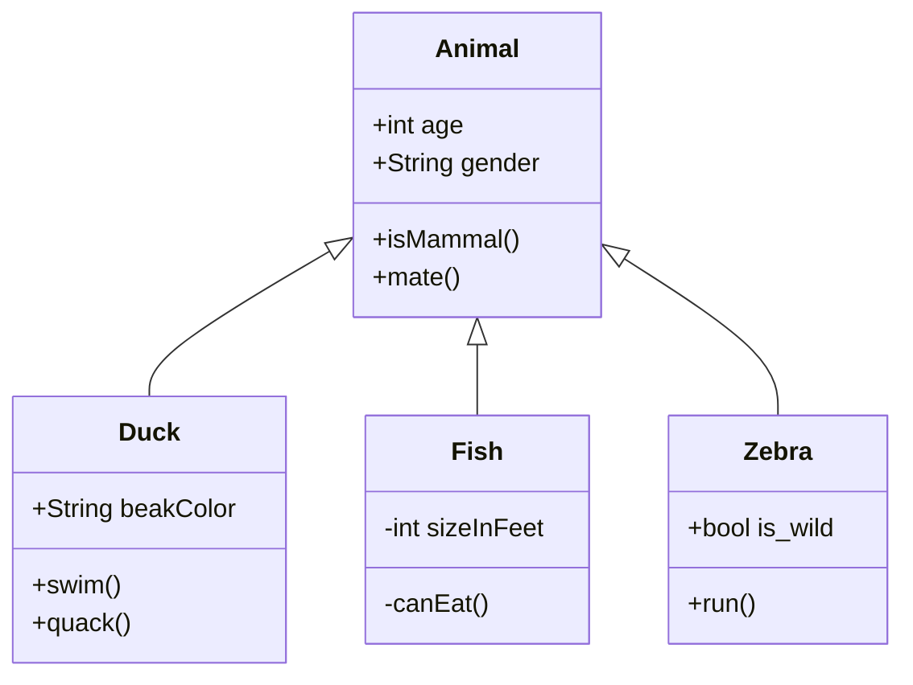

```text
classDiagram
classA <|-- classB
classC *-- classD
classE o-- classF
classG <-- classH
classI -- classJ
classK <.. classL
classM <|.. classN
classO .. classP
```
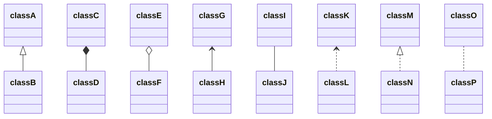

## 状態遷移図
```text
stateDiagram-v2
    [*] --> First
    First --> Second
    First --> Third

    state First {
        [*] --> fir
        fir --> [*]
    }
    state Second {
        [*] --> sec
        sec --> [*]
    }
    state Third {
        [*] --> thi
        thi --> [*]
    }
```
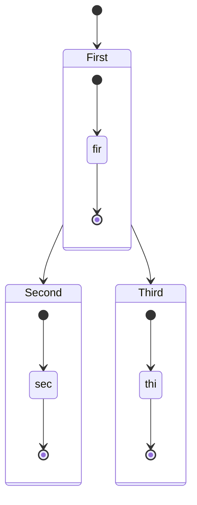

```text
stateDiagram-v2
    state if_state &lt;&lt;choice>>
    [*] --> IsPositive
    IsPositive --> if_state
    if_state --> False: if n < 0
    if_state --> True : if n >= 0
```
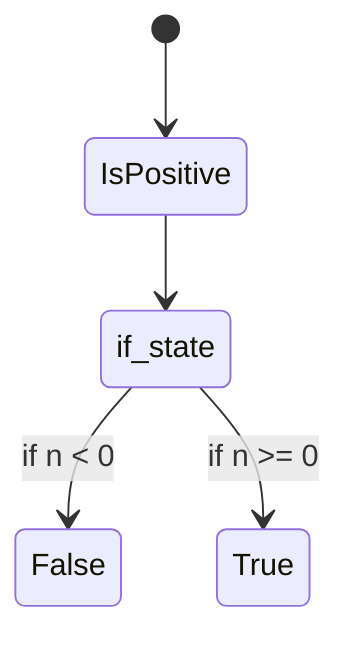

`<`は`&lt`でescapeしてあげる必要があります！

## ガントチャート

```text
gantt
    dateFormat  YYYY-MM-DD
    title       Adding GANTT diagram functionality to mermaid
    excludes    weekends
    %% (`excludes` accepts specific dates in YYYY-MM-DD format, days of the week ("sunday") or "weekends", but not the word "weekdays".)

    section A section
    Completed task            :done,    des1, 2014-01-06,2014-01-08
    Active task               :active,  des2, 2014-01-09, 3d
    Future task               :         des3, after des2, 5d
    Future task2              :         des4, after des3, 5d

    section Critical tasks
    Completed task in the critical line :crit, done, 2014-01-06,24h
    Implement parser and jison          :crit, done, after des1, 2d
    Create tests for parser             :crit, active, 3d
    Future task in critical line        :crit, 5d
    Create tests for renderer           :2d
    Add to mermaid                      :1d
    Functionality added                 :milestone, 2014-01-25, 0d

    section Documentation
    Describe gantt syntax               :active, a1, after des1, 3d
    Add gantt diagram to demo page      :after a1  , 20h
    Add another diagram to demo page    :doc1, after a1  , 48h

    section Last section
    Describe gantt syntax               :after doc1, 3d
    Add gantt diagram to demo page      :20h
    Add another diagram to demo page    :48h
```
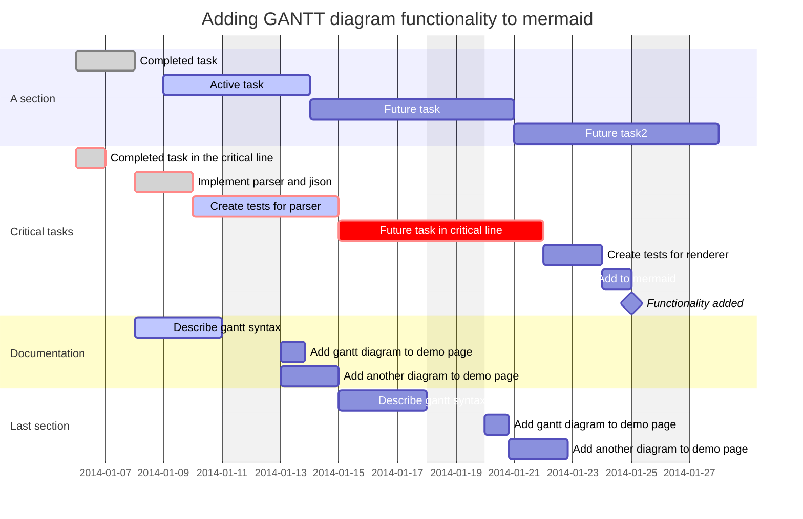

## パイチャート

```text
pie
    title Key elements in Product X
    "Calcium" : 42.96
    "Potassium" : 50.05
    "Magnesium" : 10.01
    "Iron" :  5
```
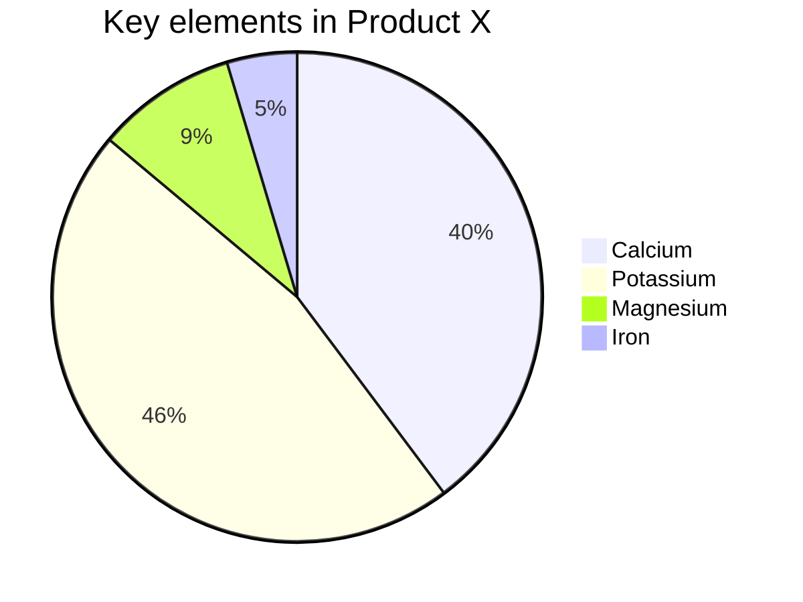

## Gitグラフ

```text
gitGraph
    commit id: "ZERO"
    branch develop
    branch release
    commit id:"A"
    checkout main
    commit id:"ONE"
    checkout develop
    commit id:"B"
    checkout main
    merge develop id:"MERGE"
    commit id:"TWO"
    checkout release
    cherry-pick id:"MERGE" parent:"B"
    commit id:"THREE"
    checkout develop
    commit id:"C"
```
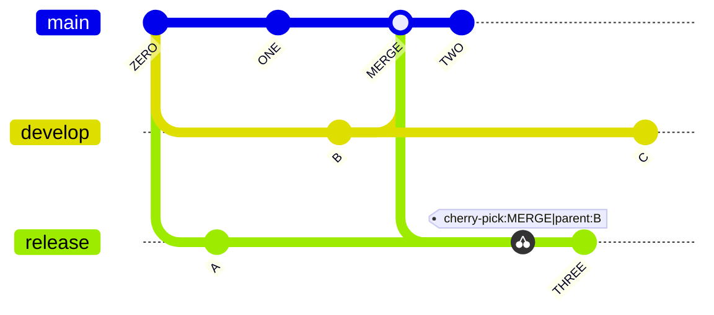

## マインドマップ

- [Mermaid Doc - Maindmap](https://mermaid.js.org/syntax/mindmap.html)

```text
mindmap
  root((mindmap))
    Origins
      Long history
      ::icon(fa fa-book)
      Popularisation
        British popular psychology author Tony Buzan
    Research
      On effectiveness<br/>and features
      On Automatic creation
        Uses
            Creative techniques
            Strategic planning
            Argument mapping
    Tools
      Pen and paper
      Mermaid
```
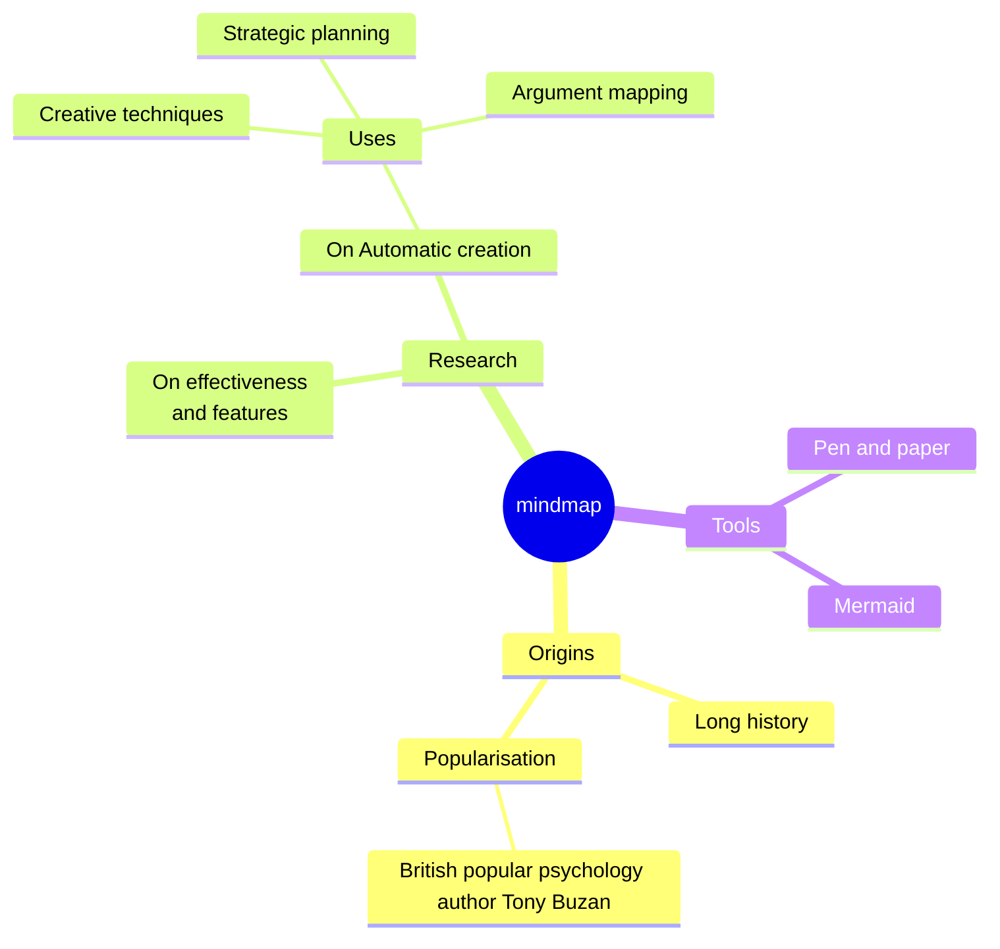

## ベータ機能(v11.2時点)

### XY チャート

```text
xychart-beta
    title "Sales Revenue"
    x-axis [jan, feb, mar, apr, may, jun, jul, aug, sep, oct, nov, dec]
    y-axis "Revenue (in $)" 4000 --> 11000
    bar [5000, 6000, 7500, 8200, 9500, 10500, 11000, 10200, 9200, 8500, 7000, 6000]
    line [5000, 6000, 7500, 8200, 9500, 10500, 11000, 10200, 9200, 8500, 7000, 6000]
```
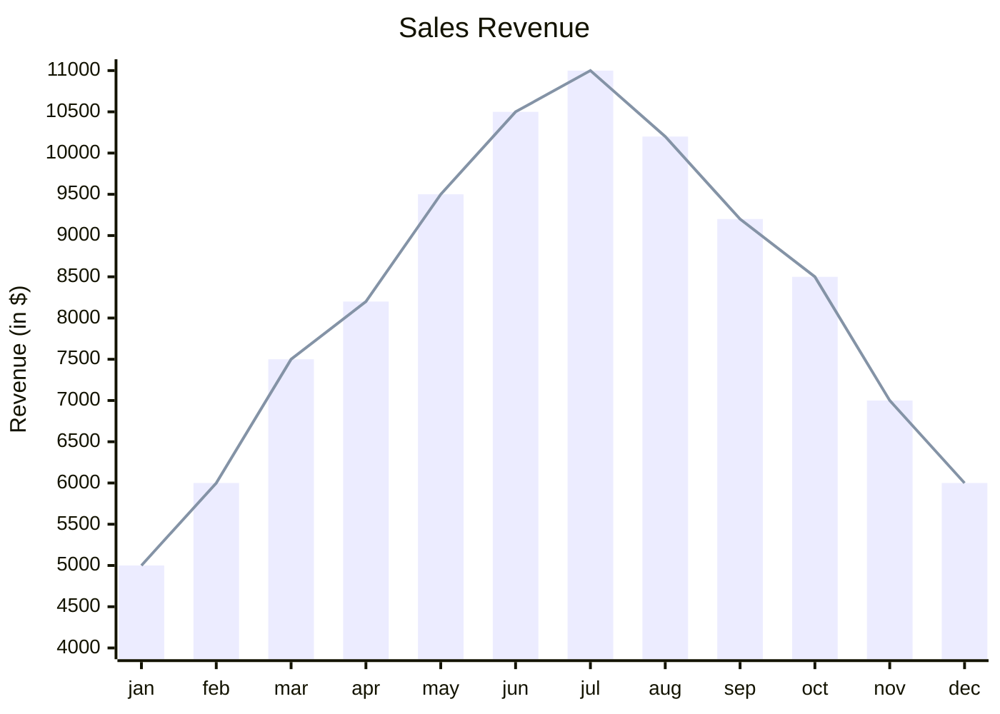

### アーキテクチャ図

- [Mermaid Doc - Architecture Diagrams Documentation (v11.1.0+)](https://mermaid.js.org/syntax/architecture.html)

現時点でアイコンは以下です。他にもご要望あれば追加します([ここ](https://icones.js.org/)から選択できます)。
- [ロゴ](https://icones.js.org/collection/logos)
- [Googleマテリアルデザインアイコン](https://icones.js.org/collection/mdi)

```text
architecture-beta
    group api(logos:aws)

    service emp(mdi:account-multiple)
    service user(mdi:account-multiple)
    service slack_app(logos:slack)
    service openai_api(logos:openai)
    service func1(logos:aws-lambda)[Callback] in api
    service sqs(logos:aws-sqs) in api
    service func2(logos:aws-lambda)[API executor] in api
    service db(logos:aws-dynamodb)[DynamoDB] in api
    service storage(logos:aws-s3)[Storage] in api
    service cdn(logos:aws-cloudfront) in api

    emp:R --> L:slack_app
    slack_app:R --> L:func1
    func1:R --> L:sqs
    sqs:R --> L:func2
    func2:T -- B:db
    func2:B -- R:storage
    func2:R --> L:openai_api
    storage:L -- R:cdn
    user:R --> L:cdn
```
```mermaid
architecture-beta
    group api(logos:aws)

    service emp(mdi:account-multiple)
    service user(mdi:account-multiple)
    service slack_app(logos:slack)
    service openai_api(logos:openai)
    service func1(logos:aws-lambda)[Callback] in api
    service sqs(logos:aws-sqs) in api
    service func2(logos:aws-lambda)[API executor] in api
    service db(logos:aws-dynamodb)[DynamoDB] in api
    service storage(logos:aws-s3)[Storage] in api
    service cdn(logos:aws-cloudfront) in api

    emp:R --> L:slack_app
    slack_app:R --> L:func1
    func1:R --> L:sqs
    sqs:R --> L:func2
    func2:T -- B:db
    func2:B -- R:storage
    func2:R --> L:openai_api
    storage:L -- R:cdn
    user:R --> L:cdn
```