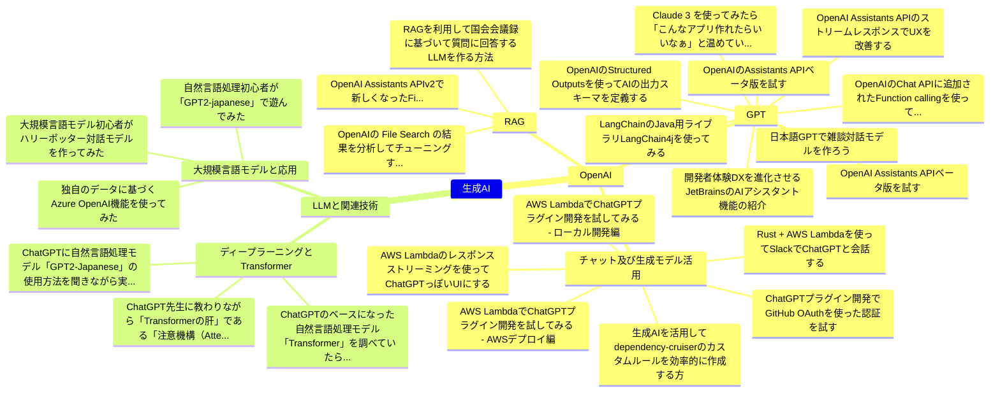
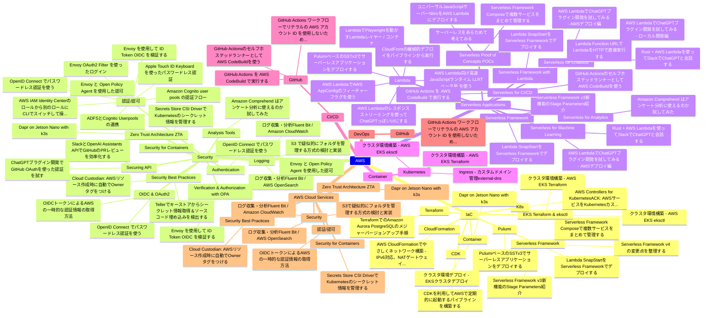
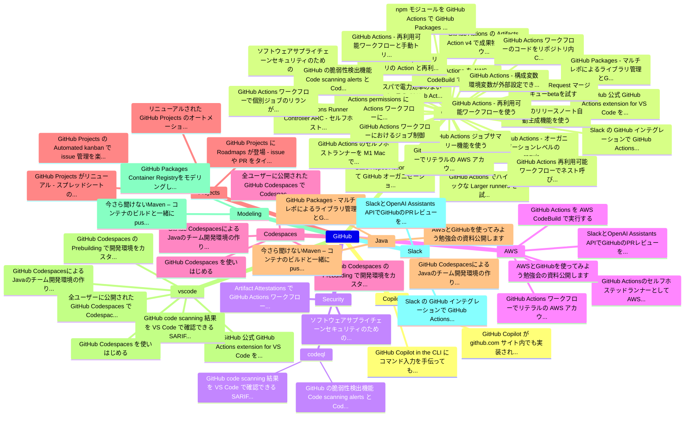

## 生成AI

```mermaid
mindmap
  生成AI
    OpenAI
      RAG
        OpenAIの File Search の結果を分析してチューニングす...
        OpenAI Assistants APIv2で新しくなったFi...
        RAGを利用して国会会議録に基づいて質問に回答するLLMを作る方法
      GPT
        OpenAIのStructured Outputsを使ってAIの出力スキーマを定義する
        LangChainのJava用ライブラリLangChain4jを使ってみる
        OpenAI Assistants APIのストリームレスポンスでUXを改善する
        開発者体験DXを進化させるJetBrainsのAIアシスタント機能の紹介
        OpenAI Assistants APIベータ版を試す
        OpenAIのChat APIに追加されたFunction callingを使って...
        OpenAIのAssistants APIベータ版を試す
        日本語GPTで雑談対話モデルを作ろう
        Claude 3 を使ってみたら「こんなアプリ作れたらいいなぁ」と温めてい...
      チャット及び生成モデル活用
        生成AIを活用してdependency-cruiserのカスタムルールを効率的に作成する方
        ChatGPTプラグイン開発でGitHub OAuthを使った認証を試す
        AWS LambdaでChatGPTプラグイン開発を試してみる - AWSデプロイ編
        AWS LambdaでChatGPTプラグイン開発を試してみる - ローカル開発編
        AWS Lambdaのレスポンスストリーミングを使ってChatGPTっぽいUIにする
        Rust + AWS Lambdaを使ってSlackでChatGPTと会話する
    LLMと関連技術
      ディープラーニングとTransformer
        ChatGPT先生に教わりながら「Transformerの肝」である「注意機構（Atte...
        ChatGPTに自然言語処理モデル「GPT2-Japanese」の使用方法を聞きながら実...
        ChatGPTのベースになった自然言語処理モデル「Transformer」を調べていたら...
      大規模言語モデルと応用
        独自のデータに基づくAzure OpenAI機能を使ってみた
        大規模言語モデル初心者がハリーポッター対話モデルを作ってみた
        自然言語処理初心者が「GPT2-japanese」で遊んでみた
```

## AWS

```mermaid
mindmap
  AWS
    IaC
      CloudFormation
        AWS CloudFormationでやさしくネットワーク構築 - IPv6対応、NATゲートウェイ...
      Pulumi
        PulumiベースのSSTv3でサーバーレスアプリケーションをデプロイする
      Terraform
        TerraformでのAmazon Aurora PostgreSQLのメジャーバージョンアップ手順
      CDK
        CDKを利用してAWSで定期的に起動するパイプラインを構築する
      Serverless Framework
        Serverless Framework v4 の変更点を整理する
        Lambda SnapStartをServerless Frameworkでデプロイする
        Serverless Framework Composeで複数サービスをまとめて管理する
        Serverless Framework v3新機能のStage Parameters紹介
      EKS Terraform & eksctl
        クラスタ環境構築 - AWS EKS Terraform
        クラスタ環境構築 - AWS EKS eksctl
      K8s
        AWS Controllers for KubernetesACK: AWSサービスをKubernetesカス...
      Container
        Dapr on Jetson Nano with k3s
        クラスタ環境デプロイ - EKSクラスタデプロイ
    Security
      認証/認可
        AWS IAM Identity Centerのロールから別のロールにCLIでスイッチして操...
        Amazon Cognito user pools の認証フロー
        ADFSとCognito Userpoolsの連携
        Envoy OAuth2 Filter を使ったログイン
        Envoy を使用して ID Token OIDC を検証する
        Envoy と Open Policy Agent を使用した認可
        Apple Touch ID Keyboard を使ったパスワードレス認証
        OpenID Connect でパスワードレス認証を使う
      Logging
        S3 で疑似的にフォルダを管理する方式の検討と実装
        ログ収集・分析Fluent Bit / Amazon CloudWatch
        ログ収集・分析Fluent Bit / AWS OpenSearch
      Security Best Practices
        Cloud Custodian: AWSリソース作成時に自動でOwnerタグをつける
        Tellerでキーストアからシークレット情報取得＆ソースコード埋め込みを検出する
      Security for Containers
        Secrets Store CSI DriverでKubernetesのシークレット情報を管理する
      Zero Trust Architecture ZTA
        Dapr on Jetson Nano with k3s
      OIDC & OAuth2
        OIDCトークンによるAWSの一時的な認証情報の取得方法
        OpenID Connect でパスワードレス認証を使う
      Verification & Authorization with OPA
        Envoy と Open Policy Agent を使用した認可
        Envoy を使用して ID Token OIDC を検証する
      Analysis Tools
        Amazon Comprehend はアンケート分析に使えるのか試してみた
      Securing API
        SlackとOpenAI Assistants APIでGitHubのPRレビューを効率化する
        ChatGPTプラグイン開発でGitHub OAuthを使った認証を試す
      Authentication
        OpenID Connect でパスワードレス認証を使う
    Serverless Applications
      Lambda
        LambdaでPlaywrightを動かすLambdaレイヤー / コンテナ
        PulumiベースのSSTv3でサーバーレスアプリケーションをデプロイする
        AWS Lambda向け高速JavaScriptランタイム LLRTベータ版 を使う
        CloudFrontの継続的デプロイをパイプラインから実行する
        AWS LambdaでAWS AppConfigのフィーチャーフラグを使う
        AWS Lambdaのレスポンスストリーミングを使ってChatGPTっぽいUIにする
      Serverless Proof of Concepts POCs
        サーバーレスをあらためて考えてみる
        ユニバーサルJavaScriptサーバーNitroをAWS Lambdaにデプロイする
        Serverless Framework Composeで複数サービスをまとめて管理する
      Serverless Framework
        Lambda SnapStartをServerless Frameworkでデプロイする
        Serverless Framework v3新機能のStage Parameters紹介
      Serverless for Chatbots
        Rust + AWS Lambdaを使ってSlackでChatGPTと会話する
        AWS LambdaでChatGPTプラグイン開発を試してみる - AWSデプロイ編
        AWS LambdaでChatGPTプラグイン開発を試してみる - ローカル開発編
      Serverless Framework with Lambda
        Lambda Function URLでLambdaをHTTPで直接実行する
        Lambda SnapStartをServerless Frameworkでデプロイする
      Serverless for Machine Learning
        Rust + AWS Lambdaを使ってSlackでChatGPTと会話する
        AWS LambdaでChatGPTプラグイン開発を試してみる - AWSデプロイ編
      Serverless for CI/CD
        GitHub Actions を AWS CodeBuild で実行する
        GitHub ActionsのセルフホステッドランナーとしてAWS CodeBuildを使う
      Serverless for Analytics
        Amazon Comprehend はアンケート分析に使えるのか試してみた
    Container
      Kubernetes
        クラスタ環境構築 - AWS EKS Terraform
        クラスタ環境構築 - AWS EKS eksctl
        Ingress - カスタムドメイン管理external-dns
    CI/CD
      GitHub
        GitHub Actions を AWS CodeBuild で実行する
        GitHub ActionsのセルフホステッドランナーとしてAWS CodeBuildを使う
        GitHub Actions ワークフローでリテラルの AWS アカウント ID を使用しないため...
    DevOps
      GitHub
        GitHub Actions ワークフローでリテラルの AWS アカウント ID を使用しないため...
    AWS Cloud Services
      認証/認可
        OIDCトークンによるAWSの一時的な認証情報の取得方法
      Security
        S3で疑似的にフォルダを管理する方式の検討と実装
        ログ収集・分析Fluent Bit / Amazon CloudWatch
        ログ収集・分析Fluent Bit / AWS OpenSearch
      Security Best Practices
        Cloud Custodian: AWSリソース作成時に自動でOwnerタグをつける
      Security for Containers
        Secrets Store CSI DriverでKubernetesのシークレット情報を管理する
      Zero Trust Architecture ZTA
        Dapr on Jetson Nano with k3s
```

## GitHub

```mermaid
mindmap
  GitHub
    Copilot
      GitHub Copilot が github.com サイト内でも実装され...
      GitHub Copilot in the CLI にコマンド入力を手伝っても...
    CI/CD
      高コスパで電力効率のよい Arm ベースの GitHub Act...
      GitHub Actions の Artifacts Action v4 で成果物が即時ダウ...
      GitHub Actions を AWS CodeBuild で実行する
      Actions permissions に GitHub Actions ワークフローに...
      GitHub Actions でハイスペックな Larger runners を試...
      Stale Repos Action を使って GitHub オーガニゼーショ...
      GitHub Actions Runner Controller ARC - セルフホスト...
      GitHub 公式 GitHub Actions extension for VS Code を...
      GitHub Actions ワークフローのコードをリポジトリ内 C...
      GitHub Packages - マルチレポによるライブラリ管理とG...
      GitHub Pull Request マージキューbetaを試す
      GitHub Actions - 構成変数環境変数が外部設定でき...
      GitHub Actions - オーガニゼーションレベルの requir...
      GitHub Actions - private リポジトリの Action と再利...
      Slack の GitHub インテグレーションで GitHub Actions...
      GitHub Actions ワークフローでリテラルの AWS アカウ...
      GitHub Actions 再利用可能ワークフローでネスト呼び...
      ソフトウェアサプライチェーンセキュリティのための...
      GitHub Actions のセルフホストランナーを M1 Mac で...
      npm モジュールを GitHub Actions で GitHub Packages ...
      GitHub の脆弱性検出機能 Code scanning alerts と Cod...
      GitHub Actions - 再利用可能ワークフローと手動トリ...
      GitHub Actions ジョブサマリー機能を使う
      GitHub Actions ワークフローで個別ジョブのリランが...
      GitHub のリリースノート自動生成機能を使う
      GitHub Actions - 再利用可能ワークフローを使う
      GitHub Actions ワークフローにおけるジョブ制御
    Security
      Artifact Attestations で GitHub Actions ワークフロー...
      codeql
        GitHub code scanning 結果を VS Code で確認できる SARIF...
        GitHub の脆弱性検出機能 Code scanning alerts と Cod...
      ソフトウェアサプライチェーンセキュリティのための...
    AWS
      GitHub ActionsのセルフホステッドランナーとしてAWS...
      SlackとOpenAI Assistants APIでGitHubのPRレビューを...
      AWSとGitHubを使ってみよう勉強会の資料公開します
      GitHub Actions を AWS CodeBuild で実行する
      GitHub Actions ワークフローでリテラルの AWS アカウ...
    Codespaces
      GitHub CodespacesによるJavaのチーム開発環境の作り...
      全ユーザーに公開された GitHub Codespaces で Codespac...
      GitHub Codespaces の Prebuilding で開発環境をカスタ...
      GitHub Codespaces を使いはじめる
    Projects
      GitHub Projects に Roadmaps が登場 - issue や PR をタイ...
      リニューアルされた GitHub Projects のオートメーショ...
      GitHub Projects がリニューアル - スプレッドシートの...
      GitHub Projects の Automated kanban で issue 管理を楽...
    Java
      AWSとGitHubを使ってみよう勉強会の資料公開します
      GitHub CodespacesによるJavaのチーム開発環境の作り...
      GitHub Packages - マルチレポによるライブラリ管理とG...
      今さら聞けないMaven – コンテナのビルドと一緒にpus...
    vscode
      GitHub 公式 GitHub Actions extension for VS Code を...
      GitHub CodespacesによるJavaのチーム開発環境の作り...
      全ユーザーに公開された GitHub Codespaces で Codespac...
      GitHub code scanning 結果を VS Code で確認できる SARIF...
      GitHub Codespaces の Prebuilding で開発環境をカスタ...
      GitHub Codespaces を使いはじめる
    Modeling
      GitHub Packages Container Registryをモデリングし...
      今さら聞けないMaven – コンテナのビルドと一緒にpus...
    Slack
      SlackとOpenAI Assistants APIでGitHubのPRレビューを...
      Slack の GitHub インテグレーションで GitHub Actions...
```

## コンテナ

```mermaid
mindmap
  container
    AWS
      LambdaでPlaywrightを動かすLambdaレイヤー / コン...
      AWSが公開したFinchでコンテナ実行/イメージビルドをする
      EKS BlueprintsCDKですぐ使える実用的なEKSクラスタ環境を簡単に手に入れる
      AWS Controllers for KubernetesACK: AWSサービスをKubernetesカスタムリソースで管理する
      Amazon ECRのライフサイクルポリシーで開発環境向けのイメージのみ削除する
      Secrets Store CSI DriverでKubernetesのシークレット情報を管理する
      Telepresence - EKSのワークロードをローカル環境でデバッグする
      S3 の静的 Web サイトをセキュアに Envoy でホスティング
      メトリクス収集・可視化 - OpenTelemetry / CloudWatch
      継続的デリバリ - ArgoCD
      クラスタ環境デプロイ - EKSクラスタAWS環境準備
      クラスタ環境デプロイ - EKSクラスタKustomize導入
      クラスタ環境デプロイ - EKSクラスタデプロイ
      クラスタ環境デプロイ - コンテナレジストリECR
      Dapr on Jetson Nano with k3s
      ローカル開発環境準備 - ローカルAWSLocalStack
      ストレージ - AWS EFS
      ストレージ - AWS EBS
      Ingress - AWS Load Balancer Controller
      クラスタ環境構築 - AWS EKS Terraform
      クラスタ環境構築 - AWS EKS eksctl
    k8s
      AWS Controllers for KubernetesACK AWSサービスをKubernetesカスタムリソースで管理する
      EKS BlueprintsCDKですぐ使える実用的なEKSクラスタ環境を...
      kubectl debugを使ってKubernetesのコンテナをデバッグする
      Ingressを強化したKubernetes Gateway APIを試してみる
      Camunda Platform のモダンなプロセスオーケストレーター  Zeebe による開発環境を構築する
      Secrets Store CSI DriverでKubernetesのシークレット情報を管理する
      SealedSecretsでKubernetesコンテナのシークレット情報をGit管理する
      Telepresence - EKSのワークロードをローカル環境でデバッグする
      セキュリティソフト ESET を利用している環境で Rancher Desktop lima を使う
      Strimzi - Kubernetes で Kafka を運用するための Operators
      サービスメッシュが解決しようとしている課題
      Flagger と Ingress Nginx でA/Bテストをする
      Flagger と Ingress Nginx でカナリアリリースをする
      Kubernetes v1.24がリリースされました
      Mizu水でマイクロサービスのトラフィックを分析する
      分散トレーシングOpenTelemetry / AWS X-Ray
      分散トレーシングOpenTelemetry / Jaeger
      ログ収集・分析Fluent Bit / Amazon CloudWatch
      ログ収集・分析Fluent Bit / AWS OpenSearch
      メトリクス収集・可視化 - OpenTelemetry / CloudWatch
      メトリクス収集・可視化 - Prometheus / Grafana
      KubernetesのPod SecurityPSS/PSA
      Podスケジューリング - NodeAffinity / TaintToleration
      オートスケーリング - Horizontal Pod AutoscalerHPA
      Karpenterのオートスケールを試してみました
      継続的デリバリ - ArgoCD
      継続的デリバリ - Flux
      Rancher Desktop 紹介
      クラスタ環境デプロイ - EKSクラスタAWS環境準備
      クラスタ環境デプロイ - EKSクラスタKustomize導入
      クラスタ環境デプロイ - EKSクラスタデプロイ
      クラスタ環境デプロイ - コンテナレジストリECR
      Kubernetesマニフェスト作成 - バッチアプリケーション
      Dapr on Jetson Nano with k3s
      Kubernetesマニフェスト作成 - Webアプリケーション
      ローカル開発環境準備 - ローカルAWSLocalStack
      ローカル開発環境準備 - 自動化ツールSkaffold
      ローカル開発環境準備 - 実行環境minikube
      concourse-k8s-resource
      setup-helmfile
      Velero による Kubernetes クラスタのバックアップ・リストア
      ストレージ - AWS EFS
      ストレージ - AWS EBS
      Ingress - HTTPS通信Cert Manager
      Ingress - AWS Load Balancer Controller
      Ingress - カスタムドメイン管理external-dns
      Kubernetes ネイティブなワークフローエンジン Argo Workflows
      Ingress - NGINX Ingress Controller
      クラスタ環境構築 - AWS EKS Terraform
      クラスタ環境構築 - AWS EKS eksctl
    Security
    docker
      OrbStack - macOS 専用の高速軽量なコンテナ & Linux VM 環境
      GitHub Packages Container Registryをモデリングしてみた – UMLを理解の道具として
      今さら聞けないMaven – コンテナのビルドと一緒にpushもMavenでしたい。
      今さら聞けないMaven – コンテナも一緒にビルドしたい。テスト実行前にコンテナを起動したい
      Windows への Docker CLI のインストール
    rancher-desktop
      M1 mac の Rancher Desktop で intel のコンテナイメージを実行する
      コンテナ内から Rancher Desktop のホストに接続する方法
      セキュリティソフト ESET を利用している環境で Rancher Desktop lima を使う
      Rancher Desktop 紹介
      S3 の静的 Web サイトをセキュアに Envoy でホスティング
    tips
      LambdaでPlaywrightを動かすLambdaレイヤー / コンテナ
    playwright
      LambdaでPlaywrightを動かすLambdaレイヤー / コンテナ
    テスト
      LambdaでPlaywrightを動かすLambdaレイヤー / コンテナ
    Kafka
      KRaft モードの Kafka をコンテナ環境にデプロイする
      Strimzi - Kubernetes で Kafka を運用するための Operators
    orbstack
      OrbStack - macOS 専用の高速軽量なコンテナ & Linux VM 環境
    GitHub
      GitHub Packages Container Registryをモデリングしてみた – UMLを理解の道具として
    java
      今さら聞けないMaven – コンテナのビルドと一緒にpushもMavenでしたい。
      今さら聞けないMaven – コンテナも一緒にビルドしたい。テスト実行前にコンテナを起動したい
    maven
      今さら聞けないMaven – コンテナのビルドと一緒にpushもMavenでしたい。
      今さら聞けないMaven – コンテナも一緒にビルドしたい。テスト実行前にコンテナを起動したい
    junit
      今さら聞けないMaven – コンテナのビルドと一緒にpushもMavenでしたい。
      今さら聞けないMaven – コンテナも一緒にビルドしたい。テスト実行前にコンテナを起動したい
    今さら聞けないMaven
      今さら聞けないMaven – コンテナのビルドと一緒にpushもMavenでしたい。
      今さら聞けないMaven – コンテナも一緒にビルドしたい。テスト実行前にコンテナを起動したい
    advent2022
      AWSが公開したFinchでコンテナ実行/イメージビルドをする
    Security
      AWS Controllers for KubernetesACK: AWSサービスをKubernetesカスタムリソースで管理する
      Secrets Store CSI DriverでKubernetesのシークレット情報を管理する
      SealedSecretsでKubernetesコンテナのシークレット情報をGit管理する
      Telepresence - EKSのワークロードをローカル環境でデバッグする
      KubernetesのPod SecurityPSS/PSA
    aws-cdk
      EKS BlueprintsCDKですぐ使える実用的なEKSクラスタ環境を簡単に手に入れる
    argocd
      EKS BlueprintsCDKですぐ使える実用的なEKSクラスタ環境を簡単に手に入れる
      継続的デリバリ - ArgoCD
    IaC
      AWS Controllers for KubernetesACK: AWSサービスをKubernetesカスタムリソースで管理する
      クラスタ環境構築 - AWS EKS Terraform
      クラスタ環境構築 - AWS EKS eksctl
    macOS
      セキュリティソフト ESET を利用している環境で Rancher Desktop lima を使う
    vscode
      OpenLibertyとVSCodeによるコンテナを用いた開発環境の構築
    msa
      サービスメッシュが解決しようとしている課題
    service-mesh
      サービスメッシュが解決しようとしている課題
    ZTA
      サービスメッシュが解決しようとしている課題
      Dapr on Jetson Nano with k3s
    CI/CD
      Flagger と Ingress Nginx でA/Bテストをする
      Flagger と Ingress Nginx でカナリアリリースをする
      継続的デリバリ - ArgoCD
      継続的デリバリ - Flux
      buildpacks-action
      concourse-k8s-resource
      setup-helmfile
    Flagger
      Flagger と Ingress Nginx でA/Bテストをする
      Flagger と Ingress Nginx でカナリアリリースをする
    nginx
      Flagger と Ingress Nginx でA/Bテストをする
      Flagger と Ingress Nginx でカナリアリリースをする
    tutorial
      分散トレーシングOpenTelemetry / AWS X-Ray
      分散トレーシングOpenTelemetry / Jaeger
      ログ収集・分析Fluent Bit / Amazon CloudWatch
      ログ収集・分析Fluent Bit / AWS OpenSearch
      メトリクス収集・可視化 - OpenTelemetry / CloudWatch
      メトリクス収集・可視化 - Prometheus / Grafana
      Podスケジューリング - NodeAffinity / TaintToleration
      オートスケーリング - Horizontal Pod AutoscalerHPA
      継続的デリバリ - ArgoCD
      継続的デリバリ - Flux
      クラスタ環境デプロイ - EKSクラスタAWS環境準備
      クラスタ環境デプロイ - EKSクラスタKustomize導入
      クラスタ環境デプロイ - EKSクラスタデプロイ
      クラスタ環境デプロイ - コンテナレジストリECR
      Kubernetesマニフェスト作成 - バッチアプリケーション
      Kubernetesマニフェスト作成 - Webアプリケーション
      ローカル開発環境準備 - ローカルAWSLocalStack
      ローカル開発環境準備 - 自動化ツールSkaffold
      ローカル開発環境準備 - 実行環境minikube
      Velero による Kubernetes クラスタのバックアップ・リストア
      ストレージ - AWS EFS
      ストレージ - AWS EBS
      Ingress - HTTPS通信Cert Manager
      Ingress - AWS Load Balancer Controller
      Ingress - カスタムドメイン管理external-dns
      Kubernetes ネイティブなワークフローエンジン Argo Workflows
      Ingress - NGINX Ingress Controller
      クラスタ環境構築 - AWS EKS Terraform
      クラスタ環境構築 - AWS EKS eksctl
    oss
      buildpacks-action
      concourse-k8s-resource
      setup-helmfile
```

