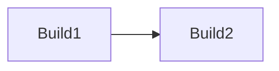
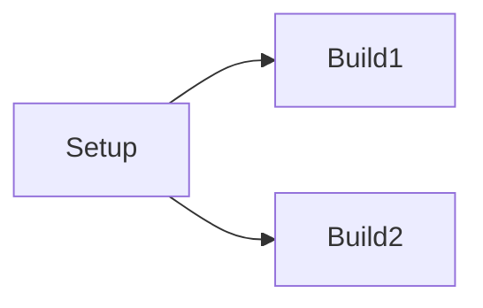
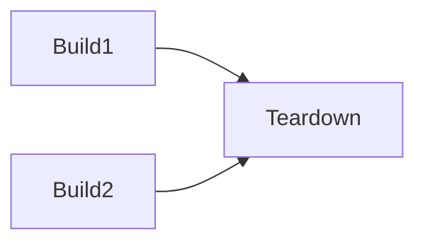
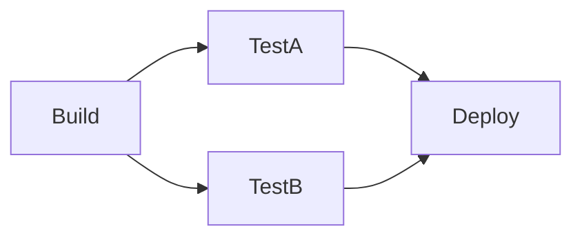
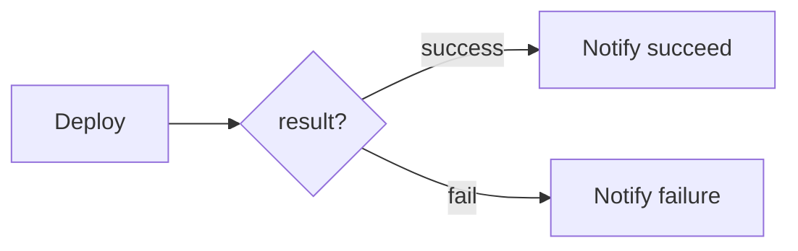

GitHub Actions ワークフローでは、複数のジョブを順次・並列・条件実行できます。各ジョブは異なるマシン(Runner) もしくは コンテナイメージで実行されます。それぞれ具体的に見ていきましょう。

[[TOC]]

:::info
本記事は、以下のブログ記事を再編・追記したものです。
[GitHub Actions ワークフローで複数のジョブ実行を制御する - kondoumh のブログ](https://blog.kondoumh.com/entry/2021/01/22/133427)
:::

## 順次実行 (シーケンシャル)



何も指定しなければ、ジョブは並列に実行されます。順次実行するには、`needs` キーワードで、先行のジョブを指定します。

```yaml
name: Sequential Jobs
on:
  push:

jobs:
  Build1:
    runs-on: ubuntu-latest
    steps:
    - run: echo Build1

  Build2:
    runs-on: ubuntu-latest
    needs: Build1
    steps:
    - run: echo Build2
```
ワークフロー実行結果です。


## 並列実行 (フォーク)

ジョブを実行後に複数のジョブを並列実行するには、各ジョブの `needs` に分岐元のジョブを指定します。

```yaml
name: Fork Jobs
on:
  push:

jobs:
  Setup:
    runs-on: ubuntu-latest
    steps:
    - run: echo Setup

  Build1:
    runs-on: ubuntu-latest
    needs: Setup
    steps:
    - run: echo Build1

  Build2:
    runs-on: ubuntu-latest
    needs: Setup
    steps:
    - run: echo Build2
```

ワークフロー実行結果です。


## 並列実行 (ジョイン)



並列ジョブをジョインして最終の処理を行うには `needs` にジョインしたいジョブを列挙します。

```yaml
name: Join Jobs
on:
  push:

jobs:
  Build1:
    runs-on: ubuntu-latest
    steps:
    - run: echo Build1

  Build2:
    runs-on: ubuntu-latest
    steps:
    - run: echo Build2

  Teardown:
    runs-on: ubuntu-latest
    needs: [Build1, Build2]
    steps:
    - run: echo Teardown
```

ワークフロー実行結果です。


## フォークとジョインの組合せ


CI でビルド後に複数のテストを並列実行して成功したらデプロイするような例です。

```yaml
name: Deploy
on:
  push:

jobs:
  Build:
    runs-on: ubuntu-latest
    steps:
    - run: echo Build

  TestA:
    runs-on: ubuntu-latest
    needs: Build
    steps:
    - run: echo Test A

  TestB:
    runs-on: ubuntu-latest
    needs: Build
    name: Run Test B
    steps:
    - run: echo Test B

  Deploy:
    runs-on: ubuntu-latest
    needs: [TestA, TestB]
    steps:
    - run: echo Deploy
```

ワークフロー実行結果です。


## 条件実行 (コンディション)

ワークフローの成功・失敗を最後に通知するような例です。



GitHub Actions ではワークフローの状態は内包するジョブの失敗・成功に依存します。1つでもジョブが失敗していれば、ワークフローの状態は失敗です。ワークフローの状態は success / failure などの関数で取得できるため、`if` 条件文でジョブの実行条件を指定します。


```yaml
  Deploy:
    runs-on: ubuntu-latest
    needs: [TestA, TestB]
    steps:
    - name: Deploy
      run: echo Deploy

  Notify_succeed:
    if: ${{ success() }}
    runs-on: ubuntu-latest
    needs: Deploy
    steps:
    - name: Notify to Slack channel
      uses: rtCamp/action-slack-notify@v2
      env:
        SLACK_WEBHOOK: ${{ secrets.SLACK_WEBHOOK_URL }}
        SLACK_USERNAME: GitHUb Actions
        SLACK_TITLE: Workflow Succeeded
        SLACK_ICON: https://github.githubassets.com/images/modules/logos_page/GitHub-Mark.png
        SLACK_MESSAGE: 'Run number : #${{ github.run_number }}'

  Notify_failure:
    if: ${{ failure() }}
    runs-on: ubuntu-latest
    needs: Deploy
    steps:
    - name: Notify to Slack channel
      uses: rtCamp/action-slack-notify@v2
      env:
        SLACK_WEBHOOK: ${{ secrets.SLACK_WEBHOOK_URL }}
        SLACK_USERNAME: GitHUb Actions
        SLACK_TITLE: Workflow failed
        SLACK_ICON: https://github.githubassets.com/images/modules/logos_page/GitHub-Mark.png
        SLACK_COLOR: danger
        SLACK_MESSAGE: 'Run number : #${{ github.run_number }}'
```


Notify_succeed ジョブと Notify_failure ジョブで、通知内容を結果に応じてタイトルに設定しています。GitHub Actions のビルド番号を `github.run_number` という組み込みの変数で取得して Slack のメッセージに出力しています。


Slack への通知に、以下の Action を利用しました。

[Slack Notify - GitHub Marketplace](https://github.com/marketplace/actions/slack-notify)

ワークフロー成功時の実行結果です。


Slack への通知例です。


ワークフロー失敗時の実行結果です。TestB が失敗したので Deploy はスキップされ、失敗通知が実行されました。


Slack への通知例です。


ワークフローの成功・失敗に関わらず何らかのジョブを実行したい場合は、always 関数を使って以下のように定義できます。


```yaml
  Run_always:
    if: ${{ always() }}
    runs-on: ubuntu-latest
```
